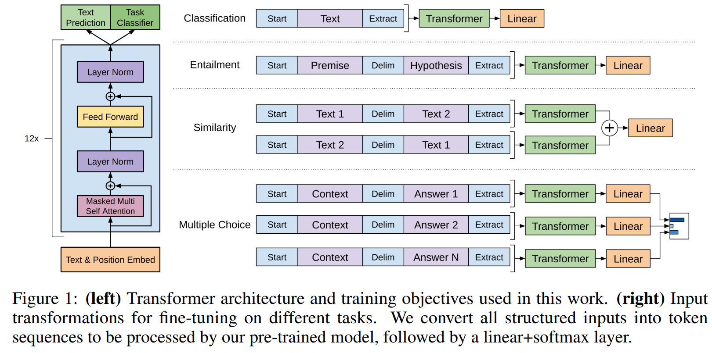
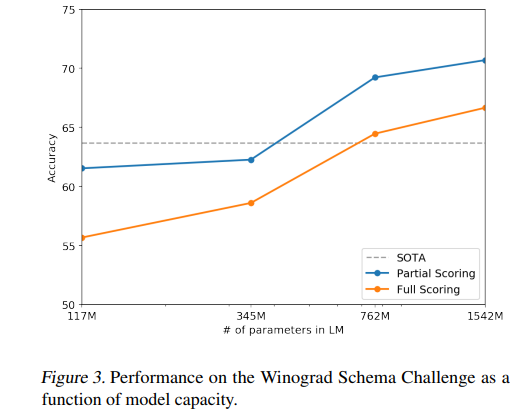
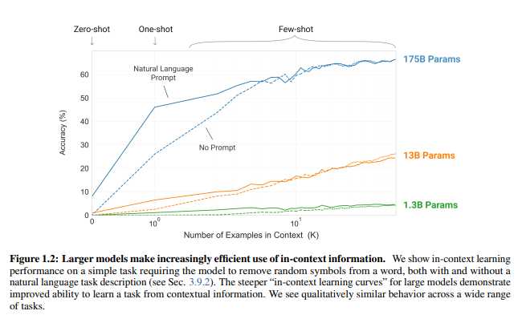
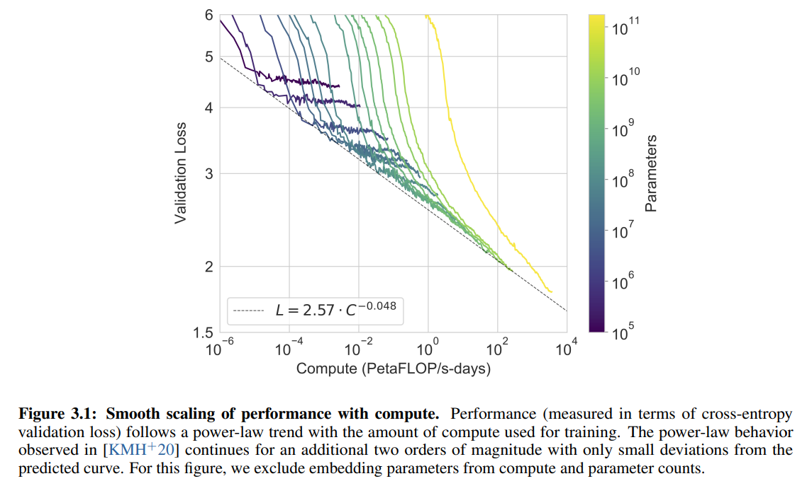
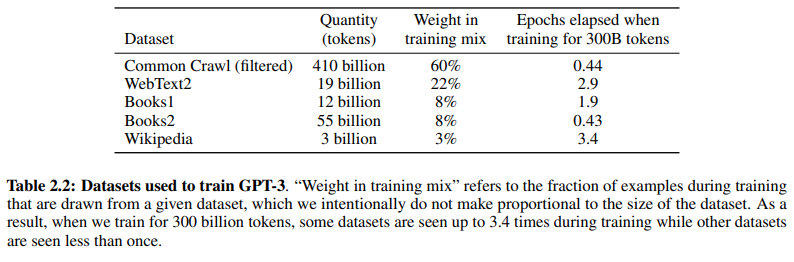

# GPT

openai想要解决强人工智能

## GPT-1

- **Improving Language Understanding by Generative Pre-Training**. Alec Radford et.al. **OpenAI**, **2018**, ([Paper](https://cdn.openai.com/research-covers/language-unsupervised/language_understanding_paper.pdf)).

  - Takeaway:

    GPT-1 的核心贡献不是单纯把 Transformer 用到 NLP，而是提出了一个很清晰的 recipe：先用大规模无监督文本做 `generative pre-training`，再用极小的 task head 做 supervised fine-tuning。它基本奠定了后续 GPT 系列 `pre-train first, adapt later` 的主线。

  - Motivation:

    在 GPT-1 之前，NLP 很依赖 task-specific architecture、feature engineering 和大量标注数据。作者真正想回答的问题是：如果先在无监督语料上学到通用 language representation，再迁移到下游任务，能不能减少对特定任务设计和标注规模的依赖？

    - Labeled data is scarce for many NLP tasks, but unlabeled text is abundant.
    - Prior transfer methods often only reused word embeddings or required complex task-specific architectures.
    - A stronger sequence model with long-range memory may transfer better than LSTM-based pretraining.

  - Core Mechanism:

    - Generative pre-training with a decoder-only Transformer

      - What:

        GPT-1 使用一个 12-layer masked Transformer decoder $(L=12,H=768,A=12)$，在 BooksCorpus 上做标准 left-to-right language modeling。它的数学本质就是最大化自回归条件概率：

        $$
      L_1(U) = \sum_i \log P(u_i \mid u_{i-k}, \ldots, u_{i-1}; \Theta)
        $$

        也就是说，模型通过“只看前文预测下一个 token”的方式，把语义、句法和长程依赖都压进 hidden states 里。
    
      - Why:

        作者的判断是：如果 backbone 本身是一个足够强的 generative model，那么它学到的表示就不只是 token-level pattern，而会变成可以迁移的通用表示。这比只迁移 word embedding 更强，也比 task-specific architecture 更通用。

      - How:

        在训练时，模型直接把文本序列送进 masked self-attention decoder，逐 token 优化 next-token prediction；训练完成后，不换 backbone，只把同一个 Transformer 拿去服务不同下游任务。

    - Self supervised learning(虽然原文用的是semi-supervised learning)

      Fine-tuning with minimal architecture change

      - What:

        GPT-1 不为每个任务重新设计复杂结构，而是在 pre-trained Transformer 顶部接一个简单的线性预测头，并且在 fine-tuning 时可选保留 auxiliary LM objective：

        $$
      L_3(C) = L_2(C) + \lambda L_1(C)
        $$
    
        这里的数学本质是：用监督目标 $L_2$ 驱动任务适配，同时用语言模型目标 $L_1$ 约束表示不要偏离原来的通用语言空间太远。

      - Why:

        只靠 supervised objective 容易在小数据任务上 overfit，也容易让模型丢掉 pre-training 学到的通用结构。加入 auxiliary LM term 可以让迁移更稳定，收敛更快。

      - How:

        具体做法是：先加载 pre-trained parameters，再把目标任务输入整理成 token sequence，最后用 task head 对最终 hidden state 或对应位置的表示做预测，同时在优化时混合监督损失和 LM 损失。

    - Task-aware input transformation、

      

      - What:

        GPT-1 的另一个关键创新点是“统一输入接口”：不管是 entailment、similarity、multiple-choice QA 还是 classification，最终都被改写成单个 token sequence 输入同一个 decoder-only Transformer。它的数学本质不是新公式，而是把多任务统一映射到同一个自回归序列建模空间。

      - Why:

        如果每个任务都配一个专门架构，就无法真正体现 pre-training 的通用性。把任务统一成序列，可以最大化复用同一个 backbone，也让 transfer learning 变成真正 task-agnostic。

      - How:
    
        实操上，作者为不同任务设计 sequence formatting 规则，把 premise/hypothesis、question/answer choices 或句子对拼接成一个输入序列，再交给同一个 Transformer 处理，而不是换新的编码器结构。

  - Pipeline:

    1. 在 BooksCorpus 上训练一个 decoder-only Transformer，目标是 next-token prediction。
    2. 用 token embedding + positional embedding 表示输入序列，并通过 masked self-attention 建模前文上下文。
    3. 把不同下游任务统一改写成 token sequence，而不是为任务单独改 backbone。
    4. 在 pre-trained 模型顶部接轻量 task head，对标注数据做 end-to-end fine-tuning。
    5. 需要时保留 auxiliary LM loss，让迁移更稳定、泛化更好。

  - Pros:

    - 明确建立了 decoder-only Transformer 的 `pre-train then fine-tune` 范式。
    - 用同一个 task-agnostic backbone 覆盖 entailment、QA、similarity、classification 等多类任务。
    - 在只做极少 task-specific architectural change 的前提下，就在 12 个任务中的 9 个取得明显提升。
    - 实证上说明 Transformer decoder 在这类迁移学习设定里比 LSTM-based unsupervised pretraining 更有效。

  - Cons:

    - 仍然依赖每个下游任务的 supervised fine-tuning，所以还不是后来的 zero-shot / in-context GPT 用法。
    - 只使用 left-to-right context，在某些理解类任务上天然弱于后来的 bidirectional encoder。
    - 无论 pre-training data 还是 model scale，按后来的 GPT 标准看都还比较小。
    - 虽然统一 sequence formatting 很优雅，但最终性能仍然明显依赖 labeled target-task data。

## GPT-2

- **Language Models are Unsupervised Multitask Learners**. Alec Radford et.al. **OpenAI**, **2019**, ([Paper](https://cdn.openai.com/better-language-models/language_models_are_unsupervised_multitask_learners.pdf)) ([Code](https://github.com/openai/gpt-2)).

  - Takeaway:

    GPT-2 的关键转折是：作者开始明确主张，一个足够大的 autoregressive language model 可以不做参数更新，只靠 prompt/context 就在很多任务上表现出 zero-shot transfer。它把 GPT 从 `pre-train + fine-tune` 推向了 `pre-train once + prompt at inference time`。

    > [!TIP]
    >
    > 卖点就是zero-shot，因为仅仅把模型和数据变大相比于BERT没有特别惊艳的效果

  - Motivation:
  
    GPT-1 证明了 pretraining 有效，但仍然要对每个任务做 supervised fine-tuning。GPT-2 想进一步问：如果数据规模和模型规模都继续放大，一个模型能不能直接从自然语言上下文里“读懂任务”，而不是每次都重新训练？

    - Single-task supervised datasets produce brittle narrow experts.
    - Multitask supervised training does not scale easily because every new task needs explicit labeled examples.
    - Natural text on the web already contains many latent demonstrations of tasks like QA, translation, and summarization.

  - Core Mechanism:

    - Scaled autoregressive language modeling

      - What:
  
        GPT-2 保留了 GPT-1 的 decoder-only, left-to-right language modeling objective，但把 model size 和 data scale 明显放大。它依然在做标准自回归分解：

        $$
        p(x) = \prod_{i=1}^{n} p(s_i \mid s_1, \ldots, s_{i-1})
        $$

        数学本质没有变，还是 next-token prediction；真正的变化是作者提出了一个更强的经验性命题：**scale itself changes behavior**。

      - Why:

        作者认为 GPT-1 的局限不在 objective 本身，而在 scale 还不够大。只要 language model 的容量和训练语料足够大，它就可能从海量文本中隐式学到很多任务模式，而不必依赖 task-specific supervision。

    - WebText + byte-level BPE

      - What:

        GPT-2 在数据和 tokenization 上做了两个关键设计：一是使用 **WebText**，二是使用 **byte-level BPE**。前者提供更广泛的自然任务分布，后者让模型能对任意 Unicode string 建模，减少预处理假设。

      - Why:

        如果训练数据过于狭窄，模型学到的只是单一文体；如果 tokenization 过于依赖语言特定规则，模型的通用性会受限。WebText + byte-level BPE 的组合，本质上是在扩大输入分布覆盖面。

      - How:

        作者从 Reddit 高质量外链页面构建 WebText，并使用 byte-level BPE 对原始字符串编码后再送进 Transformer。这样模型在训练时看到的是更接近真实 web language distribution 的数据流。百万级别的文本

    - Zero-shot task transfer through prompting

      - What:

        GPT-2 最重要的使用范式变化是：不再默认给每个任务加新 head 再 fine-tune，而是把任务直接写进上下文，比如 `translate to french, ...`，然后让模型继续生成。数学上它仍然是在最大化条件续写概率，但输入上下文本身开始承担“任务定义”的作用。

      - Idea:

        如果一个大模型真的学到了足够 general 的 language prior，那么它应该能从 prompt 里推断出任务，而不是必须经过 supervised parameter update。这个思路就是后来 prompt-based LLM usage 的雏形。

      - How:

        在 inference 时，把任务说明、示例输入输出或者自然语言指令放进 context，模型再基于这些上下文继续生成或打分。最大的 GPT-2 模型有 **1.5B parameters**、**48 layers**、**1600 hidden size** 和 **1024-token context**。

        

        这张图不是 architecture 图，但它很好地说明了 GPT-2 的核心经验事实：随着 model size 增长，zero-shot performance 在多个任务上持续变强。

  - Pipeline:

    1. 构建 WebText，让训练语料覆盖更多 domain 和潜在 task pattern。
    2. 用 byte-level BPE 对文本编码，再输入大规模 decoder-only Transformer。
    3. 全程只做 left-to-right next-token prediction，不引入任务专用目标。
    4. 在评估时把 translation、QA、summarization 等任务改写成 prompt/context 形式。
    5. 直接通过 continuation generation 或 scoring 完成 zero-shot task transfer。

  - Pros:

    - 清楚展示了：只要 scale 足够大，autoregressive language model 就能获得相当强的 zero-shot transfer。
    - 在论文设定下，不再需要为每个任务单独做 task-specific fine-tuning。
    - WebText + byte-level BPE 让模型比早期 curated corpus 方案更 general-purpose。
    - 基本确立了后续 LLM 的 prompt-based 使用观。

  - Cons:

    - 虽然 zero-shot 很有希望，但在不少任务上仍明显弱于强 supervised system。
    - 核心方法仍然只是 decoder-only left-to-right modeling，reasoning 和 calibration 仍受 pure next-token training 限制。
    - Web-scale data 会带来 contamination、data quality、memorization 等问题。
    - 论文展示的是经验性的 emergent multitask behavior，而不是一个新的 principled objective。

## GPT-3

- **Language Models are Few-Shot Learners**. Tom B. Brown et.al. **NeurIPS**, **2020**, ([Arxiv](https://arxiv.org/abs/2005.14165)) ([OpenAI](https://openai.com/research/language-models-are-few-shot-learners)).

  - Takeaway:

    GPT-3 的真正震撼点不在于换了新 architecture，而在于把同样的 autoregressive decoder-only recipe 一路放大到 **175B parameters** 后，模型开始在 zero-shot、one-shot、few-shot 设定下展现出明显更强的 in-context learning 能力。它让“prompt 就是 task interface”这件事第一次变得非常具体。

  - Motivation:

    GPT-2 已经说明 prompt-based zero-shot 是可能的，但效果仍然不稳定，也远没到可以广泛替代 supervised system 的程度。GPT-3 进一步问：如果模型继续大幅放大，它会不会在 context 中“学会学习”，从几条 demonstration 里快速适配新任务？

    - Standard `pre-train + fine-tune` pipelines still require labeled task-specific datasets.
    - Humans can often infer a task from instructions or a few demonstrations, while NLP systems usually could not.
    - If a single language model can learn to adapt from context alone, deployment becomes much simpler than retraining a separate model per task.

  - Core Mechanism:

    - Same decoder-only autoregressive Transformer, but scaled much further

      - What:

        GPT-3 在 architecture 上基本沿用 GPT-2，依然是标准 left-to-right decoder-only Transformer，训练目标也仍然是自回归 next-token prediction：

        $$
        p(x) = \prod_{i=1}^{n} p(x_i \mid x_{<i})
        $$

        数学本质没有变化，还是通过条件概率链式分解学习 token 序列；真正变化的是 model size、dataset size 和 compute 被推到了一个新量级，最大模型达到 **175B parameters**。

      - Why:

        这篇 paper 的核心科学问题不是“换个 objective 能不能更强”，而是“如果 objective 不变、只继续 scaling，会不会出现 qualitatively different transfer behavior”。作者用 GPT-3 去回答的就是这个问题。

      - How:

        实现上，GPT-3 延续 GPT-2 架构和训练方式，只是在参数量、层数、数据规模和训练计算上全面放大，然后系统测试这种 scale 是否带来 few-shot transfer 提升。

    - In-context learning instead of parameter updates

      - What:

        GPT-3 最关键的能力表述是 **in-context learning**：模型在推理时不更新参数，而是把 task instruction 和少量 demonstration 放进 context，再直接预测后续输出。数学上它依然只是做 continuation prediction，但 context 现在承担了“临时 task specification + adaptation signal”的角色。

      - Why:

        如果模型真的能从上下文中 infer task pattern，那它就不需要为每个任务单独 fine-tune 一次。这样不仅更接近人类“看几个例子就上手”的学习方式，也极大简化了模型使用方式。

      - How:

        作者在 evaluation 时分别构造 zero-shot、one-shot 和 few-shot prompt，把不同数量的 demonstrations 拼接到输入上下文里，再让模型继续生成或打分，不发生任何 gradient update。

        

        它直接体现了论文主结论：随着模型规模变大，feaixw-shot performance 在 SuperGLUE 等任务上显著上升。

    - train

      

      验证损失是与计算量的指数成线性关系的

    - Broad benchmark transfer as the evaluation target

      - What:

        GPT-3 不把自己定义成某个单任务模型，而是用 translation、QA、cloze、commonsense reasoning、word manipulation、arithmetic 等一整组 benchmark 来评估 transfer。它的本质是把“few-shot generality”当作主指标，而不是单一任务 SOTA。

      - Why:

        如果只在某个 benchmark 上成功，很可能只是 dataset-specific fit；只有在很多任务族上都出现提升，才能支撑“scale 让模型获得通用 context-based adaptation”这个结论。

      - How:
  
        论文把多个任务统一转成文本接口，分别测试 zero-shot / one-shot / few-shot 设定，并比较不同模型规模下的表现曲线，从而把 scaling 和 transfer behavior 关联起来。
  
  - Pipeline:

    1. data: common crawl爬下来的高质量数据做清洗，用了三步

       1. 训练一个二分类：reddit上高质量网页(Karmma>3)作为正例，common crawl作为负例。然后用分类器预测common crawl的句子，如果预测为正说明相对质量还是比较高的
       2. 去重：如果两篇文章很相似，就去掉一个，用lsh判断一个集合和另一个集合的相似度
       3. 加了一些已知的高质量数据
  
       
    2. 在大规模 web corpus 上训练一个超大 decoder-only Transformer，目标仍然是标准 next-token prediction。
    3. 下游评估时保持参数冻结，不做 task-specific fine-tuning。
    4. 把每个任务改写成文本 prompt，可包含 instruction 和少量 demonstrations。
    5. 将完整 prompt 输入模型，让它继续 autoregressive generation 或 scoring。
    6. 分别在 zero-shot、one-shot、few-shot 设定下比较任务表现，并观察 scaling 带来的行为变化。
  
  - Pros:
  
    - 真正把 in-context learning 提升成了可以和 task-specific fine-tuning 对抗的一种使用范式。
    - 用同一个 shared decoder-only model，在很多 NLP 任务上展示了明显的 scaling gain。
    - 在大量原本依赖 supervised adaptation 的 benchmark 上，few-shot transfer 已经变得相当强。
    - 让 prompting，而不是 architecture redesign，成为使用大语言模型的主要接口。
  
  - Cons:
  
    - 方法本身主要是 empirical scaling result，而不是新的 principled learning objective。
    - few-shot performance 虽强，但仍然不稳定，部分 benchmark 依然明显落后于 specialized supervised systems。
    - 大规模 web corpus 会带来 contamination、bias、memorization 和 evaluation validity 等问题。
    - 训练和部署成本极高，使得这篇 paper 的 recipe 很难在普通研究环境中复现。

## Codex

- https://arxiv.org/abs/2107.03374

## GPT-4

just a technical report paper 

- https://arxiv.org/abs/2303.08774
