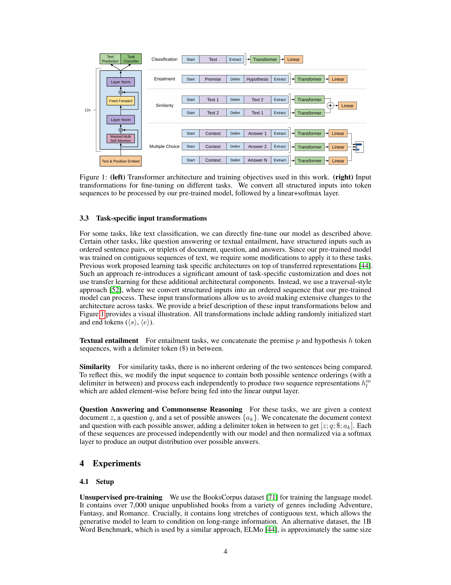
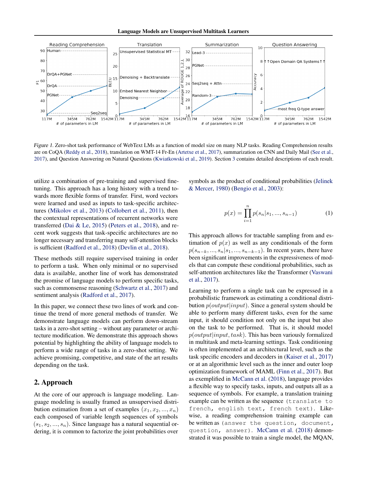

# GPT

## GPT-1

- **Improving Language Understanding by Generative Pre-Training**. Alec Radford et.al. **OpenAI**, **2018**, ([Paper](https://cdn.openai.com/research-covers/language-unsupervised/language_understanding_paper.pdf)).

  - Takeaway:

    GPT-1 shows that a decoder-only Transformer can first be pre-trained as a generative language model on large unlabeled text, then fine-tuned with only a lightweight task head to improve many NLP understanding tasks. This paper is the starting point of the modern `pre-train on text, adapt to downstream tasks` GPT line.

  - Motivation:

    在 GPT-1 之前，NLP 很依赖 task-specific architecture 和大量标注数据。作者想回答一个更 general 的问题：如果先在大规模无监督文本上学到通用语言表示，再迁移到具体任务，能不能减少对人工设计和标注的依赖？

    - Labeled data is scarce for many NLP tasks, but unlabeled text is abundant.
    - Prior transfer methods often only reused word embeddings or required complex task-specific architectures.
    - A stronger sequence model with long-range memory may transfer better than LSTM-based pretraining.

  - Core Mechanism:

    - Generative pre-training with a decoder-only Transformer

      GPT-1 uses a 12-layer masked Transformer decoder $(L=12,H=768,A=12)$ and pre-trains it with the standard left-to-right language modeling objective on BooksCorpus. The model learns to predict the next token from previous context only.

      $$
      L_1(U) = \sum_i \log P(u_i \mid u_{i-k}, \ldots, u_{i-1}; \Theta)
      $$

      这个目标非常朴素，但关键 insight 是：只要 language model 足够强，学到的 hidden states 就会包含可迁移的语义和长程依赖信息。

    - Fine-tuning with minimal architecture change

      After pre-training, GPT-1 feeds the final hidden state into a simple linear+softmax task head for supervised tasks, and optionally keeps a small auxiliary LM term during fine-tuning.

      $$
      L_3(C) = L_2(C) + \lambda L_1(C)
      $$

      其中 $L_2$ 是监督任务目标，$L_1$ 是 language modeling auxiliary objective。作者发现这个 auxiliary term can improve generalization and accelerate convergence.

      

      This figure shows both halves of the GPT-1 recipe: left-to-right Transformer language-model pretraining on the left, and task-specific sequence formatting with the same backbone on the right.

    - Task-aware input transformation

      GPT-1 的一个很重要但常被忽视的点是：作者没有为不同任务设计大改架构，而是把 entailment、similarity、multiple-choice QA 等结构化输入都转换成单个 token sequence，再交给同一个 decoder-only Transformer 处理。

  - Pipeline:

    1. Train a masked self-attention Transformer decoder on large unlabeled text with next-token prediction.
    2. Use token embeddings plus position embeddings as the input sequence representation.
    3. Convert each downstream task into a token sequence format compatible with the pre-trained model.
    4. Add a small linear prediction head and fine-tune all parameters end-to-end on labeled data.
    5. Optionally keep the auxiliary LM objective during fine-tuning to stabilize transfer.

  - Pros:

    - Establishes the modern pretrain-then-finetune paradigm for decoder-only Transformers.
    - Uses one task-agnostic backbone across entailment, QA, similarity, and classification tasks.
    - Achieves strong gains on 9 of 12 evaluated tasks with minimal task-specific architectural change.
    - Demonstrates that Transformer decoders transfer better than prior LSTM-based unsupervised pretraining in this setting.

  - Cons:

    - Still relies on supervised fine-tuning for each downstream task, so it is not yet the zero-shot GPT style.
    - Uses only left-to-right context, which is weaker than later bidirectional encoders for some understanding tasks.
    - Pre-training data scale and model scale are still small by later GPT standards.
    - The task formatting trick is elegant, but downstream performance still depends on labeled target-task data.

## GPT-2

- **Language Models are Unsupervised Multitask Learners**. Alec Radford et.al. **OpenAI**, **2019**, ([Paper](https://cdn.openai.com/better-language-models/language_models_are_unsupervised_multitask_learners.pdf)) ([Code](https://github.com/openai/gpt-2)).

  - Takeaway:

    GPT-2 argues that if an autoregressive language model is scaled up enough and trained on a broad web corpus, it can perform many downstream tasks in a zero-shot setting without parameter updates or architecture changes. The paper shifts GPT from `pre-train + supervised fine-tune` toward `pre-train once, prompt with natural language, and test zero-shot`.

  - Motivation:

    GPT-1 still needed supervised fine-tuning for each task. GPT-2 asks a harder question: can a single language model learn enough from web-scale text to infer tasks directly from natural-language context and demonstrations?

    - Single-task supervised datasets produce brittle narrow experts.
    - Multitask supervised training does not scale easily because every new task needs explicit labeled examples.
    - Natural text on the web already contains many latent demonstrations of tasks like QA, translation, and summarization.

  - Core Mechanism:

    - Scaled autoregressive language modeling

      GPT-2 keeps the same fundamental left-to-right language modeling idea, but scales the model and data much more aggressively. It factorizes the joint probability of a sequence into autoregressive conditionals:

      $$
      p(x) = \prod_{i=1}^{n} p(s_i \mid s_1, \ldots, s_{i-1})
      $$

      The key claim is not a new objective, but that **scale itself changes behavior**: sufficiently large language models begin to perform multitask transfer from context alone.

    - WebText + byte-level BPE

      GPT-2 trains on **WebText**, a large high-quality web corpus built from Reddit-linked pages, and uses a byte-level BPE input representation so the model can assign probability to any Unicode string with minimal preprocessing assumptions.

    - Zero-shot task transfer through prompting

      Instead of fine-tuning new task heads, GPT-2 frames tasks directly in natural language context, e.g. `translate to french, ...`, and samples or scores continuations accordingly. The paper’s largest model has **1.5B parameters** with **48 layers**, **1600 hidden size**, and **1024-token context window**.

      

      This figure is the paper’s central empirical message: as model size grows, zero-shot performance improves consistently across reading comprehension, translation, summarization, and question answering.

  - Pipeline:

    1. Build a large diverse web corpus (WebText) to expose the model to many domains and latent task demonstrations.
    2. Encode text with byte-level BPE and feed it into a large decoder-only Transformer.
    3. Train the model purely with left-to-right next-token prediction on WebText.
    4. At evaluation time, express tasks as natural-language prompts or input-output patterns in the context.
    5. Generate or score continuations directly, without supervised fine-tuning or task-specific architectural changes.

  - Pros:

    - Shows that scaling autoregressive language models enables surprisingly strong zero-shot transfer.
    - Removes the need for task-specific fine-tuning in the paper’s evaluation setup.
    - Uses a broad web corpus and byte-level BPE, which makes the model more general-purpose than earlier curated-corpus setups.
    - Establishes the modern prompt-based view of using large language models.

  - Cons:

    - Zero-shot performance is promising but still far below strong supervised systems on several tasks in the paper.
    - The core method is still decoder-only left-to-right modeling, so reasoning and calibration are limited by pure next-token training.
    - Web-scale data introduces contamination, quality, and memorization concerns that the paper itself discusses.
    - The paper demonstrates emergent multitask behavior, but the mechanism is mostly empirical scaling rather than a new principled training objective.

## GPT-3

- https://arxiv.org/abs/2005.14165

## GPT-4

just a technical report paper 

- https://arxiv.org/abs/2303.08774
