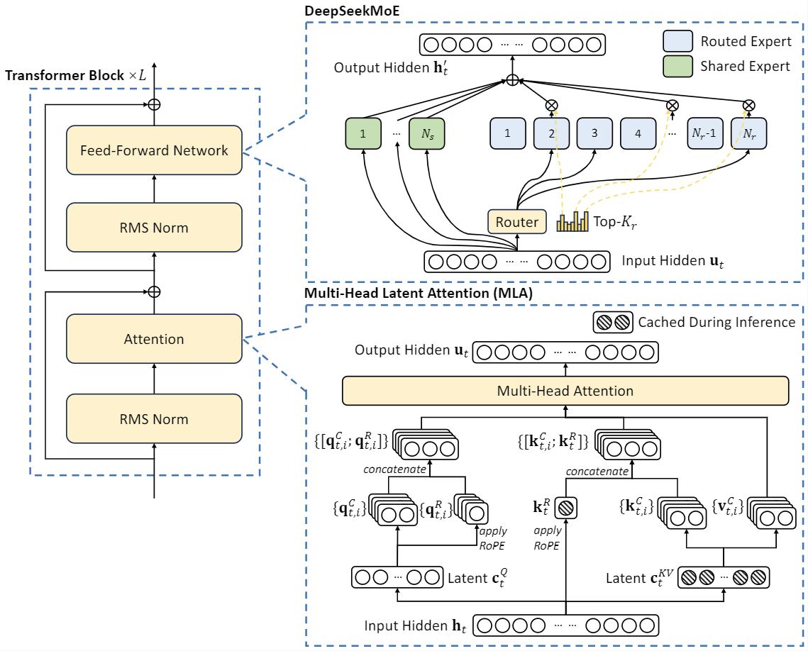

# DeepSeek

主要介绍deep seek的发展

## DeepSeek-V2

- __DeepSeek-V2: A Strong, Economical, and Efficient Mixture-of-Experts Language Model.__ *DeepSeek-AI et al.* __arXiv, 2024__ [(Arxiv)](https://arxiv.org/abs/2405.04434) 

  - Takeaway

  - Core Mechanism

    主要是两个结构：MLA and DeepSeek MoE

    - MLA: Multi-head Latent Attention
    - MoE: Mixture-of-Experts

### Architecture

### Pre-Training

### Alignment

https://arxiv.org/abs/2311.18743