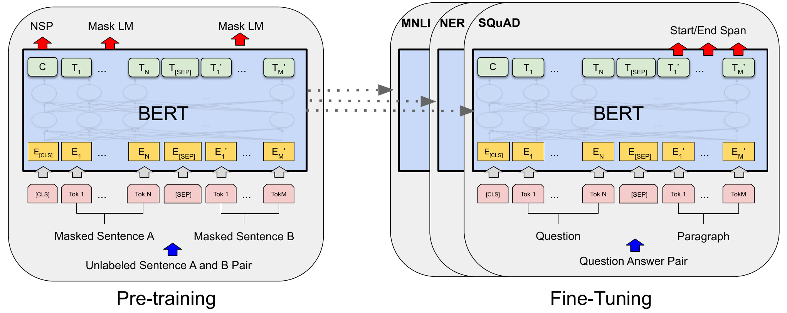

# BERT Zoo

## BERT

- **BERT: Pre-training of Deep Bidirectional Transformers for Language Understanding**. Jacob Devlin et.al. **NAACL**, **2019**, ([Arxiv](https://arxiv.org/abs/1810.04805)) ([Code](https://github.com/google-research/bert)).

  - Takeaway:

    BERT(Bidirectional Encoder Representation from Transformer) shows that a deep bidirectional Transformer encoder can be **pre-trained** on unlabeled text with Masked Language Modeling (MLM) and Next Sentence Prediction (NSP), then fine-tuned with only a small output head for many downstream NLP tasks. This simple pre-train + fine-tune recipe became the standard encoder-side foundation for language understanding.

  - Motivation:

    在 BERT 之前，主流预训练方法要么是 feature-based（如 ELMo,双向信息，但是CNN），要么是 fine-tuning based 但仍然使用单向语言模型（如 GPT,transformer，但是单向）。作者认为这种单向约束限制了表示能力，尤其对需要同时看左右上下文的 token-level tasks 很不友好。下面是一些不友好的例子:

    - Left-to-right pre-training cannot fully use both-side context in every layer.
    - Sentence-pair tasks such as NLI and QA need stronger cross-sentence interaction than shallow feature reuse.
    - If one pre-trained encoder can be reused with minimal task-specific changes, transfer learning in NLP becomes much simpler and more general.

    因此bert就想解决单向的问题将其变为双向，于是提出了MLM

    > [!NOTE]
    >
    > ELMo是一个CNN的架构，所有要迁移到一些nlp任务的时候，就需要做架构上的改变，而bert只需要该最后的输出层就可以了

  - Core Mechanism:

    - Architecture

      
  
      The overall pipeline figure shows the full recipe: pre-train once with MLM + NSP, then attach a lightweight task head and fine-tune all parameters end-to-end.

    - Bidirectional Transformer encoder

      BERT uses only the Transformer encoder stack, but unlike GPT-style causal masking, each token can attend to both its left and right context during pre-training. The paper reports two standard scales: **BERT Base** $(L=12,H=768,A=12,110\text{M})$ and **BERT Large** $(L=24,H=1024,A=16,340\text{M})$.
  
    - Input representation, embedding层
  
      BERT packs either one sentence or a sentence pair into one token sequence using `[CLS]` and `[SEP]`, then represents each token by summing token, segment, and position embeddings.

      $$
      E_i = E_i^{\text{token}} + E_i^{\text{segment}} + E_i^{\text{position}}
      $$
  
      这里 `segment` embedding 用来区分 sentence A / B，`position` embedding 提供顺序信息，而 `[CLS]` 的最终 hidden state 常被拿来做分类任务的序列级表示。

      > [!TIP]
      >
      > `[CLS]` = classification token（分类标记）,永远放在输入序列的最前面
      >
      > `[SEP]` = separator token（分隔标记）

      > [!note]
      >
      > `[SEP]`句子的结束我们很好理解,但是为什么需要一个`[CLS]`(因为这不是代表一个sentence的开始,而是一个蓄力额定而开始,可能是多个句子组成):
      >
      > 因为Transformer 本身：没有“句子级输出”，只输出 token-level 表示。所以需要一个“代表整个序列的 token”
  
      
  
      This figure shows the exact packed input format and why BERT can naturally support both single-sentence and sentence-pair tasks in one encoder.

    - Pre-training objectives: MLM + NSP

      The key change is MLM(完形填空): randomly choose 15% of WordPiece tokens, then predict the original token from bidirectional context. For the selected positions, 80% are replaced by `[MASK]`, 10% by a random token, and 10% are left unchanged to reduce pretrain-finetune mismatch.
  
      $$
      \mathcal{L}_{\text{MLM}} = - \sum_{i \in M} \log p(x_i \mid x_{\setminus M})
      $$
  
      其中 $M$ 是被选中用于预测的 masked positions。这个目标的核心不是生成整句，而是让 encoder 学会从双向上下文恢复被遮住的 token。
  
      > [!NOTE]
      >
      > 为什么会有80,10,10这个东西产生呢：
      >
      > 实际上是因为预训练的是有一个`[MASK]`的token（完形填空），但是在微调的时候是没有这个`[MASK]`的（输入完整的句子），那么对于模型看到的数据是不同(distribution shift)的会带来一些问题，因此就做了80,10,10的这个操作。
      >
      > 这里80,10,10是一个实验出来的经验参数，论文结果显示还可以
      >
      > 80就是换成`[MASK]`进行训练，10% by a random token就是让其有噪声干扰，10%什么都不变标记一下这个词会做预测
      
      Besides MLM, BERT also uses Next Sentence Prediction (NSP): 当选取A+B两个句子进行训练
      
      - 50% of the time sentence B is the true next sentence (`IsNext`)
      - 50% of the time it is a random sentence (`NotNext`). NSP mainly trains the `[CLS]` representation to capture sentence-pair relations useful for NLI / QA style tasks.
      
      > [!NOTE]
      >
      > 这个NSP是为了让BERT学习一下句子层面的东西
      
    - Transfer learning
  
      bert认为在大量无label的数据集上训练比在小量有label的数据集上训练得到的效果可能更好
  
  - Pipeline:
  
    1. Build an input sequence with WordPiece tokens, prepend `[CLS]`, and separate sentence A / B with `[SEP]`.
    2. Sum token, segment, and position embeddings, then feed the sequence into a multi-layer bidirectional Transformer encoder.
    3. During pre-training, optimize MLM on masked positions and NSP on the `[CLS]` representation using BooksCorpus + English Wikipedia.
    4. For each downstream task, initialize from the same pre-trained checkpoint, add a small task-specific output layer, and fine-tune all parameters end-to-end.
    5. Use `[CLS]` for classification tasks and token-level hidden states for sequence labeling or span prediction tasks.
  
  - Pros:
  
    - Deep bidirectional pre-training gives much stronger contextual representations than unidirectional LM pre-training for understanding tasks.
    - One encoder architecture transfers to many tasks with very small downstream modifications.
    - The paper sets new SOTA on 11 NLP tasks, including GLUE, MultiNLI, and SQuAD.
    - The pre-train then full fine-tune recipe is simple and highly reusable, which is why BERT became a milestone model.
  
  - Cons:
  
    - MLM introduces a pre-training / fine-tuning mismatch because `[MASK]` does not appear in normal downstream inputs.
    - NSP was useful in the original paper, but later work showed it is not always the best sentence-level pre-training objective.
    - Full self-attention still has quadratic cost in sequence length, so long-context scaling remains limited.
    - BERT is encoder-only, so it is excellent for understanding but not a natural generative language model.
