# Multi-Modal Foundation Models

结合CV and NLP。这一领域通常称为 **Vision–Language (VL)** 或 **Multimodal Learning**

```
Vision + Language
        │
        ├── Image Captioning
        │        │
        │        ├── CNN encoder
        │        ├── RNN decoder
        │        └── Attention
        │
        ├── Retrieval
        │        │
        │        └── Joint embedding
        │
        └── Visual Question Answering
                 │
                 └── Multimodal reasoning
```

## Intro

让模型能够同时理解图像内容和语言描述，并在两者之间建立语义对应关系

主要解决三类问题

| 任务                      | 输入             | 输出     |
| ------------------------- | ---------------- | -------- |
| Image Captioning          | Image            | Sentence |
| Image Retrieval           | Image / Text     | Matching |
| Visual Question Answering | Image + Question | Answer   |

本质问题：
$$
P(sentence | image)
$$
或
$$
f(image, text)
$$
即 学习图像和语言的联合表示 (joint embedding)

Foundation Models: Pre-train one model that acts as the foundation for many different tasks

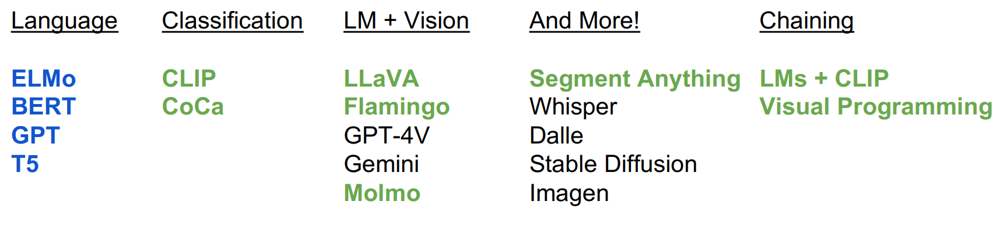

接下来我们介绍一些重要的foundation model

## Classification

CLIP+CoCa

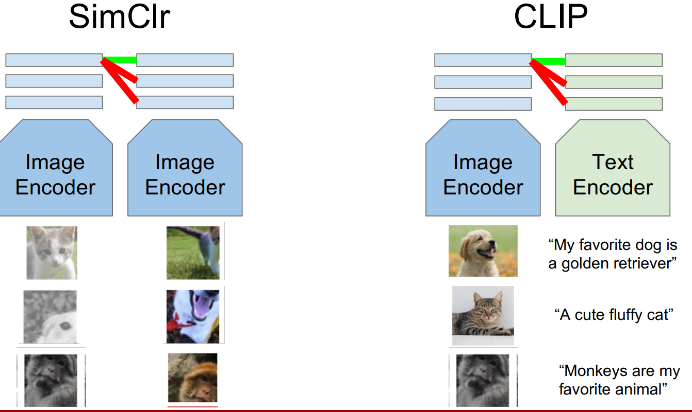

- __Learning Transferable Visual Models From Natural Language Supervision.__ *Alec Radford et al.* __International Conference on Machine Learning, 2021__ [(Arxiv)](https://arxiv.org/abs/2103.00020) [(S2)](https://www.semanticscholar.org/paper/6f870f7f02a8c59c3e23f407f3ef00dd1dcf8fc4) (Citations __43997__) -- CLIP
  
  > [!TIP]
  >
  > 工程细节 [How to Train Really Large Models on Many GPUs?](https://lilianweng.github.io/posts/2021-09-25-train-large/)
  
  - Contrastive Vision-Language Learning
  
    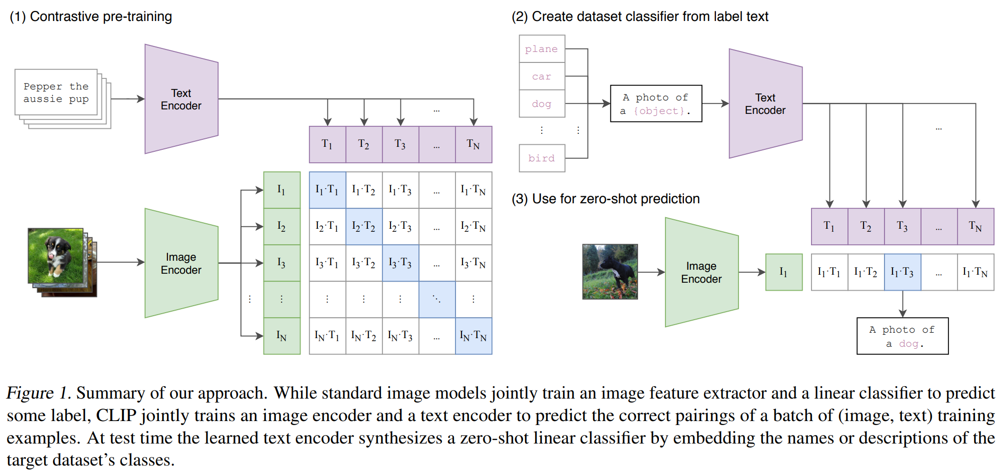
  
  - Core Mechanism
  
    - 大数据+大模型： use LLMs zero-shot for new downstream tasks
  
    - create a classifier using the text encoder
  
      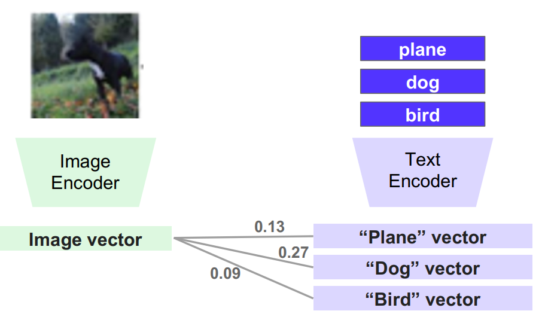
  
- __CoCa: Contrastive Captioners are Image-Text Foundation Models.__ *Jiahui Yu et al.* __arXiv, 2022__ [(Arxiv)](https://arxiv.org/abs/2205.01917) 

  - Takeaway: CoCa 将 CLIP 的对比学习 (contrastive learning) 与 captioning 的生成学习 (generative learning) 统一在同一个模型中
  
  - Motiviation: CLIP只有对比学习（只学到了semantic alignment），不能根据图片生成文本
  
    ```
    image → sentence
    ```
  
    即 **captioning / generative tasks**
  
  - Core Mechanism:
  
    同时训练两种目标: contrastive learning + generative learning
  
    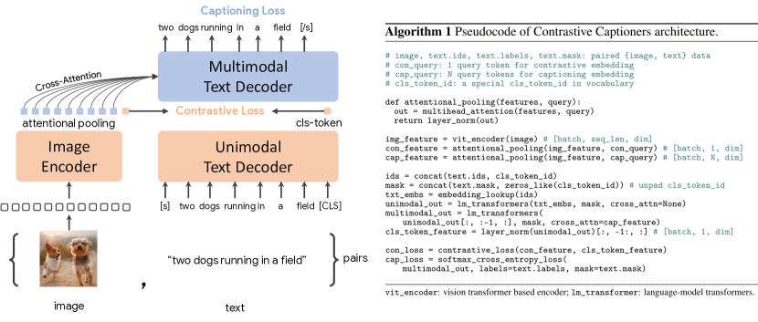
  
    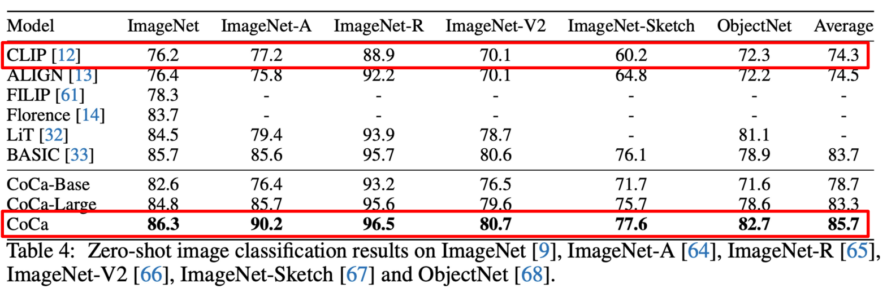
  
    超牛逼的效果

CLIP-style models：

- Pros

  1. **Dot product is super efficient**
     - Easy to train (enables scaling)
     - Fast inference, e.g., retrieval over 5B images

  2. **Open-vocabulary (zero-shot generalization)**

  3. **Can be chained with other models (CuPL)**  
     *[we will discuss this later today]*

- Cons

  1. Rely too heavily on batch size to learn concepts: Increasing batch size helps you understand fine-grained concepts.但是这有一个上限（也就是模型能力到头了）

     - Sol: Hard Negative Fine-Tuning

  2. Image-level captions are insufficient supervision

     > iamge-level not object-level or region-level 过于粗粒度
     >
     > supervision = 训练信号

     

  3. You can’t know everything in your 5B dataset: 数据收集和清洗（即数据质量很重要）

## VLM

- Vision-Language Models: accept images and text as input, and then output text

### LLaVA

- __Visual Instruction Tuning.__ *Haotian Liu et al.* __ArXiv, 2023__ [(Arxiv)](https://arxiv.org/abs/2304.08485) [(S2)](https://www.semanticscholar.org/paper/a5036f31f0e629dc661f120b8c3b1f374d479ab8) (Citations __8151__) 

  - Takeaway: 

    LLaVA(**L**arge **L**anguage **a**nd **V**ision **A**ssistant) connects a pretrained vision encoder with a large language model (LLM) and trains the combined system using **visual instruction tuning**, enabling the model to reason about images through natural language.

    Instead of building a complex multimodal architecture, LLaVA simply projects visual features into the **token embedding space of an LLM**, allowing the LLM to process images as part of a prompt.

  - Motivation: Combine the perception ability of vision models with the reasoning ability of LLMs using a **simple alignment mechanism**.

  - Core Mechanism: Key idea behind LLaVA – add visual information to the LLM

    So the CLIP encoder is a good option.

  - Pipeline: 
  
    Overall Architecture + Training Recipe
  
    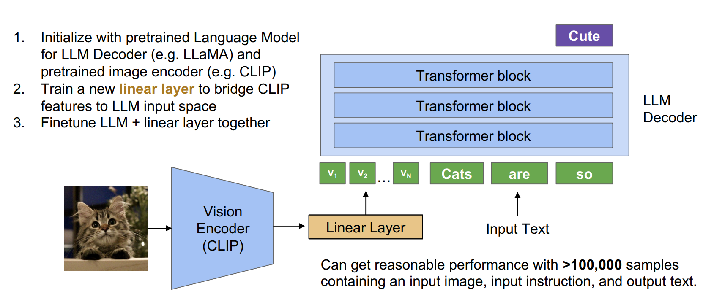
  
    - use penultimate layer
  
      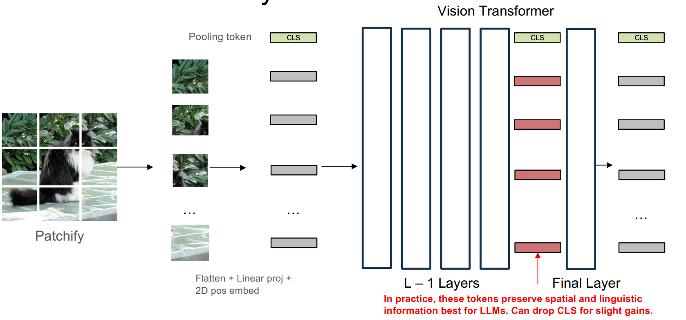
  
  - Pros
  
    - Simple architecture: Only a small projection layer connects the vision encoder and LLM.
    - Efficient training: Most components are pretrained; only a small number of parameters need training.
  
  - Cons
  
    - Limited fine-grained perception / Hallucination（幻觉） 就是智能化还不够

- Flamingo

  - Takeaway: 

    Flamingo is a multimodal model that combines a pretrained vision encoder with a large language model using **cross-attention layers**, enabling the model to process interleaved image-text inputs and perform **few-shot visual reasoning**.

    It allows an LLM to understand images without retraining the entire model by inserting **gated cross-attention modules** between the visual and language representations.

  - Core Mechanism: Flamingo followed up with a new way to fuse visual features

    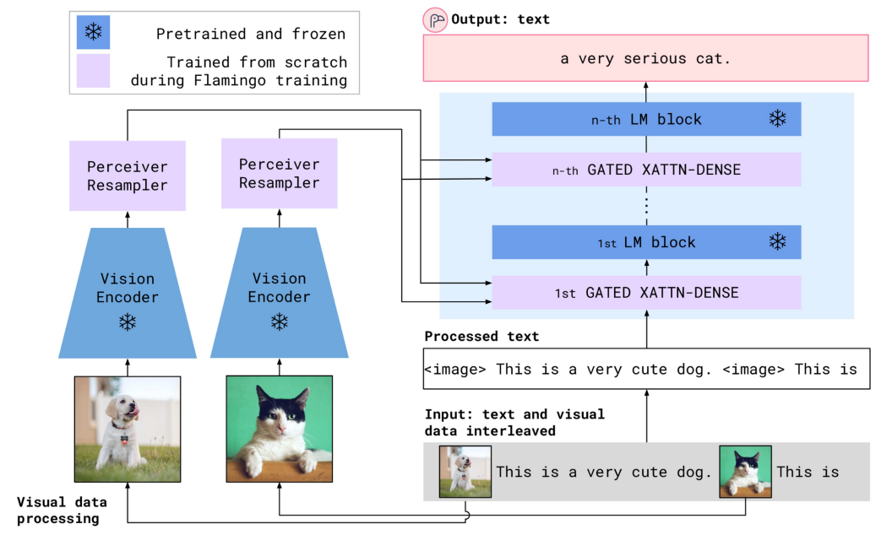

    integrates images into an LLM using **cross-attention layers** instead of linear projection layer of LLaVA

    > [!NOTE]
    >
    > 下面我们来介绍一下cross-attention layer
    >
    > - Takeaway: Cross-attention is an attention mechanism where **queries come from one sequence and keys/values come from another sequence**, allowing one modality (e.g., text) to retrieve relevant information from another modality (e.g., images).
    > - Motivation: two different sources of information
    > - Core Mechanism
    >   - Queries come from the **target sequence**
    >   - Keys and values come from the **source sequence**

    Flamingo 在 cross-attention 输出上加了一个门控（让视觉信息“可控注入”）：
    $$
    h'_t = h_t + \sigma(g)\cdot \text{CrossAttn}(h_t, z)
    $$
    

- Molmo


Data matters! Quality over quantity even for pretraining. But collecting dense captions is hard!!!

## Other Model

- Segment Anything Model (SAM)

  很酷炫的效果

  - Core Mechanism

    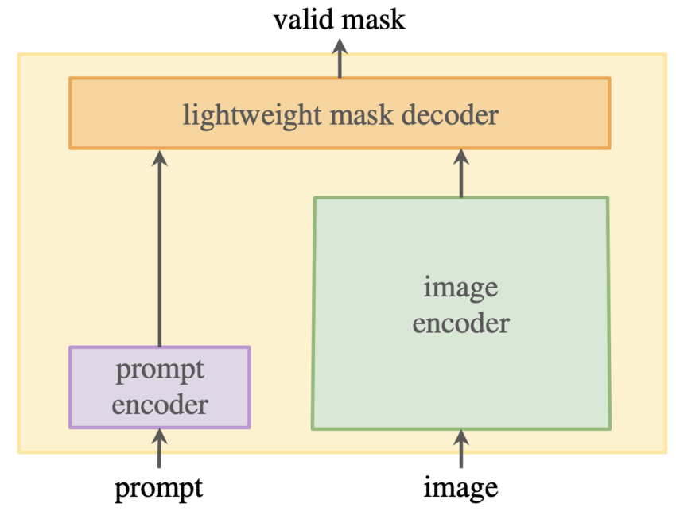

    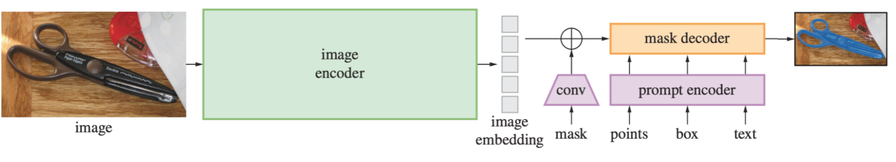

## Chaining

这里介绍一下chaining的含义

- Motivation: What happens when a model is asked to classify a concept it has never seen?
  - Sol: 
    1. Get an LLM to generate a description
    2. Classify using the description

### LMs + CLIP

- CuPL (CUstomized Prompts via Language models)

  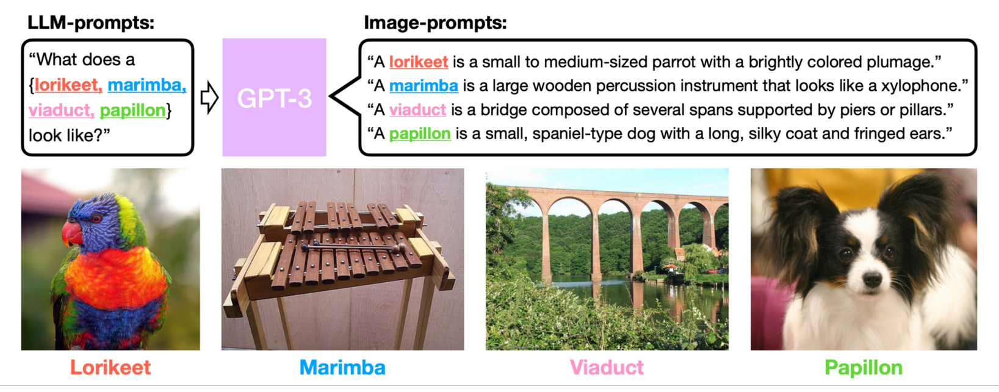

### Visual Programming

- VisProg (visual programming)

