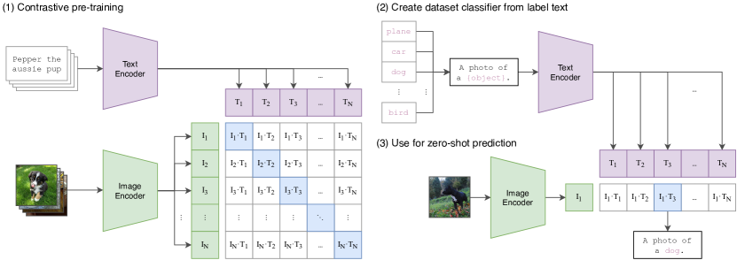
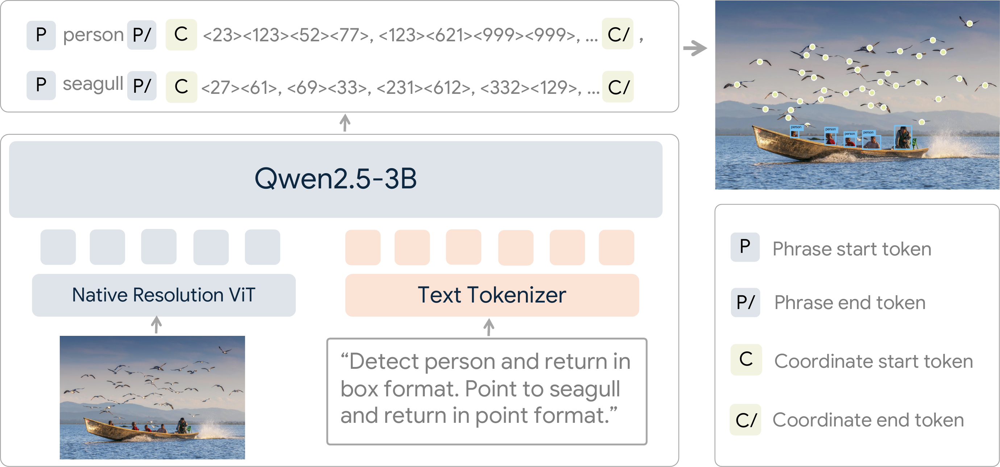
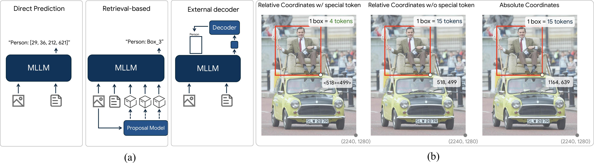
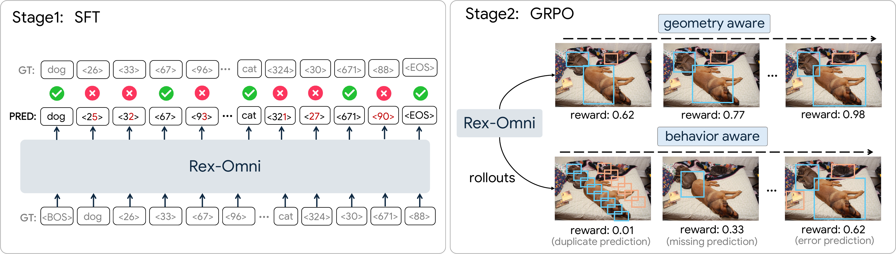
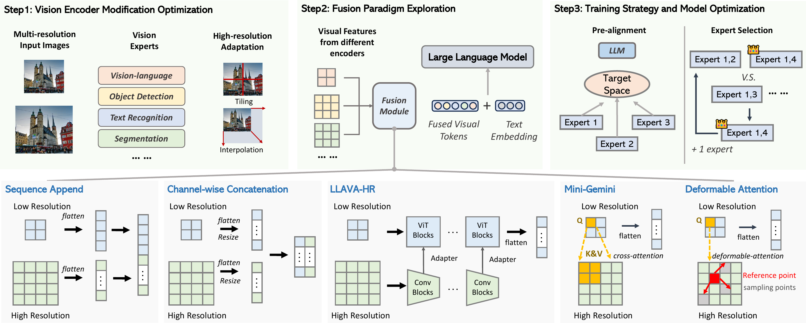
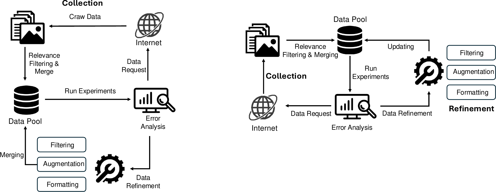
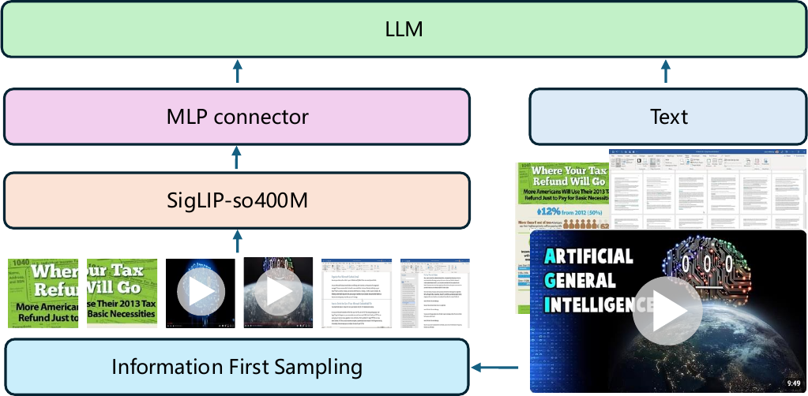

# Vision-Language Model

### Review

- a review: __A Survey of State of the Art Large Vision Language Models: Alignment, Benchmark, Evaluations and Challenges.__ *Zongxia Li et al.* __arXiv, 2025__ [(Arxiv)](https://arxiv.org/abs/2501.02189) 


### CLIP

- __Learning Transferable Visual Models From Natural Language Supervision.__ *Alec Radford et al.* __International Conference on Machine Learning, 2021__ [(Arxiv)](https://arxiv.org/abs/2103.00020) [(S2)](https://www.semanticscholar.org/paper/6f870f7f02a8c59c3e23f407f3ef00dd1dcf8fc4) (Citations __47496__) ([My PDF](https://drive.google.com/file/d/14vhInYtZPcvDk3PauVsCOK7oewLQBorM/view?usp=drivesdk)) from openai

  - Takeaway:CLIP 用大规模图文对进行预训练，让图像和文本进入同一个语义空间，从而支持 zero-shot transfer

    > [!NOTE]
    >
    > 突破categorical label
  
  - Motivation: mage representation 和 language representation 对齐
  
  - Core Mechanism:
  
      
  
      - Contrastive Vision-Language Learning
  
        
  
        - What:
  
          CLIP 用一个 image encoder $f_I$ 和一个 text encoder $f_T$ 分别编码图片和文本，然后把它们投影到同一个 multi-modal embedding space。给定一个 batch 中的 $N$ 个真实图文对，模型要在 $N \times N$ 个可能配对里找出正确配对。
  
          $$
        s_{ij} = \frac{f_I(x_i)^\top f_T(t_j)}{\lVert f_I(x_i) \rVert \lVert f_T(t_j) \rVert} \cdot \exp(\tau)
          $$
  
          loss 为带temperature的cosine similarity logits。这里 $s_{ij}$ 是第 $i$ 张图和第 $j$ 段文本的 cosine similarity logits，$\tau$ 是可学习的 temperature，用来控制 softmax 分布的尖锐程度。
  
        - Why:
  
          直接生成 caption 太难也太低效，因为同一张图片可能有很多合理描述；contrastive objective 只要求判断“哪段文本和图片匹配”，监督信号更简单，也更适合大规模训练。论文中作者发现，相比 caption generation 或 bag-of-words prediction，contrastive objective 明显提高 zero-shot transfer 的训练效率。
  
        - How:
  
          训练时同时做 image-to-text 和 text-to-image 两个方向的 cross entropy，让真实配对的相似度变高，batch 内其他错误配对的相似度变低：
  
          $$
          \mathcal{L}=\frac{1}{2}\left[\frac{1}{N}\sum_i -\log \frac{\exp(s_{ii})}{\sum_j \exp(s_{ij})}+\frac{1}{N}\sum_i -\log \frac{\exp(s_{ii})}{\sum_j \exp(s_{ji})}\right]
          $$
  
          这个目标本质上把一个 batch 变成了 $N$ 类分类问题：每张图的正确文本是它自己的 caption，每段文本的正确图片也是它自己的 paired image。
  
      - Natural language as a dynamic classifier
  
        - What:
  
          CLIP 的 text encoder 不只是辅助训练，而是在 inference 时直接生成 zero-shot classifier 的权重。对于一个分类任务，先把类别名写成 prompt，比如 `a photo of a {label}`，再编码成文本特征；图片特征和所有类别文本特征做 similarity，最高者就是预测类别。
  
        - Why:
  
          这让模型不再绑定固定标签空间。传统线性分类器的类别权重来自训练数据，而 CLIP 的类别权重来自自然语言描述，所以新类别可以通过文本即时定义。
  
      - Scalable encoder choices
  
        Image encoder 使用改造过的 ResNet 或 Vision Transformer，text encoder 使用 Transformer，并把 `[EOS]` 位置的表示投影到 shared embedding space。
  
    - Cons:
  
      - 训练依赖 400M web-scale 图文对和大量算力，普通研究者很难复现完整训练。
  
  - WebImageText 数据来自互联网，会继承噪声、偏见、隐私和安全风险，论文也专门讨论了 broader impacts。
    - Zero-shot 表现对 prompt wording 和 prompt ensemble 比较敏感，不同任务需要一定 prompt engineering。

### GLIP

- __Grounded Language-Image Pre-training.__ *Liunian Harold Li et al.(microsoft)* __CVPR, 2022__ [(Arxiv)](https://arxiv.org/abs/2112.03857) [(S2)](https://www.semanticscholar.org/paper/5341b412383c43f4a693ad63ec4489e3ec7688c8) (Citations __1601__)

  - Takeaway:

    GLIP 统一目标检测和phrase grounding。CLIP 学的是图像和整句文本的匹配，GLIP 学的是文本短语和图像区域的匹配

  - Motivation:

    CLIP 已经证明 natural language supervision 可以学到可迁移的 image-level 表示，但它主要输出整图 embedding，缺少 object-level localization 能力。传统 detector 又绑定固定类别集合，扩展新类别需要重新标注和训练。GLIP 的问题意识是：能不能把“检测某些类别”和“把文本短语定位到图中区域”变成同一个任务，从而同时利用 detection data、grounding data 和大规模 web 图文对？

    - Detection label 本质上也是 phrase，例如 COCO 的 `person. bicycle. car.` 可以被写成一个 prompt。
    - Phrase grounding 天然提供 region-text correspondence，比 image-level contrastive learning 更适合学 object-level semantic representation。
  
      > grounding本质就是定位问题
    - Open-vocabulary detection 不一定要无条件发现所有物体，只需要定位 prompt 中提到的概念。

  - Core Mechanism:

    

    - Detection as grounding

      - What:

        GLIP 用 text prompt 表示待检测类别或自然语言描述，用 detector 产生候选 box / region features，再把传统 object classifier 替换为 word-region alignment score。若视觉区域特征为 $O_i$，文本 token / phrase 特征为 $P_j$，则分类分数来自二者相似度：
  
        $$
        s_{ij}=O_i^\top P_j
        $$

        这里 $s_{ij}$ 表示第 $i$ 个 region 是否对应第 $j$ 个文本概念；ground truth box 和 phrase 之间的 positive map 决定哪些 token 是正样本。

      - Why:

        固定类别 detector 的 classifier 权重只能覆盖训练集 label，而 prompt 里的 phrase 可以动态给出类别空间。把 detection 视为 grounding 后，检测任务就可以共享 grounding 数据中的 phrase-box supervision，也可以直接迁移到未见过的类别名。

      - How:

        对 object detection，prompt 是类别名列表；对 phrase grounding，prompt 是原始句子。模型预测 box 后，一边做 box regression，一边用 region-text alignment 做分类 / grounding loss。推理时只要把目标类别写进 prompt，GLIP 就能输出对应 boxes。

    - Deep vision-language fusion

      - What:

        GLIP 不是像 CLIP 那样只在最终 embedding 上做 shallow alignment，而是在 detector 内部做 early / deep fusion：visual encoder 提取多尺度视觉特征，BERT 编码文本，DyHead 模块在检测过程中持续融合语言信息。

      - Why:

        Object detection 需要精细空间定位，只在最后把视觉 box embedding 和文本 embedding 点乘容易丢失局部语义。Deep fusion 让 box proposal、feature refinement 和 classification 都被 prompt 条件化。

      - How:

        论文实现基于 Dynamic Head：visual features 和 word features 在多个 DyHead layer 中交互，输出 language-aware region features。作者还发现 prompt tuning 对这种 deep-fused detector 更有效，因为 prompt embedding 能实际影响检测分支。

    - Self-training on web image-text pairs

      - What:

        GLIP 先用人工标注 detection / grounding 数据训练 teacher，再对 web image-text pairs 自动抽取 noun phrases 并生成 pseudo boxes，构造大规模 phrase-box 数据。

      - Why:

        人工 box 标注很贵，类别覆盖有限；web 文本包含大量长尾概念，但没有直接 box annotation。Self-training 把 noisy caption data 转成 object-level supervision，扩大语义覆盖。

      - How:

        论文预训练使用 27M grounding data，其中约 3M 来自人工标注，24M 来自 web-crawled image-text pairs；对 web 数据生成高置信 phrase-box pseudo annotations 后训练 student GLIP，使模型获得更丰富的 open-vocabulary object semantics。

  - Pipeline:
  
    1. 把 detection label list 或 natural sentence 写成 text prompt，并由 BERT text encoder 得到 word / phrase features。
    2. 图像经过 visual backbone 和 DyHead detector，产生多尺度视觉特征与候选 regions。
    3. 在 deep fusion 模块中交互视觉特征和语言特征，得到 language-aware region representations。
    4. 用 region-text alignment score 代替固定类别 classifier，同时优化 alignment / classification loss 和 box regression loss。
    5. 预训练阶段混合 detection、grounding 和 pseudo-labeled web image-text data；下游时通过改写 prompt 完成 zero-shot、few-shot 或 prompt tuning detection。

  - Pros:
  
    - 第一次把 object detection 和 phrase grounding 以很直接的方式统一起来，open-vocabulary 接口清晰。
    - 能利用 detection、grounding、web image-text 三类数据，object-level 语义覆盖比固定检测数据集更广。
    - Prompt-conditioned detector 在 zero-shot / few-shot ODinW、COCO、LVIS 等设置中展示了强迁移能力。
    - Deep fusion 让语言信息真正进入 localization 过程，而不是只做后处理 re-ranking。

  - Cons:
  
    - 训练管线复杂，依赖大规模数据混合、teacher pseudo labeling 和检测器工程，复现成本高。
    - Pseudo boxes 来自 teacher，自训练会继承 teacher bias 和 caption parsing noise。
    - 推理仍需要对 prompt 设计和类别词粒度较敏感；同义词、细粒度类别和长文本描述可能影响检测结果。
    - 基于 heavy detector + language encoder，速度和部署便利性不如后来的 real-time open-vocabulary YOLO 系列。

### CoCa

- __CoCa: Contrastive Captioners are Image-Text Foundation Models.__ *Jiahui Yu et al.* __arXiv, 2022__ [(Arxiv)](https://arxiv.org/abs/2205.01917) 


### Grounding-DINO

- __Grounding DINO: Marrying DINO with Grounded Pre-Training for Open-Set Object Detection.__ *Shilong Liu et al.* __arXiv, 2023__ [(Arxiv)](https://arxiv.org/abs/2303.05499) 

  - Takeaway:

    Grounding-DINO 把 closed-set DETR-style detector DINO 改造成 text-conditioned open-set detector：输入一张图和任意 prompt，输出 boxes 以及与文本 token 对齐的 phrase scores。它的关键是把 grounded pre-training、language-guided query selection 和 cross-modality decoder 接到 DINO 框架里。

  - Motivation:

    DINO 在 closed-set object detection 上很强，但类别空间固定；GLIP 等 grounded detector 能处理开放词表，但和现代 DETR / DINO 的 query-based 检测框架结合还不充分。Grounding-DINO 想把 DINO 的强定位能力和 grounding 模型的 language-conditioned recognition 合起来，得到一个可作为下游基座的 open-set detector。

    - Open-set detection 需要同时解决 localization 和 text-object matching。
    - DETR/DINO 的 query 机制适合端到端检测，但默认 query 不知道用户 prompt。
    - Grounded pre-training 可以把 detection、grounding、caption-like supervision 转成统一的 region-text 对齐训练信号。

  - Core Mechanism:

    - DINO detector with grounded pre-training

      

      - What:

        Grounding-DINO 保留 DINO 的 multi-scale image features、object queries、decoder 和 box prediction，但把类别预测改成 text-token alignment。给定 image features $F_I$ 和 text features $F_T$，模型不输出固定类别 logits，而是输出 query 与文本 token / phrase 的相似度。

      - Why:

        固定 softmax classifier 无法表达训练集外类别；用 text alignment 后，类别空间由 prompt 决定。DINO 的 box refinement 和 denoising training 提供强定位能力，grounding objective 提供开放词表语义能力。

      - How:

        训练时根据 box 和 phrase 的匹配关系构造 positive map；decoder query 预测 box，同时和文本 token 做 contrastive / alignment classification。整体损失仍包含 detection 常用的 box loss：

        $$
        \mathcal{L}=\lambda_{\text{cls}}\mathcal{L}_{\text{align}}+\lambda_{L1}\mathcal{L}_{L1}+\lambda_{\text{giou}}\mathcal{L}_{\text{GIoU}}
        $$

        其中 $\mathcal{L}_{\text{align}}$ 负责 query-text matching，$\mathcal{L}_{L1}$ 和 $\mathcal{L}_{\text{GIoU}}$ 负责 localization。

    - Feature enhancer

      - What:

        Feature enhancer 在 encoder 阶段同时增强 image features 和 text features，让两种模态在进入 query decoder 前就交互。

      - Why:

        如果视觉和语言只在最后对齐，模型很难把 prompt 信息用于 early localization。提前融合可以让图像特征知道哪些文本概念是当前任务关心的。

      - How:

        Image branch 使用 deformable self-attention 处理多尺度视觉特征，text branch 使用 self-attention 处理 token features，并通过 image-to-text / text-to-image cross-attention 交换信息，输出 language-aware image features 和 image-aware text features。

    - Language-guided query selection

      - What:

        Grounding-DINO 不随机或固定选择 decoder queries，而是根据 image features 与 text features 的相关性选择更可能对应 prompt 的视觉位置作为 queries。

      - Why:

        Open-set prompt 中的目标可能只占图像很小区域；query 初始化如果不看语言，会浪费大量 query 在无关区域。Language-guided selection 能让 decoder 从更相关的 candidate regions 开始。

      - How:

        Encoder 输出的视觉 token 与文本 token 计算 similarity，挑选 top-ranked image features 作为 object queries，再送入 cross-modality decoder 逐层 refined boxes 和 text alignment scores。

    - Cross-modality decoder

      - What:

        Decoder query 同时 attend 到 image features 和 text features，逐层更新 object representation，使每个 query 同时携带 box localization 信息和 phrase semantics。

      - Why:

        Grounding 输出不是“有没有某类”，而是“哪个 box 对应 prompt 中哪个短语”。Query 必须在 decoder 内部持续参考语言，才能处理长 prompt、多类别 prompt 和 phrase-level 对齐。

      - How:

        每层 decoder 用 self-attention 处理 queries，用 image cross-attention 聚合视觉证据，并用 text cross-attention / alignment head 连接文本。最终输出 boxes 和每个 box 对文本 token 的 score；推理时通过 box threshold 和 text threshold 得到 grounded detections。

  - Pipeline:

    1. 输入图像和 prompt；prompt 可以是类别列表，也可以是自然语言描述。
    2. Backbone 提取 multi-scale image features，text encoder 提取 token-level language features。
    3. Feature enhancer 进行 image-text 双向融合，得到 grounded multi-modal features。
    4. Language-guided query selection 根据文本相关性挑选 object queries。
    5. Cross-modality decoder 逐层 refine queries，输出 boxes 和 token-level alignment scores。
    6. 推理时用 box threshold 过滤候选框，用 text threshold / phrase aggregation 找到每个 box 对应的文本短语。

  - Pros:

    - 把 DINO 的强检测能力和 grounded language supervision 结合，定位质量和开放词表识别能力都强。
    - Query selection 被语言条件化，比纯 learned queries 更适合 prompt-driven detection。
    - 输出 token-level alignment，适合接 SAM、captioning、robotics 等需要 grounded boxes 的系统。
    - Prompt 接口灵活，可以用类别列表做 open-vocabulary detection，也可以用短语做 referring / grounding。

  - Cons:

    - 仍是 DETR-style transformer detector，推理速度和部署成本高于 YOLO-style real-time detector。
    - 对 prompt 分隔、阈值选择和 phrase 后处理敏感，实际使用常要调 box/text thresholds。
    - 训练依赖大规模 grounded data 和复杂 matching / positive map 构造。
    - 主要输出 boxes 和 token alignment，本身不直接解决 mask-level segmentation，需要与 SAM 等模型组合。

### Real-Time

#### Yolo-World

- __YOLO-World: Real-Time Open-Vocabulary Object Detection.__ *Tianheng Cheng et al.* __CVPR, 2024__ [(Arxiv)](https://arxiv.org/abs/2401.17270) 

  - Takeaway:

    YOLO-World 的核心是把 YOLO 改造成 real-time open-vocabulary detector：训练时用 text encoder 对齐 region 和文本，推理时可把离线 vocabulary embedding 重参数化进检测头，从而在开放类别检测和实时速度之间取得平衡。

  - Motivation:

    GLIP、Grounding-DINO 这类 open-vocabulary detector 能识别开放类别，但通常依赖 heavy vision-language transformer，推理慢、部署难。YOLO 系列速度快、工程成熟，却是 closed-set detector。YOLO-World 试图让 YOLO 获得 open-vocabulary 能力，同时保留实时检测优势。

    - 实时应用需要低延迟，而不是只追求最高 open-vocabulary AP。
    - 部署时常见场景是先给定一个 offline vocabulary，再长期用同一词表检测。
    - 如果 text embeddings 可以提前计算并折叠进网络，就能避免每帧重复跑 text encoder。

  - Core Mechanism:

    - Vision-language YOLO architecture

      

      - What:

        YOLO-World 保留 YOLO 的 backbone、neck 和 dense prediction head，但加入 CLIP text encoder 与 text contrastive head。每个 object prediction 不再输出固定类别 logits，而是输出 object embedding $e_k$，再和 vocabulary text embedding $w_j$ 做相似度：

        $$
        s_{k,j}=\alpha \cdot \mathrm{L2Norm}(e_k)^\top \mathrm{L2Norm}(w_j)+\beta
        $$

        其中 $s_{k,j}$ 是第 $k$ 个预测框与第 $j$ 个文本类别的 object-text similarity，$\alpha,\beta$ 是可学习缩放和平移参数。

      - Why:

        YOLO 的 dense head 非常高效，但固定 classifier 阻碍 open-vocabulary transfer。把 classifier 改成 region-text similarity 后，类别空间由文本词表决定，同时仍可沿用 YOLO 的快速 box regression。

      - How:

        训练时输入 image 和文本词表，检测头输出 boxes 与 object embeddings；region-text contrastive loss 让正确 box 靠近对应 text embedding，错误类别远离。推理时输入候选词表即可得到 open-vocabulary detections。

    - RepVL-PAN

      - What:

        RepVL-PAN 是 re-parameterizable Vision-Language Path Aggregation Network，在 YOLO 的 PAN/FPN neck 中加入 text-guided CSPLayer 和 image-pooling attention，让多尺度视觉特征与文本特征交互。

      - Why:

        如果只在最后检测头做文本相似度，YOLO 的中间视觉特征仍然是 closed-set 训练习惯。RepVL-PAN 让语言信息进入 multi-scale feature fusion，提高开放类别的 visual-semantic representation。

      - How:

        Text-guided CSPLayer 使用 max-sigmoid attention 将文本 embedding 注入图像特征。论文给出的核心形式是：

        $$
        X_l' = X_l \cdot \delta\left(\max_{j\in\{1..C\}}(X_l W_j^\top)\right)^\top
        $$

        其中 $X_l$ 是第 $l$ 层图像特征，$W_j$ 是第 $j$ 个文本 embedding，$\delta$ 是 sigmoid。部署到固定 offline vocabulary 时，文本 embedding 可以预计算并重参数化为卷积 / 线性权重，以减少推理开销。

    - Region-text contrastive pre-training

      - What:

        YOLO-World 混合 detection、grounding 和 image-text 数据进行预训练，把不同数据统一成 region-text pairs。对有准确 boxes 的 detection / grounding data 同时做分类对齐和 box regression；对 noisy image-text data 更谨慎地使用回归监督。

      - Why:

        仅靠 detection 数据类别有限，难以覆盖开放词表；仅靠 image-text 数据又缺 box supervision。混合训练让模型同时获得定位能力和长尾文本语义。

      - How:

        训练目标由 region-text contrastive loss 与 YOLO box regression loss 组成：

        $$
        \mathcal{L}(I)=\mathcal{L}_{con}+\lambda_I(\mathcal{L}_{iou}+\mathcal{L}_{dfl})
        $$

        其中 $\lambda_I$ 在输入样本有可靠 box annotation 时为 1；对于只来自 image-text 的 noisy 样本，则避免不可靠 box regression 破坏训练。

  - Pipeline:

    1. 准备 detection / grounding / image-text 数据，并把类别名、noun phrases 或 caption nouns 编成文本词表。
    2. CLIP text encoder 生成 text embeddings；YOLO image branch 提取多尺度视觉特征。
    3. RepVL-PAN 在 neck 中融合视觉和语言信息，dense head 输出 boxes 与 object embeddings。
    4. Text contrastive head 计算 object-text similarity，并用 region-text assignments 训练 contrastive classification。
    5. 对可靠标注样本同时训练 IoU / DFL box regression；对 noisy image-text 样本主要使用对齐监督。
    6. 推理时采用 prompt-then-detect：先给定 vocabulary，可离线预计算并重参数化 text embeddings，再以 YOLO-style dense prediction 实时检测。

  - Pros:

    - 直接面向 real-time open-vocabulary detection，部署友好度明显高于 heavy transformer-based grounded detector。
    - Prompt-then-detect 适合实际应用中的固定或半固定词表，text encoder 不必每帧运行。
    - RepVL-PAN 让语言信息进入 YOLO neck，而不是只在最终 head 做相似度。
    - 混合 detection、grounding、image-text 数据，兼顾定位质量和开放类别语义覆盖。

  - Cons:

    - 为了速度和可部署性，复杂语言理解和 phrase-level grounding 能力不如 Grounding-DINO 这类 transformer detector 灵活。
    - 离线词表重参数化适合固定 vocabulary；如果每张图都要复杂自然语言交互，优势会变小。
    - Image-text pseudo region data 仍依赖自动标注和过滤，容易引入噪声。
    - YOLO-style dense prediction 对小目标、长尾细粒度类别和复杂关系描述仍可能需要额外数据或调参。

### Rex Omni

- __Detect Anything via Next Point Prediction.__ *Qing Jiang et al.* __arXiv, 2025__ [(Arxiv)](https://arxiv.org/abs/2510.12798) [(Code)](https://github.com/IDEA-Research/Rex-Omni) (Citations __2__)

  - Takeaway:

    Rex-Omni 把 object detection、referring、pointing、visual prompting、GUI grounding、OCR 和 keypointing 都改写成 MLLM 的 next-token / next-point prediction。它的核心不是再接一个 detector head，而是让 Qwen2.5-VL-3B 直接生成离散坐标 token，并用 22M SFT 数据 + GRPO post-training 修正坐标精度和重复预测。

    生成式检测模型

  - Motivation:

    传统 YOLO / DETR / Grounding-DINO 以 coordinate regression 为主，定位强但接口通常是 detector-style；MLLM 虽然语言理解强，可以处理 referring、GUI、OCR 等更开放任务，但直接生成坐标时常见 low recall、duplicate predictions、coordinate misalignment。

    Rex-Omni 的问题意识是：能否把 detection 从“回归框”变成“生成结构化坐标序列”，让同一个 MLLM 同时拥有语言理解、开放类别感知和较可靠的空间定位能力？

  - Core Mechanism:

    

    - Quantized coordinate tokens

      

      - What:

        Rex-Omni 采用 direct coordinate prediction，把相对坐标量化到 $[0,999]$，并用 1000 个 special tokens 表示坐标值。对于 box 输出，一个框只需要四个坐标 token：
  
        $$
        b=(x_0,y_0,x_1,y_1),\quad x_i,y_i \in \{0,\ldots,999\}
        $$

        输出格式统一为 phrase + coordinate sequence，例如：
  
        ```text
        <|object_ref_start|>person<|object_ref_end|><|box_start|><12><42><512><612><|box_end|>
        ```

      - Why:

        直接输出绝对像素坐标会把一个数拆成多个 digit tokens，序列长、学习难；retrieval-based 方法又依赖 proposal module；external decoder 方法破坏纯生成式接口。相对坐标 + special tokens 把空间预测变成 1000-way token classification，降低学习难度，也减少 dense scene 中的输出长度。

      - How:

        模型基于 Qwen2.5-VL-3B-Instruct，几乎不改 architecture，只把原 vocabulary 末尾 1000 个 token 重新用作坐标 token。不同任务共享同一个 text-based interface：box task 输出 $[x_0,y_0,x_1,y_1]$，pointing / GUI grounding 输出 $[x,y]$，OCR polygon 输出多点序列，keypointing 输出结构化 JSON。

    - Data engines for grounding / referring / pointing

      - What:

        Rex-Omni 不只依赖公开数据，而是构建 data engines 自动生成 grounding、referring、pointing 和 OCR 数据。公开数据约 8.9M，自动数据包括约 3M grounding images、3M referring images、5M point samples、2M OCR samples，总计 22M annotated images。

      - Why:

        MLLM 要学会 1000 个坐标 token 到连续像素空间的映射，需要远多于常规 detection 数据的监督；同时 referring 和 spatial tasks 需要 instance-level semantic descriptions，普通 category-level box annotation 不够。

      - How:

        Grounding engine 用 Qwen2.5-VL-7B 生成 caption，SpaCy 抽取 noun phrases，再过滤含形容词的歧义短语，最后用 DINO-X 生成 boxes。Referring engine 用 Qwen2.5-VL-7B 生成 expression，Molmo 预测 point，SAM 生成 masks，再用 point-in-mask 把 expression 和 box 关联。Pointing engine 从 box / mask 几何中生成代表点；OCR engine 用 PaddleOCR 生成文字区域和转写。

    - SFT + GRPO reinforcement post-training

      

      - What:

        第一阶段用 22M 数据做 supervised fine-tuning，让模型学会基本坐标 token 生成；第二阶段用 66K SFT 数据做 GRPO-based reinforcement post-training，用 geometry-aware reward 修正 token-level CE 和真实几何质量之间的 mismatch。

      - Why:

        Cross-entropy 对坐标 token 的惩罚不理解几何：预测 `<32>` 而 GT 是 `<33>` 会被视为完全错误，但像素误差很小；反过来一个严重错位的大框可能只错一个 token。SFT 的 teacher forcing 还会固定输出长度，使模型推理时难以自己决定 object count，容易漏检或重复预测。

      - How:

        给定 image 和 question $(I,x)$，模型采样 $G$ 个完整输出 $o_i$，用 reward $r_i$ 计算 group-relative advantage：
  
        $$
        A_i=\frac{r_i-\mathrm{mean}(r_1,\ldots,r_G)}{\mathrm{std}(r_1,\ldots,r_G)}
        $$

        GRPO 目标使用 clipped policy gradient 和 KL regularization：
  
        $$
        \mathcal{J}_{\text{GRPO}}(\theta)=\frac{1}{G}\sum_{i=1}^{G}\frac{1}{|o_i|}\sum_{t=1}^{|o_i|}
        \left[\min(\rho_{i,t}\hat{A}_{i,t},\mathrm{clip}(\rho_{i,t},1-\epsilon,1+\epsilon)\hat{A}_{i,t})
        -\beta D_{\mathrm{KL}}(\pi_\theta\|\pi_{\mathrm{ref}})\right]
        $$

        Box tasks 使用 IoU-based F1 reward。对 predicted boxes $\hat{B}$ 和 GT boxes $B^*$，先按 GT 找最大 IoU 且类别匹配的预测，再计算：
  
        $$
        \mathrm{Recall}=\frac{\sum_{j=1}^{n}r_j}{n},\quad
        \mathrm{Precision}=\frac{\sum_{j=1}^{n}r_j}{m},\quad
        r^{\mathrm{IoU}}=\frac{2\cdot \mathrm{Precision}\cdot \mathrm{Recall}}{\mathrm{Precision}+\mathrm{Recall}+\epsilon}
        $$

        Pointing 使用 point-in-mask reward，GUI grounding 使用 point-in-box reward。因为 reward 同时惩罚漏检、错类和重复框，GRPO 能让模型学到更合理的输出数量和更稳定的空间对齐。

  - Pipeline:
  
    1. 把 detection / grounding / referring / OCR / GUI / keypoint 等任务统一成 image + natural language query。
    2. 把 box、point、polygon、visual prompt boxes 都转成相对量化坐标 token。
    3. 用 Qwen2.5-VL-3B backbone 生成结构化文本输出，其中 phrase token 和 coordinate token 混合出现。
    4. Stage 1 在 22M annotated images 上做 SFT，学习坐标 token、任务格式和多任务语言接口。
    5. Stage 2 用 GRPO 采样多个输出，根据 IoU / point-in-mask / point-in-box reward 做 reinforcement post-training。
    6. 推理时按任务解析生成文本，得到 boxes、points、polygons 或 keypoints；同一模型可处理 detection、referring、visual prompting、GUI grounding、OCR 等任务。

  - Pros:
  
    - 生成式接口很统一：boxes、points、polygons、keypoints 都能通过 token sequence 表达，不需要为每个任务接独立 head。
    - 坐标 special tokens 显著缩短输出序列，比 digit-level absolute coordinates 更适合 dense detection。
    - Data engines 覆盖 grounding、referring、pointing、OCR，多任务监督比只用 detection data 更贴近开放视觉感知。
    - GRPO 针对 MLLM 检测的核心失败模式有效：COCO 上 Rex-Omni 从 SFT 的 F1@0.5 68.2 提升到 72.0；Dense200 从 60.2 提升到 78.4；重复预测移除比例在 VisDrone 上从 SFT 的 15.3% 降到 GRPO 的 0.1%。
    - 对 GUI grounding、spatial pointing、OCR、keypointing 等非传统 detection 任务也能复用同一套模型能力。

  - Cons:
  
    - 严格高 IoU 定位仍弱于强 regression detector：COCO 的 F1@IoU 0.95 虽然在 MLLM 中较强，但与 DINO-Swin-L 这类 closed-set detector 仍有差距。
    - 训练成本高：22M 数据 SFT、8 节点 A100 约 8 天，再加 GRPO post-training 和多套 data engines，复现门槛不低。
    - 自动数据依赖 DINO-X、Molmo、SAM、PaddleOCR 等 teacher / toolchain，会继承 teacher bias、caption noise 和 phrase filtering 的保守性。
    - 坐标 token 是 1000-bin discretization，本质上仍有离散化误差；GRPO 能缓解但不能完全消除。
    - 生成式检测通常缺少传统 detector 的 calibrated confidence score，论文评估需要改用 Recall / Precision / F1，而不是标准 AP。

### Eagle

> from nvidia

- __Eagle: Exploring The Design Space for Multimodal LLMs with Mixture of Encoders.__ *Min Shi et al.* __ICLR Spotlight, 2025__ [(Arxiv)](https://arxiv.org/abs/2408.15998) [(Code)](https://github.com/NVlabs/EAGLE) (Citations __68__)

  - Takeaway:

    Eagle 1 的核心是系统研究 MLLM 里 mixture of vision encoders 的设计空间：与其设计复杂 cross-attention / injection 模块，不如选择互补视觉专家、做高分辨率适配，再用简单 channel concatenation 和 pre-alignment 稳定接入 LLM。

  - Motivation:

    LLaVA-style MLLM 通常只用一个 CLIP / SigLIP vision encoder，容易在 OCR、document、object-centric perception、segmentation-sensitive tasks 上丢细节。已有 mixture-of-encoders 方法往往缺少 apples-to-apples ablation：到底该选哪些 expert、如何融合、多高分辨率、是否要 unfreeze / pre-align，都不清楚。

  - Core Mechanism:

    

    - Mixture of complementary vision encoders

      - What:

        Eagle 把不同预训练目标的视觉专家放到同一个 MLLM 里，例如 CLIP / ConvNeXt 负责 vision-language alignment，EVA-02 偏 object-centric，Pix2Struct 偏 OCR，SAM 偏 segmentation，DINOv2 偏 self-supervised representation。

      - Why:

        单一 encoder 的 inductive bias 太强：OCR encoder 不一定懂 object，segmentation encoder 不一定懂文字，CLIP-style encoder 又可能缺 fine-grained spatial / text detail。多专家可以把不同预训练域的能力保留下来。

      - How:

        论文用 round-robin expert selection，从 CLIP + ConvNeXt 开始逐步加入候选专家，保留综合 benchmark 最好的组合。最终 Eagle-X5 使用 CLIP、ConvNeXt、SAM、Pix2Struct、EVA-02 这类互补视觉专家。

    - Simple fusion beats complex fusion

      - What:

        Eagle 比较了 sequence append、channel concatenation、LLaVA-HR、Mini-Gemini、deformable attention 等融合方式，发现 channel concatenation 在性能、token efficiency 和扩展性之间最稳。

      - Why:

        Sequence append 会随 expert 数量线性增加 visual tokens，推理慢；复杂 cross-attention / injection 方法不一定比直接融合更强，且工程更复杂。

      - How:

        每个 vision expert 输出 2D feature map 后被 resize / pixel shuffle 到统一 token grid，再沿 channel 维拼接，最后通过 projector 对齐到 LLM token space。核心思想是让 fusion 保持简单，把主要复杂度放在 expert 选择和训练策略上。

    - Vision-language pre-alignment

      - What:

        Pre-Alignment 是在正式多专家训练前，先把每个视觉专家单独对齐到同一个 LLM，使视觉特征分布更接近语言 token space。

      - Why:

        SAM、EVA、Pix2Struct 这类视觉专家不是为 MLLM 对话训练的，直接拼接会带来 feature distribution gap；多个专家之间也存在 bias mismatch。

      - How:

        Eagle 使用三阶段训练：vision-language pre-alignment、joint-projector training、supervised fine-tuning。pre-alignment 先降低单个 expert 与 LLM 的对齐难度，再进行多专家联合训练。

  - Pipeline:

    1. 选择候选视觉专家，并对高分辨率输入做 interpolation / resize / pixel shuffle 适配。
    2. 用统一 token grid 对齐不同 expert 的 feature map。
    3. 通过 channel concatenation 融合多专家视觉特征，再用 projector 接到 LLM。
    4. 先做 vision-language pre-alignment，再做 joint projector training，最后做 SFT。
    5. 在 VQA、OCRBench、DocVQA、MMBench、MME、POPE 等 benchmark 上评估不同 expert / fusion / training recipe。

  - Pros:

    - 系统回答了“MLLM 是否需要多个 vision encoder、怎么融合”的设计问题。
    - Channel concatenation 方案很朴素，便于复现和扩展。
    - 多专家组合显著改善 OCR、document 和 object-centric perception。
    - Pre-Alignment 能缓解视觉专家与 LLM、以及专家之间的 feature mismatch。

  - Cons:

    - 多 encoder 增加显存、FLOPs 和部署复杂度。
    - Expert selection 依赖 benchmark-driven ablation，迁移到新任务时不一定最优。
    - 主要关注 image understanding，对视频、长上下文和 post-training data strategy 还不是重点。

- __Eagle 2: Building Post-Training Data Strategies from Scratch for Frontier Vision-Language Models.__ *Zhiqi Li et al.* __arXiv, 2025__ [(Arxiv)](https://arxiv.org/abs/2501.14818) [(Code)](https://github.com/NVlabs/EAGLE) (Citations __15__)

  - Takeaway:

    Eagle 2 把重点从 architecture ablation 转向 post-training data strategy，说明 frontier VLM 的差距很大程度来自数据收集、过滤、选择、格式化、packing 和 staged training recipe，而不只是 backbone 大小。

  - Motivation:

    很多开源 VLM 只发布最终权重，数据策略和训练细节不透明，导致复现 frontier-level model 时很难知道“哪些数据真的有用”。Eagle 2 的目标是把 post-training 数据工程拆开研究，从 baseline 一步步构建可解释、可迭代的数据飞轮。

  - Core Mechanism:

    

    - Diversity first, then quality

      - What:

        Eagle 2 的数据策略先追求覆盖面，再做质量筛选。数据来源包括 general VQA、OCR、chart、math、science、document、grounding、text-only 等多类任务，最终 Stage-1.5 使用约 21.6M samples，Stage-2 使用约 4.6M high-quality samples。

      - Why:

        VLM 能力常受 “bucket effect” 限制：某一类数据短板会限制整体表现。单纯堆高质量但窄域的数据，会让模型在未覆盖任务上退化。

      - How:

        数据收集包含 passive gathering 和 proactive searching：先监控 arXiv / HuggingFace 新数据，再根据 error analysis 主动寻找能补短板的数据。为了衡量新数据与已有数据池的重复程度，论文定义 similarity score：

        $$
        S_k=\frac{1}{N}\sum_{i=1}^{N}\max_{1\le j\le M_k}\left(\mathrm{Sim}(I_i,I_j)\times \mathrm{Sim}(T_i,T_j)\right)
        $$

        其中 image similarity 来自 SSCD embedding，text similarity 来自 all-mpnet-base-v2；高相似样本可被视为重复或低增益。

    - Filtering, selection, formatting

      - What:

        Eagle 2 把数据工程拆成 filtering、subset selection、augmentation、formatting 四类操作。

      - Why:

        低质量样本会强烈污染模型行为，例如 image-question mismatch、无关 QA、重复文本、过度精确数字、固定模板输出。格式问题尤其危险，因为模型会机械学习无意义模板。

      - How:

        Filtering 通过规则移除明显坏样本；subset selection 根据数据源分布决定采样比例，并对 chart / document 等结构化数据用 K-means 做平衡选择；augmentation 用第三方 VLM 扩展细粒度描述、CoT 和 QA；formatting 保持“same task, similar format; different tasks, clearly distinct formats”。

    - Stage-1.5 and balance-aware packing

      - What:

        Eagle 2 在 LLaVA-style connector training 和 SFT 之间加入 Stage-1.5 post-pretraining，让后续 Stage-2 可以基于更强基础快速迭代。

      - Why:

        直接用不断扩大的 SFT 数据训练，实验反馈慢且难以判断新数据的真实作用。Stage-1.5 像“大轮驱动小轮”：先用大规模混合数据打基础，再用高质量 Stage-2 数据快速调优。

      - How:

        训练时使用 balance-aware greedy knapsack packing，让长短样本在 pack 中更均匀，避免 naive packing 把长样本和短样本分堆，导致 loss weight 和训练信号不均衡。Eagle 2 同时继续使用 tiled mixture of vision encoders：SigLIP + ConvNeXt，经 PixelShuffle / channel concatenation 后接 MLP projector。

  - Pipeline:

    1. 从 Cambrian / LLaVA-style baseline 出发，建立可复现实验基线。
    2. 扩充多领域数据池，并通过 similarity score、规则过滤、K-means selection 和格式清洗控制质量。
    3. Stage-1 训练 MLP connector；Stage-1.5 用大规模混合数据 post-pretrain 全模型。
    4. Stage-2 用更小但更高质量的数据做 SFT / post-training。
    5. 使用 balance-aware packing 提升训练效率和长短样本平衡。
    6. 产出 Eagle2-1B / 2B / 9B，其中 Eagle2-9B 在多项 image VLM benchmark 上接近或超过更大模型。

  - Pros:

    - 把 VLM post-training 数据策略讲得很细，适合作为复现 frontier VLM 的工程参考。
    - 强调数据 diversity、formatting 和 filtering，比单纯堆模型参数更可操作。
    - Stage-1.5 + Stage-2 的数据飞轮适合持续迭代。
    - Eagle2-9B 用较小参数规模达到很强 image understanding、OCR、document 和 general VQA 表现。

  - Cons:

    - 数据工程很重，许多决策依赖大量实验和人工检查，复现成本仍高。
    - 部分数据包含 internal data，完全开源复现会受限制。
    - 主要提升 short-context image understanding，对长视频和超长多图上下文需要 Eagle 2.5 继续补足。

- __Eagle 2.5: Boosting Long-Context Post-Training for Frontier Vision-Language Models.__ *Guo Chen et al.* __NeurIPS, 2025__ [(Arxiv)](https://arxiv.org/abs/2504.15271) [(Code)](https://github.com/NVlabs/EAGLE/tree/main/Eagle2_5) (Citations __9__)

  - Takeaway:

    Eagle 2.5 把 Eagle 2 的 data-centric post-training 推到 long-context multimodal 场景，核心是 information-first sampling、progressive mixed post-training 和 Eagle-Video-110K，使 8B 级模型能处理长视频、高分辨率图像和多页文档。

  - Motivation:

    长视频、多图文档、高分辨率图像的困难不只是 context window 长，还包括 token budget 如何分配：保留多少帧、每帧多少 tile、文本是否被截断、训练时如何避免长短样本互相伤害。现有 long-context VLM 要么用 compression module，要么只是扩 LLM context，没有充分解决 visual information preservation。

  - Core Mechanism:

    

    - Image Area Preservation

      - What:

        IAP 改进任意分辨率 image tiling：候选 tiling ratio 不只匹配 aspect ratio，还要尽量保留原图面积，避免为了固定网格牺牲高分辨率细节。

      - Why:

        传统 tiling 可能因为 ratio constraint 把原图大幅 downsample，反而丢掉 OCR、document、GUI 等任务最需要的细节。

      - How:

        对候选 tile grid $(r_w,r_h)$，选择同时最大化面积保留和长宽比匹配的配置：

        $$
        \arg\max_{(r_w,r_h)}
        \left[
        \min\left(\frac{A_{\mathrm{new}}}{A_{\mathrm{orig}}},0.6\right)
        \cdot
        \min\left(\frac{r_t}{r_{\mathrm{orig}}},\frac{r_{\mathrm{orig}}}{r_t}\right)
        \right]
        $$

        其中 $A_{\mathrm{new}}=r_wr_hs^2$，$r_t=r_w/r_h$。

    - Automatic Degradation Sampling

      - What:

        ADS 是 all-context-centric sampling：先保留完整文本，再根据剩余 token budget 自动决定视频 / 文档采样数量和 image tiling 数量。

      - Why:

        固定帧率或固定 tile 数会浪费 context，或者截断文本监督；长上下文训练真正要优化的是“总信息密度”，不是盲目塞更多帧。

      - How:

        给定最大长度 $\mathcal{L}_{\max}$，先计算文本长度 $\mathcal{L}_{\text{text}}$，视觉预算为：

        $$
        \mathcal{L}_{\text{visual}}=\mathcal{L}_{\max}-\mathcal{L}_{\text{text}}
        $$

        然后在视觉预算下优化 tile count $t$ 和 temporal sample count $n$：

        $$
        \max_{t,n}\sum_{i=1}^{M}L(t,I_i)+256n,\quad
        \text{s.t.}\ \sum_{i=1}^{M}L(t,I_i)+256n\le \mathcal{L}_{\text{visual}}
        $$

        实际实现分两阶段：先做 temporal degradation 决定帧 / 页数，再做 tiling degradation 选择最高可行 tile 配置。

    - Progressive mixed post-training and Eagle-Video-110K

      - What:

        Eagle 2.5 不是一次性训练到最长 context，而是按 $32K \rightarrow 64K \rightarrow 128K$ 逐步扩展 context；同时引入 Eagle-Video-110K，包含 story-level 和 clip-level annotations。

      - Why:

        直接在超长 context 上混训会稀释短上下文能力，也让 long sequence 分布太稀疏。长视频理解还需要能跨 clip 建立 temporal anchors 的数据，而普通短视频 QA 不够。

      - How:

        Progressive mixed training 每阶段保留短上下文和长上下文混合，逐步提升 context capacity；Eagle-Video-110K 通过 top-down story annotation 和 bottom-up clip QA，把视频级叙事和局部片段都纳入训练。

  - Pipeline:

    1. 以 Eagle 2 的 Stage-1.5 checkpoint 为基础，继续扩展 long-context post-training。
    2. 输入可以是高分辨率图像、多页文档、多图序列或长视频。
    3. IAP 为图像选择更保面积的 tile grid；ADS 根据文本和视觉预算自动降采样。
    4. 用 mixed post-training 覆盖不同输入长度，再按 32K、64K、128K 做 progressive mixed training。
    5. 加入 Eagle-Video-110K 的 story-level / clip-level 数据增强长视频理解。
    6. 输出 Eagle2.5-8B 系列模型，官方模型最大 context 标注为 128K。

  - Pros:

    - 明确解决 long-context VLM 的信息保留问题，而不是只增加 context length。
    - IAP 保住高分辨率图像细节，ADS 避免文本监督被视觉 token 挤掉。
    - Progressive schedule 能同时维护短上下文 image benchmark 和长视频能力。
    - Eagle2.5-8B 在 Video-MME 512 frames 上报告 72.4%，接近 GPT-4o、Qwen2.5-VL-72B、InternVL2.5-78B 级别结果。
    - Eagle 2.5 后续被用作 GR00T-N1.5 / N1.6 等 embodied VLM backbone，说明其长上下文和视觉细节能力有下游价值。

  - Cons:

    - 长上下文训练工程复杂，需要 memory optimization、context parallelism 和视频处理加速。
    - ADS / IAP 有较多 heuristic 超参，例如 tile候选、面积阈值、采样下限，迁移到其他 backbone 时可能要重调。
    - Eagle-Video-110K 的构建依赖人工和 GPT-4o 辅助标注，数据成本高。
    - 长视频 benchmark 的提升不等价于真实 embodied reasoning 完全解决，仍需要动作、物理和交互数据补充。

- __Family Lineage.__

  - Eagle 1: architecture-centric，回答“视觉专家怎么选、怎么融合、怎么对齐”。
  - Eagle 2: data-centric，回答“post-training 数据如何收集、过滤、选择、格式化和 staged training”。
  - Eagle 2.5: long-context-centric，回答“长视频 / 多图 / 高分辨率图像如何在固定 token budget 下保留信息并稳定训练”。
  - LocateAnything: Eagle repo 后续释放的 generalist grounding / detection / pointing model，面向 embodied 和 localization 场景，可看作 Eagle 家族从 understanding 走向 grounding 的下游分支。

### Relation
