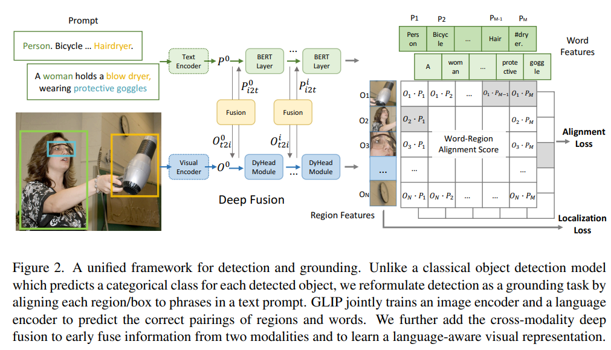

# Vision-Language Model

多模态中最主要的两个模态vision-language，视觉语言模型

## Intro

- open-vocabulary detection:检测器不再只识别训练集中固定的类别，而是可以根据文本提示检测新的类别。传统目标检测是 closed-set detection，只能输出固定的类别
-  grounding:给模型一张图和一段文字，让模型找出文字中某个短语对应图像里的区域

主要是三个发展脉络

1. **早期视觉语言任务阶段**：主要做 caption、VQA、图文检索。模型通常是 CNN 或 detector 提视觉特征，再和 RNN、Transformer 文本特征融合。
2. **图文对齐阶段**：代表是 CLIP。它用大规模图文对训练，把图像和文本映射到同一个语义空间，所以可以做 zero-shot classification 和 open-vocabulary 任务。VLM survey 也把 CLIP 看作后续大规模 VLM 的重要基础之一。
3. **生成式 VLM 阶段**：代表有 BLIP、Flamingo、LLaVA、GPT-4V、Qwen-VL 等。模型不只是匹配图文，而是能围绕图像进行问答、解释、推理和多轮对话。近年的 VLM 趋势是用强大的 LLM 作为语言主干，再接入视觉编码器和 adapter

## Papers

- a review: https://arxiv.org/html/2501.02189v4?utm_source=chatgpt.com

### CLIP

- __Learning Transferable Visual Models From Natural Language Supervision.__ *Alec Radford et al.* __International Conference on Machine Learning, 2021__ [(Arxiv)](https://arxiv.org/abs/2103.00020) [(S2)](https://www.semanticscholar.org/paper/6f870f7f02a8c59c3e23f407f3ef00dd1dcf8fc4) (Citations __47496__) ([My PDF](https://drive.google.com/file/d/14vhInYtZPcvDk3PauVsCOK7oewLQBorM/view?usp=drivesdk)) from openai

  - Takeaway:

    CLIP 用大规模图文对进行预训练，让图像和文本进入同一个语义空间，从而支持 zero-shot transfer

    CLIP(Contrastive Language-Image Pre-training) 的核心贡献是把 web-scale 的 `(image, text)` pairs 当成自然语言监督，用 contrastive learning 同时训练 image encoder 和 text encoder。训练后，文本可以直接描述视觉类别，从而把 CV classification 从固定 label set 推向 flexible zero-shot transfer。
  
    > [!NOTE]
    >
    > 突破categorical label
  
  - Motivation:

    传统 CV 模型通常在 ImageNet 这类固定类别数据集上训练，输出空间被预定义 label 限死；如果要识别新概念，就需要重新收集标注数据或重新训练分类头。CLIP 想回答的问题是：能不能像 NLP 里的 GPT 一样，直接从互联网上大量自然语言监督中学到可迁移的视觉表示？
  
    - Natural language 比人工分类标签表达力更强，可以覆盖 open vocabulary 的视觉概念。
    - Web 上天然存在大量图片和相关文本，规模远大于人工标注数据集。
    - 如果 image representation 和 language representation 对齐，那么下游任务可以通过 prompt / class name 指定，而不是训练 dataset-specific classifier。

  - Core Mechanism:

    - Contrastive image-text pre-training

      
  
      简单模型获得超牛逼的效果

      - What:

        CLIP 用一个 image encoder $f_I$ 和一个 text encoder $f_T$ 分别编码图片和文本，然后把它们投影到同一个 multi-modal embedding space。给定一个 batch 中的 $N$ 个真实图文对，模型要在 $N \times N$ 个可能配对里找出正确配对。
  
        $$
        s_{ij} = \frac{f_I(x_i)^\top f_T(t_j)}{\lVert f_I(x_i) \rVert \lVert f_T(t_j) \rVert} \cdot \exp(\tau)
        $$

        loss 为带temperature的cosine similarity logits。这里 $s_{ij}$ 是第 $i$ 张图和第 $j$ 段文本的 cosine similarity logits，$\tau$ 是可学习的 temperature，用来控制 softmax 分布的尖锐程度。

      - Why:
  
        直接生成 caption 太难也太低效，因为同一张图片可能有很多合理描述；contrastive objective 只要求判断“哪段文本和图片匹配”，监督信号更简单，也更适合大规模训练。论文中作者发现，相比 caption generation 或 bag-of-words prediction，contrastive objective 明显提高 zero-shot transfer 的训练效率。

      - How:

        训练时同时做 image-to-text 和 text-to-image 两个方向的 cross entropy，让真实配对的相似度变高，batch 内其他错误配对的相似度变低：
  
        $$
        \mathcal{L}=\frac{1}{2}\left[\frac{1}{N}\sum_i -\log \frac{\exp(s_{ii})}{\sum_j \exp(s_{ij})}+\frac{1}{N}\sum_i -\log \frac{\exp(s_{ii})}{\sum_j \exp(s_{ji})}\right]
        $$

        这个目标本质上把一个 batch 变成了 $N$ 类分类问题：每张图的正确文本是它自己的 caption，每段文本的正确图片也是它自己的 paired image。

    - Natural language as a dynamic classifier

      - What:

        CLIP 的 text encoder 不只是辅助训练，而是在 inference 时直接生成 zero-shot classifier 的权重。对于一个分类任务，先把类别名写成 prompt，比如 `a photo of a {label}`，再编码成文本特征；图片特征和所有类别文本特征做 similarity，最高者就是预测类别。

      - Why:

        这让模型不再绑定固定标签空间。传统线性分类器的类别权重来自训练数据，而 CLIP 的类别权重来自自然语言描述，所以新类别可以通过文本即时定义。

      - How:

        实际使用时会对类别名做 prompt engineering 和 prompt ensembling。论文报告默认 prompt `A photo of a {label}.` 已经能改善 ImageNet zero-shot，多个 prompt 的 text embeddings 做 ensemble 还能进一步提升约 5 个点的平均表现。

    - Scalable encoder choices

      - What:

        Image encoder 使用改造过的 ResNet 或 Vision Transformer，text encoder 使用 Transformer，并把 `[EOS]` 位置的表示投影到 shared embedding space。

      - Why:

        CLIP 的重点不是提出新 backbone，而是证明大规模 natural language supervision + contrastive objective 能让标准视觉/文本 encoder 学到可迁移对齐表示。
  
      - How:
  
        论文在 400M WebImageText pairs 上训练 8 个不同规模模型；最大 ResNet 模型 RN50x64 和最大 ViT-L/14@336px 都显示 transfer performance 随 compute 平滑提升。

  - Pipeline:
  
    1. 从 web 构建 400M `(image, text)` pairs，覆盖尽可能多的视觉概念，论文称为 WebImageText(WIT)。
    2. 对每个 batch，image encoder 编码图片，text encoder 编码对应文本，并线性投影到同一个 embedding space。
    3. 计算所有 image-text 组合的 cosine similarity logits，形成 $N \times N$ 配对矩阵。
    4. 用 symmetric cross entropy 同时优化 image-to-text 和 text-to-image matching。
    5. 下游 zero-shot classification 时，把类别名改写成 prompt，经 text encoder 得到分类器权重；图片经 image encoder 得到特征后，与所有文本类别向量做 similarity 并 softmax。
  
  - Pros:
  
    - 把 CV 的监督形式从固定 class id 扩展到 natural language，zero-shot 接口非常灵活。
    - Contrastive objective 简洁高效，避免了 caption generation 的高成本和多解问题。
    - 在 30+ 个视觉数据集上展示了非平凡迁移能力，ImageNet zero-shot 可匹配原始 ResNet-50 的监督训练表现。
    - 对自然分布偏移更鲁棒；论文发现 zero-shot CLIP 比同等 ImageNet accuracy 的 supervised ImageNet 模型更能泛化到多种 shifted distributions。
  
  - Cons:
  
    - 训练依赖 400M web-scale 图文对和大量算力，普通研究者很难复现完整训练。
    - WebImageText 数据来自互联网，会继承噪声、偏见、隐私和安全风险，论文也专门讨论了 broader impacts。
    - Zero-shot 表现对 prompt wording 和 prompt ensemble 比较敏感，不同任务需要一定 prompt engineering。
    - CLIP 主要学习 image-text alignment，并不天然解决检测、分割、定位等需要精细空间输出的视觉任务。

### GLIP

- __Grounded Language-Image Pre-training.__ *Liunian Harold Li et al.(microsoft)* __CVPR, 2022__ [(Arxiv)](https://arxiv.org/abs/2112.03857) [(S2)](https://www.semanticscholar.org/paper/5341b412383c43f4a693ad63ec4489e3ec7688c8) (Citations __1601__)

  - Takeaway:

    GLIP 统一目标检测和phrase grounding。CLIP 学的是图像和整句文本的匹配，GLIP 学的是文本短语和图像区域的匹配

  - Motivation:

    CLIP 已经证明 natural language supervision 可以学到可迁移的 image-level 表示，但它主要输出整图 embedding，缺少 object-level localization 能力。传统 detector 又绑定固定类别集合，扩展新类别需要重新标注和训练。GLIP 的问题意识是：能不能把“检测某些类别”和“把文本短语定位到图中区域”变成同一个任务，从而同时利用 detection data、grounding data 和大规模 web 图文对？

    - Detection label 本质上也是 phrase，例如 COCO 的 `person. bicycle. car.` 可以被写成一个 prompt。
    - Phrase grounding 天然提供 region-text correspondence，比 image-level contrastive learning 更适合学 object-level semantic representation。
  
      > grounding本质就是定位问题
    - Open-vocabulary detection 不一定要无条件发现所有物体，只需要定位 prompt 中提到的概念。

  - Core Mechanism:

    

    - Detection as grounding

      - What:

        GLIP 用 text prompt 表示待检测类别或自然语言描述，用 detector 产生候选 box / region features，再把传统 object classifier 替换为 word-region alignment score。若视觉区域特征为 $O_i$，文本 token / phrase 特征为 $P_j$，则分类分数来自二者相似度：
  
        $$
        s_{ij}=O_i^\top P_j
        $$

        这里 $s_{ij}$ 表示第 $i$ 个 region 是否对应第 $j$ 个文本概念；ground truth box 和 phrase 之间的 positive map 决定哪些 token 是正样本。

      - Why:

        固定类别 detector 的 classifier 权重只能覆盖训练集 label，而 prompt 里的 phrase 可以动态给出类别空间。把 detection 视为 grounding 后，检测任务就可以共享 grounding 数据中的 phrase-box supervision，也可以直接迁移到未见过的类别名。

      - How:

        对 object detection，prompt 是类别名列表；对 phrase grounding，prompt 是原始句子。模型预测 box 后，一边做 box regression，一边用 region-text alignment 做分类 / grounding loss。推理时只要把目标类别写进 prompt，GLIP 就能输出对应 boxes。

    - Deep vision-language fusion

      - What:

        GLIP 不是像 CLIP 那样只在最终 embedding 上做 shallow alignment，而是在 detector 内部做 early / deep fusion：visual encoder 提取多尺度视觉特征，BERT 编码文本，DyHead 模块在检测过程中持续融合语言信息。

      - Why:

        Object detection 需要精细空间定位，只在最后把视觉 box embedding 和文本 embedding 点乘容易丢失局部语义。Deep fusion 让 box proposal、feature refinement 和 classification 都被 prompt 条件化。

      - How:

        论文实现基于 Dynamic Head：visual features 和 word features 在多个 DyHead layer 中交互，输出 language-aware region features。作者还发现 prompt tuning 对这种 deep-fused detector 更有效，因为 prompt embedding 能实际影响检测分支。

    - Self-training on web image-text pairs

      - What:

        GLIP 先用人工标注 detection / grounding 数据训练 teacher，再对 web image-text pairs 自动抽取 noun phrases 并生成 pseudo boxes，构造大规模 phrase-box 数据。

      - Why:

        人工 box 标注很贵，类别覆盖有限；web 文本包含大量长尾概念，但没有直接 box annotation。Self-training 把 noisy caption data 转成 object-level supervision，扩大语义覆盖。

      - How:

        论文预训练使用 27M grounding data，其中约 3M 来自人工标注，24M 来自 web-crawled image-text pairs；对 web 数据生成高置信 phrase-box pseudo annotations 后训练 student GLIP，使模型获得更丰富的 open-vocabulary object semantics。

  - Pipeline:
  
    1. 把 detection label list 或 natural sentence 写成 text prompt，并由 BERT text encoder 得到 word / phrase features。
    2. 图像经过 visual backbone 和 DyHead detector，产生多尺度视觉特征与候选 regions。
    3. 在 deep fusion 模块中交互视觉特征和语言特征，得到 language-aware region representations。
    4. 用 region-text alignment score 代替固定类别 classifier，同时优化 alignment / classification loss 和 box regression loss。
    5. 预训练阶段混合 detection、grounding 和 pseudo-labeled web image-text data；下游时通过改写 prompt 完成 zero-shot、few-shot 或 prompt tuning detection。

  - Pros:
  
    - 第一次把 object detection 和 phrase grounding 以很直接的方式统一起来，open-vocabulary 接口清晰。
    - 能利用 detection、grounding、web image-text 三类数据，object-level 语义覆盖比固定检测数据集更广。
    - Prompt-conditioned detector 在 zero-shot / few-shot ODinW、COCO、LVIS 等设置中展示了强迁移能力。
    - Deep fusion 让语言信息真正进入 localization 过程，而不是只做后处理 re-ranking。

  - Cons:
  
    - 训练管线复杂，依赖大规模数据混合、teacher pseudo labeling 和检测器工程，复现成本高。
    - Pseudo boxes 来自 teacher，自训练会继承 teacher bias 和 caption parsing noise。
    - 推理仍需要对 prompt 设计和类别词粒度较敏感；同义词、细粒度类别和长文本描述可能影响检测结果。
    - 基于 heavy detector + language encoder，速度和部署便利性不如后来的 real-time open-vocabulary YOLO 系列。

### Grounding-DINO

- __Grounding DINO: Marrying DINO with Grounded Pre-Training for Open-Set Object Detection.__ *Shilong Liu et al.* __arXiv, 2023__ [(Arxiv)](https://arxiv.org/abs/2303.05499) 

  - Takeaway:

    Grounding-DINO 把 closed-set DETR-style detector DINO 改造成 text-conditioned open-set detector：输入一张图和任意 prompt，输出 boxes 以及与文本 token 对齐的 phrase scores。它的关键是把 grounded pre-training、language-guided query selection 和 cross-modality decoder 接到 DINO 框架里。

  - Motivation:

    DINO 在 closed-set object detection 上很强，但类别空间固定；GLIP 等 grounded detector 能处理开放词表，但和现代 DETR / DINO 的 query-based 检测框架结合还不充分。Grounding-DINO 想把 DINO 的强定位能力和 grounding 模型的 language-conditioned recognition 合起来，得到一个可作为下游基座的 open-set detector。

    - Open-set detection 需要同时解决 localization 和 text-object matching。
    - DETR/DINO 的 query 机制适合端到端检测，但默认 query 不知道用户 prompt。
    - Grounded pre-training 可以把 detection、grounding、caption-like supervision 转成统一的 region-text 对齐训练信号。

  - Core Mechanism:

    - DINO detector with grounded pre-training

      

      - What:

        Grounding-DINO 保留 DINO 的 multi-scale image features、object queries、decoder 和 box prediction，但把类别预测改成 text-token alignment。给定 image features $F_I$ 和 text features $F_T$，模型不输出固定类别 logits，而是输出 query 与文本 token / phrase 的相似度。

      - Why:

        固定 softmax classifier 无法表达训练集外类别；用 text alignment 后，类别空间由 prompt 决定。DINO 的 box refinement 和 denoising training 提供强定位能力，grounding objective 提供开放词表语义能力。

      - How:

        训练时根据 box 和 phrase 的匹配关系构造 positive map；decoder query 预测 box，同时和文本 token 做 contrastive / alignment classification。整体损失仍包含 detection 常用的 box loss：

        $$
        \mathcal{L}=\lambda_{\text{cls}}\mathcal{L}_{\text{align}}+\lambda_{L1}\mathcal{L}_{L1}+\lambda_{\text{giou}}\mathcal{L}_{\text{GIoU}}
        $$

        其中 $\mathcal{L}_{\text{align}}$ 负责 query-text matching，$\mathcal{L}_{L1}$ 和 $\mathcal{L}_{\text{GIoU}}$ 负责 localization。

    - Feature enhancer

      - What:

        Feature enhancer 在 encoder 阶段同时增强 image features 和 text features，让两种模态在进入 query decoder 前就交互。

      - Why:

        如果视觉和语言只在最后对齐，模型很难把 prompt 信息用于 early localization。提前融合可以让图像特征知道哪些文本概念是当前任务关心的。

      - How:

        Image branch 使用 deformable self-attention 处理多尺度视觉特征，text branch 使用 self-attention 处理 token features，并通过 image-to-text / text-to-image cross-attention 交换信息，输出 language-aware image features 和 image-aware text features。

    - Language-guided query selection

      - What:

        Grounding-DINO 不随机或固定选择 decoder queries，而是根据 image features 与 text features 的相关性选择更可能对应 prompt 的视觉位置作为 queries。

      - Why:

        Open-set prompt 中的目标可能只占图像很小区域；query 初始化如果不看语言，会浪费大量 query 在无关区域。Language-guided selection 能让 decoder 从更相关的 candidate regions 开始。

      - How:

        Encoder 输出的视觉 token 与文本 token 计算 similarity，挑选 top-ranked image features 作为 object queries，再送入 cross-modality decoder 逐层 refined boxes 和 text alignment scores。

    - Cross-modality decoder

      - What:

        Decoder query 同时 attend 到 image features 和 text features，逐层更新 object representation，使每个 query 同时携带 box localization 信息和 phrase semantics。

      - Why:

        Grounding 输出不是“有没有某类”，而是“哪个 box 对应 prompt 中哪个短语”。Query 必须在 decoder 内部持续参考语言，才能处理长 prompt、多类别 prompt 和 phrase-level 对齐。

      - How:

        每层 decoder 用 self-attention 处理 queries，用 image cross-attention 聚合视觉证据，并用 text cross-attention / alignment head 连接文本。最终输出 boxes 和每个 box 对文本 token 的 score；推理时通过 box threshold 和 text threshold 得到 grounded detections。

  - Pipeline:

    1. 输入图像和 prompt；prompt 可以是类别列表，也可以是自然语言描述。
    2. Backbone 提取 multi-scale image features，text encoder 提取 token-level language features。
    3. Feature enhancer 进行 image-text 双向融合，得到 grounded multi-modal features。
    4. Language-guided query selection 根据文本相关性挑选 object queries。
    5. Cross-modality decoder 逐层 refine queries，输出 boxes 和 token-level alignment scores。
    6. 推理时用 box threshold 过滤候选框，用 text threshold / phrase aggregation 找到每个 box 对应的文本短语。

  - Pros:

    - 把 DINO 的强检测能力和 grounded language supervision 结合，定位质量和开放词表识别能力都强。
    - Query selection 被语言条件化，比纯 learned queries 更适合 prompt-driven detection。
    - 输出 token-level alignment，适合接 SAM、captioning、robotics 等需要 grounded boxes 的系统。
    - Prompt 接口灵活，可以用类别列表做 open-vocabulary detection，也可以用短语做 referring / grounding。

  - Cons:

    - 仍是 DETR-style transformer detector，推理速度和部署成本高于 YOLO-style real-time detector。
    - 对 prompt 分隔、阈值选择和 phrase 后处理敏感，实际使用常要调 box/text thresholds。
    - 训练依赖大规模 grounded data 和复杂 matching / positive map 构造。
    - 主要输出 boxes 和 token alignment，本身不直接解决 mask-level segmentation，需要与 SAM 等模型组合。

### Real-Time

#### Yolo-World

- __YOLO-World: Real-Time Open-Vocabulary Object Detection.__ *Tianheng Cheng et al.* __CVPR, 2024__ [(Arxiv)](https://arxiv.org/abs/2401.17270) 

  - Takeaway:

    YOLO-World 的核心是把 YOLO 改造成 real-time open-vocabulary detector：训练时用 text encoder 对齐 region 和文本，推理时可把离线 vocabulary embedding 重参数化进检测头，从而在开放类别检测和实时速度之间取得平衡。

  - Motivation:

    GLIP、Grounding-DINO 这类 open-vocabulary detector 能识别开放类别，但通常依赖 heavy vision-language transformer，推理慢、部署难。YOLO 系列速度快、工程成熟，却是 closed-set detector。YOLO-World 试图让 YOLO 获得 open-vocabulary 能力，同时保留实时检测优势。

    - 实时应用需要低延迟，而不是只追求最高 open-vocabulary AP。
    - 部署时常见场景是先给定一个 offline vocabulary，再长期用同一词表检测。
    - 如果 text embeddings 可以提前计算并折叠进网络，就能避免每帧重复跑 text encoder。

  - Core Mechanism:

    - Vision-language YOLO architecture

      

      - What:

        YOLO-World 保留 YOLO 的 backbone、neck 和 dense prediction head，但加入 CLIP text encoder 与 text contrastive head。每个 object prediction 不再输出固定类别 logits，而是输出 object embedding $e_k$，再和 vocabulary text embedding $w_j$ 做相似度：

        $$
        s_{k,j}=\alpha \cdot \mathrm{L2Norm}(e_k)^\top \mathrm{L2Norm}(w_j)+\beta
        $$

        其中 $s_{k,j}$ 是第 $k$ 个预测框与第 $j$ 个文本类别的 object-text similarity，$\alpha,\beta$ 是可学习缩放和平移参数。

      - Why:

        YOLO 的 dense head 非常高效，但固定 classifier 阻碍 open-vocabulary transfer。把 classifier 改成 region-text similarity 后，类别空间由文本词表决定，同时仍可沿用 YOLO 的快速 box regression。

      - How:

        训练时输入 image 和文本词表，检测头输出 boxes 与 object embeddings；region-text contrastive loss 让正确 box 靠近对应 text embedding，错误类别远离。推理时输入候选词表即可得到 open-vocabulary detections。

    - RepVL-PAN

      - What:

        RepVL-PAN 是 re-parameterizable Vision-Language Path Aggregation Network，在 YOLO 的 PAN/FPN neck 中加入 text-guided CSPLayer 和 image-pooling attention，让多尺度视觉特征与文本特征交互。

      - Why:

        如果只在最后检测头做文本相似度，YOLO 的中间视觉特征仍然是 closed-set 训练习惯。RepVL-PAN 让语言信息进入 multi-scale feature fusion，提高开放类别的 visual-semantic representation。

      - How:

        Text-guided CSPLayer 使用 max-sigmoid attention 将文本 embedding 注入图像特征。论文给出的核心形式是：

        $$
        X_l' = X_l \cdot \delta\left(\max_{j\in\{1..C\}}(X_l W_j^\top)\right)^\top
        $$

        其中 $X_l$ 是第 $l$ 层图像特征，$W_j$ 是第 $j$ 个文本 embedding，$\delta$ 是 sigmoid。部署到固定 offline vocabulary 时，文本 embedding 可以预计算并重参数化为卷积 / 线性权重，以减少推理开销。

    - Region-text contrastive pre-training

      - What:

        YOLO-World 混合 detection、grounding 和 image-text 数据进行预训练，把不同数据统一成 region-text pairs。对有准确 boxes 的 detection / grounding data 同时做分类对齐和 box regression；对 noisy image-text data 更谨慎地使用回归监督。

      - Why:

        仅靠 detection 数据类别有限，难以覆盖开放词表；仅靠 image-text 数据又缺 box supervision。混合训练让模型同时获得定位能力和长尾文本语义。

      - How:

        训练目标由 region-text contrastive loss 与 YOLO box regression loss 组成：

        $$
        \mathcal{L}(I)=\mathcal{L}_{con}+\lambda_I(\mathcal{L}_{iou}+\mathcal{L}_{dfl})
        $$

        其中 $\lambda_I$ 在输入样本有可靠 box annotation 时为 1；对于只来自 image-text 的 noisy 样本，则避免不可靠 box regression 破坏训练。

  - Pipeline:

    1. 准备 detection / grounding / image-text 数据，并把类别名、noun phrases 或 caption nouns 编成文本词表。
    2. CLIP text encoder 生成 text embeddings；YOLO image branch 提取多尺度视觉特征。
    3. RepVL-PAN 在 neck 中融合视觉和语言信息，dense head 输出 boxes 与 object embeddings。
    4. Text contrastive head 计算 object-text similarity，并用 region-text assignments 训练 contrastive classification。
    5. 对可靠标注样本同时训练 IoU / DFL box regression；对 noisy image-text 样本主要使用对齐监督。
    6. 推理时采用 prompt-then-detect：先给定 vocabulary，可离线预计算并重参数化 text embeddings，再以 YOLO-style dense prediction 实时检测。

  - Pros:

    - 直接面向 real-time open-vocabulary detection，部署友好度明显高于 heavy transformer-based grounded detector。
    - Prompt-then-detect 适合实际应用中的固定或半固定词表，text encoder 不必每帧运行。
    - RepVL-PAN 让语言信息进入 YOLO neck，而不是只在最终 head 做相似度。
    - 混合 detection、grounding、image-text 数据，兼顾定位质量和开放类别语义覆盖。

  - Cons:

    - 为了速度和可部署性，复杂语言理解和 phrase-level grounding 能力不如 Grounding-DINO 这类 transformer detector 灵活。
    - 离线词表重参数化适合固定 vocabulary；如果每张图都要复杂自然语言交互，优势会变小。
    - Image-text pseudo region data 仍依赖自动标注和过滤，容易引入噪声。
    - YOLO-style dense prediction 对小目标、长尾细粒度类别和复杂关系描述仍可能需要额外数据或调参。

## Relation
