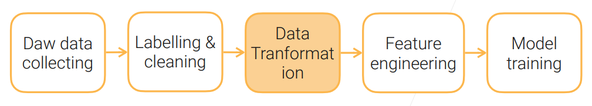
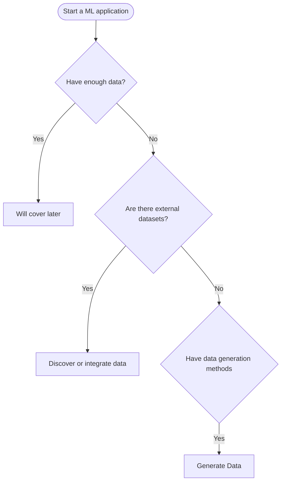
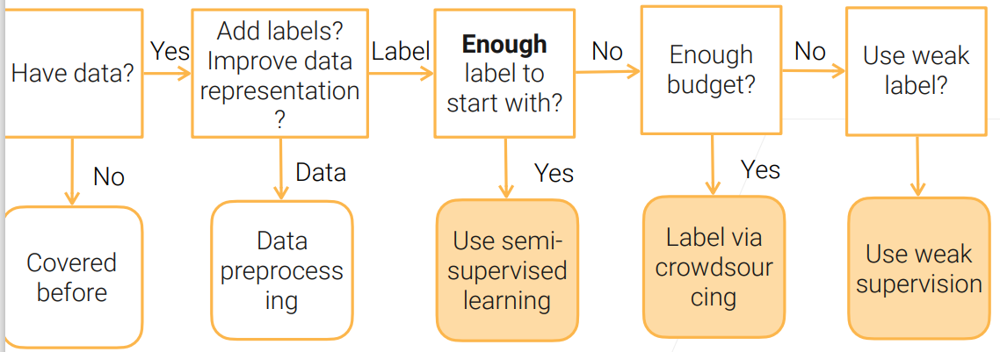

# Practical Machine Learning

from [stanford-cs329p](https://c.d2l.ai/stanford-cs329p/syllabus.html). Only notes some basic concepts, if you are interested in some sections, dive into it from the origin slides. 

- [Challenges in Deploying Machine Learning](https://arxiv.org/pdf/2011.09926)

## Data

### Data Acquisition

> Ref: [Data Collection for Machine Learning](https://arxiv.org/pdf/1811.03402.pdf)

We should Discover What Data is Available

- Identify existing datasets
- Find benchmark datasets to evaluate a new idea
  - E.g. A diverse set of small to medium datasets for a new hyperparameter tuning algorithm
  - E.g. Large scale datasets for a very big deep neural network

- [slide](https://c.d2l.ai/stanford-cs329p/_static/pdfs/cs329p_slides_1_3.pdf) includes: popular ml datasets and where to find datasets

- Data Integration
  - Key issues: identify IDs, missing rows,  redundant columns, value conflicts
- Generate Data(Synthetic Data):
  - Use GANs
  - Simulation
  - Data augmentations

### Web Scraping

- Crawling: indexing whole pages on Internet
- Scraping: scraping particular data from web pages of  a website

- Web scraping tools
  - 'curl' often doesn`t work
  - use headless browser
  - use a lot of new IPs, easy to get through public clouds

### Data labeling

- semi-supervised + crowdsouring

- quality control
- weak supervision: 
  - data programming: heuristic programs to assign labels 

### Data cleaning

### Data Transformation

- Normalization for Real Value Columns

  | Method                                                       | Formula                                                      |
  | ------------------------------------------------------------ | ------------------------------------------------------------ |
  | Min-max normalization: linearly map to a new min \(a\) and max \(b\) | \(x_i' = \dfrac{x_i - \min_x}{\max_x - \min_x} (b - a) + a\) |
  | Z-score normalization: \(0\) mean, \(1\) standard deviation  | \(x_i' = \dfrac{x_i - \text{mean}(\mathbf{x})}{\text{std}(\mathbf{x})}\) |
  | Decimal scaling                                              | \(x_i' = \dfrac{x_i}{10^j}\), smallest \(j\) s.t. $\max|x\prime|<1$ |
  | Log scaling                                                  | \(x_i' = \log(x_i)\)                                         |

- Image Transformations: cropping, downsampling, compression, Image whitening
- Video Transformations: clipping, sampling frames
- Text Transformations: stemming, lemmatization, tokenization

> [!NOTE]
>
> Need to balance storage, quality, and loading speed

### Feature Engineer

- Tabular Data Features
- Text Features
  - Represent text as token features
    - Bag of words (BoW) model
    - Word Embeddings (e.g. Word2vec)
  - Pre-trained universal language models (e.g.  universal sentence encoder, BERT, GPT-3)

- Image/Video Features

  - Traditionally extract images by hand-craft  features such as SIFT

  - Now pre-trained deep neural networks are  common used as feature extractor

    > [!TIP]
    >
    >  Many off-the-shelf models available

## Transfer Learning

[chech here](../Efficient-AI/04-Transfer-Learning.md)

## References

- [cs329p-syllabus](https://c.d2l.ai/stanford-cs329p/syllabus.html)
- [Challenges in Deploying Machine Learning](https://arxiv.org/pdf/2011.09926)
- [Data Collection for Machine Learning](https://arxiv.org/pdf/1811.03402.pdf)

