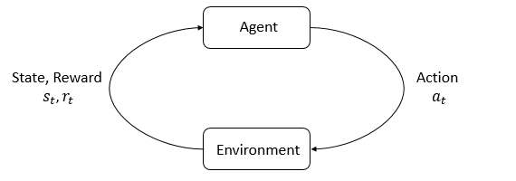

# Key Concepts and Terminology

check the [open AI](https://spinningup.openai.com/en/latest/spinningup/rl_intro.html#key-concepts-and-terminology)

[TOC]

## Markov Decision Process

**Markov Decision Processes** (MDPs). An MDP is a 5-tuple, $\langle S, A, R, P, \rho_0 \rangle$

- set of states S
- set of actions A
- transition function $P$
- reward function $R$
- start state $\rho_0$
- discount factor $\gamma$
- horizon $H$

强化学习的主要特征是智能体和环境。环境是智能体生活并与之交互的世界。在交互的每一步中，智能体都会看到对世界状态的（可能是部分的）观察，然后决定要采取的行动。当代理作用于环境时，环境会发生变化，但环境也可能会自行变化。

智能体还感知来自环境的奖励信号，这个数字告诉它当前世界状态的好坏。代理的目标是最大化其累积奖励，称为回报。强化学习方法是代理学习行为以实现其目标的方法。

## States and Observations

- A **state** $s$ is a complete description of the state of the world.
- An **observation** $o$ is a partial description of a state, which may omit information.

- When the agent is able to observe the complete state of the environment, we say that the environment is **fully observed**.
- When the agent can only see a partial observation, we say that the environment is **partially observed**.

## Action Spaces

- The set of all valid actions in a given environment is often called the **action space**.

- **discrete action spaces**, where only a finite number of moves are available to the agent
- **continuous action spaces**, like where the agent controls a robot in a physical world. In continuous spaces, actions are real-valued vectors.

## Policies

A **policy** is a rule used by an agent to decide what actions to take. The agent’s brain.

- deterministic: $a_t = \mu(s_t)$, in which case it is usually denoted by $\mu$

  eg: a neural network as the policy

- stochastic: $a_t \sim \pi(\cdot | s_t)$, in which case it is usually denoted by $\pi$

  Two key computations are centrally important for using and training stochastic policies:

  - sampling actions from the policy,
  - and computing log likelihoods of particular actions, $\log \pi_\theta(a|s)$.

  The two most common kinds of stochastic policies in deep RL

  - categorical policies: used in discrete action spaces like a classifier over discrete actions

    - Sampling. Given the probabilities for each action
    - Log-Likelihood. Denote the last layer of probabilities as $P_{\theta}(s)$. It is a vector with however many entries as there are actions, so we can treat the actions as indices for the vector. The log likelihood for an action $a$ can then be obtained by indexing into the vector: $\log \pi_\theta(a|s) = \log [P_\theta(s)]_a$

  - diagonal Gaussian policies: used in continuous action spaces

    > [!NOTE]
    >
    > A multivariate Gaussian distribution (or multivariate normal distribution, if you prefer) is described by a mean vector, $\mu$, and a covariance matrix, $\Sigma$. A diagonal Gaussian distribution is a special case where the covariance matrix only has entries on the diagonal. As a result, we can represent it by a vector.

    A diagonal Gaussian policy always has a **neural network** that maps from observations to mean actions, $\mu_{\theta}(s)$. There are two different ways that the covariance matrix is typically represented.

    1. There is a single vector of log standard deviations, $\log \sigma$, which is **not** a function of state: the $\log \sigma$ are standalone parameters.

       > [!TIP]
       >
       > our implementations of VPG, TRPO, and PPO do it this way

    2. There is a neural network that maps from states to log standard deviations, $\log \sigma_{\theta}(s)$. It may optionally share some layers with the mean network.

    Note that in both cases we output **log standard deviations** instead of standard deviations directly. This is because log stds are free to take on any values in $(-\infty, \infty)$, while stds must be nonnegative. It’s **easier to train parameters** if you don’t have to enforce those kinds of constraints. 

    - Sampling: Given the mean action $\mu_{\theta}(s)$ and standard deviation $\sigma_{\theta}(s)$, and a vector $z$ of noise from a spherical Gaussian ($z \sim \mathcal{N}(0, I)$), an action sample can be computed with
      $$
      a = \mu_{\theta}(s) + \sigma_{\theta}(s) \odot z,
      $$
      where $\odot$ denotes the elementwise product of two vectors.

    - Log-Likelihood: The log-likelihood of a $k$ -dimensional action $a$, for a diagonal Gaussian with mean $\mu = \mu_{\theta}(s)$ and standard deviation $\sigma = \sigma_{\theta}(s)$, is given by
      $$
      \log \pi_{\theta}(a|s) = -\frac{1}{2}\left(\sum_{i=1}^k \left(\frac{(a_i - \mu_i)^2}{\sigma_i^2} + 2 \log \sigma_i \right) + k \log 2\pi \right).
      $$

- parameterized policies: In deep RL, we deal with **parameterized policies**: policies whose outputs are computable functions that depend on a set of parameters (eg the weights and biases of a neural network) which we can adjust to change the behavior via some optimization algorithm.

  We often denote the parameters of such a policy by $\theta$ or $\phi$
  $$
  a_t = \mu_{\theta}(s_t) \\
  a_t \sim \pi_{\theta}(\cdot | s_t)
  $$

## Trajectories

- A trajectory $\tau$ is a sequence of states and actions in the world,
  $$
  \tau = (s_0, a_0, s_1, a_1, ...).
  $$
  The very first state of the world, $s_0$, is randomly sampled from the **start-state distribution**, sometimes denoted by $\rho_0$:
  $$
  s_0 \sim \rho_0(\cdot).
  $$

  > [!TIP]
  >
  > Trajectories are also frequently called **episodes** or **rollouts**.

- State transitions

  - deterministic: $s_{t+1} = f(s_t, a_t)$
  - stochastic: $s_{t+1} \sim P(\cdot|s_t, a_t)$

  Actions come from an agent according to its policy.

## Reward and Return

- Reward function depends on the current state of the world, the action just taken, and the next state of the world
  $$
  r_t = R(s_t, a_t, s_{t+1})
  $$
  although frequently this is simplified to just a dependence on the current state, , or state-action pair $r_t = R(s_t,a_t)$.

- The goal of the agent is to maximize some notion of cumulative reward over a trajectory

There are two kinds of return.

1. finite-horizon undiscounted return: $R(\tau) = \sum_{t=0}^T r_t.$

2. infinite-horizon discounted return: $R(\tau) = \sum_{t=0}^{\infty} \gamma^t r_t$

   the sum of all rewards *ever* obtained by the agent, but discounted by how far off in the future they’re obtained. a discount factor $\gamma \in (0,1)$

   > [!NOTE]
   >
   > Why a discount factor: 
   >
   > - cash now is better than cash early
   > - Mathematically: the infinite sum converges with a discount factor.

> [!TIP]
>
> While the line between these two formulations of return are quite stark in RL formalism, deep RL practice tends to blur the line a fair bit—for instance, we frequently set up algorithms to optimize the undiscounted return, but use discount factors in estimating **value functions**.

## RL Optimization Problem

- The goal in RL is to select a policy which maximizes **expected return** when the agent acts according to it.

Let’s suppose that both the environment transitions and the policy are stochastic. In this case, the probability of a $T$ -step trajectory is:
$$
P(\tau|\pi) = \rho_0 (s_0) \prod_{t=0}^{T-1} P(s_{t+1} | s_t, a_t) \pi(a_t | s_t).
$$
The expected return (for whichever measure), denoted by $J(\pi)$, is then:
$$
J(\pi) = \int_{\tau} P(\tau|\pi) R(\tau) = E_{\tau\sim \pi}{R(\tau)}.
$$
The central optimization problem in RL can then be expressed by
$$
\pi^* = \arg \max_{\pi} J(\pi),
$$
with $\pi^*$ being the **optimal policy**.

## Value Functions

It’s often useful to know the **value** of a state, or state-action pair. By value, we mean the expected return if you start in that state or state-action pair, and then act according to a particular policy forever after. **Value functions** are used, one way or another, in almost every RL algorithm.

There are four main functions of note here.

1. The **On-Policy Value Function**, $V^{\pi}(s)$, which gives the expected return if you start in state $s$ and always act according to policy $\pi$: 在状态 $s$ 继续按策略走，长期有多好
   $$
   V^{\pi}(s) = E_{\tau \sim \pi}[{R(\tau)\left| s_0 = s\right.}]
   $$

2. The **On-Policy Action-Value Function**, $Q^{\pi}(s,a)$, which gives the expected return if you start in state $s$, take an arbitrary action $a$ (which may not have come from the policy), and then forever after act according to policy $\pi$: 在 $s$ 先做动作 $a$，再按策略走，长期有多好
   $$
   Q^{\pi}(s,a) = E_{\tau \sim \pi}[{R(\tau)\left| s_0 = s, a_0 = a\right.}]
   $$

3. The **Optimal Value Function**, $V^*(s)$, which gives the expected return if you start in state $s$ and always act according to the *optimal* policy in the environment:
   $$
   V^*(s) = \max_{\pi} E_{\tau \sim \pi}[{R(\tau)\left| s_0 = s\right.}]
   $$

4. The **Optimal Action-Value Function**, $Q^*(s,a)$, which gives the expected return if you start in state $s$, take an arbitrary action $a$, and then forever after act according to the *optimal* policy in the environment:
   $$
   Q^*(s,a) = \max_{\pi} E_{\tau \sim \pi}[{R(\tau)\left| s_0 = s, a_0 = a\right.}]
   $$

There are two key connections between the value function and the action-value function that come up pretty often:
$$
V^{\pi}(s) = E_{a\sim \pi}[{Q^{\pi}(s,a)}]
$$
and
$$
V^*(s) = \max_a Q^* (s,a)
$$

### The Optimal Q-Function and the Optimal Action

If we have $Q^*$, we can directly obtain the optimal action, $a^*(s)$, via
$$
a^*(s) = \arg \max_a Q^* (s,a).
$$

> [!NOTE]
>
> There may be multiple actions which maximize $Q^*(s,a)$, in which case, all of them are optimal, and the optimal policy may randomly select any of them. But there is always an optimal policy which deterministically selects an action.

### Bellman Equations

All four of the value functions obey special self-consistency equations called **Bellman equations**. 

- The basic idea behind the Bellman equations is this: The value of your starting point is the reward you expect to get from being there, plus the value of wherever you land next.

- The Bellman equations for the **on-policy value functions** are
  $$
  \begin{align*} V^{\pi}(s) &= E_{a \sim \pi \\ s'\sim P}[{r(s,a) + \gamma V^{\pi}(s')}], \\
  Q^{\pi}(s,a) &= E_{s'\sim P}[{r(s,a) + \gamma E_{a'\sim \pi}[{Q^{\pi}(s',a')}}]], \end{align*}
  $$
  where $s' \sim P$ is shorthand for $s' \sim P(\cdot |s,a)$, indicating that the next state $s'$ is sampled from the environment’s transition rules; $a \sim \pi$ is shorthand for $a \sim \pi(\cdot|s)$; and $a' \sim \pi$ is shorthand for $a' \sim \pi(\cdot|s')$.

- The Bellman equations for the **optimal value functions** are
  $$
  \begin{align*} V^*(s) &= \max_a E_{s'\sim P}[{r(s,a) + \gamma V^*(s')}], \\
  Q^*(s,a) &= E_{s'\sim P}[{r(s,a) + \gamma \max_{a'} Q^*(s',a')}]. \end{align*}
  $$

The main difference is the absence or presence of the max over actions.

## Advantage Functions

Sometimes in RL, we don’t need to describe how good an action is in an absolute sense, but only how much better it is than others on average. That is to say, we want to know the relative **advantage** of that action. We make this concept precise with the **advantage function.**
$$
A^\pi(s,a)=Q^\pi(s,a)-V^\pi(s)
$$

> 这个action“比平均水平好多少”

## References

- [open AI](https://spinningup.openai.com/en/latest/spinningup/rl_intro.html#key-concepts-and-terminology)
- [Reinforcement Learning: An Introduction of stanford](https://web.stanford.edu/class/psych209/Readings/SuttonBartoIPRLBook2ndEd.pdf?utm_source=chatgpt.com)
