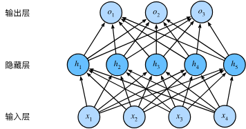

# Main Takeaway

在本章中，我们将第一次介绍真正的**深度**网络。最简单的深度网络称为**多层感知机**。多层感知机由多层神经元组成，每一层与它的上一层相连，从中接收输入；同时每一层也与它的下一层相连，影响当前层的神经元。当我们训练容量较大的模型时，我们面临着**过拟合**的风险。因此，本章将从基本的概念介绍开始讲起，包括**过拟合**、**欠拟合**和模型选择。为了解决这些问题，本章将介绍**权重衰减**和**暂退法**等正则化技术。我们还将讨论数值稳定性和参数初始化相关的问题，这些问题是成功训练深度网络的关键。

<!--more-->

# MLP(Multilayer Perceptrons)

从线性模型进化：对每个隐藏单元应用非线性的激活函数(activation function)

# Activation Function

- ReLU：最受欢迎的激活函数**修正线性单元**（Rectified linear unit，**ReLU**），

  因为它实现简单，同时在各种预测任务中表现良好，减轻了梯度消失问题
  $$
  ReLU(x) = \max(x,0)
  $$

  > ReLU还有许多变体

- sigmoid：将范围（-inf, inf）中的任意输入压缩到区间（0, 1）中的某个值
  $$
  sigmoid(x) = \frac{1}{1+\exp(-x)}
  $$
  sigmoid函数的导数为下面的公式：
  $$
  \frac{d}{dx} \operatorname{sigmoid}(x) = \frac{\exp(-x)}{(1 + \exp(-x))^2} = \operatorname{sigmoid}(x)\left(1-\operatorname{sigmoid}(x)\right).
  $$
  

  当sigmoid输入很大或很小时，常会造成梯度消失
  
- tanh：双曲正切，将输入压缩转换到区间(-1, 1)
  $$
  \operatorname{tanh}(x) = \frac{1 - \exp(-2x)}{1 + \exp(-2x)}.
  $$
  tanh函数的导数是：
  $$
  \frac{d}{dx} \operatorname{tanh}(x) = 1 - \operatorname{tanh}^2(x).
  $$

# underfitting and overfitting

- 模型复杂度

  - 可调整参数的数量。当可调整参数的数量（有时称为**自由度**）很大时，模型往往更容易过拟合。
  - 参数采用的值。当权重的取值范围较大时，模型可能更容易过拟合。
  - 训练样本的数量。即使模型很简单，也很容易过拟合只包含一两个样本的数据集。而过拟合一个有数百万个样本的数据集则需要一个极其灵活的模型。

- 模型选择：在机器学习中，我们通常在评估几个候选模型后选择最终的模型

  不同类模型/同类模型不同超参数

- $K$折交叉验证：当训练数据稀缺时，我们甚至可能无法提供足够的数据来构成一个合适的验证集。这个问题的一个流行的解决方案是采用$K$**折交叉验证**。

  这里，原始训练数据被分成$K$个不重叠的子集。然后执行$K$次模型训练和验证，每次在$K-1$个子集上进行训练，并在剩余的一个子集（在该轮中没有用于训练的子集）上进行验证。最后，通过对$K$次实验的结果取平均来估计训练和验证误差。

- underfitting欠拟合：训练误差和验证误差都很严重，但它们之间仅有一点差距。如果模型不能降低训练误差，这可能意味着模型过于简单（即表达能力不足）

- overfitting过拟合：训练误差明显低于验证误差时要小心，这表明严重的过拟合（overfitting）

  

  方差偏差权衡

## 提升泛化性

- 在输入中加入小的随机噪声进行训练，等价于在目标函数中加入一种特定形式的Tikhonov正则项（即光滑性约束）

- **暂退法**（dropout）：在计算后续层之前向网络的每一层注入噪声。因为当训练一个有多层的深层网络时，注入噪声只会在输入-输出映射上增强平滑性

  > 这种方法之所以被称为**暂退法**，因为我们从表面上看是在训练过程中丢弃（drop out）一些神经元。那为什么是注入噪声，因为它相当于给每个激活值注入乘性噪声$h\prime = h\cdot r_i$

  - 如何注入这种噪声：一种想法是以一种**无偏向**（unbiased）的方式注入噪声。这样在固定住其他层时，每一层的期望值等于没有噪音时的值

    在标准暂退法正则化中，通过按保留（未丢弃）的节点的分数进行规范化来消除每一层的偏差。

    换言之，每个中间活性值$h$以**暂退概率**$p$由随机变量$h'$替换，如下所示：
    $$
    \begin{aligned}
    
    h' =
    
    \begin{cases}
    
      0 & \text{ 概率为 } p \\
    
      \frac{h}{1-p} & \text{ 其他情况}
    
    \end{cases}
    
    \end{aligned}
    $$
    根据此模型的设计，其期望值保持不变，即$E[h'] = h$。

  - 测试：通常，我们在测试时不用暂退法。给定一个训练好的模型和一个新的样本，我们不会丢弃任何节点，因此不需要标准化。然而也有一些例外：一些研究人员在测试时使用暂退法，用于估计神经网络预测的“不确定性”：如果通过许多不同的暂退法遮盖后得到的预测结果都是一致的，那么我们可以说网络发挥更稳定。

  - 实践：我们可以将暂退法应用于每个隐藏层的输出（在激活函数之后），并且可以为每一层分别设置暂退概率：常见的技巧是在靠近输入层的地方设置较低的暂退概率，

  - 并且暂退法只在训练期间有效。

# 范数与正则化

- $L1$正则化线性回归（lasso regression）

  $L_1$惩罚会导致模型将权重集中在一小部分特征上，而将其他权重清除为零。这称为**特征选择**（feature selection）

- $L_2$正则化线性模型岭回归（ridge regression），也称为权重衰减（weight decay）

  通过线性函数$f(\mathbf{x}) = \mathbf{w}^\top \mathbf{x}$中的权重向量的某个范数来度量其复杂性，例如$\| \mathbf{w} \|^2$。

  要保证权重向量比较小，最常用方法是将其范数作为惩罚项加到最小化损失的问题中。将原来的训练目标**最小化训练标签上的预测损失**，调整为**最小化预测损失和惩罚项之和**。现在，如果我们的权重向量增长的太大，我们的学习算法可能会更集中于最小化权重范数$\| \mathbf{w} \|^2$。这正是我们想要的。

  我们的损失由下式给出：
  $$
  L(\mathbf{w}, b) = \frac{1}{n}\sum_{i=1}^n \frac{1}{2}\left(\mathbf{w}^\top \mathbf{x}^{(i)} + b - y^{(i)}\right)^2.
  $$
  回想一下，$\mathbf{x}^{(i)}$是样本$i$的特征，$y^{(i)}$是样本$i$的标签，$(\mathbf{w}, b)$是权重和偏置参数。为了惩罚权重向量的大小，我们必须以某种方式在损失函数中添加$\| \mathbf{w} \|^2$，

  但是模型应该如何平衡这个新的额外惩罚的损失？实际上，我们通过**正则化常数**$\lambda$来描述这种权衡，这是一个非负超参数，我们使用验证数据拟合：
  $$
  L(\mathbf{w}, b) + \frac{\lambda}{2} \|\mathbf{w}\|^2,
  $$

  - 对于$\lambda = 0$，我们恢复了原来的损失函数。

  - 对于$\lambda > 0$，我们限制$\| \mathbf{w} \|$的大小。

  这里我们仍然除以$2$：当我们取一个二次函数的导数时，$2$和$1/2$会抵消，以确保更新表达式看起来既漂亮又简单。

  > 为什么在这里我们使用平方范数而不是标准范数（即欧几里得距离）？
  >
  > 我们这样做是为了便于计算。通过平方$L_2$范数，我们去掉平方根，留下权重向量每个分量的平方和。这使得惩罚的导数很容易计算：导数的和等于和的导数。

  $L_2$正则化回归的小批量随机梯度下降更新如下式：
  $$
  \begin{aligned}
  
  \mathbf{w} & \leftarrow \left(1- \eta\lambda \right) \mathbf{w} - \frac{\eta}{|\mathcal{B}|} \sum_{i \in \mathcal{B}} \mathbf{x}^{(i)} \left(\mathbf{w}^\top \mathbf{x}^{(i)} + b - y^{(i)}\right).
  
  \end{aligned}
  $$
  根据之前章节所讲的，我们根据估计值与观测值之间的差异来更新$\mathbf{w}$。然而，我们同时也在试图将$\mathbf{w}$的大小缩小到零。这就是为什么这种方法有时被称为**权重衰减**。

  我们仅考虑惩罚项，优化算法在训练的每一步**衰减**权重。与特征选择相比，权重衰减为我们提供了一种连续的机制来调整函数的复杂度。较小的$\lambda$值对应较少约束的$\mathbf{w}$，而较大的$\lambda$值对$\mathbf{w}$的约束更大。

  是否对相应的偏置$b^2$进行惩罚在不同的实践中会有所不同，在神经网络的不同层中也会有所不同。通常，网络输出层的偏置项不会被正则化。

# 参数初始化

神经网络中有个问题时其参数化时所固有的对称性，解决（减轻）这个问题的一种法昂发时参数初始化

- 随机初始化：对于中等难度的问题常有效

- Xavier初始化：

  让我们看看某些**没有非线性**的全连接层输出（例如，隐藏变量）$o_{i}$的尺度分布。

  对于该层$n_\mathrm{in}$输入$x_j$及其相关权重$w_{ij}$，输出由下式给出
  $$
  o_{i} = \sum_{j=1}^{n_\mathrm{in}} w_{ij} x_j.
  $$
  权重$w_{ij}$都是从同一分布中独立抽取的。此外，让我们假设该分布具有零均值和方差$\sigma^2$。请注意，这并不意味着分布必须是高斯的，只是均值和方差需要存在。

  现在，让我们假设层$x_j$的输入也具有零均值和方差$\gamma^2$，并且它们独立于$w_{ij}$并且彼此独立。在这种情况下，我们可以按如下方式计算$o_i$的平均值和方差：
  $$
  \begin{aligned}
  
    E[o_i] & = \sum_{j=1}^{n_\mathrm{in}} E[w_{ij} x_j] \\&= \sum_{j=1}^{n_\mathrm{in}} E[w_{ij}] E[x_j] \\&= 0, \\
  
    \mathrm{Var}[o_i] & = E[o_i^2] - (E[o_i])^2 \\
  
  ​    & = \sum_{j=1}^{n_\mathrm{in}} E[w^2_{ij} x^2_j] - 0 \\
  
  ​    & = \sum_{j=1}^{n_\mathrm{in}} E[w^2_{ij}] E[x^2_j] \\
  
  ​    & = n_\mathrm{in} \sigma^2 \gamma^2.
  
  \end{aligned}
  $$
  保持方差不变的一种方法是设置$n_\mathrm{in} \sigma^2 = 1$。现在考虑反向传播过程，我们面临着类似的问题，尽管梯度是从更靠近输出的层传播的。使用与前向传播相同的推断，我们可以看到，除非$n_\mathrm{out} \sigma^2 = 1$，否则梯度的方差可能会增大，其中$n_\mathrm{out}$是该层的输出的数量。这使得我们进退两难：我们不可能同时满足这两个条件。相反，我们只需满足：
  $$
  \begin{aligned}
  
  \frac{1}{2} (n_\mathrm{in} + n_\mathrm{out}) \sigma^2 = 1 \text{ 或等价于 }
  
  \sigma = \sqrt{\frac{2}{n_\mathrm{in} + n_\mathrm{out}}}.
  
  \end{aligned}
  $$
  这就是现在标准且实用的**Xavier初始化**的基础，

  它以其提出者 :cite:`Glorot.Bengio.2010` 第一作者的名字命名。

  通常，Xavier初始化从均值为零，方差$\sigma^2 = \frac{2}{n_\mathrm{in} + n_\mathrm{out}}$的高斯分布中采样权重。我们也可以将其改为选择从均匀分布中抽取权重时的方差。注意均匀分布$U(-a, a)$的方差为$\frac{a^2}{3}$。将$\frac{a^2}{3}$代入到$\sigma^2$的条件中，将得到初始化值域：
  $$
  U\left(-\sqrt{\frac{6}{n_\mathrm{in} + n_\mathrm{out}}}, \sqrt{\frac{6}{n_\mathrm{in} + n_\mathrm{out}}}\right).
  $$
  尽管在上述数学推理中，“不存在非线性”的假设在神经网络中很容易被违反，

  但Xavier初始化方法在实践中被证明是有效的。

  - 适用于 **Sigmoid** 或 **tanh** 等**对称激活函数**；

    对于 **ReLU** 类激活函数，则推荐使用 **He 初始化**（Kaiming Initialization）：

- 还有十几种不同的启发式方法

# 数据预处理

- 处理缺失值

  1. 将缺失值替换为相应特征的平均值

  2. 将所有特征放在一个共同的尺度上——标准化数据
     $$
     x\leftarrow \frac{x-\mu}{\sigma}
     $$

- 处理离散值

  - 独热编码
