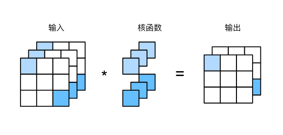

# Main Takeaway

Convolutional Neural Network (CNN)

CNN已经在图像识别、目标检测、图像生成和许多其他领域取得了显著的进展

<!--more-->

# From Fully Connected Layers to Convolutions

Convolutional neural networks (CNNs) are one creative way that machine learning has embraced for exploiting some of the known structure in natural images.

通常当我们处理图像时，我们希望逐渐降低隐藏表示的空间分辨率、聚集信息，这样随着我们在神经网络中层叠的上升，每个神经元对其敏感的感受野（输入）就越大。

而我们的机器学习任务通常会跟全局图像的问题有关（例如，“图像是否包含一只猫呢？”），所以我们最后一层的神经元应该对整个输入的全局敏感。通过逐渐聚合信息，生成越来越粗糙的映射，最终实现学习全局表示的目标，同时将卷积图层的所有优势保留在中间层。

## Constraining the MLP

首先，多层感知机的输入是二维图像$\mathbf{X}$，其隐藏表示$\mathbf{H}$在数学上是一个矩阵，在代码中表示为二维张量。其中$\mathbf{X}$和$\mathbf{H}$具有相同的形状。我们可以认为，无论是输入还是隐藏表示都拥有空间结构。

> 二维隐藏表示：我们希望中间层也保持这种型状，每个元素$[H]_{i,j}$对应输入图像某个区域的“特征响应”

使用$[\mathbf{X}]_{i, j}$和$[\mathbf{H}]_{i, j}$分别表示输入图像和隐藏表示中位置（$i$,$j$）处的像素。为了使每个隐藏神经元都能接收到每个输入像素的信息，我们将参数从权重矩阵（如同我们先前在多层感知机中所做的那样）替换为四阶权重张量$\mathsf{W}$。假设$\mathbf{U}$包含偏置参数，我们可以将全连接层形式化地表示为

$$
\begin{aligned} \left[\mathbf{H}\right]_{i, j} &= [\mathbf{U}]_{i, j} + \sum_k \sum_l[\mathsf{W}]_{i, j, k, l}  [\mathbf{X}]_{k, l}\\ &=  [\mathbf{U}]_{i, j} +
\sum_a \sum_b [\mathsf{V}]_{i, j, a, b}  [\mathbf{X}]_{i+a, j+b}.\end{aligned}
$$

其中，从$\mathsf{W}$到$\mathsf{V}$的转换只是形式上的转换，因为在这两个四阶张量的元素之间存在一一对应的关系。我们只需重新索引下标$(k, l)$，使$k = i+a$、$l = j+b$，由此可得$[\mathsf{V}]*_{i, j, a, b} = [\mathsf{W}]_*{i, j, i+a, j+b}$。索引$a$和$b$通过在正偏移和负偏移之间移动覆盖了整个图像。

对于隐藏表示中任意给定位置（$i$,$j$）处的像素值$[\mathbf{H}]_{i, j}$，可以通过在$x$中以$(i, j)$为中心对像素进行加权求和得到，加权使用的权重为$[\mathsf{V}]_{i, j, a, b}$。

> 这就从“全局连接”变成了“局部连接”——即卷积的思想开始出现

## 不变性Invariance

1. **平移不变性**（translation invariance）：不管检测对象出现在图像中的哪个位置，神经网络的前面几层应该对相同的图像区域具有相似的反应，即为“平移不变性”。

   现在引用上述的第一个原则：平移不变性。这意味着检测对象在输入$\mathbf{X}$中的平移，应该仅导致隐藏表示$\mathbf{H}$中的平移。也就是说，$\mathsf{V}$和$\mathbf{U}$实际上不依赖于$(i, j)$的值，即$[\mathsf{V}]_{i, j, a, b} = [\mathbf{V}]_{a, b}$。并且$\mathbf{U}$是一个常数，比如$u$。因此，我们可以简化$\mathbf{H}$定义为：

   $$
   [\mathbf{H}]_{i, j} = u + \sum_a\sum_b [\mathbf{V}]_{a, b} [\mathbf{X}]_{i+a, j+b}.
   $$

   这就是**卷积**（convolution）。我们是在使用系数$[\mathbf{V}]_{a, b}$对位置$(i, j)$附近的像素$(i+a, j+b)$进行加权得到$[\mathbf{H}]_{i, j}$。

   > 注意，$[\mathbf{V}]_{a, b}$的系数比$[\mathsf{V}]_{i, j, a, b}$少很多，因为前者不再依赖于图像中的位置。这就是显著的进步！
   >
2. **局部性**（locality）：神经网络的前面几层应该只探索输入图像中的局部区域，而不过度在意图像中相隔较远区域的关系，这就是“局部性”原则。最终，可以聚合这些局部特征，以在整个图像级别进行预测。

   现在引用上述的第二个原则：局部性。如上所述，为了收集用来训练参数$[\mathbf{H}]_{i, j}$的相关信息，我们不应偏离到距$(i, j)$很远的地方。这意味着在$|a|> \Delta$或$|b| > \Delta$的范围之外，我们可以设置$[\mathbf{V}]_{a, b} = 0$。因此，我们可以将$[\mathbf{H}]_{i, j}$重写为

   $$
   [\mathbf{H}]_{i, j} = u + \sum_{a = -\Delta}^{\Delta} \sum_{b = -\Delta}^{\Delta} [\mathbf{V}]_{a, b}  [\mathbf{X}]_{i+a, j+b}.
   $$

   简而言之，其是一个**卷积层**（convolutional layer），而卷积神经网络是包含多个卷积层的一类特殊的神经网络。

   在深度学习研究社区中，$\mathbf{V}$被称为**卷积核**（convolution kernel）或者**滤波器**（filter），亦或简单地称之为该卷积层的**权重**，通常该权重是可学习的参数。

   当图像处理的局部区域很小时，卷积神经网络与多层感知机的训练差异可能是巨大的：以前，多层感知机可能需要数十亿个参数来表示网络中的一层，而现在卷积神经网络通常只需要几百个参数，而且不需要改变输入或隐藏表示的维数。参数大幅减少的代价是，我们的特征现在是平移不变的，并且当确定每个隐藏活性值时，每一层只包含局部的信息。

## Convolutions

在进一步讨论之前，我们先简要回顾一下为什么上面的操作被称为卷积。在数学中，两个函数（比如$f, g: \mathbb{R}^d \to \mathbb{R}$）之间的“卷积”被定义为

$$
(f * g)(\mathbf{x}) = \int f(\mathbf{z}) g(\mathbf{x}-\mathbf{z}) d\mathbf{z}.
$$

也就是说，卷积是当把一个函数“翻转”并移位$\mathbf{x}$时，测量$f$和$g$之间的重叠。

当为离散对象时，积分就变成求和。例如，对于由索引为$\mathbb{Z}$的、平方可和的、无限维向量集合中抽取的向量，我们得到以下定义：

$$
(f * g)(i) = \sum_a f(a) g(i-a).
$$

对于二维张量，则为$f$的索引$(a, b)$和$g$的索引$(i-a, j-b)$上的对应加和：

$$
(f * g)(i, j) = \sum_a\sum_b f(a, b) g(i-a, j-b).
$$

这看起来类似于 :eqref:`eq_conv-layer`，但有一个主要区别：这里不是使用$(i+a, j+b)$，而是使用差值。然而，这种区别是表面的，因为我们总是可以匹配两个公式之间的符号。

> 实际上卷积层是个错误的叫法，实际上的运算是**互相关**（cross-correlation）

# Conv Layer

> 以图像为例

对于卷积核张量上的权重，我们称为元素element

```python
torch.nn.Conv2d(
    in_channels,          # 输入通道数 Cin
    out_channels,         # 输出通道数 Cout
    kernel_size,          # 卷积核尺寸，int 或 (kh, kw)
    stride=1,             # 步幅，int 或 (sh, sw)
    padding=0,            # 填充，int/(ph,pw) 或 'same'/'valid'
    dilation=1,           # 膨胀率，int 或 (dh, dw)
    groups=1,             # 分组卷积；深度可分离时=Cin
    bias=True,            # 是否带偏置
    padding_mode='zeros', # 'zeros' | 'reflect' | 'replicate' | 'circular'
    device=None,          # 模块参数放置的设备
    dtype=None            # 模块参数的数据类型
)
```

## 特征映射和感受野Feature Map and Receptive Field

- 特征映射：the convolutional layer output有时被称为特征映射

  > as it can be regarded as the learned representations (features) in the spatial dimensions (e.g., width and height) to the subsequent layer.
  >
- 感受野：是指在前向传播期间可能影响$x$计算的所有元素（来自所有先前层）

# Padding and Stride

假设输入形状为$n_h\times n_w$，卷积核形状为$k_h\times k_w$，那么输出形状将是（无填充和步幅）

$$
(n_h-k_h+1) \times (n_w-k_w+1)
$$

卷积的输出形状取决于输入形状和卷积核的形状，还有填充和步幅

- 填充

  - why：有时，在应用了连续的卷积之后，我们最终得到的输出远小于输入大小。这是由于卷积核的宽度和高度通常大于$1$所导致的。比如，一个$240 \times 240$像素的图像，经过$10$层$5 \times 5$的卷积后，将减少到$200 \times 200$像素。如此一来，原始图像的边界丢失了许多有用信息。而**填充**是解决此问题最有效的方法；
  - what：如果我们添加$p_h$行填充（大约一半在顶部，一半在底部）和$p_w$列填充（左侧大约一半，右侧一半），则输出形状将为

    $$
    (n_h-k_h+p_h+1)\times(n_w-k_w+p_w+1)。
    $$

    这意味着输出的高度和宽度将分别增加$p_h$和$p_w$。

    在许多情况下，我们需要设置$p_h=k_h-1$和$p_w=k_w-1$，使输入和输出具有相同的高度和宽度。

    > 但在Conv2d中设置的是一边的填充，所以为$p_h/2$
    >
    > 卷积神经网络中卷积核的高度和宽度通常为奇数，例如1、3、5或7。选择奇数的好处是，保持空间维度的同时，我们可以在顶部和底部填充相同数量的行，在左侧和右侧填充相同数量的列。
    >
- 步幅：

  - why：有时，我们可能希望大幅降低图像的宽度和高度。例如，如果我们发现原始的输入分辨率十分冗余。**步幅**则可以在这类情况下提供帮助。
  - what：通常，当垂直步幅为$s_h$、水平步幅为$s_w$时，输出形状为

    $$
    \lfloor(n_h-k_h+p_h+s_h)/s_h\rfloor \times \lfloor(n_w-k_w+p_w+s_w)/s_w\rfloor.
    $$

    如果我们设置了$p_h=k_h-1$和$p_w=k_w-1$，则输出形状将简化为$

    $$
    \lfloor(n_h+s_h-1)/s_h\rfloor \times \lfloor(n_w+s_w-1)/s_w\rfloor
    $$

    更进一步，如果输入的高度和宽度可以被垂直和水平步幅整除，则输出形状将为$(n_h/s_h) \times (n_w/s_w)$。

# Multiple Input and Multiple Output Channels

- 多输入通道：简而言之，我们所做的就是对每个通道执行互相关操作，然后将结果相加
- 多输出通道

  - why：在最流行的神经网络架构中，随着神经网络层数的加深，我们常会增加输出通道的维数，通过减少空间分辨率以获得更大的通道深度。直观地说，我们可以将每个通道看作对不同特征的响应。而现实可能更为复杂一些，因为每个通道不是独立学习的，而是为了共同使用而优化的。因此，多输出通道并不仅是学习多个单通道的检测器。
  - what：用$c_i$和$c_o$分别表示输入和输出通道的数目，并让$k_h$和$k_w$为卷积核的高度和宽度。为了获得多个通道的输出，我们可以为每个输出通道创建一个形状为$c_i\times k_h\times k_w$的卷积核张量，这样卷积核的形状是$c_o\times c_i\times k_h\times k_w$。在互相关运算中，每个输出通道先获取所有输入通道，再以对应该输出通道的卷积核计算出结果。
- $1\times 1$ Convolutional Layer

  $1 \times 1$卷积，即$k_h = k_w = 1$，看起来似乎没有多大意义。它不是用来提取相邻像素间的相关特征，而是用来在通道维度上进行线性组合。$1 \times 1$十分流行，经常包含在复杂深层网络的设计中。让我们详细地解读一下它的实际作用。

  - why：因为使用了最小窗口，$1\times 1$卷积失去了卷积层的特有能力——在高度和宽度维度上，识别相邻元素间相互作用的能力。其实$1\times 1$卷积的唯一计算发生在通道上。

    

    这里输入和输出具有相同的高度和宽度，输出中的每个元素都是从输入图像中同一位置的元素的线性组合。我们可以将$1\times 1$卷积层看作在每个像素位置应用的全连接层，以$c_i$个输入值转换为$c_o$个输出值。因为这仍然是一个卷积层，所以跨像素的权重是一致的。同时，$1\times 1$卷积层需要的权重维度为$c_o\times c_i$，再额外加上一个偏置。
  - how：

    - 通道压缩或升维（维度变换）
    - 跨通道特征融合
    - 增加网络深度 / 非线性表达
    - 用于 bottleneck
    - 实现分组卷积后的通道融合

# Pooling

两个目的：

- 降低卷积层对位置的敏感性
- 同时降低对空间降采样表示的敏感性

一般常用的两种pooling层，汇聚层不包含参数

- 最大汇聚层（maximum pooling）：取最大
- 平均汇聚层（average pooling）：取平均

汇聚层也会改变输出形状，因此我们也可以通过填充和步幅来获得所需的输出形状。默认情况下，(***\*深度学习框架中的步幅与汇聚窗口的大小相同\****)。

```
pool2d = nn.MaxPool2d(3, padding=1, stride=2)
pool2d = nn.MaxPool2d((2, 3), stride=(2, 3), padding=(0, 1))
```

pooling层在每个输入通道上单独运算（不会改变输入和输出通道数）

# Batch Normalization

批量规范法：训练深层神经网络是十分困难的，特别是在较短的时间内使他们收敛更加棘手。批量规范化（batch normalization） :cite:`Ioffe.Szegedy.2015`，这是一种流行且有效的技术，**可持续加速深层网络的收敛速度**。再结合在之后中将介绍的残差块，批量规范化使得研究人员能够训练100层以上的网络。

- why

  - 首先，数据预处理的方式通常会对最终结果产生巨大影响。回想一下我们应用多层感知机来预测房价的例子使用真实数据时，我们的第一步是标准化输入特征，使其平均值为0，方差为1。
    直观地说，这种标准化可以很好地与我们的优化器配合使用，因为它可以将参数的量级进行统一。
  - 第二，对于典型的多层感知机或卷积神经网络。当我们训练时，中间层中的变量（例如，多层感知机中的仿射变换输出）可能具有**更广的变化范围**：不论是沿着从输入到输出的层，跨同一层中的单元，或是随着时间的推移，模型参数的随着训练更新变幻莫测。
    - 批量规范化的发明者非正式地假设，这些变量分布中的这种偏移可能会阻碍网络的收敛。
    - 直观地说，我们可能会猜想，如果一个层的可变值是另一层的100倍，这可能需要对学习率进行补偿调整。
  - 第三，更深层的网络很复杂，容易过拟合。这意味着正则化变得更加重要。

- what

  - 步骤：

    1. 在每次训练迭代中，我们首先规范化输入，即通过减去其均值并除以其标准差，其中两者均基于当前小批量处理。

    2. 接下来，我们应用比例系数和比例偏移。

       > 正是由于这个基于*批量*统计的*标准化*，才有了*批量规范化*的名称。
       >
       > 只有使用足够大的小批量，批量规范化这种方法才是有效且稳定的。
       > 请注意，在应用批量规范化时，批量大小的选择可能比没有批量规范化时更重要。

    从形式上来说，用$\mathbf{x} \in \mathcal{B}$表示一个来自小批量$\mathcal{B}$的输入，批量规范化$\mathrm{BN}$根据以下表达式转换$\mathbf{x}$：

    $$
    \mathrm{BN}(\mathbf{x}) = \boldsymbol{\gamma} \odot \frac{\mathbf{x} - \hat{\boldsymbol{\mu}}_\mathcal{B}}{\hat{\boldsymbol{\sigma}}_\mathcal{B}} + \boldsymbol{\beta}.
    $$
    其中，$\hat{\boldsymbol{\mu}}_\mathcal{B}$是小批量$\mathcal{B}$的样本均值，$\hat{\boldsymbol{\sigma}}_\mathcal{B}$是小批量$\mathcal{B}$的样本标准差。应用标准化后，生成的小批量的平均值为0和单位方差为1。由于单位方差（与其他一些魔法数）是一个主观的选择，因此我们通常包含*拉伸参数*（scale）$\boldsymbol{\gamma}$和*偏移参数*（shift）$\boldsymbol{\beta}$，它们的形状与$\mathbf{x}$相同。

    > 请注意，$\boldsymbol{\gamma}$和$\boldsymbol{\beta}$是需要与其他模型参数一起学习的参数。

    由于在训练过程中，中间层的变化幅度不能过于剧烈，而批量规范化将每一层主动居中，并将它们重新调整为给定的平均值和大小（通过$\hat{\boldsymbol{\mu}}_\mathcal{B}$和${\hat{\boldsymbol{\sigma}}_\mathcal{B}}$）。

    从形式上来看，我们计算出中的$\hat{\boldsymbol{\mu}}_\mathcal{B}$和${\hat{\boldsymbol{\sigma}}_\mathcal{B}}$，如下所示：

    $$
    \begin{aligned} \hat{\boldsymbol{\mu}}_\mathcal{B} &= \frac{1}{|\mathcal{B}|} \sum_{\mathbf{x} \in \mathcal{B}} \mathbf{x},\\
    \hat{\boldsymbol{\sigma}}_\mathcal{B}^2 &= \frac{1}{|\mathcal{B}|} \sum_{\mathbf{x} \in \mathcal{B}} (\mathbf{x} - \hat{\boldsymbol{\mu}}_{\mathcal{B}})^2 + \epsilon.\end{aligned}
    $$
    请注意，我们在方差估计值中添加一个小的常量$\epsilon > 0$，以确保我们永远不会尝试除以零，即使在经验方差估计值可能消失的情况下也是如此。估计值$\hat{\boldsymbol{\mu}}_\mathcal{B}$和${\hat{\boldsymbol{\sigma}}_\mathcal{B}}$通过使用平均值和方差的噪声（noise）估计来抵消缩放问题。乍看起来，这种噪声是一个问题，而事实上它是有益的。

    > 事实证明，这是深度学习中一个反复出现的主题。由于尚未在理论上明确的原因，优化中的各种噪声源通常会导致更快的训练和较少的过拟合：这种变化似乎是正则化的一种形式。在一些初步研究中， :cite:`Teye.Azizpour.Smith.2018`和 :cite:`Luo.Wang.Shao.ea.2018`分别将批量规范化的性质与贝叶斯先验相关联。这些理论揭示了为什么批量规范化最适应$50 \sim 100$范围中的中等批量大小的难题。

    另外，批量规范化层在”训练模式“（通过小批量统计数据规范化）和“预测模式”（通过数据集统计规范化）中的功能不同。

    - 在训练过程中，我们无法得知使用整个数据集来估计平均值和方差，所以只能根据每个小批次的平均值和方差不断训练模型。
    - 而在预测模式下，可以根据整个数据集精确计算批量规范化所需的平均值和方差。

- how：回想一下，批量规范化和其他层之间的一个关键区别是，由于批量规范化在完整的小批量上运行，因此我们不能像以前在引入其他层时那样忽略批量大小。
  我们在下面讨论这两种情况：全连接层和卷积层，他们的批量规范化实现略有不同。

  - 全连接层
    通常，我们将批量规范化层置于全连接层中的仿射变换和激活函数之间。设全连接层的输入为x，权重参数和偏置参数分别为$\mathbf{W}$和$\mathbf{b}$，激活函数为$\phi$，批量规范化的运算符为$\mathrm{BN}$。那么，使用批量规范化的全连接层的输出的计算详情如下：
    $$
    \mathbf{h} = \phi(\mathrm{BN}(\mathbf{W}\mathbf{x} + \mathbf{b}) ).
    $$
    回想一下，均值和方差是在应用变换的"相同"小批量上计算的。

  - 卷积层
    同样，对于卷积层，我们可以在卷积层之后和非线性激活函数之前应用批量规范化。当卷积有多个输出通道时，我们需要对这些通道的“每个”输出执行批量规范化，每个通道都有自己的拉伸（scale）和偏移（shift）参数，这两个参数都是标量。假设我们的小批量包含$m$个样本，并且对于每个通道，卷积的输出具有高度$p$和宽度$q$。那么对于卷积层，我们在每个输出通道的$m \cdot p \cdot q$个元素上同时执行每个批量规范化。因此，在计算平均值和方差时，我们会收集所有空间位置的值，然后在给定通道内应用相同的均值和方差，以便在每个空间位置对值进行规范化。
  
  - 预测过程中的批量规范化
  
    正如我们前面提到的，批量规范化在训练模式和预测模式下的行为通常不同。
  
    - 首先，将训练好的模型用于预测时，我们不再需要样本均值中的噪声以及在微批次上估计每个小批次产生的样本方差了。
    - 其次，例如，我们可能需要使用我们的模型对逐个样本进行预测。
  
    一种常用的方法是通过移动平均估算整个训练数据集的样本均值和方差，并在预测时使用它们得到确定的输出。可见，和暂退法一样，批量规范化层在训练模式和预测模式下的计算结果也是不一样的。
  
    ```python
    net = nn.Sequential(
        nn.Conv2d(1, 6, kernel_size=5), nn.BatchNorm2d(6), nn.Sigmoid(),
        nn.AvgPool2d(kernel_size=2, stride=2),
        nn.Conv2d(6, 16, kernel_size=5), nn.BatchNorm2d(16), nn.Sigmoid(),
        nn.AvgPool2d(kernel_size=2, stride=2), nn.Flatten(),
        nn.Linear(256, 120), nn.BatchNorm1d(120), nn.Sigmoid(),
        nn.Linear(120, 84), nn.BatchNorm1d(84), nn.Sigmoid(),
        nn.Linear(84, 10))
    ```
  
    

# Function Classes

我们实际上是用神经网络来拟合一个函数，但是经过修改网络其拟合能力可能更差


右侧的嵌套函数（nested function）类$\mathcal{F}_1 \subseteq \ldots \subseteq \mathcal{F}_6$，我们可以避免上述问题。这样改进的函数表达能力相比之前会更强

因此，只有当较复杂的函数类包含较小的函数类时，我们才能确保提高它们的性能。
对于深度神经网络，如果我们能将新添加的层训练成*恒等映射*（identity function）$f(\mathbf{x}) = \mathbf{x}$，新模型和原模型将同样有效。同时，由于新模型可能得出更优的解来拟合训练数据集，因此添加层似乎更容易降低训练误差。于是提出了残差网络ResNet


# 经典CNN网络

经典的CNN网络有LeNet-5、AlexNet、VGG、GoogleNet、ResNet、DenseNet等。这些经典CNN网络结构中总是包含一些对于神经网络架构设计有巨大启发性的东西。

经典卷积神经网络的基本组成部分是下面的这个序列：

1. 带填充以保持分辨率的卷积层；
2. 非线性激活函数，如ReLU；
3. 汇聚层，如最大汇聚层。

下面介绍一些经典CNN网络
- LeNet（最基础的模型）

  - 结构：大致两个部分组成

    - 卷积编码器：由两个卷积层

      每个卷积块中的基本单元是一个卷积层、一个sigmoid激活函数和平均汇聚层。

      > 虽然ReLU和最大汇聚层更有效，但是当时还没出现
      >
    - 全连接层密集块：由三个全连接层组成

    
  - 使用权重衰减
  
- Deep Convolutional Neural Networks (AlexNet)

  - 结构：

    - AlexNet比相对较小的LeNet5要深得多。AlexNet由八层组成：五个卷积层、两个全连接隐藏层和一个全连接输出层。
    - AlexNet使用ReLU而不是sigmoid作为其激活函数。

      如果模型参数没有正确初始化，sigmoid函数可能在正区间内得到几乎为0的梯度，从而使模型无法得到有效的训练。且ReLU更加简单
    - 深度学习：网络更深，卷积通道数是LeNet的10倍，参数量非常大
    - AlexNet通过暂退法（dropout）控制全连接层的模型复杂度，而LeNet只使用了权重衰减
    - 预处理：扩充数据，AlexNet在训练时增加了大量的图像增强数据，如翻转、裁切和变色。这使得模型更健壮，更大的样本量有效地减少了过拟合。

  

  > 原始版本用两个小型GPU同时运算（论文中做了大量工程性的描述，现在看来不是很有必要）
  >

  以下是精简版

  

  没有提供一个通用模板来知道后续研究
  
- Networks Using Blocks(VGG)

  - 结构

    
    - 一个VGG块：使用了带有$3\times3$卷积核、填充为1（保持高度和宽度）的卷积层，和带有$2 \times 2$汇聚窗口、步幅为2（每个块后的分辨率减半）的最大汇聚层
    
      > 发现深层且窄的卷积比浅层且宽的卷积更有效

    - 与AlexNet、LeNet一样，VGG网络可以分为两部分：第一部分主要由卷积层和汇聚层组成，第二部分由全连接层组成。
    
    - 原始VGG网络有5个卷积块，其中前两个块各有一个卷积层，后三个块各包含两个卷积层。
    
      第一个模块有64个输出通道，每个后续模块将输出通道数量翻倍，直到该数字达到512。由于该网络使用8个卷积层和3个全连接层，因此它通常被称为VGG-11。

上面两种网络都是在LeNet的基础上改进的，但是有两个主要的缺点：

1. 结构最后使用全连接层会产生大量的参数
2. 而在早期使用全连接层又会破坏空间结构

于是我们提出了NiN：在每个像素通道上分别使用MLP

- Network in Network (NiN)

  - 结构：

    

    NiN和AlexNet之间的一个显著区别是NiN完全取消了全连接层。相反，NiN使用一个NiN块，其输出通道数等于标签类别的数量。最后放一个*全局平均汇聚层*（global average pooling layer），生成一个对数几率（logits）。NiN设计的一个优点是，它显著减少了模型所需参数的数量。然而，在实践中，这种设计有时会增加训练模型的时间。

    ```
    def nin_block(in_channels, out_channels, kernel_size, strides, padding):
        return nn.Sequential(
            nn.Conv2d(in_channels, out_channels, kernel_size, strides, padding),
            nn.ReLU(),
            nn.Conv2d(out_channels, out_channels, kernel_size=1), nn.ReLU(),
            nn.Conv2d(out_channels, out_channels, kernel_size=1), nn.ReLU())
    ```

    - NiN去除了容易造成过拟合的全连接层，将它们替换为全局平均汇聚层（即在所有位置上进行求和）。该汇聚层通道数量为所需的输出数量（例如，Fashion-MNIST的输出为10），显著减少参数

- Multi-Branch Networks (GoogLeNet)

  - viewpoint：GoogLeNet吸收了NiN中串联网络的思想，并在此基础上做了改进。这篇论文的一个重点是解决了什么样大小的卷积核最合适的问题，有时使用不同大小的卷积核组合是有利的

  - 结构

    - 基本卷积块（Inception块）

      

      Inception块由四条并行路径组成。通过不同窗口形状的卷积层和最大汇聚层来并行抽取信息

      - 前三条路径使用窗口大小为$1\times 1$、$3\times 3$和$5\times 5$的卷积层，从不同空间大小中提取信息。

      - 中间的两条路径在输入上执行$1\times 1$卷积，以减少通道数，从而降低模型的复杂性。

        > 为什么要先$1\times 1$，再$3\times 3$和$5\times 5$？
        >
        > - 直接用大核（3×3、5×5）在高通道输入上很贵。
        >
        > - **1×1 先降维（瓶颈）**：把通道数变小，再做大核卷积，大幅减少参数量和计算量，同时还能做通道混合、引入非线性。

      - 第四条路径使用$3\times 3$最大汇聚层，然后使用$1\times 1$卷积层来改变通道数。
        这四条路径都使用合适的填充来使输入与输出的高和宽一致，最后我们将每条线路的输出在通道维度上连结，并构成Inception块的输出。在Inception块中，通常调整的超参数是每层输出通道数。

      > 为什么有效？：首先我们考虑一下滤波器（filter）的组合，它们可以用各种滤波器尺寸探索图像，这意味着不同大小的滤波器可以有效地识别不同范围的图像细节。同时，我们可以为不同的滤波器分配不同数量的参数。

    - 整体模型

      

      GoogLeNet一共使用9个Inception块和全局平均汇聚层的堆叠来生成其估计值。Inception块之间的最大汇聚层可降低维度。第一个模块类似于AlexNet和LeNet，Inception块的组合从VGG继承，全局平均汇聚层避免了在最后使用全连接层。

- Residual Networks (ResNet) and ResNeXt

  - 核心思想：每个附加层都应该更容易地包含原始函数作为其元素之一

  - 结构

    - 残差块

      

      我们希望拟合$f(x)$，左边需要直接拟合$f(x)$，右边只需要拟合残差映射$f(x)-x$，残差映射在现实中往往更容易优化。在残差块中，输入可通过跨层数据线路更快地向前传播。

      ResNet沿用了VGG完整的$3\times 3$卷积层设计。残差块里首先有2个有相同输出通道数的$3\times 3$卷积层。每个卷积层后接一个批量规范化层和ReLU激活函数。然后我们通过跨层数据通路，跳过这2个卷积运算，将输入直接加在最后的ReLU激活函数前。这样的设计要求2个卷积层的输出与输入形状一样，从而使它们可以相加。如果想改变通道数，就需要引入一个额外的$1\times 1$卷积层来将输入变换成需要的形状后再做相加运算。

      

      

  - 改良：

    - 参考ResNet论文 :cite:`He.Zhang.Ren.ea.2016`中的表1，以实现不同的变体。
    - 对于更深层次的网络，ResNet引入了“bottleneck”架构来降低模型复杂性。
    - 在ResNet的后续版本中，作者将“卷积层、批量规范化层和激活层”架构更改为“批量规范化层、激活层和卷积层”架构。请尝试做这个改进。详见 :cite:`He.Zhang.Ren.ea.2016*1`中的图1。

- Densely Connected Networks (DenseNet)

  看泰勒展开，ResNet只展开为两项，DesNet拓展成很多项

  - 结构

    

    不再使用简单相加，因此，在应用越来越复杂的函数序列后，我们执行从$\mathbf{x}$到其展开式的映射：
    $$
    \mathbf{x} \to \left[
    \mathbf{x},
    f_1(\mathbf{x}),
    f_2([\mathbf{x}, f_1(\mathbf{x})]), f_3([\mathbf{x}, f_1(\mathbf{x}), f_2([\mathbf{x}, f_1(\mathbf{x})])]), \ldots\right].
    $$
    最后，将这些展开式结合到多层感知机中，再次减少特征的数量。
    实现起来非常简单：我们不需要添加术语，而是将它们连接起来。
    DenseNet这个名字由变量之间的“稠密连接”而得来，最后一层与之前的所有层紧密相连。

    

    稠密网络主要由2部分构成：*稠密块*（dense block）和*过渡层*（transition layer）。前者定义如何连接输入和输出，而后者则控制通道数量，使其不会太复杂。

    - dense block

      DenseNet使用了ResNet改良版的“批量规范化、激活和卷积”架构。一个*稠密块*由多个卷积块组成，每个卷积块使用相同数量的输出通道。然而，在前向传播中，我们将每个卷积块的输入和输出在通道维上连结。

      > 在 **DenseNet** 中，**每一层的输出都被传给后续所有层**。
      >
      > 输入：$\mathbf{x}_0$   第1层输出：$\mathbf{x}_1 = f_1(\mathbf{x}_0)$
      >
      > 第2层输入：$[\mathbf{x}_0, \mathbf{x}_1]$   输出：$\mathbf{x}_2 = f_2([\mathbf{x}_0, \mathbf{x}_1])$
      >
      > 第3层输入：$[\mathbf{x}_0, \mathbf{x}_1, \mathbf{x}_2]$   输出：$\mathbf{x}_3 = f_3([\mathbf{x}_0, \mathbf{x}_1, \mathbf{x}_2])$
      >
      > 也就是每一层的输入是**所有前面层输出的级联（concatenation）**。

      我们[**定义一个**]有2个输出通道数为10的(**`DenseBlock`**)。使用通道数为3的输入时，我们会得到通道数为$3+2\times 10=23$的输出。

      - 卷积块的通道数控制了输出通道数相对于输入通道数的增长，因此也被称为*增长率k*（growth rate）。通道数线性增长

      | 特性     | 说明                             |
      | -------- | -------------------------------- |
      | 特征复用 | 每一层都能访问所有前层特征       |
      | 梯度直通 | 梯度能直接传到前层，避免梯度消失 |
      | 参数高效 | 小增长率即可获得强特征表达       |
      | 信息融合 | 拼接保留了低层细节 + 高层语义    |

    - transition layer

      由于每个稠密块都会带来通道数的增加，使用过多则会过于复杂化模型。而过渡层可以用来控制模型复杂度。它通过$1\times 1$卷积层来减小通道数，并使用步幅为2的平均汇聚层减半高和宽，从而进一步降低模型复杂度。

# Designing Convolution Network Architectures

> 无中文版[8.8. Designing Convolution Network Architectures — Dive into Deep Learning 1.0.3 documentation](https://d2l.ai/chapter_convolutional-modern/cnn-design.html)

**卷积神经网络（CNN）在结构设计上的发展原则与趋势** —— 从早期的简单堆叠，到如今的多分支、跨层连接、高效化设计。

| 时代       | 代表网络                  | 设计思想             | 特点                             |
| ---------- | ------------------------- | -------------------- | -------------------------------- |
| 早期网络   | **LeNet**, **AlexNet**    | 卷积 + 池化 + 全连接 | 结构简单，参数庞大，全连接层主导 |
| 模块化堆叠 | **VGG**                   | 多层 3×3 卷积堆叠    | 统一小卷积核，层数更深，参数更多 |
| 多分支结构 | **GoogLeNet (Inception)** | 并行多尺度卷积       | 高效、低参数、多尺度特征融合     |
| 跨层连接   | **ResNet**, **DenseNet**  | 残差连接 / 稠密连接  | 梯度易传播，训练更稳定，特征复用 |

---

## 设计思想 1：增加网络深度（Depth）

- 背景：深层网络能学习更复杂特征，但太深会导致梯度消失或退化。
- 解决方法：
  - 使用更稳定的归一化层（BatchNorm）
  - 使用残差连接（ResNet）
  - 采用稠密连接（DenseNet）


## 设计思想 2：控制网络宽度（Width）

**宽度**表示通道数（feature map 数量）。

- 浅层：少通道 → 提取低级特征（边缘、纹理）  
- 深层：多通道 → 提取高级特征（语义）

**经验：**

- 通道数越大，特征表达能力越强；
- 但参数量和计算量也随之增加；
- 常使用 **1×1 卷积** 来调整通道维度。

## 设计思想 3：卷积核大小（Kernel Size）

| 卷积核大小             | 优点           | 缺点         | 典型应用       |
| ---------------------- | -------------- | ------------ | -------------- |
| 大核 (5×5, 7×7, 11×11) | 感受野大       | 参数多       | AlexNet 前层   |
| 小核 (3×3)             | 参数少、可堆叠 | 需多层堆叠   | VGG, ResNet    |
| 1×1 卷积               | 通道混合、降维 | 无空间感受野 | NiN, Inception |

小核堆叠 ≈ 大核卷积，但参数更少、非线性更强。 例如两个 3×3 卷积的感受野等价于一个 5×5。

## 设计思想 4：多分支结构（Inception 思想）

**Inception 模块（GoogLeNet）**并行使用不同卷积核捕获多尺度特征。输出在通道维度拼接：
$$
\mathbf{y} = [\text{branch}_1, \text{branch}_2, \text{branch}_3, \text{branch}_4]
$$

**优点：**
- 捕获多尺度特征；
- 使用 1×1 卷积“降维”显著减少参数量；
- 高效融合不同感受野的特征。

---

## 设计思想 5：跨层连接（Shortcut / Dense Connections）

✳️ ResNet：恒等映射

- 解决梯度消失问题；
- 允许训练数百层网络；
- 信息与梯度直接跨层流动。

$$
\mathbf{y} = f(\mathbf{x}) + \mathbf{x}
$$

✳️ DenseNet：稠密连接

- 每层接收**所有前层的输出**；
- 输出通道数随层数线性增长；
- 新特征数量称为**增长率 (growth rate)**。

$$
\mathbf{x}_{l+1} = [\mathbf{x}_0, \mathbf{x}_1, \ldots, \mathbf{x}_l]
$$

- 输入通道：\(C_{in}\)，层数：\(L\)，增长率：\(k\)
- 输出通道：
  $$
  C_{out} = C_{in} + L \times k
  $$

---

## 设计思想 6：轻量化与高效化

✅ 全局平均池化 (Global Average Pooling)

- 代替庞大的全连接层：
  - 无需参数；
  - 输出维度固定；
  - 泛化性能更好。

✅ 高效卷积结构

- **深度可分离卷积 (Depthwise Separable Conv)**：降低计算量；
- **分组卷积 (Group Conv)**：减少连接密度；
- **通道重排 (ShuffleNet)**：提升特征交互；
- **轻量模型**：MobileNet、ShuffleNet、EfficientNet。

---

## 设计平衡：深度 × 宽度 × 分辨率

现代网络（如 **EfficientNet、ConvNeXt**）通过自动搜索找到平衡比例：
$$
\text{Overall capacity} \propto \text{Depth}^{\alpha} \times \text{Width}^{\beta} \times \text{Resolution}^{\gamma}
$$
满足约束：
$$
\alpha \cdot \beta^2 \cdot \gamma^2 \approx 2
$$

---

## 总结：现代 CNN 设计的核心原则

| 设计维度     | 原则                           | 示例      |
| ------------ | ------------------------------ | --------- |
| **深度**     | 更深但需稳定（残差连接）       | ResNet    |
| **宽度**     | 通道数逐层增加                 | VGG       |
| **卷积核**   | 小核堆叠代替大核，1×1 调整通道 | NiN       |
| **多分支**   | 不同尺度特征融合               | GoogLeNet |
| **跨层连接** | 信息与梯度快速流动             | DenseNet  |
| **轻量化**   | 全局池化 + 深度可分离卷积      | MobileNet |

---

## 现代趋势

现代 CNN（如 ConvNeXt、EfficientNetV2）融合以下特征：
- 继承卷积结构的高效性；
- 吸收 Transformer 的归一化与注意力机制；
- 自动化结构搜索（NAS）；
- 模块化设计（Bottleneck, Squeeze-Excite, Inverted Residual 等）。


# References

- 非常好的综述：[(37 封私信 / 80 条消息) 【综述】一文读懂卷积神经网络(CNN)](https://zhuanlan.zhihu.com/p/561991816)
- [8.8. Designing Convolution Network Architectures — Dive into Deep Learning 1.0.3 documentation](https://d2l.ai/chapter_convolutional-modern/cnn-design.html)
