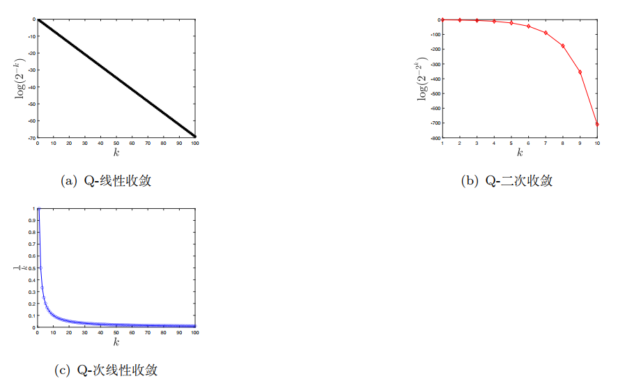

# Main Takeaway

最优化问题概括

<!--more-->

# 优化问题引言

- 最优化问题一般形式
  $$
  \min \quad f(x),\\
  s.t. \quad x\in \mathcal{X} \\ 
  
  \mathcal{X} = \{x \in \mathbb{R}^n \mid c_i(x) \leq 0, \quad i = 1, 2, \cdots, m, \\ \quad c_i(x) = 0, \quad i = m+1, m+2, \cdots, m+l\}.
  $$
  
- 一般来说，最优化算法研究可以分为：

  1. 构造最优化模型
  2. 确定最优化问题的类型和设计算法
  3. 实现算法或调用优化算法软件包进行求解

- 最优化类型与应用背景

  最优化问题的具体形式非常丰富，我们可以按照目标函数、约束函数以及解的性质将其分类

  按照目标函数和约束函数的形式来分：

  - 当目标函数和约束函数均为线性函数时，问题称为线性规划
  - 当目标函数和约束函数均为非线性函数时，问题称为非线性规划
  - 如果目标函数是二次函数而约束函数是线性函数则称为二次规划
  - 包含非光滑函数的问题称为非光滑优化；
  - 不能直接求导数的问题称为无导数优化；
  - 变量只能取整数的问题称为整数规划；
  - 在线性约束下极小化关于半正定矩阵的线性函数的问题称为半定规划，其广义形式为锥规划

  按照最优解的性质来分：

  - 最优解只有少量非零元素的问题称为稀疏优化；

  - 最优解是低秩矩阵的问题称为低秩矩阵优化

    此外还有几何优化、二次锥规划、张量优化、鲁棒优化、全局优化、组合优化、网络规划、随机优化、动态规划、带微分方程约束优化、微分流形约束优化、分布式优化等

## 最优控制核心脉络

- 目标：在动态系统约束下，寻找最优控制策略$u^*(t)$，使性能指标$J$极小化
- 核心方法：
  - 变分法
  - 极小值原理PMP
  - 动态规划DP
- 瓶颈：“维数灾” （Curse of Dimensionality）——高维状态空间下价值函数计算爆炸

## 优化问题分类

然后我们来看看每个不同的分类：

- 连续和离散优化问题：连续优化问题是指决策变量所在的可行集合是连续的/离散就是决策变量只能在离散集合上取值（例如整数集合）

  - 连续最优问题我们可以从一个点处目标和约束函数的取值来估计该点可行邻域内的取值情况，然后通过其领域取值信息拉判断是否最优
  - 离散则不具备这个性质常常更难求，实际中的离散优化问题往往可以转化为一系列连续优化问题来进行求解

- 无约束和约束优化问题

  很多约束问题常通过转化为一些列无约束问题来求解的（如拉格朗日函数法，罚函数法）

- 随机和确定性优化问题

  随机优化问题是指目标或者约束函数中涉及随机变量而带有不确定性的问题，在实际问题中，我们往往只能知道这些参数的某些估计——各种学习

- 线性和非线性规划问题

  求解线性规划问题最流行的两类方法依然是单纯形法和内点法

- 凸和非凸优化问题

  凸优化问题的任何局部最优解都是全局最优解，其相应的算法设计以及理论分析相对非凸优化问题简单很多

  在实际问题的建模中，我们经常更倾向于得到一个凸优化模型．另外，判断一个问题是否是凸问题也很重要．比如，给定一个非凸优化问题，一种方法是将其转化为一系列凸优化子问题来求解．此时需要清楚原非凸问题中的哪个或哪些函数导致了非凸性，之后考虑的是如何用凸优化模型来逼近原问题

- 全局和局部最优解

  

  

## 优化算法

在给定优化问题之后，我们要考虑如何求解

- 显式解：用代数表达式给出最优解

- 迭代算法：没法得到显式解

  在迭代算法中我们需要设计一个迭代序列来逼近解，那么需要考虑两个准则：

  1. 收敛准则
     $$
     \frac{f(x^k) - f^*}{\max\{|f^*|, 1\}} \leq \varepsilon_1, \quad \|\nabla f(x^k)\| \leq \varepsilon_2,
     $$

     其中 $\varepsilon_1, \varepsilon_2$ 为给定的很小的正数，$\|\cdot\|$ 表示某种范数（这里可以简单理解为 $l_2$ 范数：$\|x\|_2 = \left(\sum_{i=1}^n x_i^2\right)^{1/2}$）），$f^*$ 为函数 $f$ 的最小值（假设已知或者以某种方式估计得到）以及 $\nabla f(x^k)$ 表示函数 $f$ 在点 $x$ 处的梯度（光滑函数在局部最优点处梯度为零向量，第五章中会给出更多介绍）。对于约束优化问题，还需要考虑约束违反度。具体地，要求最后得到的点满足

     $$
     c_i(x^k) \leq \varepsilon_3, \quad i = 1, 2, \cdots, m,
     $$

     $$
     |c_i(x^k)| \leq \varepsilon_4, \quad i = m+1, m+2, \cdots, m+l.
     $$

  2. 停机准则（避免无用开销）
     $$
     \frac{\|x^{k+1} - x^k\|}{\max\{\|x^k\|, 1\}} \leq \varepsilon_5, \quad \frac{|f(x^{k+1}) - f(x^k)|}{\max\{|f(x^k)|, 1\}} \leq \varepsilon_6,
     $$
     这里的各个$\epsilon$一般互不相等，上面的准则分别表示相邻迭代点和其对应目标函数值的相对误差很小

在设计优化算法时，我们有一些基本的准则或技巧．对于复杂的优化问题，基本的想法是将其转化为一系列简单的优化问题（其最优解容易计算或者有显式表达式）来逐步求解。**常用的技巧**有：

1. 泰勒（Taylor）展开。对于一个非线性的目标或者约束函数，我们通过其泰勒展开式将其在当前点处进行一阶或者二次函数逼近，从而得到一个简化的问题。因为该简化问题只在小邻域内逼近原始问题，所以我们需要根据迭代点的更新来重新构造相应的简化问题。

2. 对偶。每个优化问题都有对应的对偶问题。特别是凸的情形，当原始问题比较难解的时候，其对偶问题可能很容易求解。通过求解对偶问题或者同时求解原始问题和对偶问题，我们可以简化原始问题的求解，从而设计更有效的算法。

3. 拆分。对于一个复杂的优化问题，我们可以将变量进行拆分，比如 $\min_x h(x) + r(x)$，可以拆分成
   $$
   \min_x h(x) + r(x), \quad \text{s.t.} \quad x = y.
   $$
   通过引入更多的变量，我们可以得到每个变量的简单问题（较易求解或者解有显式表达式），从而通过交替求解等方式来得到原问题的解。

4. 块坐标下降。对于一个 $n$ 维空间（$n$ 很大）的优化问题，我们可以通过逐步求解分量的方式将其转化为多个低维空间中的优化问题。比如，对于 $n=100$，我们可以先固定第 $2$—$100$ 个分量，求解 $x_1$；接着固定下标为 $1,3$—$100$ 的分量来求解 $x_2$；依次类推。

对于同一个优化问题，其求解算法可以有很多．在设计和比较不同的算法时，另一个重要的指标是算法的**渐进收敛速度**，常用Q-收敛速度和R-收敛速度。以下是 **Q-收敛速度** 

设 $\{x^k\}$ 为算法产生的迭代点列且收敛于 $x^*$，若对充分大的 $k$ 有

$$
\frac{\|x^{k+1} - x^*\|}{\|x^k - x^*\|} \leq a, \quad a \in (0, 1),
$$

则称算法（点列）是 **Q-线性收敛** 的；若满足

$$
\lim_{k \to \infty} \frac{\|x^{k+1} - x^*\|}{\|x^k - x^*\|} = 0,
$$

称算法（点列）是 **Q-超线性收敛** 的；若满足

$$
\lim_{k \to \infty} \frac{\|x^{k+1} - x^*\|}{\|x^k - x^*\|} = 1,
$$

称算法（点列）是 **Q-次线性收敛** 的。若对充分大的 $k$ 满足

$$
\frac{\|x^{k+1} - x^*\|}{\|x^k - x^*\|} \leq a, \quad a > 0,
$$

则称算法（点列）是 **Q-二次收敛** 的。类似地，也可定义更一般的 **Q-r 次收敛**（$r > 1$）。

# References

- 《最优化：建模、算法与理论》——刘浩洋、户将、李勇锋、文再文编著  