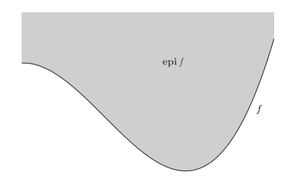

# Main Takeaway

最优化问题概括

<!--more-->

# 优化问题引言

- 最优化问题一般形式
  $$
  \min \quad f(x),\\
  s.t. \quad x\in \mathcal{X} \\ 
  
  \mathcal{X} = \{x \in \mathbb{R}^n \mid c_i(x) \leq 0, \quad i = 1, 2, \cdots, m, \\ \quad c_i(x) = 0, \quad i = m+1, m+2, \cdots, m+l\}.
  $$
  
- 一般来说，最优化算法研究可以分为：

  1. 构造最优化模型
  2. 确定最优化问题的类型和设计算法
  3. 实现算法或调用优化算法软件包进行求解

- 最优化类型与应用背景

  最优化问题的具体形式非常丰富，我们可以按照目标函数、约束函数以及解的性质将其分类

  按照目标函数和约束函数的形式来分：

  - 当目标函数和约束函数均为线性函数时，问题称为线性规划
  - 当目标函数和约束函数均为非线性函数时，问题称为非线性规划
  - 如果目标函数是二次函数而约束函数是线性函数则称为二次规划
  - 包含非光滑函数的问题称为非光滑优化；
  - 不能直接求导数的问题称为无导数优化；
  - 变量只能取整数的问题称为整数规划；
  - 在线性约束下极小化关于半正定矩阵的线性函数的问题称为半定规划，其广义形式为锥规划

  按照最优解的性质来分：

  - 最优解只有少量非零元素的问题称为稀疏优化；

  - 最优解是低秩矩阵的问题称为低秩矩阵优化

    此外还有几何优化、二次锥规划、张量优化、鲁棒优化、全局优化、组合优化、网络规划、随机优化、动态规划、带微分方程约束优化、微分流形约束优化、分布式优化等

## 优化问题分类

然后我们来看看每个不同的分类：

- 连续和离散优化问题：连续优化问题是指决策变量所在的可行集合是连续的/离散就是决策变量只能在离散集合上取值（例如整数集合）

  - 连续最优问题我们可以从一个点处目标和约束函数的取值来估计该点可行邻域内的取值情况，然后通过其领域取值信息拉判断是否最优
  - 离散则不具备这个性质常常更难求，实际中的离散优化问题往往可以转化为一系列连续优化问题来进行求解

- 无约束和约束优化问题

  很多约束问题常通过转化为一些列无约束问题来求解的（如拉格朗日函数法，罚函数法）

- 随机和确定性优化问题

  随机优化问题是指目标或者约束函数中涉及随机变量而带有不确定性的问题，在实际问题中，我们往往只能知道这些参数的某些估计——各种学习

- 线性和非线性规划问题

  求解线性规划问题最流行的两类方法依然是单纯形法和内点法

- 凸和非凸优化问题

  凸优化问题的任何局部最优解都是全局最优解，其相应的算法设计以及理论分析相对非凸优化问题简单很多

  在实际问题的建模中，我们经常更倾向于得到一个凸优化模型．另外，判断一个问题是否是凸问题也很重要．比如，给定一个非凸优化问题，一种方法是将其转化为一系列凸优化子问题来求解．此时需要清楚原非凸问题中的哪个或哪些函数导致了非凸性，之后考虑的是如何用凸优化模型来逼近原问题

- 全局和局部最优解

  

  

## 优化算法

在给定优化问题之后，我们要考虑如何求解

- 显式解：用代数表达式给出最优解

- 迭代算法：没法得到显式解

  在迭代算法中我们需要设计一个迭代序列来逼近解，那么需要考虑两个准则：

  1. 收敛准则
     $$
     \frac{f(x^k) - f^*}{\max\{|f^*|, 1\}} \leq \varepsilon_1, \quad \|\nabla f(x^k)\| \leq \varepsilon_2,
     $$

     其中 $\varepsilon_1, \varepsilon_2$ 为给定的很小的正数，$\|\cdot\|$ 表示某种范数（这里可以简单理解为 $l_2$ 范数：$\|x\|_2 = \left(\sum_{i=1}^n x_i^2\right)^{1/2}$）），$f^*$ 为函数 $f$ 的最小值（假设已知或者以某种方式估计得到）以及 $\nabla f(x^k)$ 表示函数 $f$ 在点 $x$ 处的梯度（光滑函数在局部最优点处梯度为零向量，第五章中会给出更多介绍）。对于约束优化问题，还需要考虑约束违反度。具体地，要求最后得到的点满足

     $$
     c_i(x^k) \leq \varepsilon_3, \quad i = 1, 2, \cdots, m,
     $$

     $$
     |c_i(x^k)| \leq \varepsilon_4, \quad i = m+1, m+2, \cdots, m+l.
     $$

  2. 停机准则（避免无用开销）
     $$
     \frac{\|x^{k+1} - x^k\|}{\max\{\|x^k\|, 1\}} \leq \varepsilon_5, \quad \frac{|f(x^{k+1}) - f(x^k)|}{\max\{|f(x^k)|, 1\}} \leq \varepsilon_6,
     $$
     这里的各个$\epsilon$一般互不相等，上面的准则分别表示相邻迭代点和其对应目标函数值的相对误差很小

在设计优化算法时，我们有一些基本的准则或技巧．对于复杂的优化问题，基本的想法是将其转化为一系列简单的优化问题（其最优解容易计算或者有显式表达式）来逐步求解。**常用的技巧**有：

1. 泰勒（Taylor）展开。对于一个非线性的目标或者约束函数，我们通过其泰勒展开式将其在当前点处进行一阶或者二次函数逼近，从而得到一个简化的问题。因为该简化问题只在小邻域内逼近原始问题，所以我们需要根据迭代点的更新来重新构造相应的简化问题。

2. 对偶。每个优化问题都有对应的对偶问题。特别是凸的情形，当原始问题比较难解的时候，其对偶问题可能很容易求解。通过求解对偶问题或者同时求解原始问题和对偶问题，我们可以简化原始问题的求解，从而设计更有效的算法。

3. 拆分。对于一个复杂的优化问题，我们可以将变量进行拆分，比如 $\min_x h(x) + r(x)$，可以拆分成
   $$
   \min_x h(x) + r(x), \quad \text{s.t.} \quad x = y.
   $$
   通过引入更多的变量，我们可以得到每个变量的简单问题（较易求解或者解有显式表达式），从而通过交替求解等方式来得到原问题的解。

4. 块坐标下降。对于一个 $n$ 维空间（$n$ 很大）的优化问题，我们可以通过逐步求解分量的方式将其转化为多个低维空间中的优化问题。比如，对于 $n=100$，我们可以先固定第 $2$—$100$ 个分量，求解 $x_1$；接着固定下标为 $1,3$—$100$ 的分量来求解 $x_2$；依次类推。

对于同一个优化问题，其求解算法可以有很多．在设计和比较不同的算法时，另一个重要的指标是算法的**渐进收敛速度**，常用Q-收敛速度和R-收敛速度。以下是 **Q-收敛速度** 

设 $\{x^k\}$ 为算法产生的迭代点列且收敛于 $x^*$，若对充分大的 $k$ 有

$$
\frac{\|x^{k+1} - x^*\|}{\|x^k - x^*\|} \leq a, \quad a \in (0, 1),
$$

则称算法（点列）是 **Q-线性收敛** 的；若满足

$$
\lim_{k \to \infty} \frac{\|x^{k+1} - x^*\|}{\|x^k - x^*\|} = 0,
$$

称算法（点列）是 **Q-超线性收敛** 的；若满足

$$
\lim_{k \to \infty} \frac{\|x^{k+1} - x^*\|}{\|x^k - x^*\|} = 1,
$$

称算法（点列）是 **Q-次线性收敛** 的。若对充分大的 $k$ 满足

$$
\frac{\|x^{k+1} - x^*\|}{\|x^k - x^*\|} \leq a, \quad a > 0,
$$

则称算法（点列）是 **Q-二次收敛** 的。类似地，也可定义更一般的 **Q-r 次收敛**（$r > 1$）。

# Mathematical Fundamentals

在介绍具体的最优化模型、理论和算法之前，我们先介绍一些必备的基
础知识

## 范数

### 向量范数

和标量不同，我们不能简单地按照元素大小来比较不同的向量和矩阵，向量范数和矩阵范数给出了一种长度计量方式．我们首先介绍向量范数：

 (范数) 称一个从向量空间 $\mathbb{R}^n$ 到实数域 $\mathbb{R}$ 的非负函数 $\|\cdot\|$ 为范数，如果它满足：

1. 正定性：对于所有的 $v \in \mathbb{R}^n$，有 $\|v\| \geq 0$，且 $\|v\| = 0$ 当且仅当 $v = 0$；

2. 齐次性：对于所有的 $v \in \mathbb{R}^n$ 和 $\alpha \in \mathbb{R}$，有 $\|\alpha v\| = |\alpha| \|v\|$；

3. 三角不等式：对于所有的 $v, w \in \mathbb{R}^n$，有 $\|v + w\| \leq \|v\| + \|w\|$.

最常用的向量范数为 $\ell_p$ 范数 ($p \geq 1$)：

$$
\|v\|_p = \left( |v_1|^p + |v_2|^p + \cdots + |v_n|^p \right)^{\frac{1}{p}};
$$

当 $p = \infty$ 时，$\ell_\infty$ 范数定义为

$$
\|v\|_\infty = \max_i \{ |v_i| \}.
$$
其中 $p = 1, 2, \infty$ 的情形最重要，分别记为 $\|\cdot\|_1$，$\|\cdot\|_2$ 和 $\|\cdot\|_\infty$。

> 在不引起歧义的情况下，我们有时省略 $\ell_2$ 范数的角标，记为 $\|\cdot\|$。在最优化问题算法构造和分析中，也常常遇到由正定矩阵 $A$ 诱导的范数，即 $\|x\|_A \stackrel{\text{def}}{=} \sqrt{x^T A x}$。根据正定矩阵的定义，很容易验证 $\|\cdot\|_A$ 定义了一个范数。

对向量的 $\ell_2$ 范数，我们有常用的柯西（Cauchy）不等式：

命题（柯西不等式） 设 $a, b \in \mathbb{R}^n$，则

$$
|a^T b| \leq \|a\|_2 \|b\|_2,
$$

等号成立当且仅当 $a$ 与 $b$ 线性相关。

### 矩阵范数

和向量范数类似，矩阵范数是定义在矩阵空间上的非负函数，并且满足正定性、齐次性和三角不等式。向量的 $\ell_p$ 范数可以比较容易地推广到矩阵的 $\ell_p$ 范数，常用 $p = 1, 2$ 的情形。

- 当 $p = 1$ 时，矩阵 $A \in \mathbb{R}^{m \times n}$ 的 $\ell_1$ 范数定义为
  $$
  \|A\|_1 = \sum_{i=1}^m \sum_{j=1}^n |a_{ij}|,
  $$
  即 $\|A\|_1$ 为 $A$ 中所有元素绝对值的和。

- 当 $p = 2$ 时，此时得到的是矩阵的 Frobenius 范数（下称 $F$ 范数），记为 $\|A\|_F$。它可以看成是向量的 $\ell_2$ 范数的推广，即所有元素平方和开根号：
  $$
  \|A\|_F = \sqrt{\text{tr}(A^T A)} = \sqrt{\sum_{i,j} a_{ij}^2}.
  $$
  这种范数表示方阵 $A$ 的迹。

矩阵范数具有正交不变性，即对于任意的正交矩阵 $U \in \mathbb{R}^{m \times m}, V \in \mathbb{R}^{n \times n}$，我们有
$$
\|UAV\|_F^2 = \text{Tr}(UAVV^T A^T U^T) = \text{Tr}(UAA^T U^T) \\
= \text{Tr}(AA^T U^T U) = \text{Tr}(AA^T) = \|A\|_F^2,
$$

其中第三个等号成立是因为 $\text{Tr}(AB) = \text{Tr}(BA)$

除了从向量范数直接推广以外，矩阵范数还可以由向量范数**诱导出来**，一般称这种范数为**算子范数**。给定矩阵 $A \in \mathbb{R}^{m \times n}$ 以及 $m$ 维和 $n$ 维空间的向量范数 $\|\cdot\|_{(m)}$ 和 $\|\cdot\|_{(n)}$，其诱导的矩阵范数定义如下：

$$
\|A\|_{(m,n)} = \max_{x \in \mathbb{R}^n, \|x\|_{n} = 1} \|Ax\|_{(m)}
$$
容易验证 $\|\cdot\|_{(m,n)}$ 满足范数的定义。

- 如果将 $\|\cdot\|_m$ 和 $\|\cdot\|_n$ 都取为相应向量空间的 $\ell_p$ 范数，我们可以得到矩阵的 $p$ 范数。经常用到的是矩阵的 2 范数，即
  $$
  \|A\|_2 = \max_{x \in \mathbb{R}^n, \|x\|_2 = 1} \|Ax\|_2,
  $$

  > $\|A\|_2$ 范数是该矩阵的最大奇异值

下面介绍一下算子范数的性质：
$$
\|Ax\|_{(m)} \leq \|A\|_{(m,n)} \|x\|_n.
$$
又被称为矩阵范数的相容性

另一个常用的矩阵范数为**核范数**。给定矩阵 $A \in \mathbb{R}^{m \times n}$，其核范数定义为

$$
\|A\|_* = \sum_{i=1}^r \sigma_i
$$

其中 $\sigma_i, i = 1, 2, \cdots, r$ 为 $A$ 所有非零奇异值，$r = \text{rank}(A)$。类似于向量的 $\ell_1$ 范数的保稀疏性，我们也经常通过限制矩阵的核范数来保证矩阵的低秩性。根据核范数的三角不等式（下文中的凸性），相应的优化问题可以有效率求解。

### 矩阵内积

- 范数一般用来衡量矩阵的模的大小
- 内积一般用来表征两个矩阵（或其张成的空间）之间的夹角。

这里，我们介绍一种常用的内积——Frobenius 内积。$m \times n$ 矩阵 $A$ 和 $B$ 的 Frobenius 内积定义为
$$
\langle A, B \rangle \stackrel{\text{def}}{=} \text{Tr}(AB^T) = \sum_{i=1}^m \sum_{j=1}^n a_{ij} b_{ij}.
$$

易知其为两个矩阵逐分量相乘的和，因而满足内积的定义。当 $A = B$ 时，$\langle A, B \rangle$ 等于矩阵 $A$ 的 $F$ 范数的平方。

和向量范数相似，我们也有矩阵范数对应的柯西不等式：

命题（矩阵范数的柯西不等式） 设 $A, B \in \mathbb{R}^{m \times n}$，则

$$
|\langle A, B \rangle| \leq \|A\|_F \|B\|_F,
$$

等号成立当且仅当 $A$ 和 $B$ 线性相关。

## 导数

为了分析可微最优化问题的性质，我们需要知道目标函数和约束函数的导数信息

在算法设计中，当优化问题没有显式解时，我们也往往通过函数值和导数信息来构造容易求解的子问题

### 梯度和海瑟矩阵

Gradient, Hessian, Jacobi

- 梯度Gradient

  The gradient of a scalar function $f : \mathbb{R}^n \rightarrow \mathbb{R}$ is defined by
  $$
  \nabla f(\mathbf{x}) = 
  \begin{bmatrix}
  \frac{\partial f(\mathbf{x})}{\partial x_1} \\
  \frac{\partial f(\mathbf{x})}{\partial x_2} \\
  \vdots \\
  \frac{\partial f(\mathbf{x})}{\partial x_n}
  \end{bmatrix}
  = 
  \left[ \frac{\partial f(\mathbf{x})}{\partial x_1}, \ldots, \frac{\partial f(\mathbf{x})}{\partial x_n} \right]^\top
  = \left[ \frac{\partial f(\mathbf{x})}{\partial \mathbf{x}} \right]^\top
  $$

- 海瑟矩阵Hessian

  The Hessian of a scalar function $f : \mathbb{R}^n \rightarrow \mathbb{R}$ is defined by
  $$
  \nabla^2 f(\mathbf{x}) = 
  \begin{bmatrix}
  \frac{\partial^2 f(\mathbf{x})}{\partial x_1^2} & \frac{\partial^2 f(\mathbf{x})}{\partial x_1 \partial x_2} & \cdots & \frac{\partial^2 f(\mathbf{x})}{\partial x_1 \partial x_n} \\
  \frac{\partial^2 f(\mathbf{x})}{\partial x_2 \partial x_1} & \frac{\partial^2 f(\mathbf{x})}{\partial x_2^2} & \cdots & \frac{\partial^2 f(\mathbf{x})}{\partial x_2 \partial x_n} \\
  \vdots & \vdots & \ddots & \vdots \\
  \frac{\partial^2 f(\mathbf{x})}{\partial x_n \partial x_1} & \frac{\partial^2 f(\mathbf{x})}{\partial x_n \partial x_2} & \cdots & \frac{\partial^2 f(\mathbf{x})}{\partial x_n^2}
  \end{bmatrix}
  = \frac{\partial}{\partial \mathbf{x}} [\nabla f(\mathbf{x})]
  $$
  若函数 $f(\mathbf{x})$ 对其所有变量的二阶偏导数连续，则有：
  $$
  \frac{\partial^2 f(\mathbf{x})}{\partial x_i \partial x_j} = \frac{\partial^2 f(\mathbf{x})}{\partial x_j \partial x_i}
  $$
  此时函数的Hessian矩阵为对称矩阵，矩阵满足 $\nabla^2 f = (\nabla^2 f)^\top$。

  - 优化理论：Hessian矩阵的对称性是判断极值点（凸性/凹性）的基础。
  - 泰勒展开：二阶泰勒展开式 $f(\mathbf{x}+\mathbf{h}) \approx f(\mathbf{x}) + \nabla f \cdot \mathbf{h} + \frac{1}{2} \mathbf{h}^\top \nabla^2 f \mathbf{h}$ 依赖此对称性。

- 雅可比Jacobi

  The Jacobian of a vector-valued function $f : \mathbb{R}^n \rightarrow \mathbb{R}^m$ is defined by
  $$
  \frac{\partial \mathbf{f}(\mathbf{x})}{\partial \mathbf{x}} = 
  \begin{bmatrix}
  \frac{\partial f_1(\mathbf{x})}{\partial x_1} & \frac{\partial f_1(\mathbf{x})}{\partial x_2} & \cdots & \frac{\partial f_1(\mathbf{x})}{\partial x_n} \\
  \frac{\partial f_2(\mathbf{x})}{\partial x_1} & \frac{\partial f_2(\mathbf{x})}{\partial x_2} & \cdots & \frac{\partial f_2(\mathbf{x})}{\partial x_n} \\
  \vdots & \vdots & \ddots & \vdots \\
  \frac{\partial f_m(\mathbf{x})}{\partial x_1} & \frac{\partial f_m(\mathbf{x})}{\partial x_2} & \cdots & \frac{\partial f_m(\mathbf{x})}{\partial x_n}
  \end{bmatrix}
  $$
  容易发现梯度$\nabla f(x)$的雅可比矩阵就是$f(x)$的海瑟矩阵

下面介绍一些常用的方法：

- 泰勒展开

  设 $f : \mathbb{R}^n \rightarrow \mathbb{R}$ 是连续可微的，$p \in \mathbb{R}^n$ 为向量，那么

  $$
  f(x + p) = f(x) + \nabla f(x + tp)^T p,
  $$

  其中 $0 < t < 1$。进一步地，如果 $f$ 是二阶连续可微的，则

  $$
  \nabla f(x + p) = \nabla f(x) + \int_0^1 \nabla^2 f(x + tp) p \, \mathrm{d}t, \quad \text{mean value Theorem}
  $$

  $$
  f(x + p) = f(x) + \nabla f(x)^T p + \frac{1}{2} p^T \nabla^2 f(x + tp) p,
  $$

  其中 $0 < t < 1$。

- 条件数

  矩阵条件数的看法：[矩阵的条件数](https://zhuanlan.zhihu.com/p/91393594)

  条件数同时描述了矩阵 A 对向量的拉伸能力和压缩能力，换句话说，令向量发生形变的能力。条件数越大，向量在变换后越可能变化得越多。

  减小病态矩阵的影响——加正则项

- 下面我们介绍一下梯度利普希茨连续的函数，在后面很多优化算法收敛性证明中起着关键作用

  定义（梯度利普希茨连续） 给定可微函数 $f$，若存在 $L > 0$，对任意的 $x, y \in \text{dom} f$ 有
  $$
  \|\nabla f(x) - \nabla f(y)\| \leq L \|x - y\|,
  $$

  则称 $f$ 是梯度利普希茨连续的，相应利普希茨常数为 $L$。有时也简记为梯度 $L$-利普希茨连续或 $L$-光滑。

  梯度利普希茨连续表明 $\nabla f(x)$ 的变化可以被自变量 $x$ 的变化所控制，满足该性质的函数具有很多好的性质，一个重要的性质是其具有**二次上界**：

  实际上指的是 $f(x)$ 可被一个二次函数上界所控制，即要求 $f(x)$ 的增长速度不超过二次。实际上，该引理对 $f(x)$ 定义域的要求可减弱为 $\text{dom} f$ 是凸集，此条件的作用是保证证明中的 $g(t)$ 当 $t \in [0, 1]$ 时是有定义的。

  若 $f$ 是梯度利普希茨连续的，且有一个全局极小点 $x^*$，一个重要的推论就是我们能够利用二次上界 (2.2.3) 来估计 $f(x) - f(x^*)$ 的大小，其中 $x$ 可以是定义域中的任意一点。

  **推论 2.1** 设可微函数 $f(x)$ 的定义域为 $\mathbb{R}^n$ 且存在一个全局极小点 $x^*$，若 $f(x)$ 为梯度 $L$-利普希茨连续的，则对任意的 $x$ 有
  $$
  \frac{1}{2L} \|\nabla f(x)\|^2 \leq f(x) - f(x^*).
  $$

### 矩阵变量函数的导数

- Fr\'echet 可微

  多元函数梯度的定义可以推广到变量是矩阵的情形。对于以 $m \times n$ 矩阵 $X$ 为自变量的函数 $f(X)$，若存在矩阵 $G \in \mathbb{R}^{m \times n}$ 满足

  $$
  \lim_{V \rightarrow 0} \frac{f(X + V) - f(X) - \langle G, V \rangle}{\|V\|} = 0,
  $$

  其中 $\|\cdot\|$ 是任意矩阵范数，就称矩阵变量函数 $f$ 在 $X$ 处 Fr\'echet 可微，称 $G$ 为 $f$ 在 Fr\'echet 可微意义下的梯度。类似于向量情形，矩阵变量函数 $f(X)$ 的梯度可以用其偏导数表示为

  $$
  \nabla f(x) = \begin{bmatrix}
  \frac{\partial f}{\partial x_{11}} & \frac{\partial f}{\partial x_{12}} & \cdots & \frac{\partial f}{\partial x_{1n}} \\
  \frac{\partial f}{\partial x_{21}} & \frac{\partial f}{\partial x_{22}} & \cdots & \frac{\partial f}{\partial x_{2n}} \\
  \vdots & \vdots & \ddots & \vdots \\
  \frac{\partial f}{\partial x_{m1}} & \frac{\partial f}{\partial x_{m2}} & \cdots & \frac{\partial f}{\partial x_{mn}}
  \end{bmatrix}.
  $$

  其中 $\frac{\partial f}{\partial x_{ij}}$ 表示 $f$ 关于 $x_{ij}$ 的偏导数。

  在实际应用中，判断 Fr\'echet 可微的定义和使用往往比较繁琐，为此我们需要介绍另一种定义——G\^ateaux 可微。

- G\^ateaux 可微

  定义 2.5（G\^ateaux 可微） 设 $f(X)$ 为矩阵变量函数，如果存在矩阵 $G \in \mathbb{R}^{m \times n}$，对任意方向 $V \in \mathbb{R}^{m \times n}$ 满足

  $$
  \lim_{t \rightarrow 0} \frac{f(X + tV) - f(X) - t \langle G, V \rangle}{t} = 0,
  $$

  则称 $f$ 关于 $X$ 是 G\^ateaux 可微的，满足 (2.2.6) 式的 $G$ 称为 $f$ 在 $X$ 处 G\^ateaux 可微意义下的梯度。

Gâteaux 可微实际上是方向导数的某种推广，它针对一元函数考虑极限，因此利用 Gâteaux 可微计算梯度是更容易实现的

### 自动微分

神经网络的反向传播，根据复合函数的链式法则，可以通过每个简单函数的导数的乘积来计算对于各层变量的导数

## 广义实值函数

在数学分析课程中我们学习了函数的基本概念：函数是从向量空间R" 到实数域R的映射．而在最优化领域，经常涉及对某个函数其中的一个变量取inf（sup）操作，这导致函数的取值可能为无穷．为了能够更方便地描述优化问题，我们需要对函数的定义进行某种扩展

下面介绍一下广义实值函数：

定义（广义实值函数） 令 $\mathbb{R} \stackrel{\text{def}}{=} \mathbb{R} \cup \{ \pm \infty \}$ 为广义实数空间，则映射 $f : \mathbb{R}^n \rightarrow \mathbb{R}$ 称为广义实值函数。

从广义实值函数的定义可以看出，其值域多了两个特殊的值 $\pm \infty$。和数学分析一样，我们规定

$$
-\infty < a < +\infty, \quad \forall a \in \mathbb{R}
$$

以及

$$
(+\infty) + (+\infty) = +\infty, \quad +\infty + a = +\infty, \quad \forall a \in \mathbb{R}.
$$

- 适当函数

  适当函数是一类很重要的广义实值函数，很多最优化理论都是建立在适当函数之上的。

  定义 2.7（适当函数） 给定广义实值函数 $f$ 和非空集合 $\mathcal{X}$。如果存在 $x \in \mathcal{X}$ 使得 $f(x) < +\infty$，并且对任意的 $x \in \mathcal{X}$，都有 $f(x) > -\infty$，那么称函数 $f$ 关于集合 $\mathcal{X}$ 是适当的。

  概括来说，适当函数 $f$ 的特点是“至少有一处取值不为正无穷”，以及“处处取值不为负无穷”。对最优化问题 $\min_x f(x)$，适当函数可以帮助去掉一些我们不感兴趣的函数。在本书比较合理的函数类中考虑最优化问题。在笔记中若无特殊说明，定理中所讨论的函数均为适当函数。

  对于适当函数 $f$，规定其定义域

  $$
  \text{dom} f = \{ x \mid f(x) < +\infty \}.
  $$

  正是因为适当函数的最小值不可能在函数值为无穷处取到，因此 $\text{dom} f$ 的定义方式是自然的。

- 闭函数

  闭函数可以看成是连续函数的一种推广，先来引入一些概念

  - 下水平集

    下水平集是描述实值函数取值情况的一个重要概念。为此有如下定义：

    定义 2.8（$\alpha$-下水平集） 对于广义实值函数 $f : \mathbb{R}^n \rightarrow \mathbb{R}$，

    $$
    C_\alpha = \{ x \mid f(x) \leq \alpha \}
    $$

    称为 $f$ 的 $\alpha$-下水平集。

    > 在最优化问题中，多数情况都要对函数 $f(x)$ 求极小值，通过研究 $\alpha$-下水平集可以知道具体在哪些点处 $f(x)$ 的值不超过 $\alpha$。若 $C_\alpha$ 非空，我们知道 $f(x)$ 的全局极小点（若存在）一定落在 $C_\alpha$ 中，因此也就无需考虑 $C_\alpha$ 之外的点。

  - 上方图

    上方图是从集合的角度来描述一个函数的具体性质。我们有如下定义：

    定义（上方图） 对于广义实值函数 $f : \mathbb{R}^n \rightarrow \mathbb{R}$，

    $$
    \text{epi} f = \{ (x, t) \in \mathbb{R}^{n+1} \mid f(x) \leq t \}
    $$

    称为 $f$ 的上方图。

    

  - 闭函数

    定义（闭函数） 设 $f : \mathbb{R}^n \rightarrow \mathbb{R}$ 为广义实值函数，若 $\text{epi} f$ 为闭集，则称 $f$ 为闭函数。

  - 下半连续函数

    定义（下半连续函数） 设广义实值函数 $f : \mathbb{R}^n \rightarrow \mathbb{R}$，若对任意的 $x \in \mathbb{R}^n$，有

    $$
    \liminf_{y \rightarrow x} f(y) \geq f(x),
    $$

    则 $f(x)$ 为下半连续函数。

    且闭函数和下半连续函数等价

## 凸集

对于 $\mathbb{R}^n$ 中的两个点 $x_1 \neq x_2$，形如

$$
y = \theta x_1 + (1 - \theta) x_2
$$

的点形成了过点 $x_1$ 和 $x_2$ 的直线。当 $0 \leq \theta \leq 1$ 时，这样的点形成了连接点 $x_1$ 与 $x_2$ 的线段。

- 仿射集：如果过集合 $C$ 中任意两点的直线都在 $C$ 内，则称 $C$ 为仿射集，即
  $$
  x_1, x_2 \in C \implies \theta x_1 + (1 - \theta) x_2 \in C, \quad \forall \theta \in \mathbb{R}.
  $$
  线性方程组$Ax = b$的解集是仿射集。反之，任何仿射集都可以表示成一个线性方程组的解集

- 凸集：如果连接集合 $C$ 中任意两点的线段都在 $C$ 内，则称 $C$ 为凸集，即
  $$
  x_1, x_2 \in C \implies \theta x_1 + (1 - \theta) x_2 \in C, \quad \forall \theta \in [0, 1].
  $$
  从仿射集的定义容易看出仿射集都是凸集。

从凸集可以引出凸组合和凸包等概念。形如

$$
x = \theta_1 x_1 + \theta_2 x_2 + \cdots + \theta_k x_k,
\\ \theta_i \geq 0, i = 1, 2, \cdots, k \\
1 = \theta_1 + \theta_2 + \cdots + \theta_k,
$$
的点称为 $x_1, x_2, \cdots, x_k$ 的凸组合。集合 $S$ 中点所有可能的凸组合构成的集合称作 $S$ 的凸包，记作 $\text{conv } S$。实际上，$\text{conv } S$ 是包含 $S$ 的最小的凸集。

若在凸组合的定义中去掉 $\theta_i \geq 0$ 的限制，我们可以得到仿射包的概念。

定义（仿射包） 设 $S$ 为 $\mathbb{R}^n$ 的子集，称如下集合为 $S$ 的仿射包：
$$\{x \mid x = \theta_1 x_1 + \theta_2 x_2 + \cdots + \theta_k x_k, \quad x_1, x_2, \cdots, x_k \in S, \quad \theta_1 + \theta_2 + \cdots + \theta_k = 1\},$$
记为 $\text{affine } S$。

一般而言，一个集合的仿射包实际上是包含该集合的最小的仿射集  

下面介绍一些重要的凸集：

- 

## 凸函数

## 共轭函数

## 次梯度

## 3D旋转表示与SO(3)群

在机器人学、计算机视觉和控制理论中，3D旋转的表示和优化是一个核心问题。3D旋转构成特殊正交群SO(3)，这是一个3维的李群流形。

> 旋转表示详情见机器人学

### 理解罗德里格斯公式

- 旋转的指数坐标

  假设位置矢量 $  \mathbf{r}  $ 以角速度 $  \Omega  $ 绕 $  z  $ 轴旋转。如果 $  x(t), y(t), z(t)  $ 是 $  \mathbf{r}  $ 在时间 $  t  $ 的笛卡尔分量，那么有：

  $$
  \begin{pmatrix}x(t) \\y(t) \\z(t)\end{pmatrix}=\begin{pmatrix}\cos(\Omega t) & \sin(\Omega t) & 0 \\-\sin(\Omega t) & \cos(\Omega t) & 0 \\0 & 0 & 1\end{pmatrix}\begin{pmatrix}x(0) \\y(0) \\z(0)\end{pmatrix}
  $$
  因此，利用正弦和余弦函数的小角度近似，我们得到：

  $$
  \begin{pmatrix}x(\delta t) \\y(\delta t) \\z(\delta t)\end{pmatrix}-\begin{pmatrix}x(0) \\y(0) \\z(0)\end{pmatrix}\approx\begin{pmatrix}0 & \Omega \delta t & 0 \\-\Omega \delta t & 0 & 0 \\0 & 0 & 0\end{pmatrix}\begin{pmatrix}x(0) \\y(0) \\z(0)\end{pmatrix}
  $$
  这立即意味着

  $$
  \begin{pmatrix}\dot{x} \\\dot{y} \\\dot{z}\end{pmatrix}=\begin{pmatrix}0 & \Omega & 0 \\-\Omega & 0 & 0 \\0 & 0 & 0\end{pmatrix}\begin{pmatrix}x \\y \\z\end{pmatrix}
  $$
  或者

  $$
  \frac{d\mathbf{r}}{dt} = \mathbf{\Omega} \times \mathbf{r}
  $$

- 三维空间中的旋转运动

  更一般的情况，$  \mathbb{R}^{n \times n}  $ 空间中的旋转矩阵可定义为

  $$
  SO(n) = \{ \mathbf{R} \in \mathbb{R}^{n \times n} : \mathbf{R}\mathbf{R}^T = \mathbf{I}, \text{det}\mathbf{R} = +1 \}
  $$
  $  SO(3) \subset \mathbb{R}^{3 \times 3}  $ 是满足矩阵相乘运算的群（group）。对于元素可用算子◦构成二元运算的集合 $  G  $，如果满足下列条件，则称为群：

  1. 封闭性：若 $  g_1, g_2 \in \mathbb{R}^{3 \times 3}  $，则 $  g_1 \circ g_2 \in G  $。
  2. 单位性：对于任意的 $  g \in G  $，一定存在一个单位元素 $  e  $，使得 $  g \circ e = e \circ g = g  $。
  3. 可逆性：对于任意的 $  g \in G  $，一定存在唯一的逆元 $  g^{-1} \in G  $，使得 $  g \circ g^{-1} = g^{-1} \circ g = e  $。
  4. 结合性：若 $  g_1, g_2, g_3 \in G  $，则有 $  (g_1 \circ g_2) \circ g_3 = g_1 \circ (g_2 \circ g_3)  $。

  对于 $  SO(3)  $ 情况，有

  1. 如果 $  \mathbf{R}_1, \mathbf{R}_2 \in SO(3)  $，则 $  \mathbf{R}_1\mathbf{R}_2 \in SO(3)  $。这是因为
     $$
     \mathbf{R}_1\mathbf{R}_2(\mathbf{R}_1\mathbf{R}_2)^T = \mathbf{R}_1\mathbf{R}_2\mathbf{R}_2^T\mathbf{R}_1^T = \mathbf{R}_1\mathbf{I}\mathbf{R}_1^T = \mathbf{I}
     \\
     \text{det}(\mathbf{R}_1\mathbf{R}_2) = \text{det}(\mathbf{R}_1)\text{det}(\mathbf{R}_2) = +1
     $$

  2. 单位矩阵是单位元素。

  3. 由式（2.1）可知，$  \mathbf{R} \in SO(3)  $ 的逆是 $  \mathbf{R}^{-1} \in SO(3)  $。

  4. 由矩阵乘法结合律可得群的结合律，即 $  (\mathbf{R}_1\mathbf{R}_2)\mathbf{R}_3 = \mathbf{R}_1(\mathbf{R}_2\mathbf{R}_3)  $。

  因此，$  SO(3)  $ 是一个以单位矩阵 $  I  $ 作为单位元素、以矩阵乘法作为群运算的群。$  SO(3)  $ 称为三维旋转群（rotation group）。

  自由刚体相对于固定坐标系旋转后的位形可由唯一的 $  \mathbf{R} \in SO(3)  $ 表示。鉴于这一特性，旋转群 $  SO(3)  $ 又称为系统的位形空间（configuration space），系统的运动轨迹为曲线 $  \mathbf{R}(t) \in SO(3)  $，其中 $  t \in [0, T]  $。更为一般的情况是，对于集合 $  Q  $，如果其中每一个元素对应于系统的一个有效位形，则称 $  Q  $ 为位形空间，系统的每一个位形都对应于 $  Q  $ 中的唯一元素。

- 求解指数映射

  Rodrigues公式：
  $$
  \text{e}^{\hat{\omega}\theta} = \mathbf{I} + \hat{\omega} \sin\theta + \hat{\omega}^2 (1 - \cos\theta)
  $$
  $\text{e}^{\hat{\omega}\theta}$为一个旋转矩阵，即$R = \exp(\hat{\omega}\theta)$为满射变换

  因此有欧拉定理： 任意姿态 $  \mathbf{R} \in SO(3)  $ 等效于绕固定轴 $  \omega \in \mathbb{R}^3  $ 旋转角 $  \theta \in [0,2\pi) $

- 三维空间中的刚体运动

  $ (\mathbf{p}_{cb}, \mathbf{R}_{cb}) $ 确定，系统的位形空间为 $ \mathbb{R}^3 $ 与 $ SO(3) $ 的乘积空间，记为 $ SE(3) $：

  $$
  SE(3) = \{ (\mathbf{p}, \mathbf{R}) : \mathbf{p} \in \mathbb{R}^3, \mathbf{R} \in SO(3) \} = \mathbb{R}^3 \times SO(3)
  $$
  先证明刚体变换的集合是一个群：

  1. 如果 $  g_1, g_2 \in SE(3)  $，那么 $  g_1g_2 \in SE(3)  $。

  2. $  4 \times 4  $ 的单位矩阵 $  I  $ 属于 $  SE(3)  $。

  3. 如果 $  g \in SE(3)  $，那么 $  g  $ 的逆可由矩阵的逆规定为
     $$
     g^{-1} = \begin{bmatrix}\mathbf{R}^T & -\mathbf{R}^T\mathbf{p} \\0 & 1\end{bmatrix}
     $$
     所以$  g^{-1} = (-\mathbf{R}^T\mathbf{p}, \mathbf{R}^T) $

  4. 刚体变换的合成规则满足结合律。

     用齐次坐标来表示矢量 $  v = s - r  $，通过 $  v  $ 的齐次坐标与 $  g  $ 的齐次坐标相乘而得到 $  v  $ 的刚体变换

     $$
     g_*v = g(s) - g(r) = \begin{bmatrix}\mathbf{R} & \mathbf{p} \\0 & 1\end{bmatrix}\begin{bmatrix}v_1 \\v_2 \\v_3 \\1\end{bmatrix}
     $$

  定理 2.7 $  SE(3)  $ 中的元素表示刚体运动

  任一 $  g \in SE(3)  $ 是刚体变换的条件为

  1. $  g  $ 能保持两点之间的距离不变：即对于任意点 $  \mathbf{q}, \mathbf{p} \in \mathbb{R}^3  $，有
     $$
     \| g\mathbf{q} - g\mathbf{p} \| = \| \mathbf{q} - \mathbf{p} \|
     $$

  2. $  g  $ 能保持两矢量之间的夹角不变：即对于任意矢量 $  \mathbf{v}, \mathbf{w} \in \mathbb{R}^3  $，有
     $$
     g_*(\mathbf{v} \times \mathbf{w}) = g_*\mathbf{v} \times g_*\mathbf{w}
     $$

  证明：由相应旋转矩阵的证明可以直接推出：

  $$
  \| g\mathbf{q}_1 - g\mathbf{q}_2 \| = \| \mathbf{R}\mathbf{q}_1 - \mathbf{R}\mathbf{q}_2 \| = \| \mathbf{q}_1 - \mathbf{q}_2 \| 
  \\
  g_*\mathbf{v} \times g_*\mathbf{w} = \mathbf{R}\mathbf{v} \times \mathbf{R}\mathbf{w} = \mathbf{R}(\mathbf{v} \times \mathbf{w})
  $$

- 指数坐标和运动旋量

  图为单臂机器人的简单实例，其中旋转轴为 $  \omega \in \mathbb{R}^3  $，且 $  \| \omega \| = 1  $，$  q \in \mathbb{R}^3  $ 为轴上一点。

  

  假设臂以单位速度转动，那么臂端点 $  p(t)  $ 的速度为
  $$
  \dot{p}(t) = \omega \times (p(t) - q)
  $$
  引入$4\times 4$矩阵$$\xi = \begin{bmatrix}\hat{\omega} & v \\0 & 0\end{bmatrix}$$

  其中 $  v = -\omega \times q  $。则上式加一行后可写为

  $$
  \begin{bmatrix}\dot{p} \\0\end{bmatrix}=\begin{bmatrix}\hat{\omega} & -\omega \times q \\0 & 0\end{bmatrix}\begin{bmatrix}p \\1\end{bmatrix}=\xi\begin{bmatrix}p \\1\end{bmatrix}\Rightarrow\dot{p} = \xi p
  $$
  上述微分方程的解为
  $$
  p(t) = e^{\xi t} p(0)
  $$
  式中 $  e^{\xi t}  $ 为 $  4 \times 4  $ 矩阵 $  \xi t  $ 的矩阵指数，一般定义为$$e^{\xi t} = I + \xi t + \frac{(\xi t)^2}{2!} + \frac{(\xi t)^3}{3!} + \cdots$$
  $$
  se(3) := \{ (v, \hat{\omega}) : v \in \mathbb{R}^3, \hat{\omega} \in so(3) \}
  $$
  在齐次坐标中，元素 $  \xi \in se(3)  $ 可写为$$\xi = \begin{bmatrix}\hat{\omega} & v \\0 & 0\end{bmatrix}\in \mathbb{R}^{4 \times 4}$$

  $  se(3)  $ 中的元素称为**运动旋量**，或者叫作欧氏群的一个无穷小生成元。为了用 6 维矢量表示运动旋量，引入 $  V  $（vee）运算符

  $$
  \begin{bmatrix}\hat{\omega} & v \\0 & 0\end{bmatrix}^V = \begin{bmatrix}\omega \\v\end{bmatrix}
  $$
  并称 $  \xi^V = (v, \omega)  $ 为 $  \xi  $ 的**运动旋量坐标**（twist coordinate）。6 维矢量逆运算 $  \Lambda  $（wedge）将构成一个属于 $  se(3)  $ 的矩阵：

  $$
  \begin{bmatrix}v \\\omega\end{bmatrix}^\Lambda = \begin{bmatrix}\hat{\omega} & v \\0 & 0\end{bmatrix}
  $$
  因此，$  \xi \in \mathbb{R}^6  $ 表示运动旋量 $  \xi \in se(3)  $ 的运动旋量坐标。它类似于反对称矩阵的表示。

在处理旋转时，以下性质非常重要：

- $$S(\boldsymbol{x}) = -S(\boldsymbol{x})^{\top}$$
- $$S(\boldsymbol{x}) \boldsymbol{y} = \boldsymbol{x} \times \boldsymbol{y}$$
- $$S(\boldsymbol{R} \boldsymbol{x}) = \boldsymbol{R} S(\boldsymbol{x}) \boldsymbol{R}^{\top}$$

旋转矩阵与旋转轴角的关系（Rodrigues公式）：
$$
\boldsymbol{R} = \cos \rho \cdot \boldsymbol{I} + (1-\cos \rho) \boldsymbol{n} \boldsymbol{n}^{\top} + \sin \rho \cdot S(\boldsymbol{n})
$$

## 四元数优化理论

### 离散化与四元数约束问题

在优化过程中直接使用四元数的4参数表示会遇到以下问题：

- 离散化过程中引入额外参数可能违反四元数的单位约束
- 这可能导致优化过程不收敛

### 优化过程中的四元数参数化

- 核心思想：在优化过程中使用3参数表示来表示四元数的增量值，而不是使用4参数表示。

轴角参数化：
$$
\delta q = \begin{bmatrix} \cos\left(\frac{\Vert \phi \Vert}{2}\right) \\ \frac{\phi}{\Vert \phi \Vert} \sin\left(\frac{\Vert \phi \Vert}{2}\right) \end{bmatrix}
$$
向量部分近似：
$$
\delta q \approx \begin{bmatrix} \sqrt{1 - \phi^T \phi} \\ \phi \end{bmatrix}
$$
Gibbs/Rodrigues向量近似：
$$
\delta q \approx \sqrt{1 + \phi^T \phi} \begin{bmatrix} 1 \\ \phi \end{bmatrix}
$$

### 四元数微分

对于小扰动的情况：
$$
\delta q = \begin{bmatrix} \cos\left(\frac{\theta}{2}\right) \\ a \sin\left(\frac{\theta}{2}\right) \end{bmatrix} \approx \begin{bmatrix} 1 \\ \frac{1}{2} a \theta \end{bmatrix} \approx \begin{bmatrix} 1 \\ \frac{1}{2} \phi \end{bmatrix}
$$
姿态雅可比矩阵：这个雅可比矩阵将轴角向量的变化与四元数的变化联系起来：
$$
q' = q * \delta q = L(q) \left( \begin{bmatrix} 1 \\ 0 \end{bmatrix} + \frac{1}{2} H \phi \right) = q + \frac{1}{2} L(q) H \phi
$$
从而定义姿态雅可比矩阵：
$$
G(q) = \frac{\partial q}{\partial \phi} = \frac{1}{2} L(q) H \in \mathbb{R}^{4 \times 3}
$$
代价函数梯度：
$$
\frac{\partial J}{\partial \phi} = \frac{\partial J}{\partial q} \frac{\partial q}{\partial \phi} = \frac{\partial J}{\partial q} G(q)
$$
代价函数Hessian：
$$
\nabla^2 J(q) = G^T(q) \frac{\partial^2 J}{\partial q^2} G(q) + I_3 \left(\frac{\partial J}{\partial q} q\right)
$$

# References

- 《最优化：建模、算法与理论》——刘浩洋、户将、李勇锋、文再文编著  