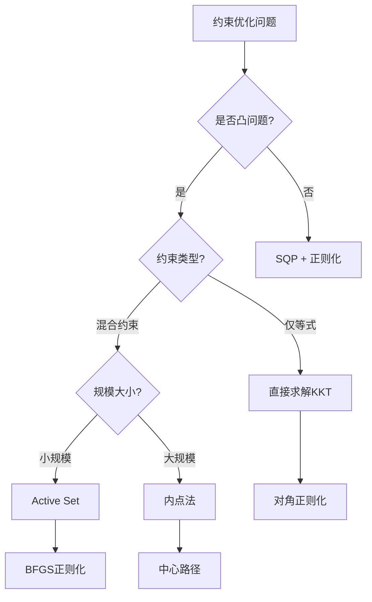
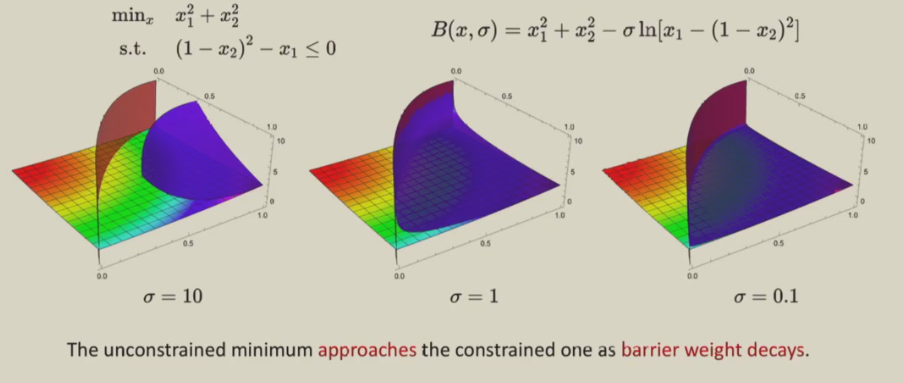
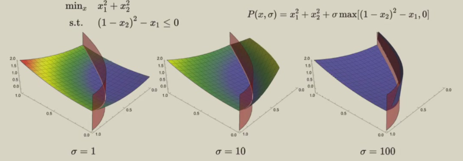
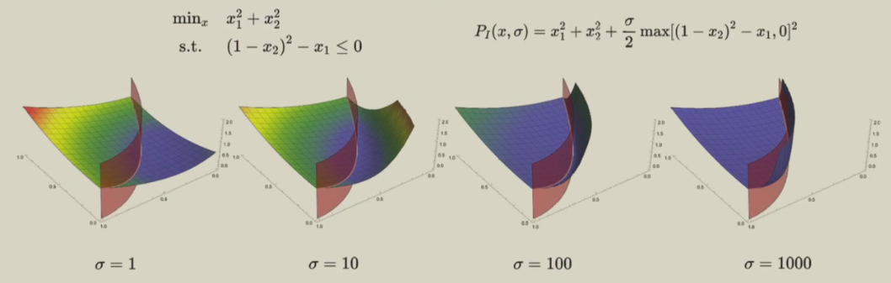
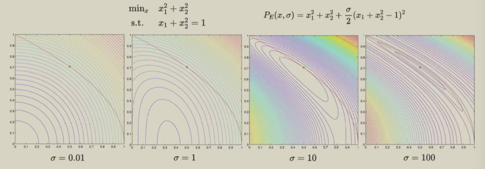
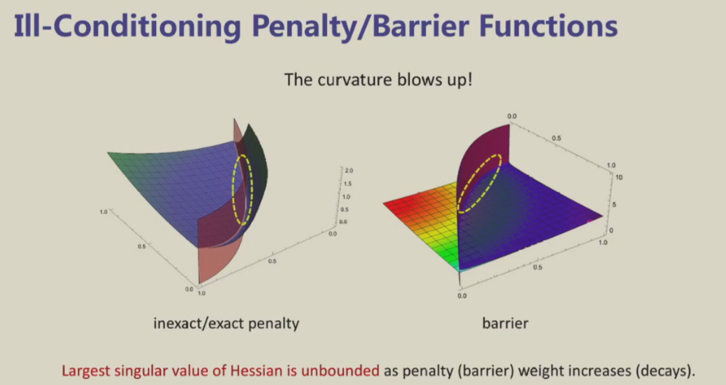
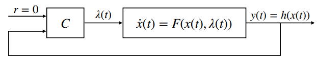
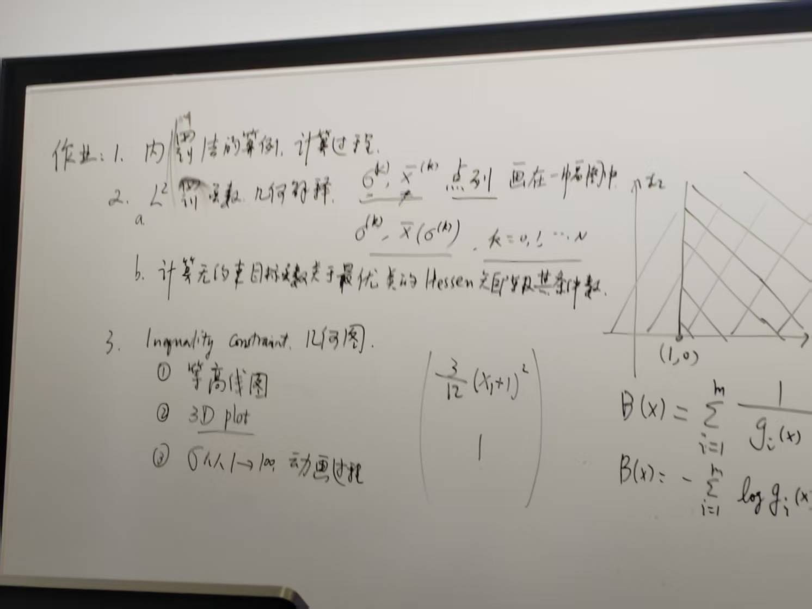

# Main Takeaway

连续最优控制问题


- [ ] 掌握KKT条件的推导和应用
- [ ] 理解对偶理论与拉格朗日方法
- [ ] 熟练使用各种约束优化算法
- [ ] 会设计Sequential Quadratic Programming(SQP)
- [ ] 理解罚函数法和增广拉格朗日法

<!--more-->


# 约束优化理论基础

这节主要介绍以下几个方面

- Focus on Constrained Optimization
- QP Problem,EQP,EIQP
- $NLP\to SQP$

## Problem Statement

$$
\min~ f(x)\\

subject~~ to\quad
g_j(x) = 0, j = 1, \ldots, m_1 \\
\quad g_j(x) \leq 0, j = m_1 + 1, \ldots, m_1 + m_2
$$

这类问题被称为非线性规划问题或数学规划问题
线性无关约束限定(LICQ):
在点$x^*$处，所有活跃约束的梯度线性无关：
$$
\{\nabla g_j(x^*) : j \in \{1,\ldots,m_1\} \cup J(x^*)\} \text{ 线性无关}
$$

意义: LICQ保证可行域在$x^*$附近具有良好的局部结构

基本概念

- 可行点: 满足所有约束的点 $x \in \mathbb{R}^n$

- 可行域: 所有可行点的集合
  $$
  \mathcal{X} = \{x : g_j(x) = 0, j \leq m_1; g_j(x) \leq 0, j > m_1\}
  $$

- 活跃约束: 在点$x$处，第$j$个不等式约束满足 $g_j(x) = 0$

- 活跃集: 
  $$
  J(x) = \{j \in \{m_1 + 1, \ldots, m_1 + m_2\} : g_j(x) = 0\}
  $$

# KKT Conditions

> 核心地位: 约束优化的基石，连接理论与算法的桥梁

## KKT条件详述

下面是KKT条件的完整叙述：

KKT条件是确认候选点是否为严格局部极小值的**一阶必要条件**

Suppose that $x^* \in \mathcal{X}$ is a local minimizer of the constrained optimization problem.

If $x^*$ is a regular point (i.e., the LICQ holds), then there exists a vector of Lagrange multipliers $\lambda^* = [\lambda_1^*, \ldots, \lambda_{m_1+m_2}^*]^\top$ 
$$
L(x^*, \lambda^*) = f(x)+\sum_{i=1}^{m_1}\lambda_i g_i(x)+\sum_{i=m_1+1}^{m_1+m_2}\lambda_i g_i(x)
$$
such that the following conditions are satisfied：

stationatity（梯度平稳性）
$$
\frac{\partial L(x^*, \lambda^*)}{\partial x} = 0
$$

primal feasibility（原始可行性）:
$$
g_j(x^*) = 0, \quad j = 1, \ldots, m_1
$$

$$
g_j(x^*) \leq 0, \quad j = m_1 + 1, \ldots, m_1 + m_2
$$

complementary feasibility（互补松弛条件complementarity conditions）:
$$
\lambda_j^* g_j(x^*) = 0, \quad j = 1, \ldots, m_1 + m_2
$$

dual feasibility（对偶可行性）:
$$
\lambda_j^* \geq 0, \quad j = m_1 + 1, \ldots, m_1 + m_2
$$
互补条件意味着要么约束条件 $j$ 被激活，要么对应的拉格朗日乘子 $\lambda_j^* = 0$ （或者两者皆有可能）

假设存在一个局部极小值点 $x^* \in \mathcal{X}$，以及一个满足 KKT 条件的对应拉格朗日乘子向量 $\lambda^*$，我们称 **严格互补条件** 成立的条件是：对于每个索引 $j \in \{m_1 + 1， \ldots， m_1 + m_2\}$，要么 $\lambda_j^*$ 为零，要么 $g_j(x^*)$ 为零，且二者中恰好有一个为零。

## 对偶理论和正则化

然后我们来介绍一下对偶性和正则化

### 对偶理论

#### 等式约束对偶化

考虑**仅含等式约束**的优化问题：
$$
\min_{x \in \mathbb{R}^n} f(x) \quad \text{s.t.} \quad h(x) = 0
$$
上述问题可以写成硬惩罚函数表达
$$
\begin{aligned}
&\min_{x} f(x) + P_{\infty}(h(x)) \\
&\text{where } P_{\infty}(x) = 
\begin{cases} 
0, & x = 0 \\
+\infty, & x \neq 0
\end{cases}
\end{aligned}
$$
等价地我们可以转化为如下形式（拉格朗日对偶化），将硬惩罚函数替换为软惩罚
$$
d(\lambda) := \min_x \left[ f(x) + \lambda^\top h(x) \right]
\\
\min_x \max_\lambda \left[ 
  f(x) + \lambda^\top h(x) 
\right]
$$

对偶函数$d(\lambda)$表示在给定乘子$\lambda$下，拉格朗日函数的下确界

在$h(x)$不等于0时，内层的max一定会把问题最大话成无穷大，所以当约束不满足时这个最优化问题肯定取不到最小值

对于**大部分的**凸优化问题，可以证明将min和max的符号切换后结果不变，这个结果也叫做强对偶

#### 一般约束问题的对偶理论

原始问题的标准形式

$$
\begin{align}
p^* = \min & \quad f_0(x) \\
\text{s.t.} & \quad f_i(x) \leq 0, \quad i = 1, \ldots, m \\
& \quad h_j(x) = 0, \quad j = 1, \ldots, p
\end{align}
$$

拉格朗日函数的完整形式

$$
L(x, \lambda, \nu) = f_0(x) + \sum_{i=1}^m \lambda_i f_i(x) + \sum_{j=1}^p \nu_j h_j(x)
$$

其中：

- $\lambda = (\lambda_1, \ldots, \lambda_m)$: 不等式约束的对偶变量，$\lambda_i \geq 0$
- $\nu = (\nu_1, \ldots, \nu_p)$: 等式约束的对偶变量，$\nu_j$无符号限制

对偶函数的性质

定义:
$$
g(\lambda, \nu) = \inf_{x \in \text{dom}f_0} L(x, \lambda, \nu)
$$

关键性质:

1. 凹性: $g(\lambda, \nu)$关于$(\lambda, \nu)$总是凹函数（即使原问题非凸）

   证明: 设$(\lambda_1, \nu_1)$和$(\lambda_2, \nu_2)$为任意两点，$\theta \in [0,1]$

   $$
   \begin{align}
   g(\theta(\lambda_1, \nu_1) + (1-\theta)(\lambda_2, \nu_2)) &= \inf_x L(x, \theta(\lambda_1, \nu_1) + (1-\theta)(\lambda_2, \nu_2)) \\
   &= \inf_x [\theta L(x, \lambda_1, \nu_1) + (1-\theta) L(x, \lambda_2, \nu_2)] \\
   &\geq \theta \inf_x L(x, \lambda_1, \nu_1) + (1-\theta) \inf_x L(x, \lambda_2, \nu_2) \\
   &= \theta g(\lambda_1, \nu_1) + (1-\theta) g(\lambda_2, \nu_2)
   \end{align}
   $$

2. 下界性质: 对任意可行$x$和$\lambda \geq 0, \nu$:
   $$
   g(\lambda, \nu) \leq f_0(x)
   $$

对偶问题的完整形式

$$
\begin{align}
d^* = \max & \quad g(\lambda, \nu) \\
\text{s.t.} & \quad \lambda \geq 0
\end{align}
$$

#### 弱对偶和强对偶


- 弱对偶定理：对于任何优化问题，弱对偶总是成立：$$d^* \leq p^*$$
  证明: 设$\tilde{x}$为原问题的任意可行解，$(\lambda, \nu)$为对偶问题的任意可行解。
  $$
  \begin{align}
  L(\tilde{x}, \lambda, \nu) &= f_0(\tilde{x}) + \sum_{i=1}^m \lambda_i f_i(\tilde{x}) + \sum_{j=1}^p \nu_j h_j(\tilde{x}) \\
  &\leq f_0(\tilde{x}) + \sum_{i=1}^m \lambda_i \cdot 0 + \sum_{j=1}^p \nu_j \cdot 0 \\
  &= f_0(\tilde{x})
  \end{align}
  $$

  因此：
  $$
  g(\lambda, \nu) = \inf_x L(x, \lambda, \nu) \leq L(\tilde{x}, \lambda, \nu) \leq f_0(\tilde{x})
  $$
  对所有可行解取下确界得到弱对偶
  
- 对偶间隙：$p^* - d^*$称为对偶间隙（duality gap）

  分类:
  - $p^* - d^* = 0$: 强对偶成立
  - $p^* - d^* > 0$: 存在对偶间隙

- 强对偶定理：在某些条件下，强对偶成立：$d^* = p^*$

  **Slater条件**（充分条件）:
  对于凸优化问题，若存在$x \in \text{relint}(\text{dom}f_0)$使得：
  $$
  f_i(x) < 0, \quad i = 1, \ldots, m \quad \text{且} \quad Ax = b
  $$
  则强对偶成立

#### KKT条件的对偶解释

假设强对偶成立且最优值有限，则$x^*$和$(\lambda^*, \nu^*)$分别为原问题和对偶问题最优解的充要条件是：

1. 原始可行性: $f_i(x^*) \leq 0, h_j(x^*) = 0$
2. 对偶可行性: $\lambda^* \geq 0$
3. 互补松弛性: $\lambda_i^* f_i(x^*) = 0, \forall i$
4. 梯度条件: $\nabla f_0(x^*) + \sum_{i=1}^m \lambda_i^* \nabla f_i(x^*) + \sum_{j=1}^p \nu_j^* \nabla h_j(x^*) = 0$

互补松弛性的深层含义：

经济学解释: $\lambda_i^*$可视为第$i$个约束的"影子价格"
- 若$\lambda_i^* > 0$，则约束$i$是"紧的"（$f_i(x^*) = 0$），放松该约束会改善目标函数
- 若$f_i(x^*) < 0$，则约束$i$是"松的"，其影子价格为零（$\lambda_i^* = 0$）

#### 二次规划的对偶

原始QP问题

$$
\begin{align}
\min & \quad \frac{1}{2}x^T Q x + c^T x \\
\text{s.t.} & \quad Ax = b \\
& \quad Gx \leq h
\end{align}
$$

对偶QP问题

通过拉格朗日对偶化：

$$
\begin{align}
\max & \quad -\frac{1}{2}(A^T\nu + G^T\lambda + c)^T Q^{-1} (A^T\nu + G^T\lambda + c) + b^T\nu + h^T\lambda \\
\text{s.t.} & \quad \lambda \geq 0
\end{align}
$$

对偶关系:
- 若原问题有$n$个变量和$m$个约束，对偶问题有$m$个变量
- QP的对偶仍为QP（保持问题结构）

#### 线性规划的对偶

原始LP问题

$$
\begin{align}
\min & \quad c^T x \\
\text{s.t.} & \quad Ax = b \\
& \quad x \geq 0
\end{align}
$$

对偶LP问题

$$
\begin{align}
\max & \quad b^T y \\
\text{s.t.} & \quad A^T y \leq c
\end{align}
$$

对偶定理: 若原问题和对偶问题都可行，则最优值相等：$c^T x^* = b^T y^*$

#### 半定规划(SDP)的对偶

原始SDP问题

$$
\begin{align}
\min & \quad \text{tr}(CX) \\
\text{s.t.} & \quad \text{tr}(A_i X) = b_i, \quad i = 1, \ldots, m \\
& \quad X \succeq 0
\end{align}
$$

对偶SDP问题

$$
\begin{align}
\max & \quad b^T y \\
\text{s.t.} & \quad \sum_{i=1}^m y_i A_i + S = C \\
& \quad S \succeq 0
\end{align}
$$

强对偶: 在内点条件下，SDP强对偶几乎总是成立。

### 正则化

#### 正则化动机和必要性

若我们用KKT条件解优化问题，得到的解是关于$x,\lambda$的**驻点**，假如最终得到的点x和λ确实是最小化的解，那么说明式子是成立的，则说明得到的x是极小值点而λ是极大值点。因此，对于**带约束的问题的正则化**（目的是**保证优化方向一直向着最小化方向**走），则其Hessian阵应该有

- $dim(x)$个正的特征值
- $dim(λ)$个负的特征值

这样的KKT系统叫做"**Quasi-definite''系统**.

> 这种特征值分布使得KKT系统具有“准对角”性质，即通过添加适当的正则项，可以调整Hessian矩阵的特征值，使其满足上述条件。这在实际应用中非常有用，尤其是在使用牛顿法等迭代优化方法时，通过确保Hessian矩阵的“quasi-definiteness”，可以有效避免迭代过程中可能出现的不收敛或收敛到非极小值点的问题

标准KKT系统:
$$
\begin{bmatrix} H & A^T \\ A & 0 \end{bmatrix} \begin{bmatrix} \Delta x \\ \Delta \lambda \end{bmatrix} = \begin{bmatrix} -\nabla f - A^T \lambda \\ -c \end{bmatrix}
$$
病态性问题:

1. 特征值分布不当: 理想的Quasi-definite性质要求
   - $\dim(x)$个正特征值
   - $\dim(\lambda)$个负特征值

2. 条件数恶化: 当约束接近线性相关时，$A^T A$接近奇异

3. 数值不稳定: 小的扰动可能导致解的大幅偏移

#### 正则化方法

- 对角正则化(Diagonal Regularization)

  基本形式：
  $$
  \begin{bmatrix} H + \delta_x I & A^T \\ A & -\delta_\lambda I \end{bmatrix}
  $$

  1. 固定正则化: $\delta_x = \delta_\lambda = \epsilon$ (小正数)
  2. 自适应正则化: 根据条件数动态调整
  3. 特征值修正: 确保惯性指数正确

- Tikhonov正则化

  在目标函数中添加二次正则项
  $$
  \min f(x) + \frac{\alpha}{2}\|x\|^2 \quad \text{s.t.} \quad g(x) = 0
  $$

  - Hessian变为$\nabla^2 f(x) + \alpha I$，保证正定性
  - 解的唯一性和稳定性改善
  - 正则化参数$\alpha$控制偏差-方差权衡

- 约束正则化

  修正的等式约束:
  $$
  g(x) + \epsilon e = 0
  $$
  其中$e$为随机扰动向量。

  投影正则化:
  $$
  \min f(x) + \frac{\rho}{2}\|g(x)\|^2
  $$

#### Example

下面给出一个带约束问题的regularization的实例

在牛顿法进行迭代时在某些初始点不能收敛到极小值，因此我们要对其添加正则化

```julia
function regularized_newton_step(x,λ)
    H = ∇2f(x) + ForwardDiff.jacobian(xn -> ∂c(xn)'*λ, x)
    C = ∂c(x)
    K = [H C'; C 0]
    e = eigvals(K)  # 这种判断Hessian是不是"quasi-definite"的方式是非常expensive的
    while !(sum(e .> 0) == length(x) && sum(e .< 0) == length(λ))   # 不断添加正则项，直到满足要求
        K = K + Diagonal([ones(length(x)); -ones(length(λ))])
        e = eigvals(K)
    end
    Δz = K\[-∇f(x)-C'*λ; -c(x)]
    Δx = Δz[1:2]
    Δλ = Δz[3]
    return Δx, Δλ
end
```

> 解决了收敛于极值小值点的问题，但是仍然存在超调现象

KKT条件只能找到驻点，无法区分极小、极大或鞍点。

接着我们介绍确认候选点是否为严格局部极小值的**二阶充分条件**：二阶条件通过曲率分析，确保目标函数在可行方向上“向上弯曲”——排除鞍点

## 二阶最优性条件

二阶最优性条件Second-order Sufficient Conditions

Consider the Hessian (with respect to $x$) of the Lagrangian function $L(x, \lambda)$:
$$
\nabla_x^2 L(x, \lambda) = 
\begin{bmatrix}
\frac{\partial^2 L}{\partial x_1^2} & \frac{\partial^2 L}{\partial x_1 \partial x_2} & \cdots & \frac{\partial^2 L}{\partial x_1 \partial x_n} \\
\frac{\partial^2 L}{\partial x_2 \partial x_1} & \frac{\partial^2 L}{\partial x_2^2} & \cdots & \frac{\partial^2 L}{\partial x_2 \partial x_n} \\
\vdots & \vdots & \ddots & \vdots \\
\frac{\partial^2 L}{\partial x_n \partial x_1} & \frac{\partial^2 L}{\partial x_n \partial x_2} & \cdots & \frac{\partial^2 L}{\partial x_n^2}
\end{bmatrix}
= \frac{\partial}{\partial x} \left( \frac{\partial L}{\partial x} \right)^\top
$$
Suppose that a feasible point $x^* \in \mathcal{X}$ satisfies the KKT conditions for some Lagrange multiplier vector $\lambda^* \in \mathbb{R}^{m_1 + m_2}$. If the following condition holds:
$$
p^\top \nabla_x^2 L(x^*, \lambda^*) p > 0, \quad \forall p \in M^* \setminus \{0\}
$$
where $M^*$ is the set of vectors $w \in \mathbb{R}^n$ satisfying:

$$
\begin{aligned}
w^\top \nabla g_j(x^*) &= 0, && j = 1, \ldots, m_1 \quad \text{(等式约束)} \\
w^\top \nabla g_j(x^*) &= 0, && j \in \left\{ i \in J(x^*) : \lambda_i^* > 0 \right\} \quad \text{(活跃且乘子正的不等式约束)} \\
w^\top \nabla g_j(x^*) &\geq 0, && j \in \left\{ i \in J(x^*) : \lambda_i^* = 0 \right\} \quad \text{(活跃但乘子零的不等式约束)}
\end{aligned}
$$
then $x^*$ is a **strict local minimum** of the constrained optimization problem

这里$M^*$为在可行域$x^*$定义的切锥

> 因此不能直接看Hessian矩阵是否正定，只要$p$在定义域内满足即可（直接看Hessian可能不一定满足）

- 理论分析：证明优化算法的收敛性（如SQP方法）。
- 工程控制：在最优控制问题中验证Bang-Bang控制的严格最优性。
- 非凸优化：深度学习中的损失函数可能存在多个鞍点，二阶条件可辅助设计逃离鞍点的算法。

| 条件类型            | 要求                              | 作用               |
| ------------------- | --------------------------------- | ------------------ |
| 一阶必要条件（KKT） | 梯度平稳性、可行性、互补松弛性    | 筛选候选点         |
| 二阶必要条件        | Hessian在**临界子空间**上半正定   | 排除明显非最优驻点 |
| 二阶充分条件        | Hessian在**临界子空间**上严格正定 | 确认严格局部最优   |

# 约束优化算法

下面介绍几种带约束问题的优化算法




## Active set method

核心想法：找一堆guess heuristic function（启发式函数）来不断猜测哪些不等式约束是生效的（等式约束），找到之后，不生效的约束则不作任何处理（当作没有），则按照只有等式约束的问题来迭代一次，之后继续判断哪些集合是生效的。

算法步骤：

1. 在每次迭代过程中，使用启发函数估计当前迭代点的活跃约束集合$\mathcal{W}_k$

   将复杂的带不等式约束的QP问题转化为一系列等式约束的QP子问题，来逐步逼近最优解

2. 等式约束都可以用Quadratic Programming with Equality Constraints来求解，那些不等式约束如果在active set中则视为等式约束，如果不在则不考虑

3. 最优性检验

   - 若所有活跃不等式约束的拉格朗日乘子 $\lambda_j \geq 0$，则找到最优解
   - 否则，从活跃集中移除 $\lambda_j < 0$ 的约束


算法优缺点：

- 当有一个很好的heuristic的时候，这个是很快的。教授在课上举例说，MIT的某个组在DARPA挑战赛中设计了一堆合理的启发函数来估计active set，进而解机器人QP问题，这个启发函数在95%的情况都是正确的，在剩下的5%的情况就再继续估计，这样做可以做到几千赫兹
- 当估计的很差的时候，这种解法效果不好

## Penalty Methods

核心思想：将约束优化转化为一系列无约束优化问题


| 方法           | 优点                 | 缺点                       | 适用场景             |
| -------------- | -------------------- | -------------------------- | -------------------- |
| **对数障碍法** | 保证可行性，理论完备 | 只处理不等式，需严格可行点 | 中小规模凸优化       |
| **L1罚函数**   | 精确罚函数，实现简单 | 非光滑，矩阵病态           | 快速原型，非精确求解 |
| **L2罚函数**   | 光滑，数值稳定       | 非精确，需大惩罚参数       | 一般非线性优化       |

罚函数法分为两种：

- 内罚法（Barrier Method）：目标函数中引入一个障碍函数（如倒数障碍、对数障碍），**仅适用于不等式约束**

  算法步骤：给出罚因子$\rho$求解无约束问题，然后不断减小$\rho$，使得解逐渐收敛到原问题的最优点

  1. 初始化：选择$\rho_0 > 0$，找到严格可行点$x_0$
  2. 求解子问题：最小化$f(x) + \frac{1}{\rho_k} \sum B(g_j(x))$
  3. 参数更新：$\rho_{k+1} = \alpha \rho_k$，其中$0 < \alpha < 1$
  4. 收敛检验：当$\rho_k$足够小时停止

  

  - 优点：每个近似最优解都是可行解（因为迭代点始终处于可行域内部）

    这是比较常用的方法，对于**中小规模**（变量范围在几千几万左右的）的**凸优化**问题来说这种方法是gold standard。

    对于非凸问题，需要很多工程上的hacks和tricks来保证生效

  - 缺陷：

    - 障碍因子$\rho$不断减小也会导致Hessian趋于病态（梯度悬崖），在数值求解过程中造成很大麻烦

    - 只能处理不等式约束

    - 需要严格可行的初始点

- 外罚法（Exterior Penalty Method）：对违反约束的点添加惩罚项，$\min f(x)+\lambda\times P(x),\lambda$逐渐增大至无穷。分为L1和L2两种罚函数

  - L1罚函数（精确罚函数）：
    $$
    F_\rho(x) = f(x) + \rho( \sum_{j=1}^{m_1} |g_j(x)| + \sum_{j=m_1+1}^{m_1+m_2} \max\{g_j(x), 0\})
    $$
    对违反约束的点施加线性惩罚（绝对值项），惩罚强度与偏离程度成比例

    有限大小的$\mu$即可保证解是原问题的**精确解**，能够快速收敛

    

    
    
    > 注意墙角的非光滑性
    
    - 优点：实现很简单，有限$\rho$即可得精确解
    
    - 缺陷：
    
      - 需要处理非光滑性（墙角效应），难以达到高精度，无法保证最终的约束得到满足。
    
      - 会使整个KKT系统的Hessian矩阵变得病态ill-conditioned(由于这些非线性优化项引入的系统的Hessian，会使Hessian阵的特征值分布广，使条件数很大)
    
        要让约束完全得到满足，则约束的权重ρ要取到无穷大，这在实际情况是不能接受的，也会造成矩阵病态
      
      > Tips: 工程上trick，先用先使用惩罚项来polish问题，再切换其它方法
    
  - L2罚函数（二次罚函数）：
    $$
    F_\rho(x) = f(x) +\frac{ \rho}{2} (\sum_{j=1}^{m_1} g_j(x)^2 +  \sum_{j=m_1+1}^{m_1+m_2} \max\{g_j(x), 0\}^2)
    $$
    
  
       - $\rho > 0$：罚参数，控制惩罚强度
       - 等式约束惩罚：$g_j(x)^2$（强制$g_j(x) \to 0$）
       - 不等式约束惩罚：$\max(g_j(x),0)^2$（仅在违反约束时激活）

    要求问题光滑，数值稳定性有限。求解过程如下：
  
    
  
    - 缺点：
  
      罚因子$\rho$增大时，解逐渐逼近原问题的最优解。但$\rho$过大会导致Hessian矩阵病态。对于无约束优化问题的数值方法拟牛顿法与共轭梯度法存在数值困难，且需要多次迭代求解子问题
    
      这里只给出等式约束的罚函数的Hessian矩阵：
      $$
      \nabla_{xx}^2F(x,\rho) \approx \nabla_{xx}^2L(x,\lambda^*)+\sigma\nabla c(x)\nabla c(x)^T
      $$
      右边为一个定值矩阵和一个最大特征值趋于正无穷的矩阵，这导致$\nabla_{xx}^2F(x,\rho)$条件数越来越大，求解子问题的难度也会相应地增加
  
      
  
      > 可以看到求解的区域越来越狭长
    
      - 对于存在不等式约束的function可能不存在二次可微性质，光滑性降低
      - 不精确，与原问题最优解存在距离




对比其他方法：

| **方法**         | **优点**                     | **缺点**                 |
| ---------------- | ---------------------------- | ------------------------ |
| 二次罚函数法     | 简单易实现，可处理非线性约束 | 需大$\rho$导致数值不稳定 |
| 障碍函数法       | 保证内点解                   | 无法处理等式约束         |
| 增广Lagrangian法 | 允许有限$\rho$收敛           | 需估计Lagrange乘子       |


## Sequential Quadratic Programming(SQP)

> Notes：处理非线性约束的最有效方法之一

### 基本思想

针对带等式和不等式约束的问题

SQP 方法是通过在当前点 $x^k$ 处对优化问题进行建模，构建一个 QP 子问题来实现的，该子问题可以利用二次规划技术来求解。该子问题的解将用于确定下一个点 $x^{k+1}$ 

设 $x^k \in \mathbb{R}^n$ 为当前点，设 $\lambda^k \in \mathbb{R}^n$ 为与之对应的拉格朗日乘子向量。

Quadratic approximation of the objective:
$$
f(x^k + p) \approx f(x^k) + \nabla f(x^k)^T p + \frac{1}{2} p^T \nabla_x^2 L(x^k, \lambda^k) p
$$
Linear approximation of the constraints:
$$
g_j(x^k + p) \approx g_j(x^k) + \nabla g_j(x^k)^T p = 0
$$
### QP子问题

$$
\begin{align}
\min_p &~~~ f(x^k) + \nabla f(x^k)^T p + \frac{1}{2} p^T \nabla_x^2 L(x^k, \lambda^k) p \\
\text{s.t.} & \quad g_j(x^k) + \nabla g_j(x^k)^T p = 0, \quad j = 1,\ldots,m_1 \\
& \quad g_j(x^k) + \nabla g_j(x^k)^T p \leq 0, \quad j = m_1+1,\ldots,m_1+m_2
\end{align}
$$
where $L$ is the Lagrangian defined by
$$
L(x, \lambda) = f(x) + \sum_{j=1}^{m_1+m_2} \lambda_j g_j(x)
$$
Lagrangian Hessian Matrix
$$
\nabla_x^2 L(x, \lambda) = \begin{bmatrix}
\frac{\partial^2 L}{\partial x_1^2} & \cdots & \frac{\partial^2 L}{\partial x_1 \partial x_n} \\
\vdots & \ddots & \vdots \\
\frac{\partial^2 L}{\partial x_n \partial x_1} & \cdots & \frac{\partial^2 L}{\partial x_n^2}
\end{bmatrix} 
= \frac{\partial}{\partial x} \left[ \frac{\partial L(x, \lambda)}{\partial x} \right]^\top
$$
> Tips：为什么用$\nabla^2_x L$而非$\nabla^2 f$：是为了将约束的曲率也考虑进去

实际中我们常用BFGS来更新Lagrangian Hessian Matrix

### Off-the-shelf NLP Solvers

open source：

- **IPOPT**: Interior Point Optimizer
- **SNOPT**: Sparse Nonlinear OPTimizer

commercial：

- **NLPQLP**
   Nonlinear Programming using Quadratic Lagrangian (with Powell stabilization)

- **FFSQP**
   Fast Feasible Sequential Quadratic Programming

- **NPSQP**
   Nonlinear Programming Sequential Quadratic Programming


## 增广拉格朗日法（ALM）

增广拉格朗日法PHR Augmented Lagrangian Method

> 做轨迹规划用这个做得很多？

核心思想：融合拉格朗日法+惩罚法，通过引入二次惩罚项增强目标函数的光滑性，从而避免传统外罚函数法中因惩罚系数过大导致的数值不稳定性（增广目标函数越来越病态）。

### For Equality-Constrained Cases

#### Uzawa方法

考虑仅含等式约束的优化问题：

$$
\min_{x \in \mathbb{R}^n} f(x) \quad \text{s.t.} \quad h(x) = 0
$$
下面我们先介绍一下Uzawa方法

方法原理：交替优化原始变量$x$和对偶变量$\lambda$，通过在对偶函数上执行对偶梯度上升：
$$
\begin{aligned}
&\min_{x} f(x) + P_{\infty}(h(x)) \\
&\text{where } P_{\infty}(x) = 
\begin{cases} 
0, & x = 0 \\
+\infty, & x \neq 0
\end{cases}
\end{aligned}
$$
等价地我们可以转化为如下形式
$$
d(\lambda) := \min_x \left[ f(x) + \lambda^\top h(x) \right]
$$
$$
\min_x \max_\lambda \left[ 
  f(x) + \lambda^\top h(x) 
\right]
$$

在$h(x)$不等于0时，内层的max一定会把问题最大话成无穷大，所以当约束不满足时这个最优化问题肯定取不到最小值

对于**大部分的**凸优化问题，可以证明将min和max的符号切换后结果不变，这个结果也叫做强对偶

Uzawa方法的局限：

- 若拉格朗日函数关于$ x $非严格凸，则对偶函数非光滑：
  $$
  \nabla d(\lambda) \ \text{可能不存在!}
  $$

  > 非严格凸时，可能存在多个x使$ L(x,λ)$ 达到极小值。此时，对偶函数在参数变化时可能发生“跳跃”或“拐角”，导致其导数不连续或不存在（非光滑）。

- 对偶梯度上升（Dual Gradient Ascent）因梯度不存在而失效。

#### PHR方法

> PHR：Proximal Point Regularization

因此在PHR方法中，通过引入**邻近点(proximal point)正则化项**平滑极小化极大（Minimax）问题，同时避免交换min和max顺序的复杂性
$$
\min_x \max_\lambda \left[ 
  f(x) + \lambda^\top h(x) - \frac{1}{2\rho} \|\lambda - \bar{\lambda}\|^2 
\right]
$$

- $ \rho > 0 $：正则化参数
- $ \bar{\lambda} $：先验拉格朗日乘子估计值，如上一轮迭代结果

优势：
1. 避免对偶梯度上升的不可行性
2. 直接优化原始极小化极大问题，不需要进行Uzawa的交替优化
3. 正则化项$ \frac{1}{2\rho}\|\lambda - \bar{\lambda}\|^2 $迫使乘子更新不过度偏离历史值，提升数值稳定性

下面我们对问题进行推导求解：

先进行内层问题求解
$$
\max_\lambda \left[ 
f(x) + \lambda^\top h(x) - \frac{1}{2\rho} \|\lambda - \bar{\lambda}\|^2 
\right]
$$
通过求导可得闭式解：

$$
\lambda^*(\bar{\lambda}) = \bar{\lambda} + \rho h(x)
$$
外层问题转换：将解析解代入原问题，推导无约束优化形式：
$$
\begin{align*}
\min_x \max_\lambda \left[ \cdot \right] 
&= \min_x \left[ 
f(x) + (\bar{\lambda} + \rho h(x))^\top h(x) 
- \frac{\rho}{2} \|h(x)\|^2 
\right] \\
&= \min_x \left[ 
f(x) + \bar{\lambda}^\top h(x) + \frac{\rho}{2} \|h(x)\|^2 
\right]
\end{align*}
$$
这样我们就得到原问题的近似解，如何提高精度：

- 通过减小近似权重 $\frac{1}{\rho}$ 提升精度
- 迭代更新先验值$\bar{\lambda} \leftarrow \lambda^*(\bar{\lambda})$

实际算法流程：

1. 初始化：设置初始乘子 $\bar{\lambda}_0$ 和惩罚参数 $\rho_0$

2. 迭代步骤：
   - 求解无约束子问题：
     $$
     x_k = \arg\min_x \left[ 
          f(x) + \bar{\lambda}_k^\top h(x) + \frac{\rho_k}{2} \|h(x)\|^2 
          \right]
     $$
   
   - 更新乘子：

$$
     \bar{\lambda}_{k+1} = \bar{\lambda}_k + \rho_k h(x_k)
$$

3. 精度控制：当 $\|h(x_k)\| < \epsilon$ 时终止


现在我们重新来看$x_k$的计算公式，相当于求解
$$
\min_{x \in \mathbb{R}^n} f(x)+\frac{\rho_k}{2} \|h(x)\|^2  \quad \text{s.t.} \quad h(x) = 0
$$
与原始问题相等，它的Lagrangian也被称为Augmented Lagrangian of the original problem
$$
L(x,\lambda,\rho) =f(x) + \bar{\lambda}_k^\top h(x) + \frac{\rho_k}{2} \|h(x)\|^2
$$
因此被称为融合拉格朗日法+惩罚法


### For Inequality-Constrained Cases

考虑带非凸不等式约束的优化问题：

$$
\min_{x \in \mathbb{R}^n} f(x) \quad \text{s.t.} \quad g(x) \leq 0
$$
通过引入松弛变量 $s \in \mathbb{R}^m$，将不等式约束转化为等式约束：

$$
\begin{cases}
\min_{x, s} f(x) \\
\text{s.t.} \quad g(x) + [s]^2 = 0 \\
\quad \ \ s \geq 0 
\end{cases}
$$

> 其中，$[\cdot]^2$ 表示逐元素平方运算。松弛变量s也不知道，也被当做一个决策变量进行优化

定义含松弛变量和惩罚项的增广拉格朗日函数：

$$
\mathcal{L}_\rho(x, \mu) = f(x) + \frac{\rho}{2} \left\| \max\left( g(x) + \frac{\lambda}{\mu},\ 0 \right) \right\|^2 - \frac{\lambda}{2\rho} \|\mu\|^2
$$

对偶上升算法乘子更新规则：
$$
\mu^{k+1} = \max\left( \mu^k + \rho g(x^{k+1}) ,\ 0 \right)
$$

通过松弛变量$s$在可行域（$s \geq 0$）和约束边界（$g(x)+s=0$）之间建立缓冲带，使非凸约束的优化轨迹更平滑。惩罚项$\|\max(g(x)+s,0)\|^2$的引入，使得解在远离可行域时受到更强惩罚。

### ALM优势

理论优势:

- 允许有限惩罚参数收敛
- 避免Hessian严重病态
- 超线性收敛速度

实际优势:

- 轨迹规划中广泛应用
- 鲁棒性好
- 易于并行化

# 二次规划问题QP

Quadratic Programming Problem

## Problem Statement

标准QP形式
$$
\begin{align}
\min_{x \in \mathbb{R}^n} & \quad f(x) =\frac{1}{2}x^T Q x + c^T x \\
\text{s.t.} & \quad a_j^T x = b_j, \quad j = 1,\ldots,m_1 \\
& \quad a_j^T x \leq b_j, \quad j = m_1+1,\ldots,m_1+m_2
\end{align}
$$
Parameters:

- $  m_1  $: Number of equality constraints
- $  m_2  $: Number of inequality constraints
- $  Q \in \mathbb{R}^{n \times n}  $: Symmetric matrix
- $  c \in \mathbb{R}^n  $: Linear term vector
- $  a_j \in \mathbb{R}^n  $: Constraint vectors ($  j = 1,\ldots,m_1+m_2  $)
- $  b_j \in \mathbb{R}  $: Constraint constants ($  j = 1,\ldots,m_1+m_2  $)

QP的重要地位

- SQP方法的子问题
- 最优控制的LQR问题
- 机器人运动规划
- 投资组合优化


## 等式约束二次规划(EQP)

> Quadratic Programming with Equality Constraints

$$
\begin{align}
\min & \quad \frac{1}{2}x^T Q x + c^T x \\
\text{s.t.} & \quad Ax = b
\end{align}
$$

Parameters:

- $  Q \in \mathbb{R}^{n \times n}  $: Symmetric matrix
- $  c \in \mathbb{R}^n  $: Linear term vector
- $  A \in \mathbb{R}^{m \times n}  $: Constraint matrix
- $  b \in \mathbb{R}^m  $: Equality constraint constants

Assumptions:

- Number of equality constraints $  m < n  $
- $  \text{rank}(A) = m  $ (full row rank)

Lagrangian Function:
$$
L(x, \lambda) = \frac{1}{2} x^\top Q x + c^\top x + \lambda^\top (Ax - b)
$$
应用KKT条件

$$
\begin{align}
\nabla_x L &= Qx^* + c + A^T\lambda^* = 0 \\
\nabla_\lambda L &= Ax^* - b = 0
\end{align}
$$

$$
\begin{bmatrix}
Q & A^\top \\
A & 0
\end{bmatrix}
\begin{bmatrix}
x^* \\
\lambda^*
\end{bmatrix}
=
\begin{bmatrix}
-c \\
b
\end{bmatrix}
$$

当 $  Q  $ 正定且 $  A  $ 满秩时，分块矩阵的逆矩阵表达式为：

$$
\begin{bmatrix}
Q & A^\top \\
A & 0
\end{bmatrix}^{-1}
=
\begin{bmatrix}
H & P^\top \\
P & S
\end{bmatrix}
$$

其中各子矩阵：

- $  H = Q^{-1} - Q^{-1}A^\top(AQ^{-1}A^\top)^{-1}AQ^{-1}  $
- $  P = (AQ^{-1}A^\top)^{-1}AQ^{-1}  $
- $  S = -(AQ^{-1}A^\top)^{-1}  $

$$
\begin{bmatrix}
x^* \\
\lambda^*
\end{bmatrix}
=
\begin{bmatrix}
Q & A^\top \\
A & 0
\end{bmatrix}^{-1}
\begin{bmatrix}
-c \\
b
\end{bmatrix}
$$

$$
x^* = -Hc + P^\top b \\
= -Q^{-1}c + Q^{-1}A^\top(AQ^{-1}A^\top)^{-1}(AQ^{-1}c + b)
$$

$$
\lambda^* = -Pc + Sb \\
= -(AQ^{-1}A^\top)^{-1}(AQ^{-1}c + b)
$$

---

> $AQ^{-1}A^\top$将原始空间的梯度投影到约束空间时，根据$Q^{-1}$权重进行缩放

## 不等式约束二次规划(IQP)

- Active Set求解策略

  核心思想: 猜测最优解处的活跃约束集，转化为EQP求解。

  求解步骤:

  1. 初始化活跃集$\mathcal{W}_0$
  2. 求解EQP: $\min \frac{1}{2}x^T Q x + c^T x$ s.t. $a_j^T x = b_j, j \in \mathcal{W}_k$
  3. 检查KKT条件，更新活跃集
  4. 重复直到收敛

- 内点法求解

  基本思想: 通过障碍函数保持严格可行性，逐步逼近边界。

  障碍问题:
  $$
  \min_{x} \frac{1}{2}x^T Q x + c^T x - \mu \sum_{j} \log(b_j - a_j^T x)
  $$
  路径跟踪: 随着$\mu \to 0^+$，解路径收敛到原问题最优解。

# 控制论思想下的约束问题

> 现代发展: 将控制论思想引入优化算法设计

## 控制论思想下的约束问题

- Proximal Gradient Dynamics and Feedback Control for Equality-Constrained Composite Optimization  

  解决等式约束的复合凸优化问题：
  $$
  \min f(x)+g(x),s.t.\quad h(x)=0
  $$
  提出PI-PGD方法，将优化问题建模为连续时间动力系统，并通过反馈控制调节拉格朗日乘子（视为控制输入），驱动系统收敛至可行解

  

- Control-Barrier-Function-Based Design of Gradient Flows for Constrained Nonlinear Programming  

  在带约束的非线性优化问题中，传统梯度流方法难以保证解的**可行性**（始终满足约束）和**稳定性**（收敛到可行集的局部/全局最优）。论文提出一种结合**控制屏障函数（CBF）**的梯度流方法，解决以下问题：

  - 确保可行集的前向不变性（任何初始可行点保持可行）；
  - 实现可行集的渐近稳定性（不可行初始点收敛到可行集）；
  - 设计连续、光滑的动力学系统，避免传统投影梯度流的不连续性。

  方法：**Safe Gradient Flow**，核心思想：将优化问题视为闭环控制系统


## HW



对比$l_1$和$l_2$罚函数法，关注“墙角”的过度平滑性

罚函数如何让增广函数越来越病态？画图看看


# References

- https://zhuanlan.zhihu.com/p/629131647
- [2023-2024春夏许超老师最优化与最优控制课程分享 - CC98论坛](https://www.cc98.org/topic/5923253)

- [Tutorial — Ceres Solver (ceres-solver.org)](http://ceres-solver.org/tutorial.html)
- 推导：[Karush-Kuhn-Tucker (KKT)条件](https://zhuanlan.zhihu.com/p/38163970)