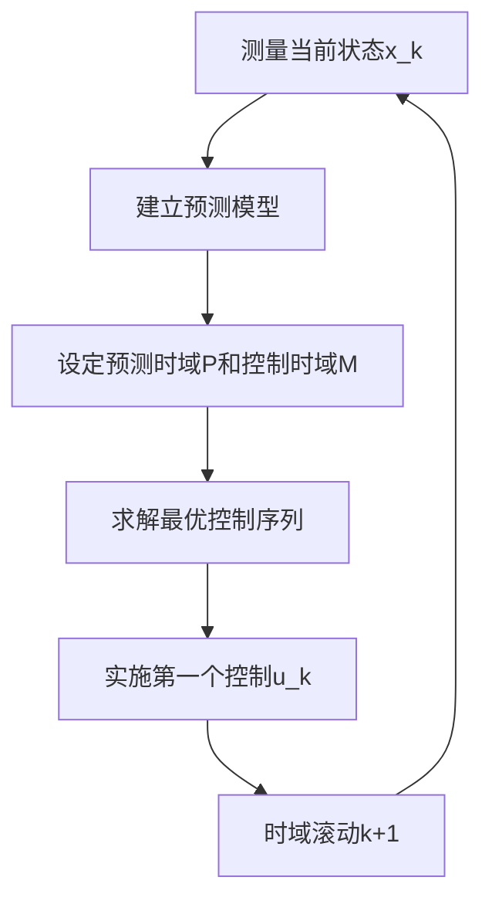
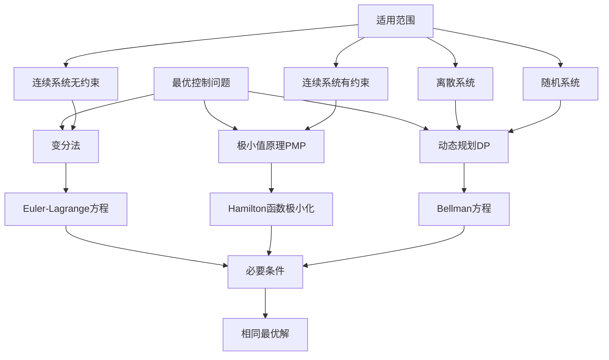

# Main Takeaway

离散最优控制

- [ ] 掌握连续系统离散化方法
- [ ] 理解离散最优控制的矩阵形式求解
- [ ] 会设计模型预测控制(MPC)算法
- [ ] 熟练使用动态规划方法
- [ ] 理解三大方法(变分法、PMP、DP)的关联

<!--more-->

# 连续线性系统离散化

连续时间线性系统：
$$
\dot{x}(t) = Ax(t) + Bu(t)
$$
目标：得到离散时间系统：
$$
x_{k+1} = A_d x_k + B_d u_k
$$

| 方法       | 精度 | 计算复杂度 | 稳定性保持 | 适用场景   |
| ---------- | ---- | ---------- | ---------- | ---------- |
| 直接离散化 | 低   | 低         | 差         | 快速原型   |
| 零阶保持   | 高   | 中         | 好         | 一般应用   |
| 一阶保持   | 最高 | 高         | 最好       | 高精度要求 |

## 直接离散化法（前向欧拉法）

假设有一个连续时间状态方程：

$$
\dot{x}(t) = Ax(t) + Bu(t)
$$
其中，$x(t)$ 是状态向量，$u(t)$ 是输入向量，$A$ 和 $B$ 是系统矩阵。

通过泰勒展开，将状态方程在采样点 $t_k$ 处展开，可以得到：

$$
x(t_{k+1}) = x(t_k) + \dot{x}(t_k)T + \frac{1}{2}\ddot{x}(t_k)T^2 + \cdots
$$
在离散化过程中，通常忽略高阶项，只保留一阶项，即：

$$
x(t_{k+1}) \approx x(t_k) + \dot{x}(t_k)T
$$
将连续时间状态方程代入上式，得到离散时间状态方程：

$$
x_{k+1} = x_k + (Ax_k + Bu_k)T = (I + AT)x_k + BT u_k
$$
其中，$T$ 是采样周期，$I$ 是单位矩阵。

特点：

- 计算简单
- 精度较低，可能破坏稳定性

## 零阶保持法

假设: 控制输入在采样周期内保持常数
$$
u(t) = u_k, \quad t \in [kT, (k+1)T)
$$

1. 状态方程解：$x(t) = e^{A(t-t_0)}x(t_0) + \int_{t_0}^t e^{A(t-\tau)}Bu(\tau)d\tau$
2. 在区间$[kT, (k+1)T]$内积分
3. 利用零阶保持假设

离散化结果:
$$
\begin{align}
A_d &= e^{AT} \\
B_d &= \left(\int_0^T e^{A\tau}d\tau\right)B = A^{-1}(e^{AT} - I)B
\end{align}
$$
矩阵指数计算:
- 级数展开：$e^{AT} = I + AT + \frac{(AT)^2}{2!} + \frac{(AT)^3}{3!} + \cdots$
- MATLAB: `expm(A*T)`
- 对角化方法：若$A = PDP^{-1}$，则$e^{AT} = Pe^{DT}P^{-1}$

## 一阶保持法

一阶保持法假设输入信号在采样周期内保持为一条直线，即在两个相邻的采样点之间，输入信号的变化呈现线性关系，即：

$$
u(t) = u(kT) + \frac{u((k+1)T) - u(kT)}{T}(t - kT), \quad kT \leq t < (k+1)T
$$
对于连续系统的状态方程：$$\dot{x}(t) = Ax(t) + Bu(t)$$

在零阶保持的假设下，输入信号在采样周期内保持为常数，因此可以对状态方程进行积分，得到离散时间状态方程：

$$
x((k+1)T) = e^{AT}x(kT) + \left(\int_0^T e^{A\tau}d\tau\right)Bu(kT)
$$
其中，$e^{AT}$ 是矩阵指数函数。

适用场景: 控制输入变化较快的系统

# 离散最优控制理论

标准离散最优控制问题
$$
\begin{align}
\min_{u_0, u_1, \ldots, u_{N-1}} & \quad J = \frac{1}{2}x_N^T Q_f x_N + \frac{1}{2}\sum_{k=0}^{N-1} (x_k^T Q x_k + u_k^T R u_k) \\
\text{s.t.} & \quad x_{k+1} = A x_k + B u_k \\
& \quad x_0 = x_{init} \\
& \quad u_k \in U \subseteq \mathbb{R}^m
\end{align}
$$
与连续最优控制的对比

| 对比项         | 连续系统                | 离散系统                |
| -------------- | ----------------------- | ----------------------- |
| **状态方程**   | $\dot{x} = f(x,u,t)$    | $x_{k+1} = f(x_k, u_k)$ |
| **性能指标**   | $\int_{t_0}^{t_f} L dt$ | $\sum_{k=0}^{N-1} L_k$  |
| **求解方法**   | 变分法/PMP              | 矩阵运算/DP             |
| **计算复杂度** | 边值问题                | 线性代数                |

## 开环最优控制序列计算(无约束)

我们考虑离散系统为
$$
x(k+1) = Ax(k) + Bu(k)
$$
控制目标是使得$x(N) = 0$ within the finite horizon of N steps，因此任何$x(k) \ne 0$都会被考虑为一个需要优化的代价，我们定义二次代价函数如下：
$$
J(k) = \frac{1}{2}x(k)^T Qx(k)+\frac{1}{2}u(k)^T R u(k)
$$
考虑整个sequence的代价如下：
$$
\mathbf{J} = \frac{1}{2} \sum_{k=1}^{N} x(k)^T \mathbf{Q} x(k) + \frac{1}{2} \sum_{k=0}^{N-1} u(k)^T \mathbf{R} u(k) + \frac{1}{2} x(0)^T \mathbf{Q} x(0)
$$
$$\mathbf{x} = [x(1) x(2) \ldots x(N)],\mathbf{u} = [u(0) u(1) \ldots u(N-1)]$$

$$
\begin{cases}
x(1) = Ax(0) + Bu(0) \\
x(2) = A^2x(0) + [AB \, B] \begin{bmatrix} u(0) \\ u(1) \end{bmatrix} \rightarrow Ax(1) + Bu(1) \\ 
x(3) = A^3x(0) + [A^2B \, AB \, B] \begin{bmatrix} u(0) \\ u(1) \\ u(2) \end{bmatrix} \\
\vdots \\
x(N) = A^Nx(0) + [A^{N-1}B \, A^{N-2}B \, \ldots \, AB \, B] \begin{bmatrix} u(0) \\ u(N-2) \\ \vdots \\ u(N-1) \end{bmatrix}
\end{cases}
$$
Then, all of the states are described using only the initial state $  x(0)  $ and the control sequence up to that state as follows:

$$
\begin{bmatrix}x(1) \\x(2) \\x(3) \\\vdots \\x(N)\end{bmatrix}=\begin{bmatrix}\mathbf{A} \\\mathbf{A}^2 \\\mathbf{A}^3 \\\vdots \\\mathbf{A}^N\end{bmatrix}x(0) +\begin{bmatrix}\mathbf{B} & 0 & 0 & \ldots & 0 \\\mathbf{AB} & \mathbf{B} & 0 & \ldots & 0 \\\mathbf{A}^2\mathbf{B} & \mathbf{AB} & \mathbf{B} & \ldots & 0 \\\vdots & \vdots & \vdots & \ddots & \vdots \\\mathbf{A}^{N-1}\mathbf{B} & \mathbf{A}^{N-2}\mathbf{B} & \mathbf{A}^{N-3}\mathbf{B} & \ldots & \mathbf{B}\end{bmatrix}\begin{bmatrix}u(0) \\u(1) \\u(2) \\\vdots \\u(N-1)\end{bmatrix}
$$

$$
\mathbf{x} = \bar{\mathbf{A}} x(0) + \bar{\mathbf{B}} u
$$

于是代价函数可以改写为
$$
\begin{flalign}
\mathbf{J}(x(0), u) = &\frac{1}{2} x(0)^T \left( \bar{\mathbf{A}}^T \bar{\mathbf{Q}} \bar{\mathbf{A}} + \mathbf{Q} \right) x(0) + \frac{1}{2} u^T \left( \bar{\mathbf{B}}^T \bar{\mathbf{Q}} \bar{\mathbf{B}} + \bar{\mathbf{R}} \right) u + x(0)^T \bar{\mathbf{A}}^T \bar{\mathbf{Q}} \bar{\mathbf{B}} u \\
=& \text{constant}(x(0)) + \frac{1}{2} u^T \bar{\mathbf{H}} u + x(0)^T \bar{\mathbf{F}}^T u

 \end{flalign}
$$
其中 $\bar{\mathbf{H}} = \bar{\mathbf{B}}^T \bar{\mathbf{Q}} \bar{\mathbf{B}} + \bar{\mathbf{R}}$ 且 $\bar{\mathbf{F}}^T = \bar{\mathbf{A}}^T \bar{\mathbf{Q}} \bar{\mathbf{B}}$。那么，关于控制序列的最优成本条件如下：

$$
\nabla_u \mathbf{J} = \bar{\mathbf{H}} u + \bar{\mathbf{F}} x(0) = 0
$$
因此，最优控制序列如下：

$$
u^* = -\bar{\mathbf{H}}^{-1} \bar{\mathbf{F}} x(0)
$$

## 开环最优控制序列计算(有约束)

quadprog使用时代入上下界LB,UB

## Model Predictive Control

上述两个开环控制方法实际运用时因为无模型的动力学影响以及噪声，实际上是不可使用的，然后我们介绍MPC，MPC已经接触过很多了

### 我们为什么需要Convex MPC

- **线性系统**：线性二次调节器（LQR）功能强大，但其运行条件是系统状态需保持在近似线性化点附近
- **限制条件**：
    - LQR 往往会忽略约束条件。
    - 许多约束条件，比如扭矩限制，都可以被编码为一个凸集。然而，在最小化状态值函数时，这些约束可能会导致无法解析的解决方案。
    - 前向展开使得对 `x` 所施加的约束变得难以满足。
    - 约束会扰乱Riccati解，但我们仍然可以在线解决二次规划（QP）问题。
      - 所有约束都可以表示为 Cx ≤ d 的形式。
      - 这可以通过增广拉格朗日方法来解决。
- **计算效率**：随着计算机运行速度的提升，凸优化模型预测控制（Convex MPC）得到了极大的普及。通过转换为二次规划（QP），我们能够利用海森矩阵的稀疏性来加快计算速度。

### MPC基本原理

- 核心思想：利用系统的动态模型预测未来输出，基于预测结果实时优化控制输入，使系统输出在满足约束条件下，尽可能逼近期望值。

算法基本流程

1. 预测模型: 预测系统未来行为
2. 滚动优化: 在线求解有限时域最优控制
3. 反馈校正: 基于实际输出修正预测

时域参数:

- 预测时域P: 预测未来P步状态
- 控制时域M: 优化未来M步控制（M ≤ P）
- 采样时间T: 控制器更新频率

### 动态矩阵控制(DMC)

- 预测模型

  $\hat{y}_0(k+i/k)$表示在k时刻，假定未来控制作用保持不变的前提下$(Δu(k+j)=0, j≥0)$，对象在$k+i$时刻的输出预测值——预测初值

  > y的下标为控制作用变化的个数，k+i/k表示k时刻对k+i时刻的预测

  假定在k时刻施加一个$Δu(k)$的控制增量之后，其它时刻控制作用不再变化，则未来N个时刻的输出预测值为：
  $$
  \hat{y}_1(k+i/k) = \hat{y}_0(k+i/k) + \hat{a}_i \Delta u(k) \quad i=1,\ldots,N
  $$
  令：

  $$
  \mathbf{Y}_{N1}(k) = \begin{bmatrix} \hat{y}_1(k+1/k) & \hat{y}_1(k+2/k) & \cdots & \hat{y}_1(k+N/k) \end{bmatrix}^T
  $$

  $$
  \mathbf{Y}_{N0}(k) = \begin{bmatrix} \hat{y}_0(k+1/k) & \hat{y}_0(k+2/k) & \cdots & \hat{y}_0(k+N/k) \end{bmatrix}^T
  $$

  向量表示：

  $$
  \mathbf{Y}_{N1}(k) = \mathbf{Y}_{N0}(k) + \mathbf{a} \Delta u(k)
  $$

  $$
  \mathbf{a} = \begin{bmatrix} \hat{a}_1 & \hat{a}_2 & \cdots & \hat{a}_N \end{bmatrix}^T
  $$

  若实施M个连续的控制增量，则预测输出可以用以下这张图来表示

  

  M个连续的控制增量Δu(k), Δu(k+1), ... Δu(k+M-1)作用下，系统在未来P时刻的预测输出（M≤P≤N）
  $$
   \begin{align*}
  \hat{y}_M(k+1/k) &= \hat{y}_0(k+1/k) + \hat{a}_1 \Delta u(k) \\
  \hat{y}_M(k+2/k) &= \hat{y}_0(k+2/k) + \hat{a}_2 \Delta u(k) + \hat{a}_1 \Delta u(k+1) \\
  &\vdots \\
  \hat{y}_M(k+P/k) &= \hat{y}_0(k+P/k) + \hat{a}_P \Delta u(k) + \hat{a}_{P-1} \Delta u(k+1) + \cdots + \hat{a}_{P-M+1} \Delta u(k+M-1)
  \end{align*}
  $$
  令：

  $$
   \mathbf{Y}_{PM}(k) = \begin{bmatrix} \hat{y}_M(k+1/k) & \hat{y}_M(k+2/k) & \cdots & \hat{y}_M(k+P/k) \end{bmatrix}^T
  $$

  $$
   \mathbf{Y}_{P0}(k) = \begin{bmatrix} \hat{y}_0(k+1/k) & \hat{y}_0(k+2/k) & \cdots & \hat{y}_0(k+P/k) \end{bmatrix}^T
  $$

  $$
  \Delta\mathbf{U}_M(k) = \begin{bmatrix} \Delta u(k) & \Delta u(k+1) & \cdots & \Delta u(k+M-1) \end{bmatrix}^T
  $$

  预测方程可以写成向量形式：

  $$
  \mathbf{Y}_{PM}(k) = \mathbf{Y}_{P0}(k) + \mathbf{A}\Delta\mathbf{U}_M(k)
  $$

  $$
  DMC动态矩阵  \mathbf{A} = \begin{bmatrix}
  \hat{a}_1 & & & \\
  \hat{a}_2 & \hat{a}_1 & & \\
  \vdots & \vdots & \ddots & \\
  \hat{a}_M & \hat{a}_{M-1} & \cdots & \hat{a}_1 \\
  \vdots & \vdots & \ddots & \vdots \\
  \hat{a}_P & \hat{a}_{P-1} & \cdots & \hat{a}_{P-M+1}
  \end{bmatrix}_{P\times M}
  $$

  > $P$为优化时域，$M$为控制时域

  现在我们来看一下如何确定各种参数

  如何确定$k+1$时刻的预测初值$Y_{N0}(k+1)$——通过平移的方法  

  $Y_{N0}(k+1)$表示在 $  \Delta u(k+1)=0, \Delta u(k+2)=0, \ldots  $ 时$k+2$到$k+N+1$的预测输出序列

  $Y_{N1}(k+1)$表示在 $  \Delta u(k+1)=0, \Delta u(k+2)=0, \ldots  $ 时$k+1$到$k+N$的预测输出序列
  $$
  Y_{N0}(k+1) = S Y_{N1}(k)
  $$

  $  S  $ 为前向移位矩阵：$  S = \begin{bmatrix} 0 & I_{N-1} \\ 0 & 1 \end{bmatrix}  $，仅最后一行末位元素为1

  

  于是我们可以得到预测模型的建立步骤

  1. 预测初始化
     $$
     \hat{y}_0(k+i/k) = y(k) \quad (i=1,\ldots,N)
     $$

  2. k时刻控制增量作用:
     $$
     Y_{N1}(k) = Y_{N0}(k) + \mathbf{\hat{a}} \Delta u(k)
     $$

  3. k+1时刻预测初值更新:
     $$
     Y_{N0}(k+1) = S \cdot Y_{N1}(k)
     $$

- 反馈校正

  时刻 $  t = kT  $ 已计算并施加控制增量 $  \Delta u(k)  $

  时刻 $  t = (k+1)T  $ 的实际输出 $  y(k+1)  $，预测误差 $  e(k+1)  $为
  $$
    e(k+1) = y(k+1) - \hat{y}_1(k+1/k)
  $$

  校正后预测值：
  $$
    Y_{N1}^{\text{cor}}(k+1) = Y_{N1}(k) + \mathbf{h} e(k+1)
  $$

  校正向量 $ \mathbf{h} $，是对不同时刻预测值校正的权重系数
  $$
  \mathbf{h} = \begin{bmatrix} h_1 & h_2 & \cdots & h_N \end{bmatrix}^T
  $$

  更新后的预测初值：
  $$
    Y_{N0}(k+1) = S \cdot Y_{N1}^{\text{cor}}(k+1)
  $$

  

- 滚动优化

  目标函数：确定出未来M个控制增量，使未来P个输出预测值尽可能地接近期望值$w_P$，同时避免控制增量剧烈变化

  $$
  J_k = \sum_{i=1}^{P} q_i \left\| w(k+i) - \hat{y}_M(k+i/k) \right\|^2 + \sum_{j=1}^{M} r_j \Delta u^2(k+j-1)
  $$
  向量形式：

  $$
  J_k = \left\| \mathbf{w}_P(k) - \mathbf{Y}_{PM}(k) \right\|^T \mathbf{Q} \left\| \mathbf{w}_P(k) - \mathbf{Y}_{PM}(k) \right\| + \Delta \mathbf{U}_M^T(k) \mathbf{R} \Delta \mathbf{U}_M(k)
  $$
  参数定义：

  $$
  \begin{aligned}
  &\mathbf{w}_P(k) = \begin{bmatrix} w(k+1) & \cdots & w(k+P) \end{bmatrix}^T \\
  &\mathbf{Q} = \text{diag}(q_1, \cdots, q_P) \quad (\text{误差权矩阵}) \\
  &\mathbf{R} = \text{diag}(r_1, \cdots, r_M) \quad (\text{控制权矩阵}) \\
  &P: \text{优化时域长度} \quad (M \leq P \leq N) \\
  &M: \text{控制时域长度}
  \end{aligned}
  $$

  控制增量序列计算$\frac{\partial J_x}{\partial \Delta U_M(k)} = 0$可得：

  $$
  \Delta \mathbf{U}_M(k) = \left( \mathbf{A}^T \mathbf{Q} \mathbf{A} + \mathbf{R} \right)^{-1} \mathbf{A}^T \mathbf{Q} \left[ \mathbf{w}_P(k) - \mathbf{Y}_{P0}(k) \right]
  $$

  只进行当前时刻控制增量提取，之后的控制量进行滚动优化重新计算：
  $$
  \Delta u(k) = \mathbf{c}^T \Delta \mathbf{U}_M(k) \quad \text{其中} \quad \mathbf{c}^T = \begin{bmatrix} 1 & 0 & \cdots & 0 \end{bmatrix}_{1 \times M}
  $$
  滚动优化实现：

  $$
  \Delta u(k) = \mathbf{d}^T \left[ \mathbf{w}_P(k) - \mathbf{Y}_{P0}(k) \right]
  $$

  $$
  \mathbf{d}^T = \mathbf{c}^T \left( \mathbf{A}^T \mathbf{Q} \mathbf{A} + \mathbf{R} \right)^{-1} \mathbf{A}^T \mathbf{Q}
  $$

  参考轨迹计算公式
  $$
  w(k+i) = y(k) + \left[ r - y(k) \right] \left( 1 - e^{-iT/\tau} \right) 
  $$

  > $\tau$是参考轨迹的时间常数

  简化形式

  $$
  w(k+i) = \alpha^i y(k) + \left( 1 - \alpha^i \right) r \quad \text{其中} \quad \alpha = e^{-T/\tau}
  $$

### MPC算法分类

- 线性MPC：适用于线性系统，系统模型为线性模型，优化问题通常为二次规划问题，具有成熟的求解算法，计算效率高，适合实时性要求高的场景。
- 非线性MPC：适用于非线性系统，系统模型为非线性模型，优化问题为非线性规划问题，求解难度大，计算复杂度高。
- 自适应MPC：在自适应MPC中，线性模型随着工作条件的变化而动态计算，优化问题的结构在不同工作点上保持不变。
- 增益调度MPC：在增益调度MPC中，会在感兴趣的工作点进行离线线性化，并为每个工作点设计一个线性MPC 控制器，各控制器彼此独立，可能具有不同数量的状态和约束。

## Model Predictive Tracking Control

模型预测跟踪控制

$$u(k) = u(k-1) + \Delta u(k) \quad ; \quad k = 0, 1, 2 \ldots N_p - 1, u(-1) = 0$$
$$
\begin{flalign}
x(k+1) = &Ax(k) + Bu(k) \\
= & Ax(k) + Bu(k-1) + B\Delta u(k) \\
= & \begin{bmatrix} A & B \end{bmatrix} \begin{bmatrix} x(k) \\ u(k-1) \end{bmatrix} + B\Delta u(k)

\end{flalign}
$$

$$
y(k) = \begin{bmatrix} C & 0 \end{bmatrix} \tilde{x}(k)
= \tilde{C} \tilde{x}(k) ,\quad e(k) = r(k) - y(k) 
$$

$$
\mathbf{J} = \frac{1}{2} \mathbf{r}(N_p)^T \mathbf{Q}_{N_p} \mathbf{r}(N_p) - \mathbf{r}(N_p)^T \mathbf{Q}_{N_p} \tilde{\mathbf{C}} \tilde{\mathbf{x}}(N_p) + \frac{1}{2} \tilde{\mathbf{x}}(N_p)^T \tilde{\mathbf{C}}^T \mathbf{Q}_{N_p} \tilde{\mathbf{C}} \tilde{\mathbf{x}}(N_p) +
\\
\frac{1}{2} \sum_{k=1}^{N_p-1} \left\{ \mathbf{r}(k)^T \mathbf{Q} \mathbf{r}(k) - 2 \mathbf{r}(k)^T \mathbf{Q} \tilde{\mathbf{C}} \tilde{\mathbf{x}}(k) + \tilde{\mathbf{x}}(k)^T \tilde{\mathbf{C}}^T \mathbf{Q} \tilde{\mathbf{C}} \tilde{\mathbf{x}}(k) \right\} +
\\
\frac{1}{2} \sum_{k=0}^{N_p-1} \Delta \mathbf{u}(k)^T \mathbf{R} \Delta \mathbf{u}(k)
$$

去除上述与优化无关的项（主要是仅包含参考轨迹的项），代价函数可修改为
$$
\mathbf{J} = \frac{1}{2} \tilde{x}^T \begin{bmatrix} \tilde{C}^T \mathbf{Q} \tilde{C} & 0 & 0 & \ldots & 0 \\ 0 & \tilde{C}^T \mathbf{Q} \tilde{C} & 0 & \ldots & 0 \\ 0 & 0 & \tilde{C}^T \mathbf{Q} \tilde{C} & \ldots & 0 \\ \vdots & \vdots & \vdots & \ddots & \vdots \\ 0 & 0 & 0 & \ldots & \tilde{C}^T \mathbf{Q}_N \tilde{C} \end{bmatrix} \tilde{x} - r^T \begin{bmatrix} \mathbf{Q} \tilde{C} & 0 & 0 & \ldots & 0 \\ 0 & \mathbf{Q} \tilde{C} & 0 & \ldots & 0 \\ 0 & 0 & \mathbf{Q} \tilde{C} & \ldots & 0 \\ \vdots & \vdots & \vdots & \ddots & \vdots \\ 0 & 0 & 0 & \ldots & \mathbf{Q}_N \tilde{C} \end{bmatrix} \tilde{x} \\
+ \Delta \mathbf{u}^T \begin{bmatrix} \mathbf{R} & 0 & 0 & \ldots & 0 \\ 0 & \mathbf{R} & 0 & \ldots & 0 \\ \vdots & \vdots & \ddots & \vdots & \vdots \\ 0 & 0 & 0 & \ldots & \mathbf{R} \end{bmatrix} \Delta \mathbf{u} \\
= \frac{1}{2} \tilde{x}^T\bar{\bar{\mathbf{Q}}} \tilde{x} - r^T \bar{\bar{\mathbf{T}}} \tilde{x} + \frac{1}{2} \Delta \mathbf{u}^T \bar{\bar{\mathbf{R}}} \Delta \mathbf{u}
$$
上述公式可继续化简求得最后控制表达式，但是后续表达没什么推导意义，在此不做赘述

# 离散系统的动态规划

核心思想: 将多级决策问题分解为子问题，利用最优性原理求解

## 离散系统动态规划

离散控制系统的最优控制问题是一个典型的多级最优决策问题，它要求逐级作出决策，选择最优控制，完成从初始状态到终端状态的转移，并使系统的性能指标为极小。
$$
x(k+1) = f[x(k), u(k), k]
$$

- 式中$k$为多级决策过程的阶段变量；$k = 0$到$N-1$。
- $x(k)$为第$k$级开始时的状态向量；
- $u(k)$为第$k$级内所采用的决策（或控制）向量；
- 一般情况下，控制向量被限制在一定范围（称容许决策集合）之内，即$u(t) \in U$
- 始端状态和终端状态固定，即$x(0) = x_0$，$x(N) = x_N$

于是离散控制系统最优化问题可以建模为：

求最优控制序列$u^*(k)$，$k = 0, 1, 2, \ldots, N-1$使目标泛函$J_N = \sum_{k=0}^{N-1} L[x(k), u(k), k]$取极小值。

将以$x(j)$为初态的$N-j$级最优决策记为$J_{N-j}^*[x(j)]$，即

$$
\begin{flalign}
J_{N-j}[x(j)] =& \min_{\{u(k)\}_{k=j}} \left\{ \sum_{k=j}^{N-1} L[x(k), u(k), k] \right\}  \\
=& \sum_{k=j}^{N-1} L \left[ x^*(k), u^*(k), k \right]

\end{flalign}
$$
下面说明一下为什么是动态规划

$$
\begin{flalign}
J_N^*[x(0)] =& \min_{\{u(k)\}_{k=0}} \left\{ \sum_{k=0}^{N-1} L[x(k), u(k), k] \right\}
\\
=& \min_{u(0), u(1), \ldots, u(N-1)} \left\{ \sum_{k=0}^{N-1} L[x(k), u(k), k] \right\} \\
=& \min \left\{ L[x(0), u^*(0), 0] + L[x(1), u^*(1), 1] + \cdots + L[x(N-1), u^*(N-1), N-1]\right\} 
\\
=& \min_{u(0)} \left\{ L[x(0), u^*(0), 0] + J_{N-1}^*[x(1)] \right\} 
\end{flalign}
$$

> $$
> J_{N-j}^*[x(j)] = \min_{u(j)} \left\{ L[x(j), u(j), j] + J_{N-j+1}^*[x(j+1)] \right\}
> $$
>
> 上述动态规划基本方程又称贝尔曼泛函方程

若一个$N$级决策是最优的，那么在该决策中，以第$0$级决策产生的状态$x(1)$为初始状态的后续$N-1$级决策也必然是最优的。

> 该原理是动态规划将复杂多阶段决策问题分解为子问题求解的理论基础，通过不断利用后续子问题的最优解来构建原问题的最优解。——即整体最优决策的子过程也必然最优，进而形成递推

## 离散系统线性调节器问题DLQR

给定离散线性系统状态方程 
$$
x(k+1) = A(k)x(k) + B(k)u(k)
$$
其中 $k = 0, 1, \cdots, N-1$。这里 $x(k)$ 是 $n$ 维状态向量，描述系统在 $k$ 时刻的状态；$u(k)$ 是 $m$ 维控制向量（$m \leq n$），用于对系统进行控制操作；$A(k)$ 是 $n \times n$ 系数矩阵，反映状态转移关系；$B(k)$ 是 $n \times m$ 控制矩阵，体现控制向量对状态转移的影响。并且始端状态 $x(0) = x_0$ 固定，终端步数 $N$ 固定，终端状态 $x(N)$ 自由。

性能指标 
$$
J = \frac{1}{2} x^T(N) F x(N) + \frac{1}{2} \sum_{k=0}^{N-1} \left\{ x^T(k) Q(k) x(k) + u^T(k) R(k) u(k) \right\}
$$
下面我们针对这个一般问题进行求解

1. 初始决策与递推基础

   已知以 $x(N)$ 为初态的 $0$ 级决策为 $J_0^*[x(N)] = \frac{1}{2} x^T(N) F x(N)$，这是整个递推求解的起始点。基于此，结合递推方程式、状态方程式、性能指标式等，推导出 $J_1^*[x(N-1)]$ 的表达式。

   $$
   \begin{flalign}
   J_1^*[x(N-1)] &= \min_{u(N-1)} \left\{ \frac{1}{2} x^T(N-1) Q(N-1) x(N-1) + \frac{1}{2} u^T(N-1) R(N-1) u(N-1) + J_0^*[x(N)] \right\} \\
   &= \min_{u(N-1)} \left\{ \frac{1}{2} x^T(N-1) Q(N-1) x(N-1) + Q(N-1) x(N-1) + \right. \nonumber \\
   &\quad \left. \frac{1}{2} u^T(N-1) R(N-1) u(N-1) + u^T(N-1) B^T(N-1) F A(N-1) x(N-1) + \right. \nonumber \\
   &\quad \left. u^T(N-1) B^T(N-1) F B(N-1) u(N-1) + R(N-1) u(N-1) \right\} \\
   \end{flalign}
   $$
   由于$F$是对称矩阵，有
   $$
   \left[ x^T(N-1) A^T(N-1) F B(N-1) u(N-1) \right]^T = u^T(N-1) B^T(N-1) F A(N-1) x(N-1)
   $$
   
   $$
   \begin{flalign}
   J_1^*[x(N-1)] &= \frac{1}{2} x^T(N-1) A^T(N-1) F A(N-1) x(N-1) + Q(N-1) x(N-1) + \nonumber \\
   &\quad \min_{u(N-1)} \left\{ u^T(N-1) B^T(N-1) F A(N-1) x(N-1) + \right. \nonumber \\
   &\quad \left. \frac{1}{2} u^T(N-1) \left[ B^T(N-1) F B(N-1) + R(N-1) \right] u(N-1) \right\} \\
   \end{flalign}
   $$
   根据极值必要条件，令：
   $$
   \frac{\partial}{\partial u(N-1)} \left\{ u^T(N-1) B^T(N-1) F A(N-1) x(N-1) + \right. \nonumber \\ \left. \frac{1}{2} u^T(N-1) \left[ B^T(N-1) F B(N-1) + R(N-1) \right] u(N-1) \right\} = 0 \\
   $$
   得
   $$
   B^T(N-1) F A(N-1) x(N-1) + \left[ B^T(N-1) F B(N-1) + R(N-1) \right] u(N-1) = 0
   $$
   因为 $R$ 是正定矩阵，$F$ 是半正定矩阵，根据矩阵正定的性质，两个正定（半正定）矩阵经过一定运算得到的 $B^T(N-1) F B(N-1) + R(N-1)$ 为正定矩阵。正定矩阵是可逆的，所以可以在方程两边同时左乘 $\left[ B^T(N-1) F B(N-1) + R(N-1) \right]^{-1}$，进而求解出 $u^*(N-1)$ 的表达式：
   
   $$
   u^*(N-1) = -\left[ B^T(N-1) F B(N-1) + R(N-1) \right]^{-1} B^T(N-1) F A(N-1) x(N-1)
   $$
   定义 $P(N-1) = \left[ B^T(N-1) F B(N-1) + R(N-1) \right]^{-1} B^T(N-1) F A(N-1)$，通过这样的定义，将 $u^*(N-1)$ 的表达式简写为
   $$
   u^*(N-1) = -P(N-1) x^*(N-1)
   $$
   这一简化形式明确体现出最优控制 $u^*(N-1)$ 与状态 $x^*(N-1)$ 存在线性关系，这种线性关系在实际应用中非常重要，因为它使得我们可以通过测量系统状态，按照线性关系来确定控制输入，便于设计反馈控制器。
   
2. 递推

   将 $u^*(N-1) = -P(N-1) x^*(N-1)$ 代入：

   $$J_1^*[x(N-1)] = \frac{1}{2} x^T(N-1) \left[ A^T(N-1) F A(N-1) + Q(N-1) \right] x(N-1) +$$

   $$\min_{u(N-1)} \left\{ u^T(N-1) B^T(N-1) F A(N-1) x(N-1) + \frac{1}{2} u^T(N-1) B^T(N-1) F B(N-1) u(N-1) \right\}$$

   经过运算化简得到：

   $$J_1^*[x(N-1)] = \frac{1}{2} x^T(N-1) K(N-1) x^*(N-1)$$

   其中：

   $$K(N-1) = \left[ A(N-1) B(N-1) P(N-1) \right]^T K(N-1) \left[ A(N-1) - B(N-1) P(N-1) \right] + Q(N-1)$$

   且 $K(N) = F$。

   基于上述结果，用相同方法可推导出 $N-2$ 时刻：

   最优控制 $u^*(N-2) = -P(N-2) x^*(N-2)$

   最优性能指标 $J_2^*[x(N-2)] = \frac{1}{2} x^T(N-2) K(N-2) x^*(N-2)$

   通过上述求证，得出如下规律性：

   $$
   P(N-j) = \left[ B^T(N-j) K(N-j+1) B(N-j) + R(N-j) \right]^{-1} B^T(N-j) K(N-j+1) A(N-j) \\
   
   K(N-j) = \left[ A^T(N-j) - B^T(N-j) P(N-j+1) \right] K(N-j+1) \left[ A(N-j) - B(N-j) P(N-j+1) \right] + Q(N-j) \\
   
   u^*(N-j) = -P(N-j) x^*(N-j) \\
   
   J_j^*[x(N-j)] = \frac{1}{2} x^T(N-j) K(N-j) x^*(N-j)
   $$
   明确了最优控制与状态的线性关系，上述方程常称为Riccati黎卡提方程，它在离散系统线性调节器问题中起着关键作用，通过不断递推求解$K(k)$等矩阵，可确定整个系统在各个时刻的最优性能指标和最优控制策略。我们可以将公式化简一下：
   $$
   K(k) = A^T(k) M(k) A(k) + Q(k)
   $$

   $$
   M(k) = K(k+1) - K(k+1) B(k) \left[ B^T(k) K(k+1) B(k) + R(k) \right]^{-1} B^T(k) K(k+1)
   $$

## LQR as a QP

The standard QP is given by:

$$
\begin{align}
    \min_{z} \frac{1}{2} z^T H z \quad \text{subject to} \quad C z = d
\end{align}
$$

For the dynamic case, we can represent:

$$
z = \begin{bmatrix}
        u_1 \\
        x_2 \\
        u_2 \\
        \vdots \\
        x_N
    \end{bmatrix}
\quad
H = \begin{bmatrix}
        R_1 & 0   & \dots & 0 \\
        0   & Q_2 & \dots & 0 \\
        \vdots & \vdots & \ddots & \vdots \\
        0   & 0   & \dots & Q_N
    \end{bmatrix}
\quad
J = \frac{1}{2} z^T H z
$$

**Constraints**:

$$
C = \begin{bmatrix}
        B_1 & (-I)  & \dots   & 0 \\
        0   & A     & B     & (-I)  & \dots   & 0 \\
        \vdots & \vdots & \ddots & \vdots \\
        0   & 0     & \dots   & A_{N-1} & B_{N-1} & (-I)
    \end{bmatrix}
\quad
d = \begin{bmatrix}
        -A_1 x_1 \\
        0 \\
        \vdots \\
        0
    \end{bmatrix}
\quad
C z = d
$$

The Lagrangian of this QP is:

$$
L(z, \lambda) = \frac{1}{2} z^T H z + \lambda^T \left[ C z - d \right]
$$

From the KKT conditions:

$$
\begin{align}
    \nabla_z L &= H z + C^T \lambda = 0 \\
    \nabla_{\lambda} L &= C z - d = 0 
\end{align}
$$

Solving this KKT system yields:

$$
\begin{bmatrix}
        H & C^T \\ 
        C & 0 
    \end{bmatrix}
    \begin{bmatrix}
        z \\
        \lambda
    \end{bmatrix}
    = 
    \begin{bmatrix}
        0 \\
        d
    \end{bmatrix}
$$

## 连续控制系统的动态规划

1. 系统与性能指标描述

   连续系统状态方程：
   $$
   \dot{x}(t) = f(x(t), u(t), t)
   $$
   其中 $x(t)$ 为状态变量，$u(t)$ 为控制变量。
   
   性能指标：
   $$
   J = \int_{t_0}^{t_f} L(x(t), u(t), t) dt + \Phi(x(t_f), t_f)
   $$
   包含积分项（运行代价）和终端代价。
   
2. 值函数与贝尔曼原理

   定义值函数 $V(x(t), t)$：从时刻 $t$、状态 $x(t)$ 出发的最优性能指标。

   贝尔曼原理：
   $$
   V(x(t), t) = \min_{u(t)} \left[ L(x(t), u(t), t) \Delta t + V(x(t + \Delta t), t + \Delta t) \right]
   $$
   当 $\Delta t \to 0$，利用泰勒展开，导出哈密顿-雅可比-贝尔曼（HJB）方程：
   $$
   -\frac{\partial V}{\partial t} = \min_{u(t)} \left[ L(x, u, t) + \frac{\partial V}{\partial x} f(x, u, t) \right]
   $$

3. 求解与最优控制

   求解 HJB 方程得到 $V(x, t)$，再通过对 $u$ 求极小值，得到最优控制 $u^*(x, t)$。

## 动态规划的意义

- 通过动态规划可以解出全局最优解（充分条件）
- 维度诅咒：只有对于简单问题如LQR才是tractable的，因为对于LQR问题，无论变量维度有多大，$V(x)$函数都是二次的，即，我可以用**少的参数完全表示出来**。但是对于许多问题来说$V(x)$是非线性的一个函数，比如对于四足来说，可能x的维度是80，那么这就是一个80维自变量的函数，要怎么精确表示呢？（所以像RL里面做的，是**用一个神经网络逼近器来用有限的参数来表示这个很大很大维度的函数**）——也不赖
- 即使我们能把V表示出来，但是对于通过最小化来求取控制率的方式，往往也是很非线性的，也很难解
- 这里DP是现代强化学习的基础
- 动态规划对于随机问题也是通用的，只是把所有东西表示成期望的形式而已，而**极小值原理只适用于确定性问题**

# 动态规划、经典变分法和最小值原理三者的关系

> **核心洞察**: 变分法、极小值原理、动态规划在本质上是统一的

## 理论图谱

## 相互关系推导

下面还是通过公式来说明一下各个方法之间的关系

1. 动态规划与经典变分法

   1. 对于无约束条件端点固定的最优化问题，目标泛函为 $J = \int_{t_0}^{t_f} L(x(t), \dot{x}(t), t) dt$。引用哈密顿-雅可比方程，得到：
      $$
      -\frac{\partial J^*(x(t), t)}{\partial t} = \min_{\dot{x}(t)} \left\{ L[x(t), \dot{x}(t), t] + \left( \frac{\partial J^*(x(t), t)}{\partial x(t)} \right)^T \dot{x}(t) \right\}
      $$

   2. 最优解对 $\dot{x}(t)$ 求偏导为零：
       $$
       \frac{\partial}{\partial \dot{x}(t)} \left[ L[x(t), \dot{x}(t), t] + \left( \frac{\partial J^*(x(t), t)}{\partial x(t)} \right)^T \dot{x}(t) \right] = 0
       $$

       即：
       $$
       \frac{\partial L[x(t), \dot{x}(t), t]}{\partial \dot{x}(t)} + \frac{\partial J^*(x(t), t)}{\partial x(t)} = 0
       $$

   3. 对上述式子关于 $t$ 求导：
       $$
       \frac{d}{dt} \left[ \frac{\partial L[x(t), \dot{x}(t), t]}{\partial \dot{x}(t)} + \frac{\partial J^*(x(t), t)}{\partial x(t)} \right] \dot{x}(t) = 0
       $$

   4. 由前面的式子可知最优解也满足：
       $$
       L[x(t), \dot{x}(t), t] + \frac{\partial J^*(x(t), t)}{\partial x(t)} + \left( \frac{\partial J^*(x(t), t)}{\partial x(t)} \right)^T \dot{x}(t) = 0
       将这个式子对 $t$ 求导，得到相应式子。
       $$

   5. 联立上述几个式子，推导出：
       $$
       \frac{\partial L[x(t), \dot{x}(t), t]}{\partial t} - \frac{d}{dt} \frac{\partial L[x(t), \dot{x}(t), t]}{\partial \dot{x}(t)} = 0
       $$

    这就是变分法中的欧拉方程，从而表明动态规划与变分法的关联。

2. 动态规划与最小值原理

   设受控系统 $\dot{x}(t) = f[x(t), u(t), t]$，$x(t_0) = x_0$

   选择容许控制 $u(t) \in U$，使目标泛函 $J = \Phi[x(t_f), t_f] + \int_{t_0}^{t_f} L[x(t), u(t), t] dt$ 为最小值。

   这是一种末态 $x(t_f)$ 不受约束的最优控制问题，末态时刻 $t_f$ 可以是固定的或自由的。

   对于末态时刻 $t_f$ 固定问题，假定最优性能指标 $J^*[x(t), t]$ 存在且连续可微。

   根据哈密顿-雅可比方程及边界条件，得：
   $$
   -\frac{\partial J^*[x(t), t]}{\partial t} = \min_{u(t) \in U} \left\{ L[x(t), u(t), t] + \left( \frac{\partial J^*[x(t), t]}{\partial x(t)} \right)^T f[x(t), u(t), t] \right\}
   $$
   
   $$
   J^*[x(t_f), t_f] = \Phi[x(t_f), t_f]
   $$
   
   动态规划与最小值原理
   
   引用哈密顿函数 $H[x(t), u(t), \lambda(t), t] = L[x(t), u(t), t] + \lambda^T(t) f[x(t), u(t), t]$
   
   且令 $\lambda(t) = \frac{\partial J^*[x(t), t]}{\partial x(t)}$
   
   则方程可改写为：
   $$
   -\frac{\partial J^*[x(t), t]}{\partial t} = \min_{u(t) \in U} H[x(t), u(t), \lambda(t), t]
   $$
   
   $$
   H[x^*(t), u^*(t), \lambda(t), t] = \min_{u(t) \in U} H[x(t), u(t), \lambda(t), t]
   $$

   若 $u(t)$ 不受约束，且 $L$ 及 $f$ 对 $u(t)$ 连续可微，则有：
   $$
   \frac{\partial H}{\partial u}[x^*(t), u^*(t), \lambda(t), t] = 0
   显然，这两个式子就是最小值原理中的极值条件。
   $$
   为推导出协态方程，将 $\lambda(t) = \frac{\partial J^*[x(t), t]}{\partial x(t)}$ 对 $t$ 取全导数，并考虑前面的方程，则有：
   $$
   \frac{d\lambda(t)}{dt} = -\frac{\partial H}{\partial x}[x(t), u(t), \lambda(t), t]
   $$
   由 $J^*[x(t_f), t_f] = \Phi[x(t_f), t_f]$ 和 $\lambda(t_f) = \frac{\partial \Phi[x(t_f), t_f]}{\partial x(t_f)}$ 可得：
   $$
   \lambda(t_f) = \frac{\partial \Phi[x(t_f), t_f]}{\partial x(t_f)}
   显然，这两个式子就是最小值原理中的协态方程和横截条件。
   $$
   对于未态时刻 $t_f$ 自由问题，将 $J^*[x(t_f), t_f]$ 对 $t_f$ 取偏导数，并考虑：
   $$
   -\frac{\partial J^*[x(t), t]}{\partial t} = \min_{u(t) \in U} H[x(t), u(t), \lambda(t), t]
   则有
   $$
   
   $$
   H[x^*(t_f), u^*(t_f), \lambda(t_f), t_f] = -\frac{\partial J^*[x(t_f), t_f]}{\partial t_f} 
   $$
   
   这也是最小值原理中的另一个横截条件。

## 三种方法的特点对比

| 方法           | 适用问题           | 主要优势             | 主要限制          | 求解形式   |
| :------------- | :----------------- | :------------------- | :---------------- | :--------- |
| **变分法**     | 连续系统无控制约束 | 物理直观，理论完备   | 无法处理控制约束  | 微分方程组 |
| **极小值原理** | 连续系统有控制约束 | 可处理约束，应用广泛 | 边值问题求解困难  | 边值问题   |
| **动态规划**   | 离散/连续/随机系统 | 处理能力最强         | 维数灾难，PDE求解 | 偏微分方程 |

- 经典变分法：对有界闭集约束的最优控制问题处理能力有限，由此引出最小值原理。它与最小值原理均以解决常微分方程描述的变分问题为目标，得出由常微分方程表示的必要条件。
- 动态规划法：可解决比常微分方程描述更具一般性的最优控制问题，对于连续控制系统的最优化问题，能给出一个偏微分方程（如哈密尔顿－雅可比方程）。
- 三者联系：三种方法相互关联，在相同条件下，所得到的计算结果是相同的，共同服务于最优控制问题的求解，只是处理问题的角度和数学工具不同。
- 特点与应用范畴：
  - 动态规划应用范围更广，某些具体最优控制问题只能用动态规划求解，而无法用最小
    值原理。
  - 若最优性能指标不满足可微性条件，则难以写出哈密尔顿一雅可比方程（动态规划相关方程）。
  - 对于同时适用多种方法（如动态规划与变分法，或动态规划与最小值原理）的最优控制问题，具体选择取决于求解的方便性或主观偏好。

# PDE

这一节主要介绍了一些偏微分的应用

著名的PDEs： Navier-Stokes和Fokker-Planck，下面详细介绍一下分布参数系统

## Distributed parameter systems in robotics

分布参数系统是指系统的状态变量不仅依赖于时间，还依赖于空间位置的动态系统。与集中参数系统（状态变量仅依赖时间）不同，分布参数系统的数学模型通常由偏微分方程（PDE）描述。

> 之前我们接触的都是集总参数系统，系统状态变量仅依赖于时间，是有限维系统，常用ODEs进行描述

下面介绍一下该领域的核心

1. 系统描述：
   - 用PDEs（如波动方程、热方程、梁方程）建模，状态变量空间分布。
   - 例子：弹性梁振动（四阶PDE）、温度分布（抛物型方程）、弦振动（一维波动方程）。
2. 控制目标：
   - 调节空间分布的状态（如抑制振动、跟踪参考信号）。
   - 应用场景：飞行器颤振控制、管道泄漏检测、建筑结构振动抑制。 
3. 挑战：
   - 无穷维状态空间导致传统集中参数方法不适用。
   - 需处理传感器/执行器的空间分布、数值计算复杂性及稳定性分析。