# Main Takeaway

Control and Decision System Simulation

matlab+py

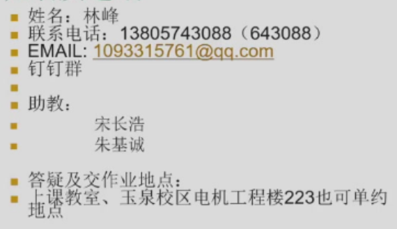

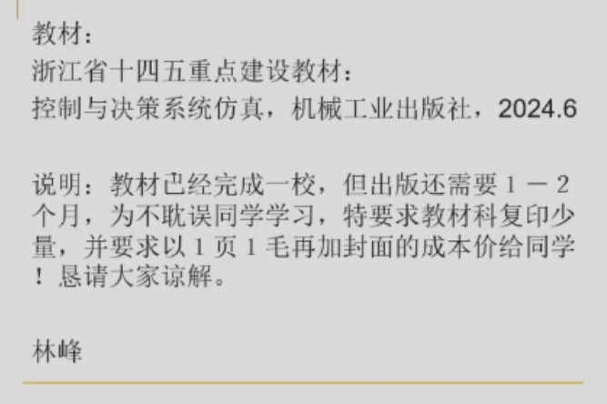

- 实验报告和作业线下交——实验报告中就写作业即可，要发到他的邮箱里面

- 课程报告50%（查重率<15%）+ 平时上机实验（40%）+上课表现（10%）
  - 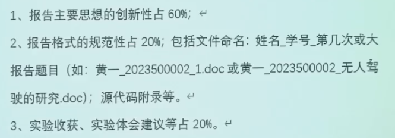
  - 发邮箱
  - 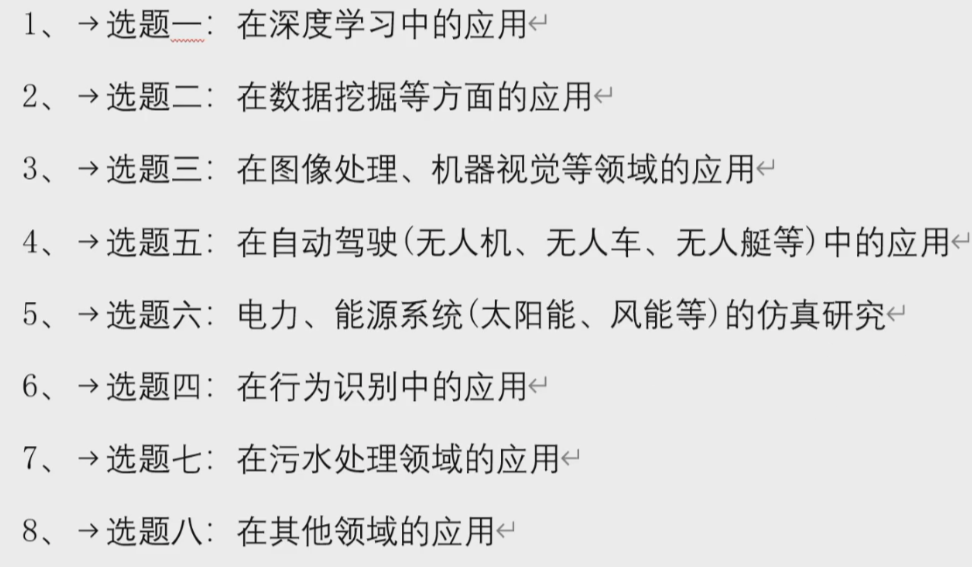
  - 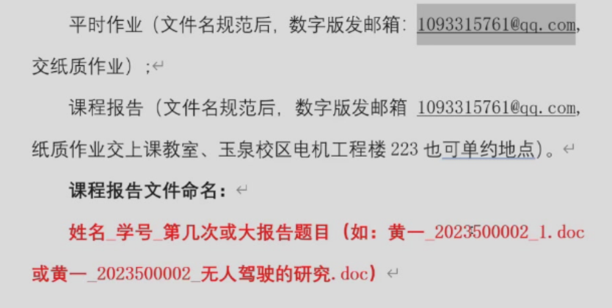
  - 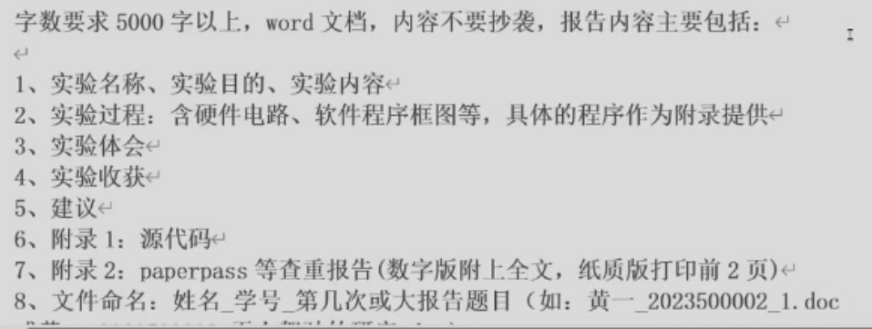
  - 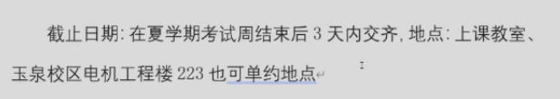

# Matlab基础

# Simulink

非线性仿真无敌

[Simulink仿真入门](https://mp.weixin.qq.com/s?__biz=MzA4NTM0Mzg5Nw==&mid=2247484671&idx=1&sn=5a33f9a2280e50c639b633e912bd5b8c&scene=19&token=46625227&lang=zh_CN#wechat_redirect)

主要的仿真环节库有：

- 控制系统工具箱(Control System Toolbox)

- 通信模块工具箱(Communications Blockset)

- 数字信号处理模块工具箱(DSP Blockset)

- 非线性控制模块工具箱(NCD Blockset)

- 定点处理模块工具箱(Fixed-Point Blockset)

- 状态流(StateFlow)

- 系统辨识模块工具箱(System ID Blocks)

- 神经网络模块工具箱(Neural Network Blockset)

- 模糊逻辑工具箱(Fuzzy Logic Toolbox)

> saturation饱和

- simulink基础库
  - Sinks显示
  - user-defined functions自定义——S函数，自己用matlab/C/C++等编写的模块

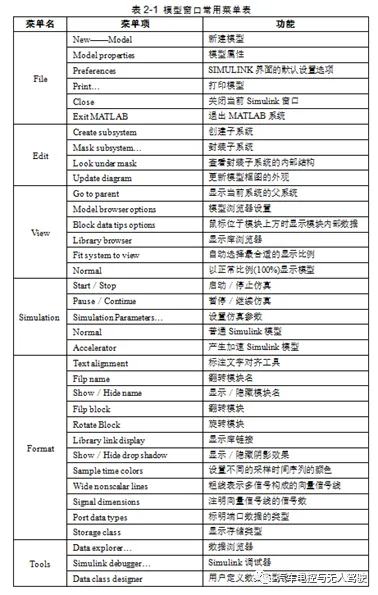

## 基础模块

- Gain

- Scope

- Intergrator

- S函数：有系统传递函数求出系统运动方程

  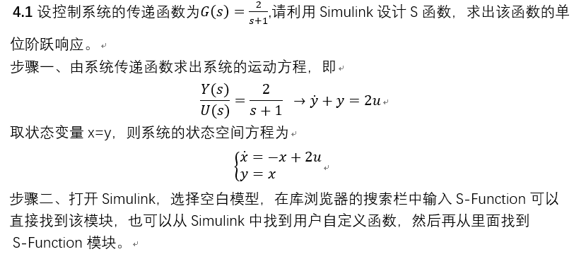

# 控制系统仿真

分子（Numerator） 分母（Denominator）

闭环控制closed-loop control 开环控制open-loop control

饱和 Saturation

## 时域

- Matlab中提供了一个**lsim()**函数可以求解和绘制任意输入函数的系统时间响应
- 对于离散时间的控制系统(或称采样控制系统),MATLAB同样提供了相应的**dstep()**、**dimpulse()**、**dlsim()**函数求解其单位阶跃响应、单位脉冲响应和任意函数的激励响应

## 频域

在MATLAB环境下求解系统的幅频特性和相频特性时，经常要用到**polyval()**函数。其基本调用个数为：

```
Y=polyval(P,X)
```

其中P是多项式系数，X是自变量，Y是求得的返回值。

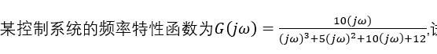

```
G = polyval(num,sqrt(-1)*wt)./polyval(den,sqrt(-1)*wt);
```

- Bode图

  MATLAB提供了bode()函数可以求解和绘制系统的Bode图，以及提供了一条函数margin()可以求解系统的增益裕量和相角裕量

# MATLAB文件和数据访问

## 基本文件操作

## MS Office相关操作

## python相关操作

# 智能算法

## 模糊控制及应用

[模糊数学的思想及应用](https://zhuanlan.zhihu.com/p/404554380)

### 概述

模糊数学领域主要有三种用途，第一是模糊识别，即识别未知样本的所属归类，第二是模糊聚类，可以无监督地将样本动态聚成多类，第三是模糊综合决策，主要是一些方案的评价、样本的优劣评价等

用隶属函数来表述模糊集合

> 经典集合理论中一个元素对一个集合的隶属度只能取0或1

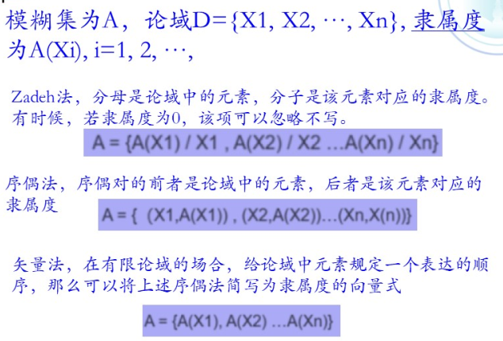

> X称为A的论域，$\mu_A(x)$称为A的隶属函数，其函数值为隶属度，如果隶属度为0.5表明此时的x是模糊集A的过渡点，是最具模糊的点，如果$\mu_A(x) = \{0,1\}$​，A则就是普通集
>
> example:
>
> 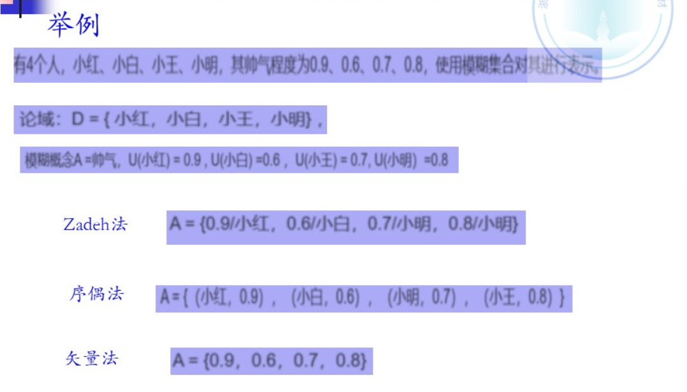

隶属函数：表示模糊集合的数学函数，表示元素属于某模糊集合的“真实程度”

### 模糊控制

无需依赖被控对象数学模型、鲁棒性强

一般包括四个主要部分：模糊化、知识库、模糊推理、去模糊化

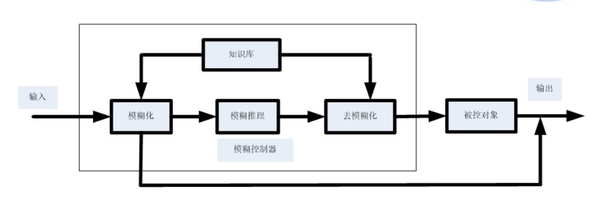

常以$E,\Delta E$作为输入

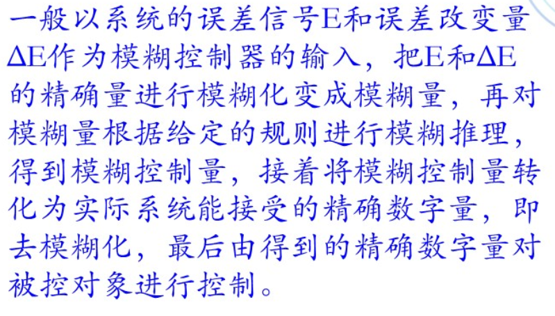

### 模糊推理

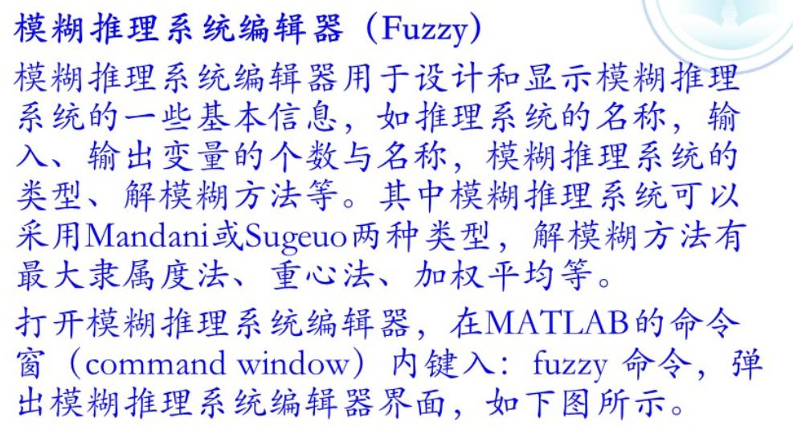

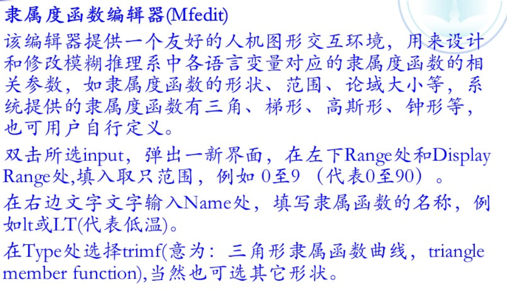


## 遗传算法

[遗传算法入门详解](https://zhuanlan.zhihu.com/p/100337680)

### 概述

遗传算法（Genetic Algorithm，简称GA）

遗传算法（Genetic Algorithm，简称GA）起源于对生物系统所进行的计算机模拟研究，是一种**随机全局搜索优化**方法，它模拟了自然选择和遗传中发生的**复制**、**交叉**(crossover)和变异(mutation)等现象，从任一初始种群（Population）出发，通过随机选择、交叉和变异操作，产生一群更适合环境的个体，使群体进化到搜索空间中越来越好的区域，这样一代一代不断繁衍进化，最后收敛到一群最适应环境的个体（Individual），从而求得问题的优质解

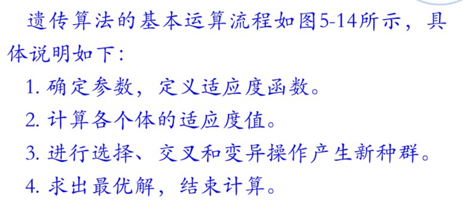

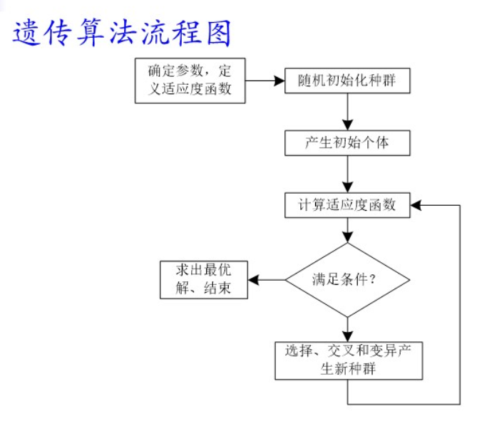

三个基本遗传算子：选择(selection)，交叉(crossover)，变异(mutation)

- 选择：**选择操作从旧群体中以一定概率选择优良个体组成新的种群，以繁殖得到下一代个体。**个体被选中的概率跟适应度值有关，个体适应度值越高，被选中的概率越大。
- 交叉：**交叉操作是指从种群中随机选择两个个体，通过两个染色体的交换组合，把父串的优秀特征遗传给子串，从而产生新的优秀个体。**
- 变异：（防止陷入局部最优解）**在实际应用中，主要采用单点变异，也叫位变异，即只需要对基因序列中某一个位进行变异，以二进制编码为例，即0变为1，而1变为0**。

**需要注意的是：**

遗传算法有4个运行参数需要预先设定，即

$M$ ：种群大小

$T$ ：遗传算法的终止进化代数

$P_c$ ：交叉概率，一般为0.4~0.99

$P_m$ ：变异概率，一般取0.001~0.1

### 算法案例

## 人工鱼群算法

人工鱼群算法(Artificial Fish Swarm Algorithm，AFSA)

[干货 | 人工鱼群算法 超详细解析](https://zhuanlan.zhihu.com/p/100920122)

**(1)觅食行为：**一般情况下鱼在水中随机地自由游动,当发现食物时,则会向食物逐渐增多的方向快速游去。

**(2)聚群行为:** 鱼在游动过程中为了保证自身的生存和躲避危害会自然地聚集成群，鱼聚群时所遵守的规则有三条：

**分隔规则：**尽量避免与临近伙伴过于拥挤;

**对准规则：**尽量与临近伙伴的平均方向一致;

**内聚规则：**尽量朝临近伙伴的中心移动。

**(3)追尾行为：**当鱼群中的一条或几条鱼发现食物时,其临近的伙伴会尾随其快速到达食物点。

**(4)随机行为：**单独的鱼在水中通常都是随机游动的，这是为了更大范围地寻找食物点或身边的伙伴。


### 参数

人工鱼群算法有5个基本参数：**群规模N、人工鱼的视野Visual、步长Step、拥挤度因子δ、重复次数Trynumber。**

## 蚁群算法

自然启发式算法(蚁群算法)

蚁群算法（Ant Colony Optimization, ACO）是一种启发式算法，灵感来自于观察蚂蚁在寻找食物时的行为。

在蚁群算法中，一群虚拟蚂蚁通过在解空间中随机移动和释放信息素，来解决优化问题。其基本思想是模拟蚂蚁在实际环境中的行为，并利用信息素的正反馈机制实现全局搜索和局部搜索的平衡。

蚁群算法的主要步骤包括：

1. **初始化**：初始化虚拟蚂蚁的位置，并初始化信息素的分布。
2. **路径选择**：蚂蚁在解空间中根据一定的策略（通常是概率策略）选择下一步要前往的位置。
3. **更新信息素**：当所有蚂蚁完成路径选择后，根据它们的路径质量更新信息素的分布。
4. **信息素挥发**：为了防止信息素浓度过高导致早熟收敛，需要适时挥发信息素。
5. **迭代**：重复执行步骤2至步骤4，直到达到迭代终止条件（例如达到最大迭代次数或达到问题特定的停止条件）。

蚁群算法主要应用于求解组合优化问题，如旅行商问题（TSP）、调度问题、路径规划等。其优点包括对于高维、非线性、非凸优化问题的较好适用性，以及对局部搜索和全局搜索的平衡能力。

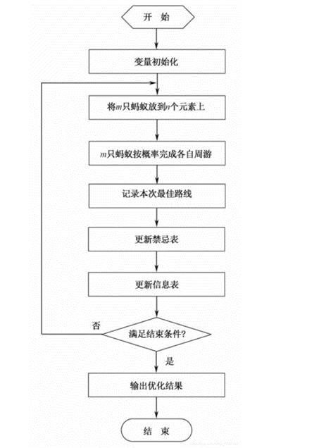

各参数含义

1. **m**：这里代表蚂蚁的数量。
2. **Alpha**：Alpha是信息素在路径选择中的重要程度参数，它影响着蚂蚁选择下一步路径时对信息素浓度的重视程度。
3. **Beta**：Beta是启发函数在路径选择中的重要程度参数，它影响着蚂蚁选择下一步路径时对启发信息的重视程度。
4. **Rho**：Rho是信息素挥发率，它控制着信息素在更新过程中的挥发速度。例如Rho被设置为0.1，表示每次更新后信息素的挥发率为10%，即信息素在更新后只有原来的90%。
5. **G**：G表示算法的迭代次数或者迭代终止条件。
6. **Q = 100**：Q是信息素增量参数，用于确定每只蚂蚁在路径上释放的信息素量。在例如Q被设置为100，表示每只蚂蚁在路径上释放100的信息素。

# 基于MATLAB的数据挖掘

## 概述

- 数据准备：整合成数据集
- 规律寻找
- 规律表示

> 标定数据集是指用于相机或其他传感器系统参数校准的数据集合。在计算机视觉和机器学习领域，标定数据集通常包含一组带有已知参数或特征的图像或数据，用于训练和验证相机或其他传感器的校准算法。

## 数据挖掘基础

[数据科学最常用流程CRISP-DM](https://cloud.tencent.com/developer/article/1557101)

1. 定义问题
2. 建立数据挖掘库：数据手机、数据描述
3. 分析数据：目的是找到对预测输出影响最大的数据字段
4. 准备数据：选择变量、选择记录、创建新变量、转换变量
5. 建立模型
6. 评价模型
7. 实施

## 分类

学习阶段+分类阶段

## 聚类

KNN

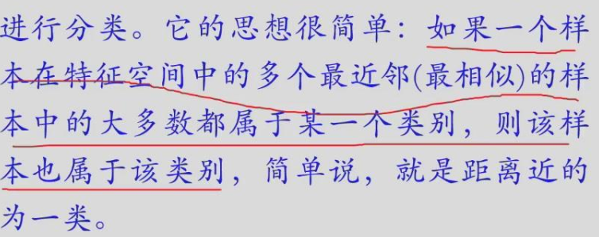

无监督学习方法

- 基于划分
- 基于层次

## 关联

## 支持向量机（SVM）

支持向量机（support vector machines, SVM）是一种二分类模型，它的基本模型是定义在特征空间上的**间隔最大的线性分类器**，间隔最大使它有别于感知机；SVM还包括**核技巧**，这使它成为实质上的非线性分类器。SVM的的学习策略就是间隔最大化，可形式化为一个求解凸二次规划的问题，也等价于正则化的合页损失函数的最小化问题。SVM的的学习算法就是求解凸二次规划的最优化算法。

[支持向量机（SVM）](https://www.zhihu.com/tardis/zm/art/31886934?source_id=1005)

# 基于MATLAB的图像处理

## 基础

- 2D实数矩阵$f(x,y)$——二值化图像/灰度图像
- 图像常见数字编码：位图和矢量
- 图像拓扑
- 邻域
- 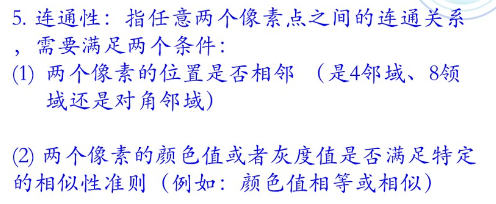

### 图像类型及转换

- 二值图像
- 索引图像
- 灰度图像
- 真彩色图像

## 图像变换

形态学

图像腐蚀和膨胀：[图像腐蚀与图像膨胀](https://blog.csdn.net/zaishuiyifangxym/article/details/89790469)

开运算和闭运算：[图像开运算与图像闭运算](https://blog.csdn.net/zaishuiyifangxym/article/details/89791458)

- 开运算：先腐蚀后膨胀——可以去除噪声，并保留原有图像
- 闭运算：先膨胀后腐蚀——有助于关闭前景物体内部的小孔，或物体上的小黑点

- 图像梯度运算：**图像梯度运算**是膨胀图像减去腐蚀图像的结果，得到图像的轮廓

## 图像增强

- 图像空间域增强
  - 添加噪声
  - 空间域滤波
  - 图像锐化
- 频域增强
  - 快速傅里叶变换和逆变换

## 图像特征提取

# 深度学习

# 界面设计及嵌入式仿真
