# Main Takeaway

大水课

系统建模、控制、优化的拓展

整体与分层递阶的大系统方法

<!--more-->

# Lec 1 Intro

智能互联时代的制造业

- 制造业的发展史
  - **四次工业革命**
    - **工业1.0**（18世纪末）：蒸汽动力机械化生产，工厂取代手工作坊（如纺织机、蒸汽机）。
    - **工业2.0**（19世纪末）：电力驱动流水线生产，标准化和批量生产（如辛辛那提屠宰场生产线）。
    - **工业3.0**（20世纪70年代）：电子与IT技术推动自动化（如PLC控制器）。
    - **工业4.0**（21世纪初）：CPS（信息物理系统）实现网络化、智能化和虚实融合生产。
  - **关键技术变革**
    - 从机械动力→电力→信息技术→智能互联（人工智能、云计算、大数据）
  - 生产方式变革：客户化定制，智能制造
- 制造模式的变革
  - **演进阶段**
    - 手工作坊→大规模制造→精益制造→柔性制造→敏捷制造→智能制造。
    - **特点变化**：从定制化→标准化→多品种小批量→快速响应→智能决策。
  - **长尾制造**
    - 未来趋势是大规模生产、大规模定制和个性化定制并存，满足多样化需求
- 制造系统的发展
  - **CIMS（计算机集成制造系统）**
    - 集成经营、技术、人/机构三要素，实现信息流、物流、价值流融合。
    - 包含数据库、网络、生产管理、质量保证等分系统。
  - **智能制造系统**
    - 基于CPS的层级架构：智能装备→智能车间→智能企业→智能供应链→智能制造生态系统。
    - 核心技术：工业物联网、机器人、人工智能、大数据、云技术等

全球智能制造战略对比

| **战略**           | **核心内容**                                                 |
| ------------------ | ------------------------------------------------------------ |
| **德国工业4.0**    | - 智能工厂、智能生产、智能物流、智能服务。- 纵向集成（设备到企业）、横向集成（供应链）、端到端集成（全价值链）。 |
| **美国工业互联网** | - 通过物联网、大数据、AI优化工业流程。- 聚焦设备互联、数据分析和智能决策（如GE Predix平台）。 |
| **中国制造2025**   | - 信息化与工业化深度融合，十大重点领域（如高端装备、新材料）。- 推动智能制造示范工程和工业互联网平台。 |

------

关键技术支撑

1. **CPS（信息物理系统）**
   - 其核心是3C（Computing、Communication、 Control）的融合
   - 实现物理设备与虚拟网络的深度融合，支持实时感知、动态控制和信息服务。
   - 应用：智能工厂、预测性维护、自适应生产。
2. **工业互联网平台架构**
   - **边缘层**：设备数据采集与协议解析。
   - **平台层**：大数据分析、AI模型训练、微服务开发。
   - **应用层**：智能生产、供应链优化、个性化服务。

------

未来趋势

1. **智能化生产**：全生命周期数据驱动，从设计到服务的闭环优化。
2. **协同化生态**：企业、供应链、客户多方协同（如众包设计、云制造）。
3. **绿色可持续**：通过智能技术降低能耗和资源浪费。

# Lec 2 智能制造支撑技术

## 增材制造技术

- 是什么：增材制造（Additive Manufacturing，AM）俗称3D打印

  > 等材制造：仅发生形状的变化，质量基本没有发生变化
  >
  > 减材制造：材料不断减少

- 原理：增材制造技术是指基于**离散-堆积原理**，由零件三维数据驱动直接制造零件的科学技术体系。

- 常用材料

  - 常用塑料：塑料是指以树脂为基础原料，加入各种添加剂，在一定温度、压力下可塑制成型，在常温下能保持其形状不变。

    1.尼龙
    2.聚苯乙烯 3.多色树脂 4.半透明树脂
    5.聚乳酸 (聚丙交酯，PLA)
    6.丙烯腈-丁二烯-苯乙烯共聚物ABS 7.光敏树脂
    8.PC材料、PC-ISO材料、PC-ABS材料

  - 常用金属材料：直接用金属粉末烧结成型三维零件

    1.不锈钢 2.铁镍合金
    3.钴铬钼超耐热合金CobaltChromeMP1 4. CobaltChrome SP2
    5.钛合金 6.铜合金

  - 其他材料

    1.彩色石膏材料2.建筑材料 3.食品材料 4.生物材料

- 系统组成

  - 软件：建模软件/数据处理软件/设备控制软件
  - 硬件：3D打印机

- 主要流程

  ```mermaid
  graph TD
      A[计算机建模软件进行建模] --> B[数据传输到3D打印机并设置参数]
      B --> C[逐层打印材料]
      C --> D[层间粘合成型]

      C -->|打印参数| E[截面厚度约100μm]
      C -->|材料规格| F[颗粒尺寸50-100μm]

      style A fill:#f9f,stroke:#333
      style B fill:#ccf,stroke:#333
      style C fill:#cff,stroke:#333
      style D fill:#cfc,stroke:#333
  ```

  下面我们来详细看一下每个流程

  1. 产品三维模型的构建

     - 三维软件建模
     - 扫描仪扫描实物获得模型
     - 拍多角度照片转成模型数据

  2. 打印模型格式的生成

     将模型文件转换为标准的STL文件格式，建立了建模软件和3D打印机之间协作的通道由一系列的三角形面片近似模拟物体表面，三角面越小，其生成的表面分辨率越高。

  3. 对三维模型的切片处理

     成型方向的确定

  4. 成型加工

  5. 零件后处理

     取出成型件，进行打磨、抛光、喷涂等操作

- 材料面临的问题：

  理论上所有材料都可以用于3D打印，但实际上能用的材料十分有限，对各种性能要求高

## 工业机器人

- 组成：三大部分六个系统

  三大部分

  - 机械部分 (用于实现各种动作)
  - 传感部分 (用于感知内部和外部的信息)
  - 控制部分 （控制机器人完成各种动作）

  六个系统

  - 驱动系统：提供机器人各部位、各关节动作的原动力。

  - 机械结构系统：完成各种动作。

  - 感受系统：由内部传感器和外部传感器组成。

  - 机器人-环境交互系统：实现机器人与外部设备的联系和协调并构成功能单元。

    指令给定装置+信息显示装置

  - 人机交互系统：是人与机器人联系和协调的单元。

  - 控制系统：是根据程序和反馈信息控制机器人动作的中心。分为开环系统和闭环系统。

  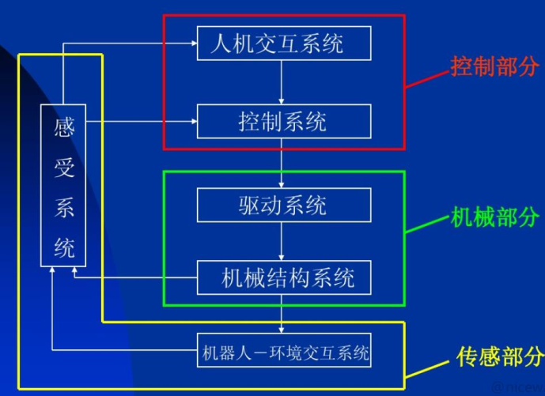

- 应用环境
  - 环境恶劣或危险的场合
  - 特殊作业场合
  - 自动化生产领域

## 物联网技术

物联网Internet Of Things

- 内涵：物联网是一个基于互联网、传统电信网络等信息承载体，让所有能够被独立寻址的普通物理对象实现互联互通的网络；也就是说，在物联网世界，每一个物体均可寻址，每一个物体均可通信，每一个物体均可控制。
- 特性
  - 传感器技术的综合应用
  - 基于互联网的普遍性
  - 智能处理与智能控制能力
- 协议问题

## 射频识别技术

无线射频识别即射频识别技术（Radio Frequency Identification， RFID）

- 组成：标签， 识读器和计算机网络系统

  - 射频标签是射频识别系统中存储可识别数据的电子装置。
  - 识读器将标签中的信息读出，或将标签所需要存储的信息写入标签的装置
  - 计算机网络系统是对数据进行管理和通信传输的设备

- 工作原理：射频识别部分主要由阅读器和应答器两部分组成，阅读器与应答器之间的通信采用无线的射频方式进行耦合，基本原理是利用射频信号或空间耦合实现对物体或商品的自动识别数据存储在电子数据载体（应答器）之中

  阅读器和应答器之间的交互主要靠能量、时序和数据

- ISO/IEC制定的RFID标准可以分为技术标准、 数据内容标准、 性能标准和应用标准4类

- 挑战：成本太高/缺少标准/安全隐私

# Lec 4 产品全生命周期管理

- 定义：产品生命周期（Product Life Cycle），也被称为“商品生命周期”。是指产品从准备进入市场开始到被淘汰退出市场为止的全部运动过程，是由需求与技术的生产周期所决定

  是产品或商品在市场运动中的经济寿命，也即在市场流通过程中，由于消费者的需求变化以及影响市场的其他因素所造成的商品**由盛转衰的周期**

- 典型的产品生命周期一般可分为四个阶段，即进入期、成长期、成熟期和衰退期

  - 进入期
  - 成长期
  - 成熟期
  - 衰退期

  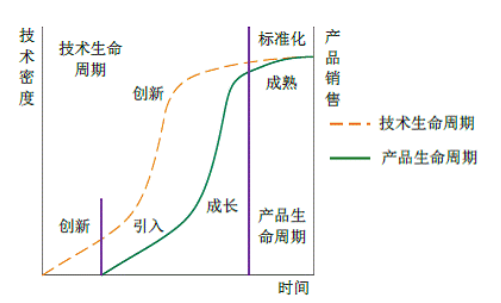

产品生命周期管理（Product Life-Cycle Management），就是指从人们对产品的需求开始，到产品淘汰报废的全部生命历程。 PLM是一种先进的企业信息化思想，它让人们思考在激烈的市场竞争中，如何用最有效的方式和手段来为企业增加收入和降低成本

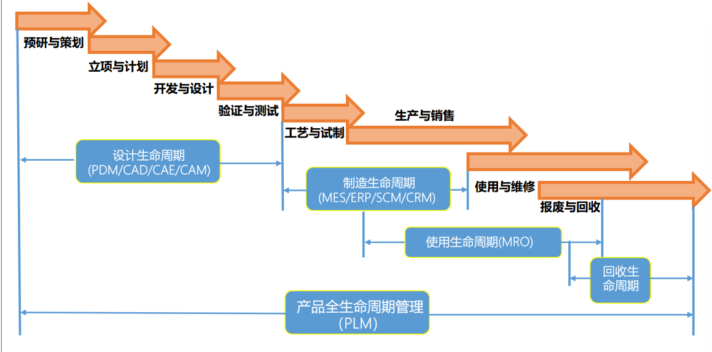

## 数字孪生概念、应用与进程

- 定义：数字孪生模型指的是以**数字化方式**在虚拟空间呈现物理对象，即以数字化方式为物理对象创建虚拟模型，模拟其在现实环境中的行为特征

  数字孪生——是数字模型共有特性和物理实体独有个性实时融合的全生命周期共同体。

- 优势：

  虚拟制造技术（VMT） 在计算机上实现产品整个生命周期的模拟仿真，无需样品制造，优化生产管理和资源规划，实现产品开发周期和成本最小化，产品设计质量的最优化和生产效率最高化

  克服真实空间和虚拟空间的双向沟通较落后的问题，更加强调了物理世界和虚拟世界的连接，统一虚拟世界和真实世界，实现了生产和设计之间的闭环， 可通过3D模型连接物理产品与虚拟产品

- 作用

  - 预见设计质量和制造过程
  - 推进设计和制造高效协同
  - 确保设计和制造准确执行

## 数字孪生模型及其关键技术

- 模型构建

  数字孪生模型核心：全三维基于特征的表述方法，基于三维主模型的过程驱动，融入知识工程和产品标准规范

  产品三维设计

- 虚拟试验

  多物理场仿真技术

  多物理场仿真技术可实现装备从元件到全机的局部和整体相结合的综合分析

- 增强现实

  可视化技术（Visualization Reality）

- 数据挖掘

  实现数据从物理世界到数字世界，并在数字孪生模型中形成知识再反馈到物理世界，对实际物理模型进行优化改进

## 由MBD到MBE过渡与发展

- 基于模型定义（MBD）

  指产品定义的各类信息按照模型的方式组织，其核心内容是**产品的几何模型**，包括所有的几何参数，改变了传统以二维工程图纸为主，三维实体模型为辅的制造方法

- 基于模型的企业（MBE）

  为了更好地使MBD数据在产品的整个生命周期内能够有效充分地进行应用，很多大型装备上、供应商开始研究、验证和应用MBE方法，即基于MBD在整个企业和供应链范围内建立一个集成协同化的环境

西门子MBE系统工程思想

## ISO技术标准与规范

- ASMEY14.4简介

  该标准为基于三维的数字化产品定义设置了基本准则，为三维数据贯穿设计、制造和检测的全方位应用奠定了基础

- ISO16792简介

  该标准是ASME Y14.4的补充，主要内容与ASME Y14.4相同

- GBT24734-2009简介

  相比较ISO 16792标准，添加了几何建模特征规范和模型几何细节层级两部分

# Lec 5 制造过程的APC先进控制——模型预测控制

复杂工业系统特点——耦合，约束

- 常规控制 —— 变量配对、解耦设计、约束卡边
  - 主要采用基于偏差的反馈控制技术，信息利用率不足
  - 将多变量过程作为多个单变量对象加以控制
  - 采用启发式方法，进行过程约束处理
- 先进控制(Advanced Process Control)——预测控制、智能控制

- 模型预测控制

  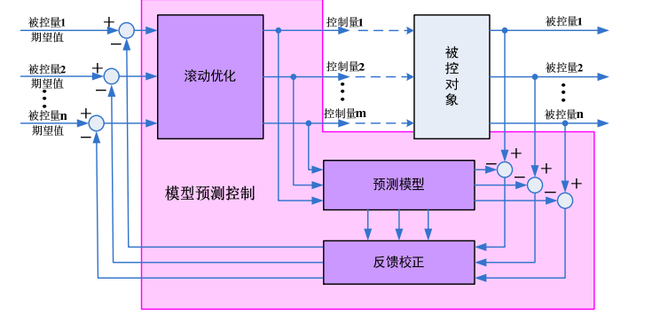

  - 基本原理
    - 预测模型：预测对象未来输出，为确定控制作用提供依据
    - 滚动优化：优化不是一次离线进行，而是反复在线进行
    - 反馈校正：克服模型失配、环境干扰等因素的影响

下面介绍几种模型预测控制

- DMC-基于阶跃响应的动态矩阵控制 Dynamic Matrix Control
- GPC 基于参数模型的广义预测控制 Generalized Predictive Control
- SSC-基于状态空间模型的预测控制 State-Space Predictive Control
- MAC-基于有限脉冲响应的模型算法控制 Model Algorithm Control

## DMC算法

DMC-基于阶跃响应的动态矩阵控制 Dynamic Matrix Control

动态矩阵控制（DMC）是在上世纪80年代提出的一种典型的模型预测控制（MPC）方法。虽然在今天它已经不再是MPC的研究关注点，但其思想却非常值得借鉴，因此几乎所有的模型预测控制教材都把DMC作为一部分来讲解。概括来说，DMC的特点主要有：

- 控制与系统的数学模型无关，仅需获取系统的阶跃响应序列，方法适用于稳定的系统；

- 系统的动态特性中具有纯滞后或非最小相位特性都不影响算法的直接应用。

### 算法原理

- 核心思想：采用阶跃响应序列作为预测模型

  假设对象的单位阶跃响应值为$a_i (i=1,2…)$，且在N个采样周期后趋于平稳，即$a_N\approx a(\infty)$

  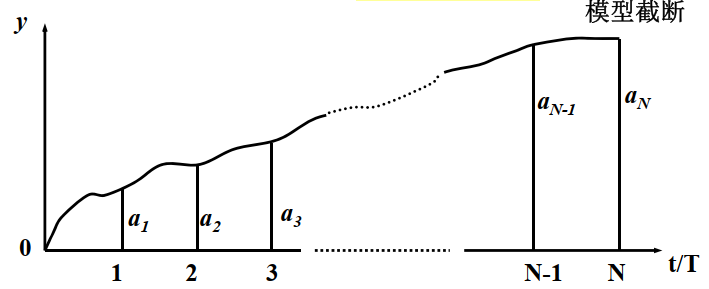

- 适用范围

  - 有限集合$a^T = \{a_1,a_2...a_N   \}$ 中的参数可完全描述系统的动态特性, N称为建模时域（或模型的长度）
  - 渐近稳定对象：保证模型可用有限的阶跃响应序列描述
  - 非参数化模型：应用线性系统的比例和迭加性，预测对象未来输出值

下面进行算法内容介绍：预测模型、滚动优化和反馈校正

- 预测模型

  $\hat{y}_0(k+i/k)$表示在k时刻，假定未来控制作用保持不变的前提下$(Δu(k+j)=0, j≥0)$，对象在$k+i$时刻的输出预测值——预测初值

  > y的下标为控制作用变化的个数，k+i/k表示k时刻对k+i时刻的预测

  假定在k时刻施加一个$Δu(k)$的控制增量之后，其它时刻控制作用不再变化，则未来N个时刻的输出预测值为：
  $$
  \hat{y}_1(k+i/k) = \hat{y}_0(k+i/k) + \hat{a}_i \Delta u(k) \quad i=1,\ldots,N
  $$
  令：

  $$
  \mathbf{Y}_{N1}(k) = \begin{bmatrix} \hat{y}_1(k+1/k) & \hat{y}_1(k+2/k) & \cdots & \hat{y}_1(k+N/k) \end{bmatrix}^T
  $$

  $$
  \mathbf{Y}_{N0}(k) = \begin{bmatrix} \hat{y}_0(k+1/k) & \hat{y}_0(k+2/k) & \cdots & \hat{y}_0(k+N/k) \end{bmatrix}^T
  $$

  向量表示：

  $$
  \mathbf{Y}_{N1}(k) = \mathbf{Y}_{N0}(k) + \mathbf{a} \Delta u(k)
  $$

  $$
  \mathbf{a} = \begin{bmatrix} \hat{a}_1 & \hat{a}_2 & \cdots & \hat{a}_N \end{bmatrix}^T
  $$

  若实施M个连续的控制增量，则预测输出可以用以下这张图来表示

  

  M个连续的控制增量Δu(k), Δu(k+1), ... Δu(k+M-1)作用下，系统在未来P时刻的预测输出（M≤P≤N）
  $$
   \begin{align*}
  \hat{y}_M(k+1/k) &= \hat{y}_0(k+1/k) + \hat{a}_1 \Delta u(k) \\
  \hat{y}_M(k+2/k) &= \hat{y}_0(k+2/k) + \hat{a}_2 \Delta u(k) + \hat{a}_1 \Delta u(k+1) \\
  &\vdots \\
  \hat{y}_M(k+P/k) &= \hat{y}_0(k+P/k) + \hat{a}_P \Delta u(k) + \hat{a}_{P-1} \Delta u(k+1) + \cdots + \hat{a}_{P-M+1} \Delta u(k+M-1)
  \end{align*}
  $$
  令：

  $$
   \mathbf{Y}_{PM}(k) = \begin{bmatrix} \hat{y}_M(k+1/k) & \hat{y}_M(k+2/k) & \cdots & \hat{y}_M(k+P/k) \end{bmatrix}^T
  $$

  $$
   \mathbf{Y}_{P0}(k) = \begin{bmatrix} \hat{y}_0(k+1/k) & \hat{y}_0(k+2/k) & \cdots & \hat{y}_0(k+P/k) \end{bmatrix}^T
  $$

  $$
  \Delta\mathbf{U}_M(k) = \begin{bmatrix} \Delta u(k) & \Delta u(k+1) & \cdots & \Delta u(k+M-1) \end{bmatrix}^T
  $$

  预测方程可以写成向量形式：

  $$
  \mathbf{Y}_{PM}(k) = \mathbf{Y}_{P0}(k) + \mathbf{A}\Delta\mathbf{U}_M(k)
  $$

  $$
  DMC动态矩阵  \mathbf{A} = \begin{bmatrix}
  \hat{a}_1 & & & \\
  \hat{a}_2 & \hat{a}_1 & & \\
  \vdots & \vdots & \ddots & \\
  \hat{a}_M & \hat{a}_{M-1} & \cdots & \hat{a}_1 \\
  \vdots & \vdots & \ddots & \vdots \\
  \hat{a}_P & \hat{a}_{P-1} & \cdots & \hat{a}_{P-M+1}
  \end{bmatrix}_{P\times M}
  $$

  > $P$为优化时域，$M$为控制时域

  现在我们来看一下如何确定各种参数

  如何确定$k+1$时刻的预测初值$Y_{N0}(k+1)$——通过平移的方法

  $Y_{N0}(k+1)$表示在 $  \Delta u(k+1)=0, \Delta u(k+2)=0, \ldots  $ 时$k+2$到$k+N+1$的预测输出序列

  $Y_{N1}(k+1)$表示在 $  \Delta u(k+1)=0, \Delta u(k+2)=0, \ldots  $ 时$k+1$到$k+N$的预测输出序列
  $$
  Y_{N0}(k+1) = S Y_{N1}(k)
  $$

  $  S  $ 为前向移位矩阵：$  S = \begin{bmatrix} 0 & I_{N-1} \\ 0 & 1 \end{bmatrix}  $，仅最后一行末位元素为1

  

  于是我们可以得到预测模型的建立步骤

  1. 预测初始化
     $$
     \hat{y}_0(k+i/k) = y(k) \quad (i=1,\ldots,N)
     $$

  2. k时刻控制增量作用:
     $$
     Y_{N1}(k) = Y_{N0}(k) + \mathbf{\hat{a}} \Delta u(k)
     $$

  3. k+1时刻预测初值更新:
     $$
     Y_{N0}(k+1) = S \cdot Y_{N1}(k)
     $$

- 反馈校正

  时刻 $  t = kT  $ 已计算并施加控制增量 $  \Delta u(k)  $

  时刻 $  t = (k+1)T  $ 的实际输出 $  y(k+1)  $，预测误差 $  e(k+1)  $为
  $$
    e(k+1) = y(k+1) - \hat{y}_1(k+1/k)
  $$

  校正后预测值：
  $$
    Y_{N1}^{\text{cor}}(k+1) = Y_{N1}(k) + \mathbf{h} e(k+1)
  $$

  校正向量 $ \mathbf{h} $，是对不同时刻预测值校正的权重系数
  $$
  \mathbf{h} = \begin{bmatrix} h_1 & h_2 & \cdots & h_N \end{bmatrix}^T
  $$

  更新后的预测初值：
  $$
    Y_{N0}(k+1) = S \cdot Y_{N1}^{\text{cor}}(k+1)
  $$

  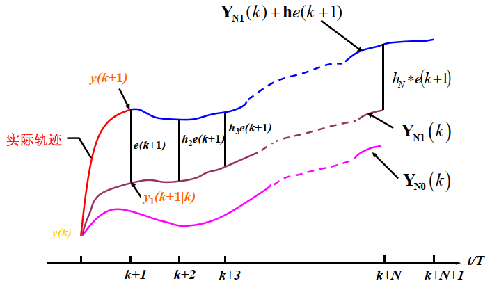

- 滚动优化

  目标函数：确定出未来M个控制增量，使未来P个输出预测值尽可能地接近期望值$w_P$，同时避免控制增量剧烈变化

  $$
  J_k = \sum_{i=1}^{P} q_i \left\| w(k+i) - \hat{y}_M(k+i/k) \right\|^2 + \sum_{j=1}^{M} r_j \Delta u^2(k+j-1)
  $$
  向量形式：

  $$
  J_k = \left\| \mathbf{w}_P(k) - \mathbf{Y}_{PM}(k) \right\|^T \mathbf{Q} \left\| \mathbf{w}_P(k) - \mathbf{Y}_{PM}(k) \right\| + \Delta \mathbf{U}_M^T(k) \mathbf{R} \Delta \mathbf{U}_M(k)
  $$
  参数定义：

  $$
  \begin{aligned}
  &\mathbf{w}_P(k) = \begin{bmatrix} w(k+1) & \cdots & w(k+P) \end{bmatrix}^T \\
  &\mathbf{Q} = \text{diag}(q_1, \cdots, q_P) \quad (\text{误差权矩阵}) \\
  &\mathbf{R} = \text{diag}(r_1, \cdots, r_M) \quad (\text{控制权矩阵}) \\
  &P: \text{优化时域长度} \quad (M \leq P \leq N) \\
  &M: \text{控制时域长度}
  \end{aligned}
  $$

  控制增量序列计算$\frac{\partial J_x}{\partial \Delta U_M(k)} = 0$可得：

  $$
  \Delta \mathbf{U}_M(k) = \left( \mathbf{A}^T \mathbf{Q} \mathbf{A} + \mathbf{R} \right)^{-1} \mathbf{A}^T \mathbf{Q} \left[ \mathbf{w}_P(k) - \mathbf{Y}_{P0}(k) \right]
  $$

  只进行当前时刻控制增量提取，之后的控制量进行滚动优化重新计算：
  $$
  \Delta u(k) = \mathbf{c}^T \Delta \mathbf{U}_M(k) \quad \text{其中} \quad \mathbf{c}^T = \begin{bmatrix} 1 & 0 & \cdots & 0 \end{bmatrix}_{1 \times M}
  $$
  滚动优化实现：

  $$
  \Delta u(k) = \mathbf{d}^T \left[ \mathbf{w}_P(k) - \mathbf{Y}_{P0}(k) \right]
  $$

  $$
  \mathbf{d}^T = \mathbf{c}^T \left( \mathbf{A}^T \mathbf{Q} \mathbf{A} + \mathbf{R} \right)^{-1} \mathbf{A}^T \mathbf{Q}
  $$

  参考轨迹计算公式
  $$
  w(k+i) = y(k) + \left[ r - y(k) \right] \left( 1 - e^{-iT/\tau} \right)
  $$

  > $\tau$是参考轨迹的时间常数

  简化形式

  $$
  w(k+i) = \alpha^i y(k) + \left( 1 - \alpha^i \right) r \quad \text{其中} \quad \alpha = e^{-T/\tau}
  $$
  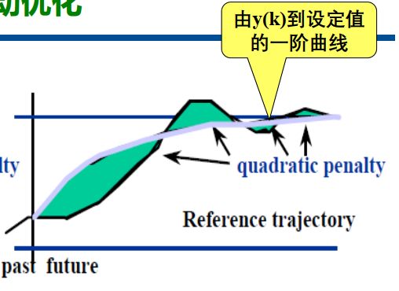

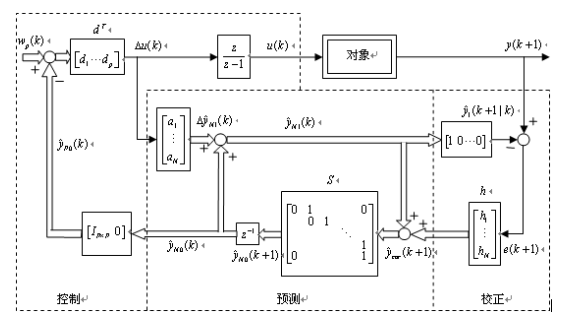

- 算法实现

  - 离线计算

    - 根据对象类型和动态特性，确定采样周期
    - 通过阶跃响应实验，得到模型系数 $a_1, a_2, \ldots, a_N$
    - 通过仿真调优确定参数，即确定优化时域 $P$、控制时域 $M$、权矩阵 $Q$ 和 $R$、校正系数 $h_i$
    - 根据公式，计算向量 $d$

  - 在线计算

    - 初始化模块

      1. 入口

      2. 检测实际输出 $y$，并设置预测初值 $y \to y_{N0}(i), \quad i = 1, 2, \ldots, N$

      3. 计算控制增量
         $$
         \sum_{i=1}^{P} d_i(y_r - y_{P0}(i)) \to \Delta u
         $$

      4. 计算控制量并输出

         $$
         u + \Delta u \to u
         $$

      5. 计算输出预测值 $y_{N0}(i) + a_i \Delta u \to y_{N1}(i) \quad i = 1, 2, \ldots, N$

      6. 返回

    - 在线计算模块

      1. 入口

      2. 检测实际输出 $y$，并计算误差 $y - y_{N1}(1) \to e$

      3. 预测值校正：$y_{N1}(i) + h_i \cdot e \to y_{N1}(i), \quad i = 1, 2, \ldots, N$

      4. 移位设置该时刻预测初值：$y_{N1}(i+1) \to y_{N0}(i), \quad i = 1, 2, \ldots, N-1$

      5. 计算控制增量
         $$
         \sum_{i=1}^{P} d_i(y_r - y_{P0}(i)) \to \Delta u
         $$

      6. 计算控制量并输出：$u + \Delta u \to u$

      7. 计算输出预测值：$y_{N0}(i) + a_i \Delta u \to y_{N1}(i), \quad i = 1, 2, \ldots, N$

      8. 返回

### 参数选择

那么在实际运用中如何确定各个参数呢

1. 采样周期 $T$ 的选择

   满足香农定理

   - 单容对象：$T \leq 0.1T_a$（$T_a$ 为惯性时间常数）
   - 振荡对象：$T \leq 0.1T_e$（$T_e$ 为振荡周期）
   - 滞后对象：$T \leq 0.25T_t$（$T_t$ 为纯滞后时间）

2. 模型长度 $N$ 的选择

   满足 $NT$ 采样周期后阶跃响应接近稳态值确保阶跃响应系数完整包含对象的动态信息

   - 若 $T \downarrow$ 则 $N \uparrow$，$T$ 太小则计算频率加大，在很短的采样间隔内，计算量因 $N$ 增大而增大，影响实时性，特别在有约束情况下；但从抗干扰的要求来讲，$T$ 小些以便快速及时地抑制干扰的影响。
   - $T$ 太大，会丢失一些有用的高频信息，无法构造出连续的时间信号，且使模型不准确，控制品质下降。

   采样周期的选择存在**抗干扰性和实时性**的矛盾，对于过渡时间大的对象尤为突出!

   对于过渡时间大的对象

   1. 建议采用最小化参数模型。
   2. 先用 PID 控制加速其动态后再用 DMC 进行控制。在这种结构下，抗干扰由内部采样频繁的 PID 处理，而在此基础上的 DMC，可采用较大的采样周期的模型参数。

   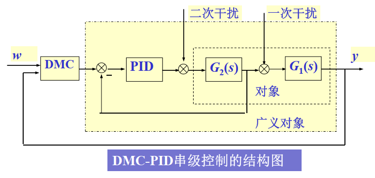

3. 预测时域（P）
   算法优化的未来时间步数，需覆盖系统动态的主要部分。较大的P可提高预测精度，但会增加计算量。

   - 优化时域 $P$ 必须超过对象阶跃响应的时滞部分，或非最小相位引起的反向部分，并覆盖对象的主要动态部分。
   - 通常，$P$ 取在达到对象阶跃响应稳态值 $80\% \sim 90\%$ 的时域范围里。
   - $P$ 小虽然快速性好，但稳定性和鲁棒性差。

   - $P$ 大虽然稳定性好，但动态响应慢，且增加了计算时间，降低了系统实时性。

4. 控制时域（M/Nu）
   优化的控制增量序列长度（通常$M ≤ P$）。

   M 越小：

   - 优点：容易导致稳定的控制，并对模型失配有较好的鲁棒性。
   - 缺点：控制的机动性越弱，优化要求只能在总体上得到平均兼顾。

   M 越大：

   - 优点：控制的机动性越强，有可能改善动态响应。
   - 缺点：因提高了控制的灵敏度，其稳定性和鲁棒性变差。此外，当 M 增大时，增加了计算时间，降低了实时性。

   M的选择应兼顾动态快速性和稳定性

5. 权重因子（λ或r）
   用于平衡跟踪误差和控制增量变化的权重。例如，目标函数中λ增大可抑制控制量剧烈变化，防止超调或振荡。

6. 校正参数（h）

   误差校正向量 $h$ 仅在对象受到未知干扰和存在模型失配，造成预测输出和实际输出不一致时才起作用，而对控制的动态响应没有明显的影响。

   校正参数选择不同的取法，对系统抗干扰性和鲁棒性有着不同的作用：
   - $h_i$ 越小，反馈校正越弱，鲁棒性加强，但对扰动敏感程度下降，抗干扰性差。
   - $h_i$ 越大，反馈校正越强，鲁棒性变差，但对扰动敏感程度加强，抗干扰性强。

   (1) 等值修正：$h_1 = 1, h_i = \alpha \quad i = 2 \cdots N$
   (2) 衰减修正：$h_1 = 1, h_i = \alpha^{i-1} \quad i = 2 \cdots N$
   (3) 递增修正：$h_1 = 1, h_{i+1} = h_i + \alpha^i \quad i = 2 \cdots N$

   校正参数的选择应兼顾鲁棒性和抗干扰性。

7. 误差矩阵Q

   在多变量系统中，Q调整输出误差的权重，R控制增量的惩罚系数。例如，Q增大强调跟踪精度，R增大限制控制量变化幅度
   $$
   Q = \text{diag}(q_1, q_2, \cdots, q_P)
   $$

   权系数 $q_i$ 的大小反映了优化性能指标中不同时刻对预测输出逼近期望值的重视程度。

   对于时滞和因非最小相位特性引起的反向部分，应取为 0，即 $q_i = 0$（$i < N_1$），$N_1$ 表示系统时滞或反向部分。

   一般地：

   $$
   q_i = \begin{cases}
   0 & i < N_1 \\
   \lambda & i \geq N_1
   \end{cases}
   $$

8. 控制增量加权矩阵 $R$
   $$
   R = \lambda \cdot \text{gain}^2
   $$

   控制增量加权矩阵通常选为对角阵：

   $$
   \text{diag}(r_1, r_2, \ldots, r_M)
   $$

   目的：
   1. 对控制增量的剧烈变化加以适度限制，减少对系统过大的冲击。
   2. 改善矩阵 $A^T Q A + R$ 的条件数（Condition Number）。

   理论分析证明：$R$ 对稳定性的影响不是单调的。
   - 对于一阶对象，充分大和充分小的 $R$ 均可导致无振荡的控制，但对于 $R$ 的某一中间区域，被控系统是以振荡形式收敛的。
   - 对于二阶对象，虽然 $R$ 在充分大和充分小时都能得到稳定的控制，但 $R$ 的某一中间区域却会使控制系统振荡发散。

   对 $R$ 的调整，着眼点不应放在控制系统稳定性上，这部分要求通过调整 $P$ 和 $M$ 得到满足。

整定步骤：

预测控制参数整定步骤：

1. 根据对象类型和动态特性确定采样周期，测试相应采样周期下经光滑之后的阶跃响应系数 $a_i$
2. 取优化时域 $P$ 覆盖阶跃响应的主要动态部分，而不要求取到阶跃响应的动态变化结束。初选 $P$ 之后，输出偏差加权系数 $q_i = 0$（时滞和反向部分），$q_i = 1$（其他部分）
3. 对简单动态对象，取控制时域 $M = 1 \sim 2$，对于包括振荡的动态复杂对象，可适当增加 $M$，取 $4 \sim 8$；初选 $R = 0$
4. 计算控制系数 $d_i$，进行仿真，检验控制系统的动态响应。若不稳定或动态过于缓慢，可调整 $P$，直到满意为止
5. 若上述满意控制的控制量变化幅度较大，可加大 $R$ 值
6. 在上述参数的基础上，根据控制要求的侧重点，选择校正参数 $h$，兼顾鲁棒性和抗干扰性的要求

下面来看一个栗子：

> PID参数寻优常用的四种评价，以以下四种适应度指标进行寻优：
>
> 平方误差积分(ISE):
>
> 绝对误差积分(IAE):
>
> 时间乘方误差积分(ITSE):
>
> 时间乘绝对误差积分(ITAE):

### IMC

内模控制（ Internal Model Control ，简称IMC）

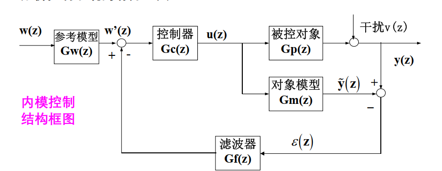

系统的反馈信号：由于引入的内部模型，反馈量变成了扰动的估计量，有利于系统抗干扰性设计，增强系统的鲁棒性

$$
y(z) = \frac{G_c(z)G_p(z)}{1 + G_c(z)G_f[z](G_p(z) - G_m(z))}w(z) + \frac{1 - G_c(z)G_f(z)G_m(z)}{1 + G_c(z)G_f[z](G_p(z) - G_m(z))}v(z)
$$

- 性质一：对偶稳定准则（Dual Stability Criterion）

  若对象模型精确 $(G_m(z) = G_p(z))$，闭环系统稳定的条件是被控对象 $G_p$ 和控制器 $G_c$ 同时稳定。

- 性质二：完全控制器（Perfect Controller）

  对象模型可分解为$G_m(z) = G_+(z)G_{-}(z)$包含纯滞后和单位圆外零点

  在对象稳定且模型准确的前提下，若取控制器为：
  $$
  G_c(z) = \frac{1}{G_{-}(z)}
  $$

  则控制系统对镇定或跟踪控制都具有最小输出方差。

- 性质三：零静差性质（Zero Offset）

  不管模型和对象是否失配，只要闭环系统稳定，且控制器和滤波器满足下列条件：

  $$
  G_c(1) = 1/G_m(1) ,\quad G_f(1) = 1
  $$

  则系统对阶跃输入 $w$ 和常值干扰 $v$ 均不存在输出静差：

  $$
  \lim_{t \to \infty} y(t) =\lim_{z\to 1}(1-z^{-1})y(z) = \\ \lim_{z \to 1} \left( \frac{G_c(z)G_p(z)}{1 + G_c(z)G_f[z](G_p(z) - G_m(z))}w(z) + \frac{1 - G_c(z)G_f(z)G_m(z)}{1 + G_c(z)G_f[z](G_p(z) - G_m(z))}v(z) \right)\\ = w_0
  $$

在了解了内膜控制后，我们来看看DMC算法的内模控制结构分析，其关键就是如何转化为Z域中的IMC结构，下面直接给出结论：

原控制框图如下：


转换后可得：

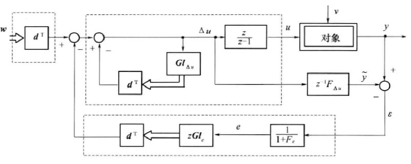
$$
G_m(z) = \frac{z - 1}{z} z^{-1} F_{\Delta u}
$$

$$
G_c(z) = \frac{z}{z - 1} \cdot \frac{d_s}{1 + d^T G l_{\Delta u}}, \quad d_s = \sum_{i=1}^{P} d_i
$$

$$
G_f(z) = \frac{d^T G l_e z}{d_s} \cdot \frac{1}{1 + F_e}
$$

$$
G_w(z) = \begin{cases}
1 & \text{定值控制} \\
\frac{d_1 z + \cdots + d_P z^P}{d_s} & \text{跟踪控制}
\end{cases}
$$

### 有约束DMC算法

二次规划命题 (QP)：

$$
\min_{\theta} \frac{1}{2} \theta^T \Phi \theta + \phi^T \theta
$$

$$
\text{s.t.} \quad \Omega \theta \leq \omega
$$

有约束预测控制算法 $\rightarrow$ 标准的优化命题：（约束）

$$
U_{\min} \leq U_M \leq U_{\max}
$$

$$
\Delta U_{\min} \leq \Delta U_M \leq \Delta U_{\max}
$$

$$
Y_{\min} \leq Y_{PM} \leq Y_{\max}
$$

$$
Y_{PM}(k) = Y_{P0}(k) + A \Delta U_M(k)
$$

$$
\Omega = \begin{bmatrix} B \\ I \\ A \\ -B \\ -I \\ -A \end{bmatrix}, \quad \omega = \begin{bmatrix} U_{\max} - U(k-1) \\ \Delta U_{\max} \\ Y_{\max} - Y_{P0}(k) \\ -(U_{\min} - U(k-1)) \\ -\Delta U_{\min} \\ -(Y_{\min} - Y_{P0}(k)) \end{bmatrix}
$$

然后直接调用二次规划的求解器即可

### 预测控制工业软件

预测控制工业软包通常采⽤两级分层优化结构：

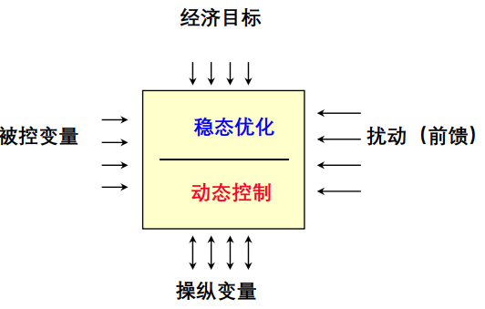

FRONT-Suite多变量先进控制软件包

## 控制性能评价

性能评估:性能好还是差,性能劣化原因是什么

- 确定性指标：上升时间，超调量，衰减比，回复时间

  > 阶跃响应，需要专门做实验，无法利用日常操作数据

- 随机性指标：
  $$
  CPI = \frac{参考基准回路的控制性能}{当前基准回路的控制性能}
  $$

- 基于最小方差基准的性能评估

  Harris性能指标：

  $$
  \eta(d) \triangleq \frac{ \sigma_{mv}^2}{\sigma_y^2} = \frac{\text{Var}(Fe_t)}{\text{Var}(y_t)}
  $$

  它表示最小方差控制（Minimum Variance Control）的输出方差与实际系统的输出方差的比值，处于0~1。越接近1，说明系统控制性能越好！

# Lec 6 生产计划与企业资源计划ERP

> ERP？

最优生产计划与调度问题：

- 经典：运筹学派，MILP混合整数线性优化模型，MINLP

  求解：数学规划算法/智能优化方法

随机规划与场景随机采样优化方法

# Lec 7 生产调度与制造执行系统MES

生产调度：

- 静态调度：主要的决策变量为：各个操作的开始时间， 持续时间、 执行的单元设备， 以及容量
- 动态调度：再调度：处理突发事件

嗲奥杜问题

# 考核

使用建模优化平台 matlab/lingo


- 读书报告：《工业软件简史》，手写400字以内拍照

  看一章即可，知道历史

- hw：在模型预测控制上完后布置

- 课程大作业80-90%夏学期末，PPT答辩，交电子文档期末大作业：
  利用本课程所介绍的控制、优化、调度与计划概念，完成智能制造系统局部问题的调研、建模、分析、求解和报告撰写工作。每组不超过3人
  期末大作业评分包括大作业完成度、大作业结题答辩表现和大作业报告上交材料规范三个方面。

Term Project

> 不做调度（大家都做）


# References

- [求问自动化 智能制造与企业自动化 智能供配电技术 课程 - CC98论坛](https://www.cc98.org/topic/5223153)
- [求问控院的智能制造与企业自动化这门课怎么样 - CC98论坛](https://www.cc98.org/topic/5490739)
