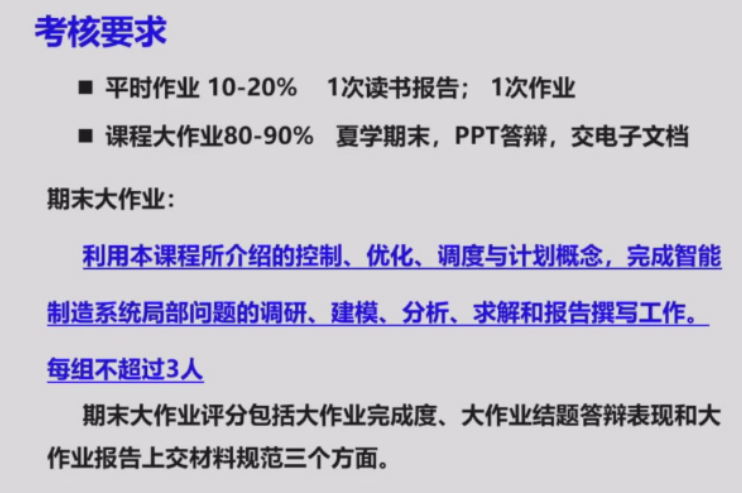
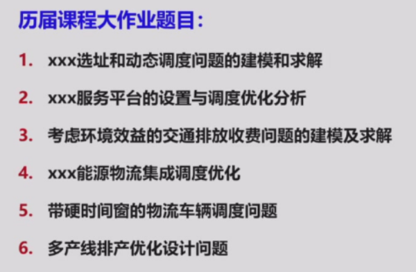

# Main Takeaway

大水课

系统建模、控制、优化的拓展

整体与分层递阶的大系统方法

<!--more-->

# Lec 1 Intro

智能互联时代的制造业

- 制造业的发展史
  - **四次工业革命**
    - **工业1.0**（18世纪末）：蒸汽动力机械化生产，工厂取代手工作坊（如纺织机、蒸汽机）。
    - **工业2.0**（19世纪末）：电力驱动流水线生产，标准化和批量生产（如辛辛那提屠宰场生产线）。
    - **工业3.0**（20世纪70年代）：电子与IT技术推动自动化（如PLC控制器）。
    - **工业4.0**（21世纪初）：CPS（信息物理系统）实现网络化、智能化和虚实融合生产。
  - **关键技术变革**
    - 从机械动力→电力→信息技术→智能互联（人工智能、云计算、大数据）
  - 生产方式变革：客户化定制，智能制造
- 制造模式的变革
  - **演进阶段**
    - 手工作坊→大规模制造→精益制造→柔性制造→敏捷制造→智能制造。
    - **特点变化**：从定制化→标准化→多品种小批量→快速响应→智能决策。
  - **长尾制造**
    - 未来趋势是大规模生产、大规模定制和个性化定制并存，满足多样化需求
- 制造系统的发展
  - **CIMS（计算机集成制造系统）**
    - 集成经营、技术、人/机构三要素，实现信息流、物流、价值流融合。
    - 包含数据库、网络、生产管理、质量保证等分系统。
  - **智能制造系统**
    - 基于CPS的层级架构：智能装备→智能车间→智能企业→智能供应链→智能制造生态系统。
    - 核心技术：工业物联网、机器人、人工智能、大数据、云技术等

全球智能制造战略对比

| **战略**           | **核心内容**                                                 |
| ------------------ | ------------------------------------------------------------ |
| **德国工业4.0**    | - 智能工厂、智能生产、智能物流、智能服务。- 纵向集成（设备到企业）、横向集成（供应链）、端到端集成（全价值链）。 |
| **美国工业互联网** | - 通过物联网、大数据、AI优化工业流程。- 聚焦设备互联、数据分析和智能决策（如GE Predix平台）。 |
| **中国制造2025**   | - 信息化与工业化深度融合，十大重点领域（如高端装备、新材料）。- 推动智能制造示范工程和工业互联网平台。 |

------

关键技术支撑

1. **CPS（信息物理系统）**
   - 其核心是3C（Computing、Communication、 Control）的融合
   - 实现物理设备与虚拟网络的深度融合，支持实时感知、动态控制和信息服务。
   - 应用：智能工厂、预测性维护、自适应生产。
2. **工业互联网平台架构**
   - **边缘层**：设备数据采集与协议解析。
   - **平台层**：大数据分析、AI模型训练、微服务开发。
   - **应用层**：智能生产、供应链优化、个性化服务。

------

未来趋势

1. **智能化生产**：全生命周期数据驱动，从设计到服务的闭环优化。
2. **协同化生态**：企业、供应链、客户多方协同（如众包设计、云制造）。
3. **绿色可持续**：通过智能技术降低能耗和资源浪费。

# 考核

使用建模优化平台 matlab/lingo

- 读书报告：《工业软件简史》，手写400字以内拍照

  看一章即可，知道历史

- hw：在模型预测控制上完后布置

Term Project

> 不做调度（大家都做）

# References

- [求问自动化 智能制造与企业自动化 智能供配电技术 课程 - CC98论坛](https://www.cc98.org/topic/5223153)
- [求问控院的智能制造与企业自动化这门课怎么样 - CC98论坛](https://www.cc98.org/topic/5490739)

