# Main Takeaway

自控基础知识

<!--more-->

# Tips

[自动化（控制）大二春夏学期主修课程总结与经验分享（自动控制理论甲、信号分析与处理、嵌入式系统、机器人导论、数值计算方法、计算机网络原理、运筹学、信息物理系统安全） - CC98论坛](https://www.cc98.org/topic/5671695)

[控院自动控制原理（甲）/自控回忆卷 2022-2023春夏 - CC98论坛](https://www.cc98.org/topic/5644437)

40\~60%(作业0\~10、课堂、小测)+期末（A4可带）

从平时作业的角度，控院的几个平行班每周作业都是一致的，且作业题有答案（鱼塘群里有赵豫红班的PPT和作业答案），完成作业时可以参考，答案解析比较详细，因此学起来还是比较轻松的。关于小测频率（老师称之为课堂练习），控院的几个平行班基本都是一致的（印象中夏学期小测4次，春学期会多一点，整个长学期大概小测了10次？），而且每个班题目也都一样（不包括电院，电院的老师布置的作业题和小测题都和控院有区别）。小测难度感觉适中，平时认真听讲基本都问题不大。

最后谈一谈考试，自控是半开卷考试，可以带一张A4纸，今年是可手写也可打印（但不保证每年都能打印），在98上有学长分享过的一些A4资料可以参考，但还是建议自己整理一下，因为本身整理A4的过程就是复习的过程，复习过程中的最大感受就是自控的难度不大，但是知识点很多，很杂碎，还是需要认真去整理复习的。

[频域法分析系统详解及个人笔记_伯德图是开环还是闭环-CSDN博客](https://blog.csdn.net/qqliuzhitong/article/details/124898827)——一些疑问解答

# 绪论

- 控制系统的基本分类：线性和非线性；恒值和随动；连续和离散
- 基本要求：稳定性；准确性；快速性

> 稳定压倒一切

## 常见输入

- 单位阶跃函数：$1(t),C(s)=L(1(t))=\frac{1}{s}$​

  单位阶跃响应$h(t)$

- 单位脉冲函数：$\delta(t),C(s)=L(\delta(t))=1$​

  单位脉冲响应$k(t)$

- 正弦函数：$r(t)=\sin \omega t~~~~ C(s)=\frac{\omega}{s^2+\omega^2}$

# 控制系统的数学模型

系统模型——性能指标，分析方法：时域法；复域法；频域法

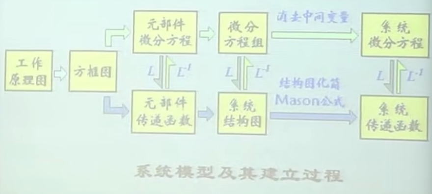


two ways to model a dynamic system

- mechanism modeling（机理建模）
- system identification（系统辨识，黑箱，测试）

控制系统常见的三种数学模型

- 外部描述：输入输出关系（SISO,MIMO），微分方程，传递函数 ...
- 内部描述：状态变量描述（对模型把握更准确）
- 方块图

误差

- 静态误差就是时间t趋于无穷的时候系统响应与给定输入之间的相对偏差，可以通过时域复域之间的中值定理进行求解。

- 动态误差切记不是说研究误差的动态变化，反而它研究的是**静态误差**的动态变化过程！

## 拉式变换

[(7 封私信 / 8 条消息) 傅里叶变换、拉普拉斯变换、Z 变换的联系是什么？为什么要进行这些变换？ - 知乎 (zhihu.com)](https://www.zhihu.com/question/22085329/answer/774074211)
$$
C(s)=L(c(t))=\int_0^\infty c(t)e^{-st}dt
$$

> 具体看复变函数部分(典型要记，性质要记)
>
> 一个信号它增长的速度太快了,而我们却要使用不能够"上天"的正弦函数去拟合它,这不是为难我胖虎么,这个时候,我们就得想起一句名言,要么解决问题,要么解决制造问题的人(信号),既然傅里叶变换无法制造一个同样上天的正弦信号来拟合,我们就把它原本的信号"掰弯",那么如何"掰弯"呢,简单,乘以一个$e^{-\sigma}$就行了——拉式变换

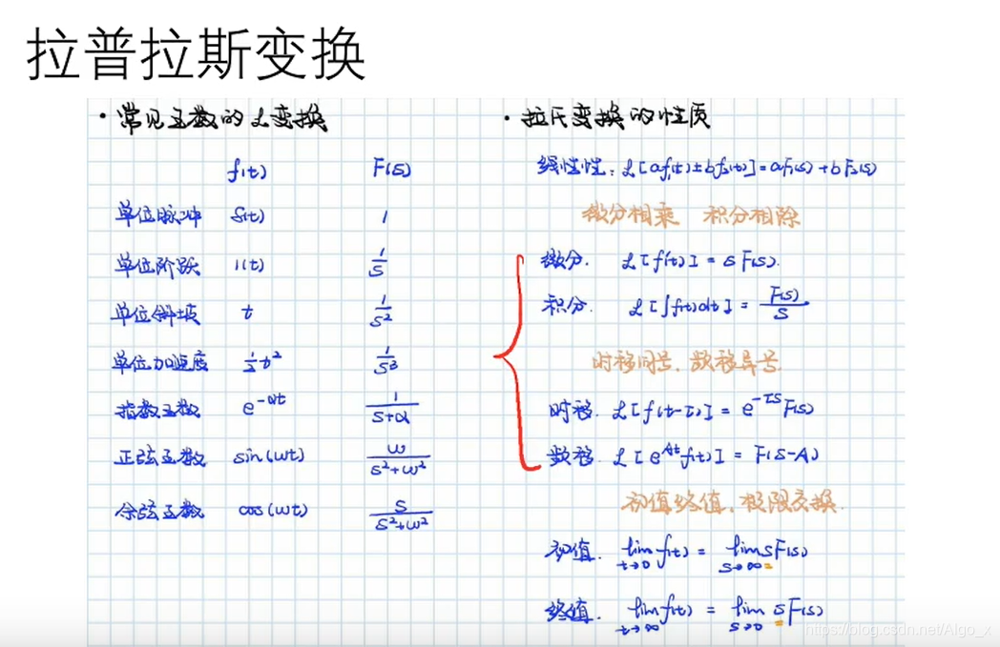

### 拉式反变换

常见有理分式函数的拉式反变换
$$
C(s)=\frac{B(s)}{A(s)}=\frac{b_0s^m+...+b_{m-1}s+b_m}{s^n+...a_{n-1}s+a_n}
$$

> 根据A(s)的根进行拆分，再拉式反变换


> 微分方程$\rightarrow$传递函数，零初始条件下的拉式变换

## 传递函数

> 三个算子：时域的微分算子D、频域的算子$j\omega$、复域的拉普拉斯变换算子$s~(s=\sigma+j\omega)$

**线性定常系统**的传递函数——初始条件为零时，输出量的拉普拉氏变换与输入量的拉普拉氏变换之比$G(s)=\frac{C(s)}{R(s)}=L(K(t)),K(t)为单位脉冲响应$​

> 线性定常系统；单输入/单输出；不反映

- 零极点增益模型


> 考虑到物理可实现问题，分母的阶次n$\ge$分子的阶次m，且所有系数均为实数
>
> 前面k代表传递系数或根轨迹增益

影响系统响应的因素

- 输入$u_r(t)$——$l(t)$​

  > 输入的单位阶跃函数的拉式变换R(s)为$\frac{1}{s}$

- 初始条件——规定0初始条件

- 系统的结构参数——自身决定

### 典型数学模型

线性环节函数的数学模型

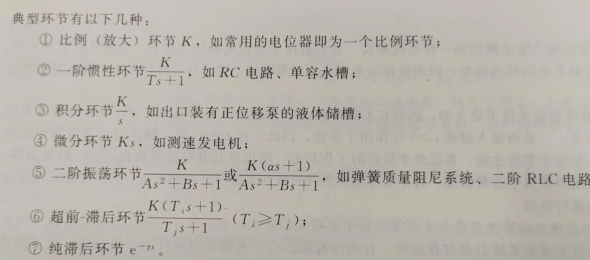

> 任何传递函数都是这些典型环节的结合
>
> 注意负载效应问题——要把环节在什么环境下（即负载）工作考虑进去

### 控制系统的传递函数

闭环下的开环传递函数(R输入,N干扰,E偏差,C输出)

> 都是化为尾一标准形式

定义此系统的闭环传递函数有四种：
输入R(s)对输出C(s)，输入R(s)对偏差E(s)，扰动N(s)对输出C(s)，扰动N(s)对偏差E(s)。


## 方块图,信号流图

1，掌握由原理图，微分方程转换结构图

2，结构图的变换规则

3，结构图的化简（需要练习）

有向

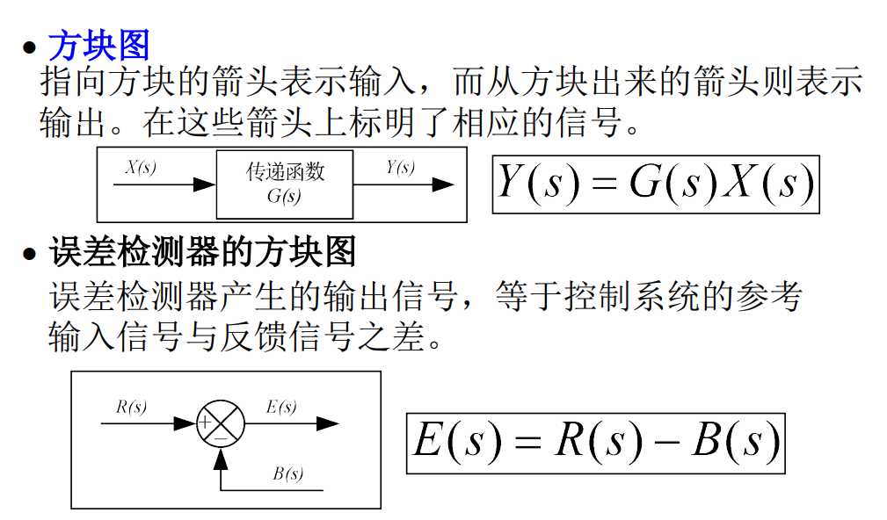

- 前向通道
- 回路通道

### 方块图化简

简化：

- 汇合点前移，输出点前移，输出点后移，等效为单位反馈
- 前向通道中传递函数的乘积必须保持不变
- 回路中传递函数的乘积必须保持不变

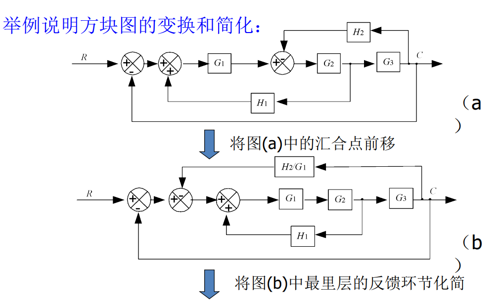

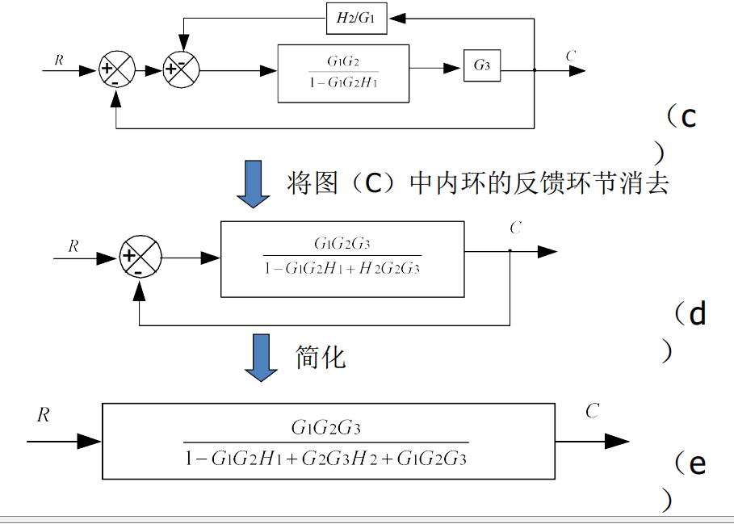

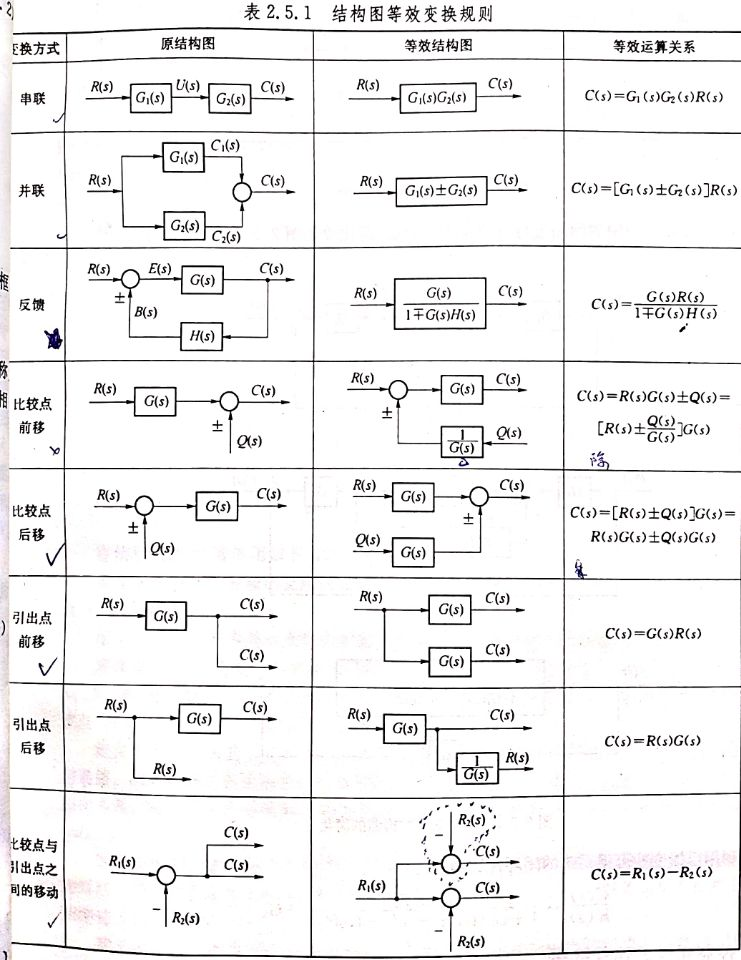

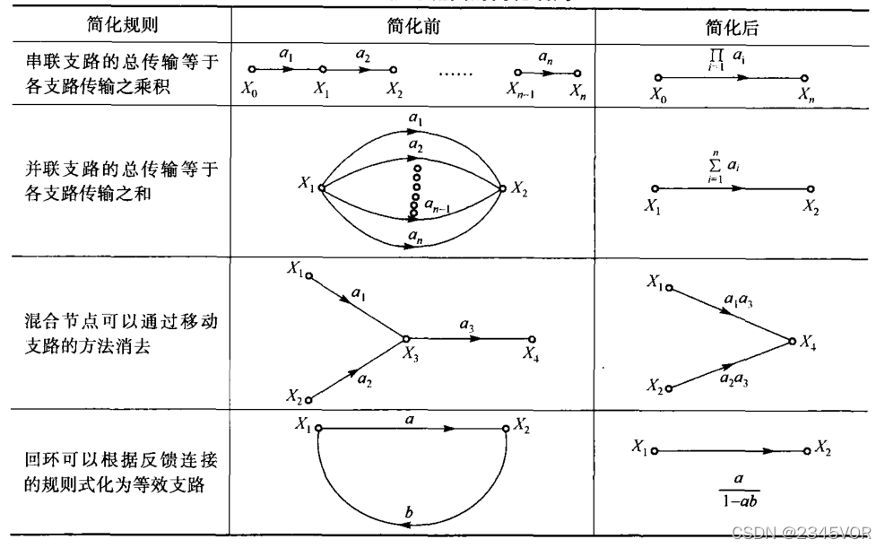

信号流图：和结构图等价

## Mason公式

Mason增益公式——有结构图直接写出传递函数
$$
G(s)=\frac{1}{\Delta}\sum P_k\Delta_k
$$


> 主要是计算特征式——即找回路！

## 状态空间

[状态空间模型与传递函数的转换关系+例题_状态空间模型转化为传递函数](https://blog.csdn.net/sheagu/article/details/114310271)

内部描述；状态，状态向量——状态空间，状态轨迹

状态变量的**最小**数量=系统中**独立**储能元件数量

一般State variables representation (状态空间表达式)：
$$
\dot x=f(x(t),u(t),t)\\
y=g(x(t),u(t),t)\\
$$
线性定常系统的状态空间模型：

state equation：状态变量与输入变量的关系
$$
\dot x(t)=Ax(t)+Bu(t)
$$
output equation：输出变量与状态变量、输入变量的关系
$$
y(t)=Cx(t)+Du(t)
$$


> 其中
>
> - A系统矩阵
> - B输入矩阵
> - C输出矩阵
> - D前馈矩阵
>
> 若D=0则为惯性系统；若$D\ne 0$为非惯性系统，意味着输入变量与输出变量有直接关联

- 传函分子为1

  

- 传函分子不为1

  

  

# 线性系统的时域分析

[自动控制原理_卢京潮_线性系统的时域分析与校正_学习笔记_调节时间怎么看图得出-CSDN博客](https://blog.csdn.net/mahoon411/article/details/112757589)

## 静态性能指标

- 快：调节时间，动态性能

- 稳：稳定性

- 准：稳态误差

### 稳定性

- **稳定性**：是由分母特征方程是决定的——要求系数全为正数才有稳定的可能

  线性系统稳定的充分必要条件：特征方程式的所有根均为负实根或其实部为负的复数根，即特征方程式的根均在复数平面的左半部分。

  如果特征方程在复平面的右半平面上没有根，**但在虚轴上有根**，则可以说该线性系统是**临界稳定**的，系统将出现等幅振荡


**传递函数极点在复平面左半平面系统稳定，在虚轴上临界稳定，在右半平面不稳定**

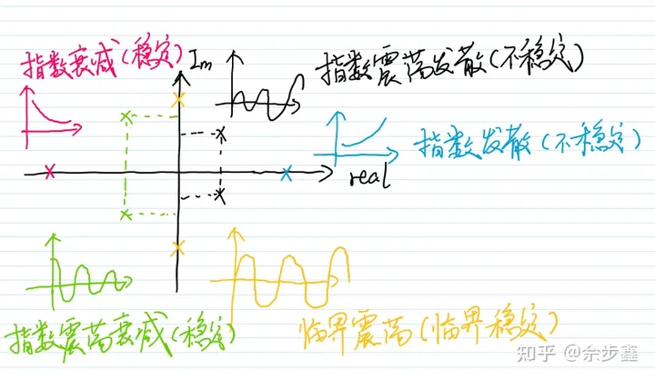

#### 劳斯判据

- 劳斯判据——对于高阶系统，直接求解极点比较费事，因此劳斯（E.J.Routh）在1877年提出了劳斯判据。劳斯判据是一种借助**特征方程系数/劳斯表**来辅助判断根正负的方法，这里的**根**即**传递函数的极点**。

  [（十三）判断稳定性：劳斯判据 - 知乎 (zhihu.com)](https://zhuanlan.zhihu.com/p/355436161)

  > “劳斯判据（特征方程系数/劳斯表）→ 方程根的正负 → 传递函数极点 → 扰动的时域响应 → 稳定性”

  - 根据特征方程列写劳斯表

    

    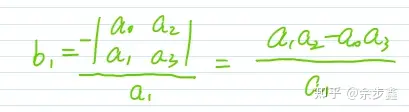

    借助行列式更方便记忆，每元素来自上两行，将第一列元素配上右上方元素，构成行列式，最后除以上一行的第个元素

  - 根据劳斯表判断稳定性

    - 方程各项系数全部为正值 and 第一列所有系数为正，则根都在复平面左半平面，系统稳定；

      > 这时，劳斯判据指出，系统极点实部为正的根的数目等于劳斯表中第一列的系数**符号改变的次数**（如中间有一个负数，则符号改变两次）

    - 第一列有符号变换，变化的次数等于复平面右办平面根的个数，系统不稳定。

    使用劳斯判据时会有两个特例：

    - Case 1: 某行第一个元素是0，但后面元素不全是0。处理方法：用一个很小数代替0，接着往下算。

      > 若只有第一列系数是0，没有其他项，也属于case 1

    - Case 2: 某行全是0——在*s*平面内存在一些**大小相等符号相反的实极点**(看第一列符号有没有改变)和（或）一些**共轭虚数极点**

      处理办法：用不为零的最后一行的系数构造多项式（式中s均为偶次），对s求导后替代全0行的元素，接着往下算。

      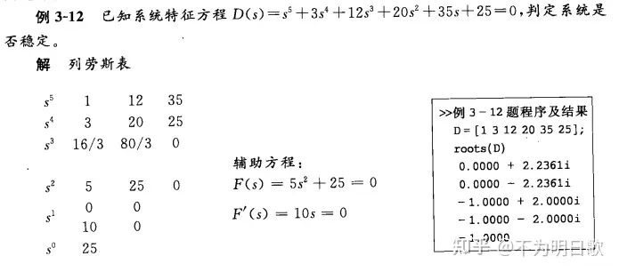

    拓展：根据第一列元素为正判断控制器参数的范围

所有那些数值相同但符号相异的根，均可由辅助方程求得

#### 赫尔维兹判据

- 赫尔维兹判据（Hurwitz）

  分析6阶以下系统的稳定性

  

  特征方程变为行列式——判断各阶主子式均大于零

  

  > 最高项是几次幂矩阵就是几阶

#### 系统的型

一个m型的系统能够以零稳态误差跟踪形式为$t^{m-1}$的输入信号；对于$t^m$形式的输入信号稳态误差为有限常数；对于对于$t^{m+1}$形式的输入信号稳态误差为$\infty$

#### 消除/减小误差

- 提高系统开环增益，即增加比例作用

- 提高系统的型别，即增加系统前向通道中积分环节的个数

  > 可能会使系统的稳定性变差

- 复合控制：在反馈的基础上加上前馈来减小稳态误差

### 等效单位负反馈

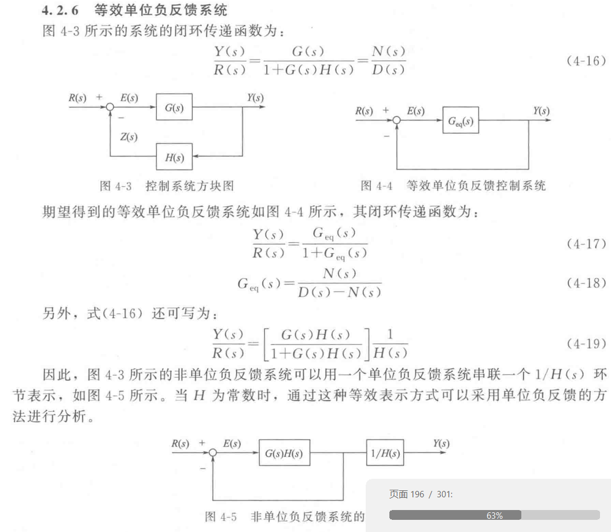

### 临界增益

系统的临界增益Kc是指当系统处于临界稳定状态时，其开环增益的值。临界稳定状态是指系统处于稳定和不稳定之间的边界状态，此时系统的特征方程具有**共轭纯虚根**

> 临界增益Kc是系统设计中的一个重要参数，因为它决定了系统在稳定和不稳定之间的边界。如果系统的开环增益小于临界增益Kc，那么系统将是稳定的；如果开环增益大于临界增益Kc，那么系统将是不稳定的

- 确定系统开环传递函数

- 计算特征方程——代入$s=\pm j\omega$​

- 计算得$\omega$​,带回去得到Kc

  > 判断是否对应临界稳定状态

- 或者算出稳定范围，边界即为临界增益Kc

- 这是有一列首项变为0，根据这一列构造辅助方程，求出来的s解即为无阻尼振荡频率值

  

### 静态误差

- 静态误差$e_{ss}$​​：在静态条件下（即对于稳定系统）输入加入后经过足够长的时间，其暂态响应已经衰减到微不足道时，**静态响应的期望值与实际值之间的误差**。
  $$
  e_{ss}=给定输入信号引起的误差e_{er}+外部扰动输入引起的误差e_{ef}
  $$

  > Steady-State Errors
  >
  > 对输入信号，达到静态时系统精度的度量

  

  

$$
\Phi_e(s)=\frac{E(s)}{R(s)}
$$

$$
终值定理:e_{ss}=\lim_{t\rightarrow\infty}e(t)=\lim_{s\rightarrow0}\frac{sR(s)}{1+G(s)H(s)}=\lim_{s\rightarrow0}s\Phi_e(s)R(s)
$$

- 静态误差系数：(通过代入上述公式得到)
  $$
  K_p=\lim_{s\rightarrow0}G(s)H(s)
  $$

  $$
  K_v=\lim_{s\rightarrow0}sG(s)H(s)
  $$

  $$
  Ka=\lim_{s\rightarrow0}s^2G(s)H(s)
  $$

  

  K时开环比例函数，$s^v$​表明传递函数中含有v个积分单元：v=0/1/2

  比例作用的传递函数：G(s) = Kp
  比例积分作用的传递函数：G(s) = Kp + Ki/s
  比例微分作用的传递函数：G(s) = Kp + Kd*s

  其中，Kp为比例系数，Ki为积分系数，Kd为微分系数，s为复变量。

- 反馈系统的型

  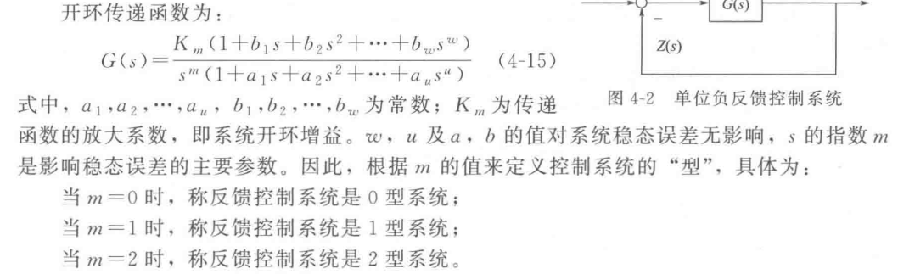

0、1、2型系统以增益K表示的静态误差：

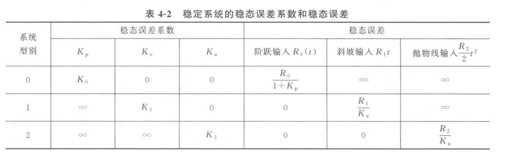

> p:position;v:velocity;accelerate
>
> 误差系数*Kp**、**Kv*和*Ka*描述了系统减少或消除稳态误差的能力，系数值愈大，则给定稳态误差终值愈小。一般来说，在保持瞬态响应在一个允许的范围内时，希望增加误差系数，如果在静态速度误差系数和加速度误差系数之间有任何矛盾时，主要考虑前者。
>
> 系统型别越高(纯积分环节越多)，其降低稳态误差的能力就越大，即跟踪输入信号的能力就越强。但是系统型别越高，想要使系统稳定就越难，因为纯积分环节越多，系统的特征方程中缺项的可能性就越大，一旦特征方程缺项，系统就不稳定，想要使系统不缺项，就需要对系统增加微分环节，但是由物理部件去实现微分环节是比较困难的。
>
> **一个系统的稳态误差等于无穷大，并不意味此系统不稳定**。

### 动态误差

**动态误差系数法**可以研究误差中的**稳态分量es(t)随时间的变换规律**。

稳态分量：即随时间不趋于零的分量。

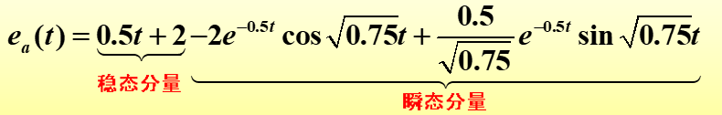

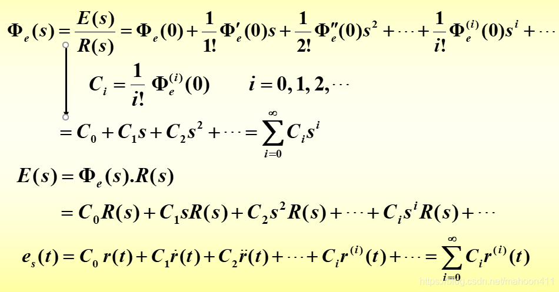

- 先写出误差传递函数——在0进行泰勒展开

- 算出E(s)后回到时域

  > $e_s(t)$是$e(t)$中的稳态分量。不包括所有信息，只表示稳态分量

- 系数比较法
- 长除法

## 暂态性能指标

暂态响应也称动态响应或过渡过程或瞬态响应

暂态性能指标：


> 超调量，调节时间

## 一阶系统的时间响应及动态性能

$$
\Phi(s)=\frac{K}{Ts+1},T为时间常数,K为增益
$$

> 化为尾一标准形式

$$
G(s)=\frac{K}{s}
$$


> 调节时间$t_s=3T,\delta=5\% y(\infty)$


> 系统对信号微分的响应=系统对1(t)响应的微分，
>
> 系统对信号积分的响应=系统对1(t)响应的积分
>
> 上面3个互为微分、积分

## 二阶系统的时间响应及动态性能

[系统零点极点与系统频率响应的关系分析（一） - 知乎 (zhihu.com)](https://zhuanlan.zhihu.com/p/112701143)


> 化为首一标准形式
>
> 闭环增益K（没写）不影响动态性能

$$
\omega_d=\omega_n\sqrt{1-\xi^2},阻尼自然振荡频率
$$

二阶系统特征方程：
$$
D(s) = s^2+2\xi \omega_n s+\omega_n^2,阻尼比\xi,自然频率\omega_n
$$

> 阻尼比$\xi$与自然频率$\omega_n$可以完全表征二次项因子的特征


$$
\xi=\cos \theta
$$

$$
\sigma=\xi \omega_n,极点实部,\omega_d=\omega_n\sqrt{1-\xi^2},极点虚部
$$

### 临界阻尼/过阻尼

计算过阻尼和临界阻尼系统的动态性能指标时，由于不存在超调，因此不需要计算**超调量σ%**，只需要计算**调节时间ts**。

- 临界阻尼

  

- 过阻尼：系统具有不相等的两个实极点，系统的暂态响应还是随时间按指数函数规律而单调衰减，只是衰减的快慢主要由**靠近虚轴的那个实极点**决定。


> 系统的响应*c(t)*包含着两个衰减的指数项。当$\xi$远大于1时，在两个衰减的指数项中，一个比另一个衰减的要快得多，因此衰减得比较快的指数项（相应于较小时间常数的指数项），就可以忽略不计。


> 根据公式算出T1,T2，查图得到$\frac{t_s}{T_s}$，再算出$t_s$

### 零阻尼/欠阻尼

- 欠阻尼：系统的暂态响应是振幅随时间按指数函数规律衰减的周期函数

  

  > 暂态振荡频率为阻尼自然频率$\omega_d$  ，它是随阻尼比$\xi$而变化的

- 零阻尼：系统的暂态响应将是恒定振幅的周期函数，并且将称为无阻尼自然振荡角频率


直观理解：

- 阻尼比ξ越大，系统振荡幅值越小。
- 无阻尼自然频率ωn越大，系统振荡频率越大。

#### 单位阶跃响应

欠阻尼二阶系统的单位阶跃响应：——对比系数得

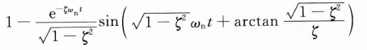

最大峰值$M_p$

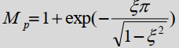

上升时间$t_r$
$$
t_r=\frac{\pi-\beta}{\omega_d}
$$

> $\beta=\tan^{-1}(\frac{\sqrt{1-\xi^2}}{\xi})=\tan^{-1}\frac{\omega_d}{\sigma}$—— 只需要记住$t_r$和$\xi,\omega_n$的变化关系即可

峰值时间$t_p$


$$
t_p=\frac{\pi}{\omega_d}
$$

> 由$\frac{dc(t)}{dt}|_{t=t_p}=0$得来

超调量$\sigma \%$

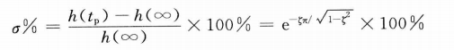

调节时间（整定时间）$t_s$，此$\sigma=\xi \omega_n,是极点实部$

$$
5\%则t_s=\frac{3}{\sigma}，2\%则t_s=\frac{4}{\sigma}
$$

> 调节时间用包络线进入5%来计算


超调量只和阻尼比有关，与无阻尼自然频率无关

下图是三种β角与超调量的对应图，要记下这三种β角对应的**阻尼比**与**超调量**的对应关系：
$4β=60°→ξ=cos(60°)=0.5→σ%=16.3%$；
$β=45°→ξ=cos(45°)=0.707→σ%=4.33%$；
$β=30°→ξ=cos(30°)=0.866→σ%=0.43%$。

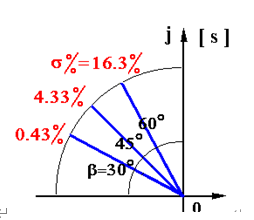

[最佳阻尼比](https://buckyi.github.io/Note-Automation/%E7%BB%8F%E5%85%B8%E6%8E%A7%E5%88%B6%E7%90%86%E8%AE%BA/%E7%AC%AC03%E7%AB%A0%20%E7%BA%BF%E6%80%A7%E7%B3%BB%E7%BB%9F%E7%9A%84%E6%97%B6%E5%9F%9F%E5%88%86%E6%9E%90%E6%B3%95.html#322)：0.707（实际不同）

> **终值定理**
> $$
> \lim\limits_{s\to0}s\cdot F(s)=f(\infty) \\
> $$

二阶系统动态性能随极点位置分布的变化规律：

$\xi\omega_n=1/T$

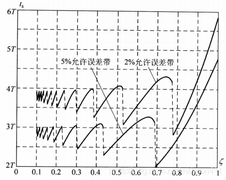

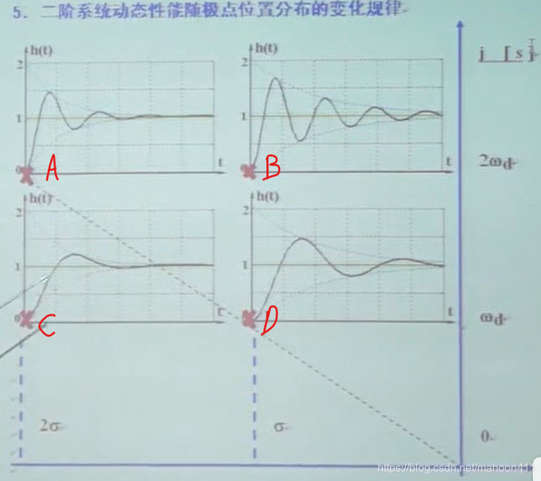

> 理解直接看CSDN解释

综上所述，二阶系统的极点放在45°线上，并且远离虚轴，这样是最有利的。因为当系统极点配置在45°线上时，阻尼比ξ=0.707，是最佳阻尼比，此时系统的实际调节时间最短，超调量也比较小(不超过5%)；并且极点沿45°线离虚轴越远，ωn越大(|λ|=ωn，即极点的模等于ωn)，因此ξ=0.707时对应的调节时间ts≈2T(T=1/ξωn)越来越短。

#### 脉冲响应


#### 零阻尼

系统振荡角频率$\omega$，则系统有极点$s=\pm j\omega$

### 改善

采用**测速反馈**和**比例加微分**的控制方式，可以有效改善二阶系统动态性能。

- 测速反馈——增加阻尼

  - 结构作用：

    能够有效降低系统的**超调量**与**调节时间**。

  - 改善机理：

    当输出的超调量太大，意味着输出的波动太大，即输出变化的速度太大，此时把输出的速度负反馈回去，这样就增加了系统的阻尼，就能降低系统的超调量。

  - 测速反馈系统结构：

    如下图，相当于把原系统的输出C(s)求了一次导数(复域乘s相当于时域求导)，再乘上系数Kt，反馈回去。即反馈了系统输出的速度，因此称为测速反馈。

- 比例加微分(PD)——提前控制

  - 结构作用：

    能够降低系统的**超调量**与**调节时间**。

  - 改善机理：

    微分信号的相位超前于比例信号的相位，因此系统可以提前进行调整。

    > 积分环节的相角滞后90度，微分环节的相角超前90度

  - 比例加微分系统结构：

    如下图，与原系统相比，此系统在误差信号后面，又引入了第二个支路，在此支路上，对误差信号(输入信号减输出信号)求了一次导数，并乘上系数Kt，此支路相当于对误差信号做了微分。并在后面将误差的微分信号与误差的比例信号(比例系数为1)相加，因此称为比例加微分。


### 求系统的单位阶跃响应

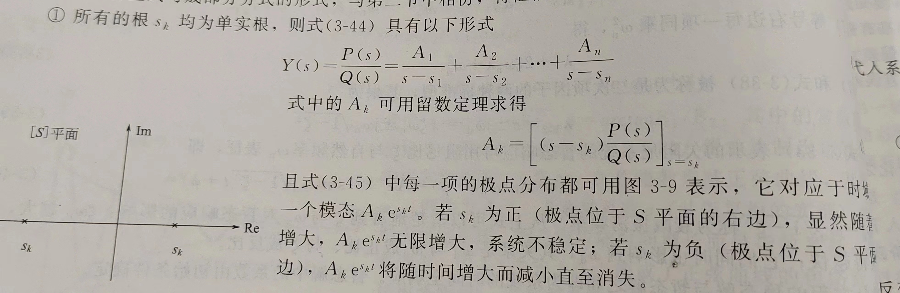

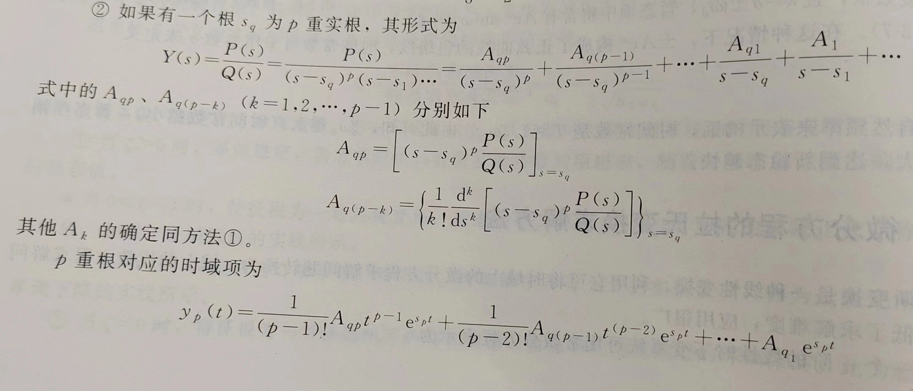

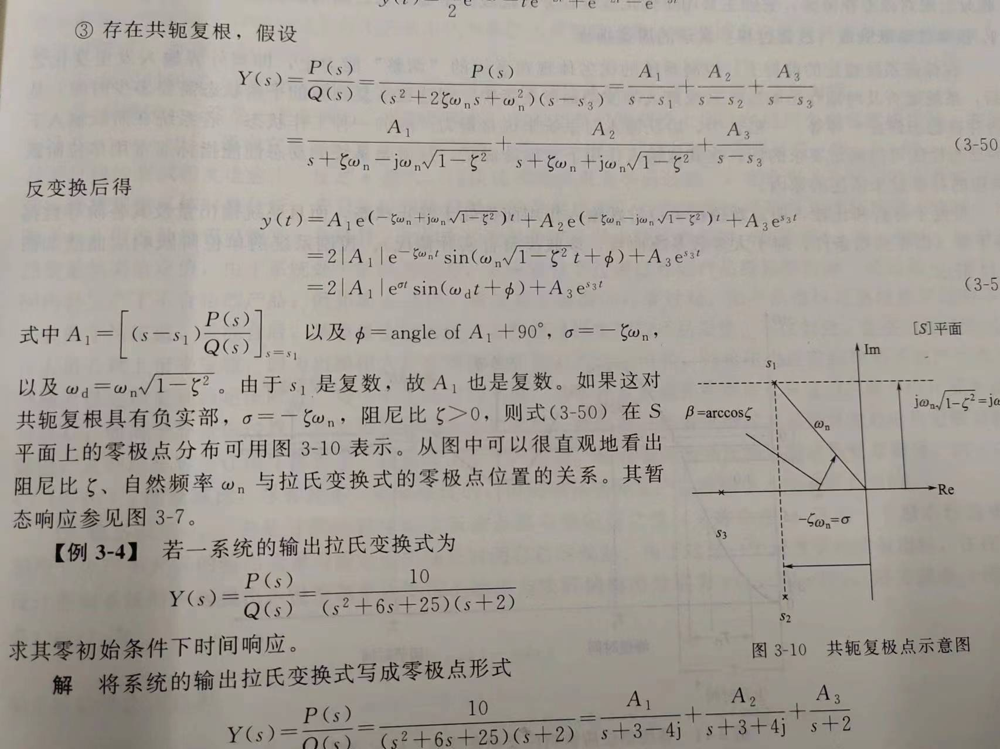

### 附加闭环零极点对系统动态性能的影响

**闭环系统零极点的作用：**

- **极点：**决定了系统响应的模态。根据极点在复平面位置的不同，可知系统瞬态响应为减幅振荡、指数衰减、增幅振荡、指数增长等。
- **零点：**决定系统不同模态之间的权重。极点附近的零点将削弱该极点对系统性能的影响。

[开环零点与闭环零点对系统的影响](https://blog.csdn.net/weixin_44690490/article/details/127750519)

- 闭环零点会影响系统响应的各个模态的加权系数。

- 附加闭环零点会使系统的**峰值时间提前，超调量增加**。附加的闭环零点靠虚轴越近(Kt越大)，这种影响越强烈。

  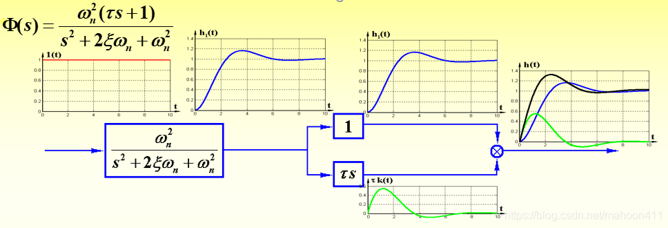

- 附加闭环极点的作用于附加闭环零点的作用相反。附加闭环极点会使系统的**峰值时间滞后**，**超调量减少**。附加的闭环极点离虚轴越近，影响越强烈。

  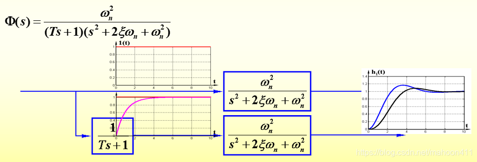

-
  同时附加闭环零点和极点时，距离虚轴近的零点或极点对系统影响较大。

- 当一个极点左移时，该极点离虚轴的距离变远，它所对应的动态响应分量的衰减速度变快，从而使整个系统的动态响应变快，调节时间$T_s$减小

## 高阶系统的时间响应及动态性能

高阶系统的暂态响应是一阶和二阶系统暂态响应分量的合成

- 闭环主导极点：距离虚轴最近而且附近又没有闭环零点的闭环极点。
- “偶极子”：若两相邻零、极点间的距离比它们本身的模值小一个数量级时，称该零、极点对为“偶极子”，其作用近似抵消，可以忽略相应分量的影响。

当系统具有一对闭环主导极点可以用一个二阶系统近似

### 估算高阶系统动态性能指标的零点极点法

1. 由高阶系统的传递函数画出闭环零极点图；
2. 略去**非主导零极点**(此零极点的实部大于主导极点实部的5~6倍以上)和不非常靠近虚轴的“**偶极子**”，保留**主导极点**；
3. 按下表中相应公式估算系统动态性能

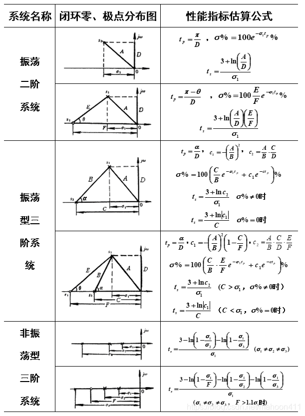

# 根轨迹法

复域法就是根轨迹法——图解法，适合于研究某一参数变化是，系统性能的变化趋势，近似方法（不精确）

都是根据闭环特征方程来画

[根轨迹法(复域分析)](https://blog.csdn.net/mahoon411/article/details/113093760)

[如何绘制变参数根轨迹(针对复杂情况，无法分离出开环增益k*时)](https://blog.csdn.net/sdu_shiqiguo/article/details/106667990)

## 基本概念

- 根轨迹：某一参数从$0\rightarrow\infty$变化时，$\lambda$在s平面相应变化所描绘出来的轨迹（是闭环极点的轨迹）

  |               | 开环传递函数 | 闭环传递函数 |
  | ------------- | ------------ | ------------ |
  | **首1标准型** | 根轨迹增益K* | /            |
  | **尾1标准型** | 开环增益K    | 闭环增益K    |

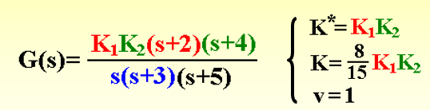

系统的闭环传递函数为：

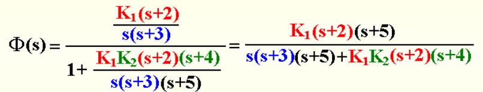

因此：

- 闭环零点由前向通路传递函数G(s)的零点和反馈通路传递函数H(s)的极点组成。
  闭环零点不随根轨迹增益K*变化，因此**不必专门讨论闭环零点**。
- **闭环极点**与**开环零点**、**开环极点**以及**根轨迹增益**$K^*$均有关。
  闭环极点随根轨迹增益K*而变化，所以**研究闭环极点**随根轨迹增益的变化规律是必要的

由此可以总结出**根轨迹法的任务**：

- 由已知的开环零、极点的分布以及根轨迹增益K*，通过图解法找出闭环极点(绘制出闭环极点的根轨迹)。一旦闭环极点确定后，再补上闭环零点，系统性能(稳、准、快)便可以确定。

## 根轨迹方程

> $z_i$是开环零点，$p_i$是开环极点

- 根轨迹方程：

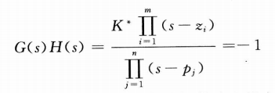

对方程进行拆分：**幅值条件**和**相角条件**

- **幅值条件**

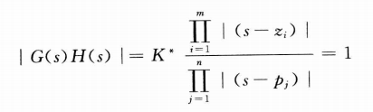

- **相角条件**

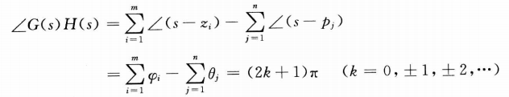

- 幅值条件与根轨迹增益K\*有关，而相角条件与根轨迹增益无关。
- **相角条件**是确定s平面上一点是否在根轨迹上的**充分必要条件**。
- 根轨迹上某点对应的根轨迹增益**K***值，应由**模值条件**来确定

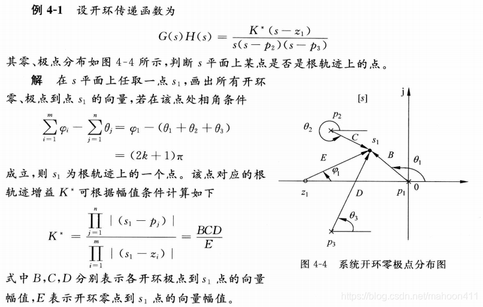

## 绘制根轨迹

[关于自控原理 请问开环零极点，闭环零极点，还有闭环特征根这五种点之间的关系？](https://www.zhihu.com/tardis/sogou/qus/423317092)

这是负反馈的根轨迹，也叫180°根轨迹

开环极点个数n,开环零点个数m

1. **法则一：根轨迹的起点和终点**

   根轨迹起点指根轨迹增益$K^*=0$，根轨迹终点指$K^*\rightarrow\infty$

   根轨迹起始于**开环极点**，终止于**开环零点**；如果开环极点个数n大于开环零点个数m ，则有 n-m 条根轨迹终止于**无穷远处**。

2. **法则二：根轨迹的分支数，对称性和连续性**

   根轨迹的分支数与开环零点数m、开环极点数n中的大者相等。
   根轨迹是开环系统某一参数从零变到无穷时，闭环极点在s平面上的变化轨迹。因此，根轨迹的分支数必与闭环特征方程根的数目一致，即**根轨迹分支数等于系统的阶数**。实际系统都存在惯性，反映在传递函数上必有n≥m。**所以一般讲，根轨迹分支数就等于开环极点数。**

   根轨迹连续且对称于实轴。

3. **法则三：实轴上的根轨迹**

   实轴上的某一区域，若其右边开环实数零、极点个数之和为奇数，则该区域必是根轨迹。

   > 只用管右边的零点、极点；其他位置不影响

4. **法则四：根之和**

   当系统开环传递函数G(s)H(s)的分子、分母阶次差(n-m)大于等于2时，系统闭环极点之和等于系统开环极点之和，等于一个常数。

   

   上式中，λ1，λ2，…，λn为系统的闭环极点(特征根)，p1，p2，…，pn为系统的开环极点。

   即n-m ≥ 2时，一部分根左移，另一部分根必右移，且移动总量为零

   

   > 系统有两个开环极点，1个开环零点，且在复平面存在根轨迹，则根轨迹一定是以该零点为圆心的圆弧

5. **法则五：根轨迹的渐近线**

   n>m时，有n-m条根轨迹分支沿着与实轴正方向夹角为$φ_a$、交点为$σ_a$​​的一组渐近线趋向于无穷远处——因为无穷远，所以把极点、零点都当作一个重心点

   > n>m时,n-m条根轨迹趋于无穷远处的规律

   

   

6. **法则六：根轨迹的分离点**

   [自动控制原理中根轨迹分离点的三种算法](https://www.bilibili.com/read/cv15131421/)

   两条或两条以上根轨迹分支在s平面上相遇又分离的点，称为根轨迹的分离点

   - ！！求解根轨迹增益$K^*$关于s的函数的导数：写出特征方程，求出$\frac{dK^*}{ds}=0$

   - 重根法
   - 开环零极点法求根轨迹

   $$
   \sum\frac{1}{d-p_i}=\sum\frac{1}{d-z_i}
   $$

   > 无零点时，右边为0；试根

   分离角：
   $$
   \theta=\frac{(2k+1)\pi}{l},l=n-m
   $$

7. **法则七：与虚轴的交点**

   - 法一：若根轨迹与虚轴相交，则意味着闭环特征方程出现纯虚根。故可在闭环特征方程中令$s=jω$，然后分别令方程的实部和虚部均为零，从中求得交点的坐标值及其相应的K\*值。

     

   - 法二：根轨迹与虚轴相交表明系统在相应K\*值下处于**临界稳定状态**，故亦可用**劳斯稳定判据**去求出交点的坐标值及其相应的K\*值。

     - 此处的根轨迹增益称为临界根轨迹增益。

       

       

8. **法则八：根轨迹的起始角(出射角)和终止角(入射角)**
   $$
   \sum\angle{s-z_j}-\sum\angle{s-p_i}=(2k+1)\pi
   $$


## 广义根轨迹

### 参数根轨迹

参数根轨迹——除K*之外其他参数变化时系统的根轨迹

- 写出特征方程
- **构造等效开环传递函数**——将参数提出来单独放到分子上
- 画出等效开环传递函数的根轨迹


> 有阻尼比就对应二阶系统，只看主导极点对应的

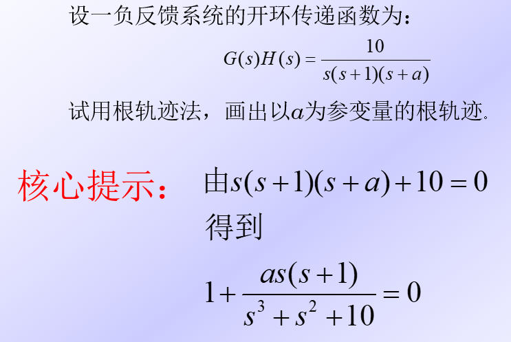

$s^3+s^2+10$这个闭环系统的极点点增么求——$s^3+s^2+10$画出这个$1+K\frac{1}{s^2(s+1)}$这个系统的根轨迹用待定系数求出K=10时的闭环极点即为$s^3+s^2+10$的开环极点

### 零度根轨迹

零度根轨迹——系统实质上处于**正反馈**时的根轨迹

模值条件不变，相角条件变$\pi$


> 仅带*的法则需要改变


> 正负反馈是相对的，相当于正反馈是K*从0往负无穷变化

### 非最小相位系统的根轨迹

所有极点和零点均位于s左平面称为最小相位系统**

### 纯滞后系统的根轨迹

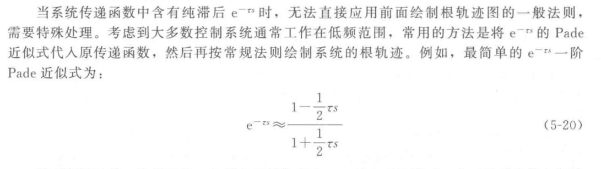

需要说明的是： 使是一个简单的低阶系统，一旦出现纯滞后，由于给系统带来相位滞后，系统的稳定性将不能保证； 采用根轨迹的方法分析有纯滞后存在的系统比较麻烦,通常采用第 6 章介绍的频率特性方法分析。

## 利用根轨迹分析系统性能

1. 绘制根轨迹
2. 确定闭环极点位置
3. 确定闭环零点
4. 保留主导极点，利用零点极点法估算系统性能

> 欠阻尼，闭环极点要有虚部

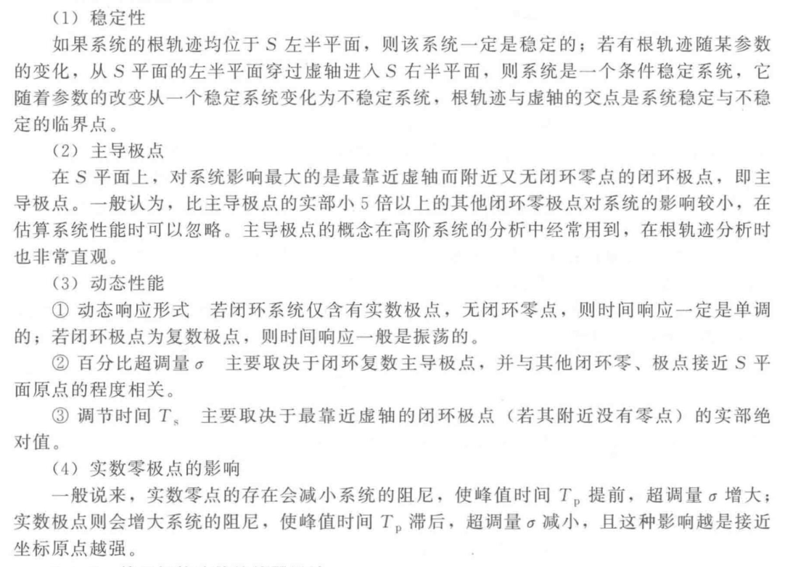

实数零极点的影响一般说来. 实数零点的存在会减小系统的阻尼，使峰值时间 Tp 提前. 超调量 0 增大;实数极点则会增大系统的阻尼，使峰值时间 Tp 滞后，超调量 0 减小，且这种影响越是接近坐标原点越强


**附加闭环零、极点对系统性能的影响**

- 附加闭环零点：在闭环外加
- 附加闭环极点：在闭环内加


**根轨迹校正**


- 当系统具有一对共轭复根时，系统将呈现欠阻尼情况

- 求最小阻尼比

  - 几何法：即从原点引出的切线与根轨迹相切

  - 极值法：笨

    

- 两个系统由相同的根轨迹（$G(s)H(s)相同$），但是零极点不同——一般是反馈通道不同

# 线性系统的频域分析

[线性系统的频域分析与校正(Nyquist图、Bode图)_未加校正装置的直线一级倒立摆闭环控制系统的开环bode图和nyquist图](https://blog.csdn.net/nanxl1/article/details/131446930)

## 基本概念

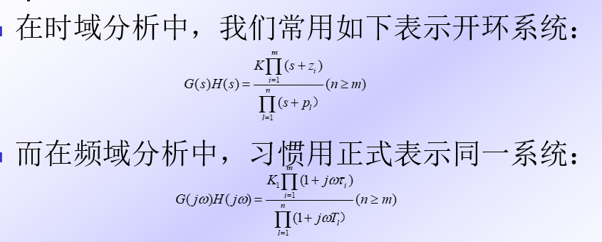

### 频率特性

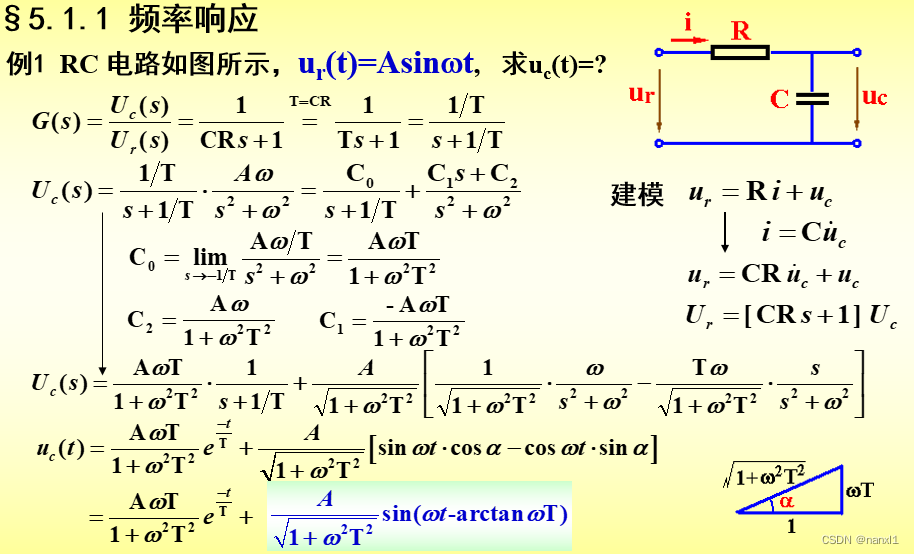

- 频率特性$G(jw)$定义——输入是正弦信号达到稳态的频率特性

  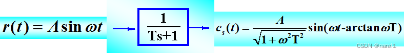

  > **下标s表示稳态响应**，$c_s(t)$输出的稳态响应

  - 定义一：$G(jw)=|G(jw)|\angle G(jw)$——物理性质
    $$
    \left\{
    \begin{array}{l}
    |G(jw)|=\frac{|c_s(t)|}{|r(t)|}=\frac{1}{\sqrt{1+w^2T^2}} && 幅频特性 \\
    \angle G(jw)=\ang{c_s(t)} -\ang{r(t)}=-\arctan{wT} && 相频特性
    \end{array}
    \right.
    $$
    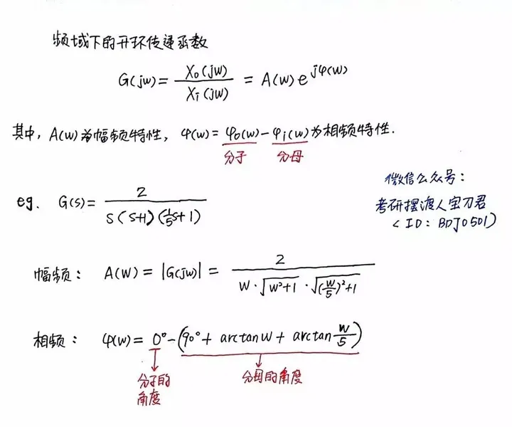

  - 定义二：$G(jw)=G(s)|_{s=jw}$——用于求频率特性
    $$
    \frac{1}{\sqrt{1+w^2T^2}}\ang {-\arctan{wT}}=|\frac{1}{1+jwT}|\ang{\frac{1}{1+jwT}}\\=\frac{1}{1+jwT}=\frac{1}{1+sT}|_{s=jw}
    $$

  - 定义三：$G(jw)=\frac{C(jw)}{R(jw)}$——频率特性等于输出傅氏变换与输入傅氏变换之比

- 频率特性$G(jw)$表示方法，以$G(jw)=\frac{1}{1+sT}|_{s=jw}$为例——四件衣服

  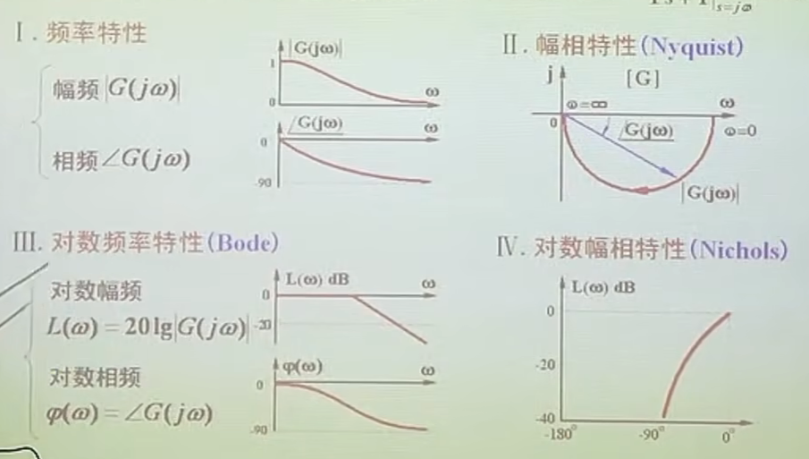

### 例题

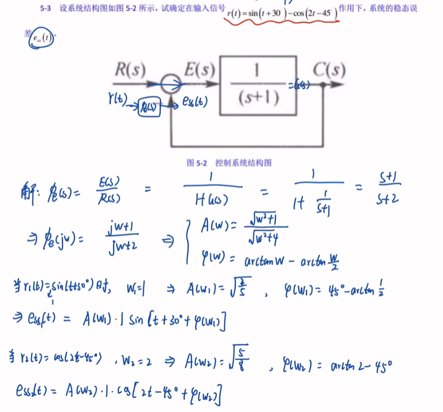

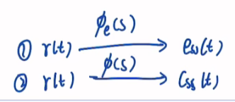

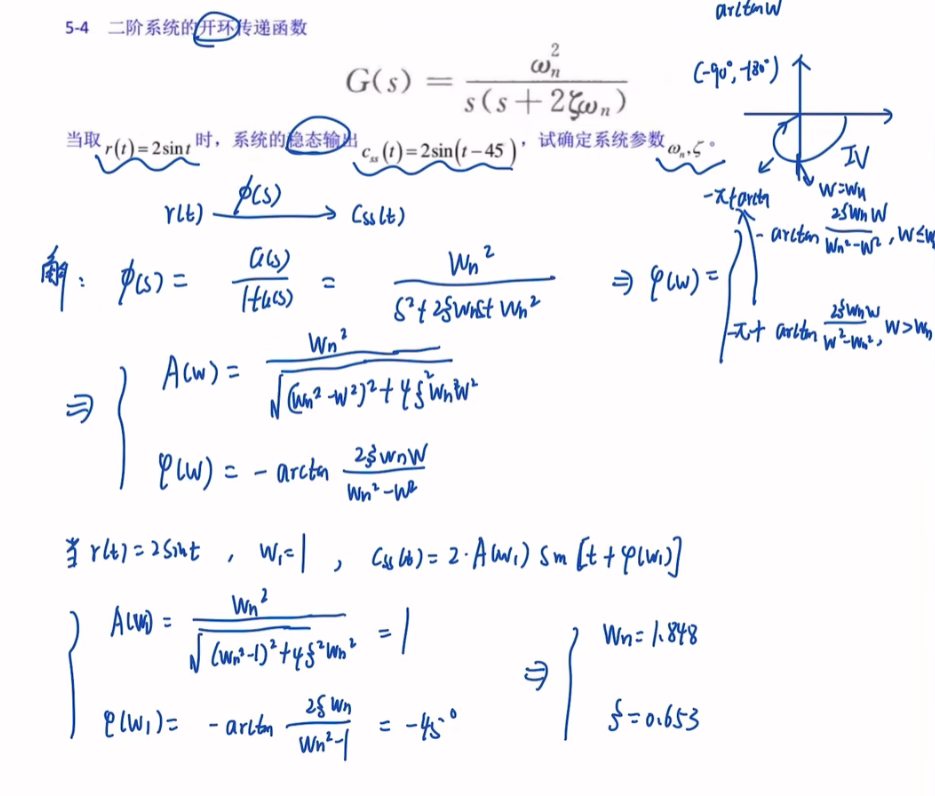

> 
>
> 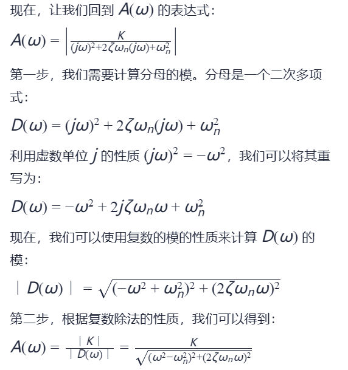

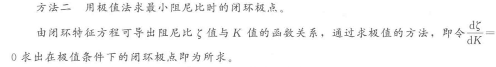

## 幅相频率特性(Nyquist)

幅相频率特性曲线（Nyquist曲线）——即极坐标图

- $G(s)=\frac{K}{Ts+1}$​的Nyquist图 是右边的下半圆
- 不稳定的惯性环节$G(s)=\frac{K}{Ts-1}$的Nyquist图 是左边的下半圆

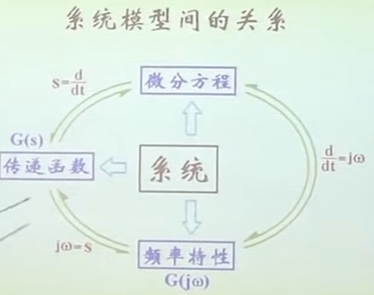

### 典型环节的幅相频率特性曲线

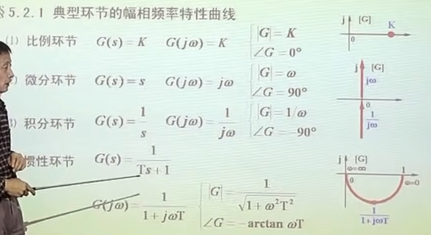

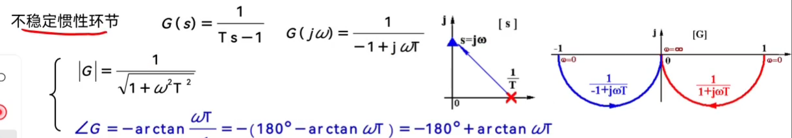


> 稳定的一阶复合微分$Ts+1$和不稳定的一阶复合微分$Ts-1$

振荡环节：


延迟环节


### 画Nyquist图

起点+终点+经过的象限

与实轴的交点：$Im=0,or~~\phi=k\pi$


- 起点，也就是w=0时的起始的地方，由开环增益K和系统型别决定

  **系统型别v**，则是**从相频的角度**，决定了你起始时的姿态或者说角度，这个角度是$-90*v$​

  

  

  

- 终点，也就是$\omega=\infty$​时的起始的地方

  

  

- 与实轴的交点：$Im=0,or~~\phi=k\pi$​

  

- 若有延迟环节的存在，奈式图必为螺旋线


#### 奈式图的补全

> 补全$\omega$从$-\infty\rightarrow 0$的部分，补全为封闭图形

补全规则：


> 先对称，再看有无积分环节，画$n*180°$的弧度

example:

无积分环节：


一个积分环节


两个积分环节


## 对数幅频特性图（Bode）


> 我们用折线段表示


#### 最小相位系统

> **控制系统三大难点：耦合、时延和非线性！**

- 最小相位系统：如果系统的开环传递函数在右半*s*平面上没有极点或零点，则称为最小相位传递函数。具有最小相位传递函数的系统，称为最小相位系统。

  最小相位系统的对数幅频特性和相频特性曲线之间存在一定的内在关系。

  如果确定了最小相位系统的对数幅频特性，则其对应的相频特性也就被唯一地确定了；反之亦然。因此对于最小相位系统，只要知道它的对数幅频特性曲线，就能估计出系统的传递函数

> 

#### 画Bode图

1. 写出频率特性
2. 计算$L(\omega)=20\lg A(\omega)$，根据转折频率来分段求$\omega=\frac{1}{T}$
3. 求截止频率$\omega_c:A(\omega_c)=1$


> 当系数为负数时如何画？？？

#### 根据Bode图反求开环传递函数


> 如果Bode图一开始就下降/上升，则直接在分母（下降）/分子（上升）添加s即可


二阶系统根据$\omega_r,\omega_n$不同选择不同修正方式


> 4.85dB很常见

**系统开环对数幅频特性与闭环稳态误差的关系**

[系统开环对数幅频特性与闭环稳态误差的关系](https://wenku.baidu.com/view/dfc3152401768e9951e79b89680203d8cf2f6a74.html?_wkts_=1715131319143)


## 频率域稳定判据

### Nyquist稳定判据

数学来源：
$$
GH=\frac{N}{D}
$$

$$
B(s)=1+GH=\frac{N+D}{D}
$$

特征方程$B(s)$的零点就是闭环传递函数的极点，$B(s)$的极点就是开环传递函数的极点

柯西辐角原理：角度是零点-极点，幅度是零点/极点


判断相对稳定的判据

奈奎斯特稳定判据是一种**基于开环频率特性来判定闭环系统的稳定性的判据**，同时还能反映系统的相对稳定性


> 知道如何算Z，P，N即会判断
>
> P为s右半平面上系统开环极点数
>
> N为开环幅相曲线逆时针包围$(-1,j0)$点的圈数——$Z=P-N$
>
> N如果画一半则公式中N要乘2


> $N=N_+-N_-,N_+逆时针穿过(-1,0j)左边，N_-顺时针穿过(-1,0j)左边$​
>
> > 穿了但没穿过算$\frac{1}{2}$​，虚线也要算
> >
> > 先会画Nyquist图，若通过$(-1,0j)$则临界稳定（也属于不稳定）
>
> 只有当Z=0时，闭环系统才是是稳定的

> 特殊情况：
>
> 

【奈奎斯特判据】<https://www.bilibili.com/video/BV1WD4y1U7vn?vd_source=93bb338120537438ee9180881deab9c1>

> 临界稳定状态：$A(\omega)=1,\varphi(\omega)=-\pi$​
>
> 要使其稳定$A(\omega)<1$


- 奈奎斯特稳定判据

应用Nyquist稳定判据时，闭合曲线必须包围整个右半平面


开环极点的影响

闭合曲线Q不能经过任意极点或者零点：因此要对Q进行修正，避免穿越


### 例题


### Bode稳定判据


## 相对稳定性分析

### 稳定裕度

幅值裕量$K_g$和相位裕量$\gamma$——衡量闭环系统相对稳定性的具体指标

> 对于开环稳定的系统，要求闭环系统$G(jw)H(jw)$有一定的稳定性，不仅要求的幅频特性不包围（-1，*j*0）点，而且应与该点有一定的距离，即有一定的稳定裕量。


>
>
> 增益裕度就是幅值裕度

>看看含义
>
>$\gamma=0$​系统临界稳定
>
>当$\gamma>0,h>1$时，系统稳定


> $\omega_c$为截止频率，即使$A(\omega_c)=1$的频率
>
> $\omega_g$穿越频率，即Nyquist图中穿过负实轴的点对应的频率值，了解一下$\varphi(\omega_g)=(2k+1)\pi$

**稳定裕度说明**

- 稳定裕度定义只适用于最小相位系统
- 稳定裕度可以作为频域性能指标使用
- 相位裕度$\gamma$足以表征系统绝对稳定性，计算简单方便，故常用


## 对数幅频特性中频段与系统动态性能的关系

习惯上将频率范围分为三个频段：低频段、中频段和高频段。其中

- 低频段反映了控制系统的静态特性——越高越好，越高，控制精度越高

  位置越高，积分环节数目越多，开环增益越大，稳态误差越小

- 中频段则反映了系统的动态特性——越宽越好，越宽，响应速度越快

  > 一般是对数坐标系穿越实轴的那一段
  >
  > 系统带宽越大，说明系统能够跟随的周期信号的频率越高。频率高的信号就是变化速度快的信号。
  >
  > 那就是，带宽大，系统就能跟随变化速度大的信号。即，系统响应速度快。
  >
  > 斜率考虑相位裕度
  >
  > 
  >
  > 想要以$-20dB/dec$的斜率穿越0dB，并保持较宽的中频段范围

- 高频段则主要反映了系统的抗干扰能力，对动态性能影响不大

  高频段分贝越低，系统对高频信号的衰减作用越大，抗高频干扰能力越强


# 线性系统的校正


[【自控原理】第六章 线性系统的校正方法](https://blog.csdn.net/weixin_44378835/article/details/106606188)

## 概述

`控制系统校正(补偿)`：通过改变系统结构，或在系统中增加附加装置或元件对已有的系统（固有部分）进行再设计使之满足性能要求。
`控制系统的设计本质上是寻找合适的校正装置`
工程实践中常用的校正方法：`串联校正、反馈校正、 前馈校正和复合校正`。


## 性能指标

系统的性能指标，按其类型可以分为：
(1) `时域`性能指标，包括`稳态性能指标和动态性能指标`；
(2) `频域`性能指标，包括`开环频域指标和闭环频域指标`；

(3) `复域`性能指标

### 时域性能指标

> 见上文线性系统的时域分析：静态性能指标+暂态性能指标

- 稳态指标$e_{ss}$
- 暂态指标

### 频域性能指标

- 开环频域指标

  - 稳态指标：$e_{ss}$
  - 暂态指标
    - 快速性：开环截止频率$\omega_c(rad/s)$与带宽成正相关
    - 平稳性：相角裕量+幅值裕量

- 闭环频域指标[闭环系统的频域性能指标](https://blog.csdn.net/qq_39032096/article/details/126611583)

  

  

  - 稳态指标：零频振幅比$M(0)$，反应系统的稳态精度

  - 暂态指标

    - 快速性：闭环带宽频率$\omega_b$，带宽$ 0 \rightarrow \omega_b$，带宽越大，系统相应速度越快
    - 平稳性：谐振频率$\omega_r$，谐振峰值$M_r$（$M_r$越大，平稳性越差）

  

### 频域指标和时域指标的关系

- 截止频率$\omega_c$与阻尼比$\xi$、自然频率$\omega_n$​的关系
  $$
  (\frac{\omega_c}{\omega_n})=(\sqrt{4\xi^4+1}-2\xi^2)^{\frac{1}{2}}
  $$
  当阻尼比一定时，截止频率$\omega_c$越大、自然频率$\omega_n$也越大，闭环系统的上升时间、峰值时间和调节时间越小，系统的响应速度加快

- 相位裕度$\gamma$与阻尼比$\xi$​​的关系

  二阶欠阻尼系统相位裕度$\gamma$与阻尼比$\xi$的关系如下
  $$
  \xi\approx 0.01\gamma
  $$
  二阶系统的相位裕度$\gamma$可以i决定系统的$\xi$但不能决定系统的系统自然频率$\omega_n$

  

  


## 用开环频率特性进行系统设计


一些基本原则：


## 校正方式

| 串联校正 |  |
| -------- | ------------------------------------------------------------ |
| 反馈校正 |  |
| 前馈校正 |  |
| 复合校正 |  |

[自动控制理论（甲）2023-06-15第3-4节 (zju.edu.cn)](https://classroom.zju.edu.cn/livingroom?course_id=51670&sub_id=886299&tenant_code=112)

- 反馈校正

  - 减小被包围环节的时间常数；但会减小增益

    

  - 深度负反馈可以有效降低被包围环节的影响

    

  - 局部正反馈可以提高环节增益——和第一个完全相反

    

### 串联校正

#### 串联超前校正

[你相信吗？串联超前校正，它是有固定操作步骤的！](https://zhuanlan.zhihu.com/p/30418895)

串联超前校正：使$\omega_c$增大进而使$\gamma$​​​​增大


> 当两个都小于目标值时选择串联超前校正
>
> **一级超前网络能提供的最大超前角不超过60度**

超前网络特性：
$$
G_c(s)=\frac{aTs+1}{Ts+1}=aG_c`(s),a>1
$$

- 计算超前网络的参数$a$ $T$

$$
\gamma(\omega_c^{\prime \prime})=\arcsin \frac{a-1}{a+1}
$$

$$
a=\frac{1+\sin{\phi_m}}{1-\sin{\phi_m}}
$$


- 根据参数确定要设计的参数和K

- 确定$\varphi_m=\gamma^*-\gamma_0+(5^\circ \to 10^\circ)$

- 根据$\varphi_m$算出$a,10\lg a$——根据相角裕度来设计

- 在$-10\lg a$做水平线交与$A`,交点坐标\omega_{A`}$——根据$\omega_{A`}和\omega_c^*$比较选大的，兼顾两项指标，选定新的$\omega_c^\prime$

- 在新的$\omega_c^\prime$做垂线与原Bode图交于A点，做A点关于实轴的对称点B，过B做$20dB/sec$
  $$
  \omega_C=\frac{\omega_{c0}^2}{\omega_c `}
  $$

  $$
  \omega_D=\frac{\omega_{c}`^2}{\omega_C}
  $$

- 确定超前校正装置
  $$
  G_C(s)=\frac{\frac{s}{\omega_C}+1}{\frac{s}{\omega_D}+1}
  $$


#### 串联滞后校正

相角迟后，幅值衰减：压低高频段，提高系统抗干扰能力


串联滞后校正：$\omega_{c0}$有余，$\gamma_0$不足


$$
G_c(s)=\frac{bTs+1}{Ts+1},b<1
$$

- 先算参数，计算在$\omega_c^ *$的相角储备量，如果大于$\gamma^*+6^\circ$则课采用滞后校正

- 寻找满足条件的$\omega_c$的范围，随便取一个，在此点做垂线交与A点，对称找到B点

- 过B做水平线找到C点$\omega_C=0.1\omega_c$，在C点做$-20dB/sec$​直线交于D点

- 确定滞后校正装置
  $$
  G_C(s)=\frac{\frac{s}{\omega_C}+1}{\frac{s}{\omega_D}+1}
  $$


#### 超前滞后校正

[你应该坚信了吧？滞后-超前校正也是有可参考操作步骤的！](https://zhuanlan.zhihu.com/p/30419069)

#### PID校正

考试比较喜欢的考法是将这三种校正与“PID校正”校正结合起来。PD、PI、PID校正分别是超前、滞后、和滞后-超前校正的特殊情况

### 前馈校正


### 复合校正


## 基本控制规律

PID控制

、


## 常见校正装置及其特性

1. 无源校正

   

   

2. 有源校正

## 做题

- 系统带宽的确定

  如果输入信号带宽是$0:\omega_M$，噪声信号集中起作用的频带是$\omega_1:\omega_n$，则控制系统的带宽频率通常取为$\omega_b=(5:10)\omega_M$

- 串联超前校正

  example：

  

# 历年卷

[控院自动控制原理（甲）/自控回忆卷 2022-2023春夏](https://www.cc98.org/topic/5644437)

# Matlab

control modules and simulink

- matlab进行暂态响应分析

  ```
  num=[0 0 25];
  den=[1 4 25]; %即闭环传递函数的分子和分母
  step(num,den,t);%将产生单位阶跃响应图
  %当阶跃命令的左端含有变量时，如[y,x,t]=step(num,den,t)，显示屏上不会显示出响应曲线。因此，必须利用plot命令去查看响应曲线。

  %单位脉冲响应
  impulse(num,den,t)

  %求线性时域响应解析解
  residue()；
  [r,p,k]=residue(num,den)

  ```

## 画根轨迹

[在Matlab中绘制系统的根轨迹图_matlab绘制根轨迹图](https://blog.csdn.net/xiaopikadi/article/details/86266852)

[MATLAB——根轨迹原理及其Matlab绘制_matlab根轨迹](https://blog.csdn.net/LGM_1874/article/details/122524623)


```
num=[1,2,4];                             %开环传函分子多项式系数
den=conv(conv([1,4,0],[1,6]),[1,1.4,1]); %开环传函分母多项式系数
sys=tf(num,den);                         %系统传递函数模型
rlocus(sys);                             %绘制系统的根轨迹图
axis([-8 2 -6 6]);                       %设定坐标范围为：实轴[-8,2]，虚轴[-6,6]

```

## 稳定性分析

- ```
  % 显示裕量
  g=tf(1,conv([1,0],conv([0.2,1],[0.05,1])))；
  margin(g)
  ```

# SIMULINK

[MATLAB：Simulink基础](https://zhuanlan.zhihu.com/p/446319400)
