# Main Takeaway

过程控制工程

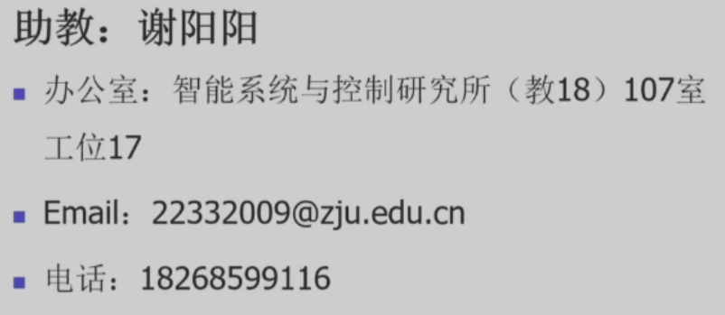

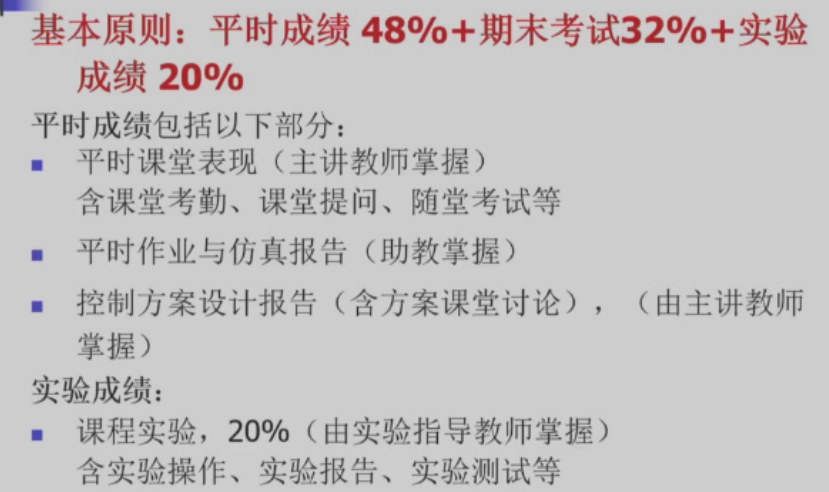

# Preview

控制系统中的三个基本操作：测量+决策+动作/执行

| FT   | 流量变送器   |
| ---- | ------------ |
| TC   | 温度控制     |
| TT   | 温度变送     |
| PT   | 压力变送     |
| PC   | 压力控制     |
| LT   | 液位变送     |
| LC   | 液位控制     |
| LS   | 液位开关联锁 |

> 变送器是从传感器发展而来的，凡能输出标准信号的传感器就称为变送器
>
> T：变送，C：控制

<h4>重要术语</h4>

- 被控变量/受控变量（Controlled Variable--CV）:**工艺介质（换热器）+工艺部位（出口，内部）+工艺参数（温度，压力）**
  - 工艺介质换热器出口温度
  
  - 被控对象内要求保持设定数值的工艺参数。
  
    比如要求保持为某一恒定值，温度、压力或液位等。也可以是要求按照某个给定规律运行，比如飞行航线、记录曲线等。
- 设定值/给定值（Setpoint--SP）
- 操纵变量/操作变量（Manipulated Variable--MV）——控制的东西后面那个变量
  - MV为某一工程量，通常为某一工艺介质的流量

- 扰动/扰动变量（Disturbance--DV）：自主性，可变性，与CV的相关性

<table><tr>
<td></td>
<td></td>
</tr></table>
> 有输入必有输出要写在流程图中

过程控制系统的设计目标是：**对于任意的外部干扰（DV），通过调节操作变量（MV）以使被控变量（CV）维持在其设定值（SP）**。

- 被控对象:自动控制系统中,工艺参数需要控制的生产过程、设备或机器等。

  如数控机床按照预定程序自动地切削工件，在这里数控机床就是被控对象。人造卫星准确地进入预定轨道运行并回收，在这里人造卫星就是被控对象。

- 控制对象：控制装置，是对被控对象施加控制作用的机构的总体。比如人取书的过程，眼睛、大脑和手臂产生控制作用，它们统称控制对象

- 控制变量：作用于控制系统的输入端，并可使系统具有预定功能或预定输出的物理量。比如飞机自动驾驶仪系统，控制变量是给定的常值俯仰角，自动驾驶仪系统的任务就是在任何扰动作用下，始终保持飞机以给定的俯仰角飞行

- 扰动量:除操纵变量外,作用于被控对象并引起被控变量变化的因素。

- 设定值:被控变量的预定值。

- 偏差:被控变量的设定值与实际值之差。

> 区别
>
> 1）被控对象、被控变量是被控制的；
>
> 2）控制对象，控制变量是施加控制的；
>
> 要求不同
>
> 1）被控对象被要求某个工作状态或参数自动按预定规律运行；
>
> 2）被控量被要求保持某一恒值或按某个给定运动规律运行；
>
> 3）控制对象被要求通过被控量的反馈信息不断修正被控量与输入量之间的偏差，从而实现控制任务；
>
> 4）控制变量被要求是预先设定好的物理量。

过程控制系统的设计目标是：*对于任意的外部干扰*（DV）*，通过调节操作变量*（MV）*以使被控变量*（CV）*维持在其设定值*（SP）

# 过程动态特性描述与建模

**对于某一被控过程，最适合其特性的最简单的控制器是最好的控制器**

## 自衡过程

基于过程动态学的机理建模

- 绝大多数被控过程为自衡对象（除部分液位对象外）/稳定对象

  纯滞后过程/单容过程/多容过程

- 所有被控过程均具有一定范围的**纯滞后**

  > 纯滞后：输入变化后，输出量并不立即改变，而是经过一段时间后才反映出来，这段时间称为纯滞后，$G(s)=e^{-\tau s}$

- 单容过程

  只有一个容积，一个容量系数和一个时间常数

  **自衡特性**：对象在扰动作用下，其平衡受到破坏，在没有操作人员或控制器的干预下，过程**自动恢复平衡状态**的特性

  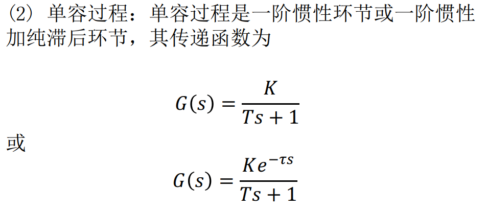

- 多容过程

  有多个容积，多个容量系数和多个时间常数

  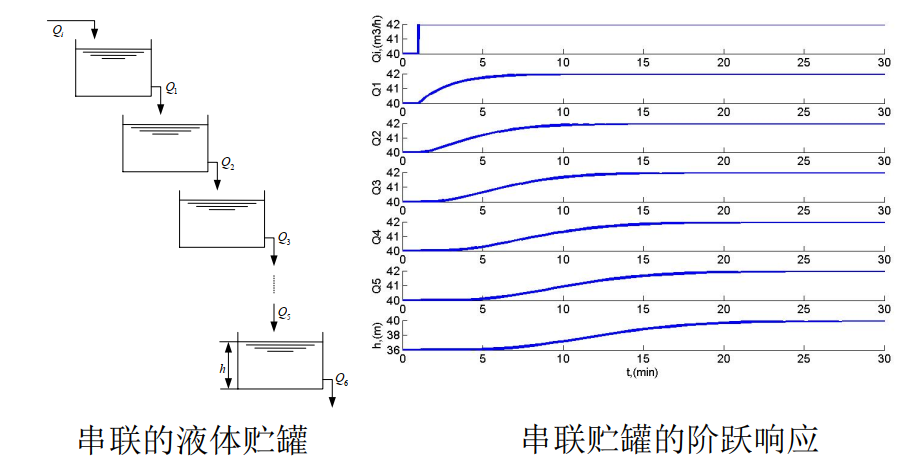

  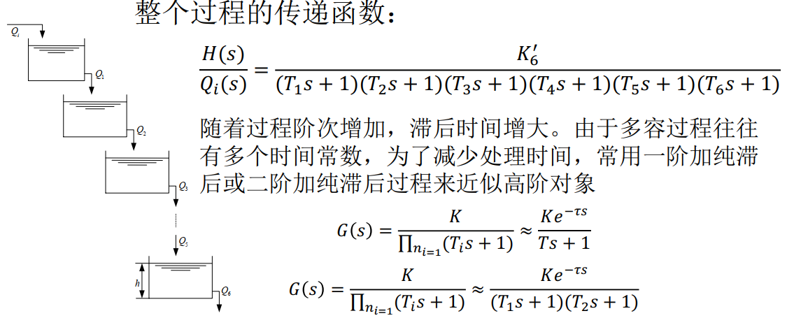

## 非自衡过程

无自衡特性：对象在扰动作用下， 其平衡收到破坏， 在没有操作人员或控制器的干预下，无法自行重建平衡  

## 测量变送环节

测量变速环节的任务是对被控变量或其他有关参数进行正确测量， 并将其转换成统一的信号， 如风压0.02-0.1mpa， 电信号4-20mA等等

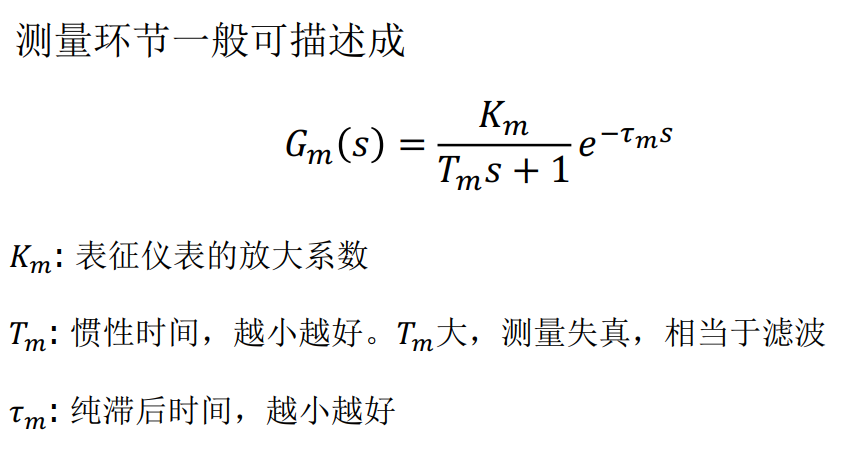

测量误差

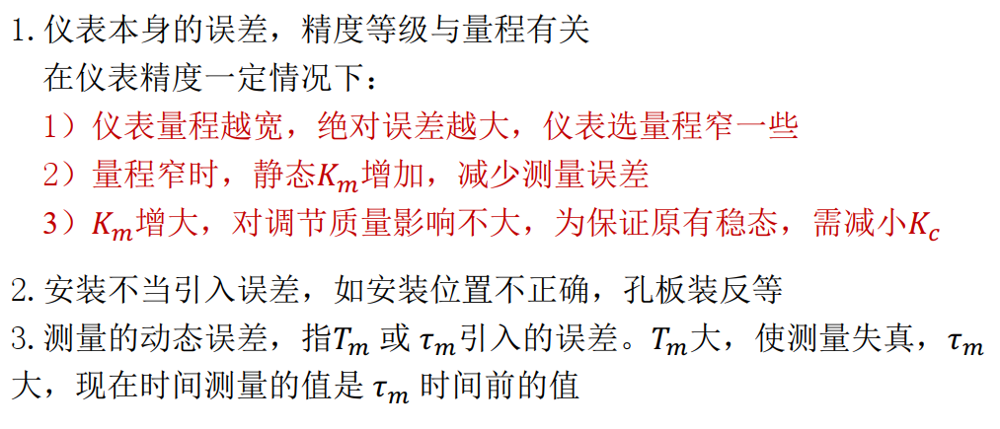

## 控制阀

在正常工况下要求调节阀开度处于15-85%之间  

控制阀流量特性

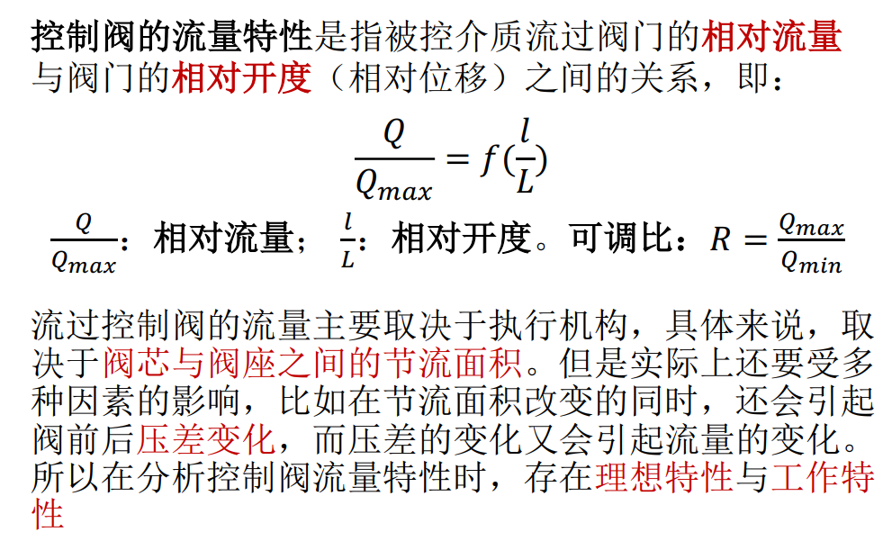

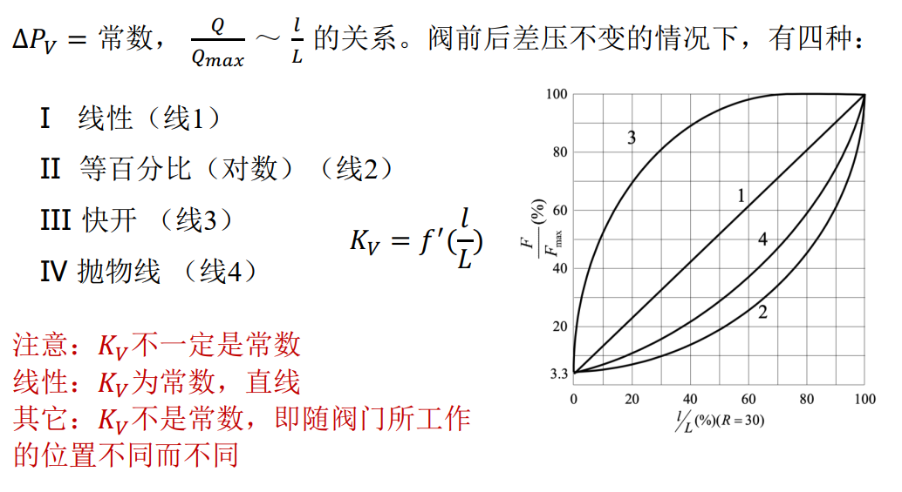

## 关键参数

- 过程增益（*K*）——**符号、数值与单位**（稳态条件下）

  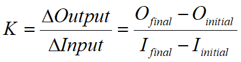

  过程增益只涉及两个稳态，因此说过程增益反映了被控过程的静态或稳态特性。有时，也称**静态/稳态增益**

- 过程一阶时间常数（*T*）——动态特性

  对单容过程而言，定义为过程输出开始变化至达到全部变化的**63.2%**所需的时间

  T越小，表示对象的惯性越小

- 过程纯滞后时间（$\tau$）——动态特性

  **过程输入施加激励至过程输出开始变化所需的时间**

  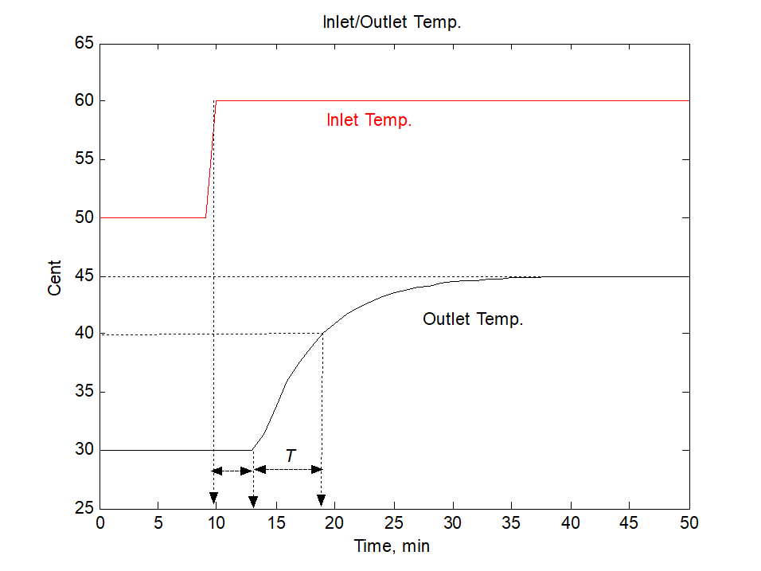

  > 对象两时间参数的比值$\tau /T$直接关系到控制系统的可控性。$\tau /T$越大，控制难度越大

广义对象的特性参数

> 所谓广义对象，是指在控制回路中，除去控制器（或者叫调节器）之外，把剩余部分看做一个整体对象
>
> 包括控制回路中除控制器外的每一部分。它反映了**控制器输出**对CV**测量输出**的影响  

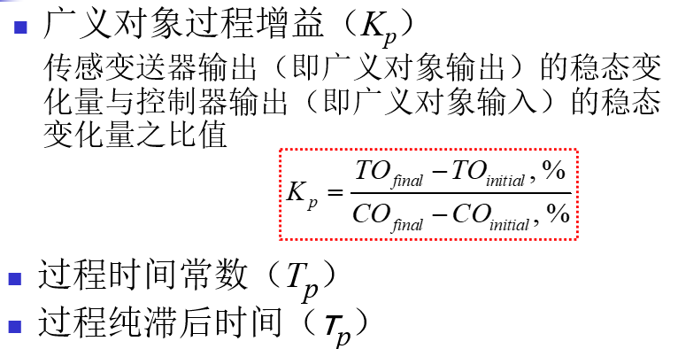

这里**广义对象过程增益需要按照量程归一化**

对象特性的阶跃响应测试法

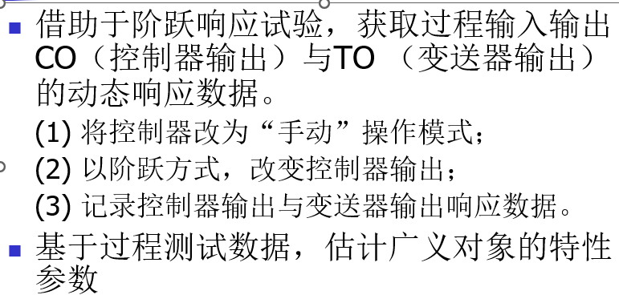

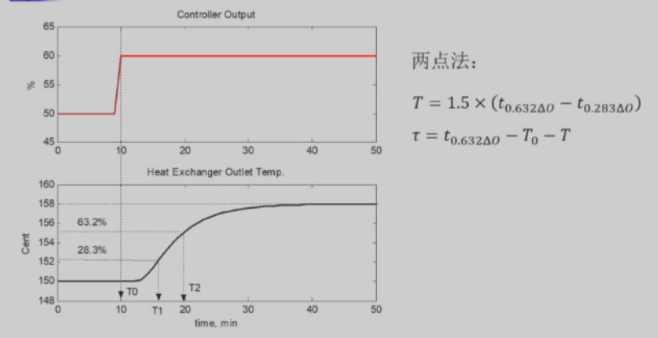

## 建模

- 基于过程动态学的机理建模

模型线性化

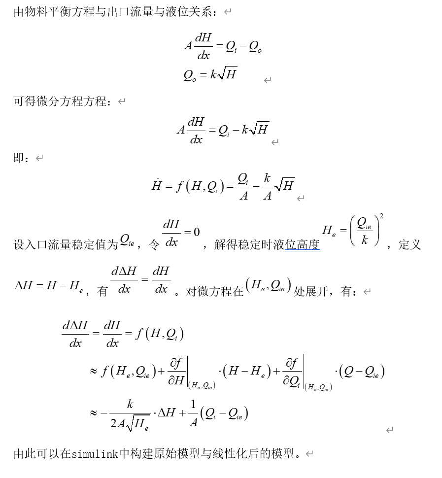

## 实际工业过程的环节

- 测量变送环节

  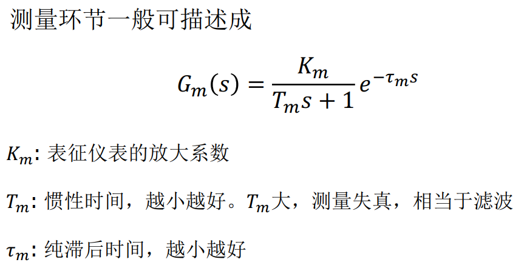

  测量变送器的作用：把工艺生产过程的变量（流量、压力、温度、液位和成分等）及检测、转换单元转换成**标准的电或气信号**  

  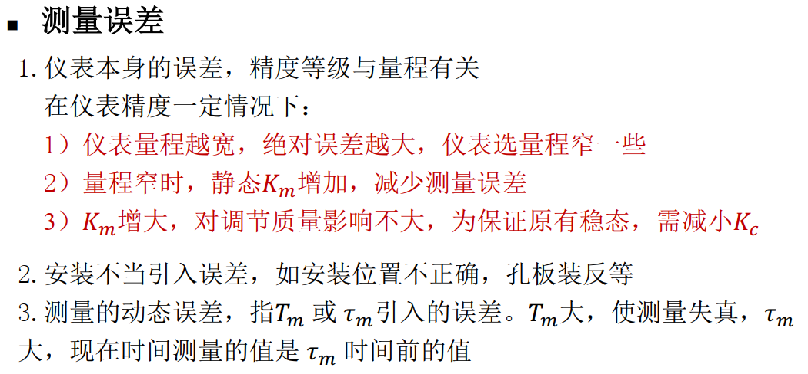

  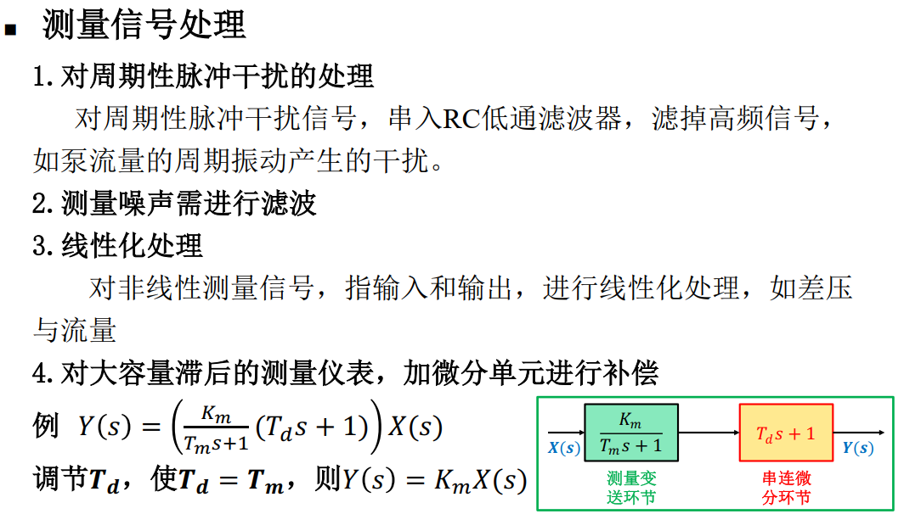

- 控制阀：执行机构， 执行器， 调节阀  

  控制阀代替手动操作，是构成自动控制系统不可缺少的重要部分。其作用是接**受控制器的输出信号**，直接**控制被控介质的的输送量**，达到控制温度、压力、流量、液位等工艺参数的目的，从而将被控变量维持在工艺指标要求的数值上  

  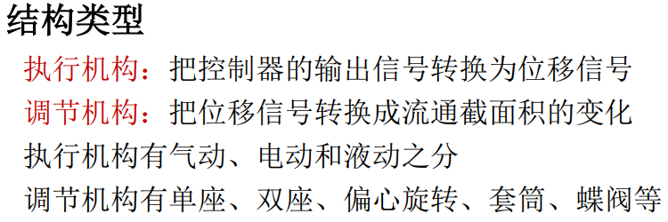

  控制阀气开、气关方式的确定

  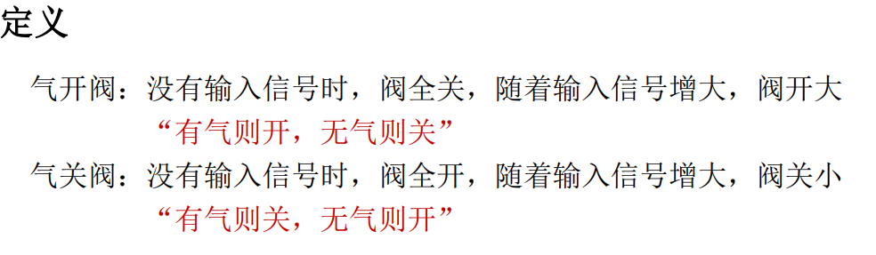

# PID与参数整定

## 性能指标

以阶跃响应曲线特征参数作为性能指标

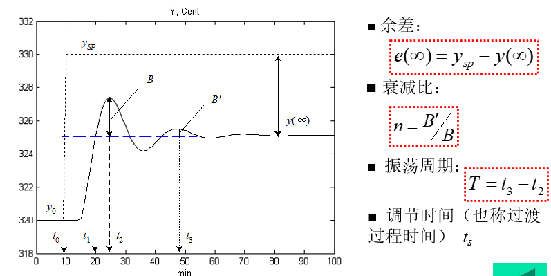

- 衰减比工程上希望：4:1~10:1

  > $n=\frac{B}{B\prime}$

- 调节时间$t_s$是进入稳态值$\pm5\% or \pm2\%$范围的时间

  > 快速性指标

- 超调量：$\sigma=\frac{B}{C},C为稳态值$

  > 当稳态值趋近0时，超调量不好描述，选用最大动态偏差

- 最大动态偏差：$A=|B+C|$

偏差积分性能指标——一种综合的指标

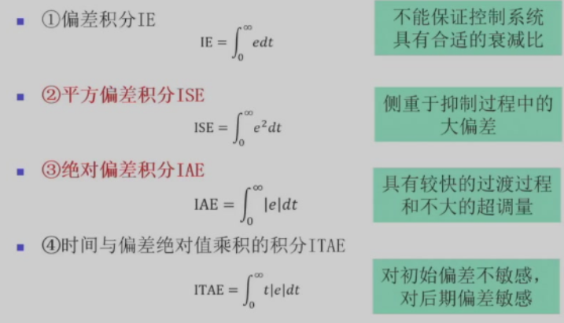

## 控制器的正反作用

example

正反作用的确定：

➢ 单回路系统结合对象和控制阀使偏差减小的方向调节

➢ 先确定调节阀，再确定控制器

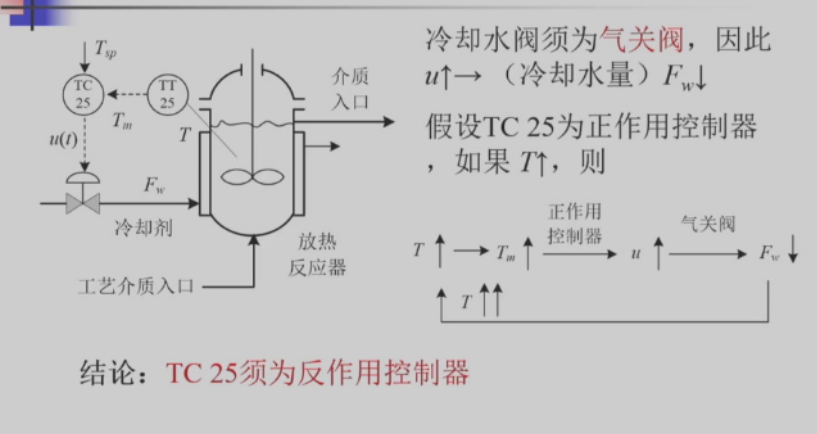

## PID

- 比例度：使控制器输出CO全范围变化所对应的控制误差比例$PB=\delta=\frac{100\%}{K_c}$

  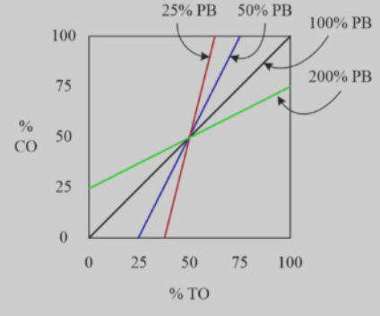

- P

- I：积分时间$T_i$ 越短，积分速率$1/T_i $越大，积分作用越强，闭环系统消除余差的速度越快，但控制系统的**稳定性越弱**。

  - 积分饱和
  - 积分限幅
  - 积分分离

- D

  

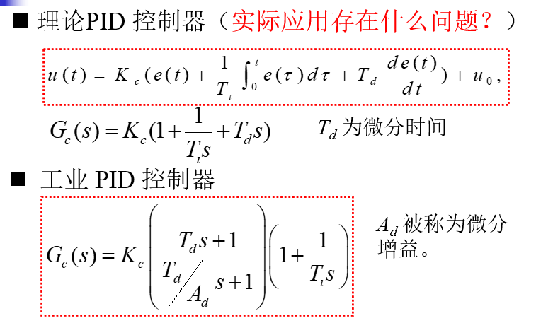

两个控制器不一样：

对于某些具有较长时间常数的慢过程，建议引入微分作用。但若存在较大的测量噪声，需要对测量信号进行一阶滤波或平均滤波

### 应用场合

| 被控过程            | 控制器  类型 |
| ------------------- | ------------ |
| 温度 /  成份        | PID*1        |
| 流量 /  压力  /液位 | PI           |
| 部分液位            | P            |

## 参数整定

根据过程动态特性及控制目标来设置控制器参数

- 理论计算整定
- 工程整定

- 基于过程特性参数*K*, *T*,*τ*的**离线参数整定法**

  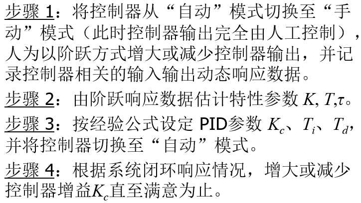

  步骤2

  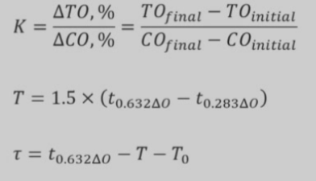

  针对步骤3，经验公式有不同的方法

  - *Ziegler-Nichols* 方法基于频率特性

    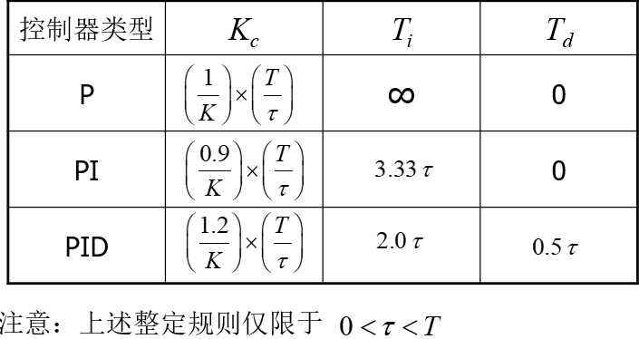

  - *Lambda* 整定法基于时域响应

    

- 控制器参数整定

  - 经验法

    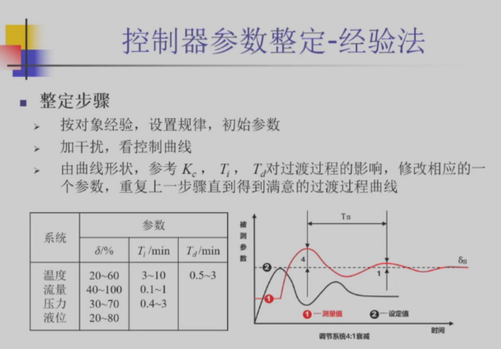

  - 临界比例度法——等幅振荡受限制

    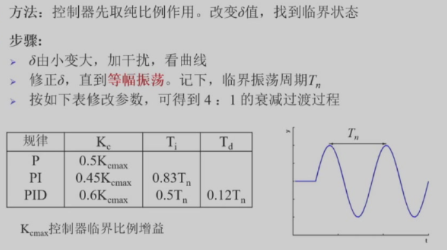

    > 上述只是$T_i$和$T_d$记得转化为I，D
    >
    > 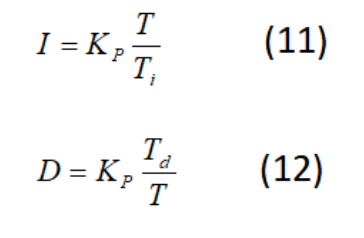

  - 衰减振荡法——4：1？难用
  
    
  
  - 响应曲线法

控制系统的投运

> 投运：手动切换到自动
>
> 投运原则：无扰动切换

## 数字PID

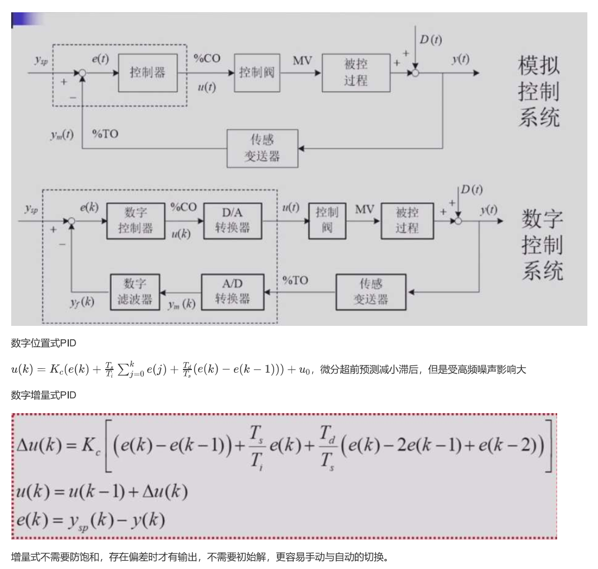

增量式不需要防饱和，存在偏差时才有输出，不需要初始解，更容易手动与自动的切换。

## 积分抗饱和

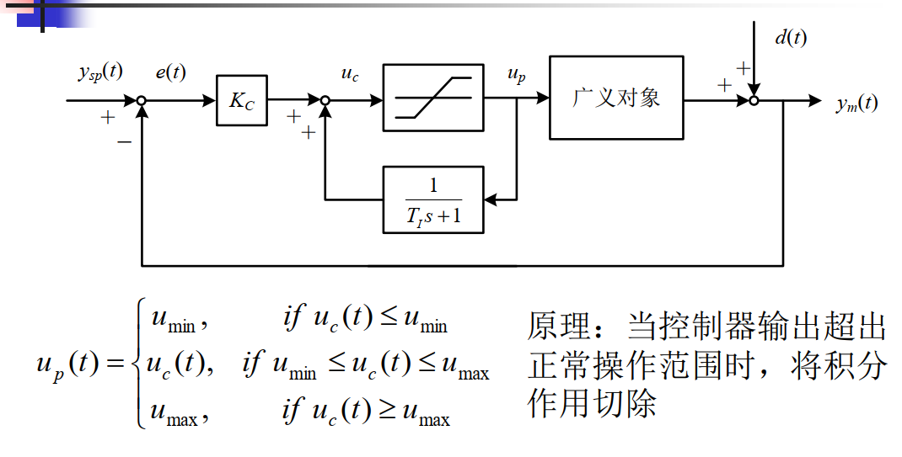

## 微分先行

微分先行PID是**只对输出量进行微分**，而对给定指令不起微分作用，因此它适合于给定指令频繁升降的场合，可以避免指令的改变导致超调过大——常增量式

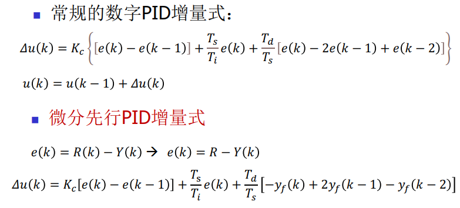

# DCS

DCS （Distributed Control System ）分布式控制系统，国内自控行业又称为集散控制系统。基本思想是**集中管理，分散控制**

DCS系统结构包括与生产过程紧密相连的**测量变送和执行器、 控制站和操作站**三层结构形式

# 串级控制

## 串级控制的引入与基本概念

和前馈思想相似

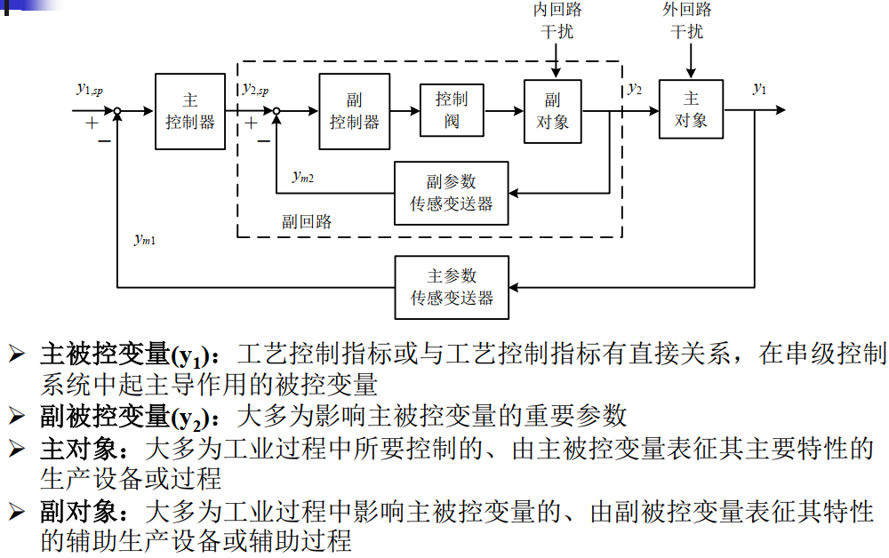

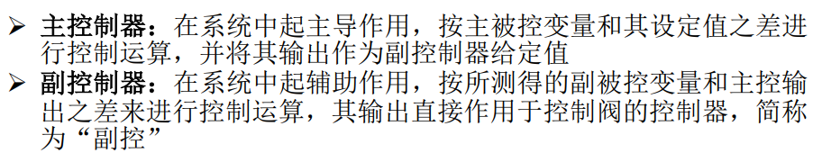

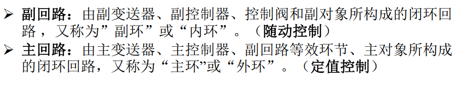

> 副回路为随动控制
>
> 主回路为定值控制
>
> 副回路闭合状态下等效成主回路控制阀

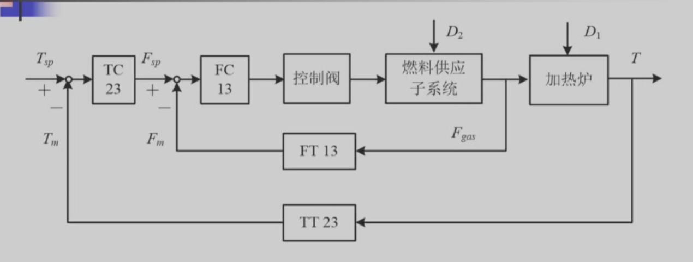

> 要注意副对象得写出来

## 串级控制系统的特性分析

- 在结构上，串级控制系统由两个闭环组成，“副回路”起“微调” 作用，主回路起“细调”作用
- 每个闭环都有各自的被控对象，控制器和测量变送器
- 调节阀由副控制器控制

- 串级控制系统仍是一个**定值控制系统**，与单回路定值控制系统具有相同的品质指标

### 副回路特性分析

> 最后有总结

- 副回路具有快速调节作用，能有效克服二次扰动的影响

  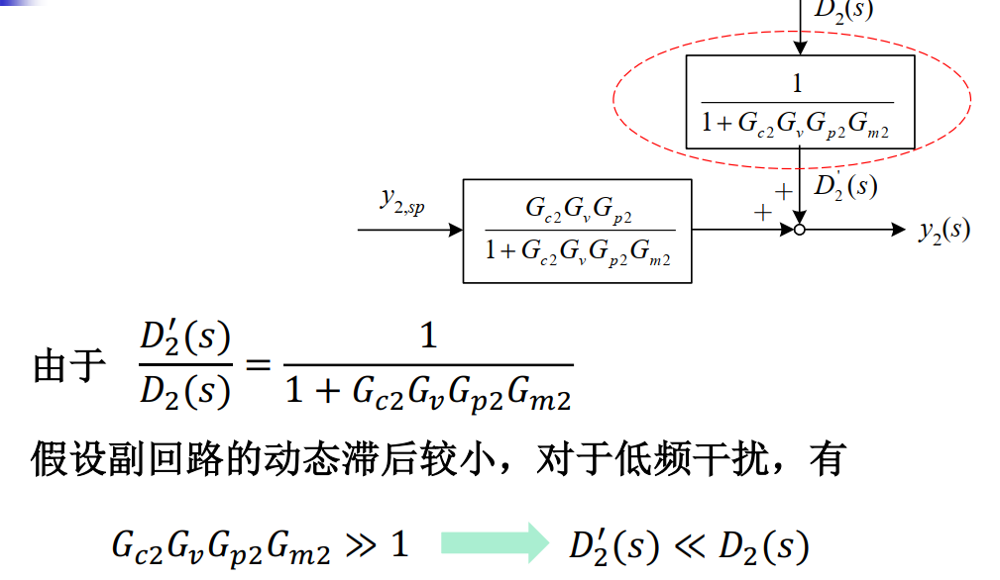

  副回路通常响应迅速，并能有效克服内回路干扰对主参数的影响

  副回路能显著减少控制阀与副对象的非线性

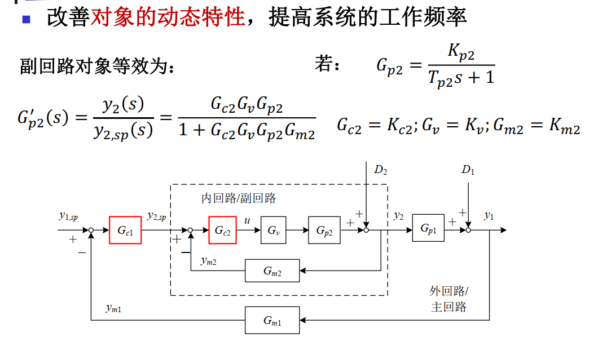

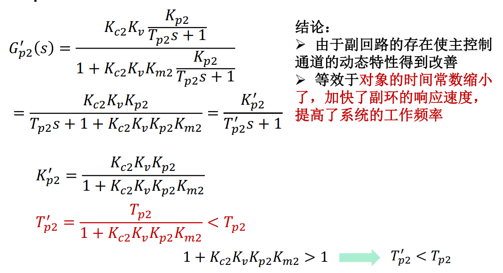

**等效于对象的时间常数缩小了， 加快了副环的响应速度，提高了系统的工作频率**

能克服副对象增益或调节阀特性变化对控制性能的影响（系统的“鲁棒性”增强）

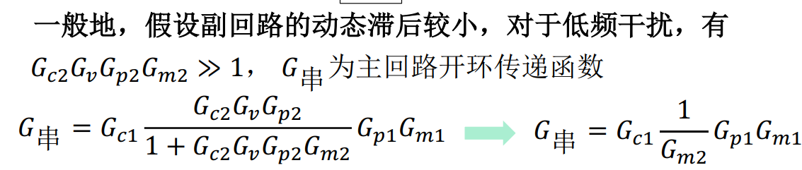

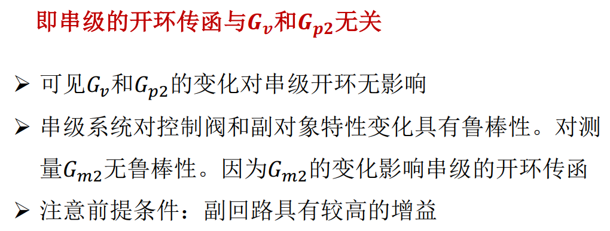

> 注意前提条件：上述等效要求，副回路具有较高的增益

**总结**

- 副回路具有快速调节作用，能有效克服二次扰动的影响
- 改善对象的动态特性，提高系统的工作频率
- 串级系统对控制阀和副对象特性变化具有鲁棒性。对测量$G_{m2}$**无鲁棒性**

## 串级控制的设计原理与副参数的选择

- 副参数的选择原则

  - 副回路就**包括主干扰，尽可能多的干扰**。充分发挥串级对进入副回路干扰有强的克服能力
  - 副回路的**滞后不能太大**，以保持副回路的快速响应。副回路滞后大，调节不及时，工作频率变慢，使主参数波动大

  > PPT上有个例子看看

  - 主副对象的时间常数要配合适当， 以防“共振” 

    

- 串级控制器类型选择

  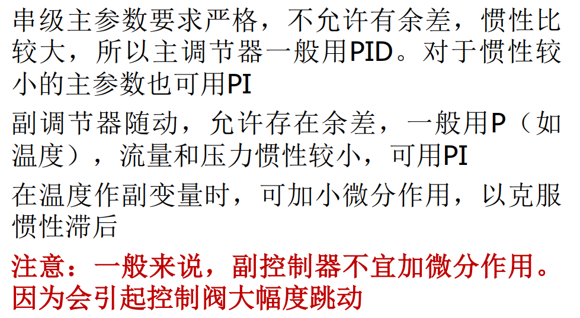

  - 副控制器（也称内回路控制器）通常采用PI控制律

    原因：需要对内回路干扰具有快速调节能力——强比例作用+弱积分作用

  - 主控制器通常选用PID控制律（液位串级控制除外）

    通常主对象的响应速度缓慢，并带有较显著的纯滞后，主控制器经常引入微分作用

## 串级控制器的实现与参数整定步骤

- 串级控制器正反作用确定

  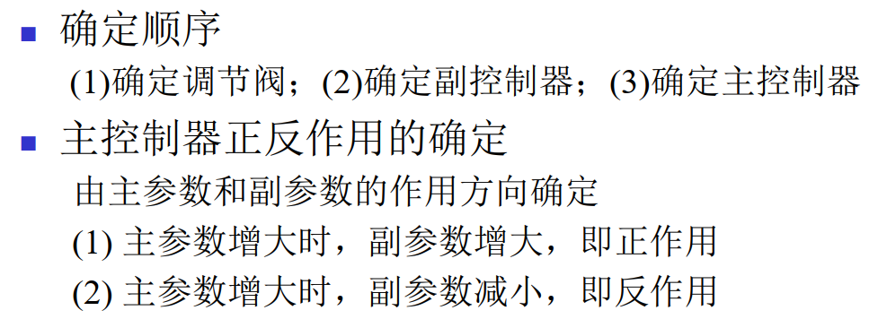

  

  > example：确定调节阀的气开、气关方式
  >
  > 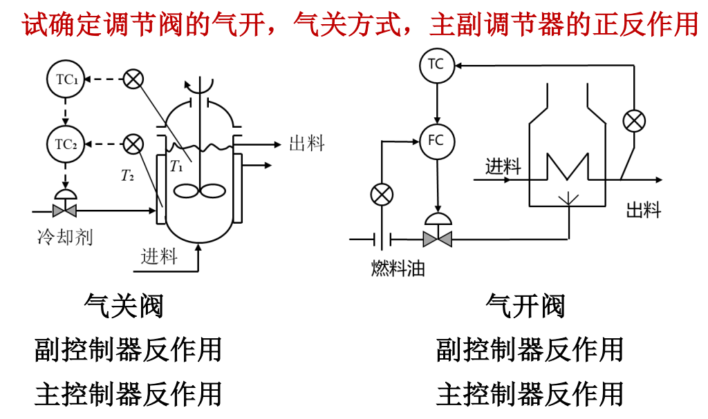
  >
  > 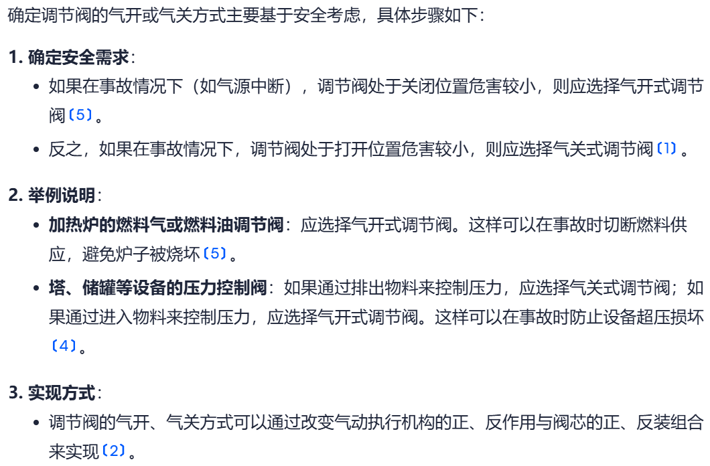

- 串级控制系统投运

  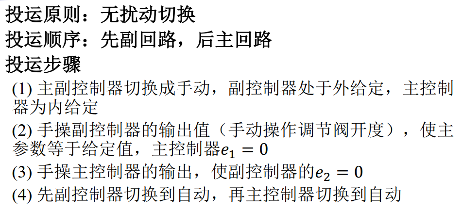

- 参数整定

  两步法：

  (1) 先整定副回路：主控制器“手动” ， 整定副控制器参数。 方法同单回路 

  (2) 再整定主回路：把副回路投“自动” ， 视为系统的“调节阀” ， 整定主控制器参数。 方法同单回路

  一步法：

  副回路根据经验进行设定， 然后闭环， 整定主回路

## 加热炉出口温度控制仿真举例

## 串级控制中的积分饱和现象及其防止

# 均匀控制

## 流量控制与液位控制系统

**流量回路的动态特性**

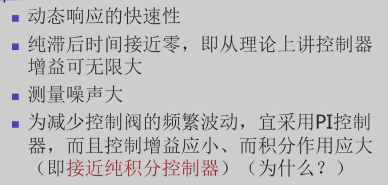

**宜用PI控制**

参数选择

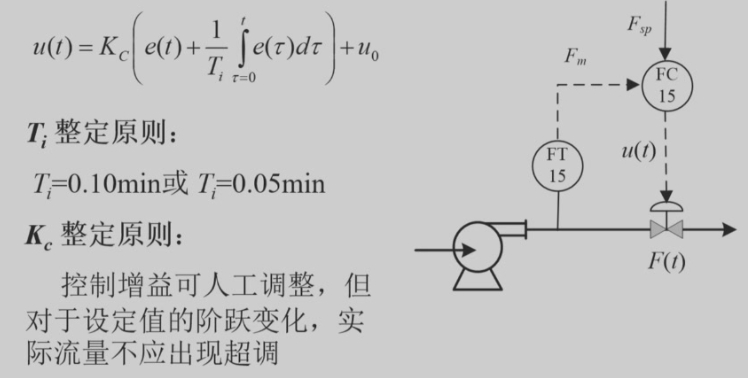

**液位回路的动态特性**


1. 常规液位控制

   

   分为自衡过程和非自衡过程（PI）

2. 液位均匀控制——均匀控制指的是**控制目的**， 而不是控制结构x

   

   如何实现：

   - 结构形式：单回路控制、串级控制、双冲量控制

   - 与传统的纯液位控制差异在于：液位控制器**参数的整定**上  

     推荐纯比例控制器（除在扰动去除后不要有稳态误差，不给I），不用D

## 均匀控制


我们要控制液位和流量同时缓慢变化（因此两个变量都会波动，没有一个变量会稳定在一个恒定的值），矛盾如何解决？

- 在两设备之间加缓冲罐：缓冲罐的积累量应与流量变化相适应

## 均匀控制方案设计

- 简单均匀控制

  

  结构与单回路控制相同，通过参数整定的不同来实现不同的目的

  为了协调液位与排出量之间的关系，使其在各自所允许的范围内缓慢而均匀地变化。

  一般采用**纯比例控制**，可适当引入积分

  应用场合：干扰小，控制要求低

- 串级均匀控制

  控制目的与串级不同，要求液位和流量都波动小——通过参数整定来实现

  不是为了提高液位的控制质量，是为了克服控制阀压力波动及自衡作用对流量的影响，使流量变化平缓

  

  应用场合: 阀前后压力波动显著；自衡作用显著

- 双冲量均匀控制

  

## 均匀控制参数整定

纯比例


比例积分


# 比值控制

ratio control

[双交叉限幅控制总结](https://blog.csdn.net/weixin_37928884/article/details/135566031)

## 概念

在各种生产过程中，时常需要保持两种物料成一定比例关系  

比值控制的目的，**就是为了实现使几种物料混合后符合一定比例关系使生产能安全正常进行**  

比值系统定义不是按其系统结构，而是按控制目的要求而定义。工程上，实现流量比值较多


## 比值控制方案

> 注意如何画图

- 定比值控制

  开环比值控制

  

  单闭环比值控制

  

  双闭环比值控制

  

- 变比值控制

  

## 设计、投运及整定


无扰动切换

## 比值系数


流量比值k（工艺上的比值）和设置于仪表得比值系数K
$$
k=\frac{Q_2}{Q_1}
$$
确定**比值器系数**

- 加开方器

  > 因为流量和压差的关系为$Q=c\sqrt{\Delta p}$

  

- 不加开放器

  
  $$
  k^2=\frac{Q_2^2}{Q_1^2}=\frac{(I_2-4)Q^2_{2max}}{(I_1-4)Q^1_{1max}},K=\frac{I_2-4}{I_1-4}=k^2\frac{Q^2_{1max}}{Q^2_{2max}}
  $$
  


## 比值控制实施方法

- 乘法器：

  

- 除法器：引入非线性

  

  除法器输入和输出的静态增益$\frac{dK}{dQ_A}$

## 动态跟踪

动态跟踪，加入动态补偿环节


# 数字PID控制器与集散系统


内部结构举例


常见数字滤波器

数字PID位置式


**增量式**——注意要写三个方程！


> 增量不容易产生累计误差？

增量式PID

##### 优点：

- **抗积分饱和**：增量式PID通过计算控制量的增量，避免了积分饱和问题。
- **无扰动切换**：在手动和自动模式切换时，增量式PID能实现平滑过渡，减少系统冲击。
- **计算量小**：只需计算控制量的变化，适合计算资源有限的系统。
- **对积分误差不敏感**：积分项的影响较小，系统稳定性更高。

缺点：

- **控制精度较低**：由于输出为增量，长期累积误差可能影响精度。
- **参数调节复杂**：参数调节相对复杂，需更多经验。

位置式PID

优点：

- **控制精度高**：直接输出控制量，长期控制精度更高。
- **参数调节直观**：参数调节相对简单，适合初学者。
- **适用于高精度系统**：如精密定位和温度控制等。

缺点：

- **积分饱和问题**：长时间误差累积可能导致积分饱和，影响系统响应。
- **计算量大**：需计算完整的控制量，对计算资源要求较高。
- **切换扰动**：手动和自动模式切换时可能产生扰动。

# 前馈控制

【过程控制复习课5】https://www.bilibili.com/video/BV1TB4y1S7PS?vd_source=93bb338120537438ee9180881deab9c1

反馈控制按偏差调节，是闭环控制，可克服多种不同干扰，常用控制规律PID，但是 **调节不及时**

前馈控制按扰动调节，是**开环控制**，**只能克服一种干扰**，用前馈控制规律， **调节及时**

前馈控制器**FFC**、

> 只用前馈会有很多问题
>
> 

## 概念


> 左图为反馈控制方案/右图为前馈控制方案


开环控制，补偿扰动 ，只能用在扰动量可以测量的场合

## 前馈原理

不变性原理和前馈补偿

- 前馈补偿

  

  可得前馈控制器公式如下：

  

- 不变性原理：前馈控制的理论基础

  “不变性” 是指控制系统的被控变量与扰动量完全无关， 或在一定准确度下无关

  

## 设计

定义：基于不变性原理的控制称为前馈控制，是一种按扰动进行补偿的开环控制，**不影响控制系统的稳定性**


- 线性前馈控制器的设计

  

  可得前馈控制器设计公式

  

- 静态前馈：前馈控制器输出只是干扰量的函数，与时间无关

  

- 动态前馈：不仅是干扰量的函数， 而且也是时间的函数

  校正作用不仅克服**静态误差**， 而且消除**动态误差**

  

- 前馈-反馈控制（FFC-FBC）

  控制精度高， 稳定速度快的特点

  

  

  这里没有管$R(s)$，也没有管$Y(s)$反馈回来那条路

  

- 前馈-串级控制

  

- 控制规律实施

  

## 物理可实现条件

- 不能有超前项
- 分母阶次>分子阶次

## 前馈反馈比较


开环调节，无稳定性问题

## 应用场合


无统一方法，原则只有一个，做到**无扰动切换**  

## 三冲量控制

- 单冲量：控制器仅有一个测量信号
- 双冲量：前馈+单回路反馈
- 三冲量：控制器有三个测量信号，前馈+串级控制

# 超驰控制与选择控制

1MV + 2CV：超驰控制与选择控制

超驰控制更强调在紧急情况下对正常控制的取代，而选择控制则更强调在多个控制方案中进行选择——都使用选择器

## 超驰控制

- 选择性控制的原理-超驰控制

  一般控制系统分为：物料平衡控制，质量控制，极限控制。超驰控制属于极限控制

  

  防超限的方法分为两种：硬保护+软保护

  

  超驰控制就是为实现软保护而设计的控制系统  

- 超驰控制问题：

  

  

- 选择控制方案设计

  选择控制系统设计的一个内容是确定选择器性质，**即使用低值选择器还是高值选择器**

  

  

  选择控制方块图

  

- 防积分饱和：限幅法， 外反馈法，积分切除法

  [在选择性控制系统中防止积分饱和的三方法](http://yunrun.com.cn/tech/5812.html)

  防积分饱和： 当某一控制器起作用时，让另一备用控制器的输出跟踪起作用控制器的输出，从而避免备用控制器的积分累加

## 实例分析

缓冲罐液位与流量控制的兼顾问题


- 引入自动开关SW

  

- 使用低选器

  

  

- 超驰控制中的抗积分饱和

  

  特点分析：只有处于闭环条件下的控制器才有积分作用，而非活动控制器只是跟踪活动控制器的输出  

  > RFB：外部积分反馈 (external reset feedback）  

  

# 分程控制与阀位控制

2MV + 1CV：分程控制与阀位控制

## 分程控制的概念


基本设计思想是：在分程控制系统中，仅有一个被控变量CV，但通常有两个操作变量MVs  


> 常规线性控制阀的特性：
>
> 
>
> 但是现在我们要实现一部分变化范围就能实现控制阀的全范围变化

于是得到分程控制的内部结构


## 分程控制实现

**双控制阀的分程组合**

分程控制系统根据控制阀开、 闭形式和分程区段的不同，可以分为以下三种情况

- 连续分程

  

- 间隙分程

- 重叠分程

    

阀门定位器实现分程控制


比值器+负荷分配器


分程控制的目的：

- 扩大可调比

  

  > 泄漏量是阀门关闭时的流量

- 工艺的特殊要求

  

  分程控制系统方块图：

  

  工作原理

  

  > 如果两个控制通道的增益差异过大，可能导致系统在不同的操作条件下表现出不同的动态特性，从而影响系统的稳定性。

  > 尽管2个控制通道均为正作用，但对于u(t)相同的改变量（如增大1%），冷却水控制通道的增益只有蒸汽控制通道的1/3  

  非线性补偿：重新设置分程控制切换点，使2个控制通道的增益相近  

  

## 分程控制的应用举例

间歇反应器与储罐气封控制


阀的组合特性：


eg：


## 阀位控制方案与应用举例

阀位控制vpc


要性能好还要节能

两个变量一个经济,一个反应迅速,所以常用反应迅速的来直接控制如下图的A,然后B连接阀位控制目的是使得A最后达到$V_{sp}$  --常为一个小值

- 阀位控制器的测量信号是TC的输出，阀位控制器的给定值$V_{sp}$决定着$V_A$的开度

于是我们得到如下控制方块图：


# 对象非线性增益补偿

- 非线性阀：等百分比阀或对数阀
  $$
  \frac{df}{dl} = K_f f
  $$
  

  仅对象特性近似线性且阀组比大于0.6采用线性阀，其他都用对数阀
  
- 控制通道的非线性及其补偿：串级控制的内回路补偿

  
  
  特点：串级控制能克服因$P_V$变化所导致的控制通道的非线性，但仍无法克服因$R_F$变化所引起的非线性。
  
- 变比值控制

  

- pH中和过程的非线性控制

  

- 非线性增益补偿

  

## 纯滞后过程控制

纯滞后补偿：Smith预估控制器器

[纯时滞系统控制——从Pade近似到Smith预估器](https://zhuanlan.zhihu.com/p/514058927)


上述是理想的Smith预估器，这种方法仅在模型非常匹配，时间常数一致的时候才能有优化效果，一旦不匹配，Smith预估器反而会导致发散。

因为建模不一定完全准确，下面介绍改进的Smith预估器，将$1-e^{-\tau_p s}$拆开，然后加上滤波器$G_f (s)$


# 内膜控制

内模控制器（Internal Model Control，简称IMC）

[串讲：控制理论：内模控制及模型预测控制（IMC、MPC)](https://zhuanlan.zhihu.com/p/150173254)

内模控制器之所以被称为“内模”，是因为它的结构中除了有控制器外，还包含了一个**过程模型**，即被控对象的数学模型。这个过程模型被嵌入到控制器内部，用**于预测被控对象的响应**，从而实现更精确的控制。

基本的内膜控制结构


控制器是内膜的逆——理想控制器不可实现


得到$G_c(s)$的分子阶次比分母高——加入一个静态增益为1的低通滤波器$G_f(s)$


完全的内膜控制结构


滤波器的作用


# 预测控制

# 多变量系统的关联分析

采用多个单回路控制/更复杂的控制方案（集中控制）

- 是否存在关联

  

- 是否可控？MVs是否能够控制CVs
  $$
  num(MV_s)\ge num(CVs)
  $$
  静态增益矩阵可逆时，系统可控

- 关联对单回路控制有怎样的影响

  - 多变量过程采用**单回路控制**

    配对：按照“**最大增益**”原则进行配对

    

    整定：

    将其中一个回路投入自动，第二个对象**手动**，对第一个对象进行阶跃响应动态测试

    第二个对象投入自动时对第一个对象及逆行阶跃响应动态测试

    

    

    反复整定几次直到每个回路都得到较好的性能——因为一次分别单独稳定一起自动不能得到较好的效果

    > 单回路控制与多回路控制存在差别的**根本原因**在于：广义控制对象的稳态与动态特性存在显著的不同。

- 如何表示关联的强度

  使用**相对增益矩阵（RGA）**对关联进行量化

  

  > 其它被控量相当于使用多单回路控制其它控制器都处于A模式

  
  $$
  相对增益\lambda_{ij}=\frac{开环增益p_{ij}}{闭环增益q_{ij}}
  $$
  eg:

  

  或者不这样记公式，直接按下述步骤计算：

  

  传递函数矩阵计算相对增益

  

  注： “●” 表示两矩阵元素相乘，并非矩阵相乘。
  $$
  \lambda_{ij}<0:稳态增益的符号随着其它回路状态的改变（开环、闭环）而不同
  $$

  $$
  \lambda_{ij}=0:当其它回路都开环时，稳态增益为0
  意味着在所有其他操纵变量都保持恒定时，CV不受MV;影响，因而不能用MV;来控制CV;。
  $$

  $$
  0<\lambda_{ij}<1:其它回路闭环时的稳态增益比开环时要大
  $$

  $$
  \lambda_{ij}=1:其它回路的开环与闭环对稳态增益的大小没有影响。
  $$

  $$
  \lambda_{ij}>1:其它回路开环时的稳态增益比闭环时要大。
  $$

  计算得到$\Lambda$保证行、列之和均为1，且主对角线元素均>0——如果不>0则换行/换列即可，此时K矩阵要同样换

- 如何设计多回路控制系统

  多变量系统的配对原则：Bristol (1966) ：为减少回路间的关联，选择的变量配对，应使其对应的相对增益尽可能接近１，须避免负值。

  

  先快后满，先重要后次要
  
- 如果没有明确的配对关系，则需要考虑如下的解耦控制

## 多变量系统的解耦控制

解耦器设计方法

设计解耦器以消除两回路间的交叉作用

- 串级解耦器

  

  2×2耦合系统的串级解耦器

  

  

- 前馈解耦设计方案

  

  

- 非线性稳态全解耦器设计原理

  

  

# 复习

- [控院 自动化专业 过程控制课程 20级回忆卷 - CC98论坛](https://www.cc98.org/topic/5508716)

