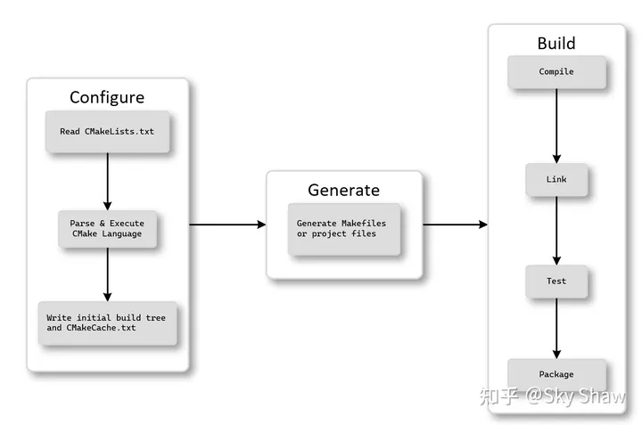
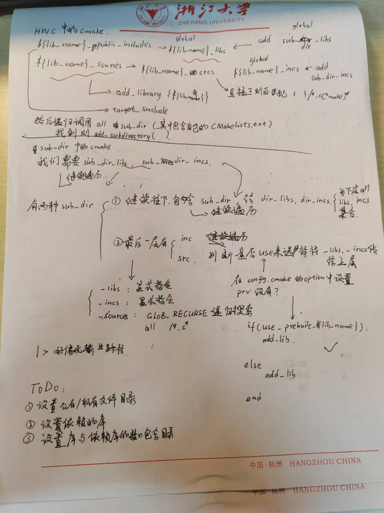

# Main Takeaway

记录笨人学习CMake的过程，对CMake形成一个初步的认识并且掌握CMake的基本语法。

CMake实践[CMake Practice.pdf (ncnynl.com)](http://file.ncnynl.com/ros/CMake Practice.pdf)

# 简介

CMake是服务于将源代码转换成可执行的文件的工具。本身是一个**工具集**由五个可执行的程序组成：cmake、ctest、cpack、cmake-gui和ccmake

- cmake用于在构建项目的第一步，进行项目的配置、生成和构建项目的主要可执行文件的工作。
- ctest用于运行和报告测试结果的测试驱动程序。
- cpack用来生成安装程序和源包的打包程序。
- cmake-gui是 cmake 的图形界面。
- ccmake（注意ccmake比cmake多了一个c）也是用于图形界面，与cmake-gui不同的地方在于ccmake是基于控制台（terminal）的图形界面

CMake就是“协调器”——它清楚哪些步骤需要完成，理解最终目标是什么，以及忙碌于为构建工作找到合适的“工人”和“材料”。**这个过程有三个阶段：配置、生成、构建阶段**



其实使用纯粹依靠 cmake 本身提供的基本指令来管理工程是一件非常复杂的事情，所以， cmake 设计成了可扩展的架构，可以通过编写一些通用的模块来扩展 cmake.  

## 设计初衷

设计、编码和测试。在更改了代码之后，工具将以智能的、快速的、可扩展的方式，在不同的操作系统和环境中以相同的方式工作。支持多个集成开发环境(IDE) 和持续集成(CI) 流水，这些流水在更改提交到代码库后，就能对代码进行测试。

> 两个概念需要区分：<build tree> 和<source tree>，分别对应构建树和源码树；构建树是目标/输出目录的路径，源码树是源码所在的路径。

## cmake的编译方式

- 内部构建(in-source-build)
- 外部构建(out-of-source-build)

两者的区别仅仅是前者将生成的编译文件和源代码、CMakeLists.txt混杂在一起，后者就只是创建了一个文件夹存储生成的编译文件，更好删除编译生成的文件而已（直接删文件夹）。


## 简单理解

在 CMake 中，`library`、`source`、`include` 和 `dependency` 是构建系统不同方面的术语

- `library`：库是一组可重用的代码，可以被链接到其他目标（如可执行文件）中使用。在 CMake 中，可以使用 `add_library` 命令来添加一个库

- ``source`：源文件是包含源代码的文件，如 `.cpp`、`.c`、`.h` 等。在 CMake 中，源文件是构成库或可执行文件的基本单元。

- `include` ：含目录是头文件所在的目录。在 CMake 中，可以使用 `include_directories` 或 `target_include_directories` 命令来设置包含目录，以便在编译时找到所需的头文件

-  `dependency`：依赖项是指一个目标在构建时所依赖的其他目标或库。在 CMake 中，可以使用 `target_link_libraries` 命令来指定目标的依赖项，以便在链接时将依赖项链接到目标中

- 接口包含目录（INTERFACE_INCLUDE_DIRECTORIES）是 CMake 中用于定义接口库（Interface Libraries）的一部分2。接口库是一种特殊的目标，它不直接编译成二进制文件，而是用来传递使用要求（如编译选项、定义、包含目录等）给其他目标（如可执行文件或库）

  ```
  # 定义一个接口库
  add_library(my_interface INTERFACE)
  
  # 设置接口库的包含目录
  target_include_directories(my_interface INTERFACE ${CMAKE_CURRENT_SOURCE_DIR}/include)
  
  # 定义一个可执行文件
  add_executable(my_app main.cpp)
  
  # 链接接口库到可执行文件
  target_link_libraries(my_app my_interface)
  ```

  ```
  target_include_directories(
          ${lib_name}
          INTERFACE $<TARGET_PROPERTY:${depend_lib},INTERFACE_INCLUDE_DIRECTORIES>
        )
        # 将目标的接口包含目录设置为依赖库的接口包含目录
        # 这样，当其他目标链接到该目标时，它们会自动获得依赖库的包含目录，而无需在每个目标中重复定义（好用的）
  ```

  - **`PUBLIC`**: 适用于库在源文件和头文件中都使用某个依赖项，并且希望将该依赖项传递给其他依赖于该库的目标。

  - **`INTERFACE`**: 适用于库只是作为接口或包装器，将另一个目标的功能暴露给其他目标，而库本身不使用该依赖项。

    > 一般将`PUBLIC`和`INTERFACE`都加上

  - **`PRIVATE`**: 适用于库只在自己的源文件中使用某个依赖项，而不希望将该依赖项传递给其他依赖于该库的目标。

[CMake引入第三方库：从头文件到库文件的全面指南](https://developer.baidu.com/article/details/3282115)

## 第三方库

要包含第三方库需要

1. 先找这个库`find_package(name REQUIRED)`

   > 先找到这个库

2. 然后告诉第三方库的**头文件**所在目录`include_directories()`

   > 用于编译成功

3. 再然后告诉CMake库文件所在的目录(.a,.so)`link_directories()`

   > 用于链接成功

4. 最后需要告诉CMake需要链接哪些库文件`target_link_libraries()`


# Cmake_Practice

在Cmake实践中，一共完成了6个小项目，涉及Cmake基本内容。想要进一步深入Cmake需要去看别人完整的好的Cmake开发框架。


## cmake 常用变量和常用环境变量

直接看PDF里面

> 养成喜欢进行外部编译(out-of-source build) 而不是in-source build


# HW中的cmake

在HWC中的cmake

在`function_tools.cmake`中定义了一些函数。一下是一些要掌握的基础语法

## 基础语法

[cmake：CMAKE_CURRENT_SOURCE_DIR与CMAKE_SOURCE_DIR_cmake source dir](https://blog.csdn.net/zhizhengguan/article/details/120177981)

```
function(<name> [<parameters> ...])
  # 函数体
  # 可以包含任意数量的 CMake 命令
  # 使用 set(<parameter> ... PARENT_SCOPE) 将值返回到调用者的作用域
  # 注意加PARENT_SCOPE
endfunction()
```

```
file(GLOB <variable> [<options>] <globbing_expressions>...)
# 用于在指定目录中匹配文件名，并将其存储在变量中。
file(GLOB_RECURSE ...)
# 它会遍历指定目录及其所有子目录，并将所有匹配指定模式的文件存储在指定的变量中
```

```
add_dependencies 是 CMake 中的一个命令，用于在顶级目标之间添加依赖关系，以确保它们在正确的顺序下构建
它的作用是指定一个目标在被构建之前，必须等待一个或多个其他目标先被构建，从而确保构建顺序的正确性
```

```
include 指令用于将其他 CMake 文件包含到当前文件中
```

```
option(<option_variable> "description" [initial value])向用户显示一个选项，并允许用户在配置项目时启用或禁用该选项。
```


## 基本思想

就是把底层的文件夹当一个lib，一层层遍历下去再通过全局变量传回去

> 使用 set(<parameter> ... PARENT_SCOPE) 将值返回到调用者的作用域


## 整体逻辑



写组件库只需要改三个部分

- 设置共有/私有文件目录

- 设置当前库的依赖库

- 设置库域依赖库的接口包含目录

  


# References

- [CMake入门笔记系列（一）：CMake编译过程详解 | Micro CMake for C++ - 知乎 (zhihu.com)](https://zhuanlan.zhihu.com/p/620839692)

- [cmake使用示例与整理总结-CSDN博客](https://blog.csdn.net/QTVLC/article/details/82380413)

- CMake实践[CMake Practice.pdf (ncnynl.com)](http://file.ncnynl.com/ros/CMake Practice.pdf)