# Main Takeaway

计算机视觉CV——computer vision


<!--more-->

50% hw + 50% 期末

作业提交

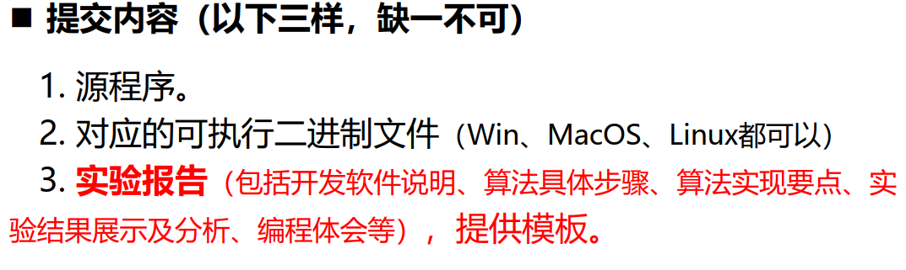

references

- [7_1_相机校准 - OpenCV中文官方文档 (woshicver.com)](https://www.woshicver.com/Eighth/7_1_相机校准/)
- [jash-git/Learning-OpenCV-3: 《Learning OpenCV 3》學習OpenCV 3 範例/電子檔備份 (github.com)](https://github.com/jash-git/Learning-OpenCV-3)

# Contents

[TOC]


# Intro

opencv 4.x 全面采用C++

[数字图像处理-Digital Image Processing(DIP)](https://blog.csdn.net/LIWEI940638093/article/details/105744116)


- https://www.cc98.org/topic/5231792)
- opencv tutorial
  - 基本的图像/视频操作
  - 结构分析
  - 摄像头定标
  - 运动分析
  - 目标识别
  - 基本的GUI


what is an image

- binary: 0-black,1:white
- gray scale
- color: rgv,hsv——“vector-valued” function: 

Gestalt laws


1. **Law of Proximity**: Elements that are close to each other are perceived as a group. For example, a cluster of dots is seen as a single group rather than individual dots.
2. **Law of Similarity**: Similar elements (in shape, size, color, etc.) are perceived as belonging together. For instance, a grid of squares and circles will be seen as rows or columns of similar shapes.
3. **Law of Closure**: People tend to perceive incomplete shapes as complete. Even if parts of a shape are missing, the mind fills in the gaps to perceive a whole object.
4. **Law of Continuity**: Elements that are arranged on a line or curve are perceived as more related than elements not on the line or curve. This principle helps in perceiving smooth, continuous lines rather than abrupt changes.
5. **Law of Common Fate**: Elements that move in the same direction are perceived as a group. This is particularly relevant in dynamic visual displays, such as animations.
6. **Law of Prägnanz (Good Figure)**: People perceive objects in the simplest form possible. This principle suggests that we tend to see the most straightforward and stable arrangement of elements.
7. **Law of Figure-Ground**: People instinctively perceive objects as either being in the foreground or the background. The figure is the main object of focus, while the ground is the background.

# Edge Detection

## 概念

Origin of Edges

- surface normal discontinuity  表面法线
- depth discontinuity
- surface color discontinuity
- illumination discontinuity

Edge detection  ：Identify sudden changes (discontinuities) in an image

> 求导：一阶局部极值/二阶过零点——但是有噪声的影响

## 用模板实现卷积

用模板(Template/Kernel，实质为系数矩阵)来对图像做卷积（convolution）


因为超出图像边界，所以resulting image一般会小一点

**Sobel 算子（水平方向）：**

text


```text
-1  0  1
-2  0  2
-1  0  1
```

**Sobel 算子（垂直方向）：**

text


```text
-1 -2 -1
 0  0  0
 1  2  1
```

通过将图像分别与水平和垂直方向的Sobel算子进行卷积，然后取两个结果的平方和的平方根，可以得到图像的边缘信息。

2. 模糊

模糊操作用于减少图像中的细节，使图像看起来更柔和。以下是使用均值滤波器进行模糊的示例：

**均值滤波器（3x3）：**

text


```text
1/9  1/9  1/9
1/9  1/9  1/9
1/9  1/9  1/9
```

通过将图像与均值滤波器进行卷积，可以实现简单的模糊效果。

3. 锐化

锐化操作用于增强图像中的细节，使图像看起来更清晰。以下是使用拉普拉斯算子进行锐化的示例：

**拉普拉斯算子（3x3）：**

text


```text
 0  -1   0
-1   4  -1
 0  -1   0
```

通过将图像与拉普拉斯算子进行卷积，然后将结果与原图像相加，可以实现锐化效果。

4. 浮雕效果

浮雕效果可以使图像看起来具有立体感，以下是使用浮雕滤波器实现浮雕效果的示例：

**浮雕滤波器（3x3）：**

text


```text
-1  -1  0
-1   0  1
 0   1  1
```

通过将图像与浮雕滤波器进行卷积，然后将结果加上一个偏移量（如128），可以实现浮雕效果。


## 基于一阶导数的边缘检测

[图像处理——4个坐标系及相关转换图像像素坐标系 图像物理坐标系 相机坐标系 世界坐标系_图像坐标系](https://blog.csdn.net/MengYa_Dream/article/details/120233806)

梯度，连续的情况如下


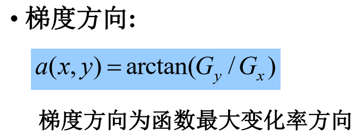

离散化：使用差分近似偏导数


一般使用卷积模板进行计算


- Roberts交叉算子——2*2梯度算子

  

- Sobel算子——3*3梯度算子

  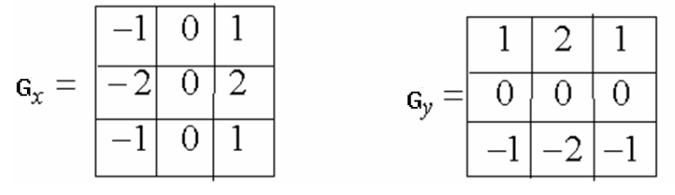

- Prewitt算子——3*3梯度算子，运算较快

  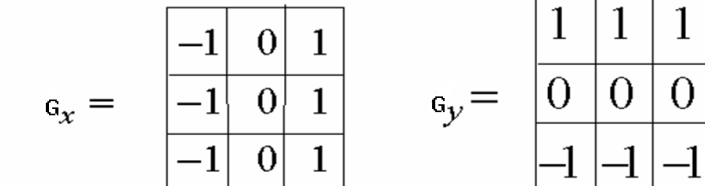

- 均值差分——一定邻域内灰度平均值之差

  

## 基于二阶导数的边缘检测

图像灰度二阶导数的过零点对应边缘点

- 拉普拉斯（Laplacian）算子

  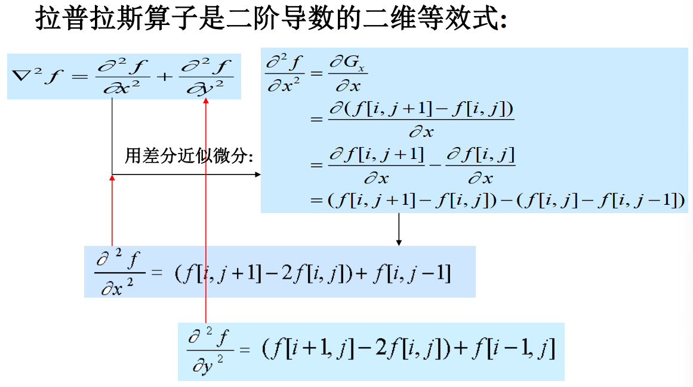

  表示为卷积模板

  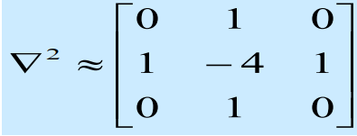

  邻域中心点具有更大权值的近似算子

  

- LoG边缘检测算法（LoG = Laplacian of Gaussian ）

   高斯滤波+拉普拉斯边缘检测

  

  经过推导得到LoG算子

  

  两种等效计算方式

  - 图像与高斯函数卷积，再求卷积的拉普拉斯微分
  - 求高斯函数的拉普拉斯微分，再与图像卷积

## Canny边缘检测

canny梯度较大的地方留下来，然后看周围和自己相似的像素也留下来

算法步骤：

1. 用高斯滤波器平滑图像
2. 用一阶偏导有限差分计算梯度幅值和方向
3. 对梯度幅值进行非极大值抑制（NMS）
4. 用双阈值算法检测和连接边缘

以下对每步进行说明和解释

- 用高斯滤波器平滑图像——why 高斯滤波器

   平滑去噪和边缘检测是一对矛盾，应用高斯函数的一阶导数，在二者之间获得最佳的平衡

  

- 一阶偏导差分计算梯度幅值和方向

  

- 非极大值抑制（NMS，Non-max Suppression）  

  NMS：找到局部极大值，并筛除（抑制）邻域内其余的值

  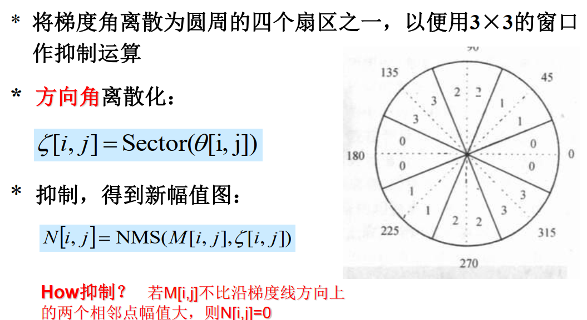

  1）将其梯度方向近似为以下值中的一个，包括0、45、90、135、180、225、270和315，即表示上下左右和45度方向。——简单，但效果不一定最好

  2）比较该像素点和其梯度正负方向的像素点的梯度强度，如果该像素点梯度强度最大则保留，否则抑制（删除，即置为0）

- 双阈值化并边缘链接

  - 取高低两个阈值(T2, T1)作用于新幅值图N[i,j]， 得到两个边缘图：高阈值和低阈值边缘图
    $$
    高阈值图:N[i,j]>T2\\低阈值图:N[i,j]>T1
    $$

  - 连接高阈值边缘图，出现断点时，在低阈值边缘图中的8邻点域搜寻边缘点

  > 阈值太高会出现部分轮廓丢失，阈值太低可能是假边缘
  >
  > 选用两个阈值: 更有效的阈值方案


# Curves

## 曲线表示


曲线的离散化


## 曲线拟合

曲线拟合：给定一系列边缘点，设法找到一条曲线的函数表达式，通过调整参数尽量使该曲线接近所有的边缘点以描述对象的轮廓

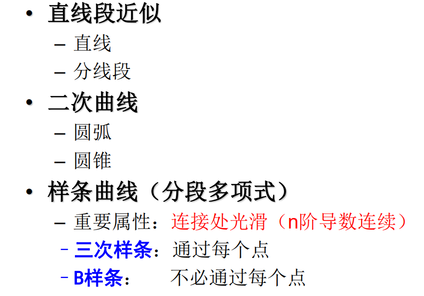

- 解析法：用p个边缘点。（缺点：不鲁棒）

- 回归法：用全部观测值来逼近（最小二乘法）

## Hough变换

- Hough变换是基于投票(Voting)原理的参数估计方法——形状检测技术

- 解决问题：从图像中识别几何形状（如直线、圆、椭圆等）的图像处理方法。它**特别适用于处理有噪声或部分缺失的图像**，能够有效地检测出图像中的形状，即使这些形状存在断裂或旋转的情况
- 基本思想：图像中每一点对参数组合进行表决，组合为胜者 (结果)赢得多数票的参数

### 直线检测

- 直线检测Hough变换

  参数空间——常用极坐标（避免垂直直线带来的问题，范围有限制）

  [霍夫变换(Hough Transform)详解](https://zhuanlan.zhihu.com/p/645074162)

Hough变换算法


### 圆弧检测


### 评价

- 参数空间离散化：精度低/高
  - 低：集合形状不准确；丢失细节；噪声敏感
  - 高：计算复杂度增加；过拟合；难以全局最优解（可能多个局部峰值）
- 与RANSAC算法的比较
  - 相似
    1. **目的**：Hough变换和RANSAC算法都是用于从包含噪声和异常点的数据集中提取几何形状（如直线、圆等）的算法11。
    2. **鲁棒性**：两者都对噪声和异常点具有一定的鲁棒性，能够从不完美的数据集中提取出有用的几何信息11。
    3. **应用场景**：它们在计算机视觉领域都有广泛的应用，特别是在图像处理、目标检测和模式识别等领域
  - 差别
    1. **基本原理**：
       - **Hough变换**：是一种数学上的变换，将原空间中的点映射到参数空间中。通过在参数空间中寻找峰值，来检测原空间中的几何形状7。
       - **RANSAC算法**：是一种迭代的模型选择算法，通过随机采样数据点并拟合模型，然后评估模型与剩余数据点的一致性，来找到最佳的模型8。
    2. **处理方式**：
       - **Hough变换**：对原空间中的每个点，在参数空间中对应的线上进行“投票”，通过寻找投票的峰值来检测几何形状7。
       - **RANSAC算法**：通过随机采样数据点并拟合模型，然后评估模型与剩余数据点的一致性，来找到最佳的模型。它会丢弃与模型不一致的数据点（异常点）8。
    3. **适用性**：
       - **Hough变换**：适用于检测特定的几何形状，如直线、圆等。它对形状的参数化有明确的要求7。
       - **RANSAC算法**：适用于各种类型的模型拟合问题，不限于特定的几何形状。它对模型的形式没有特定的要求，只要能够通过数据点拟合出模型即可8。
    4. **计算复杂度**：
       - **Hough变换**：计算复杂度较高，特别是对于高维的参数空间。它需要对原空间中的每个点进行参数空间的映射和投票7。
       - **RANSAC算法**：计算复杂度相对较低，特别是对于简单的模型。它只需要进行有限次的随机采样和模型拟合8。
    5. **结果解释**：
       - **Hough变换**：结果是参数空间中的峰值，需要进一步解释为原空间中的几何形状7。
       - **RANSAC算法**：结果是最佳的模型参数，可以直接用于解释原空间中的数据


# Image Local Feature

SIFT  尺寸不变特征变换（Scale Invariant Feature Transform）


## Feature detection

- Harris corner detector

  - 基本思想：用一个小窗来看图像，当移动时小窗内图像改变会非常大

    

  - Mathematics：

    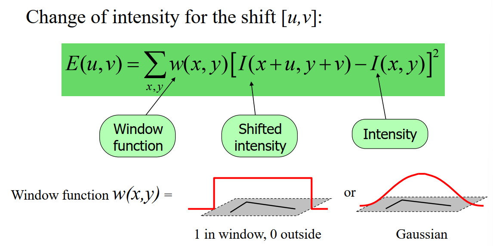

    近似等价

    


**二次项函数本质上就是一个椭圆函数**

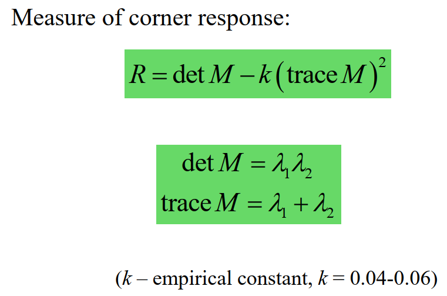

- Corner response R is invariant to image rotation
- Partial invariance to affine intensity change  

- But: non-invariant to image scale!  [特征检测子 -- Harris & LoG & DoG 高斯金字塔_log金字塔](https://blog.csdn.net/Eli_Young/article/details/104445318)

  Scale Invariant Detection：见下

> 一幅图像的尺度空间可被定义为原图像与可变尺度的高斯核卷积

那么如何在不同图像上找到的点是匹配的点

要解决scale的问题


用一个函数来寻找每张图片合适的window size——LoG

Scale Invariant Detectors

- Harris-Laplacian

  使用LoG算子，具有尺度不变性

  对于二维图像，计算图像在不同尺度下的离散拉普拉斯响应值，然后，检查位置空间中每个点。如果该点的拉普拉斯响应值都大于或小于其他26个立方空间邻域的值，那么该点就是被检测到的图像斑点

  LoG具有尺度不变性，但是要对高斯函数求二次导，计算量大。能不能简化LoG算子呢？——使用DoG算子（Difference of Gaussians）

  SIFT算法建议，在某一个尺度上对斑点的检测，可以通过对两个相邻高斯尺度空间的图像相减，得到一个DoG (Difference of Gaussians)的响应值图像
  

  Discard points with DOG value below threshold (low contrast)  

  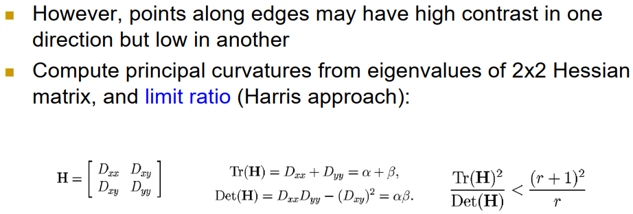

  去除edge

  

- SIFT

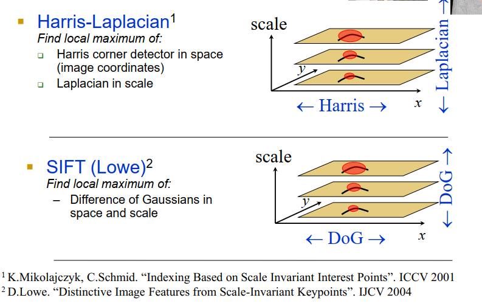


## Feature descriptors

SIFT算法是一种用于检测和描述图像中局部特征的算法。

[图像特征匹配方法——SIFT算法原理及实现](https://blog.csdn.net/qq_40369926/article/details/88597406)

Global histogram

SIFT:Scale Invariant Feature Transform    descriptor在梯度上做

SIFT算法可以的解决问题：

1. 目标的旋转、缩放、平移（RST）
2. 图像放射/投影变换（视点viewpoint）
3. 光照影响（illumination）
4. 部分目标遮挡（occlusion）
5. 杂物场景（clutter）
6. 噪声


- 图像尺度空间：因为scale的变化，我们希望计算机对物体在不同尺度下有一个统一的认知，就要考虑图像在不同尺度下都存在的特点

- 多分辨率金字塔：不同尺度（塔的每层）下做不同分辨率的高斯滤波

  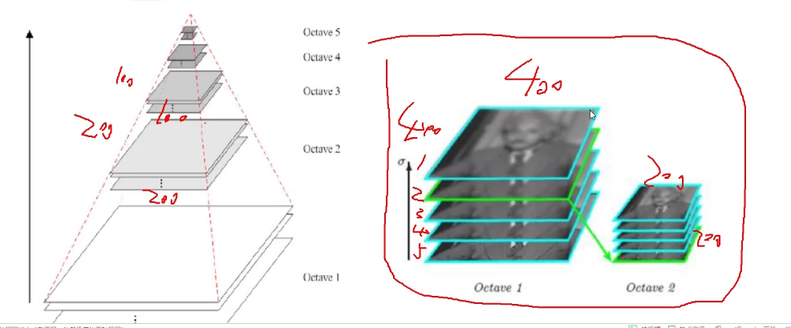

  有价值的东西：不同分辨率下不同的地方，因此我们有高斯差分金字塔（DOG）

- 高斯差分金字塔（DOG）：得到多层

  

  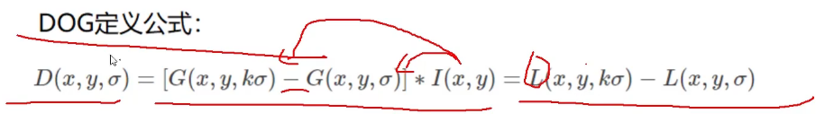

- DoG空间极值检测：找出极值点

  特征点是由DOG空间的局部极值点组成的。为了寻找DOG函数的极值点，每一个像素点要和它所有的相邻点比较，看其是否比它的图像域和尺度域 的相邻点大或者小

  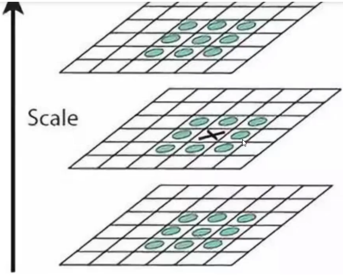

  中间的检测点和它同尺度的8个相邻点和上下相邻尺度对应的9×2个 点共26个点比较，以确保在尺度空间和二维图像空间都检测到极值点——keypoint

  得到一堆离散的点——不一定全是真正的极值点

  

- 关键点的精确定位

  对检测到的离散的点，对尺度空间DoG函数进行曲线拟合，计算其极值点，从而实现关键点的精确定位——利用泰勒级数进行展开

  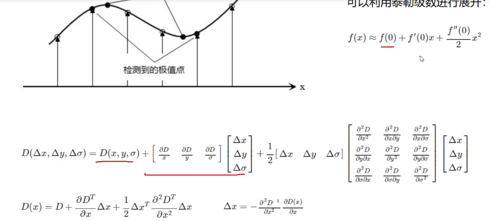

  求导令导数=0

  

- 消除边界响应

  DOG算子有较强的边缘效应，边缘点的特征表现：某个防线有较大的主曲率，而其垂直方向主曲率较小

  > 边缘效应是指在图像处理中，由于滤波器的应用，图像边缘区域的像素值受到不完整邻域的影响，导致这些区域的响应与图像内部区域的响应不同

  

  消除完后我们就得到了真正的最后的关键点，下面要对得到的关键点进行描述

- 特征点的主方向

  

  - **关键点邻域**：对于每个检测到的关键点，选择一个以关键点为中心的局部区域（通常是一个圆形区域，半径为 3×1.5σ\，其中 σ 是关键点的尺度）。

- 生成特征描述

  在完成关键点的梯度计算后，使用直方图统计邻域内像素的梯度和方向

  

  这样可以确定主方向

  

  > 当有多个方向近似时，我们可以把关键点复制成多份然后将方向分别赋给复制后的特征点——多峰值情况。每一份复制后的关键点具有相同的位置和尺度，但分配了不同的主方向

  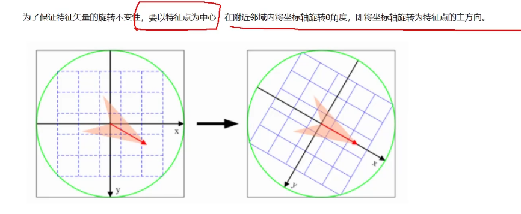

  

  保证旋转不变性——预处理已经完成

  - **旋转归一化**：在生成描述子时，将关键点邻域的梯度方向相对于主方向进行旋转归一化。这意味着描述子是基于关键点的局部坐标系生成的，而不是基于图像的全局坐标系。

  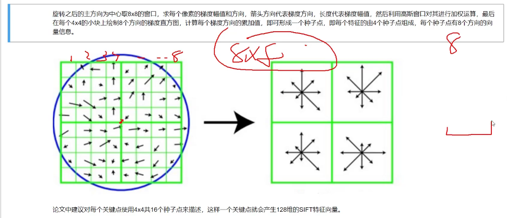

  128=16*8维的SIFT特征向量

  

- SIFT特征的匹配——度量两幅图像中关键点的相似性
  $$
  ratio=\frac{最近邻距离}{次近邻距离}
  $$
  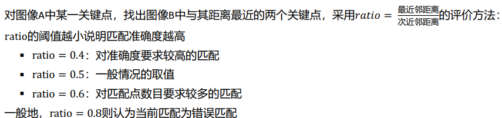

- 优点
  - 尺度/光照/旋转不变性
  - 在刚体的表征上尤其有效
  - 局部表征能力强
  
- 缺点
  - 耗时
  - 处理非刚性边缘时表现较差
  - 严重的仿射扭曲下效果较差

- 为什么使用梯度消息
  - 梯度信息反映了图像中像素值的变化方向和强度，能够捕捉图像中的边缘、角点和其他局部结构特征。使用梯度信息的好处包括：
    - **局部特征捕捉**：梯度信息能够有效地描述图像中局部区域的形状和纹理特征。
    - **对光照变化鲁棒**：梯度是像素值的相对变化，对光照的线性变化不敏感。
    - **计算简单高效**：梯度计算是一种简单且高效的操作，适合实时应用。
  - 好处
    - **对旋转不变性的支持**：通过梯度方向，可以为关键点分配主方向，使得描述子能够相对于关键点的方向进行归一化。
    - **对尺度变化的鲁棒性**：梯度信息在高斯金字塔的不同尺度上计算，使得描述子对尺度变化具有鲁棒性。
    - **对噪声的鲁棒性**：梯度信息在高斯平滑后的图像上计算，能够减少噪声的影响。


## Image stitching

[机器视觉笔记：RANSAC算法以及思想_ransac 参数](https://blog.csdn.net/qq_20518383/article/details/107432913)

RANSAC算法就是一种剔除离群点的很好的一种方法

Procedure: 

1. Detect feature points in both images

   - 检测关键点
   - 建立SIFT描述子

2. Find corresponding pairs

   - 匹配SIFT描述子

     Euclidean distance between descriptors  ?

3. Use these pairs to align the images

   - 计算转化矩阵

     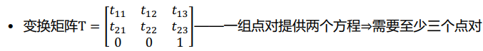

   - RANSAC提高求解准确度

4. Image Blending

  采用Pyramid Blending——还有更好的blending方法

### RANSAC

- 解决问题：用于从包含噪声和异常值的数据集中估计数学模型的参数

- 核心思想：通过**随机采样和一致性检验**来估计模型参数，从而从包含噪声和异常值的数据集中恢复出正确的模型

  > 一致性检验的目的在于比较不同方法得到的结果是否具有一致性s

- 与最小二乘相比

  - 最小二乘法是一种通过最小化误差的平方和来拟合模型的方法。它**假设所有数据点都符合模型**，并试图找到使所有数据点误差平方和最小的模型参数
  - 它通过随机采样和一致性检验，能够有效地排除外点对模型估计的影响
  - RANSAC算法能够从多个模型中选择出最佳的模型，而最小二乘法通常只能拟合一个模型
  - RANSAC算法最多可以处理50%的外点情况，而最小二乘法在数据中存在大量异常值时，拟合结果会受到严重影响

- 缺点：

  - RANSAC算法需要进行大量的随机采样和模型估计，计算复杂度较高
  - 需要设置多个参数
  - RANSAC算法要求模型已知，且模型参数可以通过内点来估计，这限制了其应用范围

- 与Hough变换相比

  - 共同之处：都用于从包含噪声和异常值的数据集中提取几何形状或模型参数。它们都旨在提高模型拟合的鲁棒性，能够处理数据中的噪声和异常值

    两者在计算机视觉和图像处理领域都有广泛的应用

    具有一定的鲁棒性，能够从不完美的数据集中提取出有用的几何信息

  - 差异

    - Hough投票选择

      适用于检测特定的几何形状，如直线、圆等。它对形状的参数化有明确的要求，需要将形状表示为参数空间中的曲线

      结果是参数空间中的峰值，需要进一步解释为原空间中的几何形状

    - **RANSAC**：通过随机采样和一致性检验来拟合模型，它会丢弃与模型不一致的数据点（异常点）

      适用于各种类型的模型拟合问题，不限于特定的几何形状。它对模型的形式没有特定的要求，只要能够通过数据点拟合出模型即可

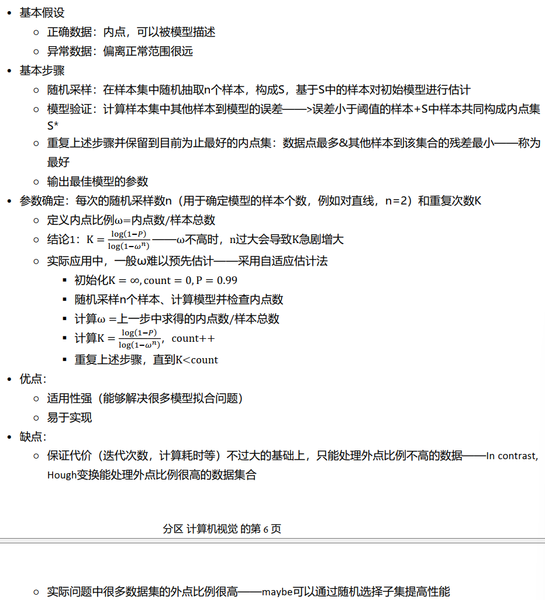

- outlier比例给定的情况下，k次采样后成功的概率是
  $$
  1-(1-w^n)^k
  $$
  

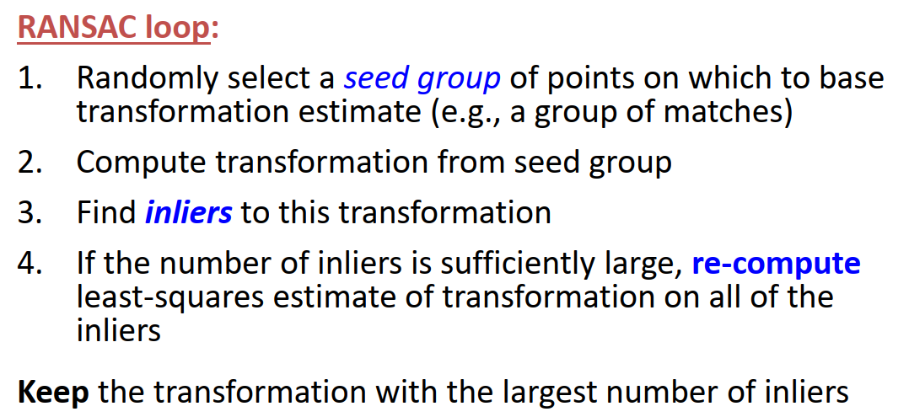


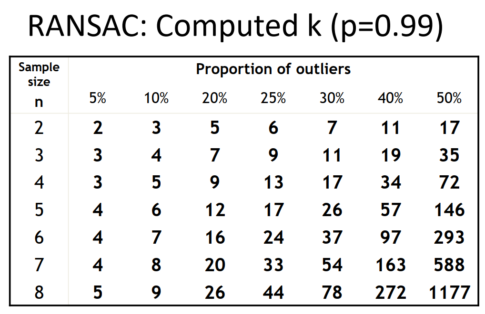


### 金字塔

[你真正了解图像金字塔吗？详细介绍拉普拉斯金字塔和高斯金字塔（pyrDown() and pyrUp()）](https://blog.csdn.net/qq_54185421/article/details/124350723)

- 下采样**（Downsampling）**

  下采样是指将图像的分辨率降低，即减少图像的像素数量。通常通过**隔行隔列采样**或**平滑后采样**来实现。

  - **直接下采样**：每隔一定间隔（如每隔2个像素）取一个像素值，直接降低图像分辨率。
  - **平滑后下采样**：先对图像进行平滑（如高斯模糊），然后再进行下采样。这种方法可以减少下采样过程中引入的混叠效应（Aliasing）。

- 上采样**（Upsampling）**

  上采样是指将图像的分辨率提高，即增加图像的像素数量。通常通过**插值**来实现。

  - **最近邻插值（Nearest Neighbor Interpolation）**：将新像素的值设置为最接近的原始像素值。
  - **双线性插值（Bilinear Interpolation）**：根据周围4个原始像素的值进行线性插值。
  - **双三次插值（Bicubic Interpolation）**：根据周围16个原始像素的值进行三次插值，效果更好但计算量更大。


图像金字塔是由**一幅图像的多个不同分辨率的子图**所构成的**图像集合**

- 高斯金字塔（Gaussian Pyramid）

  一种多分辨率图像表示方法；通过一系列的**高斯平滑和下采样操作**，生成一组分辨率逐渐降低的图像层次结构。

  高斯核的标准差$\sigma$决定了平滑的程度。
  $$
  G(x,y)\,=\,\frac{1}{2\pi\sigma^{2}}\,e^{-\frac{x^{2}+y^{2}}{2 \sigma^{2}}}
  $$
  从尺度（scale）的角度理解高斯金字塔，可以将其视为对图像在不同尺度下的表示和处理

  > 在图像处理中，**尺度**指的是图像的分辨率或细节的粗细程度。

  - 高斯金字塔的每一层对应一个特定的尺度。
  - **低层**（高分辨率）：捕捉图像的细节信息，如边缘、纹理等。
  - **高层**（低分辨率）：捕捉图像的整体结构信息，如物体的轮廓、大范围的光照变化等。

- 拉普拉斯金字塔（Laplacian Pyramid）

  它通过捕捉图像在不同尺度下的高频信息，实现图像的多尺度表示和处理。从频率角度理解拉普拉斯金字塔，可以将其视为对图像**高频成分的分离和表示**
  
  - 拉普拉斯金字塔的每一层是高斯金字塔相邻两层之间的差异，捕捉了图像在不同尺度下的高频信息
  - 通过这种方式，拉普拉斯金字塔能够保留图像的细节信息，而高斯金字塔则更多地保留了图像的平滑信息。
  - 拉普拉斯金字塔的作用在于，能够恢复高分辨率的图像

  $$
  Li = Gi - pyrUp(Gi + 1)
  $$
  怎么理解拉普拉斯金字塔的每一层是**带通滤波**？
  
  - 拉普拉斯金字塔可以看作是对图像进行频带分解的工具。每一层捕捉了图像在不同频率范围内的信息。
  - 通过拉普拉斯金字塔，可以将图像分解为多个频带，从而实现对图像的多尺度分析。


# Eigenface


## PCA

用于降维

- PCA的核心思想是通过线性变换将原始数据集中的多个变量转换为少数几个不相关的主成分，从而减少数据的维度，同时尽可能保留原始数据中最重要的信息。**最大化投影数据的方差**

- PCA有效的数据：

  不是每一维协方差都大，不同特征之间有明显差别；线性空间，gap为数据，数据已经标准化，数据中存在冗余特征

  但是如果PCA样本点不太好，每一维协方差都大，即区分度不高，可能就G了

- 选择多少个特征向量：

  **方差解释率**：每个主成分都有一个对应的特征值，特征值表示该主成分所解释的方差大小。通常，我们按照特征值的大小对主成分进行排序，并计算每个主成分所解释的方差比例（即特征值与所有特征值之和的比值）

  保留前几个特征满足95%以上的方差即可

- PCA分析与DCT离散余弦变换的相同之处？不同之处？

  > 什么是DCT离散余弦变换？[离散余弦变换(DCT)原理及应用_二维dct谱](https://blog.csdn.net/ZHUQIUSHI123/article/details/82795401)
  >
  > 
  >
  > 

- PCA降维后，还能重构再升维：

  - 由于PCA的降维是通过线性变换实现的，因此可以通过逆变换将降维后的数据重构回原始空间。

  - 重构的过程实际上是通过降维后的数据和PCA过程中得到的变换矩阵，计算出原始数据的近似值

    
    
    > - **线性变换**：PCA的降维和重构都是通过线性变换实现的，因此重构后的数据是原始数据的线性组合。
    > - **信息保留**：PCA在降维时会保留数据中的主要模式或特征，因此重构后的数据能够较好地还原原始数据的主要信息。
    > - **近似恢复**：由于PCA在降维时会丢失一些信息，因此重构后的数据通常是原始数据的近似值，而不是完全准确的值

- 以下是PCA的理论推导

  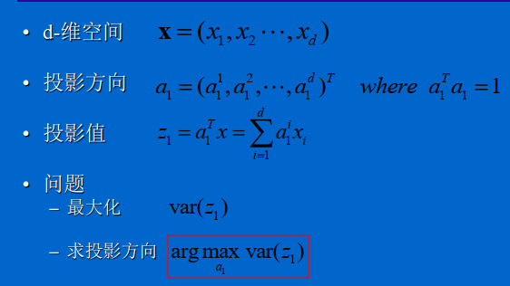

  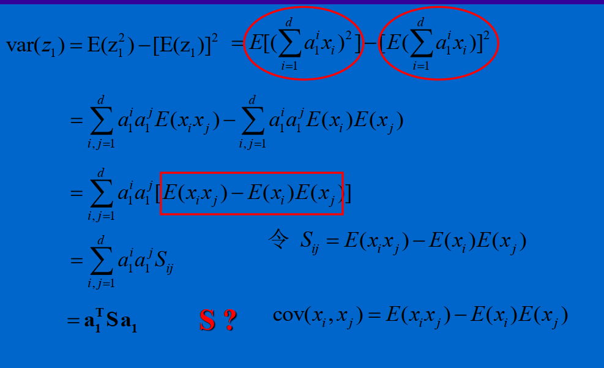
  
  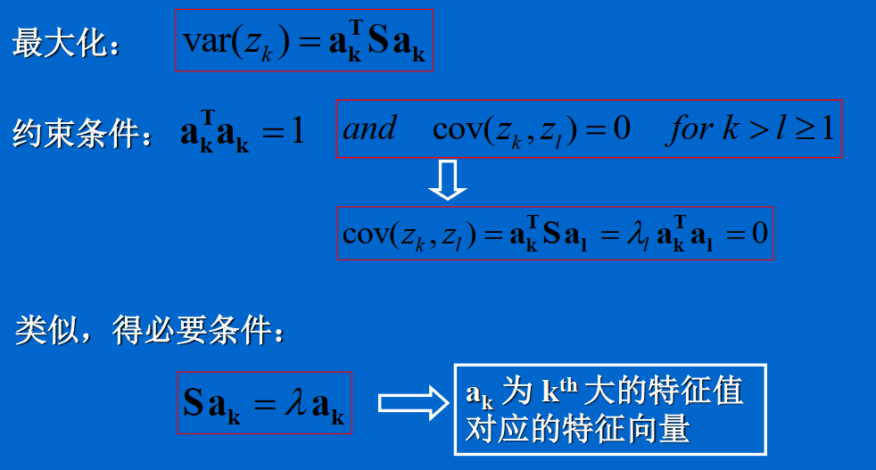


## Eigenface

Eigenface 算法的思想是希望能够将高维的图像数据**降维**，以此实现对不同人脸的特征刻画。

Eigenface 降维图像数据的方法是寻找一组特征脸，将特征脸作为一组基，**人脸信息便可以描述为特征脸的线性组合再加上一张平均脸**


[EigenFace的原理、实现及性能评估_eigenface算法](https://blog.csdn.net/Piamen/article/details/121617194)


- 理解利用人脸重构进行人脸检测的原理。如果一幅白噪声图像用Eigenface 去重构，预计结果会是怎么样？原因是？

  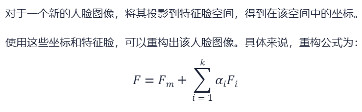

  如果使用Eigenface算法对一幅白噪声图像进行重构，预计结果会是：

  1. **特征脸空间中的投影**：
     - 白噪声图像在特征脸空间中的投影坐标会非常接近于零，因为白噪声图像与训练集中的人脸图像差异很大，无法很好地表示为特征脸的线性组合。
  2. **重构结果**：
     - 由于白噪声图像在特征脸空间中的投影坐标接近于零，使用这些坐标和特征脸进行重构时，得到的图像会非常接近于平均人脸图像Fm。
     - 重构结果可能是一个模糊的人脸图像，缺乏具体的人脸特征，因为白噪声图像中没有包含有用的人脸信息。

- 思考：Eigen-X应用过程重点需要注意什么？

  选择合适的降维参数k，以在保留足够信息的同时减少计算复杂度

  确保所有训练图像和测试图像都经过相同的预处理步骤，如灰度化、尺寸归一化和面部对齐，以消除由于面部姿态、光照条件和表情变化引起的偏差

  将所有图像归一化到相同的尺度，以确保在计算协方差矩阵时，每个像素的贡献是相同的

- 除上课提到的人脸、手型、人体形状之外，试举例，你觉得哪些数据可能比较适合用EigenX方法去建模？

  文本分类、情感分析；金融数据

  - **特征提取**：从金融数据中提取特征，如股票价格、交易量等，然后使用PCA降维。
  - **应用**：风险评估、投资组合优化

  基因表达水平，疾病诊断


## Performance Evaluation

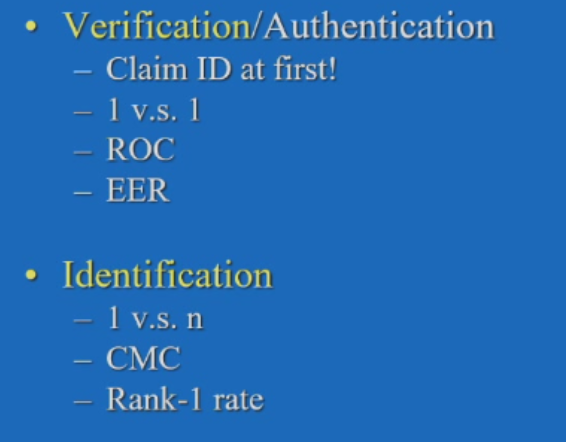

FAR vs FRR

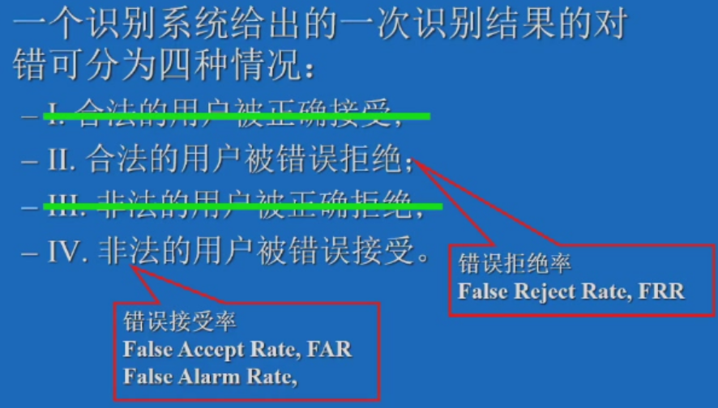


# Motion Estimation

optical flow光流法

- 解决的是什么问题：

  用于分析连续帧间像素运动；运动估计，目标跟踪，三维重建

- 三个基本假设

  - 亮度一致性brightness constancy：目标像素强度在相邻帧不发生变化一一$I(x+u,y+v,t+1）=I(x,y,t)$
  - 空间一致性spatial coherence：相邻像素拥有相似运动。
  - 微小运动small motion：

一个点的约束等式

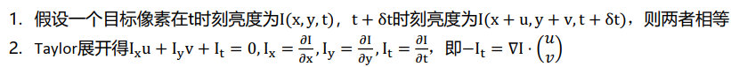


- 哪些位置的光流比较可靠？为什么？

  使用技巧：尽量避免用边缘上的点计算光流一一**使用纹理复杂区域，梯度比较大且方向不同，求出来的特征值比较大**（即角点，避免孔径问题(Aperture Problem)）


**Lucas-Kanade flow**

LK有一个window的概念，即我先划定一块区域比如(5x5)的像素区域，我们可以认为这块区域每个点的移动速度$u、v$是一致的

孔径问题(Aperture Problem)：所以**我们在追光流的时候，选点通常会选目标的角点(corner)**


直接最小二乘求解


# Visual Recognition

classification/detection

- 基本任务大概可以分为哪几大类 

  - 图片分类
  - 检测和定位物体/图片分割
  - 估计语义和几何属性
  - 对人类活动和事件进行分类

- 都有哪些挑战因素

  - 视角变换
  - 光线变化
  - 尺度变化
  - 物体形变
  - 物体遮挡
  - 背景凌乱
  - 内部类别多样

- Bias-Variance Trade-off  

  - Bias: how much the average model over all training sets differ fro mthe true model?所有训练集的平均模型与真实模型有多少差异?

    > Error due to inaccurate assumptions/simplifications made by the model

  - Variance: how much models estimated from different training sets differ from each other方差：从不同训练集估计的模型彼此之间的差异程度

- 模型复杂度和overfit underfit的关系
  - Underfitting: model is too “simple” to represent all the relevant class characteristics
    - High bias and low variance  
    - High training error and high test error  
  - Overfitting: model is too “complex” and fits irrelevant characteristics (noise) in the data
    - Low bias and high variance  
    - Low training error and high test error  

- a simple pipeline 

  


## KNN

[KNN算法（k近邻算法）原理及总结](https://blog.csdn.net/m0_74405427/article/details/133714384)

特征空间匹配，然后选k个最近邻居，多数投票得到其类别

- K的选取

  交叉验证选择cross validate

  

- 点距离的计算

  归一化

- 维度爆炸


## BoW

图像的 **BoW（Bag-of-Words，词袋模型）** 是一种从图像中提取特征并表示为固定长度向量的方法。它最初源自自然语言处理（NLP），用于将文本表示为单词的频率向量。在计算机视觉中，BoW 模型被扩展用于图像处理，通过将**图像中的局部特征（如关键点或局部描述子）**类比为“视觉单词”，从而将图像表示为一个“视觉词袋”。

- 图像的BoW(bag-of-words)是指什么意思？

  BoW 模型被扩展用于图像处理，通过将**图像中的局部特征（如关键点或局部描述子）**类比为“视觉单词”，从而将图像表示为一个“视觉词袋”。构建一个K维的直方图向量

- 如何构建visual words？

  #### **(1) 提取局部特征**
  
  - 使用特征检测算法（如 SIFT、SURF 或 ORB）从图像中提取局部特征。
  - 每个特征点对应一个描述子（Descriptor），描述子是一个向量，表示该特征点的局部信息。
  
  #### **(2) 构建视觉词典（Visual Vocabulary）**
  
  - 将所有图像的描述子集合起来，使用聚类算法（如 K-Means）将这些描述子聚类成 K 个簇。
  - 每个簇的中心称为一个“视觉单词”，所有视觉单词构成一个“视觉词典”。
  
  #### **(3) 量化局部特征**
  
  - 对于每个图像的描述子，找到最近的视觉单词（即最近的簇中心），并将其映射到该视觉单词。
  - 这个过程称为“量化”（Quantization），将局部特征映射到视觉词典中的某个单词。
  
  #### **(4) 构建词袋向量**
  
  - 统计每个视觉单词在图像中出现的频率，构建一个K维的直方图向量。
  - 这个向量就是图像的 BoW 表示。


**基本步骤**

1. 特征提取与表示（SIFT/SURF算法）

2. 通过训练样本**聚类**来建立字典(codewords dictionary) （常Kmeans）

3. 用字典的直方图来表达一张图像

   Represent an image with histogram of codebook (i.e. Bag-of-words of an image)

4. 根据bag of words来分类未知图像：基于K个视觉词对未知图片建立直方图，并比较其与训练集的直方图的距离，取距离最短即为最佳匹配

> Discriminative判别

## 基于卷积的物体识别

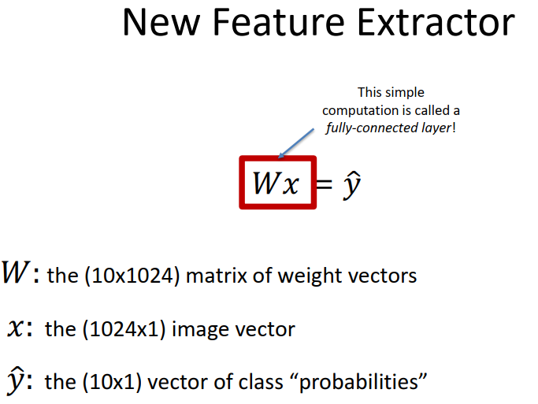

- 𝑊: the (10x1024) matrix of weight vectors

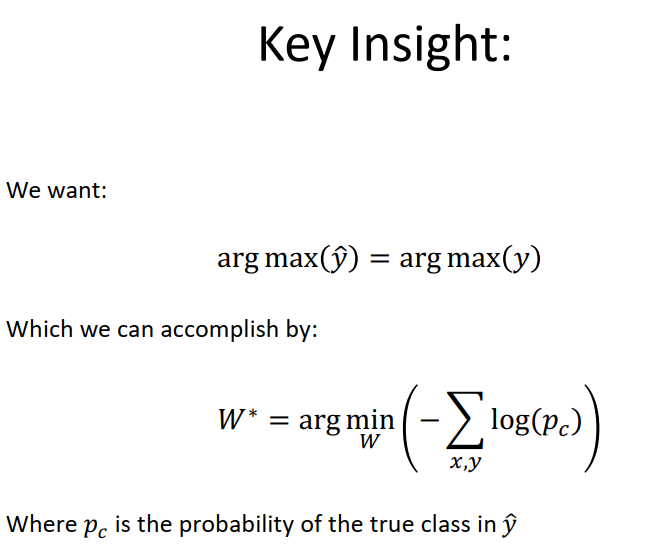

- Softmax 函数的主要作用是将网络的原始输出（通常称为 logits）转换为概率分布

- W矩阵的组成权重矩阵，

  含义权重矩阵$W$的每个元素$W_{ij}$表示输入特征$i$对输出特征$j$的贡献


# Deep Learning

- 怎么理解被称为end-to-end的学习？

  raw inputs to predictions ；通过深度神经网络，直接从原始数据学习到最终结果，无需人工设计特征或中间步骤。

  > 支持模型直接从输入数据学习到所需的输出结果，而不需要人为地将任务分割成多个独立的子任务或模块

- 神经网络的学习/训练，数学上本质是求解神经网络的什么？

  求解神经网络的**参数**，使得神经网络能够**逼近**或**拟合**给定的**目标函数**。

- 会写出基于梯度下降法的学习框架

  - 定义模型，前向传播
  - 计算损失函数
  - 反向传播
  - 参数更新，使用优化算法（如梯度下降、Adam等）
  - 迭代训练


## BP

反向传播Backpropagation：反向传播用于计算损失函数对网络参数的梯度，即损失函数对权重矩阵 W 和偏置向量 b 的偏导数。这个过程基于链式法则，从输出层开始逐层向输入层传播梯度。

- 本质：复合求导
- 关键：计算图的理解和使用
  - 节点：运算符
  - 连线上方：前向计算值
  - 连线下方：反向梯度值
  - 常用节点：加法/乘法/最大值节点

- 作用：它的学习规则是使用梯度下降法，通过反向传播来不断调整网络的权值和阈值，使网络的误差平方和最小。

- "梯度下降法"与BP算法的关系

  - 梯度下降法是一种优化算法，其基本原理是沿着函数梯度的反方向进行搜索，以寻找最小值

  - BP算法，即反向传播算法，是一种与最优化方法（如梯度下降法）结合使用的，用来训练人工神经网络的常见方法；

    BP算法中需要用到梯度下降法，用来配合反向传播，BP算法就是提供了**给梯度下降法所需要的所有值**。梯度下降法是求局部最好的w (权重)

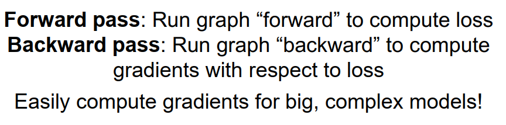


计算图如下：横线上写前向值，下面写后向值


## CNN

CNN=卷积层+池化层+全连接层

与全连接网络相比，CNN在哪几个方面做了重要改变？为什么这么改？
- 局部连接：加了卷积层，参数减少
- 共享权重：同一个卷积核在输入图像的不同位置上共享相同的权重。这种权重共享机制进一步减少了参数的数量，并使得网络能够更好地捕捉到图像的平移不变性
- 有了池化层：通过下采样操作，减少特征图的尺寸，并保留最重要的特征。池化层有助于减少计算量和参数数量，并提高网络的平移不变性

卷积为什么有用？——Allow us to find interesting insights/features from images!  用于提取图像特征

```
Convolution = image-> Features
```

减小模型参数的技巧


> 上面算feature_map的公式不对


上述是如何计算NN的Neurons Weights Parameters

下面介绍CNN的计算


一个neuron的weights=卷积核的大小*输入图像的channel

note that connectivity is:

- local in space (5x5 inside 32x32)
- but full in depth (all 3 depth channels)

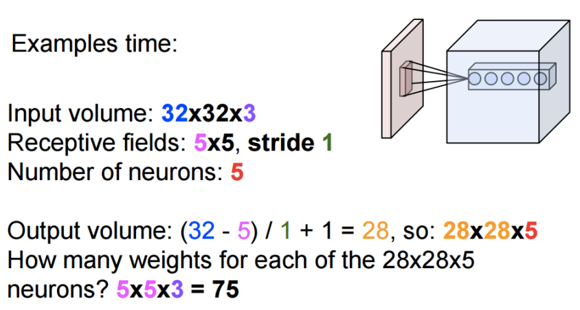

output volume向下取整


池化层：在连续的卷积层之间会周期性地插入一个polling层。它的作用是逐渐降低数据体的空间尺寸，这样的话就能减少网络中参数的数量，使得计算资源耗费变少，也能有效控制过拟合。

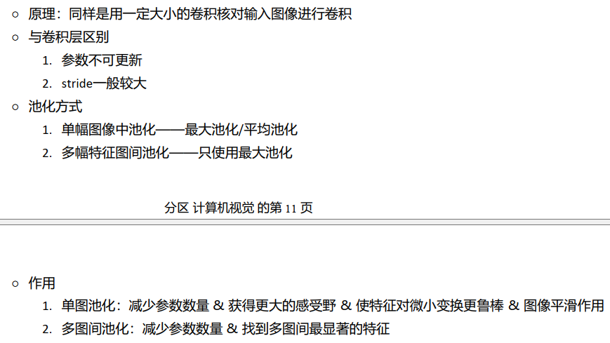

全连接层，softmax回归

Softmax函数将前一层的输出（通常称为逻辑值或logits）转换为概率分布。每个逻辑值代表模型对应类别的原始预测数值，而Softmax函数的作用是将这些原始预测数值“压缩”成为一个真实的概率分布

Softmax层常常与交叉熵损失函数一起结合使用。交叉熵损失函数能够衡量预测的概率分布与真实标签之间的差异，从而指导模型的训练过程


- 交叉熵cross-entropy loss


激活函数


## Tips for training  

### Batch

- **小批量**：更新频率高，梯度更新较为“嘈杂”，但有助于避免陷入局部最优，通常在小批量下模型的泛化能力更好。
- **大批量**：更新频率低，梯度更新较为稳定，但可能导致模型陷入局部最优，泛化能力较差。

batch技巧是指什么？怎么理解该方法？

- - **Batch Size**是指在每次迭代中，模型同时处理的样本数量。
  - 它决定了模型在每次参数更新时所依据的数据量。

  - batch较大：
    - 可以加快训练速度，因为每次迭代处理更多的数据，减少了总的迭代次数3。
    - 可以减少模型训练过程中的随机性，使模型更稳定3。
    - 有助于Batch Normalization等技术更好地发挥作用
    - 需要更多的内存和计算资源
    - 可能陷入局部最优解
  - batch较小
    - 可以提高模型的泛化能力，因为每次迭代的梯度估计更准确3。
    - 有助于模型跳出局部最优解，找到更好的全局最优解
    - 训练速度较慢，因为需要更多的迭代次数
    - 可能会导致模型在训练过程中震荡较大，难以收敛

### Batch Normalization  

- **批量归一化的作用**：通过对每个批量的数据进行归一化，使得每个特征的均值为0，方差为1，从而加速训练过程并提高模型的稳定性。

  In general, feature normalization makes gradient descent converge faster  

- **内部协变量偏移（Internal Covariate Shift）**：批量归一化可以减少网络层之间的输入分布变化，使得训练过程更加稳定。

  - 在深度神经网络中，每一层的输入分布会随着前一层参数的变化而发生变化。这种输入分布的变化称为 **内部协变量偏移**。

    例如，假设网络的某一层在前向传播时，其输入分布发生了显著变化，这会导致后续层的训练变得困难。

  - 内部协变量偏移的影响

    - **训练不稳定**：输入分布的变化会导致梯度更新不稳定，训练过程可能变得非常缓慢。
    - **学习率限制**：为了避免训练不稳定，通常需要使用较小的学习率，但这会减慢收敛速度。
    - **梯度消失/爆炸**：输入分布的变化可能导致梯度消失或梯度爆炸问题，尤其是在深层网络中。

- **测试阶段的批量归一化**：在测试阶段，由于没有批量数据，通常使用训练阶段计算的移动平均值来进行归一化。

- **其他归一化方法**：文档还提到了其他归一化方法，如层归一化（Layer Normalization）、实例归一化（Instance Normalization）等。

batch normalization的初衷是为了改变优化过程中的什么？

- batch normalization：初衷是为了解决深度神经网络训练过程中的 **内部协变量偏移（Internal Covariate Shift）** 问题，从而加速训练并提高模型的稳定性和性能。

- 它通过调整神经网络中间层的输入分布，使得输入数据保持相对稳定的均值和方差，从而加速模型的训练收敛并提高模型的泛化能力

  > 解决**内部协变量偏移（Internal Covariate Shift）**问题

### Momentum

- **动量的作用**：动量是一种优化技术，通过在梯度下降中加入前几次更新的加权和，使得参数更新不仅依赖于当前的梯度，还依赖于之前的更新方向。这有助于**加速收敛并减少震荡并且跳出局部最优**。通过计算梯度的**指数加权平均**来更新参数

- 更新公式
  $$
  m_t=\gamma m_{t-1}+\eta\nabla L(\theta_t)
  $$

  $$
  \theta_{t+1}=\theta_t-m_t
  $$

  其中，$m_t$是动量，$\gamma$是动量系数，$\eta$是学习率，$\nabla L(\theta_t)$是当前梯度。

  - 有可能避免陷入局部最小值或鞍点

  - 通过平滑梯度更新方向，减少震荡现象，使得参数更新更加稳定

  - 在一定程度上缓解了对学习率的敏感性，使得在较大的学习率下也能实现稳定的收敛

- 优化失败的原因
  - **局部最小值（Local Minima）**：梯度下降可能会陷入局部最小值，导致无法继续优化。
  - **鞍点（Saddle Point）**：在高维空间中，鞍点比局部最小值更常见，梯度在这些点附近接近于零，导致优化停滞。
  - **梯度消失（Vanishing Gradient）**：当梯度接近于零时，参数更新会变得非常缓慢，导致训练停滞。

- **其他优化技巧**
  - **并行计算**：在大批量训练中，可以通过并行计算来加速梯度计算。
  - **大批量训练的挑战**：尽管大批量训练可以加速训练过程，但可能会导致模型泛化能力下降。文档提到了一些研究，探讨如何在大批量训练中保持良好的泛化性能。


## Self-attention Block

考虑上下文语义关系

- Self-attention机制主要是对什么样信息进行建模？

  **序列内部元素之间的依赖关系**

- 理解self-attention机制中的q/k/v想代表的含义/意思？

  查询（Query）键（Key）和值（Value）

  - q
    - **含义**：代表我们想要**理解或关注的元素**的向量表示。
    - **作用**：用于**查询**序列中其他元素与当前元素的**相似度**。
  - k
    - **含义**：代表序列中**每个元素**的向量表示，用于与Query进行**相似度匹配**。
    - **作用**：通过计算Query与所有Key之间的**点积**，得到一个**权重分布**，表示每个元素与当前关注元素的相关性。
  - v
    - **含义**：代表序列中**每个元素**携带的**实际信息**的向量表示。
    - **作用**：根据Query与Key计算得到的**权重分布**，对Value进行**加权求和**，得到一个包含丰富上下文信息的新元素表示。
  - 

- 为什么要加位置编码（positional encoding）

  处理词元序列时，循环神经网络是逐个的重复地处理词元的， 而自注意力则因为并行计算而放弃了顺序操作。 为了使用序列的顺序信息，通过在输入表示中添加 *位置编码*（positional encoding）来注入绝对的或相对的位置信息——固定位置/学习位置

  [10.6. 自注意力和位置编码 — 动手学深度学习 2.0.0 documentation (d2l.ai)](https://zh.d2l.ai/chapter_attention-mechanisms/self-attention-and-positional-encoding.html)

- Self-attention机制与CNN卷积机制的关系？【定性理解】

  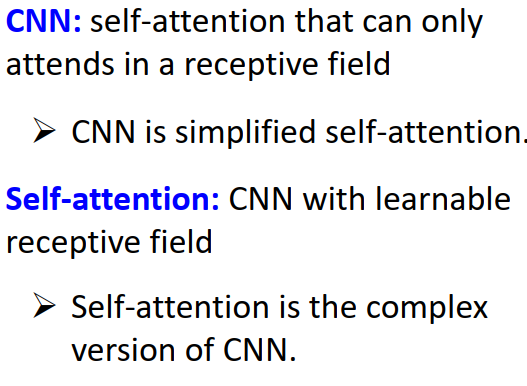

  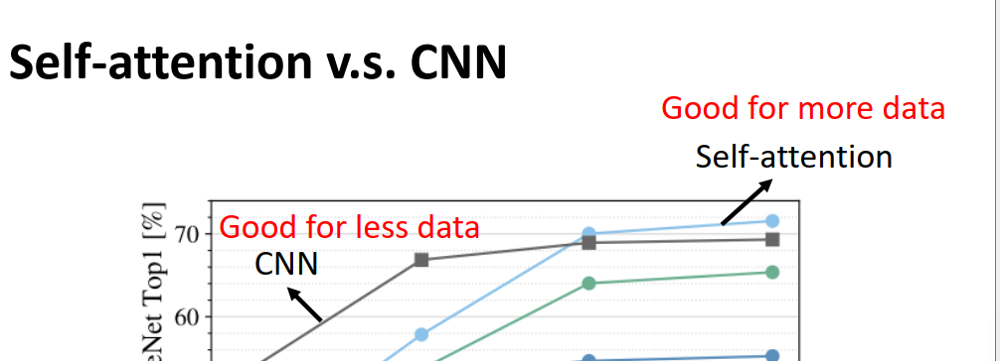

- Self-attention机制与循环神经网络模型（RNN）的关系？【定性理解】 

  > RNN：[史上最详细循环神经网络讲解（RNN/LSTM/GRU）](https://zhuanlan.zhihu.com/p/123211148)

  

  RNN没有办法并行化产生输出，只能一个接一个输出；

  Self-attention可以并行化输出

  RNN当结果要考虑比相对较远输入的位置时，比较难以考虑到；

  Self-attention可以很好的对输入位置比较远的向量进行考虑

  RNN每个输出只考虑了其左边的输入，没有考虑右边的输入

  Self-attention则考虑了整个Sequence

- Self-attention机制与图神经网络模型（GNN）的关系？【定性理解】

  > Self-attention for Graph(Consider edge: only attention to connected nodes)  ——one type of Graph Neural Network (GNN)  
  >
  > **图注意力网络（GAT）** 将 **注意力机制** 引入图神经网络领域，使图中的每个节点能够根据其邻居节点的重要性，**动态地聚合邻居节点的信息**


- input

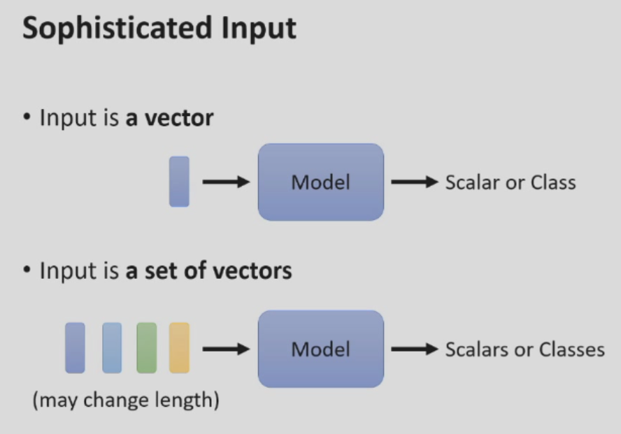

输入视频/语言

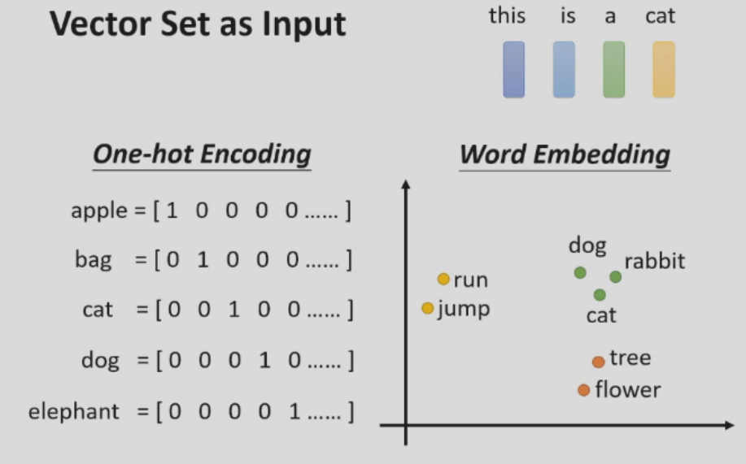

左边这种没有包含什么语义信息

Graph

- output

  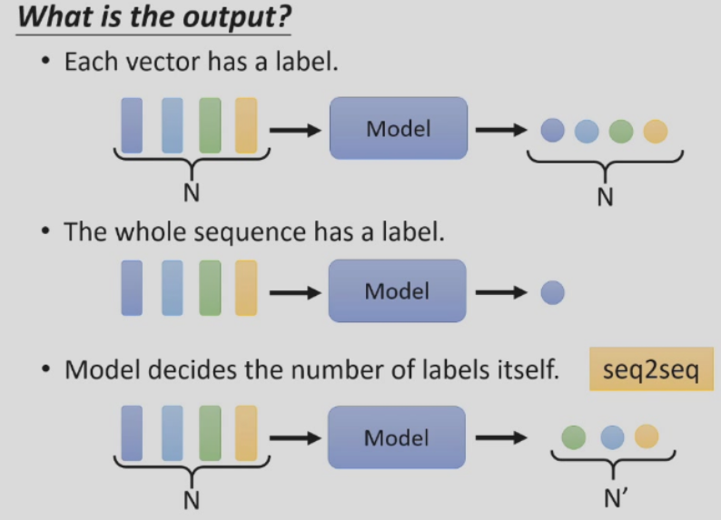

  sequence labeling

  

  加入self-attention得到新的feature，其中包含自己和自己与前后的关系

- self-attention

  大的架构如下：

  

  中间的算法可以随便替换

  

  像这样提取不同的信息

  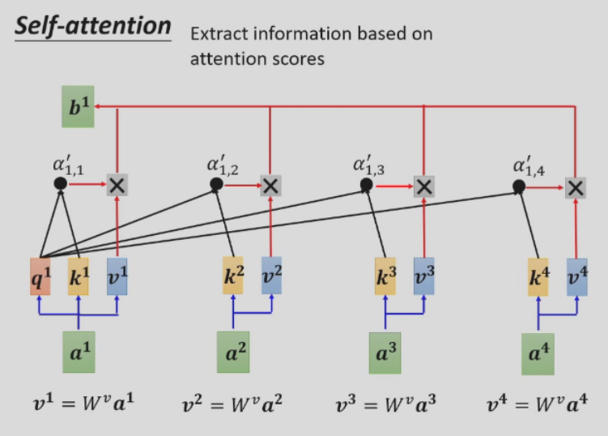

  如何考虑关联性呢？：每个a中都包含三个空间：自己与别人的关联性query/被别人比较的量key/自己的value

  其中$a\prime_{i,j}$由如下获得：

  


# Camera Calibration

Camera Calibration（single-view calibration）

[7_1_相机校准 - OpenCV中文官方文档 (woshicver.com)](https://www.woshicver.com/Eighth/7_1_相机校准/)

[相机畸变产生原因与公式表示（基本原理）](https://blog.csdn.net/qq_43585355/article/details/134733704)

## Camera model

- 相机模型：小孔成像

  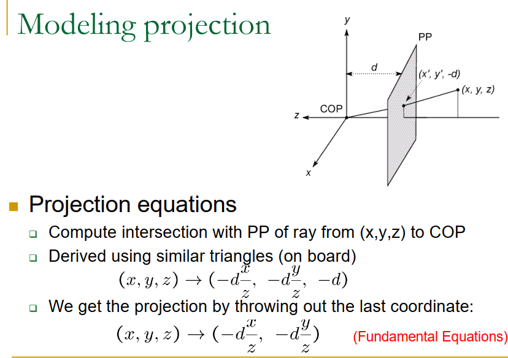

  

  not a linear transformation——所以我们改用齐次坐标

- 基本概念

  - 景深Depth of Field：相机镜头能够取得清晰图像的成像所测定的被摄物体前后范围距离

  - 光圈(aperture孔径)：镜头中用于控制光线透过镜头并进入机身内感光面光量的装置

    

    大光圈景深小，小光圈景深大光路图里把上下两条线放近一点

    small aperture reduces amount of light – need to increase exposure

  - 焦距：从镜片中心到底片等成像平面的距离

  - 视场(Field of View FOV)：镜头能够观察到的最大范围
  
    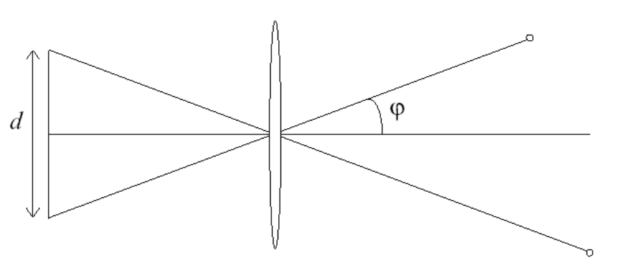
    $$
    \varphi = \arctan\frac{d}{2f}
    $$
    (是视角的二分之一)
    大焦距离得近：整个场景被缩短，远处的东西被拉到近处而且很大，但是虚化了，焦距内的物体也能看到
    小焦距离得远：整个场景被拉长，远处的东西很小，但是都很清楚，焦距内的东西会在视野外
  
    总结：**焦距越大，视场越小**
    
  - Lens Flaws  ：Dispersion  色散

- 投影变换：

  

  - **不保角**：投影变换会改变角度。
  - **不保距**：投影变换会改变距离。
  - **不保平行**：投影变换会改变平行关系。
  - **保共线**：投影变换保持共线性。

- 齐次坐标Homogeneous coordinates  

  欧式几何是投影几何的一个子集。齐次坐标是用N+1个数来表示N维坐标的一种方式。

  - 齐次坐标与笛卡尔坐标之间的转换
    $$
    (x, y, w) \Leftrightarrow \left( \frac{x}{w}, \frac{y}{w} \right)\\
    
    \text{Homogeneous} \quad \Leftrightarrow \quad \text{Cartesian}(x, y, w)
    $$
    刚体变换$Rx+t$可以表示为齐次坐标下的矩阵乘法形式：
    $$
    \begin{pmatrix}
    R &t\\
    0 &1
    \end{pmatrix}
    \begin{pmatrix}
    x \\
    y \\
    z \\
    1
    \end{pmatrix}
    $$

  - 好处

    - 统一表示

      - **点**：在二维空间中，点 $(x,y)$的齐次坐标为$(x,y,1)$。
      - **向量**：向量$(x,y)$的齐次坐标为$(x,y,0)$。

    - 矩阵计算

    - 无穷远点的处理

      齐次坐标$(x,y,0)$表示无穷远点，这在透视投影中用于表示平行线的交点。


内参矩阵


畸变模型s


$$
x_{\text{distorted}} = x + \left[2p_1 xy + p_2 (r^2 + 2x^2)\right]
$$

$$
y_{\text{distorted}} = y + \left[p_1 (r^2 + 2y^2) + 2p_2 xy\right]
$$

外参模型

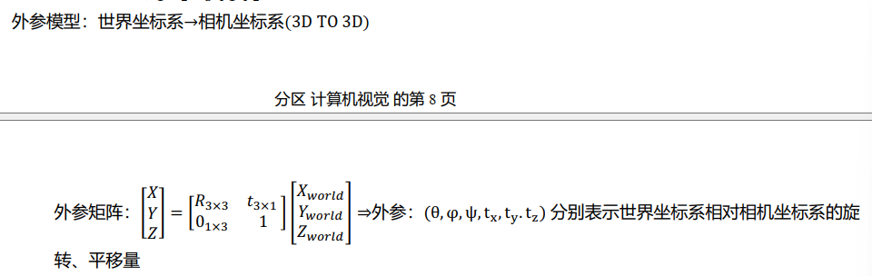


> distortion失真


## Camera Calibration

- what ：Compute relation between pixels and rays in space

- why

- how

  基本过程简述

  1.获取标定物体网格的角点在坐标系的位置 

  2.找到图片的角点

  3.根据图像空间坐标系到世界坐标系列出等式 

  4.求解相机参数

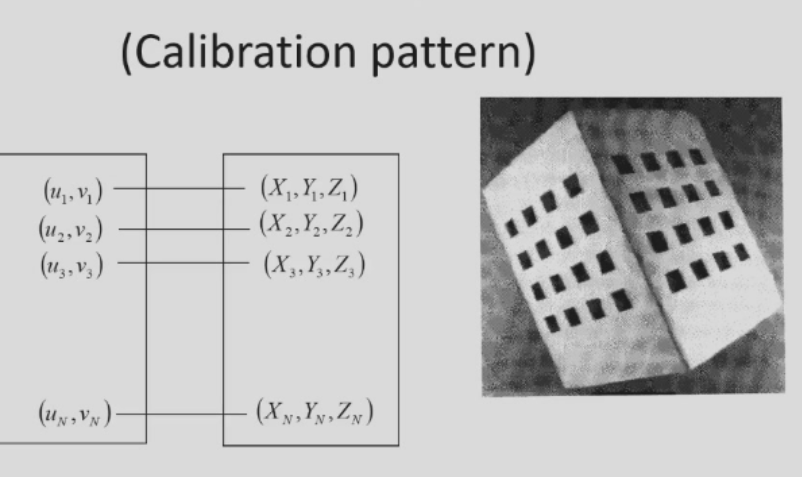

homography；chess定标


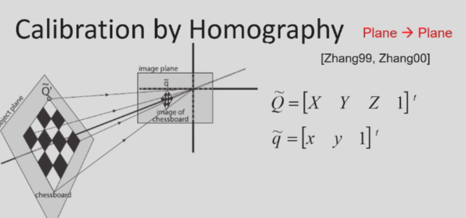

拍多个照片；测角点；建立等式

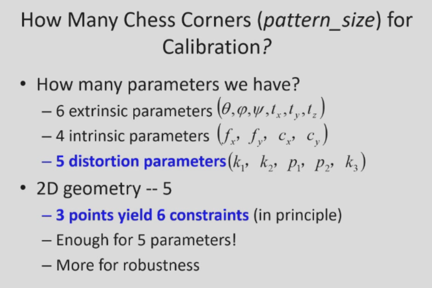

外参会变


每个view=6个外参参数+4个共同的内参参数

N个点K个视角
$$
2NK>6k+M(M=4~or ~9)
$$

> **一个点产生两个方程**
>
> 每个匹配点对可以产生两个方程，分别对应于点的x坐标和y坐标的比例关系。

# Stereo Vision

获得深度图

triangulation三角测量；Rectification整流，整改


disparity


- 基本步骤

  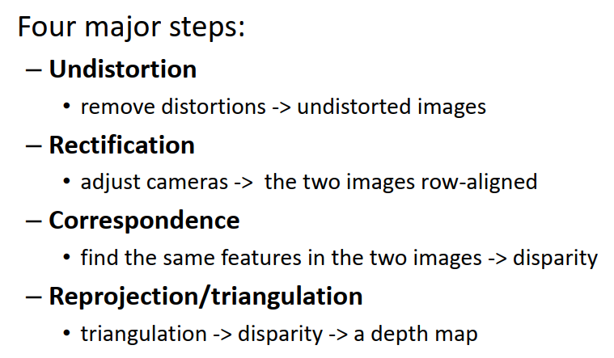

  

  > 将双目相机拍摄的左右两幅图像进行几何变换，使得两幅图像的**对极线**水平对齐
  >
  > - **原始的2D匹配问题**：在未校正的图像中，寻找一个图像上的点在另一个图像中的对应点，需要在二维平面上进行搜索，计算量大且容易出错。
  > - **转化为1D匹配问题**：经过立体校正后，对应点的搜索范围被限制在**水平方向**上，即只需要在水平线上搜索对应点
  >
  > 如果不进行receification，则会使得匹配复杂度高，匹配精度低，极线几何

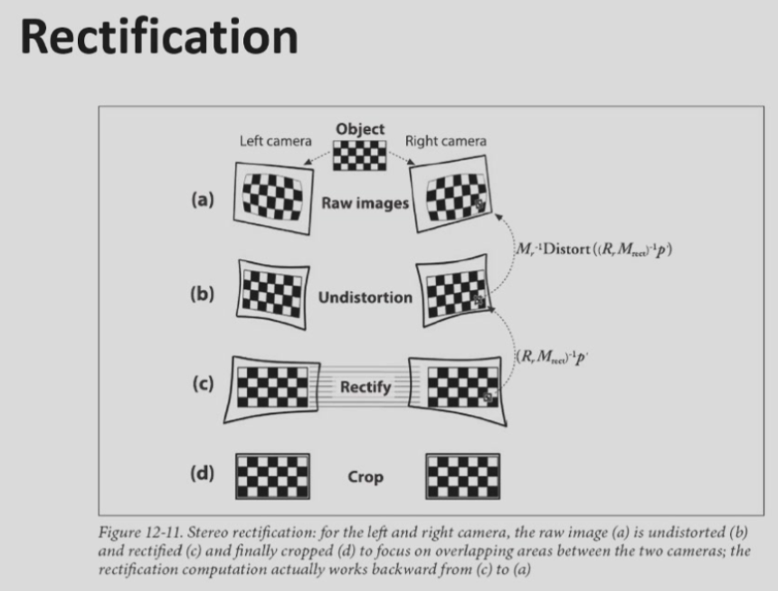


## Epipolar Geometry

The basic geometry of a stereo imaging system
极几何（极线几何、核面几何、对极几何）——表述两个相机成像关系的几何


# Structured-lighting 3D Scan

三维获取：结构光

- 结构光成像系统的构成

  结构光投影仪+CCD相机+深度信息重建系统

- 基本原理

  


点云，深度图，网格（mesh）

## ICP

**Iterative Closest Point**

- 目标：计算两组数据（两帧图像）间的旋转平移量，使之形成最佳匹配
- 常用的求解方法有**奇异值分解（SVD）**和**非线性优化**


laser scanning

3D capture system

# Object Categorization

BoW Bag of words

[计算机视觉中的词袋模型(Bow,Bag-of-words)](https://www.cnblogs.com/YiXiaoZhou/p/5999357.html)

其大概过程首先提取图像集特征的集合，然后通过聚类的方法聚出若干类，将这些类作为dictionary，即相当于words，最后每个图像统计字典中words出现的频数作为输出向量，就可以用于后续的分类、检索等操作。

以sift特征为例，假设图像集中包含人脸、自行车、吉他等，我们首先对每幅图像提取sift特征，然后使用如kmeans等聚类方法，进行聚类得到码本(dictionary)


# 期末

期末考占50分，闭卷考试，题型为简答+公式推导+计算，可能因为CV东西太多太难，索性就当文科考了。考点都在复习提纲里，不需要看提纲之外的内容。复习的时候查到过以前同学的笔记，内容也都变化不大，所以就把提纲放上来了

整理了一份复习笔记（参考了网上一些同学的博客），只要背会，期末考试绝对没问题

- [CC98论坛](https://www.cc98.org/topic/5803726)

- [2021-2022 冬 计算机视觉 回忆 - CC98论坛](

 
