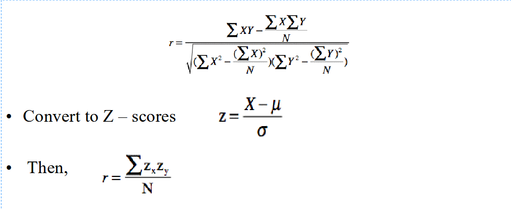
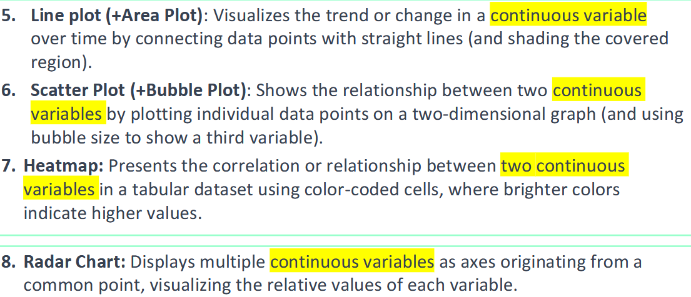
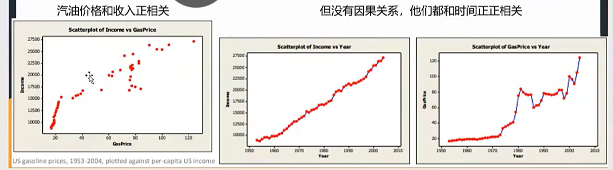
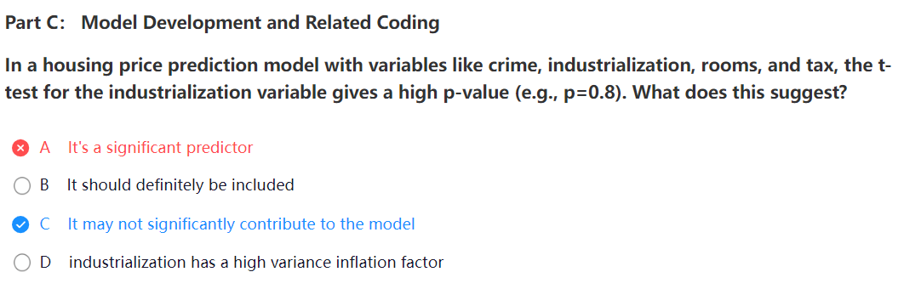
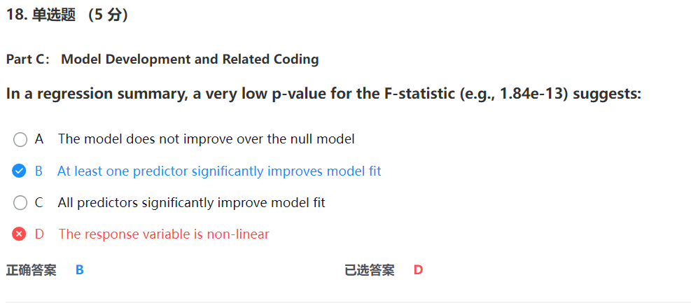

# Main Takeaway

ML&DataAnalysis

- 出勤+平时作业 20%。
- 两次测试(40%)：A.期中线上测验(20%)，B.期末结课报告(20%)。
- 项目大作业:40%

https://student.neoschool.com/#/passport/login

[课程详情-CIS NanoMaster (neoscholar.com)](https://www.neoscholar.com/#/advance/detail/course/1800442859247337474)

<!--more-->

# Lec 1 Intro

这节主要是Overview of Data Analysis, Importance of Data Analysis in Business & Scientific research, Python Warmup

## CIS

- CIS(Computer Information Systems)
  - 定义：信息系统收集、处理、存储、分析和为某一特定目的（支持）传播信息个人、团体、组织和/或社会目标)

- Data Analysis

  - 定义：系统地应用统计和数据的过程处理数据的其他计算技术

  - 目的：提取有用的信息，并支持数据驱动的决策

- Data Science

  - 定义：在Data Analysis的基础上更近一步，利用数据来构建新的流程先进的算法和预测模型

- Machine Learning
  - 用于自动化数据分析过程和帮助工作流获得更深入、更全面的见解

## Data Lifecycle & the Role of Analysis

- **数据生命周期**

  - 由五个部分组成：目标定义 → 数据收集 → 清洗 → 探索 → 建模 → 结果沟通。

    下面分别介绍每个部分的pipeline

  - Establish Objectives

    1. Determine objectives确定目标
    2. Assess situation评估情况
    3. Determine data analysis goals确定数据分析目标  
    4. Produce project plan制定项目计划

  - Collect & Understand the Data

    1. Collect initial data收集初始数据
    2. Examine data检查数据
    3. Do preliminary check of data对数据进行初步检查：深入挖掘数据
    4. Verify data quality验证数据质量

  - Prepare the Data

    1. Select data
    2. Format data
    3. Clean data
    4. Construct data派生有用的新属性。例如，派生某人的身高和体重的身体质量指数
    5. Integrate data集成数据，通过组合来自多个数据源的数据创建新的数据集

  - Analyze the Data
    1. 数据分析：试图从原始数据收集有意义的见解的过程
       - **描述性分析**：总结历史数据（均值、分布）。
       - **预测性分析**：构建模型预测未来（回归、决策树）。
       - **规范性分析**：优化决策（资源分配、路径规划）。
    2. 数据可视化：创建图形化的过程你的信息的表述

## Applications of Data Analysis & Machine Learning

三个应用领域

- Data analysis
- Predictive modeling
- Machine learning

# Lec 2 Sampling and Data Collection

这节主要介绍了Data Types, Sampling Techniques, Data collection methods, Prelude to Data wrangling and data transformation数据类型，采样技术，数据收集方法，数据整理和数据转换的前奏

## 概念

先进行一些概念的介绍

- Structured Vs. Unstructured Data

  Semi-structured Data：Structured but does not have a formal data model associated with it

- Quantitative Vs. Qualitative Data

- Interval & Ratio Data

  - interval：Difference between two values is meaningful and consistent，但是没有0的定义

    摄氏温标

  - ratio：Difference between two values is meaningful and consistent，有0的定义

    开尔文标度

- Measuring Qualitative Data  测量定性数据

  - Nominal名义上的：gender

    Non-numeric data (names) that is placed into mutually exclusive, separate, but nonordered categories  

  - Ordinal顺序的：education level

    May be categorized and ranked in a numerical fashion  

## Sampling for Machine Learning

为什么要选择subset of data

- 减少数据大小
- 确保稳健性能，并在机器学习项目中保持实用性

那么如何选择subset of data——sampling，下面给出原因

- Feasibility and Cost-Effectiveness
- Speed and Efficiency
- Reduce Overfitting (Training vs Validating/Testing)
- Improved Model Performance

- Probability versus Nonprobability

  - Probability Sampling: each member of the population has a known nonzero probability of being selected

    包括：random sampling, systematic sampling, stratified sampling and cluster sampling（聚类采样），下面详细介绍一下这几种采样方法：

    | **特征**           | **Systematic Sampling（系统抽样）**                          | **Stratified Sampling（分层抽样）**                          | **Cluster Sampling（聚类抽样）**                             |
    | ------------------ | ------------------------------------------------------------ | ------------------------------------------------------------ | ------------------------------------------------------------ |
    | **定义**           | 按固定间隔（如每第k个元素）从总体中选择样本，起始点随机确定。 | 将总体划分为若干互斥的层（子群体），每层内部同质性强，从每层中独立随机抽样。 | 将总体划分为若干群（自然或逻辑分组），随机选择部分群，对选中群内的所有个体进行调查。 |
    | **关键步骤**       | 1. 确定抽样间隔k（总体数/样本数）2. 随机选择起始点（1到k之间）3. 按间隔k抽取后续样本。 | 1. 按特征（如年龄、性别）分层2. 每层内独立随机抽样（比例或均等样本量）3. 合并各层样本。 | 1. 将总体划分为互不重叠的群2. 随机抽取若干群3. 对选中群内的所有个体进行调查。 |
    | **优点**           | - 操作简单，成本低- 样本分布均匀，适用于无明显周期性的总体。 | - 确保各子群体在样本中均有代表性- 提高估计精度（层内差异小）- 可分层分析不同群体的特征。 | - 节省时间和成本（调查集中）- 无需完整抽样框（仅需群列表）- 适合地理分布广的总体。 |
    | **缺点**           | - 若总体存在周期性排列，可能导致偏差- 无法保证所有子群体都被覆盖。 | - 需要先验知识进行分层- 若分层不当，误差可能增加- 操作复杂（需分层和独立抽样）。 | - 抽样误差较大（群内个体相似度高）- 需群间差异小、群内差异大- 样本分布可能不够广泛。 |
    | **适用场景**       | - 总体无明显周期性排列- 快速获取均匀样本（如生产线质检、电话簿抽样）。 | - 总体存在明显异质性（如不同收入、地区）- 需确保各子群体代表性（如医疗研究中的性别/年龄分层）。 | - 群组易于划分且调查成本高（如学校班级、城市街区）- 缺乏完整抽样框但可获取群列表。 |
    | **示例**           | 从1000名学生中抽取100人：k=10，随机起点为3，抽取3,13,23,...等样本。 | 研究某疾病患病率，按性别分层（男/女），每层按比例抽取样本，合并后分析总体和各层结果。 | 调查全国小学生视力，随机抽取10个城市，对每个城市所有小学的学生进行全面检查。 |
    | **误差来源**       | 周期性排列导致样本偏差（如每周7天抽样间隔为7，可能只选到同一星期几）。 | 层内差异未被充分减小，或分层标准与目标变量无关。             | 群间差异较大，导致样本代表性不足（如抽中群均为高收入社区）。 |
    | **与其他方法对比** | 比简单随机抽样更高效，但可能引入周期性偏差。                 | 比简单随机抽样精度高，但比整群抽样复杂。                     | 比简单随机抽样成本低，但精度较低；与分层抽样互补（分层强调层差异，整群强调群同质）。 |

  - Nonprobability Sampling: members are selected from the population in some nonrandom manner

    包括：convenience sampling, purposive sampling, and snowball sampling

    | **特征**           | **Convenience Sampling（便利抽样）**                         | **Purposive Sampling（目的抽样）**                           | **Snowball Sampling（滚雪球抽样）**                          |
    | ------------------ | ------------------------------------------------------------ | ------------------------------------------------------------ | ------------------------------------------------------------ |
    | **定义**           | 研究者基于方便性选择样本，样本通常来自易接触的群体（如街头拦截、学生群体）。 | 研究者根据研究目标主观选择具有特定特征的样本（如专家、典型案例）。 | 通过现有样本推荐新样本，逐步扩大样本量，常用于难以接触的群体（如边缘人群、敏感群体）。 |
    | **别名**           | 偶遇抽样、方便抽样                                           | 判断抽样、立意抽样                                           | 推荐抽样、链式抽样                                           |
    | **抽样步骤**       | 1. 选择易获取的样本来源2. 直接收集数据（如街头访问）。       | 1. 明确研究目标与样本标准2. 主观判断选择符合条件的样本。     | 1. 确定初始样本（“种子”）2. 通过现有样本推荐新样本3. 迭代扩大样本量。 |
    | **优点**           | - 操作简单、成本低、耗时短- 适合快速获取初步数据。           | - 精准匹配研究目标- 能深入分析特定群体（如专家意见、典型案例）。 | - 有效接触隐藏或敏感群体- 无需完整抽样框（依赖社交网络）。   |
    | **缺点**           | - 样本代表性差，存在选择偏差- 结果无法推广到总体。           | - 依赖研究者主观判断，易引入偏差- 样本选择标准不透明。       | - 样本同质性高（依赖初始样本关系链）- 结果可能缺乏多样性。   |
    | **适用场景**       | - 探索性研究、预实验- 时间/资源有限的研究（如学生作业、市场快速调查）。 | - 研究需要特定特征样本（如行业专家、罕见案例）- 定性研究（如深度访谈、个案分析）。 | - 难以接触的群体（如吸毒者、LGBTQ+群体）- 缺乏抽样框的群体（如非法移民、地下经济参与者）。 |
    | **示例**           | 在商场入口拦截顾客进行问卷调查；使用社交媒体群组成员作为样本。 | 选择某领域权威专家进行访谈；研究企业成功案例时选取特定公司。 | 通过吸毒者推荐其他吸毒者参与研究；通过艾滋病患者推荐病友进行访谈。 |
    | **误差与局限性**   | 高偏差风险，无法估计抽样误差。                               | 主观选择可能导致系统性偏差，结果外推性受限。                 | 样本依赖社交网络，可能存在“回声室效应”（仅反映特定群体观点）。 |
    | **与其他方法对比** | 比目的抽样更简单，但科学性更低；与随机抽样互补（用于预实验后跟进概率抽样）。 | 比便利抽样更聚焦研究问题，但比概率抽样更主观；与滚雪球抽样互补（目的抽样选种子，滚雪球扩大样本）。 | 比便利抽样更针对隐藏群体，但样本多样性受限；常与目的抽样结合（如先判断选择种子，再滚雪球扩展）。 |
    | **关键注意事项**   | 需明确说明便利性来源，避免过度解读结果。                     | 需清晰定义样本选择标准，并记录判断依据。                     | 需保护参与者隐私，避免推荐压力；注意样本的同质化问题。       |

## Data Acquisition

再别说，直接外包

## Collecting data from web-based sources

一些网络知识（建议自学计网），主要介绍了如何利用python用http访问

还介绍了前端三件套

# Lec 3 Feature Engineering and Selection

这节主要介绍了Data Preparation, data wrangling and data transformation continued; Techniques for Feature Extraction, Criteria for Selecting Features, Impact of Feature Selection on Model Performance  

## 特征工程

- 好处：提高模型准确率，降低复杂度，增强数据代表性

- 三个方法转变原始数据以更好表现数据特征：

  新特征，特征变形，特征选择

- 缺失值处理missing values
  - 直接空缺缺失值
  - 使用NA、NULL、NaN等代替，使用时需要统一
  - 处理数据时记得先找到这些NA值
  - 去除缺失值所在的样本
  - 如果有某个特征的缺失值太多，直接去掉该特征
  - 用平均值、中位数等填充缺失值

- 重复值处理duplicates
  - 重复值可能导致偏差结果
  - 去除重复的样本

- 极端值outliers：
  - 判断极端值：
    - 分位数：确定上下限
    
    - Z-score：表示某个数据点在分布中相对平均值的位置（相差几个标准差）
      $$
      Z=\frac{x-\mu}{\sigma}
      $$
      x 数据点，$\mu$为总体均值，$\sigma$为总体标准差

- 特征缩放
  - min-max缩放
    $$
    X_{norm} = \frac{X-X_{min}}{X_{max}-X_{min}}
    $$

  - 标准缩放（常用）：将某个特征分布变为标准正态分布
    $$
    Z=\frac{X-\mu}{\sigma}
    $$

  - 健壮缩放：目的是更好地抵抗极端值得影响，方法是除以四分位距

- 特征变形的编码方法

  encoding：将特征以数值方式表现，如**独热编码**one-hot(三个特征对应三个地址ABC)

- 特征选择

  - 过滤方法：方差阈值，相关性，相通信息

    - 方差阈值：低方差特征的属性通常可能意味着更低的信息含量

      因此可以将方差低于阈值的特征去除

    - 相关性mutual information：选择哪些与目标有更强关联的特征（如pearson相关性）

## 数据分析

数据分析得四个层次

| **分析类型**                        | **核心问题**       | **方法示例**               | **应用目标**           |
| ----------------------------------- | ------------------ | -------------------------- | ---------------------- |
| **描述性分析Descriptive Analysis**  | 发生了什么？       | 均值计算、数据分布可视化   | 总结数据特征           |
| **诊断性分析Diagnostic Analysis**   | 为什么发生？       | 相关性检验、根本原因分析   | 揭示问题根源           |
| **预测性分析Predictive Analysis**   | 未来可能发生什么？ | 时间序列模型、机器学习预测 | 预判趋势或结果         |
| **规范性分析Prescriptive Analysis** | 应该采取什么行动？ | 优化算法、模拟仿真         | 提供决策建议或最优方案 |

A/B测试，对照组+实验组——分析新功能

# Lec 4 Exploratory Data Analysis

Descriptive statistics, Data visualization tools & techniques, identifying patterns & anomalies in data

## Exploratory Data Analysis

> anomaly 异常现象
>
> parsimonious  吝啬的，质量差的
>
> preliminary  初步的，预备的
>
> quantitative 数量的，量化的
>
> Univariate  单变量的
>
> Bivariate  二变量的
>
> Dispersion  传播，离散度
>
> notably  显著地，尤其
>
> nominal  名义上的，象征性的
>
> Hypertension  高血压，过度紧张
>
> Ordinal 顺序的
>
> skew 偏离，歪斜
>
> Goods  商品，动产

EDA

- 定义：通过统计与可视化方法初步探索数据，理解结构、发现模式、识别异常，指导后续建模
- 核心目标：
  - 理解数据分布（单变量/多变量）。
  - 发现变量间关系（相关性、趋势）。
  - 检测异常值与缺失值。
  - 验证假设（如业务或研究假设）。
  - 指导数据清洗与特征选择。
- 关键方法：
  - 单变量分析
    - Distributions（分布） Measures of Central Tendency, Dispersion  （离散度）
    - 统计量：均值、中位数、众数、标准差、分位数。
    - 可视化工具：直方图、箱线图、密度图。
  - 多变量分析
    - 相关性分析：Pearson相关系数、Spearman秩相关。
    - 可视化工具：散点图矩阵、热力图、分组箱线图。
    - 相关性分析
  - 数据质量检查
    - 缺失值处理（删除、插补、标记）。
    - 异常值检测（截断、转换或成因分析）。

| Type of Variable            | Best Measure of Central Tendency |
| --------------------------- | -------------------------------- |
| Nominal                     | Mode                             |
| Ordinal                     | Median                           |
| Interval/Ratio (not skewed) | Mean                             |
| Interval/Ratio (skewed)     | Median                           |

| Data Type                  | EDA Visualization                                            |
| -------------------------- | ------------------------------------------------------------ |
| Categorical                | Bar Chart, Pie Chart                                         |
| Univariate continuous      | Line plot, Histograms, box plot, violin plot                 |
| Bivariate continuous       | 2D scatter plots, Line plot, Area Plot, Heat Map             |
| Bivariate Categorical      | Stacked Bar Chart                                            |
| Continuous and Categorical | Box Plots, Stacked Bar Chart                                 |
| Multivariate: trivariate   | 3D scatter plot or 2D scatter plot with a 3rd variable represented in different color, shape or size (e.g., Bubble Chart) |
| Multiple groups            | Side-by-side boxplot                                         |

### Different Types of Parameters

定量的 & 定性的：

Ratio :  定量，两个值的差异定义明确，有意义，比值是有意义的，0值是有意义的

Interval : 定量，但是比值无意义，0值无异于

Ordinal : 定性，人为的排序，差值和比值无意义

Nominal : 定性，只有名称标签

## Descriptive Statistics

### 1 Central Tendency 中心倾度测量

使用平均值，众数，中位数研究

使用场景

### 2 Measures of Dispersion 离散程度测量

范围/方差/标准差

### 3 Skew 数据的偏态

右偏：右侧尾部长，中位数 < 均值 ，少部分极大值拉高均值 ， 如财富分布 。

极端观测结果会扭曲平均数，但不会扭曲中位数。

## Bivariate Statistics - Correlation 

统计二元变量，计算相关系数

### 1 Pearson' r 皮尔逊系数

**定义：**衡量两个变量之间的线性关系程度和方向

**公式：**

适用范围： 假设变量呈正态分布，变量间是线性的，且对异常值敏感

范围【-1，1】，+表示正相关， 1表示全相关； -表示负相关； 0表示没有关联

### 2 Spearman's Correlation Coefficient

- **定义**：衡量两个变量的**单调关系**（无论线性与否），基于变量的**排名（Rank）**计算。
- 适用条件：
  - 变量是顺序数据（Ordinal）或非正态分布。
  - 关系可以是单调非线性（如指数、对数关系）。
  - 对异常值不敏感。
- **例子**： 考试排名与智商排名之间的关系（无需假设线性）。

范围【-1，1】，+表示正相关， 1表示正单调相关； -表示负相关； 0表示没有单调关联

### 3 Correlation vs Causality

相关性不意味着因果性

## What support does Python provide for EDA

直接自己查python的Pandas库得了

| **操作**       | **方法**                              | **说明**                                     | **常用函数/方法**                                          |
| -------------- | ------------------------------------- | -------------------------------------------- | ---------------------------------------------------------- |
| **排序**       | `sort_values(by, ascending)`          | 根据某列的值进行排序，`ascending` 控制升降序 | `df.sort_values(by='column')`                              |
| **排序**       | `sort_index(axis)`                    | 根据行或列的索引进行排序                     | `df.sort_index(axis=0)`                                    |
| **分组聚合**   | `groupby(by)`                         | 按照某列进行分组后，应用聚合函数             | `df.groupby('column')`                                     |
| **聚合函数**   | `agg()`                               | 聚合函数，如 `sum()`、`mean()`、`count()` 等 | `df.groupby('column').agg({'value': 'sum'})`               |
| **多重聚合**   | `agg([func1, func2])`                 | 对同一列应用多个聚合函数                     | `df.groupby('column').agg({'value': ['mean', 'sum']})`     |
| **分组后排序** | `apply(lambda x: x.sort_values(...))` | 在分组后进行排序                             | `df.groupby('column').apply(lambda x: x.sort_values(...))` |
| **透视表**     | `pivot_table()`                       | 创建透视表，根据行、列进行数据汇总           |                                                            |

|                         | 返回 Series 的和。           |
| ----------------------- | ---------------------------- |
| `pd.Series.mean()`      | 返回 Series 的平均值。       |
| `pd.Series.median()`    | 返回 Series 的中位数。       |
| `pd.Series.min()`       | 返回 Series 的最小值。       |
| `pd.Series.max()`       | 返回 Series 的最大值。       |
| `pd.Series.std()`       | 返回 Series 的标准差。       |
| `pd.Series.var()`       | 返回 Series 的方差。         |
| `pd.Series.corr(other)` | 返回两个 Series 的相关系数。 |
| `pd.Series.cov(other)`  | 返回两个 Series 的协方差。   |
| `pd.Series.quantile(q)` | 返回 Series 的分位数。       |
| `pd.Series.mode()`      | 返回 Series 的众数。         |
| `pd.Series.skew()`      | 返回 Series 的偏度。         |
| `pd.Series.kurt()`      | 返回 Series 的峰度。         |
| `pd.Series.cumsum()`    | 返回 Series 的累计和。       |
| `pd.Series.cumprod()`   | 返回 Series 的累计积。       |
| `pd.Series.cummax()`    | 返回 Series 的累计最大值。   |
| `pd.Series.cummin()`    | 返回 Series 的累计最小值。   |

## Data Visualization

剩下都是python

# Lec 5 Regression Analysis

今天主要介绍Basics of Inferential Statistics, Simple and Multiple Linear Regression Models; Model Fitting and Assumptions

residual残差

## Statistical Inference 统计推断

- 描述性统计：简单地描述数据是什么以及展现了什么内容
- 推论统计：从数据中进行推理并得出结论，而非直接从数据中简单分析就可以知道
- 预测性分析：应用统计推断来分析大量数据以获得有意义的商业可临床见解

### **Estimation 估计**

- 点估计Point Estimation：计算最能代表群体参数得单个值

- 区间估计Interval Estimate：找到一个区间，群体参数最可能属于该区间

  eg:Confidence Interval (CI) ：置信区间，用来表示一个参数估计值的可信范围

  95%CI（形式：估计值$\pm$误差），我有95%的信心$mean=10\pm 2$真值在8到12之间

- Maximum Likelihood Estimation 极大似然估计

- Degree of freedom 自由度，表示用于估计参数的独立信息数量

  Number of independent pieces of information that go into the estimate of a
  parameter is called the degrees of freedom (df).

  Given n data points: n-1 is the degree of freedom

  

### **Hypothesis Testing 假设检验**

 **1 检验步骤**

1. State null and alternative hypotheses: 陈述零假设和备择假设：

   - 零假设NULL($H_0$​)：表示一切正常，没有差异，没有关联，如果为零；例如：两个变量无关，均值一样
   - 备择假设Alternative，记作H1或Ha：表示有差异，有效果；例如：单尾检验（新药更好），双尾检验（不一样就行)
     - 单尾检验one tailed test：只关注一个方向的差异，要么变大/小（右尾/左尾）
     - 双尾检验two-tailed test：关心两边的差异，适用于你只想知道“有没有差异”，而不关心方向

2. Next, compute a test statistic (z, t, F, chi-square and so on)

   接下来，计算检验统计量（如z值、t值、F值、卡方值等）

3. Examine the resulting p value (from a stat table in the past)

   检查得出的p值（数据结果的偶然性）

   在假设零假设$H_0$是正确的情况下，我们观察到的当前数据出现的概率——如果非常小则拒绝零假设

4. α is a level of significance we set for testing our hypothesis

   α是我们为检验假设设定的显著性水平

   – Reject the null hypothesis if the p-value << α – 如果p值远小于α，则拒绝零假设

   (Usually α = 0.05, but most often we look for much less p-values .001 or lower) （通常α=0.05，但通常我们会寻找更小的p值，如0.001或更低）

   

**2 典型假设检验**-Errors

先来看存在误差的情况

- 1型错误：拒绝了原本为真的零假设——$\alpha$显著水平给出，$\alpha$值越小1型错误可能性就越小
- 2型错误：没有拒绝原本为假的零假设

- z 检验、t 检验：比较两组的均值
- 卡方检验（Chi-square test）：拟合优度检验，独立性检验
- 方差分析（ANOVA）：各组平均值之间的差异
- 回归分析（Regression analysis）：变量之间的关系（t 检验、F 检验）

 **双尾检验（Two-tailed test）**

- **定义**：检验总体参数是否**不等于**某个特定值（例如，μ ≠ μ₀）。拒绝域分布在抽样分布的两侧。
- **适用场景**：当研究问题仅关注参数是否存在差异（无论正负），而不预先指定方向时。 **示例**：
  - H₀: 药物对血压无影响（μ = μ₀）
  - H₁: 药物对血压有影响（μ ≠ μ₀）
- **拒绝域**：两侧各占α/2（如显著性水平α=0.05时，每侧0.025）。
- **结果解释**：若统计量落在左侧或右侧的极端区域，则拒绝H₀。

 **单尾检验（One-tailed test）**

- **定义**：检验总体参数是否**显著大于或小于**某个特定值（例如，μ > μ₀ 或 μ < μ₀）。拒绝域仅分布在单侧。
- **适用场景**：当研究问题明确指向某一方向时（需有理论或先验依据支持）。 **示例**：
  - **右侧检验**（μ > μ₀）： H₀: 药物疗效≤0；H₁: 药物疗效>0（关注是否“显著提高”）。
  - **左侧检验**（μ < μ₀）： H₀: 新工艺故障率≥旧工艺；H₁: 新工艺故障率<旧工艺（关注是否“显著降低”）。
- **拒绝域**：单侧全部α（如α=0.05时，仅一侧0.05）。
- **结果解释**：仅当统计量落在指定方向的极端区域时，才拒绝H₀。

### 分布检验

正态性检验

使用 `qqnorm(x, col=2)`绘制数据集的**正态分位图**（Q-Q图） 

- **功能**: 通过散点图直观检查数据是否服从正态分布。
- **原理**: 将数据分位数与理论正态分布分位数对比，若散点近似一条直线（如对角线），则数据可能正态。
- 参数:
  - `x`: 待检验的数据向量
  - `col=2`: 散点颜色设为红色（R语言中颜色编号2代表红色）
- **输出**: 图形中偏离对角线的点可能为异常值或非正态部分。

使用 `shapiro.test(x)` 进行正态性检验并检查输出的p值 **解析**:

- **功能**: 定量检验数据是否来自正态分布（适用于小样本，n < 5000）。
- 假设:
  - H₀: 数据服从正态分布
  - H₁: 数据不服从正态分布
- 输出:
  - **统计量W**: 越接近1，数据越可能正态。
  - **p-value**: 若p < α（如0.05），则拒绝H₀，认为数据非正态。
- **注意**: 大样本时即使轻微偏离正态性也可能显著（p值敏感）。

t分布

t分布对称形状和标准正态分布接近（bell curve）

t检验：判断样本均值之间的差异是否统计上显著

- 单样本t检验one-sample t-test

  比较一个样本的均值是否等于某个特定值（总体均值）；例如10个同学成绩是否比上次提高 （可以比较平均值和上次均值75分）

  

- 成对样本t检验paired t-test

  比较一个样本的均值是否等于某个特定值（总体均值）；例如10个同学成绩是否比上次提高 （可以比较平均值和上次均值75分）

- 独立样本t检验 independent two-sample t-test

  用于比较两个不同样本组的均值是否有差异（比如A班和B班的成绩)

相关性检验

用于检查～一变量间是否有某种联系？或者说，一个变量改变是否导致另一个变量改变？

- Pearson系数
- Spearman系数

相关性，因果性

- 相关性（两个变量变化是否相匹配）不能建立不同变量的因果性：统计数据即可观察

  

- 分析因果性：回归模型，需要严格的实验

## 回归模型

目的：预测

步骤：

1. 决定因变量和独立变量
2. 构建数据
3. 可视化

### 线性回归

专有名词

调整R方

**作用**：惩罚无关变量，避免过拟合。

### 多元线性回归

目标： 给定一组自变量，找出自变量数量最少、最能解释结果的模型。

步骤：

1. 是否至少有一个自变量对输出有影响
2. 是否所有的自变量都对输出有影响，还是部分就够了
3. 模型和数据拟合程度如何

#### 回归的假设

Linearity, significance, and multicollinearity

- Linear correlation for y against each predictor x
- Effects of predictors on the expected value of the dependent variable are additive (i.e. adding each predictor improves the prediction – F stats improve).
- Predictors are not strongly correlated (multicollinearity)

#### 检查模型

如何确保满足回归的假设

- Check for multicollinearity 

  – No significant correlation among predictors

  – Check the correlation matrix

- Check for linearity

  – Check correlation for y against each predictor x

  – Check the results of the t-test for each predictor

  – If p-value is very low we can reject the null hypothesis slope=0

- Check for significance of model

  – Effects of predictors on the expected value of the dependent variable are additive (i.e. adding each predictor improves the prediction – examine F stats, adjusted R-square).

  

#### 多重共线性 

Occurs when two or more independent variables in a regression model are
highly correlated with each other.

- Indicates a strong linear relationship among the predictor variables.
- Can be a problem in a regression model when using algorithms such as OLS (ordinary least squares)
- When multicollinearity is present, the estimated regression coefficients may become large and unpredictable
- Leads to unreliable inferences about the effects of the predictor variables on the response variable

#### 用VIF检查多重共线性

multicollinearity

当两个或多个独立变量高度互相关时出现

#### Fixing Multicollinearity 

1. Consider dropping the variable, which has the specification bias of
   multicollinearity.
2. Transforming a variable may also help address multicollinearity
3. Use methods such as ridge/lasso/elastic regression
4. Collect additional data under different experimental or observational conditions
   (ensuring that the violating conditions are addressed).

### 模型评估

检查：残差是否无规律/符合正态分布/Durbin-Watson Test（检查残差是否不相关）

- 自相关autocorrelation

  - 是时间序列分析、回归残差中的重要概念
  - 即一个交量和他自己在不同时间点之间的相似程度
  - 影响：
    - 回归残差若自相关，影响独立性假设（表明残差不是期望为0的白噪声，而是未对某种规律建模）
    - t、p值都可能被影响，系数显著性误判
    - 模型可能遗漏了序列中的结构，导致预测质量下降

  - DW检验：用于检测线性回归模型中相邻残差是否存在相关性

    DW取值范围，[0,4] 

    =2，没有自相关
    <2，存在正自相关 

    \>2，存在负自相关 

    =0，强烈正自相关 

    =4，强烈负自相关

- 可视化q-q plot：预测和真实值对比

## 纠正措施

Model Diagnostics – Corrective Actions

# Mid-Term Exam

- **F统计量的作用**：检验模型整体显著性，即所有自变量联合是否对因变量有显著影响。
- **原假设（H₀）**：所有自变量系数均为零（模型不优于空模型）。
- **p值解读**：若p值极小（如<0.05），拒绝H₀，说明模型整体显著。

- **B. 创造多用途新信息**：错误。题目聚焦模型性能提升，非外部应用。
- **C. 转化为更具意义的变量**：正确。年龄直接关联房屋状态，更易被模型捕捉规律。

# Lec 6 Regression & Clustering

## 线性回归Regression 

多元线性回归模型

- Durbin-Watson 检验：用于检测线性回归模型中相邻残差是否存在相关性

- Cook距离

  - 用于异常值检验
  - 经验：N为观测值的个数，当cook距离大于4/N时需要关注可能存在的影响

- 分类变量：需将其转换为数值量

  - dummy variables虚拟变量（哑变量），使用0和1二进制来表示某些变量的存在或者否定

    > 独热编码是一种典型的虚拟变量

    - 优点
      - 保留了类别的所有信息
      - 当类别数量不太多时效果很好
      - 当类别和目标之间的关系很复杂时，用线性模型时很合适
    - 缺点
      - 可能导致高维特征空间，在类别较多时发生
      - 可能导致多重共线性问题

- 方差分析，线性回归

- 无参数线性回归：无需预先设定回归函数的形式
  $$
  y=m(x)+\epsilon
  $$

  - 局部加权散点平滑法（LOESS，Locally Weighted Scatterplot Smoothing）是一种非参数回归方法

    基本原理：LOESS 方法并不假定数据之间存在特定的全局函数关系，而是基于局部数据点来拟合一个多项式函数。

    对于给定的预测点，它会在该点的邻域内选取一定数量的数据点，并根据这些点到预测点的距离赋予不同的权重，距离越近权重越大。然后使用加权最小二乘法拟合一个低阶多项式（通常是一次或二次多项式），最后用这个多项式来预测该点的值。通过对每个点都进行这样的操作，就可以得到整个数据集的平滑曲线

- 非线性回归

  线性回归模型不能泛化，将独立变量赋予不同的指数，系数仍为线性
  $$
  y = \beta_0 +\beta_1x+\beta_2x^2+...+\beta_n x^n
  $$
  
- 3种回归模型
  - MAE:AbsoluteDifferenceinError，当极端值不太容易大幅度影响模型时可以使用
  - MSE:Mean Squared Error，当模型预测需要高度准确且极端值要么很少要么可以容易分离的情况
  - MAPE:MeanAbsolutePercentageError，很直观、很直觉

## 聚类Clustering

非监督学习

- 层次聚类

  - 步骤：将每个观测点都当做独立的类，重复以下过程：
    1. 找到距离最近的两个类 
    2. 将最相似的两个类融合 
    3. 直到所有类都融合结束
  - 输出：树状图
  - 两种方法：
    - 凝聚方法：初始将所有点作为不同的类逐步将相似点聚合
    - 分裂方法：初始将所有点作为一个单独的类依次分离这些类，实践中较少使用，因为计算大

- Kmeans

  Elbow图：绘制可解释性方差和k值的关系曲线，在“拐点”处一般是合理的k值

- 聚类质量：silhouette score剪影分数

  度量每个点和当前类中其他点的相似度以及最近其他类中点的相似度
  范围：-1~1，值越大表示匹配越好

# Lec 7 Classification

- 混淆矩阵：评估分类问题的模型性能
- 阈值选择：AUC+ROC
- logistic regression

# Lec 8 Classification_KNN_SVM_Ensembles

- KNN：K近邻

  常用预处理方法：标准化(z分数)，min-max缩放

- SVM：核技巧
- 集成方法：
  - bagging:弱学习器独立训练，他们的预测被平均（回归）或投票（分类），如随机森林
  - boosting:弱学习器顺序训练，后一个针对前一个的误差，如 AdaBoost,XGBoost
  - stacking:弱学习器的预测被另一个独立模型作为输入以获得最终输出

# Lec 9 Deep Learning

- 全域近似定理：一个有隐藏层的前向传播神经网络能近似任何连续函数

- SMOTE方法：从已经存在的样本中合成新的样本，属于数据增强，也是一种预处理的方法
  - 工作原理：选择特征空间中距离较近的样本，在特征空间中将这些样本连线，并在该连线的某个点处绘制一个新的样本

# References

1. Introduction to Data Mining, by P. Tan, M. Steinbach, V. Kumar, Addison Wesley, 2006.
2. 课堂讲义