# Main Takeaway

李航老师编写的《统计学习方法》

配合lihang-note and lihang-code食用

无敌的笔记，直接看这个就OK了[2019ChenGong/Machine-Learning-Notes (github.com)](https://github.com/2019ChenGong/Machine-Learning-Notes)

在Machine-Learning-Notes目录下

<!--more-->

# Preview


最可怕的是一个东西你不知道它的存在。

第一遍先速读

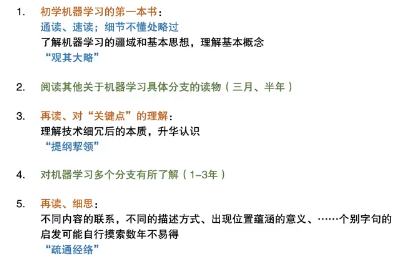

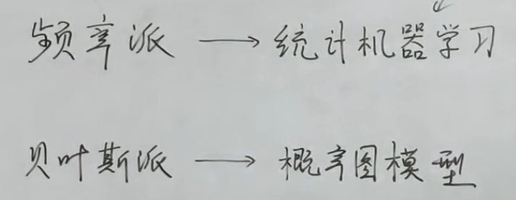

## 基本术语

机器学习定义：利用经验改善系统自身的性能

> 经验$\to$数据

PAC：概率近似正确
$$
P(|f(x)-y|\le \epsilon)\ge 1-\delta
$$
$P?=NP$


**归纳偏好（inductive bais）**——任何一个有效的机器学习算法必有其偏好

奥卡姆剃刀

> 可能最后不是算法好不好，而是你开始的假设偏好好不好

NFL定理（没有免费的午餐no free lunch）：

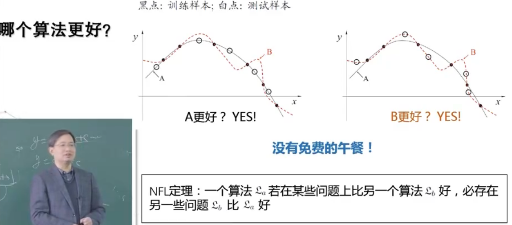


最优方案：按需设计、度身定制

## 典型的机器学习过程

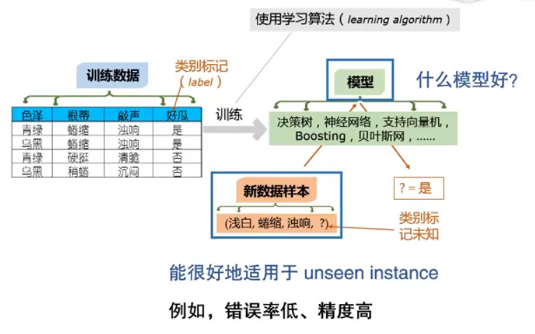

每个数据都是从一种分布中得到的一个采样


## 评价指标

- 泛化能力
  - 泛化误差/经验误差
  - 欠拟合underfitting
- 过拟合overfitting

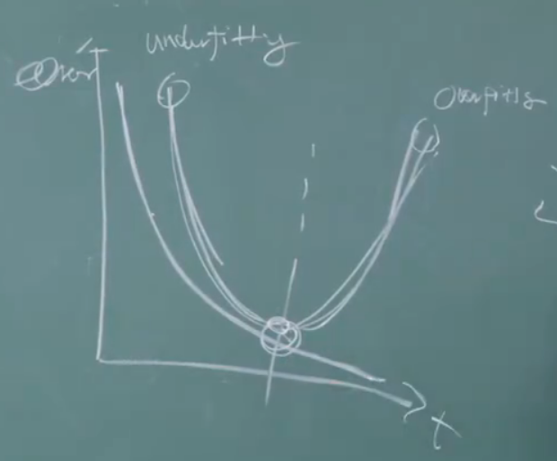

## 三个关键问题


- 评估方法

  - 留出法：分层采样/多次随机划分/测试集不能太大or太小（$1/5\to 1/3$）——但最后给用户的应该是所有数据训练出来的模型，测试集训练只是用于选择模型

  - k—折(fold)交叉验证法

    

  - 自助法bootstrap sampling


- 性能度量：评价模型泛化能力好坏，反映任务需求

  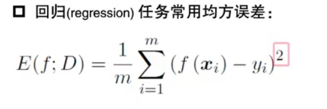

  错误率/精度

  

  查准率/查全率——混淆矩阵

  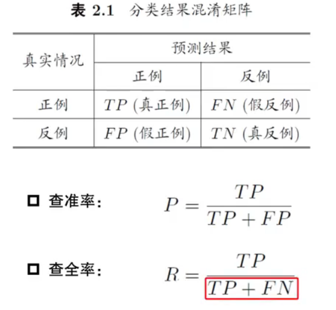

  F1度量：结合P、R——调和平均

  

- 比较检验

  

  

## 调参

- 超参数（人为设定）：算法的参数
- 模型的参数：一般由学习确定

- 调参：先产生若干模型，然后基于某种评估方法进行选择

  

  验证集用来调参

# 数学基础

高斯分布

## 极大似然估计MLE

我们有N个数据，每个数据是p维，$x_i\in R^p，x_i\sim_{iid} N(\mu,\sigma^2)$
$$
Data:~ X =(x_1,...,x_N)^T
$$

> iid代表独立同分布

以下是极大似然估计MLE的推导——点估计
$$
MLE:\theta = \arg \max_{\theta} p(X|\theta)
$$


对于高斯分布，均值$\mu_{MLE}$是无偏估计，方差$\sigma^2_{MLE}$是有偏估计，以下是有偏和无偏原因的推导：


$$
无偏\hat\sigma=\frac{1}{N-1}\sum(x_i-\mu_{MLE})^2
$$
也就是使用MLE估计出来的$\sigma^2_{MLE}$是偏小了

极大似然估计MLE——点估计，也就是会有一定的偏差

## 概率密度函数方面理解

接下来我们来将x拓展到高维空间：


马氏距离（Mahalanobis Distance）

马氏距离实际上是欧氏距离在多变量下的“加强版”，用于测量点（向量）与分布之间的距离。向量x到一个均值为$\mu$，协方差为$\Sigma$的样本分布的马氏距离计算如下:
$$
d = \sqrt{(x-\mu)\Sigma^{-1}(x-\mu)^T},\Sigma为协方差矩阵
$$
其中x的分布只与$exp$内的参数有关，其它均为常数，因此我们只关注${(x-\mu)\Sigma^{-1}(x-\mu)^T}$，先对$\Sigma$进行特征值分解


于是$\Delta = \sum \frac{y_i^2}{x_i}$，其中$y_i = (x-\mu)^T u_i$相当于将x减去均值$\mu$然后向$u_i$方向的投影。我们对$\Delta = r$取固定的值，于是$x$就有一个固定的概率分布，对于2维，取固定的r，就相当于三维空间的山取截面映射到二维就是不同大小的椭圆


## 局限性

方差矩阵$\Sigma$参数量$\frac{p(p+1)}{2}= O(p^2)$参数量太多

- 简化为对角矩阵（假设）——factor analysis
- 各向同性——PCA
- 混合模型


## 已知联合概率求边缘概率和条件概率

先是概率论的引理


我们先来定义问题

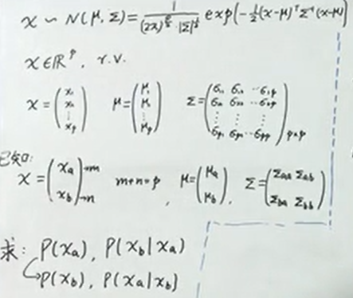

> 已知联合概率分布$p(x)$，求边缘概率分布$p(x_a)$和条件概率分布$p(x_b|x_a)$

边缘概率分布求解如下：


条件概率分布如下：

其中先定义了一个$x_{b\cdot a}$——别问为什么


然后利用$x_{b\cdot a}$


> 这里看作$y=Ax+B$根据引理求解，$x_{b\cdot a}与x_a$相互独立，$x_a$已知是常数

## 已知边缘概率和条件概率求联合概率

定义问题


$y=Ax+b+\epsilon$，linear Gaussion model


然后求$p(x|y)$，所以直接求联合概率分布，然后代入上一节的结论即可


## 杰森不等式

Jensen's Inequality内容如下：

假设$f(x)$是convex function（凸函数），则：
$$
E[f(x)]\ge f(E[x])
$$
下面进行一个构造型证明


利用


## 频率派VS贝叶斯派

iid独立同分布（Independent Identically Distribution）


## 样本均值和协方差


# 线性模型

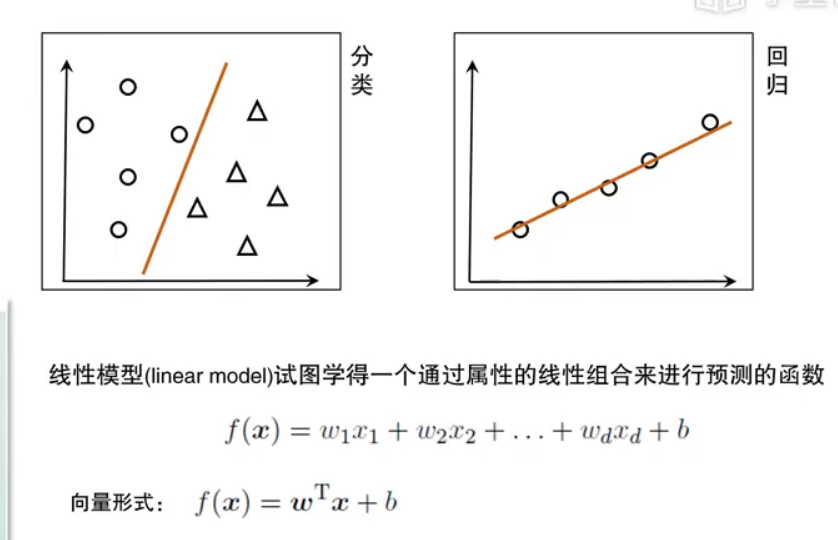

擅长处理数值

> 如果是颜色怎么办？有序：直接变成数值连续化，无序离散数据：变为k维向量$[0\quad 1\quad 0]$

## 线性回归

### 最小二乘估计


我们希望最小化
$$
L(w)=\sum||w^Tx_i-y_i||^2
$$
将其展开可得
$$
L(w) =w^TX^TXw-2w^TX^TY+Y^TY
$$
即寻找最好的$\hat w$
$$
\hat{w} = \arg \min L(w)
$$
让L对w求导可得
$$
w = (X^TX)^{-1}X^TY
$$
> 上述求导过程包括对矩阵的求导，以下是矩阵求导的一些基本公式
>
> - 线性函数
>
> $$
> \frac{\partial (\mathbf{a}^T \mathbf{x})}{\partial \mathbf{x}} = \mathbf{a} \\
> \frac{\partial (\mathbf{x}^T \mathbf{A} \mathbf{x})}{\partial \mathbf{x}} = (\mathbf{A} + \mathbf{A}^T) \mathbf{x}
> $$
>
> - 迹函数
>   $$
>   \frac{\partial \text{tr}(\mathbf{A} \mathbf{X})}{\partial \mathbf{X}} = \mathbf{A}^T \\
>   \frac{\partial \text{tr}(\mathbf{X}^T \mathbf{A} \mathbf{X})}{\partial \mathbf{X}} = (\mathbf{A} + \mathbf{A}^T) \mathbf{X}
>   $$
>
> - 行列式函数
>   $$
>   \frac{\partial \det(\mathbf{X})}{\partial \mathbf{X}} = \det(\mathbf{X}) \cdot (\mathbf{X}^{-1})^T
>   $$

当$X$为列满秩时，X的伪逆$X^{+}=(X^TX)^{-1}X^T$。所以最小二乘的解也可以记为$w=X^+Y$

矩阵求逆

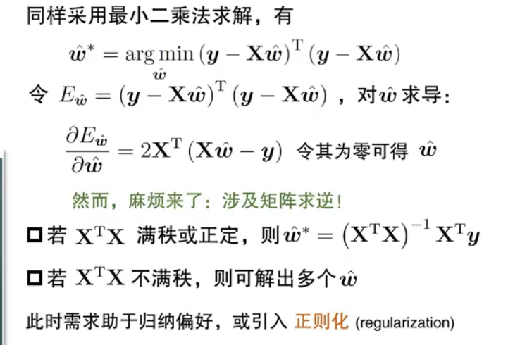

**正则化**：加入归纳偏好

### 最小二乘理解

- 可以看成使得每个点的预测值和真实值相差最小

  

- 也可以i看作$f(w)=w^Tx=x^T\beta$，寻找Y在p维空间上的投影

  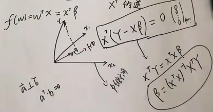

- 频率派视角

  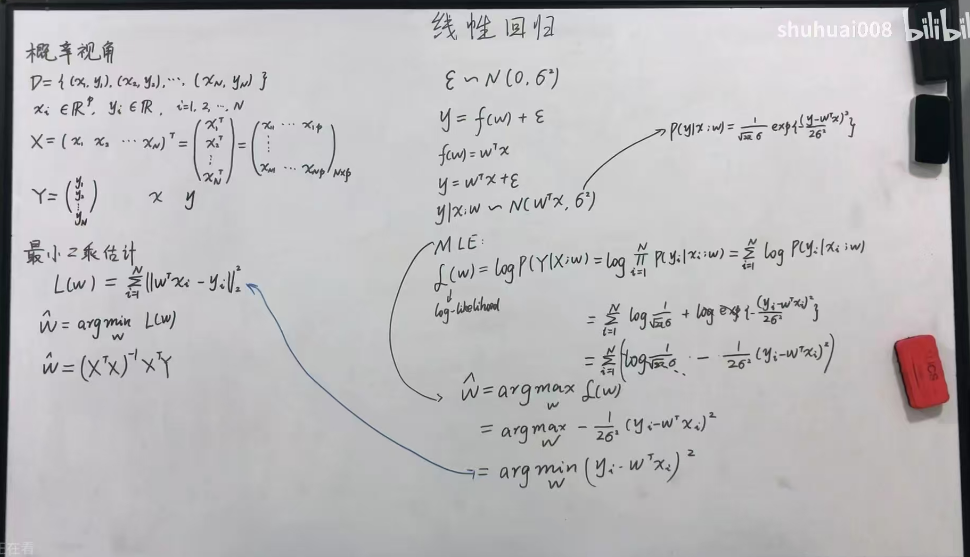

  假设$y=f(w)+\epsilon$，其中$\epsilon\sim N(0,\sigma^2)$。所以y也服从高斯分布

  所以最小二乘本质上就是噪声是高斯分布的MLE
  $$
  LSE\Leftrightarrow MLE~~~(noise ~is ~Gaussian~Dist)
  $$

### 正则化


解决过拟合的三个方法

- 加数据
- 特征选择/特征提取（PCA）——降维
- 正则化

正则化就是给原本的优化问题加上一个penalty惩罚项变为了
$$
\arg\min[L(w)+\lambda P(w)]
$$

- L1正则化：Lasso，$P(w)=||w||_1$

- L2正则化：Ridge岭回归，$P(w)=||w||_2^2=w^Tw$——权值衰减

  代入求解可以得到与原本不同的$w$
  $$
  \hat w=(X^TX+\lambda I )^{-1}X^TY
  $$
  这里$X^TX(半正定矩阵)+\lambda I(对角阵) $一定是可逆的

  下面从贝叶斯角度还看为什么要加上这样一个L2正则化

  

  实际上$MAP:\hat w=\arg \min p(w|y)$即可推出

  所以
  $$
  Regularized~~LSE \Leftrightarrow MAP(noise~~ is~~GD,prior~~is~~GD)
  $$
  

## 线性分类

### 背景


线性回归的三大特性

- 线性
- 全局性
- 数据未加工

$$
线性回归\Longrightarrow^{激活函数}_{降维}线性分类
$$


### 感知机


- 思想：错误驱动

- 模型：$f(x)=sign(w^Tx)$

- 使用Loss function为$L(w)=\sum -y_i w^Tx_i$

  > 如果分类正确$-y_i w^Tx_i=-1$，分类错误$-y_i w^Tx_i=1$

- 然后SGD求解即可


### 线性判别分析

>  fisher


- 思想：降维——高维数据都投影到一个轴上：松耦合（类间相隔远），高内聚（类内方差小）

- 然后接下来就用数学语言来表示什么叫类内小，类间大
  $$
  类间:(\bar{z}_1-\bar{z}_2)^2,类内:s_1+s_2
  $$
  据此定义目标函数：$J(w)=\frac{(\bar{z}_1-\bar{z}_2)^2}{s_1+s_2}$

下面介绍如何求解：

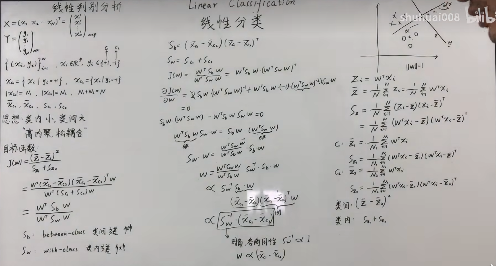

先将$J(w)$化简，然后求导使导数为0。因为$s_b,s_w$均为$p\times p$的矩阵，所以$w^Ts_bw,w^Ts_ww$均为实数。所以
$$
w=\frac{w^Ts_ww}{w^Ts_bw}s_w^{-1}s_bw\propto s_w^{-1}s_bw
$$
我们对于w只关心其方向，并不关心这个超平面的scale。又因为
$$
s_bw=(\bar{x}_{c1}-\bar{x}_{c2})(\bar{x}_{c1}-\bar{x}_{c2})^Tw,(\bar{x}_{c1}-\bar{x}_{c2})^Tw~~is~~1dim
$$
所以$w \propto s_w(\bar{x}_{c1}-\bar{x}_{c2})$

### 逻辑回归

软输出：概率判别模型：logistic regression


就是利用sigmoid函数来进行概率p的表示，然后利用MLE求解——可以推出min cross entropy

### 高斯判别分析

Gaussian Discriminant Analysis


- 几个假设
  - $y\sim Bernoulli(\phi)$
  - $x|y=i,\sim N(\mu_i,\sigma^2)$，两个不同y条件下x都服从均值不同方差相同的高斯分布

- 然后使用极大似然估计来估计出$\theta$

  将上述的$l(\theta)$拆为仅分别与$\mu_1,\mu_2,\phi$有关的三个部分，便于后面求解


上面分别求解了$\mu_1,\mu_2,\phi$，下面介绍如何求解$\Sigma$


> 对于一个实数x，$tr(x)=x $
>
> 
>
> 因此有这个部分
>
> 

### 朴素贝叶斯

Naive Bayes

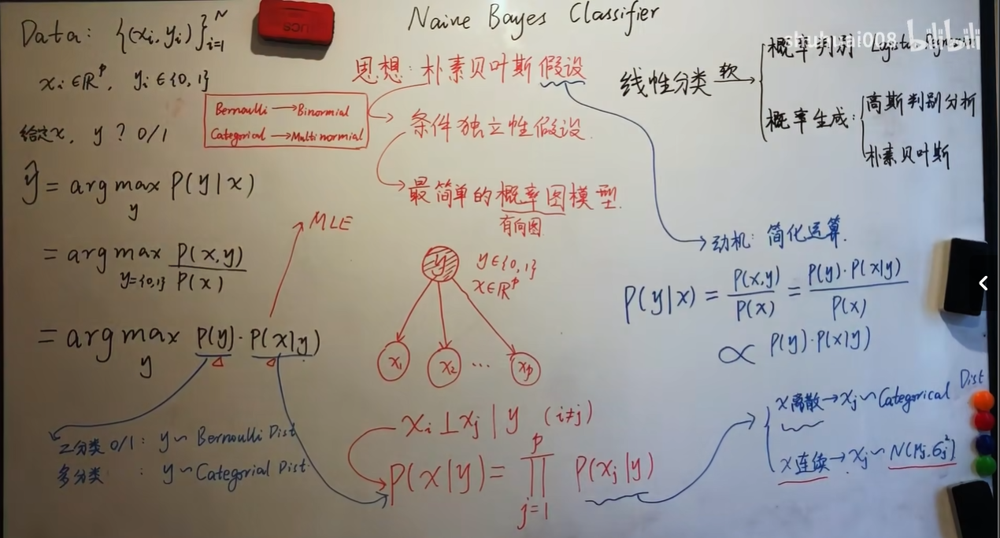

- 思想：条件独立性假设——最简单的概率图模型

  > 动机：简化运算
  >
  > 


## 广义线性模型

线性模型的变化

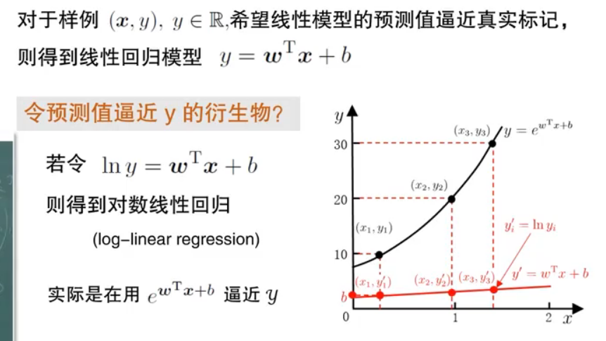

定义广义线性模型

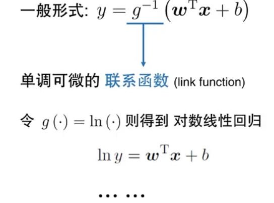


## 对率回归

二分类任务


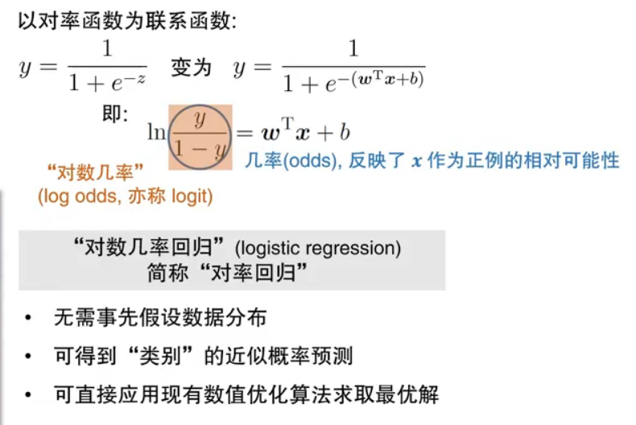

求解思路：直接最小二乘不行（优化需要凸函数）

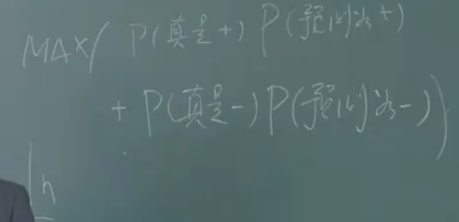


## 类别不平衡

class-imbalance不是任何类别不平衡都要处理

当丢掉的小类很重要时我们才需要做处理


- 过采样：多采样让小类和大类一样多

  SMOTE：样本中做插值

- 欠采样：减少采样让大类和小类一样少

  EasyEnsemble：

- 阈值移动：就是$\frac{y}{1-y}>1$把1改了就是把$y>\frac{1}{2}$改了


# 决策树

## 思想


分而治之：自根至叶的递归

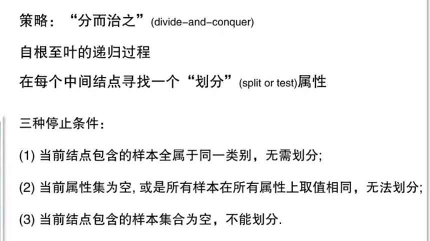

根据停止的节点的训练集的概率作为预测概率

## 基本算法

递归停止：

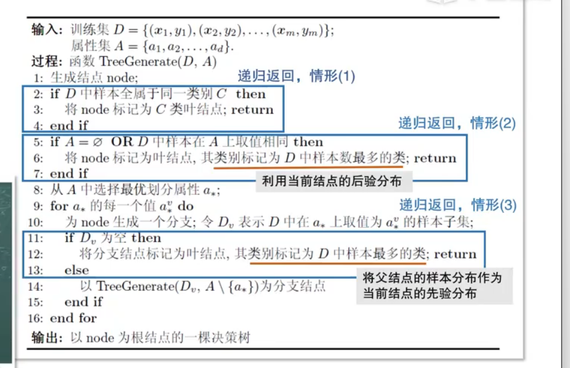

那么我们应该如何迭代呢？——根据信息增益选择划分属性（见下）

### 属性划分

信息增益：熵$P\log_2{P}$

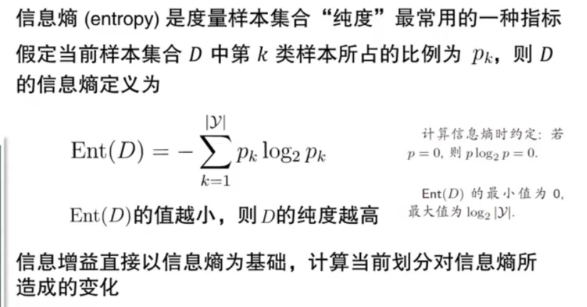

ID3：用于衡量节点的信息量

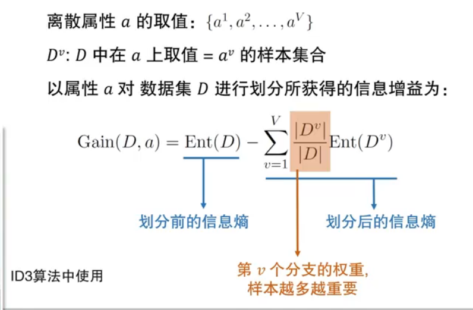

划分前信息熵减去划分后的就是我们这次划分的收获

**根据收获大小选择划分属性**

eg：


#### 其它划分方法

- 信息增益：偏好分支多的划分方式

- 增益率(gain ratio)C4.5算法：规范化normalization（让不可比的东西变成可比）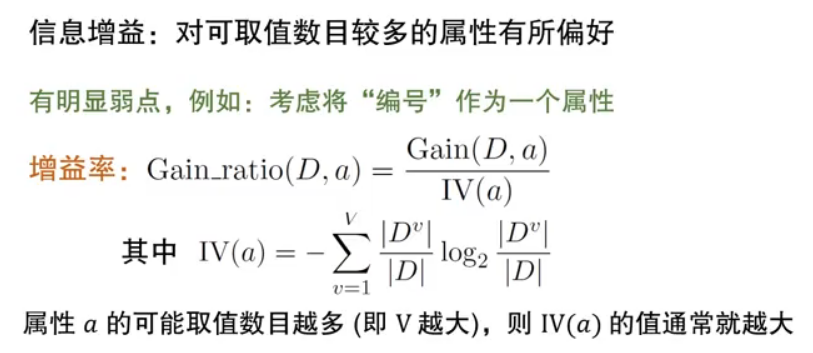

  没有标准说Gain和IV比值为多少比较好

  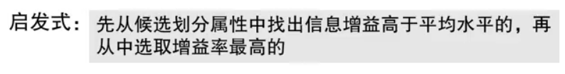

- 基尼指数(Gini Index)CART算法：

  

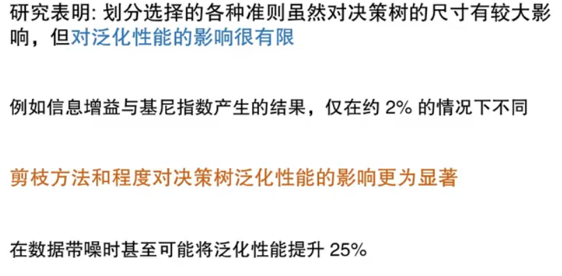

## 剪枝

剪枝pruning：决策树对付”过拟合“的手段——提升泛化性能

使用单个决策树一般都要选择剪枝


通过性能评估来评判剪枝，用验证集来判断

- 预剪枝：划分前先估计，若划分不能带来泛化性能的提升则不划分

  

  只有一层决策树称为”决策树桩“

- 后剪枝：自底向上对非叶节点进行考察，若将该节点对应的子树替换为叶节点能带来决策树泛化性能的提升，则替换

  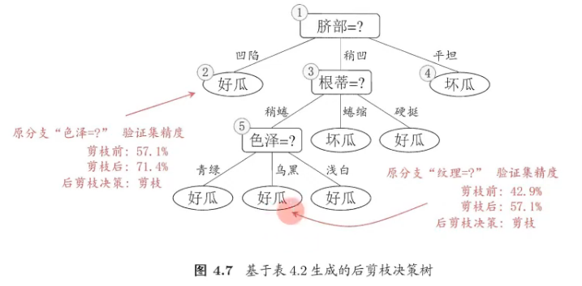

## 连续与缺失值

缺失值：数据会有属性缺失（不会则是对数据的极大浪费）


基本思路：样本赋权，权重划分

先权重赋权，全为1

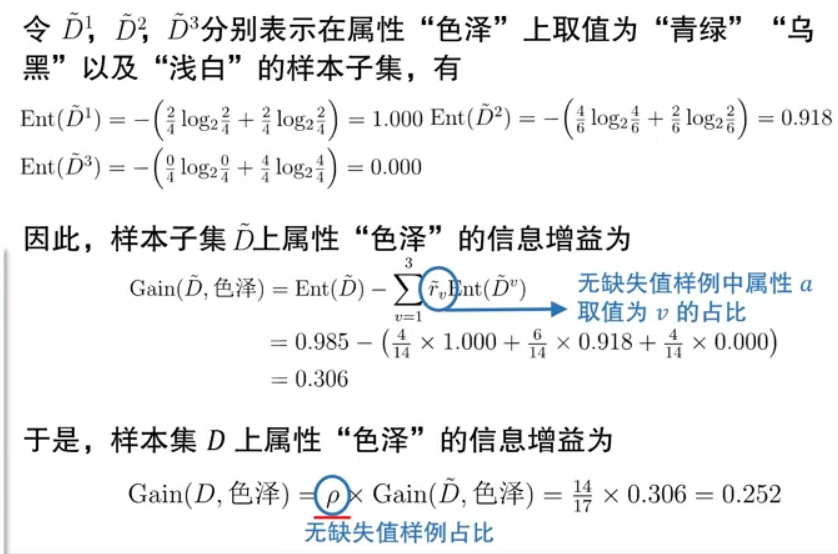

然后进行权重划分

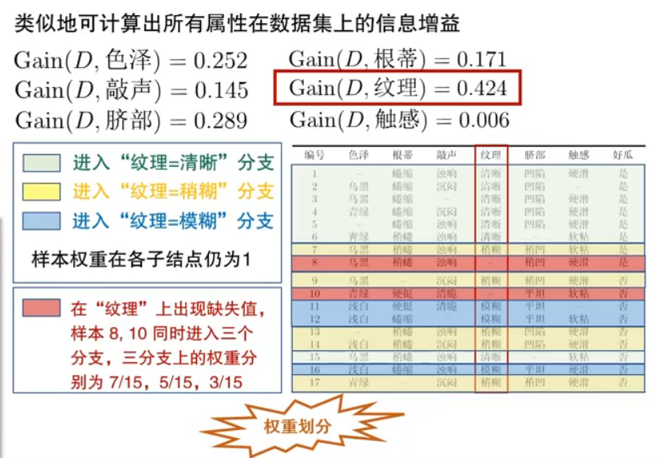

以后算这个分支权重就不是1了，而是刚刚权重划分后的权重了


# 支持向量机

## 硬间隔SVM

- SVM有三宝：间隔，对偶，核技巧

下面介绍一下hard-margin SVM硬间隔的SVM——最大间隔分类器

期望在多条可分的超平面中找到最中心的那一条（和感知机不同，感知机是根据不同的给定初始条件进行求解的）

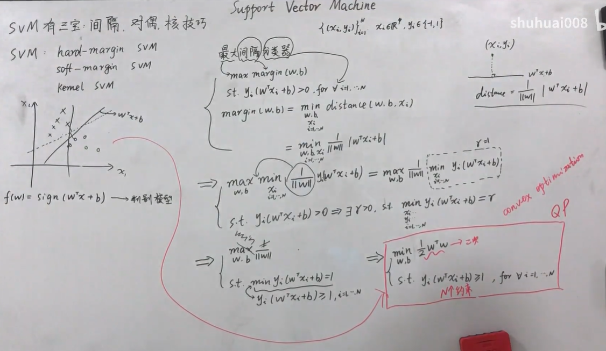

> ||w||的值可以缩放，因此直接定义为1即可

化简后就是一个二次优化问题

直接求解仅当个数较少而且维度较低时可以求解


于是下面介绍对偶问题的引入，帮助求解


$$
原对偶问题具有强对偶关系\Leftrightarrow KKT条件
$$

> 二次凸优化问题有强对偶关系上述没有证明

KKT条件中有互补松弛定理，仅$1-y_i(w^Tx_i+b)=0$这条线上的样本才有$\lambda_i\neq0$

因此虽然结论中
$$
w^*=\sum\lambda_iy_ix_i,b^*=y_k-\sum\lambda_iy_ix_i^Tx_k
$$
是每个样本量的线性组合，但是只有在这条线上才对最后的解有贡献——这些向量称为支持向量support vector

## 软间隔SVM


- basic idea：允许有一点点错误
- 后面的求解和hard SVM一样


## 基本型

线性可分：

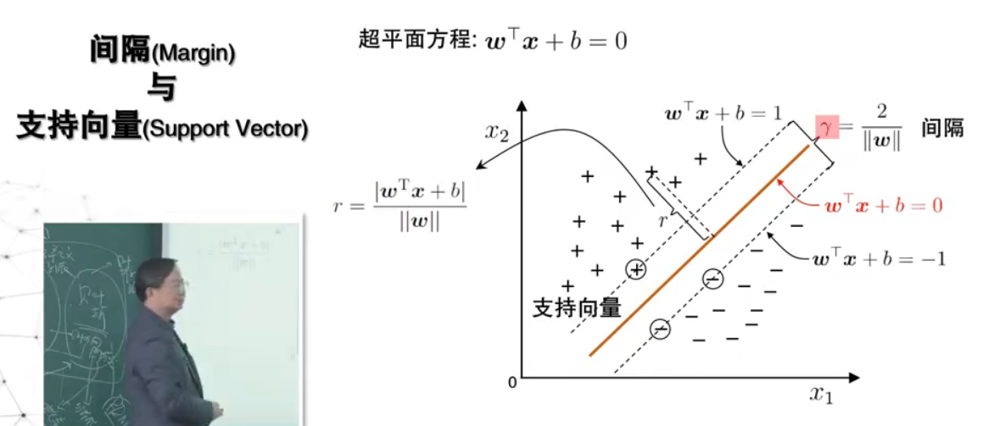

把这几个定理间隔线的向量称为支持向量

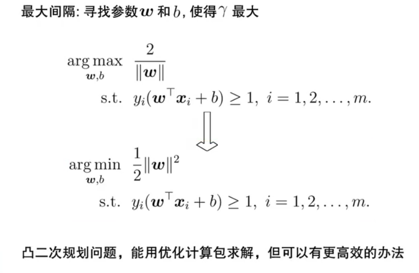

高效法：拉格朗日乘子法——对偶问题


解的特性


## 如何求解

- 凸优化包直接解

- SMO

  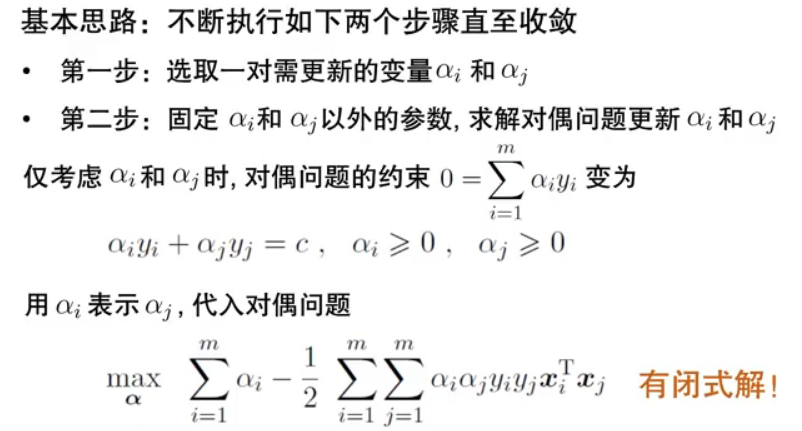

  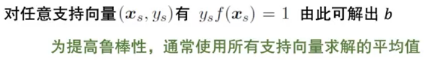

## 特征空间映射

一般没有能正确划分两类样本的超平面

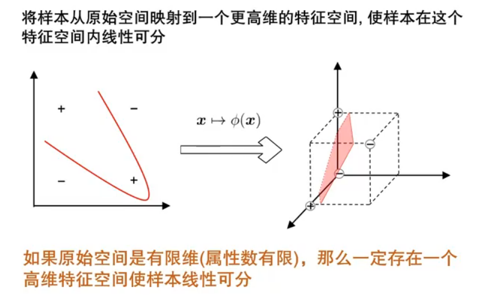

> 高维可能是无限维


高维计算内积难，于是我们设计一个核函数


每个RKHS都对应一个核函数，每个核函数对应的矩阵其元素定义了两个向量之间的关系，即唯一确定一个空间

于是因为存在一个核函数$s.t. \quad k(x_i,x_j)=\phi(x_i)^T\phi(x_j)$，所以我们想要的核函数一定在$\{k_1,k_2...k_n\}$的集合里面，也就是我们在集合里面找到最优的$k$

> 不能找到唯一理想解，不然$P=NP$了

## 如何使用

- 分类

- 回归SVR

  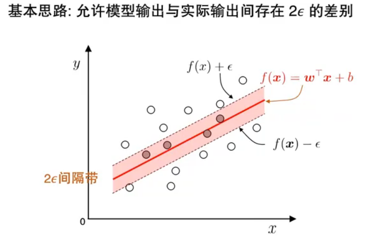

  对间隔带外面的点进行惩罚

  

  


# 核方法

Kernel method

## background

- Kernel method——思想角度：把低维空间的非线性转换为高维空间中的线性来处理
- kernel trick——计算角度
- kernel function（核函数最重要）


- 非线性带来高维转换
- 对偶表示带来内积

对于一个非线性问题先通过一个非线性转化$\phi(x)$将其转化为线性问题

> 定理：高维空间比低维空间更易线性可分

所以如何求高维转换后的内积？——使用核函数（不需要求具体的样本点了，直接求内积）

> 核函数的定义：——只需要满足内积定义即可
>
> 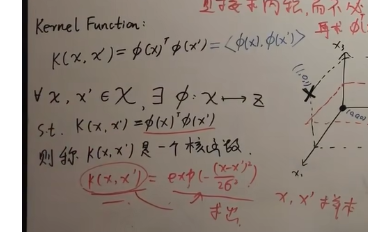

## 正定核

下面介绍正定核函数的两个定义


> Hilbert Space**希尔伯特空间**：完备的内积空间，即任何柯西序列都收敛于空间内的点。完备的，可能是无限维的，被赋予内积的线性空间

下面进行必要性证明


# 指数族分布

## background


- 只要满足某种形式的都叫指数族分布。标准型如下：

  

- 指数族分布的三个重要特性

  - 充分统计量：不需要全部的样本，只需要
    $$
    \phi(x) = \left( \begin{array}{c}
    \sum_{i=1}^{N} x_i \\
    \sum_{i=1}^{N} x_i^2
    \end{array} \right)
    $$
    这样就可以得到样本点均值和方差。——使得$\phi(x)$满足充分统计量的性质，起到了压缩数据的作用。

    对于online learning非常有用

  - 共轭：对于一般的求后验的公式

    

    但是积分太难或者形式太复杂。如果我们对于似然能找到一个共轭的先验，那么后验和先验就有相同的形式。
    $$
    P(z|x)\propto P(x|z)P(z)
    $$

  - 最大熵（无信息先验）：一般我们要求后验需要给出先验，如果不知道先验则让情况等可能分布——最大熵

## 高斯分布的指数族分布

这小节来看一下如何将一维的高斯分布函数改写为指数族分布的标准形式

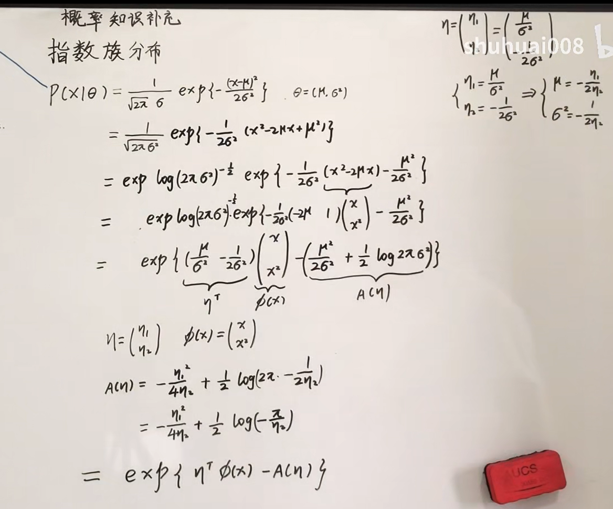


## 一些关系

### 对数配分函数与充分统计量的关系

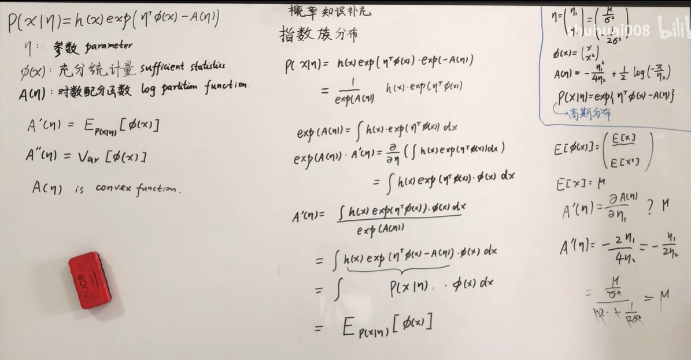

因为概率求和为1，所以$P(x|\eta)$的$\exp$中的函数必定存在一定的关系

> 上述推导将$\exp(A(\eta))$看作归一化因子，因此有这样的形式。

然后对左右两边同时对$\eta$求偏导可得结论：
$$
A\prime(\eta)=E(\phi(x))\\
A\prime\prime(\eta)=Var(\phi(x))
$$

### 极大似然估计与充分统计量的关系


## 最大熵角度

熵给我一个方法来表述等可能这个思想，下面介绍了为什么最大熵能够用来描述等可能


使用拉格朗日乘子法来求解。

在满足已知事实（事实就是数据）的情况下，最大熵原理求得的概率分布就是我们想要的概率分布：

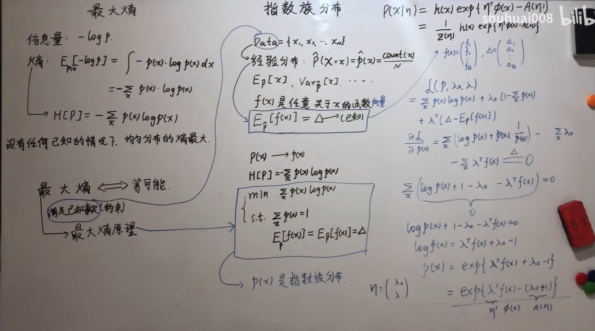

假设我们要求总体分布为$P(x)$。使用拉格朗日乘子法来求解，对每个样本$p(x_i)$分别单独求导

最后得到的$P(x)$是一个指数族分布


# 神经网络

神经网络：具有适应性的简单单元组成的广泛并行互连的网络

多层感知机

M-P神经元


激活函数：sigmoid函数，S型


挤压函数

多层前馈网络：**万有逼近性**

> 傅里叶也有万有逼近性

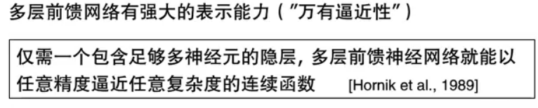

如何设置隐层神经元数？open problem，试错


## BP算法

back propagation——最常用，最常用


梯度下降

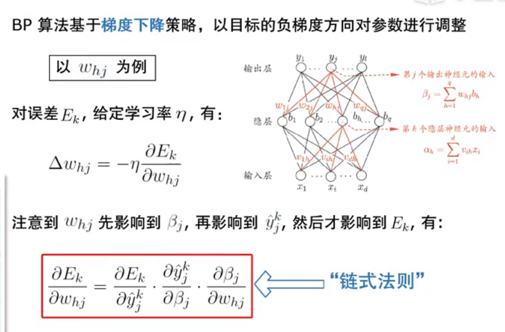


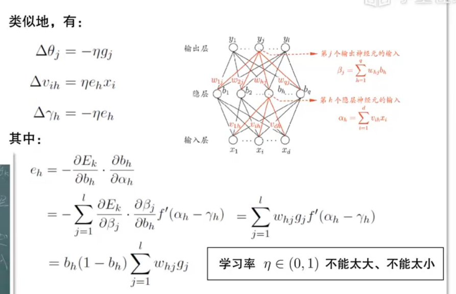

学习率

## CNN

[MobileNet(V1,V2,V3)网络结构详解与模型的搭建_bneck结构图-CSDN博客](https://blog.csdn.net/binlin199012/article/details/107155719)

[卷积神经网络的改进 —— 分组卷积、DW 与 PW_dw卷积-CSDN博客](https://blog.csdn.net/IT__learning/article/details/119107079#:~:text=本文介绍了卷积神经网络的三种改进方法：分组卷积、深度分离卷积和逐点卷积，以及它们的参数量和运算量的计算方法和优缺点。分组卷积可以减少参数量和运算量，深度分离卷积可以利用不同通道的信息，逐点卷)

```
输出维度 = 输入维度 + 2*padding - kernel_size +1
```

拿`nn.Conv2d(3,16,3,padding=1)`举例（`原始为3通道，RGB`），如果输入图像是32*32，那么输出也是32*32。也就是说输入为：3*32*32，输出为：16*32*32。

各个维度的计算：

[【pytorch实战学习】第六篇：CIFAR-10分类实现](https://blog.csdn.net/QLeelq/article/details/123621393)


# 贝叶斯学习


## 贝叶斯决策论


## 判别式和生成式模型


生成式想要原本的分布模型

## 贝叶斯分类器和贝叶斯学习

- 频率主义：统计——点估计
- 贝叶斯主义：贝叶斯学习——分布估计


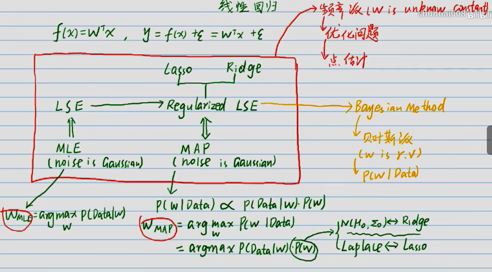

### 概述

Bayesian Learning

贝叶斯推理提供了一种概率手段，基于如下的假定： 待考察的量遵循某概率分布，且可根据这些概率及已观察到的数据进行推理，以作出最优的决策


特性

- 最大优点：观察到的每个训练样例可以**增量地降低或升高某假设的估计概率**。而其它算法会在某个假设与任一样例不一致时完全去掉该假设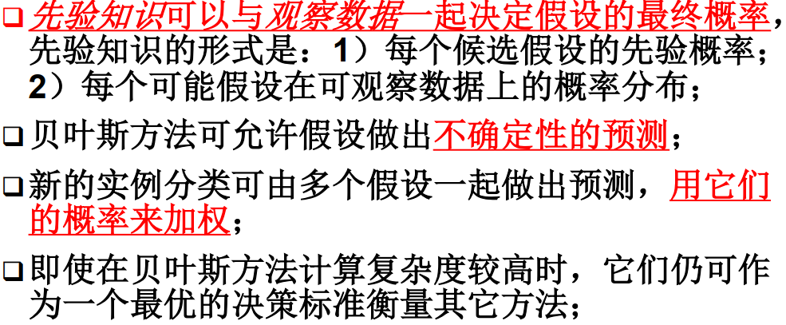
- 

$$
P(A|B) = \frac{P(B|A) \cdot P(A)}{P(B)}
$$

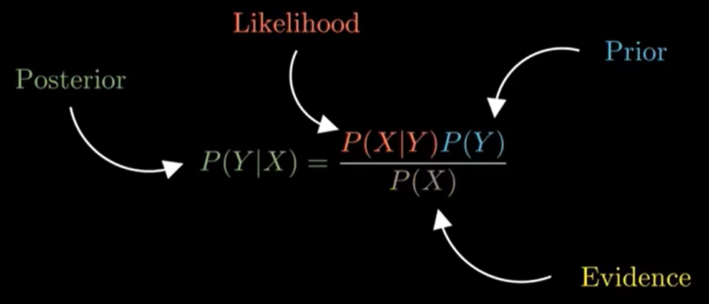

- $$
  p(x_1, \cdots, x_n, \theta) = p(x_1, \cdots, x_n | \theta) \pi(\theta)
  $$

  $$
  \pi(\theta | x_1, \cdots, x_n) = \frac{p(x_1, \cdots, x_n, \theta)}{p(x_1, \cdots, x_n)}
  $$

  $$
  \pi(\theta | x_1, \cdots, x_n) = \frac{p(x_1, \cdots, x_n | \theta) \pi(\theta)}{\int p(x_1, \cdots, x_n | \theta) \pi(\theta) d\theta}
  $$

  > 其中$\pi(\theta)$是先验分布

- MLF**极大似然函数**：通过最大化似然函数来找到最有可能生成观测数据的参数值

- 极大后验假设（MAP）：

  学习器在候选假设集合H中寻找给定数据D时可能性最大的假设h， h被称为极大后验假设（MAP）；确定MAP的方法是用贝叶斯公式计算每个候选假设的后验概率
  $$
  h_{MAP} = \arg\max_{h \in H} P(h | D) = \arg\max_{h \in H} \frac{P(D | h) P(h)}{P(D)} = \arg\max_{h \in H} P(D | h) P(h)
  $$

- **极大似然假设**（Maximum Likelihood Hypothesis，简称MLH,ML）：是指在给定数据集的情况下，选择最有可能生成这些数据的假设或模型

  在某些情况下， 可假定H中每个假设有相同的先验概率，这样式子可以进一步简化，只需考虑$P(D|h)$来寻找极大可能假设
  $$
  h_{ML} = \arg\max_{h \in H} P(D | h)
  $$

  > $P(D|h)$常被称为给定h时数据D的似然度，而使$P(D|h)$最大的假设被称为**极大似然假设**

贝叶斯推理的结果很大程度上依赖于先验概率，另外不是完全接受或拒绝假设，只是在观察到较多的数据后增大或减小了假设的可能性

- **交叉熵**:

$$
H(p,q)=-\sum p(x_i)\log q(x_i)
$$

- iid假设：它假设数据集中的样本是**独立**且**同分布**的。


### 贝叶斯线性回归

Bayesian Linear Regression


## 极大似然估计


## 朴素贝叶斯分类器

naive bayes classifier

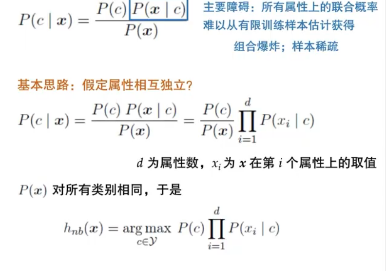

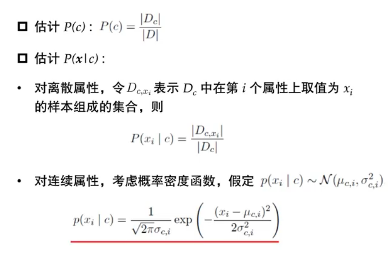

eg：

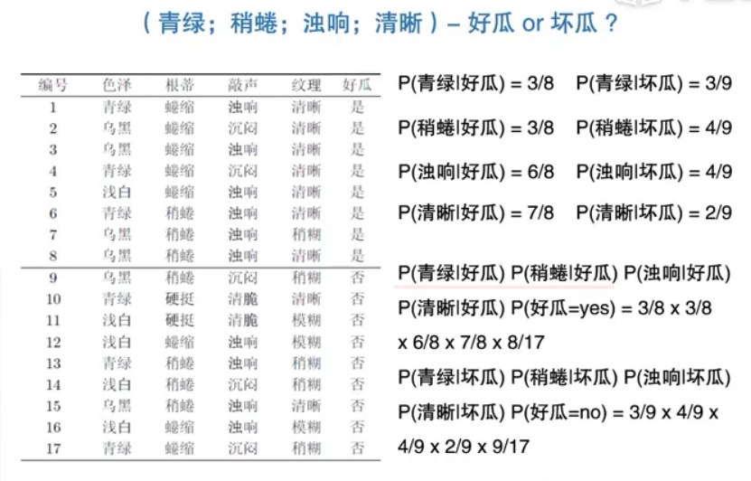

# 集成学习

ensemble learning


同质（考虑diversity）/异质(alignment配准)

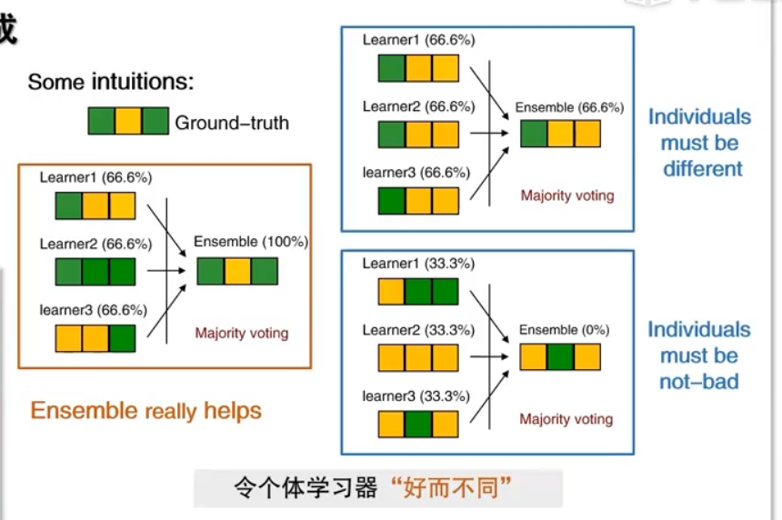

个体学习器必须”好而不同“

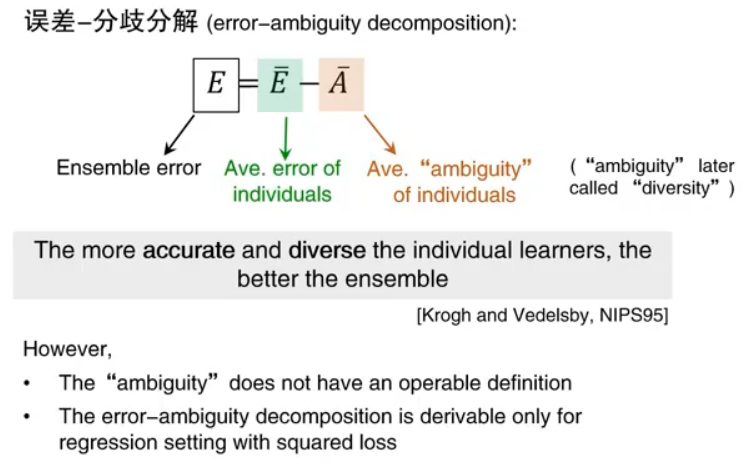

> 希望每个模型精确度都高，还希望之间差异较大

两类常用的集成学习方法

- 序列化方法：AdaBoost，GradientBoost，XGBoost
- 并行化算法：bagging，random forest

## Boosting

base：基学习算法，基学习器

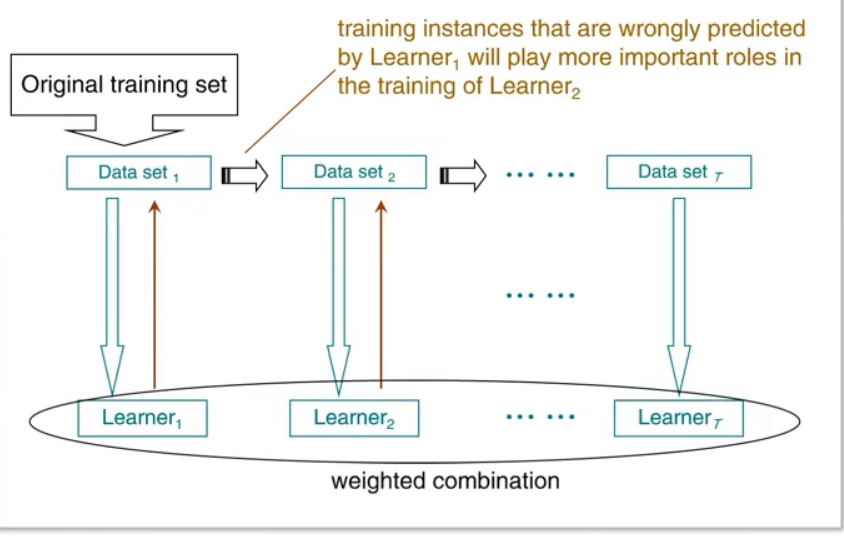

对正确的样本权重下降，错误的样本权重上升，然后进行采样(或者直接代入权重)得到新的data set

残差逼近

## Bagging

对数据集进行可重复采样


改进版：随机森林RF——选特征

[【实践】随机森林算法参数解释及调优（含Python代码）_随机森林参数调优-CSDN博客](https://blog.csdn.net/wzk4869/article/details/126256780)

## 结合策略

- 平均法：加权
- 投票法
- 学习法


## 多样性度量


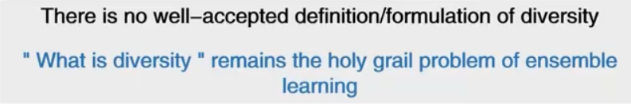

holy grail圣杯

# 聚类

有监督学习：分类，回归

无监督学习：聚类，密度估计

簇cluster，聚类clustering

**聚类的”好坏“不存在绝对标准**


## 常见聚类算法

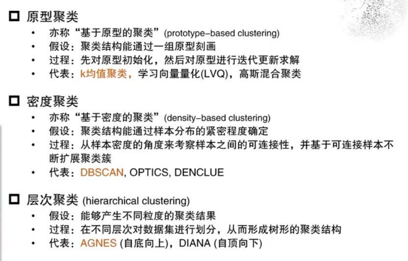

- K均值聚类：椭球形


# 降维与度量学习

降维Dimensionality Reduction——我们实际上关心的是泛化误差

## background


下面介绍一下维度灾难，在数据维度变高时，高维空间样本量和数据量的分布和我们想象的不太一样

- 超立方体和超球体可以发现$V_{超球体}\to 0$，可见样本分布稀疏
- 而任意两个超球体，无论之间$\epsilon$有多小，最后$\lim \frac{V_环}{V_外}=1$，因此数据始终分布在超球体的外表面上

上述两点均说明了在高维空间中样本的稀疏性


## k近邻学习

找最近邻的k个训练样本，根据这k个邻居来预测，常用投票法

没有显示的训练过程——lazy learning

要求样本是稠密的

> 急切学习：相应的，那些在训练阶段就对样本进行学习处理的方法


## 低维嵌入

维度灾难：样本稀疏而特征维数极高

缓解维数灾难的一个重要途径是降维 (dimension reduction)， 亦称" 维数
约简 PP ，即通过某种数学变换将原始高维属性空间转变为 一个低维"子空
间" (subspace) 

这是因为在很多时候， 人们观测或收集到的数据样本
虽是高维 的?但与学习任务密切相关的也许仅是某个低维分布，即高维空间中
的一个低维"嵌入" (embedding) .

多维缩放MDS：要求原始空间中样本之间的距离在低维空间中得以保持

基于线性变换来进行降维的方法称为**线性降维方法**：$Z=W^TX$


## PCA

主成分分析PCA——最常用的一种降维方法

classifical PCA：

对于正交属性空间中的样本点，如何用一个超平面(直线的高维推广)对所有样本进行恰当的表达?  

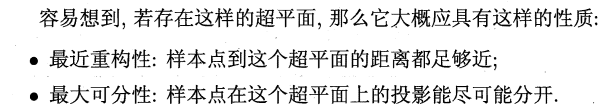

显然，低维空间与原始高维空间必有不同，因为对应于最小的 d-d' 个特征值的特征向量被舍弃了，这是降维导致的结果.但舍弃这部分信息往往是必要的- 一方面舍弃这部分信息之后能使样本的采样密度增大，这正是降维的重要动机; 另一方面，当数据受到噪声影响时， 最小的特征值所对应的特征向量往往与噪声有关?将它们舍弃能在一定程度上起到去噪的效果.  


PCA就是对原始特征空间的重构，使得原本线性无关的一组向量变为线性相关，可从以下两个基本方法实现

> 两者对于J的初始定义不同，但是最后求解的结果是一样的

- 最大投影方差

  化简过后相当于求解最简单的带等式约束的优化问题
  $$
  \hat{u}_1=\arg \max u_1^Tsu_1,s.t.~u_1^T u_1 = 1
  $$
  直接拉格朗日法求解即可

- 最小重构距离

  

- 也可以不求协方差矩阵，直接对数据进行中心化然后做SVD分解，可以取得相同的效果

  同样的还有PCoA——通过对T矩阵可以直接求取坐标

  > S是$p\times p$是维度量，T是$N\times N$是数据量，可以根据实际大小来选择

  

- P-PCA（Probalibity PCA）概率角度

  


## 核化线性降维

非线性阵维的 一种常用 方法，是基于核技巧对线性降维方法进行"核化" (kernelized).

核主成分分析 (Kernelized PCA，简称 KPCA)  


## 流形学习

流形：局部具有欧式空间的性质，两个点的距离在流形空间中称为“测地线距离“

manifold learning

- 等度量映射：Isomap，炼个回归学习器来映射吧

  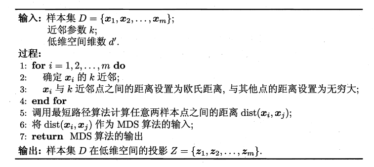

  

- 局部线性嵌入：LLE保持邻域内样本之间的线性关系


## 度量学习

对高维数据进行降维的主要目的是希望找一个合适的低维空间，在此空间中进行学习能比原始空间性能更好

对高维空间找一个合理的度量，并对低维空间也适用

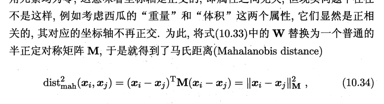

其中 M 亦称"度量矩阵"，而度量学习则是对 M 进行学习，根据不同指标进行学习，下面是一种指标：提高近邻分析的性能

近邻分析NCA


# 特征选择与稀疏学习

解决维数灾难：降维技术/特征选择

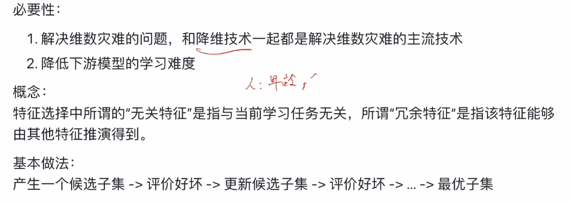


## 子集搜索与评价

子集搜索（都是贪心的）

- 前向搜索：由少到多
- 后向搜索：由多到少
- 双向搜索

评价：信息熵，信息增益

常见的特征选择方法大致可分为三类:过滤式(filter)、包裹式 (wrapper)和.嵌入式 (embedding)


## 过滤式

先特征选择，再训练学习器

Relief算法：计算相关统计量


## 包裹式

用学习器结果作为评价指标来进行特征选择

包裹式特征选择的目的就是为给定学习器选择最有利于其性能、 "量身走做"的特征子集

时间开销很大


## 嵌入式

把特征选择过程也丢进学习器


希望保留尽量少的有效特征

L1范数更容易得到稀疏解


## 稀疏表示和字典学习

如何将稠密数据变得稀疏？

我们需学习出这样一个"字典"为普通稠密表达的样本找到合适的字典，将样本转化为合适的稀疏表示形式，从而使学习任务得以简化，模型复杂度得以降低，通常称为"字典学习" (dictionary learning) ，亦称"稀疏编码" (sparse coding).  

"字典学习"更侧重于学得字典的过程?而"稀疏编码"则更侧重于对样本进行稀疏表达的过  

LASSO ：集成学习boosting（交替优化）


## 压缩感知

与特征选择、稀疏表示不同，压缩感知关注的是如何利用信号本身所具有的稀疏性，从部分观测样本中恢复原信号


# 计算学习理论

计算学习理论 (computational learning theory)研究的是关于通过"计算"来进行"学习"的理论，即关于机器学习的理论基础，其目的是分析学习任务的困难本质，为学习算法提供理论保证，并根据分析结果指导算法设计.


# 半监督学习

监督学习难点：

- 标记数据成本高
- 未标记的数据大量存在且易得

半监督学习=监督学习+无监督学习

"主动学习" (active learning) ，其目标是使用尽量少的"查询" (query)未获得尽量好的性能。

> 未标记的数据：若它们与有标记样本是从同样的数据源独立同分布来样而来，则它们所包含的关于数据分布的信息对建立模型将大有禅益  


- 基于生成模型的方法

  

- 半监督SVM

  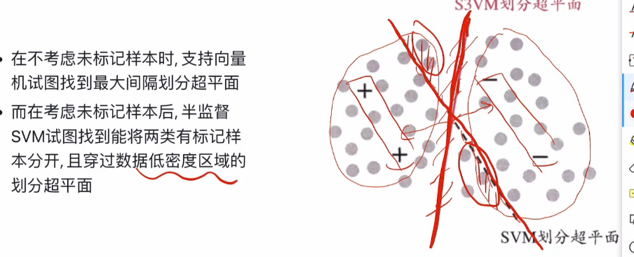

  引入未标记的样本，超平面会穿过数据低密度区

- 图半监督学习

  推导自己看


# 概率图模型

概率图=概率+图=representation+interface+learning

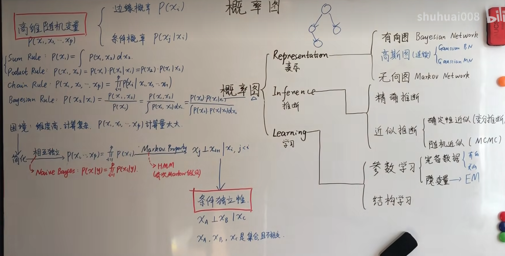

条件独立性：

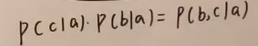

> b,c条件独立，$c\bot b|a$

链式法则：


因子分解：

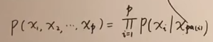

> $x_{pa(i)}$是$x_i$的父亲集合

##  Bayesian Network

有向图

条件概率简化依赖链步长

- 构建图：拓扑排序（因子分解）

  条件独立性

  

  经过推导，有向图本身已经蕴含了条件独立性。对于tail to tail

  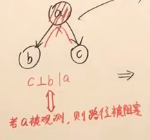

  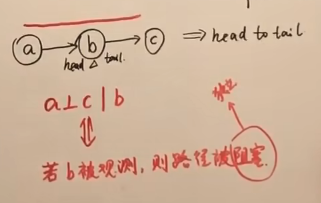

  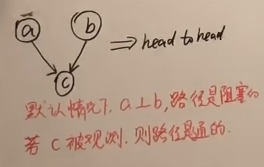

- Bayesian Network

  D-sepration

  

- 单一：朴素贝叶斯 Naive Bayes

- 混合：GMM（高斯混合模型）

  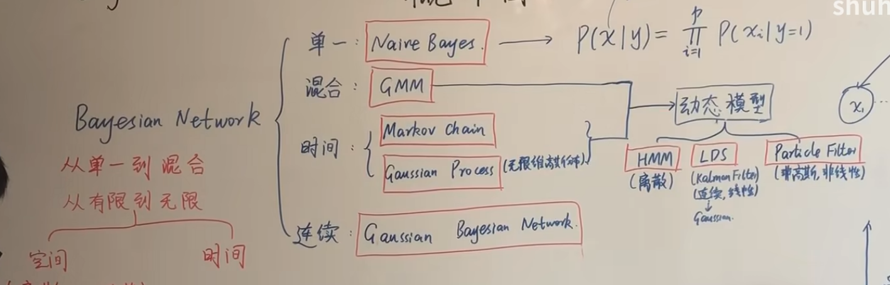


## Markov Network

无向图

- 条件独立性

  

- 因子分解

  


# EM算法

Expectation Maximization Algorithm期望最大

## 狭义EM

- 是什么：一种迭代算法，主要用于**含有隐变量的概率模型参数估计**，比如最大似然估计或者极大后验概率估计。

- 主要思想：

  当模型存在**隐变量**（无法直接观测的数据）时，直接使用极大似然估计（MLE）难以求解。EM算法通过以下两步交替迭代逼近最优解：

  - **E步（Expectation）**：基于当前参数估计隐变量的概率分布，计算对数似然函数的期望。
  - **M步（Maximization）**：最大化E步得到的期望，更新模型参数。

  通过反复迭代，逐步提高参数估计的准确性，直至收敛。

- 推导：

  -  收敛性证明

    

  - 导出ELBO+KL Divergence[深入理解EM算法（ELBO+KL形式） - 知乎 (zhihu.com)](https://zhuanlan.zhihu.com/p/365641813)

    
    
    使用E-step求期望时，默认隐藏数据Z的分布$q(z)$等于后验$P(z|x,\theta)$
    $$
    \log{P(x|\theta)} = ELBO+KL(q||p)
    $$
    
    导出ELBO+Jetson inequality
    
    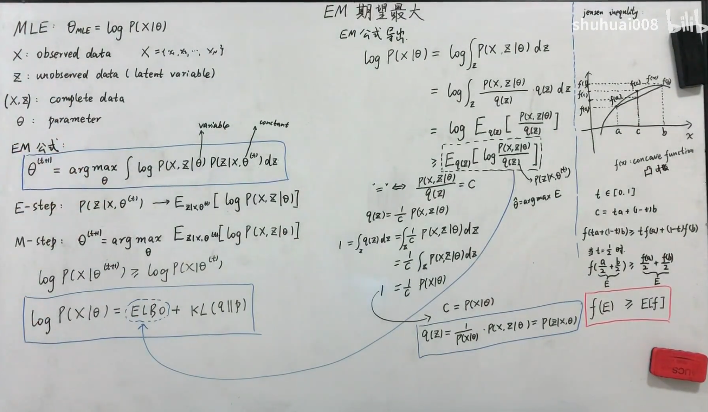

重要的一步：
$$
P(x) = \int_z P(x,z)dz
$$
上述介绍的都是狭义的EM

EM主要用来解决概率生成模型


## 广义EM

[深入理解EM算法-广义EM - 知乎 (zhihu.com)](https://zhuanlan.zhihu.com/p/367076459)

使用E-step求期望时，默认隐藏数据Z的分布$q(z)$等于后验$P(z|x,\theta)$。但后验常常太复杂intractable推不出来

所以广义EM多了一步固定$\theta$，先求出一个当前最好的$q$


## EM变种

- MM
- 坐标上升法的思想SMO
- VBEM/VEM
- MCEM：蒙特卡洛EM

# GMM高斯混合模型

## 模型介绍


- 几何角度：加权平均——多个高斯分布叠加而成

- 混合模型（生成）角度：引入一个隐变量z

## 极大似然


单一高斯模型直接MLE求解可行，但是MLE求解GMM不行，无法得出解析解

## EM求解

- E-step

  

- M-step

  


# 变分推断

[机器学习-白板推导系列(十二)-变分推断（Variational Inference）笔记 - 知乎 (zhihu.com)](https://zhuanlan.zhihu.com/p/345597656)

Variational Inference 变分推断

- 核心思想：**用一个简单的参数化分布（变分分布）逼近真实后验分布**，从而将复杂的概率推断问题转化为可处理的优化问题。

  引入一个简单的分布$q(z,\theta)$(如高斯分布)，通过优化KL散度（衡量两个分布的差异）实现逼近，直接优化KL散度不可行，故通过最大化ELBO来间接最小化KL散度

## background


- 频率角度就是一个优化问题

- 贝叶斯角度就是一个积分问题

  其中最重要的一步就是Inference，分为精确推断和近似推断

  近似推断还分为确定性近似（VI变分推断），随机近似（MCMC，MH等）


## Formula Deduction


前面是之前的推导，后面介绍如何求解$q(z)$

假设$q(z)$可以划分为M个相互独立的组（平均场理论），$L(q)$分为两个部分，分别求解

> 看到积分就想到期望

对于②每一项单独拿出来如下


因此化简如下，把$z_j$拿出来，其余部分看作常数C


最后两式比较相减


## review

我们最终目标是找到$\hat{q}$


有了平均场理论，发现能推出解析的迭代的形式，采用坐标上升法

> 坐标上升法（Coordinate Ascent）是一种**非梯度优化方法**，其核心思想是通过**逐个优化变量**来逼近目标函数的极值
>
> 1. **分而治之**： 将多变量优化问题分解为一系列单变量子问题。**每次仅优化一个变量**，固定其他变量，降低问题复杂度。
> 2. **循环迭代**： 按顺序或特定规则依次优化所有变量，循环执行直到目标函数收敛。
> 3. **无梯度优化**： 不依赖梯度信息，直接通过单变量极值求解更新参数，适用于不可导或梯度计算复杂的问题。


## SGVI

使用随机梯度上升（SGA）的方法来求解变分推断优化问题

[机器学习-白板推导系列(十二)-变分推断（Variational Inference）笔记 - 知乎 (zhihu.com)](https://zhuanlan.zhihu.com/p/345597656)


# 规则学习


# MCMC

Markov Chain Monte Carlo

MCMC（Markov Chain Monte Carlo，马尔可夫链蒙特卡罗）是一种通过构建马尔可夫链来从复杂概率分布中采样的方法

## 概述

我们关心的是后验概率$p(z)$


我们想要采样进行随机近似来求概率分布，但是直接采样很困难——那我们应该如何进行采样呢？——于是我们想用MCMC这个方式来进行采样

> **PDF（Probability Density Function，概率密度函数）**
>
> **CDF（Cumulative Distribution Function，累积分布函数）**

- 随机分布采样

  

  对很多CDF没有逆函数

- 拒绝采样adjection sampling

  拒绝采样是一种从复杂概率分布中生成样本的方法，适用于无法直接采样但可以计算概率密度函数（PDF）值的情况。其核心思想是通过一个易于采样的提议分布来间接生成目标分布的样本。

  - 使用一个简单的提议分布 \( q(x) \) 来生成候选样本。
  - 通过接受或拒绝候选样本的方式，确保最终样本符合目标分布 \( p(x) \)。

   算法步骤

  1. **选择提议分布**：选择一个易于采样的分布 \( q(x) \) 和常数 \( M \)。
  2. **生成候选样本**：
     - 从 \( q(x) \) 中采样一个候选样本 \( x \)。
     - 从均匀分布 \( U(0, 1) \) 中生成一个随机数 \( u \)。
  3. **接受或拒绝**：
     - 计算接受概率 $\alpha = \frac{p(x)}{M \cdot q(x)}$ 。
     - 如果 $u \leq \alpha$，则接受x作为目标分布的样本；否则拒绝。
  4. **重复**：重复上述步骤，直到获得足够多的样本。

- importance sampling

  


- Markov Chain Monte Carlo（MH，Gibbs）

## 马尔科夫链

Markov Chain ：时间和状态都是离散的，状态$\{x_t\}$，转移矩阵$P\to[p_{ij}]$

满足马尔可夫性质——无后效性
$$
P(X_{t+1}=x|X_{1},X_{2},\ldots,X_{t})=P(X_{t+1}|X_{t})
$$
平稳分布：在任意时刻对应的概率分布是相同的，满足$\pi=\pi P $，其中$\pi$是一个概率分布，且$\sum \pi_i = 1~and~\pi_i\ge 0$

平稳分布是马尔可夫链中的一个核心概念，描述了当时间趋于无穷时，状态分布趋于稳定的情况——概率分布不变


如果我们把概率$p(z)$看作一个平稳分布$\pi\{k\}$，那么我们可以通过构造一个马氏链来收敛到平稳分布。

那么什么样的马氏链才能收敛到一个平稳分布呢？见下

Detailed Balance：$\pi(x)\cdot P(x\mapsto x^{*})=\pi(x^{*})\cdot P(x^{*}\mapsto x)$是平稳分布的充分不必要条件，通过Detailed Balance将$\pi ~ and ~ P$联系在了一起

## MH采样

要满足上述的Detailed Balance条件，如下针对随机的状态转移矩阵$Q$$p(x)\cdot Q(x\mapsto x^{*}\ne p(x^{*})\cdot Q(x^{*}\mapsto x)$，构造$\alpha(z,z^*)$使之满足条件：


如此就得到著名的Metropolis-Hastings算法：


如此采样N次，我们可以得到N个样本点

实际上$p(z)$不能直接求出，实际上我们使用的是$\hat{p}(z)$


## Gibbs采样

Gibbs采样一维一维进行采样，采样过程如下：


Gibbs采样是一个特殊的MH采样$\Leftrightarrow$接受率为1，为什么？代入得到如下：


关键是注意$z_{-i}=z^*_{-i}$


# 隐马尔可夫模型

隐马尔可夫模型HMM

**前向算法**是隐马尔可夫模型（HMM）中用于高效计算观测序列概率的动态规划方法

其核心目的是解决以下问题：给定HMM模型参数（状态转移矩阵、观测概率矩阵、初始状态分布），计算某一特定观测序列出现的概率。


# Linear Gaussian Model

Kalman Filtering = Linear Gaussian Model

Filtering问题就是旨在利用系统从初始时刻到当前时刻的观测数据，实时估计当前时刻的隐状态（不可直接观测的状态变量）及求：$P(z_t|x_{1:t})$

**核心目标**：在噪声干扰下，通过观测数据推断当前隐状态的最优估计值（如概率分布或点估计）。


| **算法**           | **适用系统**     | **核心思想**                                                 |
| ------------------ | ---------------- | ------------------------------------------------------------ |
| **卡尔曼滤波**     | 线性高斯系统     | 假设状态转移和观测模型为线性，噪声为高斯分布，通过均值和协方差递归更新状态估计。 |
| **扩展卡尔曼滤波** | 弱非线性系统     | 对非线性模型进行一阶泰勒展开近似，仍假设噪声高斯分布。       |
| **粒子滤波**       | 非线性非高斯系统 | 用一组随机粒子（采样点）近似状态的后验分布，通过重采样避免粒子退化。 |
| **隐马尔可夫滤波** | 离散隐状态系统   | 隐状态为离散变量，通过转移矩阵和发射矩阵进行概率推断（如语音识别中的音素序列估计）。 |

自共轭分布（Self-Conjugate Distribution）在给定特定的似然函数下，其后验分布与先验分布属于**同一分布族**。


# 粒子滤波

particle filter


# 强化学习

Reinforcement learning methods

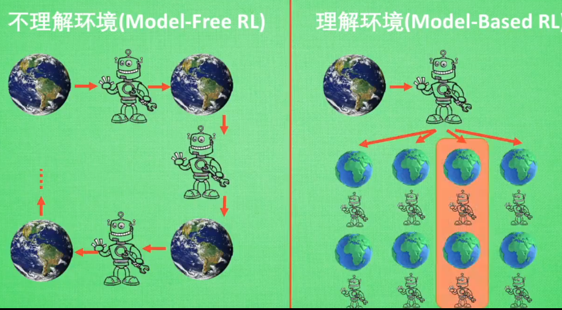

## Q-learning


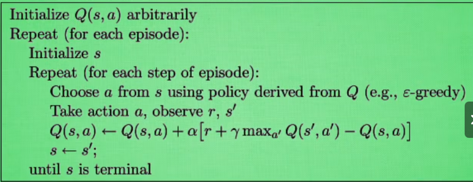


## DQN

DQN(deep Q-network) = deeplearning+Q-learning

状态多，表格难放，将查表部分用NN替代


- experience replay

  记忆库，用于重复学习

- fixed Q-targets——切断相关性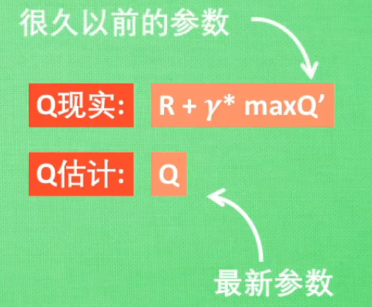

  

两种方法都是打破Q之间的关联性，学习过去经历过的或者别人经历的


## Policy Gradients

直接输出动作，用神经网络，反向传递时不用误差，而是靠奖惩信息来选择反向传播的力度


## Actor-Critic

policy gradients(actor) + value-based(critic)

用critic来指导actor的更新

但是因为连续更新，可能学不到东西——进阶：deep deterministic policy gradient


# References


