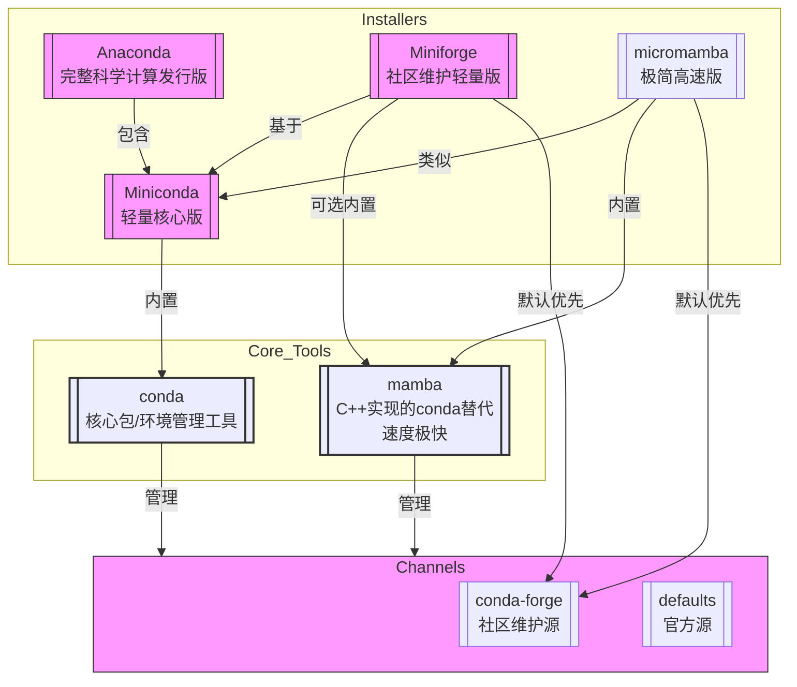

# Main Takeaway

介绍python的包管理器和环境

<!--more-->

# 关系图



# 🧩 核心关系梳理

- **Anaconda vs Miniconda**: Anaconda = Miniconda + 大量预装包 + GUI (Anaconda Navigator)。
- **conda**: 核心管理工具，Anaconda/Miniconda/Miniforge/micromamba 安装后都会提供。
- **conda-forge**: 一个强大且重要的 `conda` 包来源 `channel`，推荐优先使用。
- **Miniforge vs Micromamba**: 都是轻量安装器。Miniforge 主要针对 Mac (也支持 Win/Linux)，提供 `conda` (或可选 `mamba`)；micromamba 是 `mamba` 作者做的更轻量工具，提供 `mamba`。
- **Mamba vs conda**: Mamba 是更快、兼容的 `conda` 替代品。`micromamba` 类似于轻量版 Miniforge。

# 📌 关键结论与选择建议

1. **想轻量灵活？选 Miniconda 或 Miniforge (或 micromamba)**。Miniconda 更通用，Miniforge 默认优先 `conda-forge`，micromamba 速度最快且极简。
2. **需要开箱即用的完整科学栈？选 Anaconda**。
3. **追求安装/更新速度？用 Mamba (或 micromamba) 替换 `conda` 命令**。安装 Miniforge/micromamba 通常会自带 `mamba`。
4. **想用最新、最全的包？配置 `conda-forge` 为优先频道**。Miniforge/micromamba 默认就做好了此配置。手动配置可在 `.condarc` 中设置 `channel_priority: strict` 并添加 `conda-forge`。

# python项目管理

1. 创建venv：创建python环境，直接在项目目录下

   ```
   python -m venv .venv
   ```

2. 创建requirements.txt

   ```
   pip freeze > requirements.txt
   ```

3. 别人用的时候使用：

   ```
   pip install -r requirements.txt
   ```

> **Problem**：但是这个pip freeze有个缺陷：分不清什么是直接依赖，什么是间接依赖。而且卸载时只会卸载你指定的那个包，其间接依赖pip uninstall不会帮你卸载。

因此我们现在都使用pyproject.toml文件作为配置文件

```
pip install -e .
```

> Problem：但是这些依赖都需要手动添加，非常麻烦

因此出现了Poetry **UV** PDM，帮助我们自动完成上述的所有事情（包括创建环境，添加依赖，自动编写pyproject.toml）

# References

- 【15分钟彻底搞懂！Anaconda Miniconda conda-forge miniforge Mamba】<https://www.bilibili.com/video/BV1Fm4ZzDEeY?vd_source=93bb338120537438ee9180881deab9c1>
