# Main Takeaway

介绍python的包管理器和环境

<!--more-->


# 关系图

```mermaid
flowchart TD
    subgraph Core_Tools
        Conda[[conda\n核心包/环境管理工具]] 
        Mamba[[mamba\nC++实现的conda替代\n速度极快]]
    end

    subgraph Installers
        Anaconda[[Anaconda\n完整科学计算发行版]]
        Miniconda[[Miniconda\n轻量核心版]]
        Miniforge[[Miniforge\n社区维护轻量版]]
        Micromamba[[micromamba\n极简高速版]]
    end

    subgraph Channels
        CondaForge[[conda-forge\n社区维护源]]
        Defaults[[defaults\n官方源]]
    end

    %% 包含关系
    Anaconda -->|包含| Miniconda
    Miniforge -->|基于| Miniconda
    Micromamba -->|类似| Miniconda
  
    %% 工具关系
    Conda -->|管理| Channels
    Mamba -->|管理| Channels
    Miniconda -->|内置| Conda
    Miniforge -->|可选内置| Mamba
    Micromamba -->|内置| Mamba
  
    %% 频道配置
    Miniforge -->|默认优先| CondaForge
    Micromamba -->|默认优先| CondaForge

    classDef main fill:#6apl,stroke:#333,stroke-width:2px;
    classDef sub fill:#f9f,stroke:#333,stroke-width:1px;
    class Conda,Mamba main;
    class Anaconda,Miniconda,Miniforge,Channels sub;
```



# 🧩 核心关系梳理

- **Anaconda vs Miniconda**: Anaconda = Miniconda + 大量预装包 + GUI (Anaconda Navigator)。
- **conda**: 核心管理工具，Anaconda/Miniconda/Miniforge/micromamba 安装后都会提供。
- **conda-forge**: 一个强大且重要的 `conda` 包来源 `channel`，推荐优先使用。
- **Miniforge vs Micromamba**: 都是轻量安装器。Miniforge 主要针对 Mac (也支持 Win/Linux)，提供 `conda` (或可选 `mamba`)；micromamba 是 `mamba` 作者做的更轻量工具，提供 `mamba`。
- **Mamba vs conda**: Mamba 是更快、兼容的 `conda` 替代品。`micromamba` 类似于轻量版 Miniforge。

# 📌 关键结论与选择建议

1. **想轻量灵活？选 Miniconda 或 Miniforge (或 micromamba)**。Miniconda 更通用，Miniforge 默认优先 `conda-forge`，micromamba 速度最快且极简。
2. **需要开箱即用的完整科学栈？选 Anaconda**。
3. **追求安装/更新速度？用 Mamba (或 micromamba) 替换 `conda` 命令**。安装 Miniforge/micromamba 通常会自带 `mamba`。
4. **想用最新、最全的包？配置 `conda-forge` 为优先频道**。Miniforge/micromamba 默认就做好了此配置。手动配置可在 `.condarc` 中设置 `channel_priority: strict` 并添加 `conda-forge`。


# python项目管理

1. 创建venv：创建python环境，直接在项目目录下

   ```
   python -m venv .venv
   ```

2. 创建requirements.txt

   ```
   pip freeze > requirements.txt
   ```

3. 别人用的时候使用：

   ```
   pip install -r requirements.txt
   ```

> **Problem**：但是这个pip freeze有个缺陷：分不清什么是直接依赖，什么是间接依赖。而且卸载时只会卸载你指定的那个包，其间接依赖pip uninstall不会帮你卸载。

因此我们现在都使用pyproject.toml文件作为配置文件

```
pip install -e . 
```

> Problem：但是这些依赖都需要手动添加，非常麻烦

因此出现了Poetry **UV** PDM，帮助我们自动完成上述的所有事情（包括创建环境，添加依赖，自动编写pyproject.toml）


# References

- 【15分钟彻底搞懂！Anaconda Miniconda conda-forge miniforge Mamba】https://www.bilibili.com/video/BV1Fm4ZzDEeY?vd_source=93bb338120537438ee9180881deab9c1