# Main Takeaway

人工智能与机器学习——AI/ML

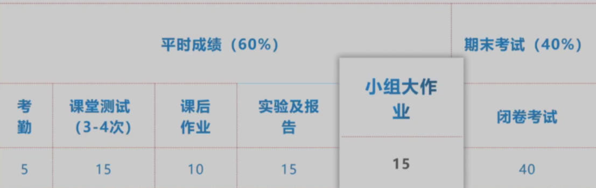

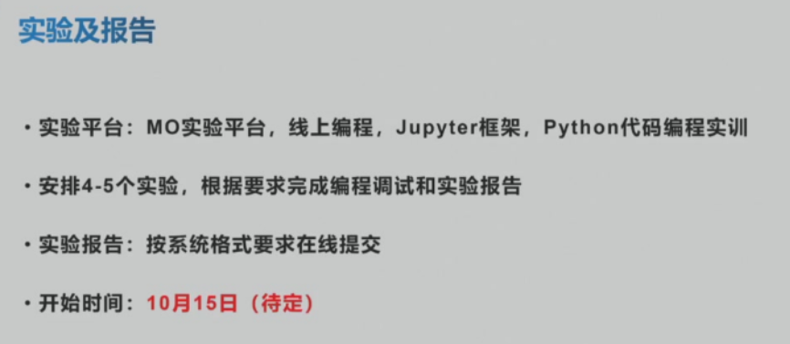

# 人工智能

## 绪论

“人工智能”一词目前是指用计算机模拟或实现的智能，研究如何在机器上实现人类智能。即用机器来模仿人的智能。因此人工智能又称机器智能。

人工智能是研究人类智能活动的规律，构造具有一定智能的人工系统，研究如何让计算机去完成以往需要人的智力才能胜任的工作，也就是研究如何应用计算机的软硬件来模拟人类某些智能行为的基本理论、方法和技术。

- 智能=知识+思维
- 智能包含的四种能力
  - 感知能力
  - 记忆和思维能力
  - 学习和自适应能力
  - 行为能力

- AI的诞生（1956年）：

  时间：1956年夏季（2个月）
  地点：达特莫斯（Dartmouth）大学
  目的：为使计算机变得更“聪明”，或者说使计算机具有智能

- 人工智能的三个阶段
  - 能存会算的计算智能：仅仅局限于计算机的存储与运算的满足
  - 能听会说、能看会认的感知智能：通过传感器和算法感知世界
  - 能理解会思考的认知智能：能够对自然和人类世界进行认知

## 智能体Agent

- 定义：智能体（Agent）：能够感知和动作的实体
  （任何独立的能够思想并可以同环境交互的实体都可以抽象为智能体）

  智能体=体系结构+程序

  - AI的任务是设计智能体程序，实现把感知信息映射到行动的智能体函数f
  - 体系结构为程序提供：
    - 来自传感器的感知信息
    - 运行程序
    - 把程序产生的行动送到执行器
  - 所选择的程序必须适合体系结构

- 简单说，一个智能体就是从**感知序列**到**动作**的一个函数：$f:P^*\to A$

- 理性智能体(Rational Agent)——**做事正确**的智能体

- 性能度量：通常由理性Agent的设计者给出，根据实际在所处的环境中**希望得到的结果**来设计度量而不是根据智能体应该表现的行为。

  当把Agent置于一个环境中后，它将针对收到的感知信息产生动作序列。该动作序列引起环境历经一个状态序列。

  如果该状态序列是想要的，则Agent的性能良好。

  理性Agent应该选择期望能使其性能度量最大化的行动

- 理性的判断

  对于每一个可能的感知序列，根据已知的感知序列和内建的先验知识，理性 Agent选**择能使性能指标的期望值最大化的动作**。

- 任务环境的性质

  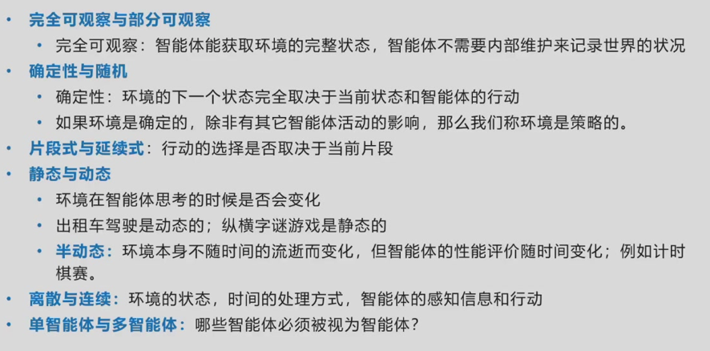

- 四种基本的智能体（结构）类型
  - 简单反射型
  - 基于模型的简单反射型
  - 基于目标型
  - 基于效用型

## 通过搜索进行问题求解

solving problems by searching

- 基于目标的智能体Goal-Based Agent

  - 智能体不仅需要当前**状态**的描述，还需要**目标信息**来描述要达到的状况
  - 智能体把目标信息和可能**行动的结果**信息结合起来，以选择达到目标的行动（决策）
  - **搜索和规划**能帮助智能体找到达到目标的行动序列
  - 既追踪记录世界的状态，又记录要达到的目标集，并选择能达到目标的行动
  - 效率降低，灵活度增加，功能增强

  

- 状态图搜索
  - 搜索：从初始节点出发，沿着与之相连的边试探地前进，寻找目标节点的过程。
  - 搜索过程中经过的节点和边，按原图的连接关系，便会构成一个树型的有向图，这种树型有向图称为**搜索树**。
  - 搜索进行中，搜索树会不断增长，直到当搜索树中出现目标节点，搜索便停止。这时从搜索树中就可很容易地找出从初始节点到目标节点的路径（解）来。
- 显式搜索树：基本做法：先追随一个选择，搁置其它的，等到万一发现第一个选择不能通向问题的解时再考虑。
- 问题求解的性能度量
  - 完备性：有解时能否保证找到解
  - 最优性：这个搜索策略是否能找到最优解
  - 时间复杂度：根据搜索过程中产生的节点数目来度量，即找到解所花的时间
  - 空间复杂度：在执行搜索的过程中需要的内存多少
  - 时间与空间的复杂度往往要与问题难度的某种度量一起考虑
- 状态空间图：某个有向图中寻找目标或路径

数式搜索

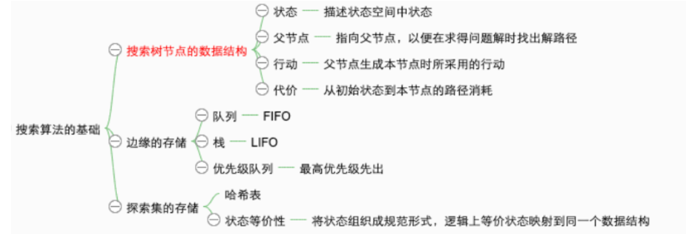

线式搜索

树搜索/图搜索

### 盲目搜索策略

无信息搜索策略/盲目搜索策略  

- 广度优先搜索BFS：解决最短路径问题

  每次总是扩展深度最浅的节点

  Open表是一个队列，FIFO

  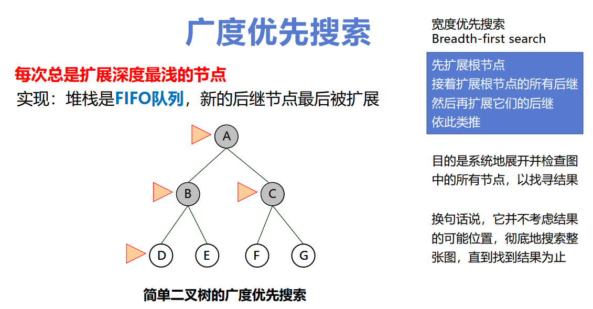

  不要重复检查——打标签

  

  - 时间复杂度：$O(|V|+|E|)$
  - 空间复杂度：$O(|V|)$

  

- 一致代价搜索UCS

  一致代价搜索是在[广度优先搜索](https://so.csdn.net/so/search?q=广度优先搜索&spm=1001.2101.3001.7020)上进行扩展的，也被成为代价一致搜索，他的基本原理是：**一致代价搜索总是扩展路径消耗最小的节点N。N点的路径消耗等于前一节点N-1的路径消耗加上N-1到N节点的路径消耗**

  结合了优先级队列和哈希表的能力

  [一致代价搜索（UCS）的原理和代码实现_代价一致搜索](https://blog.csdn.net/Suyebiubiu/article/details/101194332)

  每次先check frontier中代价最小的节点——然后加入该节点的子节点、

  - frontier：explored中的未探索的子节点

  - explored：已经探索过的点

    > 虽然我们已经找到了终点，但是这条路径可能不是最优的，所以需要继续探索其他路径。

  搜索性能

  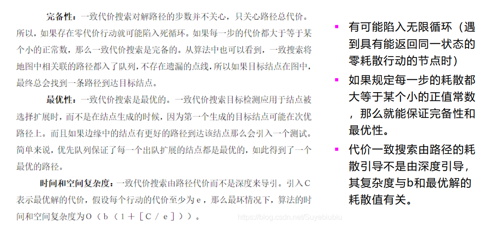

- 深度优先搜索DFS

  基本思想

  1. 为了求得问题的解，先选择某一种可能情况向前探索；
  2. 在探索过程中，一旦发现原来的选择是错误的，就退回一步重新选择，继续向前探索；
  3. 如此反复进行，直至得到解或证明无解

  首先扩展未被扩展的节点中最深的那个

  实现：Open表是堆栈，LIFO，即把最新的后继节点放在最前面

  性能

  

  > 在树搜索算法中， DFS非常容易陷入无穷的循环，所以DFS往往用于图搜索。

- 有限深度优先搜索DLS

  DLS规定了DFS的最大搜索深度，对于一个给定的常数 l， DLS在到达这个深度之后就会放弃搜索，转而去探索frontier中的其他节点

- 迭代加深搜索IDS

  IDS 就是在DLS的基础上，不断的将常数 l 扩大，从而增加搜索深度

  每轮增加深度限制

  迭代加深的深度优先搜索(Iterative deepening depth-first Search)，逐步增大限制搜索的深度，直到返回目标结点。

  

  一般来说，当搜索空间很大且解的深度未知时，迭代加深搜索是首选的盲目搜索方法！  

- 双向搜索（Bidirectional Search, BS）  

  BS的假设是我们不仅可以从初始节点出发，同时还可以从目标节点出发，从而实现双向的搜索。

  BS的内部往往是由BFS实现的，如果从初始节点和从目标节点的搜索都是BFS，可以保证算法的最优。

  实际上， BS就是将BFS画的半径为d的一个大圆，换成了半径为d/2的两个小圆

### 有信息的搜索策略

> 老师说了解算法的基本思想足以了

启发式：使用问题本身之外的特定只是，比盲目搜索更有效

- 贪婪：每次找代价做小的那条路径

  最佳优先搜索BFS

  

- dijsktra

- A*搜索
  $$
  评价函数:f(n)=g(n)+h(n)
  $$
  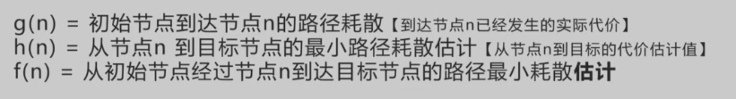

  特性：如果h从不高估到达目标的最低路径耗散值，我们称h是**可容纳启发式**

  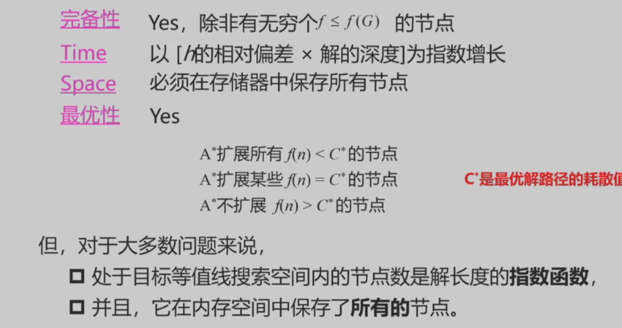

  > 就是在每次扩展结点时，总是把所有的待测节点存入内存中，空间复杂度很高
  
- 迭代深入A*：IDA\*：因为A\*对存储空间要求很高，因此我们引入迭代深入的思想

  

  > 当前局面的估价函数值+当前的搜索深度 > 预定义的最大搜索深度时，就进行剪枝。

- A*改进：递归最好优先搜索（RBFS）

  RBFS算法的核心思想是记录当前节点的祖先可得到的最佳可替换路径的f值，并在当前的f值超过这个限制时，递归转回到替换路径，以避免扩展代价已经很高的节点

  1. **初始化**：设置一个空的已访问节点集合和当前节点的祖先可得到的最佳可替换路径的f值。
  2. 递归搜索：在每次递归中，执行以下操作：
     - **选择节点**：从优先级队列中选择具有最小启发式估计值的节点。
     - **检查目标**：如果该节点是目标节点，则找到了最优解决方案，可以终止搜索。
     - **扩展节点**：否则，扩展该节点，生成其所有相邻节点，并计算它们的启发式估计值。
     - **添加相邻节点**：对于每个相邻节点，如果它未被访问过，则将其添加到优先级队列中，并将其标记为已访问。
     - **更新f值**：如果当前节点的f值超过了祖先可得到的最佳可替换路径的f值，则递归转回到替换路径，并更新f值。
  3. **终止条件**：当找到目标节点或优先级队列为空时，算法终止。

  算法分析

  

- 启发式函数的本质问题探讨

A*求解八数码难题——可看作松弛问题的最优解

 进一步考虑当前结点与目标结点的距离信息，令启发函数h ( n )为当前8个数字位与目标结点对应数字位距离和（不考虑中间路径），且对于目标状态有 h ( t ) = 0，对于结点m和n （n 是m的子结点） 有h ( m ) – h ( n ) <= 1 = Cost ( m, n ) 满足单调限制条件

八数码难题：$g(n)$为步数（即每次移动代价为1），$h(n)$为曼哈顿距离

### 超越经典搜索

Beyond Classical Search  

局部搜索算法：在很多优化问题中解与路径不相关， 目标状态本身就是解  

从单独的一个当前状态出发，通常只移动到与之相邻的状态，并且不保留解的路径

- 需要很少的内存
- 经常能在大或无限的状态空间中找到合理的解

- 爬山法Hill-climbing Search  

  

  局部最优问题(Local Maxima）  

  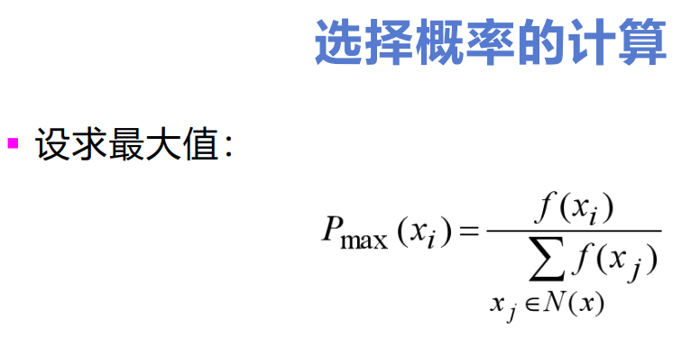

  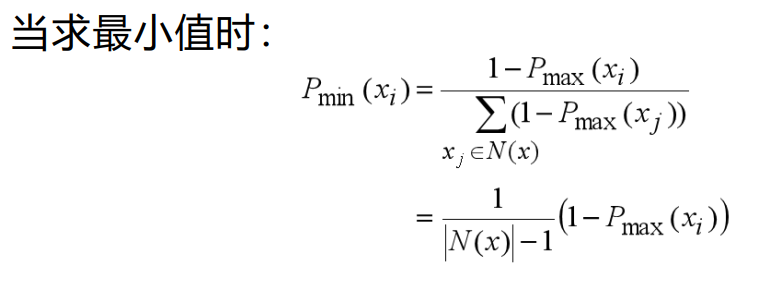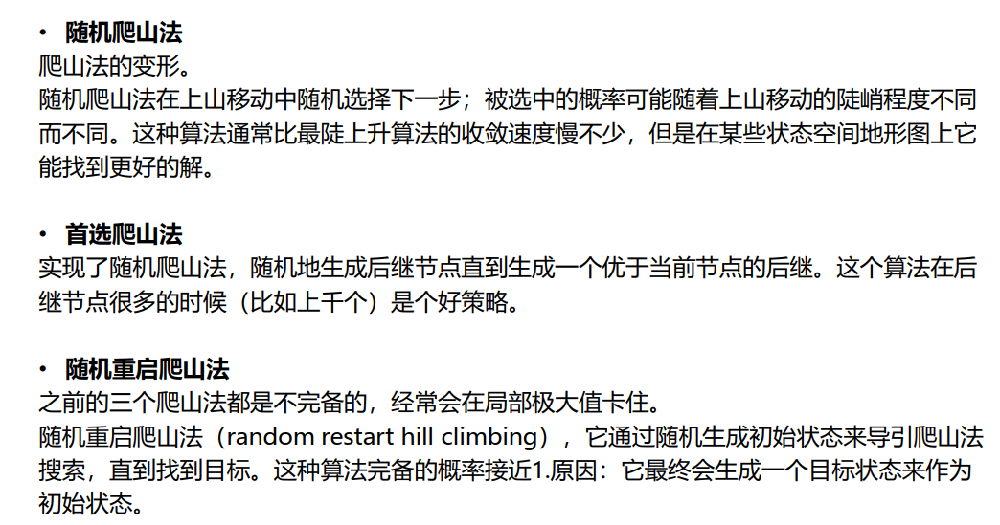

  

- 模拟退火：模拟退火也算是启发式算法的一种  SA

  

  

- 遗传算法GA

  

  

  

  优势

  

### 对抗搜索

对抗搜索Adversarial Search  

博弈搜索（Game Search）  

纳什平衡（Nash equilibrium）：

在一个博弈过程中，无论对方的策略选择如何，当事人一方都会选择某个确定的策略，则该策略被称作**支配性策略**  

如果任意一位参与者在其他所有参与者的策略确定的情况下，其选择的策略是最优的，那么这个组合就被定义为纳什平衡——一个策略组合被称为纳什平衡

形式化

博弈问题的表示：博弈树Game Tree

每条路径都对应一个结果， 双方不论在什么时候，肯定都要选择“最利于”自己获胜的步骤。  ——但是只有叶子节点才有评估函数

> 评估函数、效用函数：“赢面”

#### 完全信息博弈

人工智能中的博弈：有完整信息的、确定的、轮流行动的两个游戏者的**零和游戏**。（可为多人）

博弈是多智能体环境，包含竞争与合作

##### 与或树（AND–OR tree）  

**只有叶子节点才有评估函数**

极小极大思想

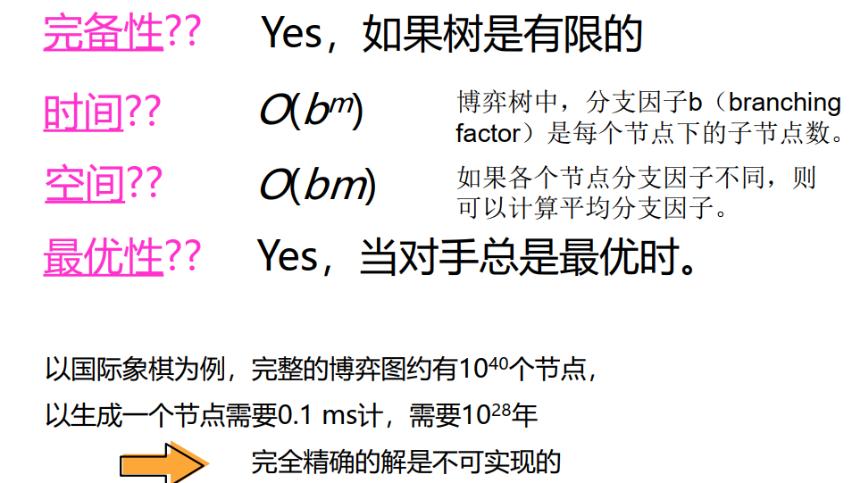

##### MinMax算法

有两个人下棋，先手希望下一步的局面是自己胜算最大的局面，而后手则希望下一步的局面是先手胜算最小的局面（因为先手输，后手就会赢）——设置估价函数进行评估

##### 剪枝

AlphaBeta剪枝方法是对Minimax方法的优化

[最清晰易懂的MinMax算法和Alpha-Beta剪枝详解](https://blog.csdn.net/weixin_42165981/article/details/103263211)

基本思想：根据上一层已经得到的当前最优结果，决定目前的搜索是否要继续进行下去。

1. **零和博弈**：α-β剪枝算法假设博弈过程是零和博弈，即一方的收益意味着另一方的损失，双方的收益和损失总和为零2。
2. **智能决策**：博弈双方足够聪明，会选择使自己利益最大化的决策

$Alpha(\alpha)$表示目前所有可能解中的最大下界，$Beta(\beta)$表示目前所有可能解中的最小上界。

因此，如果搜索树上的一个节点被考虑作为最优解的路上的节点（或者说是这个节点被认为是有必要进行搜索的节点），那么它一定满足以下条件（N是当前节点的估价值）：
$$
\alpha\leq N \leq\beta
$$
求解过程：

1. 遇到叶子节点，我们更新父节点，若父节点为Min节点则更新$\beta$，为Max节点则更新$\alpha$
2. 新生成的子节点$\alpha,\beta$继承于其父节点

在我们进行求解的过程中，$\alpha$和$\beta$会逐渐逼近。如果对于某一个节点，出现了$ \alpha > \beta$的情况，那么，说明这个点一定不会产生最优解了，所以，我们就不再对其进行扩展（也就是不再生成子节点），这样就完成了对博弈树的剪枝。

> 或中取大与中取小，递归然后更新父节点的$\alpha,\beta$的值

剪枝的效率很大程度上取决于**检查后继的顺序**

资源有限：有限深度搜索——$\alpha-\beta$剪枝失效

#### 不完整的实时决策

(Imperfect, real-time decisions)  ——截断搜索

- 用可以估计棋局效用的启发式评估函数EVAL代替效用函数
- 用可以决策什么时候运用EVAL的截断测试取代终止测试

**如何设计评估函数？**  

## 知识表示与推理

逻辑智能体是基于知识的智能体，它采用推理过程来得到关于新世界的表示，并且用这些新表示推到下一步做什么。

- 知识：逻辑Agent（基于知识的Agent）
- 知识表示：一阶谓词逻辑
- 推理：一阶谓词逻辑推理；从旧结构中创立新结构的过程  

- 语句是智能体的物理结构
- 逻辑推理应该确保新结构所代表的那部分世界的确是旧结构所代表的那部分的必然结论

基于知识的智能体

- 核心构件是其知识库（KB）  

  - 知识库是一个语句集合，语句由知识表示语言来表达，表示了关于世界的某些断言，包括问题的一些背景知识

  > 基于知识的智能体也是用感知信息作为输入，并返回一个行动  

- 逻辑：用来表达信息的形式语言
  - 语法：定义语言中的语句，怎样的表达是合法的
  - 语义：定义语句的“意思”

在逻辑中，语义定义了每条语句关于每种可能世界的**真值**。非真即假

- 蕴涵 entailment  ：一件事为真可得出另一件事也为真
  - 
  - 蕴涵是语句之间的关系，它是基于语义的
- 模型：对“可能世界”的数学抽象
  - 

推理和蕴涵/蕴含

- 逻辑推理：用蕴含推导出结论
- 模型检验：通过**枚举**所有可能的模型来检验KB为真的情况下α都为真，M(KB) 含于M(α)
- 可靠的：只导出蕴含句的推理算法被称为可靠的
- 完备性：如果推理算法可以生成任一蕴含句，则完备。（在有限的情况下确实完备，但是常常不完备）
- 

### 命题逻辑

- 语法

  - 原子语句：不可分割的句法元素。  

    

  - 复合句：由原子语句用逻辑连接符构造而成  

    

    

    

- 语义：定义了用于判断特定模型的语句真值的规则

- 蕴涵

  - 通过模型检验来判断蕴涵（枚举法）;

    通过搜索算法来找出证明序列

  - 通过定理证明来判断蕴涵

    

  - 

    > 所有逻辑等价都可以作为推理规则

  - 有效性（合法性）和可满足性

    

- 逻辑系统的单调性:

  逻辑系统的最后一个概念是单调性，单调性意味着逻辑蕴涵语句集会随着添加到知识库的信息增长而增长。对于任意语句α和`β，
  如果KB｜=α，那么KB^β｜=α

- 推导和证明

  - 假言推理规则：

    

    大前提+小前提

  - 消去合取词

    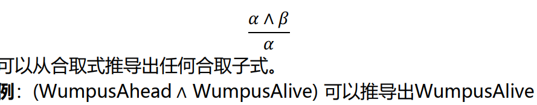

  - 归结：本质是反证法

    

    > 结果子句中每个文字只能出现1次，去除文字的多余副本叫做“归并"
    > (factoring），如AvA可简化为A，即为化简律。

    归结原理:!!!!!!!

  - 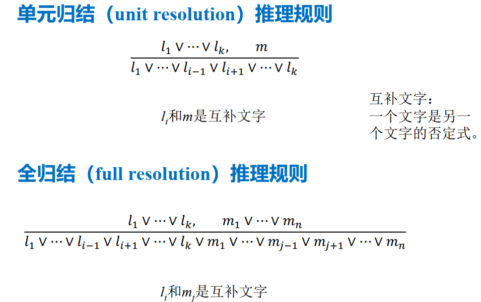

  - 合取范式CNF：以子句的合取式表达的语句

    命题逻辑的每个语句逻辑上等价于文字析取式的合取式

    

    按照上述步骤进行转换

    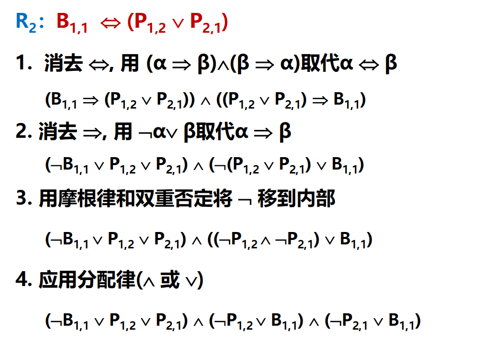

  - 基于归结的推理

    归结算法：

    

    

- Horn子句和限定子句

  - 在很多实际情况下无需用到归结的全部能力

    现实世界的知识库通常满足它们所包含的语句形式的特定限制，这使得它们可以使用更受限也更有效的推理算法。

    **受限子句**: 指恰好只含有一个正文字的析取式

    

  - Horn Clause 定义： 至多只有一个正文字的文字析取式  

    没有正文字的析取式也是Horn Clause，被称为 目标子句  

    

- 前向链接，反向链接

  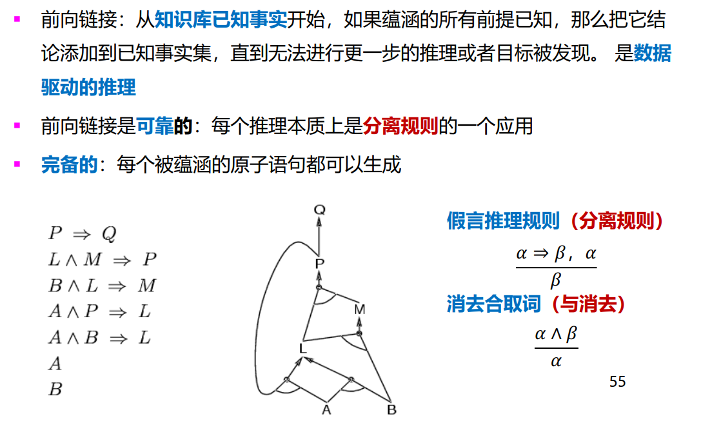

  

### 一阶逻辑

蕴含（语义）/蕴涵（逻辑推理）

### 表示方法的回顾  

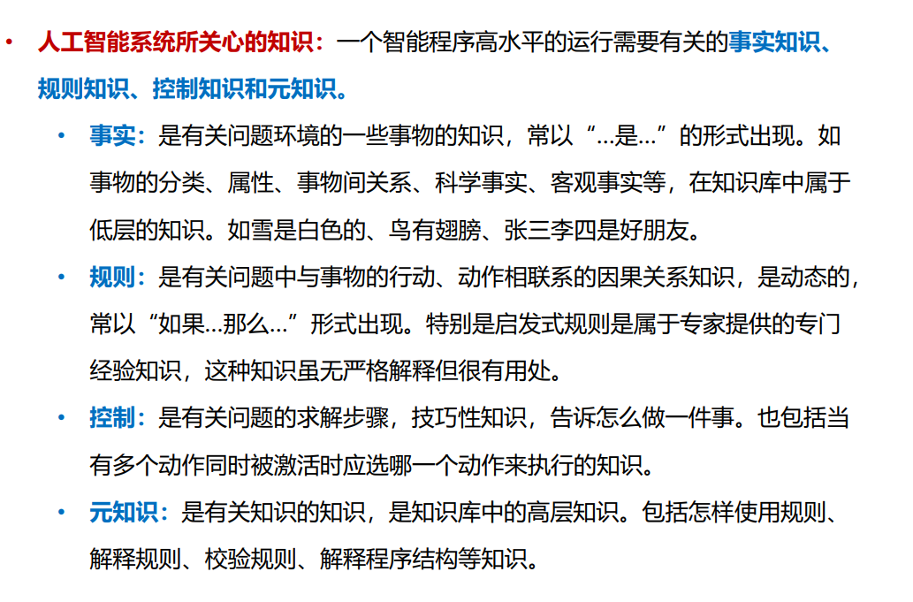

人工智能系统所关心的知识： 一个智能程序高水平的运行需要有关的**事实知识、规则知识、控制知识和元知识**

- 知识表示（knowledge representation）：把人类知识表示成机器能处理的数据结构

半形式化语言：自然语言+特定的符号  

### 一阶谓词逻辑

（First-order Logic， FOL）  

object对象+relations关系+functions函数

- 个体词：所研究对象中可以而独立存在的具体或抽象的客体

  - 个体常项：具体的事物
  - 个体变项：抽象的事物
  - （个体域）论域：讨论的范围
  - 全总个体域：

- 谓词：表示个体词之间的相互关系

  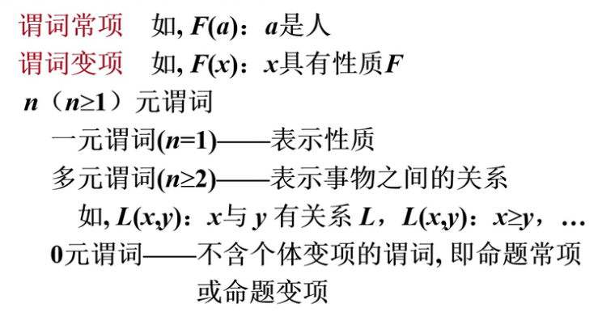

  特性谓词：表示x是什么

- [谓词逻辑转换与子句表示法](https://blog.csdn.net/weixin_43249758/article/details/105835357)

- 语义：语句的真假由模型和对语句的解释决定

  - 论域： 讨论的范围

  - 模型(结构)： 对常量符号（表示对象），谓词符号（表示关系）和函词（表示函数）的解释再加上论域就构成了一个模型(或结构)。

    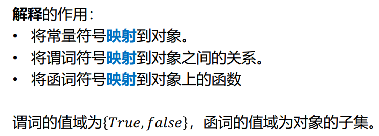

  - 数据库语义

    

    

- 量词：表示数量的词

  全称量词$\forall$，存在量词$\exists$

  

  

- 可满足性——可满足的（在某些模型中为真）

  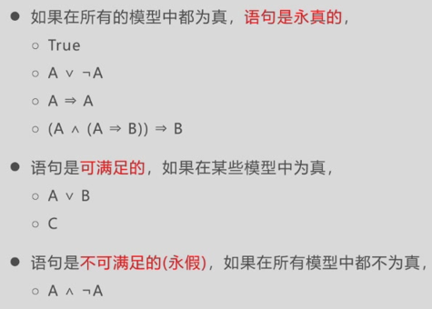

- 句法（syntax）——字母表：公式

  

  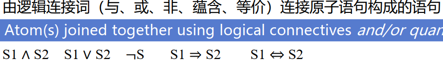

- 项term：复合项： 由函词以及紧随其后的参数、被括号括起来的列表项组成。如 Leftleg(John)  

- 原子语句

  

- 指导变元

  

- 闭式

  

- 公式的解释

  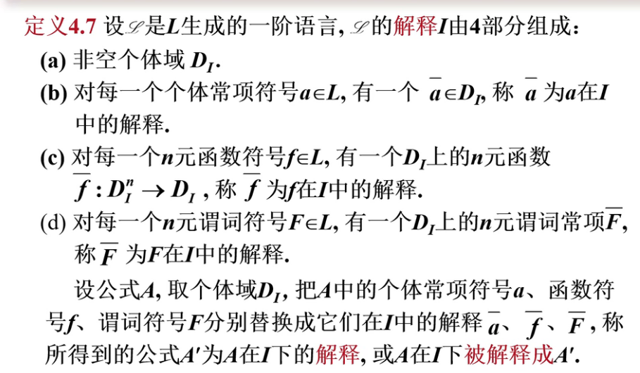

  公式的解释有4个部分：个体域/个体常项/函数符号/谓词 都要有明确的含义

  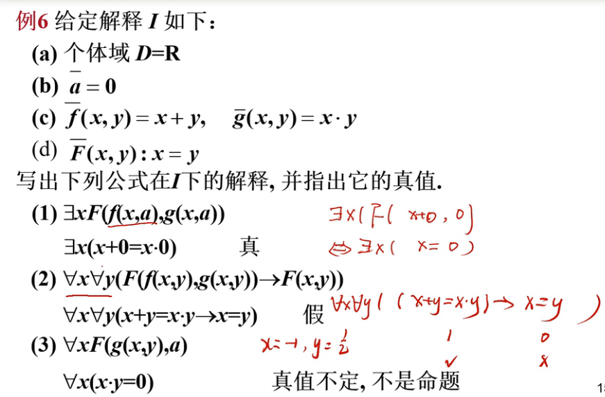

  

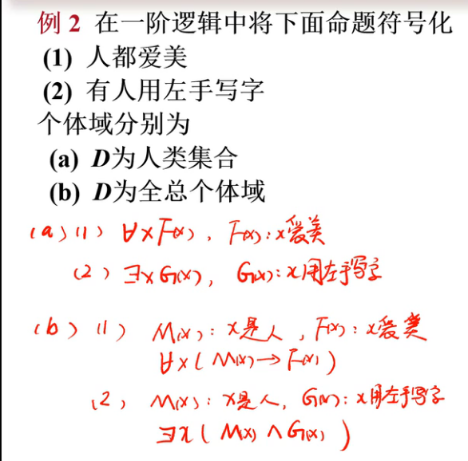

- 模型（结构）：对常量符号（表示对象），谓词符号（表示关系）和函词（表示函数）的解释再加上论域就构成了一个模型(或结构)。

### 一阶逻辑的推理

- 推理

  - 首先需要将量化语句用非量化语句替换（实例化语句）

    - 全称量词实例化（UI规则）

      

    - 存在量词实例化(EI规则)

      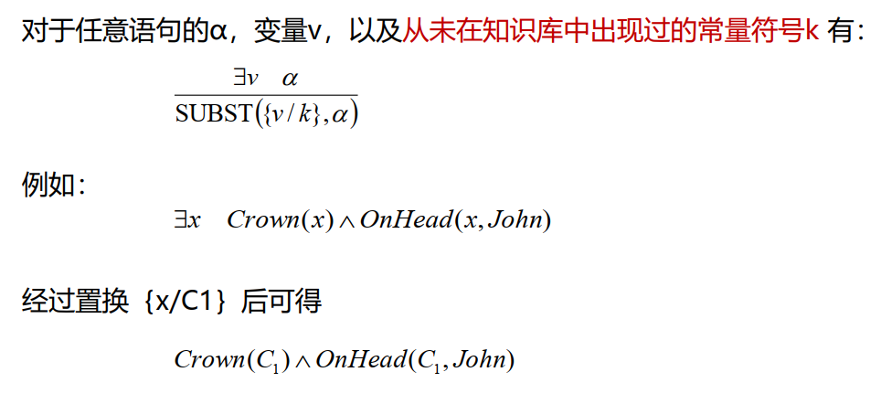

      存在量词只能代换一次
      对同一条语句的同一个量词，全称量词实例化推理规则可运用多次，存在量词实例化推理规则只能运用一次

    - 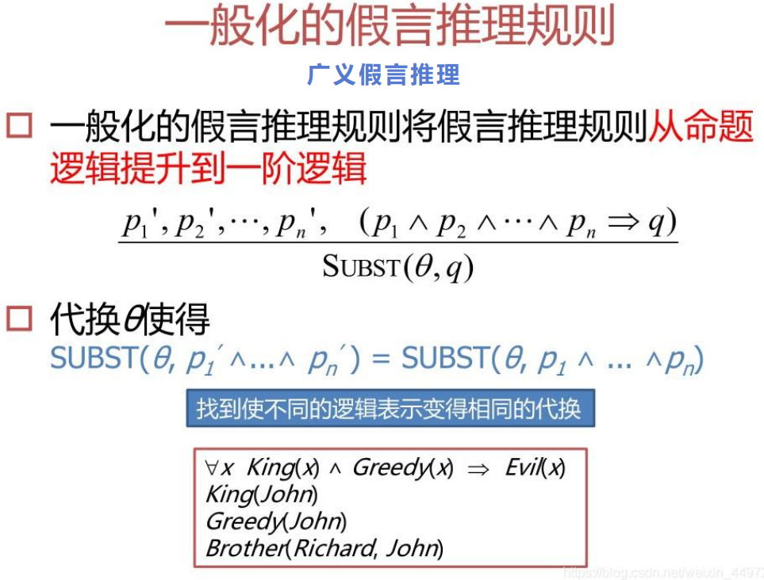

      

      标准化分离

      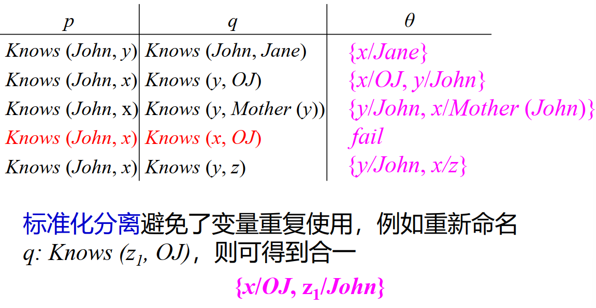

      最一般合一代换MGU

      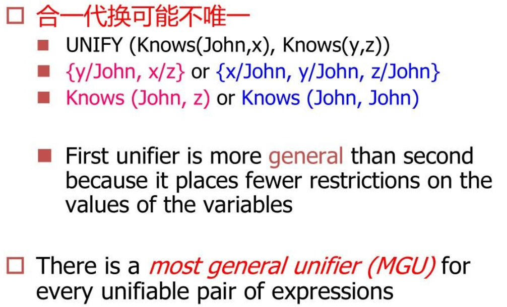

- 归结推理规则

  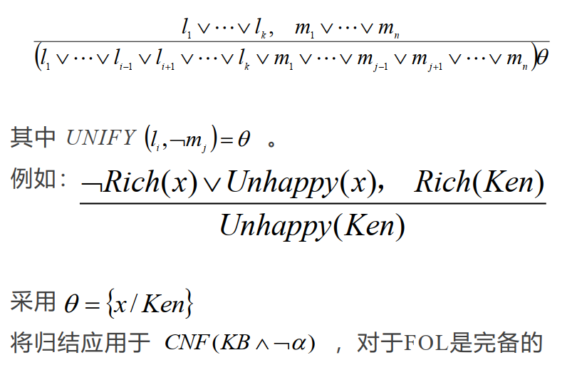

  

  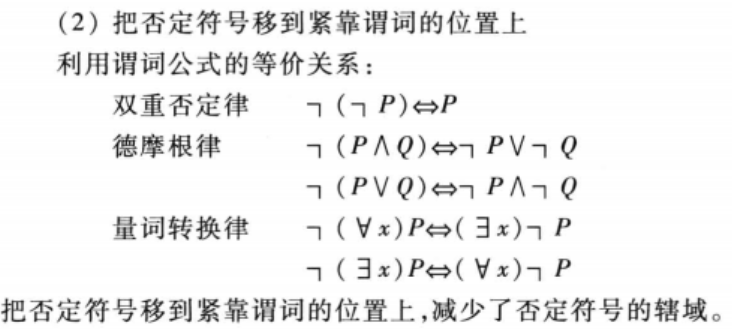

  

  

- FOL的断言(Assertion)和查询(Query)  

  

- 如何用FOL表示/描述 环境

  

- 亲属关系论域（the kinship domain）

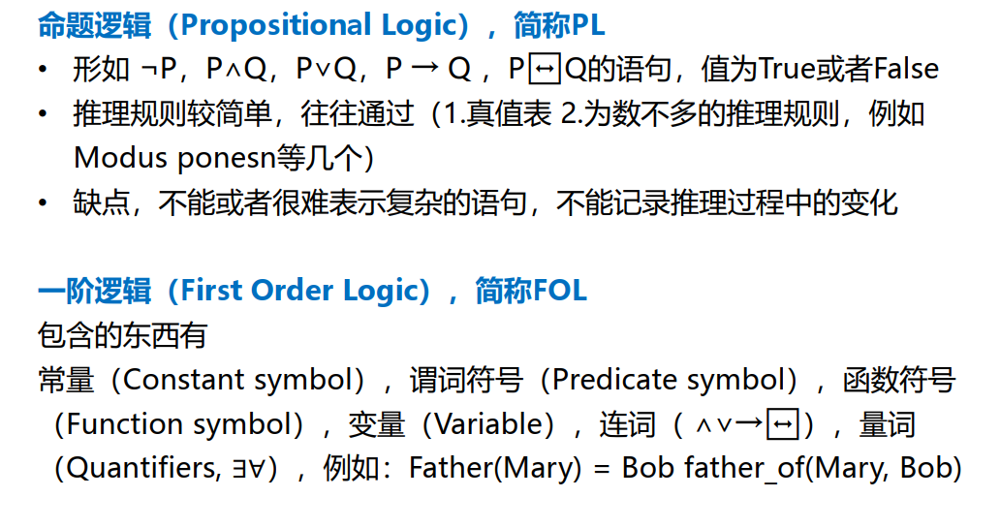

### example

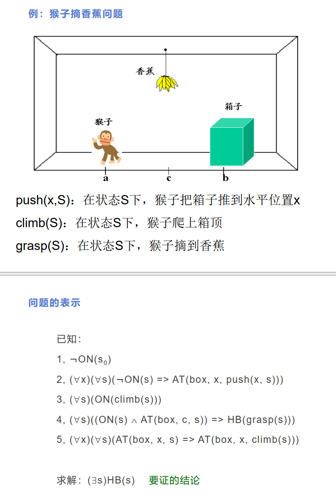

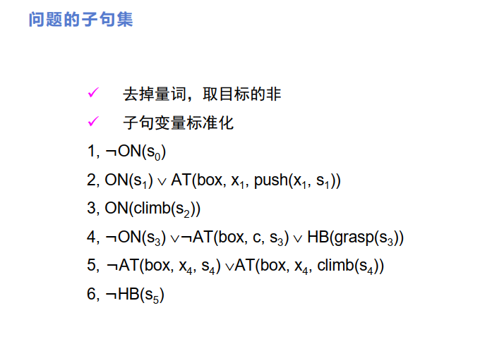

> NIL为空

树状推理如何搞:

- 注意这里是变成了空

  

- 先替换变量

  

# 数学基础

高斯分布

## 极大似然估计MLE

我们有N个数据，每个数据是p维，$x_i\in R^p，x_i\sim_{iid} N(\mu,\sigma^2)$
$$
Data:~ X =(x_1,...,x_N)^T
$$

> iid代表独立同分布

以下是极大似然估计MLE的推导——点估计
$$
MLE:\theta = \arg \max_{\theta} p(X|\theta)
$$
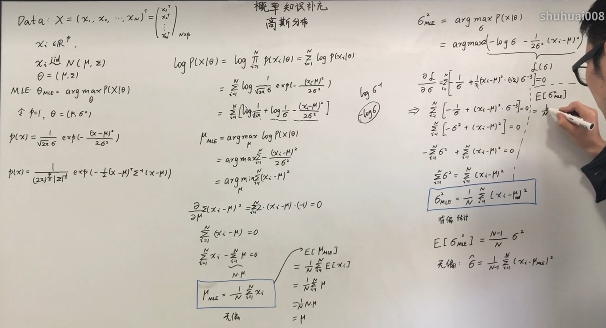

对于高斯分布，均值$\mu_{MLE}$是无偏估计，方差$\sigma^2_{MLE}$是有偏估计，以下是有偏和无偏原因的推导：

$$
无偏\hat\sigma=\frac{1}{N-1}\sum(x_i-\mu_{MLE})^2
$$
也就是使用MLE估计出来的$\sigma^2_{MLE}$是偏小了

极大似然估计MLE——点估计，也就是会有一定的偏差

## 概率密度函数方面理解

接下来我们来将x拓展到高维空间：

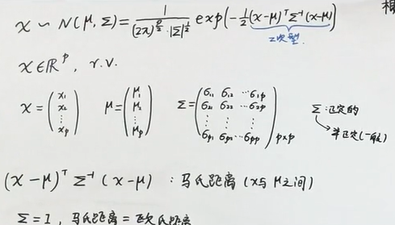

马氏距离（Mahalanobis Distance）

马氏距离实际上是欧氏距离在多变量下的“加强版”，用于测量点（向量）与分布之间的距离。向量x到一个均值为$\mu$，协方差为$\Sigma$的样本分布的马氏距离计算如下:
$$
d = \sqrt{(x-\mu)\Sigma^{-1}(x-\mu)^T},\Sigma为协方差矩阵
$$
其中x的分布只与$exp$内的参数有关，其它均为常数，因此我们只关注${(x-\mu)\Sigma^{-1}(x-\mu)^T}$，先对$\Sigma$进行特征值分解

于是$\Delta = \sum \frac{y_i^2}{x_i}$，其中$y_i = (x-\mu)^T u_i$相当于将x减去均值$\mu$然后向$u_i$方向的投影。我们对$\Delta = r$取固定的值，于是$x$就有一个固定的概率分布，对于2维，取固定的r，就相当于三维空间的山取截面映射到二维就是不同大小的椭圆

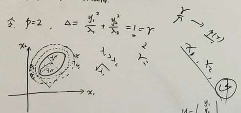

## 局限性

方差矩阵$\Sigma$参数量$\frac{p(p+1)}{2}= O(p^2)$参数量太多

- 简化为对角矩阵（假设）——factor analysis
- 各向同性——PCA
- 混合模型

## 已知联合概率求边缘概率和条件概率

先是概率论的引理

我们先来定义问题

> 已知联合概率分布$p(x)$，求边缘概率分布$p(x_a)$和条件概率分布$p(x_b|x_a)$

边缘概率分布求解如下：

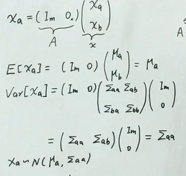

条件概率分布如下：

其中先定义了一个$x_{b\cdot a}$——别问为什么

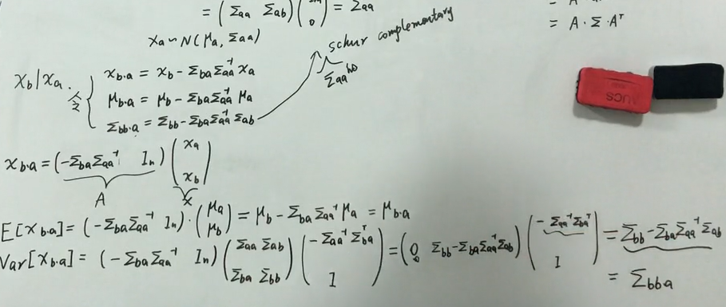

然后利用$x_{b\cdot a}$

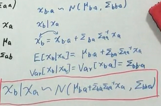

> 这里看作$y=Ax+B$根据引理求解，$x_{b\cdot a}与x_a$相互独立，$x_a$已知是常数

## 已知边缘概率和条件概率求联合概率

定义问题

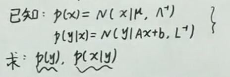

$y=Ax+b+\epsilon$，linear Gaussion model

然后求$p(x|y)$，所以直接求联合概率分布，然后代入上一节的结论即可

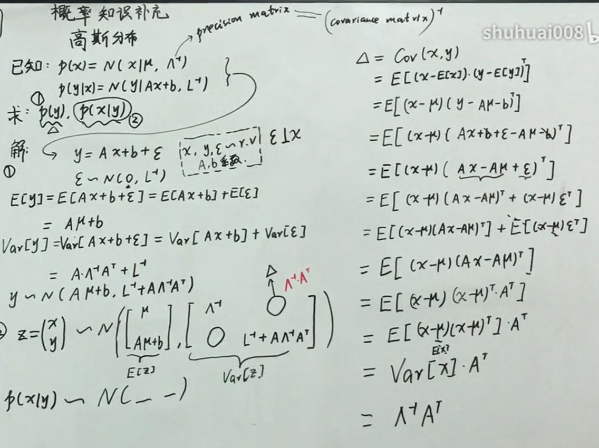

## 杰森不等式

Jensen's Inequality内容如下：

假设$f(x)$是convex function（凸函数），则：
$$
E[f(x)]\ge f(E[x])
$$
下面进行一个构造型证明

利用

# ML

## 基本概念

学习问题的标准描述：

定义：对某类任务T和性能度量P，如果一个计算机程序在T上以P衡量的性能随着经验日而我完善，那么我们称这个计算机程序在从经验E中学习。

**定义学习问题的三个特征：任务种类T ，衡量任务提高的标准P，经验来源E**

**机器学习的基本设计过程**

- 选择训练经验类型
  - 直接信息还是间接信息？
  - 有施教者还是自我学习？
  - 训练样本的分布能多好地表示实例分布？
- 选择目标函数
  - 给定棋局状态，从合法的走子集合中产生走子
  - 给定棋局，赋予一个评分
- 选择目标函数的表示
  - 规则的集合
  - 神经网络
  - 多项式
  - 决策树
  - ...
- 选择函数逼近算法
  - 训练数据
  - 最小均方误差（Least Mean Squares）

- 学习任务分类

  - 监督学习Supervised-learning

    - 回归算法：$x\rightarrow y$
    
    - 分类算法：KNN（懒惰学习（lazy learning））

  - 非监督学习Unsupervised-learning

    

    - 聚类算法

## 概念学习

[概念学习（Concept Learning）](https://www.cnblogs.com/AmitX-moten/p/3712203.html)

概念学习：给定某一类别的若干正例和反例，从中获得该类别的一般定义

> 在预定义的假设空间中搜索假设，使其与训练样例有最佳的拟合

归纳学习假设

**概念学习可以看作一个搜索的过程**

- 搜索范围：假设的表示所隐含定义的整个空间

- 搜索目标：能够最好地拟合训练样例的假设

> 现实问题中，我们经常面临很大的假设空间，但学习过程是基于有限样本训练集进行的，因此，可能有多个假设与训练集一致，即存在着一个与训练集一致的“假设集合”，可称为“**变型空间**"或“**版本空间**”（version space)

### Find-S

**Find-S**：寻找极大特殊假设（从特殊到普通的线路），对反例不做处理，并且只是所有可能假设（all possible hypothesis）H中的**一个**。

- 将h初始化为H中最特殊的假设(即所有属性均为$\phi$)

- 对每一个正例x，对h的每一个属性约束$a_i$，如果x满足$a_i$，那么不做任何处理；否则将h中$a_i$替换为x满足的下一个更一般约束。

  > 遇到反例， ℎ不变（因为ℎ已经能够正确地识别反例）

- 输入假设h。

> 从较特殊的假设逐渐转移到较一般的假设

局限性：

- Find-S算法只考虑了正例，忽略了反例的信息，这可能导致找到的假设过于一般化。
- 它没有考虑假设的完备性，即没有检查找到的假设是否能够正确地排除所有反例。
- 算法健壮性较差，当训练样例集D中出现错误样例时，会严重破坏算法

### 候选消除算法 

**候选消除算法**（Candidate-Elimination）的输出是与训练样例一致的**所有假设的集合**。候选消除算法的偏置是：目标概念可以在假设空间中找到

它通过处理训练样本数据，逐步调整假设集合来逼近目标概念。该算法维护两个假设集合：**S集**（特殊集）和**G集**（一般集），分别表示当前最特殊的假设和最一般的假设。变型空间（Version Space）与训练样例一致的所有假设组成的集合

1. **初始化**：

   - **G集**初始化为假设空间中最一般的假设，通常是一个所有属性都被指定为通配符（？）的假设。
   - **S集**初始化为假设空间中最特殊的假设，通常是一个所有属性都被指定为特定值的假设。

2. **处理训练样本**：

   - 对于每个训练样本（正例或反例），执行以下操作：

     - 正例
       - 从**G集**中删除所有与该正例不一致的假设。
       - 将**S集**中的所有假设一般化，使其与该正例一致。
     - 反例
       - 从**S集**中删除所有与该反例一致的假设。
       - 将**G集**中的所有假设特殊化，使其与该反例不一致。

     > 算法认为正例应该使S集一般化，而反例应该使G集特殊化

3. **输出结果**：

   - 在处理完所有训练样本后，**S集**中的假设表示了与所有正例一致的最特殊假设，而**G集**中的假设表示了与所有反例不一致的最一般假设。
   - 如果**S集**和**G集**中的假设一致，则找到了目标概念；否则，可能需要更多的训练样本来进一步缩小假设空间。

- 缺点：容错性能差，训练数据含有噪声时，性能较差  
- 如果样例中存在错误：如果给定足够的训练数据，会发现S和G边界收敛得到一个空的变型空间  

一种算法的有偏性越强它的归纳能力越强，可以分类更多的未见实例

**归纳偏置**：归纳学习需要的预先假定

这些假设或限制是基于已有的知识和经验，帮助模型更好地适应数据和任务，提高泛化能力和性能。一种算法的有偏性越强，它的归纳能力越强，可以分类更多的未见实例

> 如何计算实例数和假设数
>
> 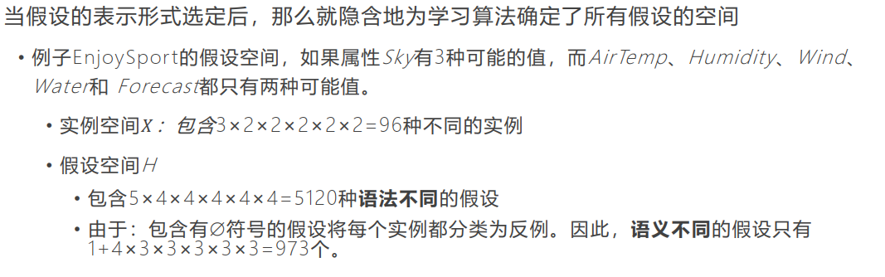
>
> - 实例数：不同约束的可能性取值相乘即可；
>
> - 假设数H：每个假设h描述为6个属性的取值约束的合取  
>
>   一种常见的表示形式是**合取式**，即对每个属性指定一个约束。对于每个属性，有以下三种可能的约束：
>
>   - **指定值**：明确指定属性的取值。
>   - **通配符（？）**：表示接受任意可能的值。
>   - **拒绝值（Φ）**：表示不接受任何值。
>
>   如果每个属性有 v 个可能的取值，那么每个属性有 v+2 种可能的约束（v 个指定值，1 个通配符，1 个拒绝值）——这是**语法不同**的假设
>
>   由于：包含有Φ符号的假设将每个实例都分类为反例。因此， 语义不同的假设只有$(v+1)^n+1$
>   
>   - 不包含“Φ”的假设数量为4×3×3×3×3×3=972种（第一个属性有4种可能，其余每个属性有3种可能）。
>   - 加上包含“Φ”的假设（1种），总共有972 + 1 = **973**种语义不同的假设

### 列表后消除算法

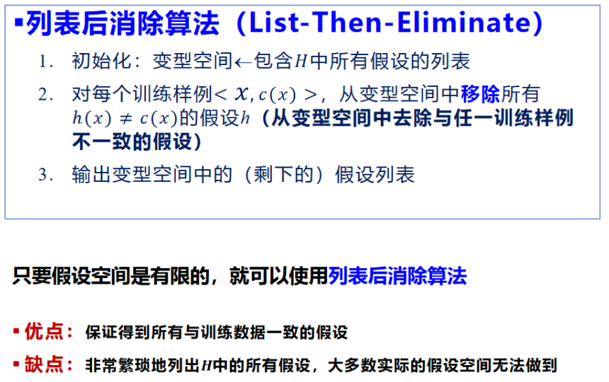

一种算法的有偏性越强，它的归纳能力越强，可以分类更多的未见实例  

## 决策树学习

决策树（Decision Tree）是一种**基于树结构**的机器学习算法，广泛应用于分类和回归任务。它通过递归地划分数据集，构建一棵树模型，从而实现对数据的预测。

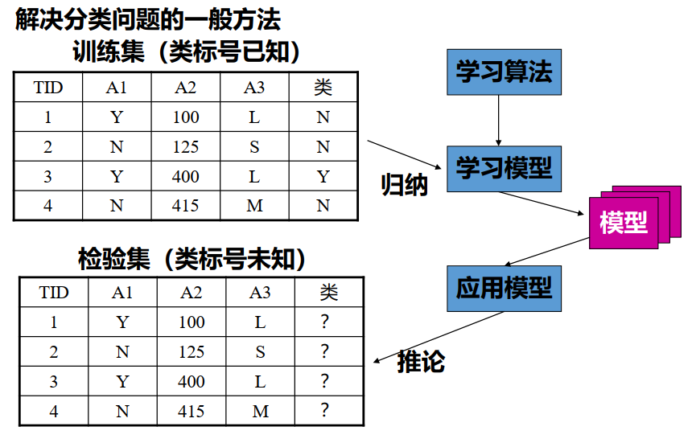

- 决策树表示了多个if-then规则,一种逼近离散值函数的方法  ，决策树代表实例属性值约束的合取的析取式

- 适用问题的特征：实例由“属性-值”对表示
- 优点
  - 简单直观
  - 无需数据预处理
  - 能够处理非线性关系
  - 支持多输出
  - 对缺失值不敏感

- 缺点

  - 容易过拟合

    解决方法：剪枝（Pruning）、设置最小样本划分阈值、限制树的最大深度

  - 对数据的小变化敏感

    解决方法：使用集成方法（如随机森林、梯度提升树）

  - 不适合处理高维稀疏数据

    解决方法：使用特征选择或降维技术

  - 计算复杂度较高

    解决方法：使用分布式计算或近似算法

### CLS

### ID3

ID3采用自顶向下的贪婪搜索遍历可能的决策树空间，该方法使用**信息增益度**选择测试属性

- 熵：表示事务不确定性的程度，也就是信息量的大小
  $$
  Entropy=-\sum_i^{n}p(x_{i})* \log_2 p(x_i)
  $$
  条件熵：$Entropy(Y|X)= \sum_i^{n} p(x_{i})Entropy(Y|x_i)$

  [条件熵公式详细解释、举例说明计算步骤](https://blog.csdn.net/u013172930/article/details/142665137)

- 信息增益(information gain)：在划分数据集之前之后**信息发生的变化**，计算每个特征值划分数据集获得的信息增益，获得信息增益最高的特征就是最好的选择。定义属性A对数据集D的信息增益为Gain(D|A)
  $$
  Gain(D|A)=Entropy(D)-Entropy(D|A)
  $$
  信息增益的意义：引入属性A后，原来数据集D的不确定性减少了多少。

- 算法步骤
  1. 从根节点开始，计算所有可能的特征的信息增益，选择信息增益最大的特征作为节点的划分特征；
  2. 由该特征的不同取值建立子节点；
  3. 再对子节点递归1-2步，构建决策树；
  4. 直到没有特征可以选择或类别完全相同为止，得到最终的决策树。

- 适用范围：离散型数据
  - 优点：
    - 计算复杂度不高，输出结果易于理解，对中间值的缺失不敏感，可以处理不相关特征数据
  - 缺点：
    - 没有剪枝，可能会产生过度匹配问题，需要进行剪枝
    - 不进行回溯，可能收敛到局部最优
    - 采用信息增益作为选择最优划分特征的标准，然而**信息增益会偏向那些取值较多的特征**

- 决策树学习的归纳偏置
  - ID3的搜索策略
    - 优先选择较短的树
    - 选择那些信息增益高的属性离根节点较近的树
    - 很难准确刻画ID3的归纳偏置
  - 近似的ID3的归纳偏置
    - 较短的树比较长的树优先
    - 近似在于ID3得到局部最优，而不一定是全局最优
    - 一个精确具有这个归纳偏置的算法，BFS-ID3
  - 更贴切近似的归纳偏置
    - 较短的树比较长的树优先，信息增益高的属性更靠近根节点的树优先

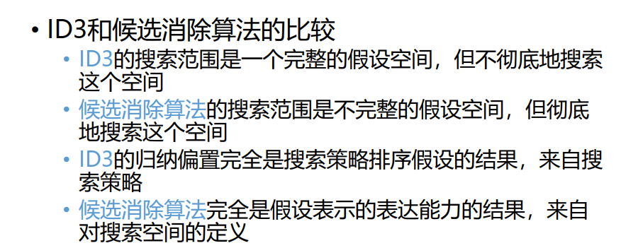

优选偏置和限定偏置

### 优化

#### 错误率降低修剪  

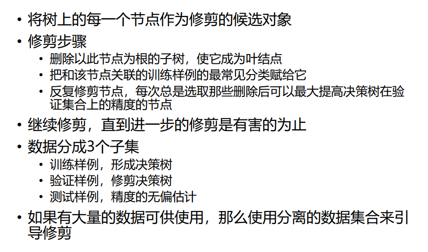

#### 规则后修剪

- 从训练集合推导出决策树，增长决策树直到尽可能好地拟合训练数据，允许过度拟合发生

- **将决策树转化为等价的规则集合，方法是为从根节点到叶节点的每一条路径创建一条规则**
- 通过删除不会导致估计精度降低的前件来修剪每一条规则 
- 按照修剪过的规则的估计精度对它们进行排序，并按这样的顺序应用这些规则来分类后来的实例
- 把决策树转化成规则集的好处
  - 可以区分决策节点使用的不同上下文
  - 消除了根节点附近的属性测试和叶节点附近的属性测试的区别
  - 提高了可读性

- 合并连续值属性

  通过动态地定义新的离散值属性来实现，即先把连续值属性的值域分割为离散的区间集合

#### 属性选择的其它度量标准

基于距离的度量

#### 缺少属性值的训练样例

经常需要根据此属性值已知的实例来估计这个缺少的属性值

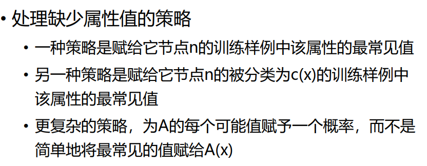

#### 过拟合

- 原因
  - 过拟合问题往往是由于训练数据少和噪声以及模型复杂度过高等原因造成的
  - 当训练数据没有噪声时，过度拟合也有可能发生，特别是当少量的样例被关联到叶子节点时，很可能出现巧合的规律性，使得一些属性恰巧可以很好地分割样例，但却与实际的目标函数并无关系
- 避免过拟合
  - 及早停止树的增长——使用什么样的准则来确定最终正确树的规模
  - 后修剪法

### C4.5

- 用**信息增益率**来选择属性

  克服了用信息增益来选择属性时偏向选择值多的属性的不足。

- 可以处理连续数值型属性

- 采用了一种后剪枝方法

- 对于缺失值的处理

并不直接选择增益率最大的候选划分属性，而是**先从候选划分属性中找出信息增益高于平均水平的属性**，再从中**选择增益率最高的作为最优划分属性**

### CART决策树

- **支持分类和回归**：可以处理分类问题（输出离散值）和回归问题（输出连续值）。

- CART 使用不同的准则来选择最优特征和划分点，具体取决于任务是分类还是回归

  - 分类——基尼指数Gini Index

    基尼指数衡量数据集中类别分布的不均匀性。

    **直观理解**：基尼指数可以理解为从数据集中随机抽取两个样本，其类别不一致的概率。因此，基尼指数越小，数据集的纯度越高。

    对于数据集D，基尼指数的计算公式为：
    $$
    Gini(D)=1-\sum_{c=1}^{C}p_c^2
    $$

    $$
    C是类别的数量，p_c是类别c在数据集D中的比例
    $$

  - 回归——均方误差MSE

### 多变量决策树

传统的单变量决策树在每个节点上只使用一个特征进行分割，而多变量决策树则可以在每个节点上使用**多个特征的线性组合**进行分割。

2. 多变量决策树的优点

2.1 更强的表达能力

多变量决策树能够使用多个特征的线性组合进行分割，因此具有更强的表达能力。它可以捕捉特征之间的交互作用，从而更好地拟合复杂的数据。

2.2 减少树的深度

由于多变量决策树在每个节点上使用多个特征进行分割，它可以更有效地划分数据空间，从而减少树的深度。较浅的树更容易解释，并且可以减少过拟合的风险。

2.3 提高分类精度

多变量决策树能够更好地捕捉数据中的复杂模式，因此在某些情况下可以提高分类精度。特别是在高维数据中，多变量决策树可能比单变量决策树表现更好。

3. 多变量决策树的缺点

3.1 计算复杂度高

多变量决策树在每个节点上需要计算多个特征的线性组合，这增加了计算复杂度。训练多变量决策树需要更多的计算资源和时间。

3.2 容易过拟合

由于多变量决策树具有更强的表达能力，它更容易过拟合训练数据，特别是在数据量较小或噪声较多的情况下。过拟合会导致模型在测试数据上的表现不佳。

3.3 解释性较差

虽然多变量决策树可以减少树的深度，但由于每个节点使用多个特征的线性组合，模型的解释性较差。理解每个节点的分割规则变得更加困难。

## 集成学习

### bagging

Bagging 的核心思想是通过**自助采样法**（Bootstrap Sampling）生成多个训练子集，然后分别训练多个基学习器，最后将这些基学习器的预测结果进行**聚合**（如投票或平均）

- **自助采样法**：从原始训练集中有放回地随机采样，生成多个子训练集。
- **并行训练**：每个子训练集用于训练一个独立的基学习器。
- **结果聚合**：对于分类任务，通常采用**投票法**；对于回归任务，通常采用**平均法**。

**随机森林（Random Forest）**

- **多棵决策树**：随机森林由多棵决策树组成，每棵树独立地对数据进行预测。
- **自助采样法**：每棵树使用从原始数据集中有放回地随机采样的子集进行训练。
- **特征随机选择**：在每棵树的每个节点分裂时，随机选择一部分特征进行分裂，而不是使用所有特征。
- **结果聚合**：
  - 对于分类任务，采用**多数投票法**。
  - 对于回归任务，采用**平均法**。

### boosting

串行地训练一系列前后依赖的同类模型，用后一个模型对前一个模型的输出进行纠正  

### stacking

并行地训练一系列各自独立的不同类模型，然后通过训练一个元模型将各个模型的输出进行结合  

## 神经网络

反向传播算法是最常用的ANN学习技术

### 感知机

perception

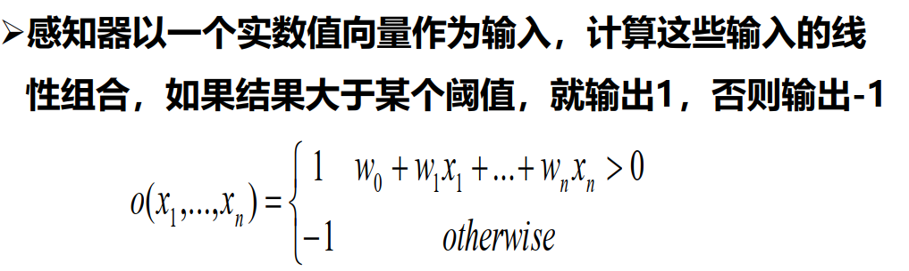
$$
o(\vec{x}) = sgn(\vec{w}\cdot \vec{x}),where~ sgn(y) = 
\begin{cases} 
1 & \text{当 } y > 0 \\
-1 & \text{当 } y \leq 0 
\end{cases}
$$
表征能力：可以把感知器看作是n维实例空间（即点空间）中的超平面决策面

可以被某个超平面分割的样例集合，称为线性可分样例集合

> 收敛的前提条件： 训练样例线性可分

**感知机法则**：保证收敛的前提是训练样例线性可分

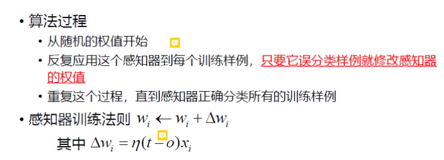

梯度下降和delta法则

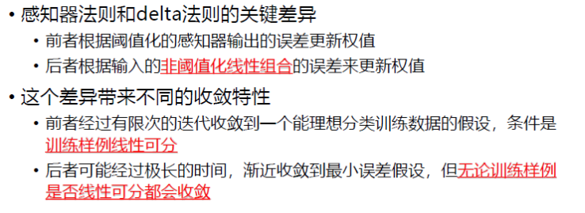

- 使用足够小的学习速率
- 变学习率

- 标准梯度下降和随机梯度下降

  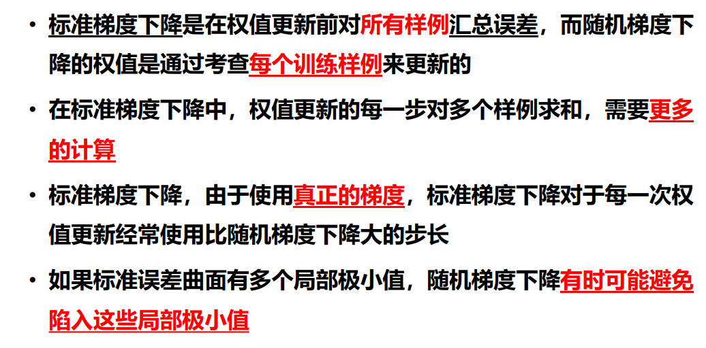

  为了推导线性单元的权值学习法则，先指定一个度量标准来衡量假设（权向量）相对于训练样例的训练误差，其中最常用的度量标准为：
  $$
  E(\vec{w})=\frac{1}{2}\sum(t_d-o_d)^2
  $$

感知器法则和delta法则的关键差异

- **感知器法则**，也称为感知器学习算法，是一种用于训练线性分类器的算法。它根据阈值化的感知器输出的误差来更新权值
  $$
  w_{t+1} = w_t + \eta (t_d - o_d) x_d
  $$
  
- **delta法则**，也称为随机梯度下降（SGD），是一种用于训练线性单元（无阈值的感知器）的算法。它根据输入的非阈值化线性组合的误差来更新权值
  $$
  w_{t+1} = w_t + \eta \frac{\partial E(w)}{\partial w}
  $$
  

学习权向量的第3种方法是线性规划——仅当训练样例线性可分时有解  

多层网络和反向传播算法  

对数几率回归

线性单元

linear unit

### 常见的激活函数

Sigmoid单元，类似于感知器单元，但基于一个平滑的可微阈值函数  

[常见激活函数（Sigmoid、Tanh、Relu、Leaky Relu、Softmax）_sigmoid tanh](https://blog.csdn.net/weixin_44115575/article/details/139835864)

被设计用来引入非线性特性到神经网络模型中。

### 正则化

**正则化是用来防止模型过拟合而采取的手段**

[一篇文章完全搞懂正则化（Regularization）](https://blog.csdn.net/weixin_41960890/article/details/104891561)

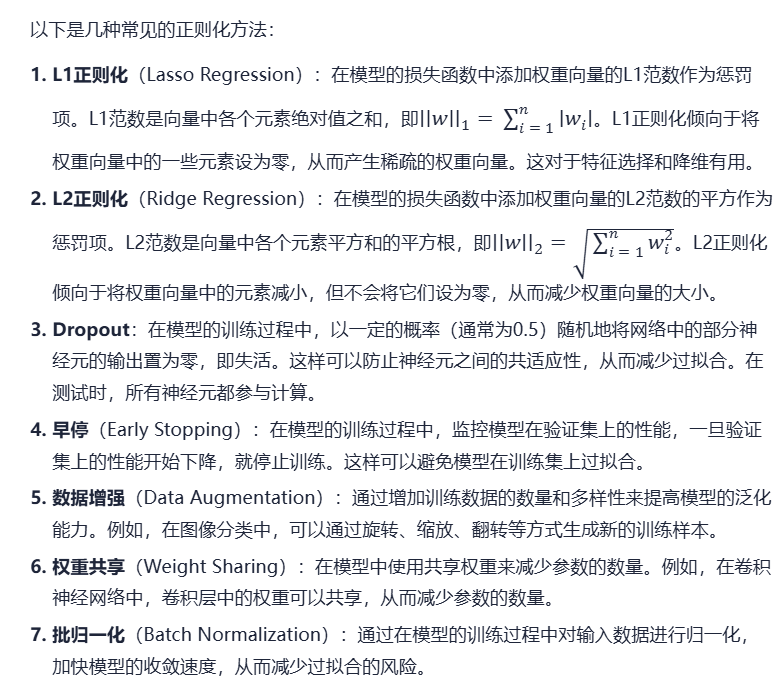

- 优化目标如下，样本数量少，样本特征多，很容易陷入过拟合
  $$
  \min_{\boldsymbol{w}}\sum_{i=1}^m(y_i-\boldsymbol{w}^\mathrm{T}\boldsymbol{x}_i)^2
  $$

- 为了缓解过拟合问题，引入$L_2$范数正则化——也叫岭回归
  $$
  \min_{\boldsymbol{w}}\sum_{i=1}^m(y_i-\boldsymbol{w}^\mathrm{T}\boldsymbol{x}_i)^2+\lambda\|\boldsymbol{w}\|_2^2,\lambda>0
  $$
  倾向于参数平滑都很小

- 引入$L_1$范数正则化，LASSO回归
  $$
  \min_{\boldsymbol{w}}\sum_{i=1}^m(y_i-\boldsymbol{w}^\mathrm{T}\boldsymbol{x}_i)^2+\lambda\|\boldsymbol{w}\|_1,\lambda>0
  $$
  更易于获得稀疏解——即求得的$w$会有更少的非零分量

  

### 训练多层网络的反向传播算法  

（Delta法则）

梯度下降仅能保证收敛到局部极小值

算法解释

增加冲量项

### 收敛性和局部极小值

- 对于多层网络，反向传播算法仅能保证收敛到误差E的某个局部极小值， 不一定收敛到全局最小误差

- 用来缓解局部极小值问题的启发式规则

  - 为梯度更新法则加一个冲量，可以带动梯度下降过程，冲过狭窄的局部极小值（原则上，也可能冲过狭窄的全局最小值）

  - 使用**随机的梯度下降**而不是真正的梯度下降。随机近似对于每个训练样例沿一个不同的误差曲面有效下降，这些不同的误差曲面通常有不同的局部极小值，这使得下降过程不太可能陷入一个局部极小值

  - 使用同样的数据训练多个网络，但用不同的随机权值初始化每个网络

    保留效果最好的那个

### ANN的表征能力

- 布尔函数：任何布尔函数可以被具有**两层单元**的网络准确表示，尽管在最坏情况下所需隐层单元的数量随着网络输入数量的增加成指数级增长

  > **实现原理**：对于每个可能的输入向量，网络都有一个对应的隐藏单元，其权重配置使得该单元仅在对应输入向量出现时被激活。然后，输出层作为一个或门，由所有可能的输入模式激活，从而实现任意布尔函数

- 连续函数：每个有界的**连续函数**可以由一个**两层的网络**以任意小的误差逼近

  > **实现原理**：通过使用连续的非线性激活函数（如Sigmoid、Tanh或ReLU），前馈网络能够逼近任意连续函数

- 任意函数：任意函数可以被一个有**三层单元**的网络以任意精度逼近

  > **实现原理**：通过使用多层结构，前馈网络能够逼近任意函数。具体来说，具有足够多隐藏单元的多层前馈网络可以逼近任意函数，包括不连续函数和非有界函数

反向传播算法的一个迷人特性是： **它能够在网络内部的隐藏层发现有用的中间表示**

k折交叉验证

实践发现， 需要某个最小数量的隐藏单元来精确地学习目标函数，并且超过这个数量的多余的隐藏单元不会显著地提高泛化精度

### 反向传播算法的变体

- 递归网络

  

  

  把递归网络拷贝成几份， 用不同拷贝间的连接替换掉反馈环，这个大的网络不再包含回路，所以可以直接使用反向传播算法来训练

  > 递归网络比没有反馈环的网络更难以训练，泛化的可靠性也不如后者，然而它们仍因较强的表征力而保持着重要性

- 动态修改网络结构

  

  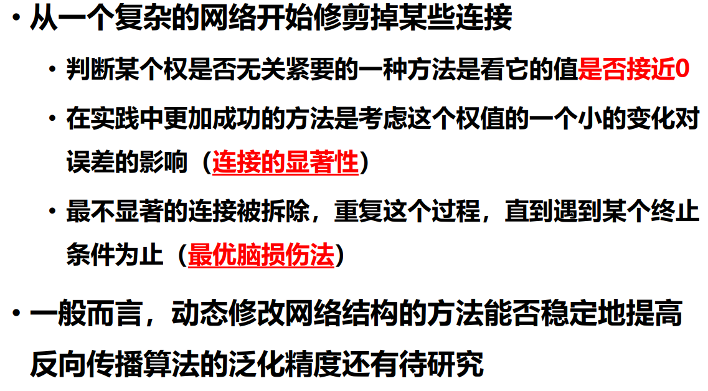

### 梯度消失与梯度爆炸

神经网络中梯度消失和梯度爆炸的原因：

梯度消失

1. 使用 sigmoid、tanh 等饱和激活函数 , 导数值域在 (0,1) 之间
2. 多层网络中 , 每层的梯度会连乘 , 导致梯度越来越小
3. 网络层数过深时尤其明显

梯度爆炸

1. 权重初始化不当 , 值过大
2. 学习率设置过大
3. 网络层数过深时梯度累积

解决方法：

梯度消失

1. 使用 ReLU 等非饱和激活函数
2. 使用残差连接 (ResNet)
3. 使用 Batch Normalization
4. 合理初始化权重

梯度爆炸

1. 梯度裁剪 (Gradient Clipping)
2. 使用 L1/L2 正则化
3. 使用 Batch Normalization
4. 调小学习率
5. 合理初始化权重

## 贝叶斯学习

### 概述

Bayesian Learning

贝叶斯推理提供了一种概率手段，基于如下的假定： 待考察的量遵循某概率分布，且可根据这些概率及已观察到的数据进行推理，以作出最优的决策

特性

- 最大优点：观察到的每个训练样例可以**增量地降低或升高某假设的估计概率**。而其它算法会在某个假设与任一样例不一致时完全去掉该假设
- 

$$
P(A|B) = \frac{P(B|A) \cdot P(A)}{P(B)}
$$

- 
  $$
  p(x_1, \cdots, x_n, \theta) = p(x_1, \cdots, x_n | \theta) \pi(\theta)
  $$

  $$
  \pi(\theta | x_1, \cdots, x_n) = \frac{p(x_1, \cdots, x_n, \theta)}{p(x_1, \cdots, x_n)}
  $$

  $$
  \pi(\theta | x_1, \cdots, x_n) = \frac{p(x_1, \cdots, x_n | \theta) \pi(\theta)}{\int p(x_1, \cdots, x_n | \theta) \pi(\theta) d\theta}
  $$

  > 其中$\pi(\theta)$是先验分布

- MLF**极大似然函数**：通过最大化似然函数来找到最有可能生成观测数据的参数值

- 极大后验假设（MAP）：

  学习器在候选假设集合H中寻找给定数据D时可能性最大的假设h， h被称为极大后验假设（MAP）；确定MAP的方法是用贝叶斯公式计算每个候选假设的后验概率
  $$
  h_{MAP} = \arg\max_{h \in H} P(h | D) = \arg\max_{h \in H} \frac{P(D | h) P(h)}{P(D)} = \arg\max_{h \in H} P(D | h) P(h)
  $$
  
- **极大似然假设**（Maximum Likelihood Hypothesis，简称MLH,ML）：是指在给定数据集的情况下，选择最有可能生成这些数据的假设或模型

  在某些情况下， 可假定H中每个假设有相同的先验概率，这样式子可以进一步简化，只需考虑$P(D|h)$来寻找极大可能假设
  $$
  h_{ML} = \arg\max_{h \in H} P(D | h)
  $$

  > $P(D|h)$常被称为给定h时数据D的似然度，而使$P(D|h)$最大的假设被称为**极大似然假设**

贝叶斯推理的结果很大程度上依赖于先验概率，另外不是完全接受或拒绝假设，只是在观察到较多的数据后增大或减小了假设的可能性

- **交叉熵**:

$$
H(p,q)=-\sum p(x_i)\log q(x_i)
$$

- iid假设：它假设数据集中的样本是**独立**且**同分布**的。

### 贝叶斯线性回归

Bayesian Linear Regression

### Brute-Force贝叶斯概念学习算法

Brute-Force 贝叶斯概念学习算法的核心思想是：

1. **穷举所有可能的概念**：假设概念空间是有限的，枚举所有可能的概念。
2. **计算每个概念的后验概率**：根据贝叶斯定理，计算每个概念在给定数据下的后验概率。
3. **选择最可能的概念**：选择后验概率最大的概念作为学习结果。

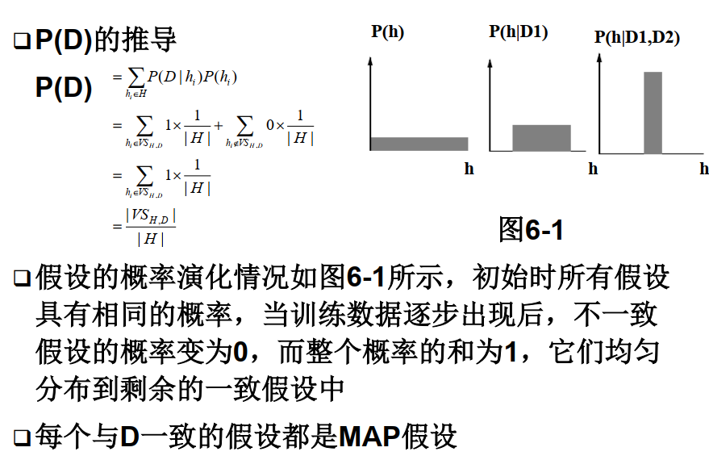

### 最小描述长度准则

**最小描述长度（Minimum Description Length，MDL）准则**
$$
h_{MDL}(h,D)=L(h)+L(D∣h)
$$
最优编码对消息i的编码长度为$-log_2p_i$

### 贝叶斯最优分类器

其目标是在给定输入特征的情况下，通过最小化期望损失来选择最优的类别标签

- 新实例的最可能分类可通过合并所有假设的预测得到，用后验概率来加权

  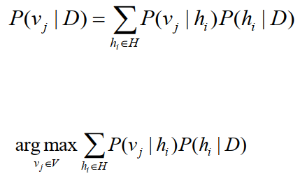

### Gibbs算法  

【Gibbs Sampling的基本思想以及具体步骤】https://www.bilibili.com/video/BV13a411L7XU?vd_source=93bb338120537438ee9180881deab9c1

贝叶斯最优分类器能从给定训练数据中获得最好的性能，但算法的开销很大

>Gibbs采样定理指出，如果能够轻松计算出每个变量在其他变量固定时的条件概率分布，则可以通过迭代地从这些条件分布中抽样，依次更新每个变量，从而生成整体分布的近似样本

我们不知道联合分布率$p(X,Y)$，但是幸运的的我们知道条件分布$p(X|Y)~ and ~ p(Y|X)$ so the Gibbs Sampling Algorithm如下：

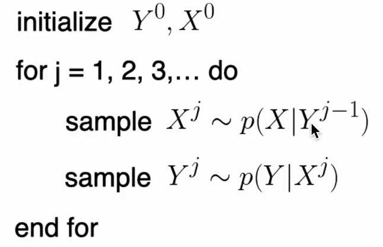

替代的、非最优的方法是Gibbs算法

Gibbs算法的误分类率的期望值最多为贝叶斯最优分类器的两倍

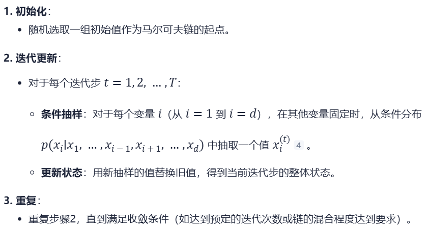

### 朴素贝叶斯分类器  

朴素贝叶斯分类器的核心思想是假设特征之间相互独立，即每个特征对类别的预测贡献是独立的。因此，似然概率可以表示为：
$$
P(x|y) = \prod_{i=1}^{n} P(x_i|y)
$$
将条件独立性假设代入贝叶斯定理，得到朴素贝叶斯分类器的推导公式：
$$
P(y|x) = \frac{P(y) \times \prod_{i=1}^{n} P(x_i|y)}{P(x)}
$$
由于 P(x) 对所有类别都相同，可以忽略，因此朴素贝叶斯分类器可以简化为：
$$
P(y|x) \propto P(y) \times \prod_{i=1}^{n} P(x_i|y)
$$
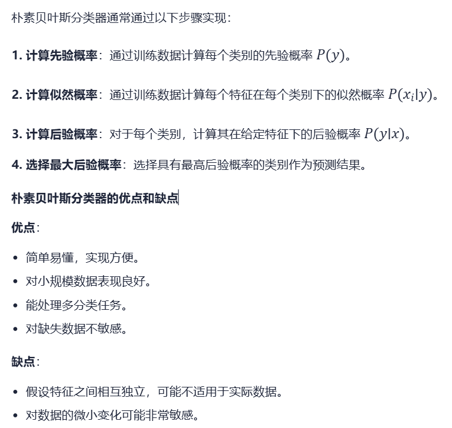

### Dealing with Continuous feature

- 离散化discretization：把大区间分为几个小区间，这样每个区间就是离散的数据
- 拟合分布函数Fit a known Distribution：根据采样数据拟合出它的分布函数，利用分布函数的概率函数来计算概率

### Bonus

- 位势函数法（Potential Function Method）是一种非参数分类方法，主要用于模式识别和分类问题。它通过定义势函数来衡量样本之间的相似性，并利用**积累势函数来估计样本的类别概率分布**

## 支持向量机

## 算法的评估与比较

学习算法的精度进行评估是机器学习中的基本问题，用统计方法估计算法精度  

> 统计的方法，结合有关数据基准分布的假定，可以用有限数据样本上的观察精度来逼近整个数据分布上的真实精度

1. **已知一个假设在有限数据样本上观察到的精度，怎样估计它在其它实例上的精度？** 即如何评估一个学习算法在给定问题上的期望误差率？
2. **如果一个算法在某些数据样本上好于另一个，那么一般情况下该算法是否更准确？** 即给定两个学习算法，如何就给定应用来判断一个算法的误差率比另一个低。
3. **当数据有限时，怎样高效地利用这些数据，通过它们既能学习到假设，还能估计其精度？**

重点讨论对学到的假设的评估、对两个假设精度的比较、 两个学习算法精度的比较。然而，当给定的数据集有限时，要学习一个概念并估计其将来的精度，存在两个关键的困难：**估计的困难和估计的方差**。

### 评估假设的问题

给定假设h和包含若干按D分布抽取的样例的数据集，如何针对将来按同样分布抽取的实例，得到对h的精度最好估计，以及这一精度估计的可能误差是多少。

### 样本错误率和真实错误率

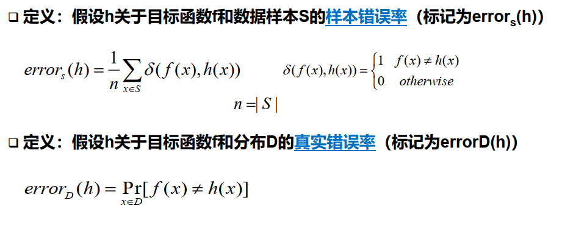

样本错误率是指假设h关于目标函数f和数据样本S的错误率，而真实错误率是指假设h关于目标函数f和分布D的错误率。**我们希望通过样本错误率来估计真实错误率。**

### 离散值假设的置信区间

对于离散值假设，我们可以使用统计理论来给出真实错误率的置信区间估计。具体来说，如果样本S包含n个样例，假设h在这n个样例上犯了r个错误，那么真实错误率$error_D(h)$的95%置信区间可以表示为：

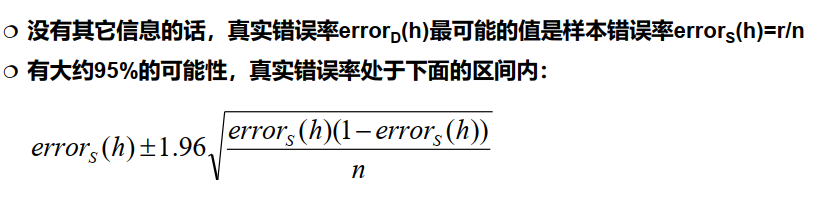

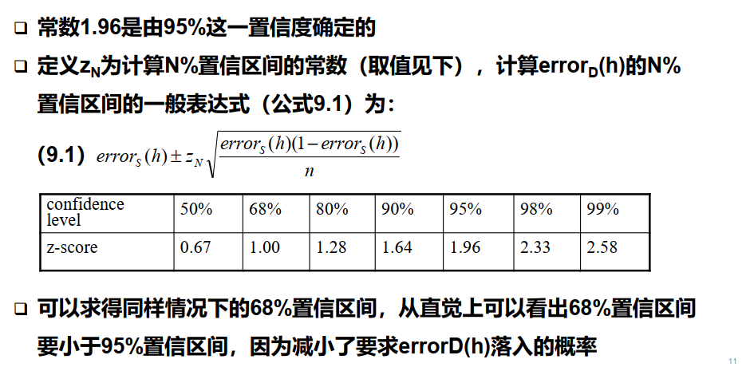

### 错误率估计和二项比例估计

错误率估计和二项比例估计是相关的，因为它们都涉及从总体中随机抽取样本并估计某个属性在总体中的比例。在错误率估计中，我们感兴趣的属性是**假设h对实例错误分类的概率。**

做随机输出实验

设想要运行k个这样的随机实验，得到k个随机变量值，以图表的形式显示观察到的

每个错误率值的频率

当k不断增长，该图表将呈现**二项分布**。

### 二项分布

二项分布描述的是对任一可能的r值，这个正面概率为p的硬币抛掷n次恰好出现r次正面的概率。在错误率估计中，一次硬币抛掷对应于从D中抽取一个实例并测试它是否被h误分类，一次随机抛掷出现正面的概率p对应于随机抽取的实例被误分类的概率errorD(h)。

### 均值和方差

均值是随机变量的期望值，方差描述的是概率分布的宽度或散度。在错误率估计中，我们关心的是样本错误率的均值和方差，因为它们可以帮助我们估计真实错误率的置信区间。

### 估计量、偏差和方差

估计量是用来估计总体参数的随机变量，估计偏差衡量估计量的期望值同真实参数值之间的差异，估计量的方差描述了估计量与真实值的不同有多大。在错误率估计中，我们希望找到一个无偏估计量，并且方差尽可能小。

估计量的另一重要属性是它的方差，给定多个无偏估计量，选取其中方差最小的

由方差的定义，所选择的应为参数值和估计值之间期望平方误差最小的  

### 置信区间

置信区间是描述估计不确定性的一种方法，它给出了一个以一定概率包含真实参数值的区间。在错误率估计中，我们使用置信区间来描述样本错误率和真实错误率之间的关系。

### 双侧和单侧边界

双侧置信区间给出了一个上下界，而单侧置信区间只给出了一个下界或上界。在错误率估计中，我们可能会对真实错误率的上界或下界感兴趣，因此需要使用单侧置信区间。

### 中心极限定理

**中心极限定理说明在n足够大时，样本均值的分布可以近似为正态分布，而不论原始变量服从什么样的分布**。在错误率估计中，我们使用中心极限定理来推导置信区间。

### 两个假设错误率间的差异

我们可能对两个假设的真实错误率之间的差异感兴趣，因此需要估计这个差异的置信区间。

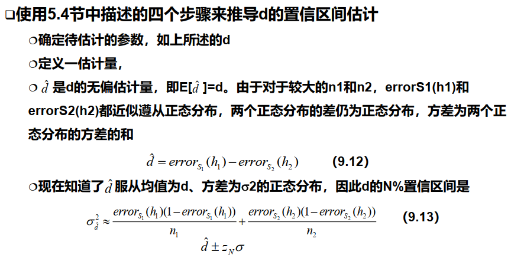

### 假设检验

假设检验用于确定某个特定猜想正确的概率，而不是对某参数的置信区间估计。在错误率估计中，我们可能会对两个假设的真实错误率之间的差异进行假设检验。

### 学习算法比较

我们可能对比较两个学习算法的性能感兴趣，而不是两个具体的假设本身。这涉及到将数据集划分为训练集和测试集，然后在测试集上比较两个学习算法的性能。

使用相同样本来测试假设被称为配对测试，配对测试通常会产生更紧密的置信区间，因为在配对测试中任意的差异都来源于假设之间的差异

### 评估方法

#### K-Fold 交叉验证

K-Fold 交叉验证是一种常用的方法，用于在有限数据集上比较学习算法的性能。它通过将数据集划分为k个子集，然后在每个子集上进行训练和测试，最后取结果的平均值。

#### 留出法

LOO

#### 自助法

bootstrapping

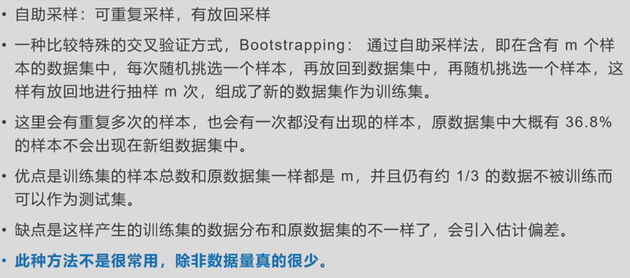

#### 配对t测试

配对t测试是一种用于比较两个学习算法性能的统计方法，它考虑了训练集和测试集之间的相关性。

### 算法评估指标

分类算法评估指标

**混淆矩阵**

- 准确率（查准率）：$ACC = \frac{TP + TN}{TP + FP + FN + TN}$
- 召回率（查全率）：$recall=\frac{TP}{TP+FN}$
- 精确率：$precision=\frac{TP}{TP+FP}$
- F1：中和了精确率和召回率的指标 $F_1=\frac{2PR}{P+R}$
- Binary Cross Entropy（二元交叉熵）用于二分类任务的损失函数
- ROC 曲线：FPR 与 TPR 之间的关系曲线  
- AUC 曲线：通常用于**二分类问题**。AUC指的是ROC曲线（Receiver Operating Characteristic Curve）下的面积，用于衡量模型在不同阈值下的分类性能。AUC越⼤，分类器分类效果越好  
- cross-entropy

在混淆矩阵中，通常使用以下符号来表示不同的情况：

- True Positive（TP）：模型正确地将正类样本预测为正类。
- False Negative（FN）：模型错误地将正类样本预测为负类。
- False Positive（FP）：模型错误地将负类样本预测为正类。
- True Negative（TN）：模型正确地将负类样本预测为负类。

**回归算法评估指标**

- 平均绝对误差（Mean Absolute Error）L1 loss
- 均方误差（Mean Squared Error）又称 L2 loss
- 均方根误差（Root Mean Squared Error）
- 决定系数（Coefficient of determination）
- l1-smooth:L1 正则化
- MBE:Mean Bias Error ( 平均偏差误差 ) 没有取绝对值
- R2
- R2_adjusted

回归算法评估指标的优缺点举例：  a) MAE虽能较好衡量回归模型的好坏，但是绝对值的存在导致函数不光滑，在某些点上不能求导，可以考虑将绝对值改为残差的平方；  b) MSE与目标变量的量纲不一致；  c) RMSE可以保证量纲一致性；  d) 以上基于误差的均值对进行评估的指标，均值对异常点（outliers）较敏感，如果样本中有一些异常值出现，会对以上指标的值有较大影响。 

#### 拟合问题

- 过拟合overfitting：模型在训练集上错误率很低，但是在未知数据上错误率很高

  - 原因：过拟合问题往往是由于训练数据少和噪声以及模型复杂度过高等原因造成的

  - 解决过拟合的方法:

    - 数据层面：增加训练数据、清除数据噪声
    - 模型层面：在经验风险最小化的基础上引入参数的正则化、模型训练提前迭代终止、模型剪枝原则等

    > 例如，决策树模型可以通过先剪枝操作来控制决策树的生长或通过后剪枝操作对决策树进行修剪。神经网络模型可以通过加入L1正则化或者L2正则化、**Dropout**、early stopping等
    >
    > 还能BN (batch normalization，归一化 )

- 欠拟合underfitting：模型不能很好地拟合训练数据，在训练集和测试集上的错误率都比较高
  - 原因：模型复杂度不足，特征不足，训练数据不足，正则化国强，学习率不合适
  - 解决欠拟合的方法:
    - 增加模型复杂度。
    - 增加特征或改进特征工程。
    - 增加训练数据量。
    - 调整正则化强度和学习率。
    - 延长训练时间或改进训练策略。
    - 选择更适合任务的模型。

#### 实际考虑

在实际应用中，我们需要考虑数据集的大小、训练集和测试集的划分方式等因素，以确保统计方法的准确性和可靠性。

- 数据集中正负样本量非常不平衡，处理方法：

  1. 下采样/欠采样（Undersampling）

     1. **方法**：减少多数类样本的数量。
     2. **技术**：
        - **随机欠采样**：随机删除多数类样本。
        - **NearMiss**：选择与少数类样本最接近的多数类样本。
     3. **优点**：减少计算开销。
     4. **缺点**：可能丢失重要信息。

  2. 过采样oversampling：

     1. **方法**：增加少数类样本的数量。
     2. **技术**：
        - **随机过采样**：随机复制少数类样本。
        - **SMOTE（Synthetic Minority Oversampling Technique）**：通过插值生成新的少数类样本。
     3. **优点**：提高模型对少数类的关注。
     4. **缺点**：可能导致过拟合。

  3. 阈值偏移

     通过调整分类阈值，使模型更倾向于预测少数类。

  

## 强化学习

强化学习并不是某一种特定的算法，而是一类算法的统称

**强化学习的目标是给定一个马尔科夫决策过程，寻找最优策略**

马尔可夫决策过程

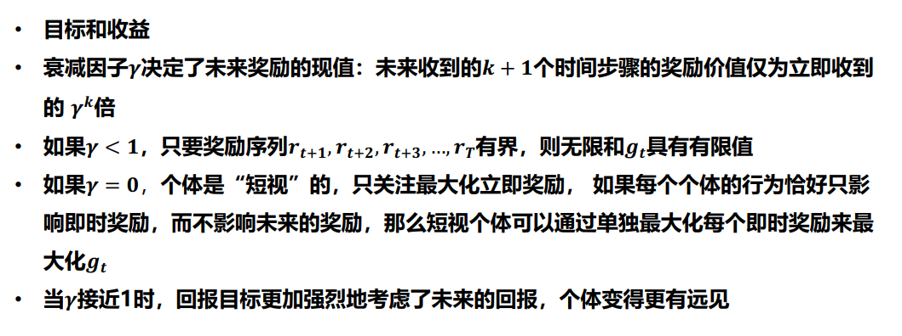

贝尔曼方程

### 免模型学习

- **基于价值的方法（Value-Based Methods）**
  - Q-learning
  - DQN
  - SARSA

- **基于策略的方法（Policy-Based Methods）**
  - **REINFORCE**：通过策略梯度直接优化策略。
  - **Actor-Critic**：
    - 结合价值函数和策略梯度方法。
    - Actor 负责选择动作，Critic 负责评估动作的价值。
    - 代表算法：A3C (Asynchronous Advantage Actor-Critic)

- **基于 Actor-Critic 的方法**
  - **Advantage Actor-Critic (A2C)**：
    - 使用优势函数（Advantage Function）来减少方差。
  - **Proximal Policy Optimization (PPO)**：
    - 通过限制策略更新的幅度来保证稳定性。

- 基于概率
  - Policy Gradients  

### 有模型学习

- **基于模型的方法（Model-Based Methods）**

  - **Dyna-Q**：

    - 结合免模型学习和模型学习。

    - 通过与环境交互更新 Q 值函数，同时使用模型进行模拟更新。

    - 代表算法：Dyna-Q。

  - **Model Predictive Control (MPC)**：

    - 在每个时间步使用模型预测未来的状态和奖励，选择最优动作。

    - 代表算法：MPC。

- **基于规划的方法（Planning-Based Methods）**

  - **Monte Carlo Tree Search (MCTS)**：

    - 通过模拟未来的状态和动作来构建搜索树，选择最优动作。

    - 代表算法：AlphaGo。

  - **Value Iteration**：
    - 通过迭代更新价值函数来求解最优策略。

Expert Iteration

AlphaZero强化学习算法[最强通用棋类AI，AlphaZero强化学习算法解读 - 知乎 (zhihu.com)](https://zhuanlan.zhihu.com/p/325865136)

### Q-learning

Q-Learning的核心思想是通过学习一个Q值函数，使得智能体能够在每个状态下选择最优的行动。

Q函数表示在状态s下采取动作a所能获得的期望回报。Q函数是Q-learning的核心，通过对Q值的不断更新，最终得到最优的Q函数

- 决策
  - 智能体在与环境互动时选择动作的策略，通常为ϵ-greedy策略
  - **选择动作**：
    - 根据当前状态s和探索率ϵ，选择一个动作a。
    - 如果ϵ大于一个随机数，则选择一个随机动作进行探索。
    - 否则，选择Q值最大的动作进行利用。

- 更新

  

  Q-learning根据当前的策略选择动作，但根据最优策略更新Q值

Q-learning是策略无关的（off-policy）

### Sarsa  

- 决策和Q-learning一样

- 更新

  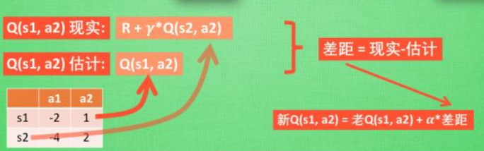

  Sarsa算法根据当前的策略选择动作，并根据所选择的动作更新Q值

- 

单步更新和回合更新

Sarsa算法是策略相关的（on-policy）

- **基于价值**：Sarsa 通过学习 Q 值函数来间接优化策略。
- **在线策略**：Sarsa 使用当前策略选择动作并更新 Q 值函数。
- **时序差分（Temporal Difference, TD）学习**：Sarsa 是一种 TD 学习算法，通过当前估计和下一步估计的差异来更新 Q 值。

### DQN

神经网络+Q learning  

使用神经网络来近似Q函数

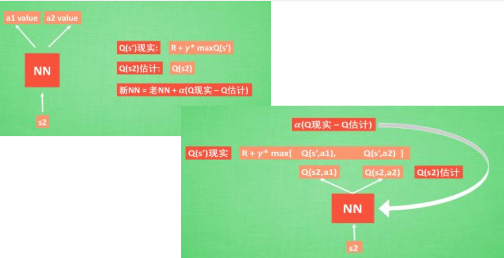

### Policy Gradients

### Actor Critic

### 强化学习与最优控制

 

## MCMC

Markov Chain Monte Carlo

MCMC（Markov Chain Monte Carlo，马尔可夫链蒙特卡罗）是一种通过构建马尔可夫链来从复杂概率分布中采样的方法

### 概述

我们关心的是后验概率$p(z)$

我们想要采样进行随机近似来求概率分布，但是直接采样很困难——那我们应该如何进行采样呢？——于是我们想用MCMC这个方式来进行采样

> **PDF（Probability Density Function，概率密度函数）**
>
> **CDF（Cumulative Distribution Function，累积分布函数）**

- 随机分布采样

  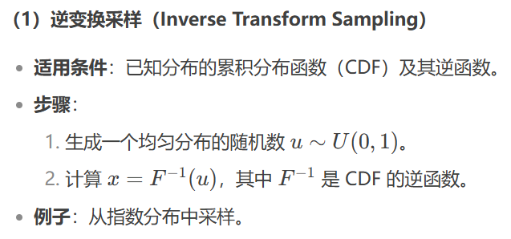

  对很多CDF没有逆函数

- 拒绝采样adjection sampling

  拒绝采样是一种从复杂概率分布中生成样本的方法，适用于无法直接采样但可以计算概率密度函数（PDF）值的情况。其核心思想是通过一个易于采样的提议分布来间接生成目标分布的样本。

  - 使用一个简单的提议分布 \( q(x) \) 来生成候选样本。
  - 通过接受或拒绝候选样本的方式，确保最终样本符合目标分布 \( p(x) \)。

   算法步骤

  1. **选择提议分布**：选择一个易于采样的分布 \( q(x) \) 和常数 \( M \)。
  2. **生成候选样本**：
     - 从 \( q(x) \) 中采样一个候选样本 \( x \)。
     - 从均匀分布 \( U(0, 1) \) 中生成一个随机数 \( u \)。
  3. **接受或拒绝**：
     - 计算接受概率 $\alpha = \frac{p(x)}{M \cdot q(x)}$ 。
     - 如果 $u \leq \alpha$，则接受x作为目标分布的样本；否则拒绝。
  4. **重复**：重复上述步骤，直到获得足够多的样本。

- importance sampling

  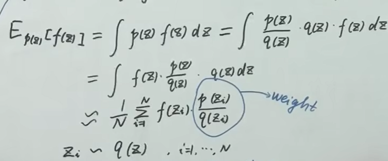

- Markov Chain Monte Carlo（MH，Gibbs）

### 马尔科夫链

Markov Chain ：时间和状态都是离散的，状态$\{x_t\}$，转移矩阵$P\to[p_{ij}]$

满足马尔可夫性质——无后效性
$$
P(X_{t+1}=x|X_{1},X_{2},\ldots,X_{t})=P(X_{t+1}|X_{t})
$$
平稳分布：在任意时刻对应的概率分布是相同的，满足$\pi=\pi P $，其中$\pi$是一个概率分布，且$\sum \pi_i = 1~and~\pi_i\ge 0$

平稳分布是马尔可夫链中的一个核心概念，描述了当时间趋于无穷时，状态分布趋于稳定的情况——概率分布不变

如果我们把概率$p(z)$看作一个平稳分布$\pi\{k\}$，那么我们可以通过构造一个马氏链来收敛到平稳分布。

那么什么样的马氏链才能收敛到一个平稳分布呢？见下

Detailed Balance：$\pi(x)\cdot P(x\mapsto x^{*})=\pi(x^{*})\cdot P(x^{*}\mapsto x)$是平稳分布的充分不必要条件，通过Detailed Balance将$\pi ~ and ~ P$联系在了一起

### MH采样

要满足上述的Detailed Balance条件，如下针对随机的状态转移矩阵$Q$$p(x)\cdot Q(x\mapsto x^{*}\ne p(x^{*})\cdot Q(x^{*}\mapsto x)$，构造$\alpha(z,z^*)$使之满足条件：

如此就得到著名的Metropolis-Hastings算法：

如此采样N次，我们可以得到N个样本点

实际上$p(z)$不能直接求出，实际上我们使用的是$\hat{p}(z)$

### Gibbs采样

Gibbs采样一维一维进行采样，采样过程如下：

Gibbs采样是一个特殊的MH采样$\Leftrightarrow$接受率为1，为什么？代入得到如下：

关键是注意$z_{-i}=z^*_{-i}$

## 训练手段

1. 学习率：常用策略
   - 学习率衰减
   - 使用自适应学习率优化器，如 Adam 和 Adagrad
2. mini batch：
   - 小的 mini batch size 可能因为收敛的抖动比较厉害反而不容易卡在局部最低点
   - 但是 mini batch 也不能太大，反而准确率下降
3. epoch：
   - 用早停法选择合适的 Epoch
   - 观察 validation error 上升时就 early stop
   - 但是别一看到上升就停，再观察一下，因为有可能只是暂时的现象，这时候停止反而训练会不充分
4. 损失函数：
   - 分类一般是 softmax
   - 回归一般是 L2 loss
5. 激活函数：对于梯度消失现象
   - Sigmoid 会发生梯度消失的情况，所以激活函数一般不用，收敛不了
   - Tanh(x) 没解决梯度消失的问题
   - ReLu(Max(0,x)) 比较好，代表 Max 门单元，解决了梯度消失的问题，而且起到了降维——但可能神经元死亡
   - Leaky ReLu
6. 梯度问题：
   - 梯度消失：当数值接近于正向∞，求导之后就更小，约等于 0，偏导为 0
   - 梯度爆炸：数值无限大
7. 层数：
   - 层数越多越灵敏收敛越好，但是容易过拟合
   - 可以用 Drop-out 删除一些无效的节点
8. 过拟合解决方案：
   - drop-out
   - BN (batch normalization，归一化 )
9. 其他模型参数：
   - 隐藏层单元数 (units)
   - 时间序列模型的步长
   - RNN 的 CELL 类型 (LSTM/GRU)

## PCA

主成分分析PCA

[【机器学习】降维——PCA（非常详细)](https://zhuanlan.zhihu.com/p/77151308)

- 最大可分性

  如果我们有一组 N 维向量，现在要将其降到 K 维（K 小于 N），那么我们应该如何选择 K 个基才能最大程度保留原有的信息？

  一种直观的看法是：希望投影后的投影值**尽可能分散**，因为如果重叠就会有样本消失。当然这个也可以从熵的角度进行理解，熵越大所含信息越多。

  对于高维数据，我们用协方差进行约束和衡量t，协方差可以表示两个变量的相关性。为了让两个变量尽可能表示更多的原始信息，我们希望它们之间不存在线性相关性。

- PCA的算法步骤

  

- PCA的特征值分解是针对方阵的，但是SVD对于任意形状的矩阵都可以做。

  

## 经典网络

- Alexnet

  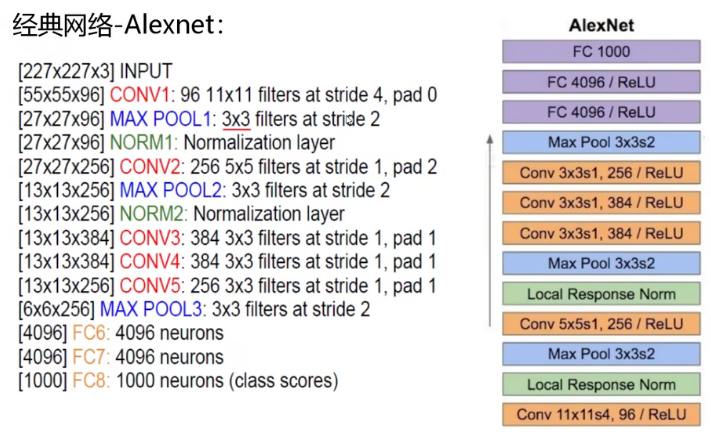

- vgg：用较小的卷积核来完成特征提取

  

  在pool后，在conv前把损失的部分padding回来

- 残差网络Resnet

  

> 感受野
>
> 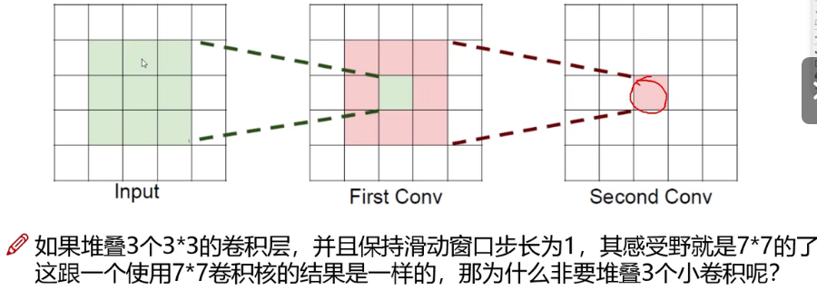
>
> - 使用的参数更小
>
>   

# 期末

 

- 人工智能导论部分的概念背诵
  盲目搜索几种算法的原理、优缺点
  启发式搜索几种算法的原理、优缺点；A* 的步骤；
  逻辑：谓词逻辑；归结原理
  机器学习：
  性能度量：recall precision f1-score
  决策树 : 信息增益的计算；
  神经网络：过拟合；正则化；
  贝叶斯：极大似然估计；naive-bayes：iid 假设
  强化学习：免模型、有模型学习

