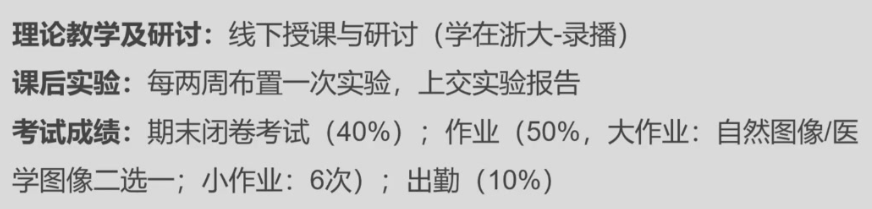
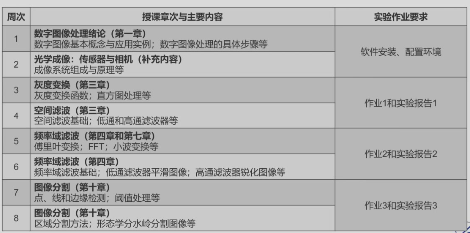
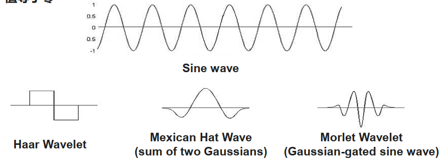
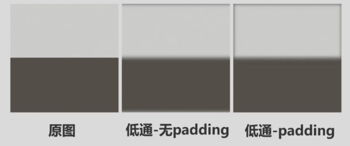

# Main Takeaway






<!--more-->


# Lec 1 Intro

数字图像处理的基本步骤


图像：模拟图像，数字图像

将一副图像从模拟状态转变为数字化形式的处理过程

1. 扫描scanning

   $m\times n$是空间分辨率

2. 采样sampling

3. 量化quantization


图像处理系统组成


- 图像传感器：获取数字图像 = 物理传感器+数字化仪

- 专用图像处理硬件： 又称前端子系统

  通常由数字化仪和执行其他原始操作的硬件如算术逻辑单元(ALU)组成， 算术逻辑单元对整个图像并行执行算术与逻辑运算。 ALU可以进行图像平均操作， 以降低噪声

  显著特点是速度快， 该单元执行要求快速数据吞吐的功能

- 计算机

- 图像处理软件

- 大容量储存

- 图像显示器

- 硬拷贝：用于记录图像

  硬拷贝设备包括激光打印机、 胶片相机、 热敏设备、 喷墨设备和数字单元（如CDROM等） 。 胶片的分辨率最高， 但纸质是首选的书写材料


# Lec 2 光学成像 传感器与相机


## 人体视觉感知

- 主观亮度是进入人眼光强的对数函数  

- 视觉系统分为明视觉和暗视觉  

- 马赫带效应

  

- 光学错视

## 照相机历史


## 相机成像原理

小孔成像，加透镜

- 景深(depth of field)光圈的尺寸影响景深。较小的光圈可以增加物体近似聚焦的范围（景深）
- 焦距
- 视角(field of view)：焦距长，视角小


## 图像传感器（CCD、 CMOS）  

阵列传感器（CCD、 CMOS）

- CCD（Charge Coupled Device， 电荷耦合器件）  
  - CCD上包含的像素数越多， 其画面分辨率越高
  - 应用：单反相机（单透镜反光SLR），旁轴相机（取景光轴位于摄影镜头光轴旁边， 而且彼此平行， 因而取名“旁轴” 相机）
  - 组成：CCD组成主要由一个类似马赛克的网格、 聚光镜片以及垫于最底下的电子线路矩阵所组成
    - 彩色CCD，拜尔滤色镜。两种分色方式（RGB原色分色法，CMYG补色分色法）
    - CCD像素合成：低光照条件下提高感光度和信噪比， 但会降低图像的分辨率
- CMOS（ Complementary Metal Oxide Semiconductor， 互补金属氧化物半导体）  
  - 核心元件：感光二极管
  - 缺点：开口率低（开口率：有效感光区与整个感光元件面积比值） ；灵敏度低、 噪声明显；数模转换无法保证严格一致


两者主要差异是数字数据传送的方式不同


## 图像取样和量化

对坐标值进行数字化称为取样（或采样） ， 对幅度值进行数字化称为量化

- 灰度

- 灰度分辨率通常是指量化灰度时所用的比特数  

  > 图像系的动态范围定义为系统中最大可度量灰度与最小可检测灰度之比。通常， 图像的动态范围上限取决于饱和度， 下限决于噪声

- 图像内插：内插是用已知数据来估计未知位置的值的过程。 内插可以用来调整图像的大小， 缩小和放大基本上采用图像重取样方法


## 一些运算

- 图像相加（平均）：降低噪声
- 图像惩罚啊和出发：模板区域。校正阴影


## 彩色模型

对彩色图像的处理是基于对其适当的描述方法，全彩色处理和伪彩色处理

- RGB彩色模型

- CMY和CMYK彩模型

  CMY颜色模型是基于青色（Cyan）、洋红色（Magenta）和黄色（Yellow）三种颜色的**减色系统**（通过从白光中滤去某种颜色来实现颜色混合）。它主要用于印刷和其他需要在纸上沉积彩色颜料的设备。它们的二次色是红、 绿、 蓝

  CMY颜色模型可以通过以下公式从RGB颜色模型转换得到：

  ```
  C = 1 - R青色吸收红色，反射绿+蓝
  M = 1 - G品红吸收绿色，反射红+蓝
  Y = 1 - B黄色吸收蓝色，反射红+绿
  ```

  其中，R、G、B分别表示红、绿、蓝的分量

  

  > 在印刷行业， 以色料减色法为基础的基本模型为CMY， 但是目前生产不出理想品质的油墨， 所以实用的模型是CMYK， 其中**K是黑色**

- HSI(hue-saturation-intensity)  /HSV(hue-saturation-value )  彩色模型

  > **色调与饱和度**一起称彩色

  - 色调(Hue)：表明颜色的种类，取决于主波长，由角度表示。 反映了该颜色最接近什么样的光谱波长。 

    > 0°为红色， 120°为绿色，240°为蓝色

  - 饱和度（Saturation)：表示颜色浓淡的物理量。用混入白光量比例（或灰成分混入量）来度量，饱和度参数是色环的原点到彩色点的半径长度 

    > 在环的外围圆周是纯的或称饱和的颜色， 其饱和度值为1。 在中心是中性（灰） 色， 即饱和度为0

  - 亮度（lntensity)：人眼所感受到的颜色明暗程度的物理量，用0%到100%表示

    表示光照强度或称为亮度， 它确定了像素的整体亮度， 而不管其颜色是什么

## 假彩色图像处理

- 伪彩色

  - 人类更能辨别颜色的深浅和浓淡，为灰度值指定颜色

  - 密度分割

    若将灰度图像级用M个切割平面去切割，会得到 M+1个不同灰度级的区域S1，S2，…，Sm，SM+1。对这M+1个区域中的像素人为分配给M+1种不同颜色，就可以得到具有M+1种颜色的伪彩色图像

  - 灰度级彩色变换

    伪彩色处理技术（在遥感技术中常称为假彩色合成方法） ， 可以将灰度图像变为具有多种颜色渐变的连续彩色图像  

  - 滤波法

    这是一种在频率域进行伪彩色处理的技术， 与上面不同的是输出图像的伪彩色与图像的灰度级无关， 而是取决于图像中不同空间频率域成分  


# Lec 3 灰度变换与空间滤波


## 灰度变换

- 图像增强

  - 定义：图像增强是指按特定的需要突出一幅图像中的某些信息， 同时消弱或去除某些不需要的信息的处理方法

    > 图像增强处理最大的困难－增强后图像质量的好坏主要依靠人的主观视觉来评定， 也就是说， 难以定量描述

  - 应用：图像的动态范围得到压缩、 图像边缘信息得到锐化处理以及解决颜色恒常性(即改变光照变化的影响)

- 灰度变换：可调整图像的动态范围或图像对比度， 是图像增强重要手段之一 
  $$
  s=T(r)
  $$

  - 图像反转
    $$
    s=L-1-r,灰度级区间[0,L-1]
    $$
    图像反转可用于**增强图像暗色区域中的白色或灰色细节**， 暗色区域的尺寸很大时这种增强效果更好

  - 对数变换
    $$
    s=c\log(1+r),assume ~ r>>0,c ~is ~a~constant
    $$
    **将输入中范围较窄的低灰度值映射为输出中范围较宽的灰度级**

    扩展图像中的暗像素值， 同时压缩高灰度级值。 反对数（指数） 变换的功能正好相反

  - 幂律（伽马） 变换  
    $$
    s = cr^\gamma
    $$
    幂律曲线用分数值𝜸将**较窄范围的暗输入值映射为较宽范围**的输出值，将高输入值映射为较窄范围的输出值

  - 分段线性变换函数  

    对比度拉伸，灰度层分级，突出图像中的特定灰度区间，去除背景， 增强前景

  


## 直方图

- 直方图

  - 将图像中像素亮度（灰度级别） 看成是随机变量， 其分布反映了图像统计特性，可用概率密度函数来刻画和描述
    $$
    h(r_k) = r_k,p(r_k) = \frac{h(r_k)}{MN}
    $$

  - 性质：只反映该图像中不同灰度值出现次数， 而未反映某一灰度值像素所在位置， **即丢失了位置信息**

    **直方图统计学信息公式**

    一阶统计量（平均亮度）
    $$
    E = \sum_{k=0}^{L} z_k \cdot p(z_k)
    $$

    - **物理意义**：图像整体亮度水平的数学期望
    - **计算范围**：从灰度级最小值

    二阶统计量（对比度/标准差）
    $$
    \sigma = \sqrt{\sum_{k=0}^{L} (z_k - E)^2 \cdot p(z_k)}
    $$

    - **衍生指标**：方差
      $  \sigma^2 = \text{std}^2  $
    - **工程意义**：量化图像明暗变化剧烈程度

    N阶统计量（高阶特征）
    $$
    \mu_n = \sum_{k=0}^{L} (z_k - E)^n \cdot p(z_k)
    $$

  - 直方图均衡化（Histogram Equalization）

    - 目的：通过调整图像灰度分布来**增强图像对比度**的全局性图像处理技术。其核心思想是将原始图像的灰度直方图从集中分布的区间转换为**近似均匀分布**，从而扩展像素值的动态范围，使图像细节更清晰、对比度更高

      设计一种变换$s=T(r)$，使得$p_s(s)=\frac{1}{L-1}$

      > **对比度**（Contrast Ratio）指图像或显示设备中 **最亮区域（白）与最暗区域（黑）的亮度比值**

    - 符号定义
      $  p_r(r)  $：原图像灰度级的概率密度函数（PDF）
      $  p_s(s)  $：变换后图像灰度级的概率密度函数
      $  T(r)  $：单调可逆变换函数（满足直方图均衡化条件）

      **概率密度变换关系**：

      

      $$
         p_s(s) = p_r(r) \left| \frac{dr}{ds} \right|
       
      $$

         - 要求变换函数$  s = T(r)  $ 连续可微且单调递增

      **直方图均衡化变换**：
      $$
      s = T(r) = (L-1) \int_0^r p_r(\omega) d\omega
      $$

      $$
      \frac{ds}{dr} = \frac{dT(r)}{dr} = (L-1) p_r(r)
      $$

      $$
         p_s(s) = p_r(r) \left| \frac{1}{(L-1) p_r(r)} \right| = \frac{1}{L-1}
       
      $$

         - 证明变换后PDF为均匀分布

    - 经过直方图均衡化处理后：

      - 输出图像的灰度级服从均匀分布
      - 对比度达到最大化
      - 变换函数本质是原图CDF的线性缩放

    - 所以用离散灰度级作变换一般得不到完全平坦的直方图是近似的概率密度函数，结果。另外，变换后的灰度级减少了，这种现象叫做**“简并”**现象。由于简并现象的存在，的必然结果。由于上述原因，处理后的灰度级总是要减少的，这是像素灰度有限数字图像的直方图均衡只是近似的

      | **优点**                  | **缺点**                             |
      | ------------------------- | ------------------------------------ |
      | 显著提升全局对比度        | 可能放大背景噪声                     |
      | 无需参数设置，自适应调整  | 丢失局部细节（如高光/阴影区域）      |
      | 适用于曝光不足/过度的图像 | 灰度级减少导致色阶断层               |
      | 计算效率高                | 对图像内容不加选择，可能破坏自然色调 |

- 直方图均衡$\to$均匀直方图

- 直方图匹配$\to$一定形态的直方图

  - 其核心目标是 **让输入图像的色调和对比度与参考图像匹配**，从而解决直方图均衡化“一刀切”的问题，实现更灵活的图像增强。
    $$
    G(z) = T(r)\to z=G^{-1}(T(r))
    $$


- 自适应直方图均衡化

  与传统直方图均衡化的区别：根据图像的**局部区域**进行均衡化，从而避免了全局均衡化带来的过度增强或者失真的问题  、

  - 步骤
    1. 将图像分成若干个小的区域
    2. 对每个小区域进行直方图均衡化
    3. 将增强后的小区域合并成整张图像


## 空间滤波器

空间滤波的核心是使用一个称为滤波器或核（kernel）的小窗口，在图像上滑动这个窗口，并用窗口中的像素值与滤波器的权重相乘后求和，来更新中心像素的值。这个过程可以用于图像的**平滑、锐化、边缘增强**等多种目的。

> 滤波有时要分多个阶段完成

- 相关
  $$
  (f*g)(x) = \sum f(t)\cdot g(x+t)
  $$
  **操作本质**：滤波器模板直接滑过图像，计算每个位置的乘积之和，**不翻转滤波器**。

  测量两信号的相似性，应用于图像匹配、特征检测等

- 卷积(常对称)
  $$
  (f*g)(x) = \sum f(t)\cdot g(x-t)
  $$
  **操作本质**：**先翻转滤波器180度**，再滑过图像计算乘积之和。

  述线性时不变系统的输入输出关系，如信号滤波、图像去噪等


> 边缘处理：用0填充，镜像填充

$$
f*g =g*f,\quad f*(g+h)=f*g+f*h\\
f*(g*h) = (f*g)*h
$$

归一化可保持图像处理前后亮度不变

- 平滑（低通）滤波：去噪和平滑

  - 盒式滤波

    均值滤波

  - 高斯滤波

    对于**抑制服从正态分布的噪声非常有效**

  - 中值滤波：

    **首先** 将读取的像素值按照大小进行排序
    **然后** 选取排序后中间的数值，或者中间数值的平均

    这是一种常用的，用于处理类似椒盐噪音那样，孤点信号的特殊方法。

  - 最大值/最小值滤波

- 锐化（高通）滤波器：图像增强和锐化

  - 拉普拉斯滤波器，线性算子
    $$
    \nabla^2 = \frac{\partial^2 f}{\partial x^2}+\frac{\partial^2 f}{\partial y^2}
    $$
    拉普拉斯滤波器基于图像的二阶导数，用于突出图像的边缘。它的基本思想是当邻域的中心像素灰度低于它所在邻域内的其他像素的平均灰度时，此中心像素的灰度应该进一步降低；当高于时进一步提高中心像素的灰度，从而实现图像锐化处理。

    拉普拉斯滤波器更倾向于**检测到尖锐的边缘，**更容易**受到图像噪声的影响**

  - Sobel滤波器

  - 梯度滤波器

  - 钝化掩蔽

    从原图像减去一幅钝化（平滑后）图像

    1. 模糊原图像。
    2. 从原图像减去模糊后的图像（产生的差称为模板）。
    3. 将模板与原图像相加。

  - 高提升滤波


  **使用拉普拉斯来突出细节，使用梯度来增强突出的边缘**。

- 带通滤波器，带阻滤波器

- 组合空间增强


# Lec 4 频域滤波（一）

## 基本概念

- **傅里叶级数**: 任何**周期函数**都可表示为不同频率的正弦函数和/或余弦函数之和，其中每个正线函数和/或余弦函数都乘以不同的系数（我们现在称该和为傅里叶级数）。

- **傅里叶变换**: 任何**非周期函数**都可表示为正弦函数和/或余弦函数乘以加权函数的积分。

- 单变量的傅里叶变换

  - 连续函数的傅里叶变换：频谱反映了输入信号的频率构成

    当一个一维信号$f(x)$满足狄里赫莱条件时，其傅里叶变换和逆变换一定存在
    $$
    F[f(x)] = F(u) = \int_{-\infty}^{+\infty} f(x)e^{-j2\pi ux} dx
    $$

    $$
    F^{-1}[F(u)] = f(x) = \int_{-\infty}^{+\infty} F(u)e^{-j2\pi ux} du
    $$

    x称为时域变量，u称为频域变量

    公式中使用了积分符号和复指数函数，其中 $  j  $ 表示虚数单位，满足 $  j^2 = -1  $

## 取样函数的傅里叶变换

奈奎斯特采样定理

- **条件**：采样频率 $ f_s \geq 2f_{max} $（避免混叠）。

- **混叠现象**：高频信号被误认为低频（如锯齿状边缘）。

  混叠情况下， 重建连续信号是不可能的

  

- **解决方法**：预滤波（如高斯模糊）去除高频分量。

取样与离散信号

- 取样信号：
  $$
  \tilde{f}(t) = f(t)S_{\Delta T}(t)=\sum f(n\Delta T)\delta(t-n\Delta T)
  $$

- 取样信号频谱为原信号频谱的周期性延拓：——连续函数
  $$
  \tilde{F}(\mu) = \frac{1}{\Delta T} \sum_{n=-\infty}^{\infty} F\left(\mu - \frac{n}{\Delta T}\right)
  $$


## 离散傅里叶变换

离散傅里叶变换(Discrete Fourier Transform, DFT)  

- 一维离散傅里叶变换

$$
  F(u) = \sum_{x=0}^{N-1} f(x) e^{-j2\pi ux/N}
$$

通常傅里叶变换为复数形式：$F(u)=R(u)+jI(u)=|F(u)|e^{j\varphi(u)}$

- **频谱与相位谱**：

  - 幅度谱：$ |F(u)| = \sqrt{R^2(u) + I^2(u)} $
  - 相位谱：$ \varphi(u) = \arctan\left(\frac{I(u)}{R(u)}\right) $
  - 能量谱（功率谱）：$E(u)=|F(u)|^2$

- 二维离散傅里叶变换

  二维数据$t\prime~~t\prime\prime$，称为空间域
  $$
  F(u, v) = \frac{1}{MN} \sum_{x=0}^{M-1} \sum_{y=0}^{N-1} f(x, y) e^{-j2\pi(ux/M + vy/N)}
  $$
  $F(0,0)$有时被称为频谱的直流分量

  

  | 性质       | 描述                                            |
  | ---------- | ----------------------------------------------- |
  | **平移性** | 空域平移对应频域相位变化，幅度谱不变。          |
  | **对称性** | 实信号频谱共轭对称：$ F(u, v) = F^*(-u, -v) $。 |
  | **旋转性** | 空域旋转角度对应频域相同角度旋转。              |

  应用场景

  - **频域滤波**：低通（去噪）、高通（边缘增强）。
  - **图像重建**：仅用相位谱或幅度谱重建图像（相位谱主导结构信息）。

二维离散卷积定理：
$$
\begin{aligned}
f(x, y) \ast h(x, y) &\iff F(u, v)H(u, v) \\
f(x, y)h(x, y) &\iff F(u, v) \ast H(u, v)
\end{aligned}
$$
滤波器在空间域和频率域的表示组成了一个傅里叶变换对


## 快速傅里叶变换（FFT）

算法优势

- 计算复杂度从 $ O(N^2) $ 降至 $ O(N \log N) $（如Cooley-Tukey算法）。
- **核心思想**：分治法（递归分解DFT为更小的DFT）。

分步实现

1. **奇偶分解**：将信号分为偶数项和奇数项。
2. **递归计算**：组合小规模DFT结果。

## 小波变换基本概念

### 核心思想

小波变换（wavelet transform， WT）

- **核心优势**：同时捕捉信号的时域和频域局部特征。
- **基函数**：有限持续时间的小波基（如Haar、Mexican Hat）。

| 特性         | 傅里叶变换               | 小波变换                   |
| ------------ | ------------------------ | -------------------------- |
| **基函数**   | 无限长正弦波             | 有限持续时间小波           |
| **适用场景** | 平稳信号（整体频率分析） | 非平稳信号（局部瞬态特征） |

信号分析是为了获得时间和频率之间的关系

傅立叶分析

- 用一系列不同频率的正弦波表示一个信号

- 一系列不同频率的正弦波是傅立叶变换的基函数

- 傅里叶理论只有频率分辨率而没有时间分辨率。

  可确定信号中包含哪些频率的信号， 但不能确定具有这些频率的信号出现在什么时候

小波分析

- 把一个信号分解为母小波通过移位和缩放后得到的一系列小波
  - 通过缩放母小波的宽度来获得**信号的频率特征**
  - 通过平移母小波来获得**信号的时间信息**
- 小波是一类在有限区间内快速衰减到0的函数， 其平均值为0， 小波趋于不规则、 不对称


- 凡能用傅立叶分析的函数都可用小波分析， 小波变换可理解为用经过缩放和平移的一系列函数代替傅立叶变换用的正弦波
- 用不规则的小波分析变化激烈的信号比用平滑的正弦波更有效， 或者说对信号的基本特性描述得更好

### 小波函数

小波是在有限时间范围内变化且其平均值为零的数学函数  




### 多分辨分析中的小波变换

多分辨分析

- 在同时存在小型和大型物体， 或低对比度和高对比度物体的情况下需要多分辨率分析
- 局部直方图变化， 使得难以为整幅图像构建统一的统计模型

使用图像金字塔


### 连续小波变换（CWT）

给定函数$\psi$，对其进行缩放和平移
$$
W(s, \tau) = \int_{-\infty}^{\infty} f(x) \frac{1}{\sqrt{s}} \psi\left(\frac{x-\tau}{s}\right) dx
$$

- **参数**：
  - 尺度因子 $ s $：控制小波宽度（大尺度→低频，小尺度→高频）。
  - 平移因子 $ \tau $：控制小波位置。

物理意义

- 小波系数 $ W(s, \tau) $ 反映信号与不同尺度/位置小波的相关性。

---

### 离散小波变换（DWT）

多分辨率分析（MRA）

- **分解过程**：
  - **近似分量（低频）**：低通滤波 + 下采样。
  - **细节分量（高频）**：高通滤波 + 下采样。

---

### 二维小波变换

基函数

- 由一维小波张量积生成：
  - 水平方向：$ \psi^H(x, y) = \phi(x)\psi(y) $
  - 垂直方向：$ \psi^V(x, y) = \psi(x)\phi(y) $
  - 对角方向：$ \psi^D(x, y) = \psi(x)\psi(y) $

优势

- **边缘保留**：高频细节分量定位边缘。
- **多尺度分析**：不同分辨率下的特征提取（如纹理、形状）。


# Lec 5 频域滤波（二）

## 频率域滤波基础

### 频率与空间

- 频率分量代表什么？
  - 低频
    - 缓慢变化的强度分量
    - 直流分量
  - 高频
    - 强度的急剧变化
    - 边缘和噪声
- 图像如何通过频率域获得增强？


### 频域滤波的步骤

预处理：先图像中心化，具体通过在计算前用$(-1)^{x+y}$乘以输入图像完成

1. 对图像傅里叶变换

$$
   \mathcal{F}[f(x, y)] = F(u, v)
 
$$

对于$M\times N$的图像，先将其填充至$2M\times 2N$

> 有无padding填充


2. 进行变换

$$
   H(u, v) F(u, v)
 
$$

滤波器函数$H(u,v)$的中心在$(M\times N)$


3. 逆变换得到图像

$$
   \mathcal{F}^{-1}[H(u, v) F(u, v)]
 
$$

裁剪回$M\times N$

> 有无cropping裁剪


4. 图像为实函数

$$
g(x, y) = \text{real}\{\mathcal{F}^{-1}[H(u, v) F(u, v)]\}
$$

下面介绍一下滤波过程中常出现的问题：

- 空间卷积：会产生**混淆伪影**

  

- 频率域滤波振铃效应：

  经过完整的四个频域滤波的步骤

  

  使用理想低通滤波器（如矩形窗）时，高频分量被完全截断，其傅里叶逆变换（sinc函数）在空间域产生周期性震荡，导致边缘处出现波纹

  数学本质：违反吉布斯现象原理，有限项傅里叶级数逼近不连续信号时，会在跳变点附近产生9%的过冲震荡


### 空间域和频率域滤波对应关系

卷积定理是两者唯一的纽带

已知 $H(u, v)$ 时，假设我们想要求其空间域中的等效核。若令 $f(x, y) = \delta(x, y)$，则有：

$$
 
F(u, v) = 1
$$

滤波后的输出为 $\mathscr{F}^{-1}\{H(u, v)\}$。由此，两个滤波器形成了一个傅里叶变换对：

$$
 
h(x, y) \Leftrightarrow H(u, v)
$$

式中，$h(x, y)$ 是空间核，可由一个频率域滤波器对一个冲激的响应得到。因此，称 $h(x, y)$ 为 $H(u, v)$ 的冲激响应。


## 频率域滤波器

- 理想滤波器：希望无衰减通过

  

  高频分量被完全截断，频域中滤波器越窄，模糊和振铃效应越严重

  于是我们希望既可以平滑图像同时不产生振铃效应：让频域中理想低通滤波器的下降沿更加平滑：于是有了下面两种滤波器

- 巴特沃斯滤波器
  $$
  H(u, v) = \frac{1}{1 + \left[\frac{D(u, v)}{D_0}\right]^{2n}}
  $$
  

  随着滤波器阶数增加，振铃效应加重

  严格控制截止频率附近低频和高频之间的过渡

- 高斯滤波器
  $$
  H(u, v) = e^{-D^2(u,v)/2D_0^2}
  $$
  高斯函数的数学性质

  - 高斯函数的导数仍是一个高斯函数
  - 高斯函数的傅里叶变换仍是高斯函数

  能够完全去除振铃效应

- 拉普拉斯——高通滤波器：图像锐化

- 同态滤波：是将非线性问题，转化为线性问题处理。即对非线性（乘性）混杂信号，通过某种数学运算（如对数变换），变成加性模型，而后采用线性滤波方法进行处理

  基于照射-反射模型的图像表示：


$$
  f(x, y) = i(x, y) \cdot r(x, y)
$$

  > i代表随空间位置不同的光强（Illumination）分量，其特点是缓慢变化，集中在图像的低频部分。
  > r代表景物反射到人眼的反射（Reflectance）分量，其特点包含了景物各种信息，高频成分丰富。


- 选择性滤波

  - 带阻滤波器

  - 带通滤波器

  - 陷波滤波器：阻止（或通过）事先定义的频率矩形邻域中的频率。

    可由多个带阻滤波器相乘产生

# 期末

- [数字图像处理与机器视觉 2023-2024春夏 回忆卷](https://www.cc98.org/topic/5922736)——感觉不用学

- [2022-2023学年春夏学期 控制学院《数字图像处理与机器视觉》期末考试 回忆卷 - CC98论坛](https://www.cc98.org/topic/5644557)

# References

- [数字图像处理笔记 - 知乎 (zhihu.com)](https://zhuanlan.zhihu.com/p/556661415)