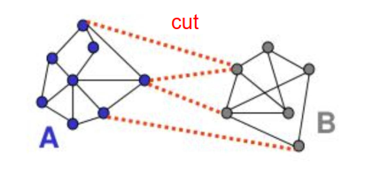

# Lec 10 图像分割

从图像中提取信息

1. 图像分割→得到对象或者区域
2. 特征提取→以适合计算机处理的形式描述和表示分割的区域
3. 计算机视觉→进行图像识别和解释

Segment Anything Model -- SAM

## 基础知识

图像分割操作强烈依赖以下两种方式

- 不连续性——基于强度值的突变进行分割

  点检测、线检测、边缘检测

- 相似性——基于强度值的相似性进行分割

  國值分割、区域生长、区域分裂及合并、聚类方法等

## 点、线、边缘检测

- 抑制噪声（低通滤波、平滑、去噪、模糊）

- 边缘特征增强（高通滤波、锐化）

  几何变化，灰度变化，光照方向变化

- 边缘定位

几种微分算子

- 一阶导数
  - 一阶导数通常在图像中产生更粗的边缘
  - 一阶导数通常对灰度阶跃有更强的响应

- 二阶导数
  - 二阶导数对精细细节有较强的响应
  - 二阶导数在灰度过渡处会产生双边缘响应
  - 二阶导数的符号可用于确定边缘的变化是从亮到暗还是从暗到亮
  - 对噪声非常敏感

边缘检测步骤：

第一步：图像平滑以减少噪音

第二步：计算局部导数

第三步：一阶导的幅值可以用来检测边缘的存在

第四步：二阶导的符号可以用来决定边缘的像素是处于一张图片的局部亮面还是暗面

第五步：二阶导的过零点位于边缘强度变化区域的中点，这提供了一个用于边缘定位的强大方法

下面介绍几种常用的算子：

- 拉普拉斯算子：对噪声具有无法接受的敏感性，不能检测边缘的方向

- LoG：在拉普拉斯算子先进行平滑，不用于梯度方向，而是用于确定像素位于边缘的暗侧或亮侧

  利用零交叉特性进行边缘定位：零交叉点可用于定位粗边缘的中心

  > 斜坡开始处，二阶导数为负，斜坡结束二阶导数为正，斜坡上，二阶导数为0.（亮到暗边缘）
  > 零交叉点的定义：零灰度轴和二阶导数极值的连线的交点称为该二阶导数的零交叉点
  >
  > 
  >
  > 二阶导数提取边缘往往产生**双边缘**。而 通过求零交叉点可以确定边缘的中心，从而避免了产生双边缘的不方便

- Marr-Hildreth边缘检测子

  Marr-Hildreth边缘检测器由LoG滤波器与一幅输入图像 $f(x, y)$ 卷积组成，即

  $$
  g(x, y) = [\nabla^2 G(x, y)] * f(x, y)
  $$

  寻找 $g(x, y)$ 的零交点来确定 $f(x, y)$ 中边缘的位置。由线性操作，有

  $$
  g(x, y) = [\nabla^2 G(x, y) * f(x, y)]
  $$

  数字图像用Marr-Hildreth边缘检测器进行边缘检测的基本步骤：
  第一步：用一个对下式取样得到的n×n的高斯低通滤波器对输入图像滤波

$$
  G(x, y) = e^{-\frac{x^2 + y^2}{2\sigma^2}}
$$

  第二步：计算由第一步得到的图像的拉普拉斯
  第三步：找到第二步的零交叉

- Canny边缘检测
- Hough变换：构造区域之间的边界

## 阈值处理

> 阈值处理这里的目的是图像分割

分割后的图像由下式给出

$$
g(x, y) = 
\begin{cases} 
1, & \text{if } f(x, y) > T \\
0, & \text{if } f(x, y) \leq T 
\end{cases}
$$

即任意一点 $(x, y)$ 的灰度值满足 $f(x, y) > T$，则被称为前景点；否则被称为背景点。$T$ 是阈值，可以用下式表示

$$
G = T[x, y, p(x, y), f(x, y)] \quad p(x, y) \text{像素邻域的一些局部性质}
$$

阈值分割的关键是如何确定适合的阈值 $T$，不同的阈值其处理结果差异很大，会影响特征测量与分析等后续过程。

- **全局阈值**：$T$ 与各个像素的灰度有关
- **局部阈值**：$T$ 与像素本身及其局部性质（如邻域的平均灰度）有关
- **动态阈值/自适应阈值**：$T$ 与局部性质及像素位置有关

- 噪声
- 光照和反射

下面介绍一种迭代算法确定全局阈值的方法：

1. 为全局值T选择一个初始估计值
   - 如果前景和背景占据面积相近，那么平均灰度可能是较好的T的初始值
   - 如果前景和背景占据面积不相近，那么最大灰度值和最小灰度值的平均值可能是较好的T的初始值
2. 用T分割图像。产生两组像素：灰度值大于T的G1，小于等于T的G2
3. 分别对两组像素G和G2计算平均灰度值，得到m1和m2 
4. 在m1和m2之间计算一个新的阈值，$T=\frac{1}{2}(m_1+m_2)$
5. 重复步骤2-4，直到连续迭代的两个T值的差的绝对值小于某个预定义的值△T为止

确定全局值的方法很多，如极小点值法、送代值法、最优國值法、 Otsu值法、最大熵法、p参数法等（实际运用中通常多试几种得到最适合的哪一个）

这里我们介绍一下一种比较常用的方法：Otsu（大津法）最优全局國值处理

- 基本思想：使得图像分割目的就是要使类别之间的差别最大，类内之间的差别最小

- 基本流程：

  1. 设图像总像素数为 $N$，灰度级总数为 $L$，灰度值为 $i$ 的像素数为 $N_i$。令 $p(k)$ 和 $\mu(k)$ 分别表示从灰度级 0 到灰度级 $k$ 的像素的出现概率和平均灰度。分别表示为
     $$
     p(k) = \sum_{i=0}^{k} \frac{N_i}{N}
     $$

     $$
     \mu(k) = \sum_{i=0}^{k} \frac{i \cdot N_i}{N}
     $$

     则，所有像素的总概率为 1，图像的平均灰度为 $\mu_T = \mu(L-1)$

  2. 设图像被分割为 $M$ 个像素类 $C_j$，其统计特性计算如下：

     1. **类概率计算**
        类 $C_j$ 的概率：

     $$
        p_j = p(t_j) - p(t_{j-1})
      
     $$

 2. **类平均灰度**
    类 $C_j$ 的平均灰度：

$$
 \mu_j = \frac{\mu(t_j) - \mu(t_{j-1})}{p_j-p_{j-1}}
$$

 3. **类方差计算**
    类 $C_j$ 的方差：
    $$
    \sigma_j^2 = \sum_{i=t_{j-1}+1}^{t_j} \left( i - \mu_j \right)^2 \frac{p(i)}{p_j}
    $$

 **阈值分割约束**
 设 $M-1$ 个分割阈值满足：
$$
 0 \leq t_1 < t_2 < \cdots < t_{M-1} \leq L-1
$$

 将灰度区间划分为：

$$
 C_j = [t_{j-1}, t_j] \quad (j=1,2,...,M) \quad \text{且} \quad t_0=0,\ t_M=L-1
$$

  3. 类内方差
     $$
     \sigma_W^2(t_1, t_2, \cdots, t_{M-1}) = \sum_{j=1}^{M} p_j \cdot \sigma_j^2
     $$

     类间方差
     $$
     \sigma_B^2(t_1, t_2, \cdots, t_{M-1}) = \sum_{j=1}^{M} p_j \cdot (\mu_j - \mu_T)^2
     $$
     将使类内方差最小或使类间方差最大的值组（t1，t2，，tM-1）作为阈值化的最佳阈值组。若取M=2，即分成两类，则可用上述方法求出二值化的最佳值

## 基于区域的分割方法

此类算法直接寻找区域， 而不是划分区域的边界

- 区域生长

  - 核心思想：从种子点出发，逐步合并相似邻域像素，形成区域

  - 适用范围：适合目标特征明确且与背景差异明显的场景（如单色物体、医学器官分割）

  - 步骤：

    1. **种子选择**：手动或自动选择初始种子点（如基于灰度极值或用户标注）。

       需要先验知识选取种子像素

    2. **相似性准则**：定义像素合并条件（如颜色差<阈值、纹理相似性）。

    3. **区域扩展**：将邻域像素与当前区域比较，满足条件则合并。

    4. **终止条件**：无法合并新像素时停止（如所有邻域不满足相似性）

- 区域分离与聚合

  - 核心思想：从整幅图像出发，递归分裂成子区域，再合并相似区域。

  - 适用范围：适用于复杂图像，尤其是区域边界模糊或存在多个目标的场景（如自然场景分割）

  - 步骤：

    1. **初始划分**：将图像划分为均等小块

       将图像分成若干个子区域， 常用四叉树来表示

    2. **分裂阶段**：若子区域不满足一致性准则（如灰度方差过大），继续分裂

       不满足某种一致性准则(一般用灰度均值和方差来度量)， 则将其继续分裂成若干个子区域， 否则该子区域不再分裂

    3. **合并阶段**：相邻区域若满足相似性准则（如颜色均值接近），则合并

       满足某个相似性准则， 则合并为一个区域， 直到没有可以分裂和合并的子区域为止

    4. **迭代优化**：重复分裂与合并，直到区域稳定。

## 基于聚类和超像素的分割方法

- k-means区域分割

  - 核心思想：将图像中的每个像素视为一个数据点，基于颜色（RGB/灰度值）或空间位置特征，使用K-means算法将相似像素聚类为K个簇，每个簇的质心颜色代表该区域的主色调，最终实现区域分割
  - 适用范围：适用于颜色分布差异明显、区域内部特征均匀的图像（如自然场景、医学影像、卫星图像）
  - 步骤
  - 优点：简单，快速
  - 缺点：
    - 如何合理设置k
    - 对初始中心敏感
    - 对外点敏感
    - 难以检测球形簇
    - 必须假定均值可计算

- SLIC（简单线性迭代聚类）超像素区域分割

  - 要解决的问题：SLIC超像素分割旨在将图像划分为多个紧凑、均匀且边界贴合良好的超像素块，从而简化后续图像处理任务

  - 核心思想：将图像转换到 **CIELAB颜色空间**（兼顾亮度和颜色感知），结合 **空间坐标** 构建5维特征向量（L, a, b, x, y），通过改进的k-means聚类生成超像素。通过限制搜索范围和动态距离度量提升效率与效果。

    > 当然也可以直接在RGB空间进行

  - 适用范围：适用于颜色/纹理差异显著的自然图像、医学影像（如MRI）、卫星图像等。

  - 步骤

    1. 初始化种子点

       - 均匀分布种子点
       - 调整种子至3×3邻域内梯度最小处，避免初始中心落在边缘

    2. 局部聚类：每个种子点周围 **2S×2S** 区域搜索，计算像素与种子的距离
       $$
       D = \sqrt{(\frac{d_c}{m})^2+(\frac{d_s}{S})}
       $$

        - $  d_c  $：LAB颜色距离（$  \sqrt{(L_i-L_j)^2 + (a_i-a_j)^2 + (b_i-b_j)^2}  $）。
        - $  d_s  $：空间距离（$  \sqrt{(x_i-x_j)^2 + (y_i-y_j)^2}  $）。
        - $  m  $：紧凑度参数（通常取10~20），控制颜色与空间的权重。

    3. 迭代优化

    4. 连通性增强：后处理合并不连续小区域，解决欠分割问题

  - 优点：快，消耗少

  - 缺点：初始敏感/纹理局限，小区域问题

## 图割分割算法

- 作为图的图像

  

- 最小图割（Graph Cut）

  

  - 割：一组连接，删除后使图断开

  - 割的代价（边的最小总权重）：$cut(A,B) = \sum_{p\in A,q\in B}W_{p,q}$

  - 最小割，给出一个分割结果，实现快速

    但切割权重与切割边数成正比， 往往会产生小的、孤立的部分——归一化修正

- 图割分割算法

  - 核心思想：将图像建模为**带权无向图**，通过求解最小割（Min-Cut）实现能量最小化
  - 优点：通用方法， 可以灵活选择计算节点之间权重（近似度） 的函数
  - 缺点：计算量大，偏好平衡的分割方法， 对孤立点等有效性较差

- GNN/GCN

## 形态学分水岭分割图像

- 基本知识
  - 灰度图像可以看做是一片地形， 像素的灰度值代表该点的地形高度，一张图以x,y和灰度值三维形式表示
  - 在这种地形解释中，有三类点
    - 低洼：属于一个区域极小值的点
    - 汇水盆地/分水岭：在该处水会流入某个局部极小值点
    - 分界线/分水线：在该处水会等可能地流入不止一个局部极小值点
  - 适用降雨法区分这三类点，对分界线进行筑坝
- 分水岭分割算法
  - 解决的问题：分水岭算法主要用于解决图像中**目标粘连或重叠时的精确分割**问题
  - 适用范围：适用于灰度图像，尤其是**梯度明显**的场景（如边缘清晰的物体、医学影像）
  - 核心思想：将图像视为**地形表面**，灰度值代表海拔高度。低灰度区域为“山谷”（目标内部），高灰度区域为“山峰”（目标边界）。通过模拟水流从山谷逐渐上升并筑坝的过程，分割出独立区域

# Lec 5 图像复原与重建

## 基本概念

常用图像复原（Image Restoration）处理大气湍流，运动模糊，离焦模糊等问题

- 图像降质（图像退化）
  - 象差与畸变：成像系统的局限性如带宽和畸变导致的图像失真
  - 噪声干扰：成像、 数字化及处理过程中引入噪声
  
- 图像增强（Enhancement）
  - 旨在改善图像质量， 提高图像的可懂度
  - 更偏向主观判断， 即要突出所关心的信息， 满足人的视觉系统， 具有好的视觉效果
  
- 图像复原（Restoration）
  - 根据图像畸变或退化的客观原因， 进行模型化处理， 将降质图像恢复到原始图像，因此必须根据一定的图像退化模型来进行图像复原
  
  - 核心思想：弄清楚降质/退化的原因，分析引|起降质/退化的因素，建立数学模型，并沿着图像降质的逆过程回复图像
  
    

- 图像退化/恢复模型

  

  关于$h,\eta$的知识越多，估计图像越接近原始图像

## 噪声模型与图像复原

- 噪声来源

  - 在获取图像过程中，成像传感器主要受各种环境因素和传感元件本身的质量的影响
  - 在传输图像过程中，图像会因传输信道中的干扰而污染

- 噪声的分类：

  - 随机噪声

  - 脉冲噪声

  - 周期噪声

    图像中的周期噪声通常是在获取图像期间由电气或机电干扰产生的

    周期噪声是**空间依赖型噪声**，可通过频率域滤波来明显降低

- 噪声的特性

  - 空间特性：除周期噪声外，本章假设噪声与空间坐标无关，并且与图像本身也不相关
  - 频率特性：噪声在频域中的频率含量

下面介绍一些重要的噪声模型

- 高斯噪声：高斯分布
- 瑞利噪声：瑞利分布
- 爱尔兰（伽马）噪声：伽马分布
- 指数噪声：实数衰减
- 均匀噪声
- 椒盐噪声：随机出现的黑白像素点，由传感器故障或传输错误引起。

然后我们对噪声进行建模和参数估计

- 周期噪声的参数估计通常是通过**检测图像的傅里叶谱**来估计的

- 噪声概率估计函数（PDF)的参数）

  1. 查传感器手册

  2. 通常情况下**需要估计**：获取一组“平坦”图像来分析噪声的情况

     根据其直方图的形状来确认最接近的PDF匹配

因为噪声是未知的，因此我们不能通过简单数学运算来得到$f(x,y)$，当只存在加性随机噪声时，可用空间滤波方法来估计

- 空间滤波器

  - 均值滤波器（算术均值滤波器、几何均值滤波器、**谐波/逆谐波均值滤波器**）
  - 统计排序滤波器（中值滤波器、最大/小值滤波器、中点滤波器、**修正阿尔法均值滤波器**）

  - 自适应滤波器（**自适应局部噪声消除滤波器、自适应中值滤波器**）

- 频域滤波器

  - 带阻、带通、**陷波带阻/带通滤波器**

## 线性位置不变退化模型

退化图像可表示为：$g(x,y) = H[f(x,y)]+\eta (x,y)$为线性不变系统

- 线性不变系统

  - 空域的卷积表达式

    连续图像 $  f(x, y)  $ 可以看作是一系列点源组成，因此可表示为点源函数的卷积：

    $$
    f(x, y) = \int_{-\infty}^{\infty} \int_{-\infty}^{\infty} f(\alpha, \beta) \delta(x - \alpha, y - \beta) d\alpha \, d\beta
    $$

    代入 $  g(x, y) = H[f(x, y)]  $，并利用线性算子 $  H  $ 的可加性和齐次性：

    $$
    g(x, y) = H \left[ \int_{-\infty}^{\infty} \int_{-\infty}^{\infty} f(\alpha, \beta) \delta(x - \alpha, y - \beta) d\alpha \, d\beta \right]
    $$

    $$
    = \int_{-\infty}^{\infty} \int_{-\infty}^{\infty} H[f(\alpha, \beta)] \delta(x - \alpha, y - \beta) d\alpha \, d\beta
    $$

    $$
    = \int_{-\infty}^{\infty} \int_{-\infty}^{\infty} f(\alpha, \beta) H[\delta(x - \alpha, y - \beta)] d\alpha \, d\beta
    $$

    > 点扩散函数（PSF）$h(x,\alpha,y,\beta) = H[\delta(x-\alpha,y-\beta)]$是系统对坐标$(x,y)$处的一个冲激响应

    代入H的冲激响应 $  h(x, \alpha, y, \beta) = H[\delta(x - \alpha, y - \beta)]  $ 可得：

    $$
    g(x, y) = \int_{-\infty}^{\infty} \int_{-\infty}^{\infty} f(\alpha, \beta) h(x, \alpha, y, \beta) d\alpha \, d\beta
    $$

    由H的位置不变性 $  H[\delta(x - \alpha, y - \beta)] = h(x - \alpha, y - \beta)  $，可简化为：

    $$
    g(x, y) = \int_{-\infty}^{\infty} \int_{-\infty}^{\infty} f(\alpha, \beta) h(x - \alpha, y - \beta) d\alpha \, d\beta
    $$

    空间域中退化图像为 $  g(x, y) = (h * f)(x, y)  + \eta(x,y)$

  - 频域的乘积表达式

    频率域中退化图像为 $  G(u, v) = H(u, v) F(u, v) +N(u,v)$

  - 空域的矩阵表达式

几种典型的退化模型

- 光学散焦（光学系统散焦传递函数）
- 湍流模型（大气湍流造成的退化）
- 运动模糊模型（目标相对运动造成的退化）

## 非约束复原和约束复原

- 非约束复原

  - 逆滤波（反卷积） 复原方法

    1. **无噪声情况下的复原公式**：

    $$
    \hat{F}(u, v) = \frac{G(u, v)}{H(u, v)}
    $$

    其中：
    - $ \hat{F}(u, v) $：复原图像的傅里叶变换
    - $ G(u, v) $：退化图像的傅里叶变换
    - $ H(u, v) $：退化函数的傅里叶变换

    2. **含噪声情况下的复原公式**：

    $$
    \hat{F}(u, v) = \frac{H(u, v) F(u, v) + N(u, v)}{H(u, v)} = F(u, v) + \frac{N(u, v)}{H(u, v)}
    $$

    > 最小而成寻找最优估计图像

    其中：

    - $ N(u, v) $：噪声的傅里叶变换
    - 第二项 $ \frac{N(u, v)}{H(u, v)} $ 表示噪声被退化函数放大后的影响

    病态问题：

    - 当H(u,v)很小或等于0，即出现了零点时，会导致不定解
    - 即使没有噪声N(u,v)，一般也不可能精确地复原f(x,y)
    - 如果考虑噪声项N(u,v)，则出现零点时噪声项将被放大，零点的影响对复原的结果起主导地位

    使用逆滤波常效果较差

  - 维纳滤波器：不赖

- 约束复原

  - 约束最小二乘法图像复原（滤波）
    - 低噪声下和维纳滤波器差不多
    - 擅长处理高噪声和中噪声的情况

## 其他图像复原技术

- 几何失真矫正
- 空间几何坐标变换
- 

