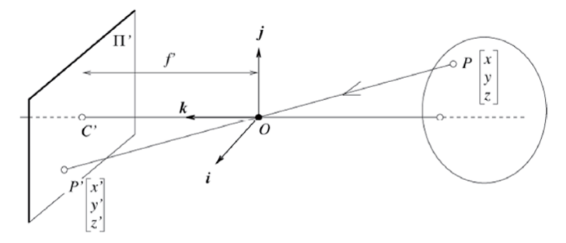
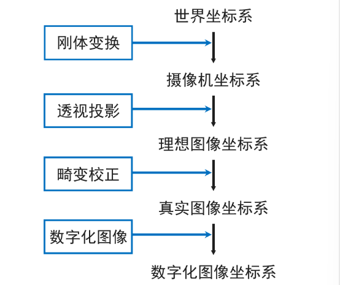

# Lec 相机标定与三维重建*

透视投影——小孔成像模型

- 将一个坐标系(O, i, j, k)附加到针孔相机模型上

  - 原点O与针孔重合

    > 针孔（光圈）不能尽可能小——更少的光通量，衍射效应
    >
    > 为了保持图像的锐化聚焦，同时又可以使得更多光线的进入，增加了**透镜装置**

  - 向量i, j组成的平面与图像平面π平行

  - 图像平面π位于沿k正方向上距离针孔f处

- 通过针孔又垂直π的线称为光轴

- 光轴穿过图像平面的点称为图像中心

  

## 投影模型*

- 线性摄像机成像模型

  > 这是忽略畸变的线性成像模型

  摄像机光学成像过程的四个步骤

  
  $$
  \begin{bmatrix}2D \text{ point} \\(3 \times 1)\end{bmatrix}=\begin{bmatrix}\text{Physical Image to} \\\text{Pixel Image coord.} \\\text{trans. matrix} \\(3 \times 3)\end{bmatrix}\begin{bmatrix}\text{Camera to} \\\text{Physical Image coord.} \\\text{trans. matrix} \\(3 \times 4)\end{bmatrix}\begin{bmatrix}\text{World to} \\\text{Camera coord.} \\\text{trans. matrix} \\(4 \times 4)\end{bmatrix}\begin{bmatrix}3D \text{ point} \\(4 \times 1)\end{bmatrix}
  $$

  $$
  z_c \begin{bmatrix} u \\ v \\ 1 \end{bmatrix} = \begin{bmatrix} f_u & -f_u \cot \theta & u_0 \\ f_v/\sin \theta & v_0 \\ 0 & 0 & 1 \end{bmatrix} \begin{bmatrix} f & 0 & 0 & 0 \\ 0 & f & 0 & 0 \\ 0 & 0 & 1 & 0 \end{bmatrix} \begin{bmatrix} R & t \\ 0_{3 \times 1} & 1 \end{bmatrix} \begin{bmatrix} x_w \\ y_w \\ z_w \\ 1 \end{bmatrix}
  $$

  $$
  K = \begin{bmatrix} \alpha & -\alpha \cot \theta & u_0 \\ 0 & \beta/\sin \theta & v_0 \\ 0 & 0 & 1 \end{bmatrix}, \quad M = K[R \quad T]
  $$

  其中K为内参矩阵，$[R \quad T]$为外参矩阵

- 相机畸变：

  - 径向畸变：沿着透镜半径方向分布的畸变

    产生原因：是由透镜质量引起的，光线在远离透镜中心的地方比靠近中心的地方更加弯曲。

    径向畸变主要包括桶形畸变和枕形畸变两种。

    

  - 切向畸变：切向畸变是由于透镜本身与相机传感器平面（像平面）或图像平面不平行而产生的。

    

## 数学补充

- 叉乘性质
  $$
  \vec{c} = \vec{a} \times \vec{b} = \begin{bmatrix}a_y b_z - a_z b_y \\a_z b_x - a_x b_z \\a_x b_y - a_y b_x\end{bmatrix} = \begin{bmatrix}0 & -a_z & a_y \\a_z & 0 & -a_x \\-a_y & a_x & 0\end{bmatrix} \begin{bmatrix}b_x \\b_y \\b_z\end{bmatrix}
  $$

  $$
  [\vec{a}_{\times}] \stackrel{def}{=} \begin{bmatrix}0 & -a_z & a_y \\a_z & 0 & -a_x \\-a_y & a_x & 0\end{bmatrix} \quad \Longrightarrow \quad \vec{c} = [\vec{a}_{\times}] \vec{b}
  $$

- 线性方程组的最小二乘解

  线性方程组$Ax = y$
  $$
  A = \begin{pmatrix}a_{11} & \cdots & a_{1q} \\\vdots & \vdots & \vdots \\a_{p1} & \cdots & a_{pq}\end{pmatrix}, \quad x = \begin{pmatrix}x_1 \\ \vdots\\x_q\end{pmatrix}, \quad y = \begin{pmatrix}y_1 \\ \vdots \\y_p\end{pmatrix}
  $$

  - 当矩阵 $A$ 列满秩时：$  p > q  $ 超定方程，方程个数多于未知量个数，无解。
    $$
    E(x) \stackrel{def}{=} \sum_{i=1}^{p} (a_{i1} x_1 + a_{i2} x_2 + \cdots + a_{iq} x_q - y_i)^2 = \| Ax - y \|^2
    $$

  - 线性方程组的最小二乘解$x^* = \arg \min_x \| Ax - y \|^2$
    1. 求解方法 1：$$x^* = (A^T A)^{-1} A^T y$$
    2. 求解方法 2：
       1. 矩阵 $  A  $ 进行奇异值分解 $  A = U D V^T  $（U 和 V 是正交矩阵）
       2. 令 $  \hat{y} = U^T y  $，计算 $  \mathbf{b}  $，其中 $  b_i = \hat{y}_i / d_i  $，$  d_i  $ 为对角矩阵 D 的第 i 个元素
       3. $  x^* = V \mathbf{b}  $
    3. 求解方法 3：利用牛顿法及其改进或梯度下降法迭代求解
  
- 齐次线性方程的最小二乘解

  $Ax = 0$，求解差不多

- 非线性方程组的最小二乘解

  只能迭代求解

## 相机标定*

- 什么是相机标定：求解相机内、外参数矩阵
  $$
  p = MP = K[R\quad T]P
  $$
  其中M为投影矩阵，K为内参矩阵，$[R\quad T]$外参矩阵

  内参数是相机固有的参数，外参数反映摄像机在物理世界坐标系中的位置和姿态参数

- 为什么重要：相机内外参数矩阵描述了三维世界到二维像素的映射关系

- 相机标定目标：从1张或多张图像中估算内、外参数矩阵

  相机投影矩阵$M$一共有11个未知量，因此最少需要6对点对应，实际中常用多于六对点来获得更加鲁棒的结果

- 相机标定方法

  - 透视模型的相机标定（直接线性变换）

    直接线性变换（Direct Linear Transformation，DLT）
    $$
    M = K [R \quad T] = \begin{bmatrix} m_1 & m_2 & m_3 \end{bmatrix}
    \\
    p_i = \begin{bmatrix} u_i \\ v_i \end{bmatrix} = \begin{bmatrix} \frac{m_1 P_i}{m_3 P_i} \\ \frac{m_2 P_i}{m_3 P_i} \end{bmatrix}
    $$

    $$
    u_i = \frac{m_1 P_i}{m_3 P_i} \quad \Longrightarrow \quad u_i (m_3 P_i) = m_1 P_i \quad \Longrightarrow \quad m_1 P_i - u_i (m_3 P_i) = 0
    $$

    $$
    v_i = \frac{m_2 P_i}{m_3 P_i} \quad \Longrightarrow \quad v_i (m_3 P_i) = m_2 P_i \quad \Longrightarrow \quad m_2 P_i - v_i (m_3 P_i) = 0
    $$

    $$
    \begin{cases}-u_1 (m_3 P_1) + m_1 P_1 = 0 \\-v_1 (m_3 P_1) + m_2 P_1 = 0 \\ \vdots \\-u_n (m_3 P_n) + m_1 P_n = 0 \\-v_n (m_3 P_n) + m_2 P_n = 0\end{cases}\quad \Rightarrow \quad P \bar{m} = 0
    $$

    - 方程数 $2n$ 个且 $n \geq 6$

    - 未知参数 $11$ 个，$P$已知，$\bar m$未知

    - 超定齐次线性方程组
      $$
      P = \begin{pmatrix}P_1^T & 0^T & -u_1 P_1^T \\0^T & P_1^T & -v_1P_1^T \\\vdots & \vdots \\P_n^T & 0 & -u_n P_n^T \\0^T & P_n^T & -v_nP_n^T\end{pmatrix}, \quad \bar{m} = \begin{pmatrix} m_1^T \\ m_2^T \\ m_3^T \end{pmatrix}
      $$

      > m为方程组的解，$\forall \rho \ne 0$，$\rho m$也是方程的解，因此将其模长定义为1

      最小二乘解：
      $$
      \min_{m} \| P \bar{m} \| \\\text{s.t. } \| \bar{m} \| = 1
      $$
      OK现在我们已经求解得到$M = [A\quad b]$了，那么如何从M求取对应的内/外参。这里不给出推导，直接给出结论：
      $$
      \rho [A \quad b] = K [R \quad T] \\
      A = \begin{bmatrix} a_1^T \\ a_2^T \\ a_3^T \end{bmatrix}, \quad b = \begin{bmatrix} b_1 \\ b_2 \\ b_3 \end{bmatrix} \\
      K = \begin{bmatrix} \alpha & -a \cos \theta & u_0 \\ 0 & \sin \theta & v_0 \\ 0 & 0 & 1 \end{bmatrix}, \quad R = \begin{bmatrix} r_1^T \\ r_2^T \\ r_3^T \end{bmatrix}, \quad T = \begin{bmatrix} t_x \\ t_y \\ t_z \end{bmatrix}
      $$
      内参数：

      $$\rho = \frac{\pm 1}{|a_3|}, \quad u_0 = \rho^2 (a_1 \cdot a_3)$$

      $$v_0 = \rho^2 (a_2 \cdot a_3)$$

      $$\cos \theta = -\frac{(a_1 \times a_3) \cdot (a_2 \times a_3)}{|a_1 \times a_3| \cdot |a_2 \times a_3|}$$

      $$\alpha = \rho^2 |a_1 \times a_3| \sin \theta$$

      $$\beta = \rho^2 |a_2 \times a_3| \sin \theta$$

      外参数：

      $$r_1 = \frac{(a_2 \times a_3)}{|a_2 \times a_3|}$$

      $$r_3 = \frac{\pm a_3}{|a_3|}$$

      $$r_2 = r_3 \times r_1$$

      $$T = \rho K^{-1} b$$

    > Tips: 单独平面不能进行标定，$P_i$**不能**位于同一平面

  - 径向畸变的相机标定

    径向畸变：图像像素点以畸变为中心，沿着径向产生的位置偏差，从而导致图像中所成的像发生形变

    

    图像放大率随距光轴距离的增加而减小，现在对畸变进行建模：
    $$
    Q = \begin{bmatrix} \frac{1}{\lambda} & 0 & 0 \\ 0 & \frac{1}{\lambda} & 0 \\ 0 & 0 & 1 \end{bmatrix} M \quad \Longrightarrow \quad \begin{bmatrix} u_i \\ v_i \end{bmatrix} = p_i , \quad Q = \begin{bmatrix} q_1 \\ q_2 \\ q_3 \end{bmatrix}
    $$
    多项式函数$\lambda = 1 \pm \sum_{p=1}^{k} k_p d^{2p}$，建模径向特性$$d^2 = u^2 + v^2$$，有：
    $$
    \lambda = 1 \pm (k_1 d^2 + k_2 d^4 + k_3 d^6)
    $$
    得到非线性方程：
    $$
    p_i = \begin{bmatrix} u_i \\ v_i \end{bmatrix} = \begin{bmatrix} \frac{q_1 P_i}{q_3 P_i} \\ \frac{q_2 P_i}{q_3 P_i} \end{bmatrix} \quad \Longrightarrow \quad \begin{cases} u_i q_3 P_i = q_1 P_i \\ v_i q_3 P_i = q_2 P_i \end{cases}
    $$
    标定的一般问题
    $$
    \begin{cases}u_i q_3 P_i = q_1 P_i \\v_i q_3 P_i = q_2 P_i\end{cases} \quad \Longrightarrow \quad \begin{cases} u_i q_3 P_i - q_1 P_i = 0 \\ v_i q_3 P_i - q_2 P_i = 0 \end{cases} \quad \Longrightarrow \quad \begin{cases} f_1(k_1, k_2, k_3, m_1, m_2, m_3) = 0 \\ f_2(k_1, k_2, k_3, m_1, m_2, m_3) = 0 \\ f_{2n}(k_1, k_2, k_3, m_1, m_2, m_3) = 0 \end{cases}
    $$
    给定 $  n  $ 对点对应，最终问题：

    $$
    \begin{cases}f_1(k_1, k_2, k_3, m_1, m_2, m_3) = 0 \\f_2(k_1, k_2, k_3, m_1, m_2, m_3) = 0 \\ \vdots \\f_{2n}(k_1, k_2, k_3, m_1, m_2, m_3) = 0\end{cases}
    $$
    最小二乘解：

    令 $  x^T = (k_1, k_2, k_3, m_1, m_2, m_3)  $，$$x^* = \arg \min_x \| f(x) \|^2$$

    - 采用牛顿法与列文伯格-马夸尔特法（L-M方法）
    - 求解系统的线性部分以找到近似解，使用该解作为整个系统的初始条件

  - 张正友（棋盘格）相机标定

    - 介绍：一种利用平面棋盘格进行相机标定的实用方法

      介于摄影标定法和自标定法之间，既克服了摄影标定法需要的高精度三维标定物的缺点，又解决了自标定法鲁棒性差的难题

    - 数学原理

      对于平面标定装置，存在世界坐标系，使得其上的所有点都满足$Z = 0$

      > 世界坐标系的原点位于棋盘格角点，棋盘格平面为坐标系的X-Y平面

      在齐次归一化坐标系中用下式描述图像点：
      $$
      \begin{bmatrix} u \\ v \\ 1 \end{bmatrix} = K[R \quad t] \begin{bmatrix} X \\ Y \\ 0 \\ 1 \end{bmatrix} = K[r_1 \quad r_2 \quad r_3 \quad t] \begin{bmatrix} X \\ Y \\ 0 \\ 1 \end{bmatrix} = K[r_1 \quad r_2 \quad t] \begin{bmatrix} X \\ Y \\ 1 \end{bmatrix}
      $$

      - 矢量 $r_i$ 表示旋转矩阵 $R$ 的第 $i$ 列向量，$K$ 为相机的内参矩阵
      - $Z = 0$ 的标定板上的空间点归一化齐次坐标：$M = \begin{bmatrix} X & Y & 1 \end{bmatrix}^T$

      在没有镜头畸变情况下，可通过应用单应矩阵$H =\lambda K[r_1 \quad r_2 \quad t],\lambda$为系数因子，从相应的场景点𝑴获得图像点𝑚。对一副图像，通过$\ge 4$组对应点，即可估计单应矩阵H

      > 单应矩阵$H_{3\times 3}$有8个自由度

      求解 $  H  $ 之后：
      $$
      H = [h_1 \quad h_2 \quad h_3] = \lambda K [r_1 \quad r_2 \quad t] 
      \\
        r_1 = \frac{1}{\lambda} K^{-1} h_1, \quad r_2 = \frac{1}{\lambda} K^{-1} h_2
      $$

        - $ \lambda $: 系数因子
      - $  r_1  $ 和 $  r_2  $ 满足正交性，存在：$$  r_1^T \cdot r_2 = 0, \quad r_1^T \cdot r_1 = r_2^T \cdot r_2 = 1  $$

      一副棋盘格图像（即对应一个 $  H  $ 矩阵），可以构造两个关于 $  K  $ 的方程
      $$
      h_1^T K^{-T} K^{-1} h_2 = 0   \\
        h_1^T K^{-T} K^{-1} h_1 = h_2^T K^{-T} K^{-1} h_2
      $$
      将这两个方程写成齐次方程组的形式：$\begin{bmatrix} v_{12}^T \\ (v_{11}-v_{22})^T \end{bmatrix} b =0 $

      > 这里$v_{ij}$的定义见下

      - 定义对称矩阵 $  B  $：$  B = K^{-T} K^{-1}  $
      - 使用6维向量 $  \mathbf{b}  $：$  \mathbf{b} = [B_{11} \, B_{12} \, B_{22} \, B_{13} \, B_{23} \, B_{33}]^T  $
      - 单应矩阵 $  H  $ 的列向量表示为：$  h_i = [h_{i1} \, h_{i2} \, h_{i3}]^T  $

      $$
      h_i^T B h_j = v_{ij}^T \mathbf{b} = 0   \\
        v_{ij} = [h_{i1} h_{j1}, h_{i1} h_{j2} + h_{i2} h_{j1}, h_{i2} h_{j2}, h_{i1} h_{j3} + h_{i3} h_{j1}, h_{i2} h_{j3} + h_{i3} h_{j2}, h_{i3} h_{j3}]^T
      $$

      一副图像可以建立2个等式，$n$ 幅标定板图像产生 $  2n  $ 个等式 $  V \mathbf{b} = 0  $（$  V  $ 为 $  2n \times 6  $ 的系数矩阵）

      理想情况下，3幅图像能够求出内参矩阵
      $$
      Vb = 0
      $$
      求解方式：参考直接线性变换，最小二乘解法求解得到b

      > 图像成像中，一个有物理意义项：重投影误差（reprojection error），梯度下降法迭代更新相机内外参用张正友标定法的参数作为初始值

      求出b后我们可以写出对称矩阵$B$，又因为$B = K^{-T} K^{-1}$，则可计算出内参矩阵$K$中各个元素值（Cholesky decomposition将一个对称正定矩阵 A分解为一个下三角矩阵$K^{-T}$和其转置矩阵$K^{-1}$的乘积）

      这样我们就得到内参了，然后进行外参计算：
      $$
        H = [h_1 \quad h_2 \quad h_3] = \lambda K [r_1 \quad r_2 \quad t]  
      $$

      $$
      \begin{cases}
      r_1 = \lambda K^{-1} h_1   \\
      r_2 = \lambda K^{-1} h_2   \\
      r_3 = r_1 \times r_2   \\
      t = \lambda K^{-1} h_3  
      \end{cases}
      $$

      > Tips：针对每一个棋盘格（单应矩阵），有不同外参

    - 算法步骤

      1. 打印一张模板并贴在一个平面上
      2. 从不同角度拍摄若干张模板图像
      3. 检测出图像中的特征点
      4. 求出摄像机的内参数和外参数
      5. 求出畸变系数 (非线性) 
      6. 优化求精（重投影误差）

    - 优点：采用单个平面，即可标定，简单

    - 缺点：依旧需要确定模板上的点阵坐标与图像点之间的匹配关系

- 相机自标定

  摄像机自标定是指不需要标定块，仅仅通过图像点之间的对应关系对摄像机进行标定的过程

  - 优点：灵活，方便
  - 缺点：精度不太高，鲁棒性不足

## 三维重建*

### 三维重建基础

- 三维重建的一般性描述：给定同一物体或场景的多幅图像，计算其三维形状的表达

- 三维形状表达：深度图(Depth Maps) // 网格模型(Meshes) // 点云(Point Clouds)，补丁云(Patch Clouds) // 体积模型(Volumetric Models) // 层次模型(Layered Models)

- 基于单视图的重建：多义性

- 两视几何与三角测量

  三角化：两条射线相交重建该点

  

  三角测量问题：已知$p,p',K.K',R,T$求解$p$的三维坐标(这里相对于$O_1$)

  > 虽然在实际中由于噪声的存在，两条直线通常不相交、

  - 线性解法

    - 寻找 $  P  $ 满足：
      $$
      \left\{
      \begin{aligned}
      p &= MP = K[I \quad 0]P \\
      p' &= M'P = K'[R \quad T]P
      \end{aligned}
      \right.
      $$

    - 解方程：
      $$
      \left\{
      \begin{align*}
      u &= \frac{m_1}{m_3} P \\v &= \frac{m_2}{m_3} P \\u' &= \frac{m_1'}{m_3'} P \\v' &= \frac{m_2'}{m_3'} P
      \end{align*}
      \right.
      $$

    - 方程组：
      $$
      \begin{align*}m_1 P - u (m_3 P) &= 0 \\m_2 P - v (m_3 P) &= 0 \\m_1' P - u' (m_3' P) &= 0 \\m_2' P - v' (m_3' P) &= 0\end{align*}
      $$

    - 矩阵形式：
      $$
      AP = 0
      $$
      其中：
      $$
      A = \begin{bmatrix}u m_3 - m_1 \\v m_3 - m_2 \\u' m_3' - m_1' \\v' m_3' - m_2'\end{bmatrix}
      $$
      方程数：4个，未知数：3个

      最小二乘求解超定齐次线性方程组

  - 非线性解法：寻找$P$最小化$d(p,MP)+d(p',M'P)$

    牛顿orL-M法

### 外极几何

外极几何、本质矩阵、基础矩阵

是什么：外极几何用于描述两个相机在不同视角拍摄同一场景时的几何关系

- 相机中心：两个相机光心 *O*1 和 *O*2。

- 空间点：三维场景点 *P*(以左相机位世界坐标系，$P'$为目标点在右相机坐标系下的坐标)

- 像平面：点 *P* 在左右相机像平面上的投影点 *p*1 和 *p*2。

- 极平面（Epipolar Plane）：由 *O*1,*O*2,*P* 三点定义的平面。

- 基线（Baseline）：连接 *O*1 和 *O*2 的直线。

- 极点（Epipole）：基线在像平面上的投影点（记为 *e*1,*e*2）。

- 极线（Epipolar Line）：极平面与像平面的交线（*p*1 在右像面对应极线 *l*2，反之亦然）

- **外极线约束**：将点对应问题约简为在外极线上的一维搜索问题

  对于左像面的点$p_1$，其在右像面的对应点$p_2$必然位于$p_1$对应的极线 $l_2$上

  

- 外极几何的数学表达：基础矩阵

  本质矩阵$E = [t]_{\times} R$，自由度为5，有$P' E P = 0$

  基础矩阵$F = K'^{-T} E K^{-1}$，自由度为7，有$p_2^T F p_1 =0$

  基础矩阵刻画了两幅图像的极几何关系，即相同场景在不同视图中的对应关系

  基础矩阵F包含**摄像机内参数信息**

  - 基础矩阵的估计方法

    - 8点法（归一化的8点法）

      对于每一对点有
      $$
      m'^T F m = 0
      $$

      $$
      \begin{bmatrix}u' \\v' \\1\end{bmatrix}^T\begin{bmatrix}f_{11} & f_{12} & f_{13} \\f_{21} & f_{22} & f_{23} \\f_{31} & f_{32} & f_{33}\end{bmatrix}\begin{bmatrix}u \\v \\1\end{bmatrix} = 0
      $$

      $$
      u'u f_{11} + u'v f_{12} + u' f_{13} + v'u f_{21} + v'v f_{22} + v' f_{23} + u f_{31} + v f_{32} + f_{33} = 0
      $$

      $$
      \begin{bmatrix}u'u & u'v & u' & v'u & v'v & v' & u & v & 1\end{bmatrix}\begin{bmatrix}f_{11} \\f_{12} \\f_{13} \\f_{21} \\f_{22} \\f_{23} \\f_{31} \\f_{32} \\f_{33}\end{bmatrix} = 0
      $$

      扩展到n个点
      $$
      \begin{bmatrix}u'_1 u_1 & v'_1 v_1 & u'_1 & v'_1 u_1 & v'_1 & u_1 & v_1 & 1 \\\vdots & \vdots & \vdots & \vdots & \vdots & \vdots & \vdots & \vdots \\u'_n u_n & v'_n v_n & u'_n & v'_n u_n & v'_n & u_n & v_n & 1\end{bmatrix}\begin{bmatrix}f_1 \\f_2 \\f_3 \\f_4 \\f_5 \\f_6 \\f_7 \\f_8\end{bmatrix} = 0
      $$

      $$
      A f = 0
      $$

      从而当 $  n \geq 8  $ 时，可以线性求解 $  f  $
      $$
      \begin{cases}\min \| A f \| \\\text{subject to } \| f \| = 1\end{cases}
      $$
      对 $  A  $ 进行奇异值分解 $  A = U D V^T  $，$  V  $ 的最后一列向量 $  v_9  $（即最小奇异值对应的右奇异向量）可构造基础矩阵 $  F  $

      > **Q**: $  F  $ 是不是我们想要的基础矩阵？
      >
      > **A**: 不是，基础矩阵是秩为2的 $  3 \times 3  $ 的矩阵且自由度为7。上述方程求解的 $  F  $ 通常秩为3，即 $  F  $ 满秩。

      再对 $  F  $ 进行奇异值分解（$  F  $ 秩为2，矩阵奇异性约束性质 $  -\min \| F - \bar{F} \|  $）

      $$F = U \text{diag}(s_1, s_2, s_3) V^T, (s_1 \geq s_2 \geq s_3)$$得基础矩阵的估计 $\bar{F} = U \text{diag}(s_1, s_2, 0) V^T$

      但这样不一定能得到较好的最小二乘解因为矩阵各个列之间的量纲有差别，于是我们提出归一化8点算法

      1. 对两幅图像的对应点集分别做归一化变换 $  H  $ 和 $  H'  $，得到新的对应点集

         > 位移归一化变换：使得图像的原点位于图像点集的质心
         >
         > 缩放归一化变换：使得图像点分布在以质心为圆心，半径为$\sqrt{2}$的圆内
         >
         > 将各点到所有点的平均距离变为$\sqrt{2}$

      2. 对新的对应点集，使用8点算法估计基础矩阵 $  \tilde{F}  $

      3. 原图像的基础矩阵 $  F = H'^T \tilde{F} H  $ 去归一化

    - RANSAC估计：剔除离群点

      1. 从两幅图像的对应点集中随机选取样本集（如8对点集构成）

      2. 利用样本集中的点对应计算基础矩阵 $  F  $

         > 确定极几何约束

      3. 在对应点集合中确定内点对集，统计其个数

         > 内点对：对应点到外极线的距离小于某一阈值

      4. 如果内点对集的个数小于某一数量，则迭代——回到1

      5. 由内点对集估计基础矩阵 $  F  $

### 双目立体视觉

- 平行视图的三角测量

  已知条件：$  K = K'  $，$  R = I  $（单位矩阵），$  T = \begin{bmatrix} T \\ 0 \\ 0 \end{bmatrix}  $，$  e' = \begin{bmatrix} 1 \\ 0 \\ 0 \end{bmatrix}  $

  - 本质矩阵 $  E  $：$$E = \begin{bmatrix}0 & 0 & -T \\0 & 0 & 0 \\T & 0 & 0\end{bmatrix}$$

  - 基础矩阵 $  F  $：$$F = \begin{bmatrix}0 & 0 & -1 \\0 & 0 & 0 \\1 & 0 & 0\end{bmatrix}$$

  关系：$  p'^T F p = 0  $，求解：

  - $  p  $ 和 $  p'  $ 的纵坐标一样，即 $  p_v = p'_v  $
  - $  p'  $ 点沿着扫描线寻找即可！

  
  $$
  \frac{B + p_u' - p_u}{Z - f} = \frac{B}{Z}
  $$

  $$
  Z = \frac{B \cdot f}{p_u - p_u'},p_u - p_u'为视差
  $$

  深度𝒁与视差成反比！

  > 视差图应用 – 3D电影

  - 深度精度(深度分辨率)与基线的关系
    - 深度误差 ∝ 1/基线长度
    - 更长基线的优点：更好的深度估计
    - 缺点：共同视野较小，由于遮挡，匹配更加困难

  - 深度精度(深度分辨率)与深度的关系
    - 视差(> 0) ∝ 1/深度
    - 点越近，深度估计越好

  - 短基线：共同视野大，深度误差大
  - 长基线：共同视野小，深度误差小，遮挡问题更多

- 如何获得平行视图：

  图像校正：令两图像“平行”

  1. 在两幅图像 $  I  $ 和 $  I'  $ 找到一组匹配点 $  p_i \leftrightarrow p'_i  $，不少于8个
  2. 计算基础矩阵 $  F  $，求解两幅图像中的极点 $  e  $ 和 $  e'  $
  3. 选择透视变换 $  H'  $，将 $  e'  $ 映射到无穷远点 $  (f, 0, 0)  $，$  H' = T^{-1} G R T  $
  4. 需按照对应的透视变换矩阵 $  H  $，使得下式最小$ \sum_i d(H p_i, H' p'_i) $
  5. 分别用矩阵 $  H  $ 和 $  H'  $，对左右两幅图像 $  I  $ 和 $  I'  $ 进行重采样

- 平行视图的对应点匹配：对应点搜索

  图像校正后，$p$的对应点$p'$沿着扫描线寻找

  对应点问题——相关法，以下是算法步骤

  

  1. $  p = (p_u, p_v)  $ 处选择一个窗口 $  W  $，建立向量 $  w  $
  2. 在右图中沿扫描线在每个位置 $  s'_u  $ 建立窗口 $  W'  $，并获得 $  w'  $ 向量
  3. 计算每个 $  s'_u  $ 位置 $  w^T w'  $ 的值
  4. $  p'_u = \arg \max_{s'_u} w^T w'  $

  但这样计算会因为亮度/曝光的变化导致像素的灰度值发生剧烈变化，于是将上述$  w^T w'  $修改为进行匹配度的计算：
  $$
  \frac{(w - \bar{w})^T (w' - \bar{w}')}{\| w - \bar{w} \| \cdot \| w' - \bar{w}' \|}
  $$
  其中：

  - $\bar{w} $ 是窗口 $  W  $ 内的灰度均值
  - $\bar{w}' $ 是窗口 $  W'  $ 内的灰度均值

  相关法存在的问题：

  

  为了减少透视缩短和遮挡的影响，希望有更小的𝑩/ 𝒛（基线深度比）比值，但是，当𝑩/ 𝒛小时，测量值的小误差意味着估算误差的大误差

  其它约束：唯一性约束，顺序/单调性约束，平滑性约束（视差函数通常是平滑的（除了遮挡边界））

### 多视图几何

多视图几何（运动恢复结构SfM——Structure from Motion）

- 运动恢复结构

  定义：通过三维场景的多张图像，恢复出该场景的三维结构信息以及每张图片对应的相机参数

  问题描述：已知：$  n  $ 个 3D 点 $  X_j  $ 在 $  m  $ 张图像中的对应点的像素坐标 $  x_{ij} (i = 1, \cdots, m; j = 1, \cdots, n)  $且 $  x_{ij} = M_i X_j  $，$  i = 1, \cdots, m; j = 1, \cdots, n  $，其中，$  M_i  $ 为第 $  i  $ 张图片对应的摄像机的投影矩阵

  求解：

  - $  m  $ 个摄像机投影矩阵 $  M_i (i = 1, \cdots, m)  $

    > 运动（Motion）

  - $  n  $ 个三维点 $  X_j (j = 1, \cdots, n)  $ 的坐标

    > 结构（Structure）

  因此，该类问题也称为“运动恢复结构问题”

- 三种典型的运动恢复结构任务

  - 欧式结构恢复（相机内参数已知，外参数未知）

    欧式结构恢复问题，已知：

    - $  n  $ 个三维点 $  X_j (j = 1, \cdots, n)  $ 在 $  m  $ 张图像中的对应点的像素坐标 $  x_{ij}  $

    - $  m  $ 张图像对应的摄像机的内参数矩阵 $  K_i (i = 1, \cdots, m)  $

    - 且 $  x_{ij} = M_i X_j = K_i [R_i \quad T_i] X_j  $，$  i = 1, \cdots, m; j = 1, \cdots, n  $

      其中，$  M_i, K_i, [R_i \quad T_i]  $ 为第 $  i  $ 张图片对应的摄像机的投影矩阵、内参数及外参数矩阵

    求解：

    - $  n  $ 个三维点 $  X_j (j = 1, \cdots, n)  $ 的坐标
    - $  m  $ 个摄像机的外参数 $  R_i  $ 及 $  T_i  $，$  (i = 1, \cdots, m)  $

    求解步骤：

    1. 求解基础矩阵 F（归一化八点法）

    2. 求解本质矩阵 $E = K_2^T F K_1$

    3. 分解本质矩阵 $E → R, T$

       - 数学原理：

         $E = [T_{\times}] R$，找到一个策略把𝐸因式分解为两个组成部分
         $$
         [T_{\times}] = kUZU^T\stackrel{不考虑符号、尺度}{\longrightarrow}[T_{\times}] = UZU^T\\
         [T_{\times}] = Udiag(1,1,0)WU^T ~~ or ~~ Udiag(1,1,0)W^TU^T
         $$
         取其中一种情况，有
         $$
         E = Udiag(1,1,0)(WU^TR)
         $$
         同时对E进行SVD分解有：$E = Udiag(1,1,0)V^T$

         因此$R = UWV^T  ~~ or ~~ UW^TV^T$

         这里只保证了矩阵$UWV^T$是正交的，还需其行列式保持为1，因此
         $$
         R = (\det UWV^T)UWV^T,T = u_3
         $$
         选择一个点三角化，正确的一组解能保证该点在两个摄像机的𝒛坐标均为正。对多个点进行三角化，选择在两个摄像机下的𝒛坐标均为正的个数最多的那组 𝑹, 𝑻。（更鲁棒）

       - 综上总结分解本质矩阵过程如下：

         1. SVD分解 $  E = U \text{diag}(1, 1, 0) V^T  $
            $$
            W = \begin{bmatrix}0 & -1 & 0 \\1 & 0 & 0 \\0 & 0 & 1\end{bmatrix}
            $$

         2. $$
            R = (\text{det} U W V^T) U W V^T \quad \text{or} \quad (\text{det} U W V^T) U W^T V^T \\
            T = \pm u_3
            $$

         3. $$
            \begin{cases}R = (\text{det} U W V^T) U W V^T, & T = u_3 \\R = (\text{det} U W V^T) U W V^T, & T = -u_3 \\R = (\text{det} U W V^T) U W^T V^T, & T = u_3 \\R = (\text{det} U W V^T) U W^T V^T, & T = -u_3\end{cases}
            $$

         4. 通过重建单个或多个点找出正确组合

    4. 三角化

       线性法：
       $$
       \begin{cases}x_{1j} = M_1 X_j = K_1 [I \quad 0] X_j \\x_{2j} = M_2 X_j = K_2 [R \quad T] X_j\end{cases}
       $$
       非线性法：
       $$
       P_j^* = \arg \min_P \left( d(p_{1j}, M_1 X_j) + d(p_{2j}, M_2 X_j) \right)
       $$

    欧式结构恢复歧义

    - 歧义：恢复的结构与真实场景之间相差一个相似变换

      不能通过单图估计场景的绝对尺度，需要其它先验信息

    - 度量重构：恢复的场景与真实场景之间仅存在相似变换的重构

  - 仿射结构恢复（相机为仿射相机，内、外参数均未知）

  - 透视结构恢复（相机机为透视相机，内、外参数均未知）

    透视结构恢复歧义：歧义由任意可逆𝟒 × 𝟒变换表示，即
    $$
    x_{ij} = M_iX_j = (M_iH^{-1})(HX_j) = M^*X^*
    $$
    在相差一个𝟒 × 𝟒的可逆变换的情况下恢复摄像机运动与场景结构分为代数方法（通过基础矩阵）和BA(Bundle Adjustment)

    - 代数方法（2视图情况）

      1. 求解基础矩阵 F（归一化八点法）

      2. 基于F估计摄像机矩阵 $F → M_1, M_2$

         使用X表达3D点，将$x,x'$分别作为相机1，2对应的观测值根据歧义性我们总可以找到可逆矩阵H，使得
         $$
         \begin{cases}M_1^* = M_1 H^{-1} = [I \quad \mathbf{0}] \\M_2^* = M_2 H^{-1} = [A \quad \mathbf{b}] \\X^* = HX\end{cases}
         $$

         $$
         \begin{align*}x &= M_1 X = (M_1 H^{-1}) (HX) = [I \quad \mathbf{0}] X^* \\x' &= M_2 X = (M_2 H^{-1}) (HX) = [A \quad \mathbf{b}] X^*\end{align*}
         $$

         经推导有：
         $$
         x'^T \cdot(b\times Ax) = 0\to x'^T [b_{\times}] Ax=0
         $$
         于是基础矩阵$F = [b_{\times}] A,\quad x'^TFx = 0$，在这基础上，我们利用F估计摄像机矩阵

         1. 计算 $  \mathbf{b}  $

            考虑乘积 $  F^T \mathbf{b}  $：
            $$
              F^T \cdot \mathbf{b} = ([\mathbf{b}_{\times}] A)^T \cdot \mathbf{b} = A^T [\mathbf{b}_{\times}]^T \cdot \mathbf{b} = -A^T [\mathbf{b}_{\times}] \cdot \mathbf{b} = 0  
            $$
            于是$  \mathbf{b}  $ 为 $  F^T  $ 矩阵最小奇异值的右奇异向量，且 $  \| \mathbf{b} \| = 1  $

            > b是一个极点

         2. 计算 $  A  $

            定义：$  A' = -[\mathbf{b}_{\times}] F  $

            验证 $  [\mathbf{b}_{\times}] A'  $ 等于 $  F  $：
            $$
              [\mathbf{b}_{\times}] A' = -[\mathbf{b}_{\times}] [\mathbf{b}_{\times}] F = -(\mathbf{b} \mathbf{b}^T - |\mathbf{b}|^2 I) F = -\mathbf{b} \mathbf{b}^T F + |\mathbf{b}|^2 F = 0 + 1 \cdot F = F  
            $$
            因此，$  A = A' = -[\mathbf{b}_{\times}] F  $

         3. 摄像机矩阵：
            $$
            M_1^* = [I \quad \mathbf{0}] \quad M_2^* = [-[\mathbf{b}_{\times}] F \quad \mathbf{b}]
            $$

         

      3. 三角化

         重建有歧义

    - BA

      一个非线性最小化问题
      $$
      E(M, X) = \sum_{i=1}^{m} \sum_{j=1}^{n} D \left( x_{ij}, M_i X_j \right)^2
      $$
      优势：

      - 同时处理大量视图
      - 处理丢失的数据

      局限性

      - 大量参数的最小化问题
      - 需要良好的初始条件

      实际操作

      - 常用作SfM的最后一步，分解或代数方法可作为优化问题的初始解

    

- 图像匹配

  - 局部匹配方法

    - Block matching (块匹配，区域匹配 – 相关性、SAD, SSD, Census Transform)
    - Feature matching特征点匹配
    - Gradient-based optimization（基于梯度的优化）

  - 全局匹配方法**

    - Dynamic programming (动态规划)*

      动态规划基于一个约束：顺序约束（图1中a在b左则图2也是）

      

      然后进行对应点搜索，这时有三种情况：顺序匹配，左侧被遮挡，右侧被遮挡

      使用DP进行立体匹配，动态规划产生了通过网格的最优路径，这是满足顺序约束的最佳匹配集合

      

      > 2维不能应用这个技巧

    - Intrinsic curves（本征曲线） 

    - GC(Graph Cuts)(图分割)*

    - Nonlinear diffusion（非线性扩散）

    - Belief propagation(置信度传播)*

      MRF(Markov Random Field，马尔可夫随机场)立体模型
      
      通过迭代消息传递在概率图模型（如马尔可夫随机场）中进行全局推理，优化特征匹配的全局一致性，常用于立体匹配和光流估计
    
    | 立体匹配算法名称             | 算法特性                                                           |
    | ---------------------------- | ------------------------------------------------------------------ |
    | 基于动态规划的立体匹配算法   | 时间复杂度比较低，匹配精度不高，容易出现条纹现象                   |
    | 基于图割法的立体匹配算法     | 能解决动态规划出现的条纹现象，边缘匹配处理比较好，时间复杂度比较高 |
    | 基于置信度传播的立体匹配算法 | 收敛性比较差，时间复杂度比较高，对于低纹理问题处理的比较好         |
    | 基于区域的立体匹配算法       | 时间复杂度比较低，算法受环境影响比较大，弱纹理问题不能有效解决     |
    | 基于特征的立体匹配算法       | 时间复杂度比较低，对于几何特征明显的图像匹配效果比较好             |

- 非对应方法的立体视觉重建

  - 基于体积的立体视觉(Volumetric Stereo)

