# Main Takeaway

嵌入式+传感+一点计网

<!--more-->

将所学相关课程内容串起来，能设计出满足需求的计算机控制系统

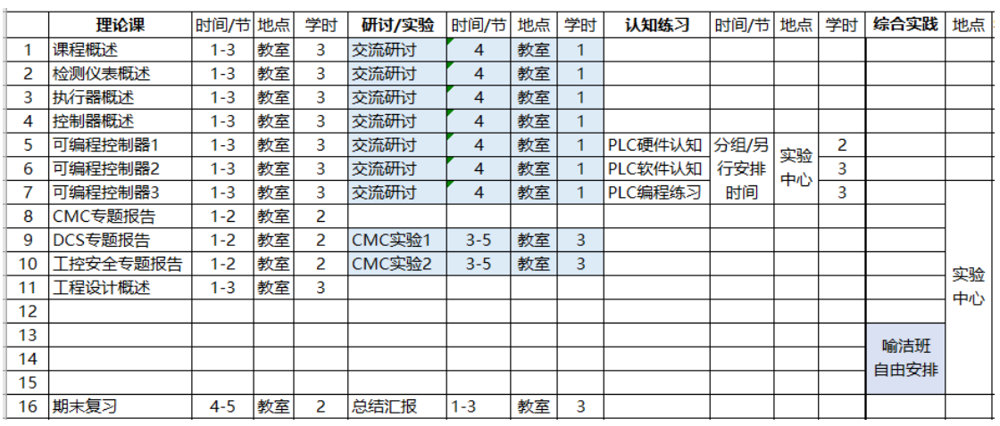

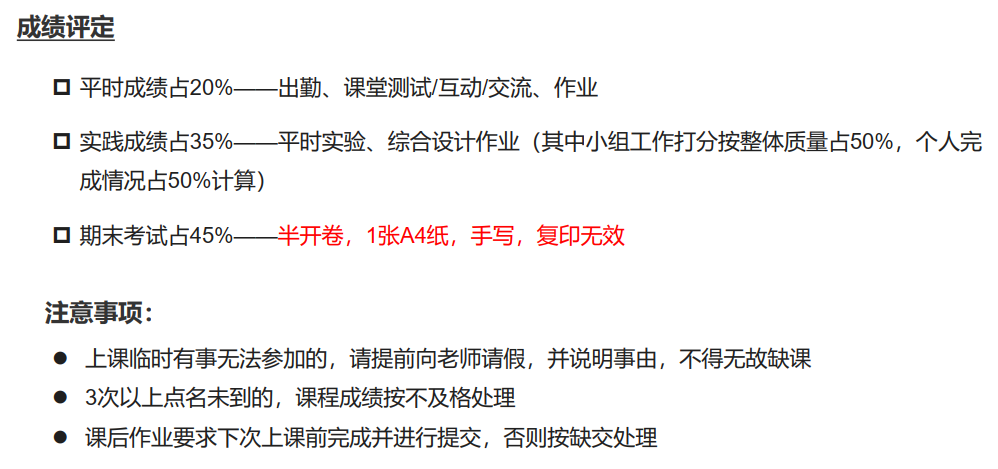

# CH1 计算机控制系统概述

## 计算机控制系统基本概念

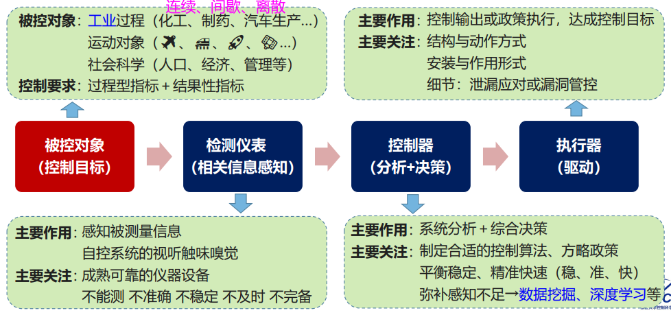

控制系统基本要求：

- 稳、准、快、优

控制系统基本形式：

- 开环、闭环
- 开、闭环控制系统的准确性、稳定性有何不同？

系统四类基本环节：

- 对象、检测仪表、控制器、执行器

- 计算机控制系统(Computer Control System， 简称CCS)

  计算机+控制=系统

- 系统集成（SI， System Integration）

计算机控制系统基本组成

- 硬件组成：主机系统+外部设备+I/O接口+现场仪表

  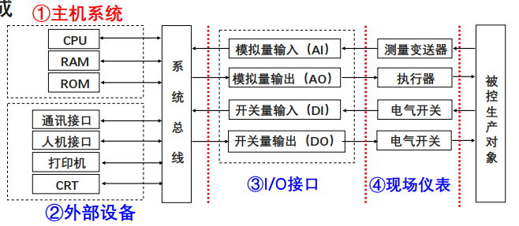

- 软件系统：系统软件+支持软件+应用软件

## 计算机控制系统的设计思想

每一种计算机控制技术的基本特征是什么？

- 功能、安全、成本

  - 可靠性：指在规定的条件下、在规定的时间內系统完成规定的功能的能力

    平均无故障时间MTBF（ Mean Time Between Failure ），可采取的措施：

    采用安全可靠的屏蔽、隔离、接地等抗干扰技术/提高软件可靠性

  - 可维护性：指故障发生后通过维修使系统恢复的能力。本质： 易于查找故障，易于排除故障。平均故障修复时间MTTR (mean time to repair )  提高控制系统可维护性的主要措施：

    - 选择系列化、标准化、通用化、一致性好的硬件设备
    - 设计合理的系统结构
    - 系统最好能带电插拔维修
    - 能够自诊断

  - 实时性：从硬件和软件两方面来考虑，系统又足够快的响应速度

  - 性能价格比：性价比，系统或部件进行选型时，需要综合权衡性能和价格两方面来考虑

- 计算机控制系统中的“计算机”与普通计算机相比的“同”与“不同”？

  | 普通计算机         | 计算机控制系统               |
  | ------------------ | ---------------------------- |
  | 不用了一般会关机   | 不间断运行，24*365天         |
  | 可能会死机、有蓝屏 | （绝对）不能宕机、掉线、停机 |
  | 坏了部件，整机要修 | 就算有零部件坏了也不能停机   |
  | 系统反应时快时慢   | 系统响应要快，不能有卡顿     |
  | 网络通讯时快时慢   | 通讯及时，不能有延迟         |

## 计算机控制系统的发展历史

计算机控制发展过程：（出现之前是常规仪表控制系统）

- 直接数字量控制DDC(Direct Digital Control)

  本质: 用一台计算机取代一组模拟调节器，构成闭环控制回路，用数字控制技术简单地取代模拟控制技术

  计算灵活，精度高，可分时处理多个控制回路， DDC也很快发展到PID以外的多种复杂控制

  价格贵（当时），功能固化且有限，可靠性低

- 集中型控制系统，控制/危险/信息集中

  用一台计算机来控制尽可能多的回路，回路成本大大降低，信息集中（便于实现复杂控制、优化控制功能）

  由于当时计算机总体性能低，**容易出现负荷过载**，控制集中直接导致**危险集中**，高度集中使系统变得十分“脆弱”

  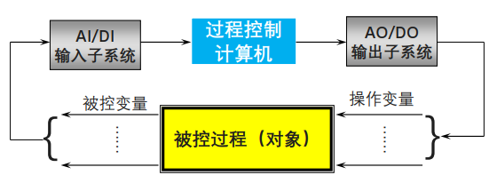

- 集散控制系统DCS，控制/危险分散，信息集中

  控制功能分散到若干个控制站实现，集中测控信息，满足整体管控目标

  **特点：半数字、半分散**

- 分布式IO DCS(Distributed Control System)，模拟信号到IO站点站站间现场总线连接

- 现场总线控制系统FCS，全数字通信全分散控制

  是以现场总线为基础的全数字化的集散控制系统

  **特点：全数字、全分散**

  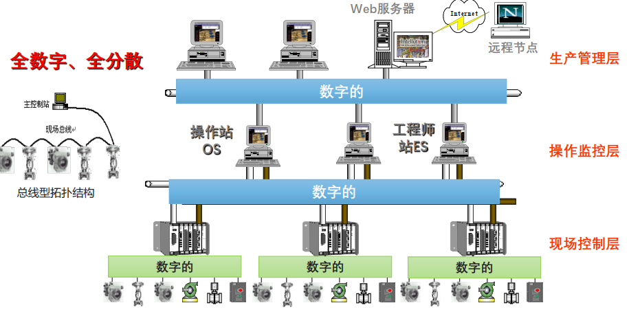

自动控制系统的几个层面

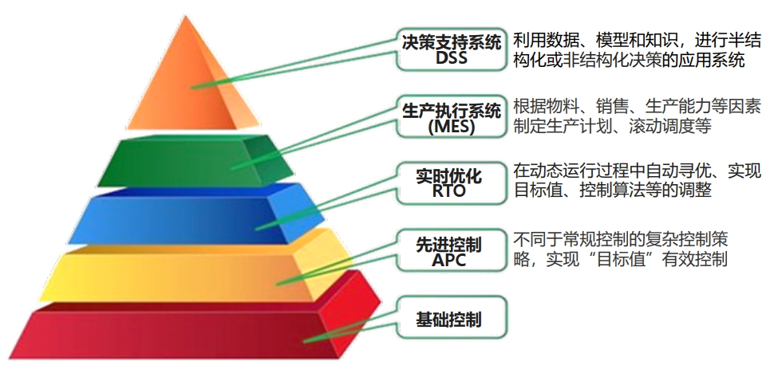

## 计算机控制系统的网络通信技术

### 网络通信基本概念

- 模拟信号（连续的物理量）与数字信号（不连续的物理状态来表示）
- 并行传输（以字/字节为单位同时传输）与串行传输（逐位传输，通信线少，适宜远距离通信，几乎所有计算机控制系统均采用**串行数据通信**）
- 通信双方的交互方式
  - 单工通信：单一方向传输，没有反向交互(如键盘、鼠标通信)

  - 半双工通信：双方可以交互数据，但不在同时，控制简单、可靠、成本低，应用广泛(只需2根通信线)
  - 全双工通信：双方可以在同时交互数据、控制相对复杂，效率高、需2个信道，至少3根通信线(1根为共用地)，或4根

- 基带传输与频带传输

  基带传输：
  - 按数字波形原样、以**“位”流**为基本形式直接在信道上传输
  - 基带网介质便宜（双绞线、同轴电缆、光线等），速度较高，远距离传输容易因信号衰减发生畸变（中继），绝大多数局域网都采用基带传输
  - 数字信号的数字传输

  频带传输：
  - 也称为载波传输，采用**调制、解调**技术
  - 在发送端，将二进制数据，调制变换成一定频带范围的模拟信号；在接收方，通过解调进行反变换。采用模拟信号传送数据时，通常只占用有限的频带宽度。数字信号调制称为“键控”
  - 调制方式主要有：幅度键控(ASK)、频移键控(FSK)、相移键控(PSK)……
  - 数字信号的模拟传输，如HART信号

  宽带传输：
  - 适用于传输影像、语音信息(一般不用于工控网络)

- 计算机网络的拓扑结构

  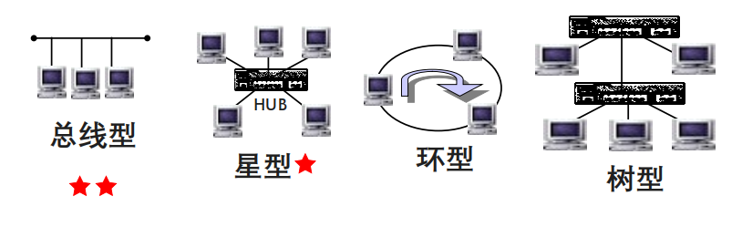

- 网络传输介质

  网络传输介质是指通信网络中数据发送方与接收方之间的物理通路，常用的传输介质有： 双绞线、同轴电缆、 光纤和无线传输等。

  工业控制系统的通信网络多采用： **带屏蔽的双绞线STP、光纤**

- 总线接口技术

  总线（BUS）是指计算机系统中采用的一组公共信号线，它是计算机系统的通信线

  总线的分类：片内总线、系统总线、局部总线、 外部总线（计算机与计算机之间、计算机与仪器/设备之间的连接总线，用以进行组网与通信）

  外部总线类型：串行通信总线、 USB总线、现场总线、工业以太网等

  总线的性能指标：
  - 时钟频率（MHz）
  - 总线宽度（bit位）
  - 总线传输速率（Mbps，每秒兆字节）
  - 同步或异步方式
  - 多路复用
  - 信号线数

### 串行通信总线

串行通信是指构成信息的二进制字符的各位数据一位一位顺序地传送的通信方式

通信技术：

- RS232、RS422、RS485、现场总线基本特点（通信距离、传输速度）

  > RS422、RS485本质上相同，RS485是现场总线“首选”标准

  | 串行通信协议类型 | RS-232   | RS-422 | RS-485 |
  | ---------------- | -------- | ------ | ------ |
  | 接口电路         | 单端     | 差动   | 差动   |
  | 抗干扰能力       | 弱       | 强     | 强     |
  | 标准最大传输距离 | 15m      | 1200m  | 1200m  |
  | 通信双方交互方式 | 全双工   | 全双工 | 半双工 |
  | 标准最大传输速率 | 19200bps | 10Mbps | 10Mbps |

  - RS-232：RS-232C总线标准设有25条信号线， 包括一个主通道和一个辅助通道。 最大工作速率为20Kbps， 最大通信距离为15m
  - RS-485：RS-485是在RS-422基础上制定的标准，采用平衡发送和差分接收，因此具有抑制共模干扰的能力。应用RS-485可以联网构成分布式系统，最大支持**32**个节点，如果使用特制的485芯片，可以达到128个或者256个节点，最大的可以支持到400个节点

### 现场总线通信

现场总线： 连接现场设备、仪表的一种串行、数字式、多点通信的数据总线用于把遵循特定通信协议的控制系统现场仪表、设备连接组网

现场总线技术特征：

- 全数字→现场设备高度自治
- 全分散→系统结构高度分散
- 协议高度开放性（美好愿望而已，不是标准而是标准群）
- 实时以太网技术已被广泛接受

IEC61158 Ed.2-1999  国际标准，本意：排他的和联合的

IEC61158 Ed.3-2003  2003年4月， IEC61158 Ed.3现场总线第三版正式成为国际标准

IEC61158 Ed.4--2007  产生了实时以太网（Real Time Ethernet，简称RTE），亮点： **EPA**

**EPA：我国自动化领域首个国际标准**，意义：打破现场总线核心技术与标准被国外垄断(芯片、专利、标准)的局面

现场总线与一般通信网络的技术特征有何差异？

- 通信速度、可靠性、安全性、网络拓扑

  | 技术特征 | 一般通信网络       | 现场总线                                 |
  | -------- | ------------------ | ---------------------------------------- |
  | 通信速度 | 快（相对）         | 可靠的快 最大响应时间是确定的（绝对） |
  | 安全性   | 一般要求           | 本质安全、电磁兼容                       |
  | 网络拓扑 | 网络型 (多路径) | 总线型 (单一路径且易实现本质安全)     |

  现场总线的本质就是一种通信网络，但二者在基本功能、 信号传输要求和网络结构上有所不同。

  - 基本要求：现场总线，可靠地传递信息，本质安全、电磁兼容

  - 信号传输要求：现场总线通常采用以下二种技术来保证其实时性：简化技术（简化网络结构成线形，简化啊通信模型，简化节点信息几个字节）/网络管理技术（采用主-从、令牌等访问方式，只要限制网络的规模，就可以将响应时间控制在指定的时间内）

    总而言之：**实时性要求（降低不确定性）是现场总线区别一般计算机通信的主要因素**

    > 工控通信的基本特征是什么？
    >
    > - 短帧、周期性→最长完成时间可预知

  - 网络结构：通信网络，网络状的，节点间的通信路径是不固定的

    现场总线，线状的，节点间的通信路径是比较固定的

以太网与工业以太网（如ProfiNet）

工业以太网，以太网技术从办公自动化走向工业自动化

- 早些年工控系统为什么不用Ethernet通信？

  - 介质访问控制协议CSMA/CD→先听后说/边听边说→大负荷时存在碰撞可能→存在“原理上的不确定性”

  - 通信速率↑，网络负荷↓，碰撞概率↓
  - 交换技术发展 → 进一步减轻碰撞问题
  - e网负荷＜10%时，基本无碰撞；负荷＜25%时，e网通信响应时间明显短于令牌网
  - “不确定性”不再是e网用于工控底层网络的主要障碍（工业以太网）

- 工业控制系统网络通信的特点

  - 短帧信息多、长帧信息少
  - 周期性信息多（测量、控制信息），非周期性信息少（操作指令、组态信息；报警等突发性事件信息）
  - 信息流向方向性明显
  - 节点数少、网络负荷较平稳
  - 简化的OSI模型（7层→3、4层）

  工业以太网碰撞概率是很低的。其实以太网的不确定性问题没有那么严重，负荷越小，碰撞越少，且工业控制网络的特点，也利于以太网的应用。“不确定性”不再是E网的主要障碍

思考：远程节点的引入有什么好处、有什么问题、有什么启示？

好处：

- (1)可远程/自动控制设备的工作运行。
- (2)实现了远程监测，对设备参数以及运行状况能够实时了解的到，对各项数据能够及时的分析处理。
- (3)能够对设备进行集中的管理和控制，方便节省时间。
- (4)具有预警、报警功能，及时通知用户或者工作人员，帮助快速发现问题解决故障，防止设备出现更大的问题，增加维修成本的同时可能还会危及人员人身安全。
- (5)工业远程控制系统还可以做到对设备运行工作的情况和数据、故障报警等进行记录，当需要查阅的时候，就能够立马查询的到。
- (6)能够进行远程操作控制，无需人员在现场就能够实现对设备的管理、调试、控制，打破了时间和空间上的限制。
- (7)除了远程控制外，当设备发生故障的时候，还能够远程的进行诊断和维修，而且还有上述的存储记录为数据分析作基础，节省了维修人员在查找故障原因上花费的时间。

问题

- 网络安全对工业控制的冲击

启示

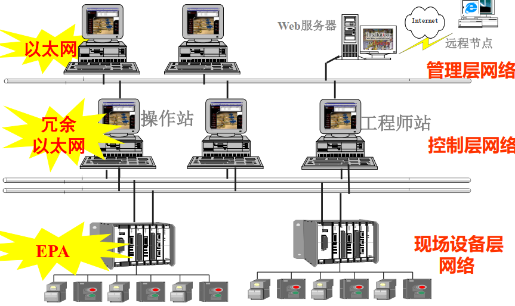

## 计算机控制系统的数字滤波技术*

思考题：

有哪些类型的干扰？受到干扰以后怎么办？

模拟信号怎么样处理不容易受到干扰？数字信号怎么样处理不容易收到干扰？

- 干扰类型

  - 脉冲干扰
  - 随机干扰
  - 周期性干扰

- 受到干扰后怎么办？：滤波

- 常用时域数字滤波算法

  - 中位值滤波：连续采样奇数次，将结果从大到小排列取中间值作为采样的有效数据。克服偶然因素干扰，对于温度、液位等缓慢变化参数的滤波效果较好，不太适用于流量、压力等快速变化的参数

  - 算术平均：适用于随机干扰的滤波，对于测量速度慢或响应速度要求较高的系统是无法接受的

  - 递推滤波：对周期性干扰有良好抑制作用，对偶然性脉冲性干扰抑制作用差
  - 加权递推平均滤波
  - 一阶惯性滤波（软件RC滤波）：常好用，取值依据是不产生明显的波纹

  | 滤波器类型           | 适用干扰类型                     | 备注             |
  | -------------------- | -------------------------------- | ---------------- |
  | 中位值滤波法         | 偶然的脉冲干扰                   |                  |
  | 算术平均值滤波法     | 随机干扰                         |                  |
  | 递推平均滤波算法     | 周期性干扰                       | 有良好的抑制作用 |
  | 加权递推平均滤波算法 | 大纯滞后对象和采样周期较短的系统 |                  |
  | 惯性滤波法           | 高频的干扰信号                   | 但不能太大       |

# CH2 检测仪表原理与选型

## 检测仪表概述

### 仪表分类与信号制

仪表类型

- 基地式控制仪表：指示、调节等功能部件集成一体，一台仪表就能解决一个简单控制问题

- 单元组合仪表：按功能分成独立仪表单元，单元间用标准信号联系， 根据需要组合构成控制系统

  - 电动单元组合仪表（DDZ）

    DDZ-Ⅲ型仪表、气动执行器的应用很广泛——集成电路，电源24VDC   信号4～20mA、 1～5VDC

  - 气动单元组合仪表（QDZ）

- 新型仪表： 数字仪表、智能仪表、现场总线仪表

信号制：信号制即信号标准， 用于实现控制系统中不同单元互联互通

- 气动仪表的信号标准：GB777-1985/ IEC382

  | 下限 0% | 上限 100% |
  | ------- | --------- |
  | 20KPa   | 100KPa    |

- 电动仪表的信号标准 GB/T 3369-1989/ IEC381A

  | 序号 | 电流信号 | 负载电阻          |
  | ---- | -------- | ----------------- |
  | 1    | 4-20mADC | 250-750欧         |
  | 2    | 0-10mADC | 0-1000欧/0-3000欧 |

  仪表负载能力是有限的

- 数字仪表的信号标准 RS-232、 RS-485、 **HART**、各种现场总线标准（工业以太网）

- 在布线困难或远程检测控制的场合，**无线通信**，例如： ISA SP100.11a（支持多协议）， WirelessHART（易于无线扩展）， LoRaWAN/NB-IoT（低功耗、远程）

无线通信协议简介

- 无线通信指用无线电波、红外线、光波等作为传输媒体的通信方式
- 常见的无线通信产品及其技术协议
  - 蓝牙，支持设备短距离通信(一般10m内)
  - WiFi，把有线网络转换成无线信号，是当今使用最广的无线网络传输技术
  - ZigBee，一种短距离、低速率、低功耗、灵活组网、高效的无线网络技术，是物联网的主流技术，在工业、农业、智能家居等领域应用广泛

- 两种介质访问控制协议
  - CSMA/CD（ Carrier Sense Multi Access/Collision Detection）： 有线局域网
  - CSMA/CA（ Carrier Sense Multi Access/Collision Avoidance）： 无线局域网

- 上述协议在通信距离、抗干扰性等方面存在局限，常用于消费电子产品，不适合复杂工业现场环境

三种主要的工业无线通信标准

- 国际HART通讯基金会发布的WirelessHART： 是专门为过程工业而设计的开放、可互操作的无线通信标准，只要是基于HART的设备、软件都可方便集成，对大量应用的HART设备而言非常有利，该标准兼容IEEE802.15.4标准
- 国际自动化学会（ISA）发布的ISA 100： 目标是将各种传感器、执行器、无线手持设备等现场自动化设备以无线的方式集成到应用系统中， 可支持集成FF、 HART、 Modbus、 Profibus等多种协议，主要是对IEEE 802.15.4无线通信标准的扩展和优化
- 中国制定的工业无线网络标准WIA-PA： 是由中国工业无线联盟针对工业过程自动化领域制定的工业无线网络标准， WIA-PA也是遵循IEEE 802.15.4体系架构的用于工业过程测量、监视与控制的无线网络系统，可满足工厂自动化无线数据传输需求

家用智能三表（水电气）的无线通信技术：主要采用NB-IoT、 LoRa等无线通信技术， 这两种技术甚至被称为“物联网之王”

- NB-IoT（Narrow Band Internet of Things， 窄带物联网） ：它构建于蜂窝网络之上，需要相对密集的基站部署才能实现广域覆盖
- LoRa（Long Range） ， 是一种超远距离无线传输方案， 使用网关作为媒介（另外布置）。终端功耗更低、 可接入节点数更多，更适合偏远地区数据传输或移动设备跟踪

模拟信号传递：

- 仪表单元之间的传输模拟信号通常为什么类型的信号？ 为什么？

  电流-电流（电流接收仪表输入阻抗$R_I$一般较小， 常为几十~几百Ω）

  电压-电压（电压接收仪表输入阻抗$R_U$一般很大， 可近似开路  ）

  电流-电压

- 一个电流输出发送方、多个电流输入接收方怎么连接？ 需要注意什么问题？

  $\sum R_{I-i} + r$不能超过发送仪表的最大负载能力

  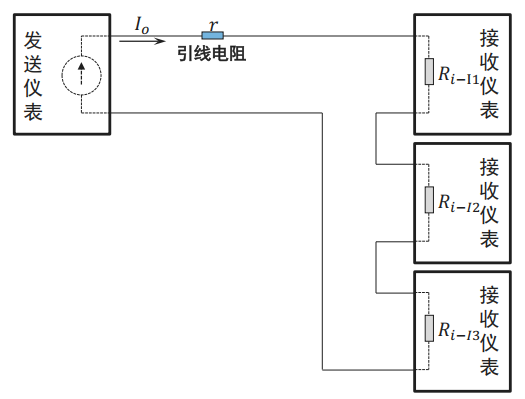

单元组合仪表：

- DDZ、QDZ
- 信号制4-20mA、HART信号等
- 无线通信协议：蓝牙、WiFi、ZigBee
- 家用智能三表（水电气）常用的无线通信技术：NB-IoT、LoRa

适合远距离传输、抗干扰能力强的信号？I or V信号？I输入仪表/V输入仪表

### 仪表防爆与防护

防爆问题(防止引发爆炸)：

- 何为防爆仪表？哪些场合需要防爆？危险因素有哪些？防爆举措有哪些？

  - 何为：电动仪表在规定条件下使用，不会把易燃易爆介质点燃

  | 防爆电气设备类别 | I类              | II类                                 | III类                                |
  | ---------------- | ---------------- | ------------------------------------ | ------------------------------------ |
  |                  | 煤矿井下电气设备 | 除煤矿之外的爆炸性气体环境用电气设备 | 除煤矿以外的爆炸性粉尘环境用电气设备 |

仪表防爆：

- 本质安全型防爆仪表（也称安全火花仪表）

  经过设计， 使仪表在正常或规定的故障状态下， 产生的电火花和热效应均不会引起规定的易爆性气体混合物爆炸

  | ia 等级 | 在正常和≤2个故障时均安全 |
  | ------- | ------------------------ |
  | ib 等级 | 在正常和1个故障时安全    |

- 隔爆型防爆仪表

- 分类、分级、分组：明白如Ex ia IIC T5的含义

  

防爆场合

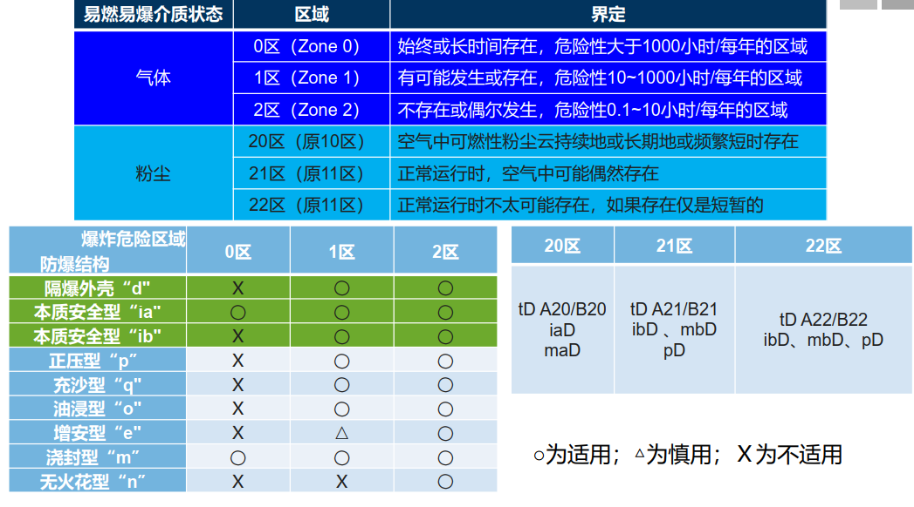

系统防爆：

- 现场：使用合适的防爆仪表

- 现场仪表与控制室设备中间应安装安全栅(限能)或隔离栅(限能+隔离)

- 布线、信号传输（安全栅或隔离栅）

  布线简单、 直接；穿线管直径足够大等等

  原因分析：线缆之间、 线缆与穿线管管壁之间存在分布电容、 分布电感， 分布电容、 分布电感具有储能作用， 存在释放能量可能

仪表防护问题：

- 防护等级：如IP 68 CH，明白两个数字的大致含义

  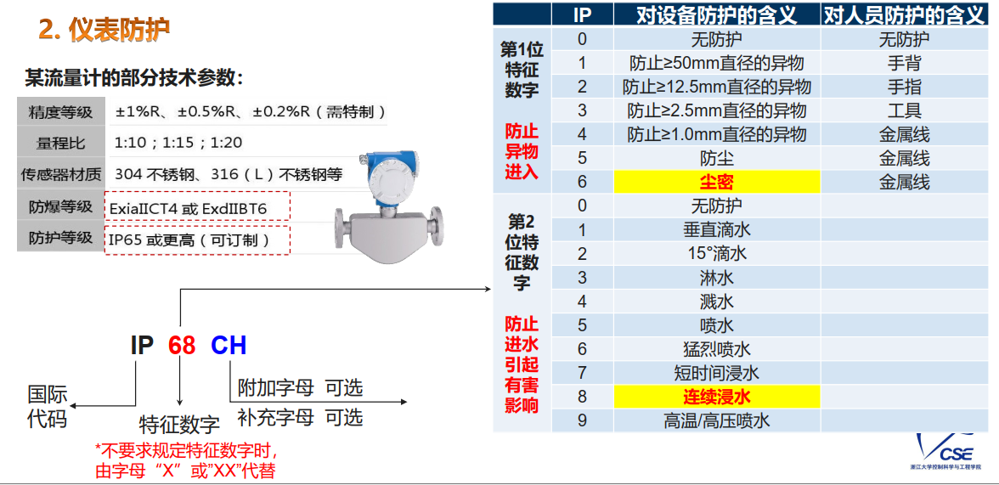

  

### 变送器基本工作原理

变送器是将各种工艺参数转换成统一的**标准电信号**

变送器分类

| 分类标准     | 具体分类                       |
| ------------ | ------------------------------ |
| 按工作能源分 | 气动变送器、电动变送器         |
| 按被测参数分 | 差压、压力、流量、温度、液位等 |
| 按信号类型分 | 模拟变送器、数字（智能）变送器 |

变送器工作原理

- 常规检测仪表基本框架

  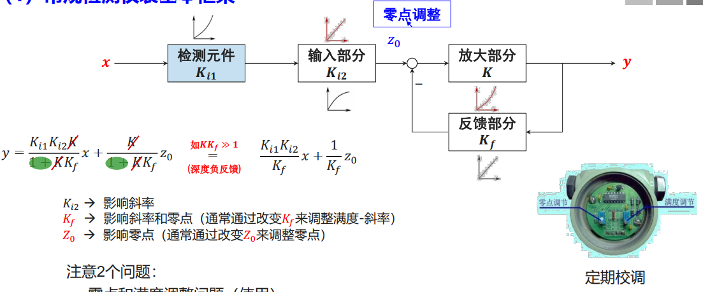

  - 零点和满度调整问题（使用）
  - 非线性补偿问题（设计）：传感元件通常或多或少存在一定非线性
    1. 使反馈部分与传感器组件具有相同的非线性特性
    2. 使输入部分与传感器组件具有相反的非线性特性

- 数字（智能）变送器的基本框架

  

  HART信号的主要特征

  - 在4~20mA模拟信号上叠加幅值为±0.5mA的正弦调制波作为数字信号
  - 相位连续，均值为0，对模拟信号没有影响
  - 1200Hz频率表示数字信号“1”
  - 2200Hz频率表示数字信号“0”
  - 既可以作为模拟信号用，也可以数字信号用

  FKS信号的主要特征

  - 一种频率调制的数字调制方法，用于将数字数据转化为模拟信号
  - 数字信息是通过改变载波信号的频率来表示，通常有2哥频率分别代表二进制的0和1
  - 单位时间ASK——幅移键控调制，FSK——频移键控，PSK——相移键控

思考题2-4： 数字仪表如何实现线性化变换、非线性补偿等功能？除了FSK之外，常见的调制方式还有哪些？

检测仪表：

- 传感器与变送器，变送器特性（单值对应、线性、稳定、快速、防爆、防护）

### 信号类型及仪表调校

模拟仪表、数字仪表的基本构成：

- 二线制、四线制
- 仪表的额定负载

信号连接方式：

- 四线制

  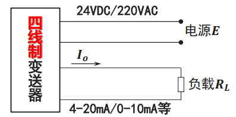

- 二线制

  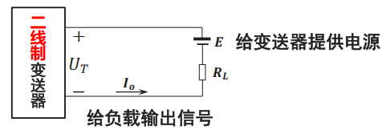

  优越性：使用简单，容易实现本质安全。

  局限性：最大负载一般不会很大，一般在700Ω左右

模拟式仪表、HART仪表和数字式仪表

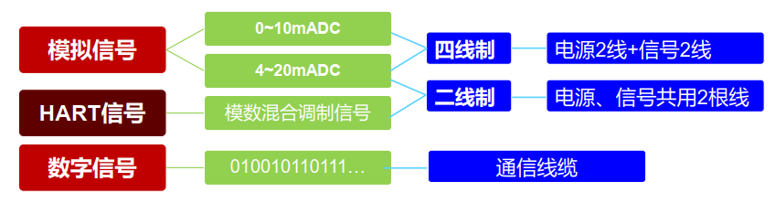

- **模拟式仪表** ：基本的测量和显示功能，通常没有远程监控或诊断能力。
- **HART仪表** ：除了基本的测量功能，还支持远程配置、诊断和通信。
- **数字式仪表** ：提供丰富的功能，包括远程监控、数据分析、自诊断和通信能力。

## 变送器概述

压力（差压）、温度等检测仪表：

- 请结合课件思考题复习，多数内容仪表课已学习

掌握开关量信号检测仪表：

- 液位开关、料位开关、接近开关、行程开关

数字变送器简介

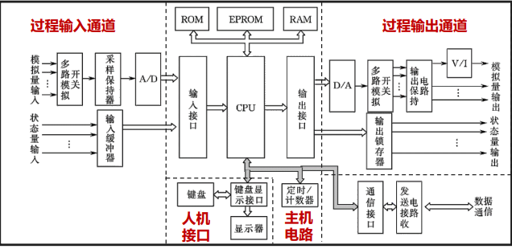

HART仪表的基本结构

软件功能：通常包括采样、 补偿、 量程转换、 运算、 阻尼、 输出、 通信控制、 中断处理等

## 检测仪表选型

仪表选型

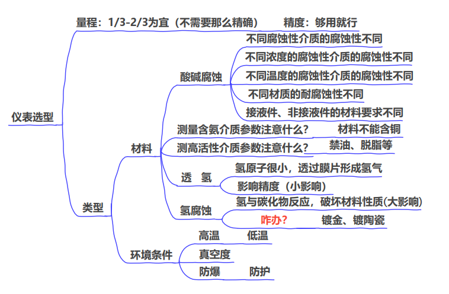

- 选型若干要点

  量程（合适的工作点仪表正常工作点在仪表量程1/3~2/3区间为宜）、准确度（够用就好）

- 仪表材料选择及处理

  - 酸碱腐蚀：检测仪表的敏感元件往往要与被测介质直接或间接接触，材料选择与腐蚀性介质的浓度、工作温度紧密相关

    膜片材料： 除传统使用的哈氏合金、蒙乃尔合金、钽外，还可以选择钛和锆或者对膜片作镀金处理

  - 氢腐蚀：透氢：氢原子很小，容易透过隔离膜片，进入仪表内（如填充液）并形成气体，导致不能正确传递参数，如压力

    氢腐蚀：氢原子从设备表面渗入钢材内部，与不稳定的碳化物发生反应，使钢脱碳（腐蚀）致使机械强度受到永久性的破坏

    必要时要对隔离膜片作镀金、陶瓷镀膜等耐透氢处理

  - 特殊介质：

    - 氨介质：氨气对铜的腐蚀性极强(铜氨络合）， 氨用仪表不允许采用铜或铜合金

    - 高活性介质：高活性介质主要指$O_2,Cl_2$等介质

      测量高活性介质时：表面应做**禁油、脱脂**处理；灌充液宜选惰性填充液，如氟油；密封垫圈宜选用氟橡胶等材料

  - 高温、真空等特殊要求

    - 高温：选择恰当的远传装置， 通过延长引压管等手段降低测量介质的温度

      选择合适的灌充液

    - 真空环境：在高真空场合（如<50kPa绝压），通常需要对仪表部件作**高真空脱气处理**

- 仪表环境条件

- 输出信号类型选择

# CH3 执行器

阀门：

- 阀门概述——调节阀/开关阀；角行程/直行程

**调节阀**：

- 调节阀——执行机构、调节机构；气动、电动；阀门定位器、电气阀门定位器

调节机构：

- 单座、双座、三通、蝶阀、球阀、套筒阀的特点及适用场合（泄漏、介质、卫生）

调节阀流量特性：

- 流量方程 $  Q = \frac{K}{\sqrt{\Delta P}}  $，流量系数 $  K  $，流通能力 $  Kv  $（＞工艺要求）

流量特性：

- 线性、等百分比基本特点（不是公式）；畸变→等百分比适用性更强
- 可调比：畸变，如果实际可调比达不到工艺要求怎么办？

执行机构选型：

- 气动薄膜调节阀用的比较多，注意电-气转换、阀门定位的要求

调节机构选型：

- 选择结构形式*、口径*、流量特性*、材料*；安装：使用安全+操作方便

开关阀——开关控制阀：

- 电磁阀、气动开关阀→开关控制需注意什么？（滞回，防振，精度）

开关式电气转换电磁阀：

- 2位3通、2位5通→气动开关控制阀的电气信号转换

电机：

- 常用辅助部件——按钮、接触器、继电器、空开/断路器、气管、接头等其他接线部件

开关泵：

- 降压启动

变频泵：

- 节能、平滑、提高低速转矩等

## 概述

- 执行器作用：接收控制信号， 将能量转换为物理机械运动

  安装于生产现场，主体部件等与介质（被控对象） 直接接触，通常是控制系统**最薄弱**的环节

- 执行器分类

  

- 执行器（调节阀）正反作用：

  执行器正、反作用确定原则： 从保证人员和设备安全角度来确定正反作用

  再选择控制器正反作用来确定负反馈逻辑

- 执行器连接方式

  执行器与控制器的物理连线方式取决于执行器的类型、 控制信号类型以及应用场景。 常见的连接方式包括电气连接、 气动连接和液压连接

## 阀门

### **调节阀**

- 结构特性

  

- 调节阀的执行机构

  - 气动薄膜式执行机构，接受 20 ~ 100 kPa输入信号，将其转换成相应的输出以推动调节机构动作

    执行器的偏差、回差会不会影响控制系统的稳态控制误差？——一般不会

  - 气动活塞式执行机构，构成：活塞+气缸，行程长、输出力较气动薄膜式调节阀更大，但应用更加广泛

  - 电动执行机构，直接接收4~20mA等输入信号，将其转换成相应的输出以推动调节机构动作

    伺服放大器是一个具有继电特性的非线性环节， ∆为不灵敏区

    接通电源时， 伺服电机恒速运转， 伺服电机表现为为一**积分环节**，电动执行机构稳态特性表现为**比例特性**？？？

- 调节阀的调节机构：主要构成：阀体、阀座、阀芯、阀杆或转轴

  

  直通单座调节阀，直通双座调节阀（阀体内有两个阀芯阀座， 流通能力大），

  三通阀（三个接管口， 分为三通合流阀、 三通分流阀两种，多用于温度调节、 配比调节和旁路调节，其两路输入流体的温差不宜过大）

  蝶阀（注意泄漏量问题，用于食品、 制药等卫生要求较高的场合）

  球阀（转轴带动球体旋转， 具有一定的切断作用，结构简单， 流通能力大，多作为开关阀使用，有O型/V型）

- 流量特性

  - 流量方程和流量系数$K_V$

    选型逻辑：根据设计流量𝑸、介质密度𝝆、工作差压𝜟𝑷，计算调节阀流量系数𝑲，再根据𝑲来选择对应$K_V$（当阀前后压差为100$KPa$，流体密度为1𝒈/𝒄𝒎𝟑，调节阀全开时，每小时通过阀门的流量数(𝒎𝟑数)记为$K_V$表征调节阀的流通能力）的调节阀
    $$
    Q = \frac{K}{10}\sqrt{\frac{\Delta P}{\rho}}, K=10Q\sqrt{\frac{\rho}{\Delta P}}
    $$

  - 流量特性：介质流过调节阀的相对流量与相对位移（即相对开度） 之间的关系
    $$
    \frac{Q}{Q_{max}} = f(\frac{l}{L})
    $$
    理想流量特性 （调节阀前后压差$\Delta P_V$保持不变）

    实际流量特性

    - 串联管道安装：调节阀开度不同，前后压差$\Delta P_V$会变
    - 并联管道安装：因存在固定旁路流量Q2，影响调节阀的调节能力

  - 可调比

    调节阀所能调节的最大流量$Q_{max}$和最小流量$Q_{min}$之比， 反映可调节能力
    $$
    R = \frac{Q_{max}}{Q_{min}} = \frac{K_{max}}{K_{min}}
    $$

    - $  Q_{min}  $ 为调节阀可以调节的最小流量（理想情况下一般为最大流量的2~3%）
    - 低于 $  Q_{min}  $ 所对应的开度，开度变化引起的流量变化很小
    - 最小可调流量不等于泄漏量，泄漏量要比 $  Q_{min}  $ 小很多
    - 受加工限制，R不会太大，一般为30或50

    实际可调比$R_r$，通常实际比理想更小

### 选型与安装

- 执行机构的选择

  应从安全视角来确定调节阀正反作用

  | 比较项目 | 气动薄膜执行机构   | 气动活塞式执行机构 | 电动执行机构    |
  | -------- | ------------------ | ------------------ | --------------- |
  | 可靠性   | 高（简单、可靠）   |                    | 较低            |
  | 驱动能源 | 压缩空气气源，另设 |                    | 220VAC或24VDC   |
  | 输出力   | 大                 | 更大               | 一般不大        |
  | 防爆     | 本身防爆           |                    | 本身不防爆      |
  | 工作环境 | 大（-40℃~+80℃）    |                    | 小（-10℃~+55℃） |
  | 价格     | 低                 |                    | 高              |

  气动薄膜执行机构应用最广泛

  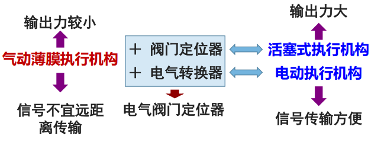

- 调节机构的选择

  - 选择结构型式

    - 一般情况下优先选用体积小、流通能力大的直通单、双座阀和套筒阀
    - 调节低压差、大流量介质或卫生要求比较高、要求容易清洗的场合，可以选择蝶阀
    - 要求泄漏量较小的，可选择单座阀
    - 要求较低噪声时，可选用套筒阀

  - 确定调节阀口径

  - 流量特性的选择

    总体原则：尽可能使整个控制回路综合特性接近于线性

    线性流量特性阀/等百分比（压差变化大，调节范围大）

  - 调节阀材料的选择：考虑以下因素:介质的压力、温度、腐蚀性（含氢腐蚀）等

  - 流向选择

- 阀门定位器

  按结构分气动阀门定位器、 电气阀门定位器

  基本原理：接收控制信号 → 输出气信号 → 阀门动作 → 感知阀杆位置 → 负反馈改变气压信号

- 调节阀的安装

  一般性要求：
  - 通常应垂直立式安装于水平管道上
  - 安装位置应方便操作、维修，必要时应设置平台
  - 大口径调节阀，其阀前后管道上应有支架
  - 新系统应先进行管道吹扫后安装仪表、阀门

  安全性要求：
  - 确保人员和设备的安全。必要时，阀前后可安装放空阀。压力波动大的地方，应安装缓冲器

  配管要求：
  - 调节阀配管通径尽量与阀通径一致，前后直管段长度与流量计安装要求相似

  操作要求：
  - 安装位置便于人工操作，拆拆装装要有工作位置

### 开关阀

- 开关控制阀

  开关控制回路需要注意什么？ （如压力）

- 开关式电气转换电磁阀

  利用电信号通过线圈、电磁铁操纵阀芯移动，控制压缩空气（或液体）开关流向，进而控制气动执行元件动作

阀门常见故障类型及其成因

| 故障类型           | 具体表现                         | 可能原因                                                     |
| ------------------ | -------------------------------- | ------------------------------------------------------------ |
| 卡死或动作不灵活   | 阀门无法开启或关闭，或运行迟缓   | ①阀杆和阀座有异物或污垢堆积②内部零件腐蚀、磨损③填料压得过紧④气源或电源不足 |
| 内漏（密封不严）   | 关闭后仍有介质泄漏               | ①阀座密封面磨损②密封圈老化或损坏③关闭力不足④介质中含有固体颗粒，划伤密封面 |
| 外漏               | 阀杆、法兰、填料函处泄漏         | ①填料老化或受损②法兰螺栓松动③密封垫片损坏                    |
| 阀门振动           | 运行时发生剧烈振动，甚至发出噪音 | ①介质压力波动大②流速过高③阀芯或阀座设计不合理④安装支撑不稳   |
| 定位器失灵         | 无法正确调节阀门开度             | ①定位器供气或供电异常②反馈机构卡滞③电磁阀损坏                |
| 流量或压力调节异常 | 设定值与实际输出偏差大           | ①执行机构故障②介质特性变化③传感器或控制信号故障              |

### 数字阀与智能控制阀

数字阀主要由流孔、阀体和执行机构三部分组成。每个流孔都有自己的阀芯和阀座。执行机构可以用电磁线圈，也可以用装有弹簧的活塞执行机构

## 电机

- 电气控制基本知识

  - 继电-接触器控制（传统）

  - 基于可编程控制器（PLC）

  - 开关电器及主令电器：按钮/开关，转换开关（由操作机构、 定位装置和触点等三部分组成）

  - 接触器：利用线圈流过电流产生磁场，使触头闭合，以达到控制负载的电器可频繁进行大电流控制（某些型号可达800安培）， 常用于电机、电力机组等电力负载控制

  - 继电器：是一种电控制器件，它具有输入电路（又称感应元件）和输出电路（又称执行元件），当感应元件的输入量（如电流、电压、频率、温度等）变化达到某一定值时，继电器动作，执行元件接通或断开控制电路

    中间继电器 是用小电流控制大电流的一种“自动开关”

  - 空气开关/断路器：自动空气开关（Air Switch），又称自动空气断路器，简称空开，是低压配电网络和电力系统中非常重要的一种电器，它集控制和多种保护功能于一身。除了能完成接触和分断电路外，能对电路或电气设备发生的**短路、 严重过载及欠电压**等进行保护，也可用于不频繁启动电动机

  - 常见电机：直流电机，伺服电机，异步电机，三相异步电机

- 开关控制

  - 直流电机的开关：通断电

  - 三相异步电机的开关控制

    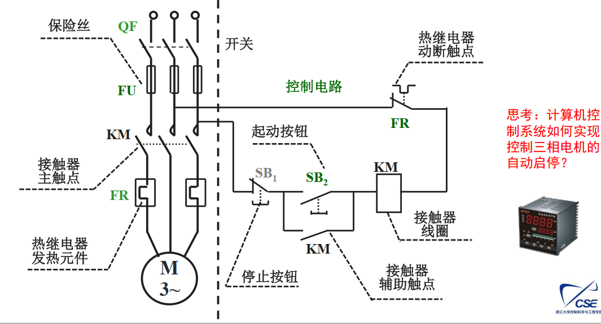

- 连续（调速）控制

  调速：通过调节电机转速获得所需扭矩

  电机要实现调速控制有哪些常用方法？ **变频**、变压、变阻、变流、变级、步进

  - 直流电机的调速：PWM，只要改变PWM信号的占空比，就可以改变直流电机两端的平均电压，从而实现直流电机的调速。

  - 三相电机的调速—— 变频器

    变频器主要采用交-直-交的变换方式：工频电源 → 整流成直流 → 逆变成𝑓𝑓、 𝑉𝑉可变的交流电源

1. 一般在什么情况下需要考虑采用变频控制？
   - 负荷有富裕需要降低电机速度时——节能降耗（能耗∝转速³，节能效果显著！）
   - 需要调节电机转速时——平滑调速
   - 需要高启动转矩时——提高性能（低速工作时增加输出电压，可改善转矩不足问题）
   - 需要减少大功率电机启动时对电网的冲击——上电缓冲
   - 需要关注过载、过压、欠压保护等功能的场合

2. 有没有不适合变频控制的场景？
   - 需要直接启动的设备（变频器起动需要时间）
   - 高温环境下的应用（变频器散热相对不好）
   - 需要启动大功率负载的设备

## 其他辅助部件

- **安全栅**

  安全栅的作用： 应用在防爆系统， 将供给本质安全电路的电压和电流限制在安全范围内

  - 齐纳式安全栅

    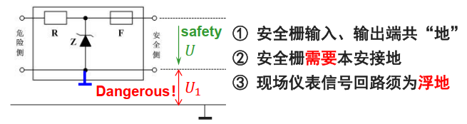

  - 隔离式安全栅

    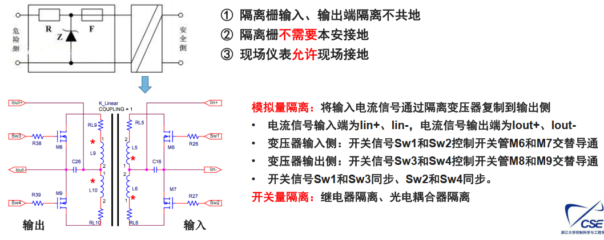

- 显示仪表

  显示仪表用于各种检测参数、 阀位的指示、 记录

  - 模拟式：动圈式/电子电位差计(热电偶)和自动平衡电桥（热电阻）/走纸记录仪
  - 数字式：把模拟信号转换成数字信号，以数字、光柱等形式在LED、 LCD等显示器件上显示结果
  - 新型：相当于小型计算机监控系统，把信号处理、显示、记录、存储、通讯、控制等功能集于一体

- 电气转换元件

  - 阀门定位器
  - 电磁阀

- 线缆与接线部件

  - RVV电缆 铜芯聚氯乙烯护套软电线，主要应用于电器、仪表和电子设备用电源、控制线
  - RVVP电缆 铜芯聚氯乙烯护套屏蔽软电线,主要用于防干扰弱电信号、数据传输
  - 网络传输线缆 常用的网络传输线缆类型有： (屏蔽）双绞线、光纤和无线传输等

# CH4 控制器

- 控制器→模拟控制器→计算机控制系统
- 控制器需要的基本功能：输入；给定；控制；输出；正反作用切换；手自动切换；无扰动切换等
- 正反作用→保证系统为负反馈
- PID调节规律：比例——快、有余差；积分——慢，消除余差；微分——超前，适用容量滞后对象
- PID离散化
- 掌握运放的基本知识和四个运放基本电路
- 了解DDZ-III型模拟调节器输入电路、比例微分、比例积分、输出电路，输出电路最难！
- PLC概述
  - PLC的工作流程，仔细看明白
  - PLC接口模块，AI的转换类型、AO输出、DI、DO

## 概述

- 控制器作用：得到偏差x，形成控制信号y，改变控制变量q
- 类型：
  - 按有无处理器分类：模拟式、数字式
  - 按系统结构分类：基地式、单元仪表式、系统式

- 功能

  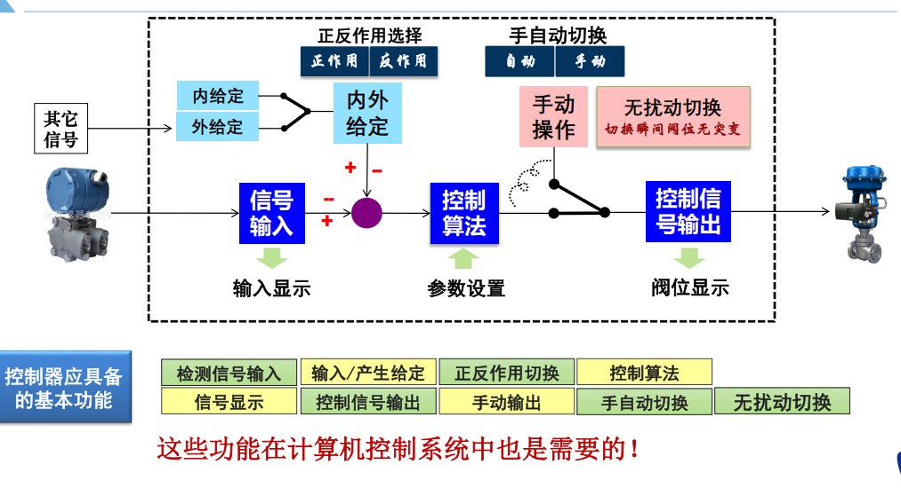

## 调节规律

- 正反作用

- PID离散化

  增量式PID算法：计算量少，存储空间少，输出平稳

  离散化方法：

  - 前向差分$s=\frac{z-1}{T}$
  - 后向差分$s=\frac{1-z^{-1}}{T}$

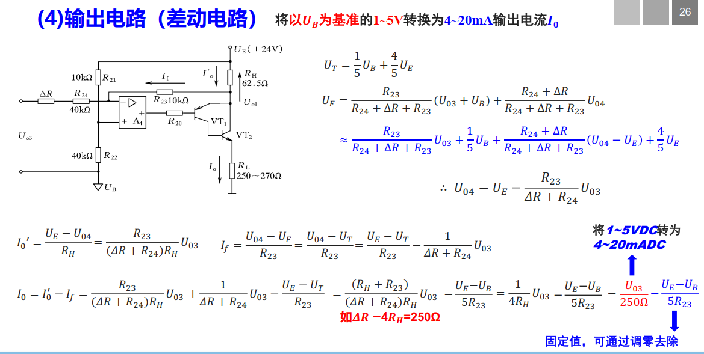

> $U_T$为正向端口，$U_F$为反向端口
>
> 通过设计$\Delta R$来实现不同值的映射，约$20\to 40Ω$，相比其他的kΩ，所以可以有上述**约等于**
>
> 为什么还要用两只三极管复合连接？提高电流的放大功能

## 单元式控制器

- 模拟式调节器：模电

  

- 数字式调节器

## 可编程控制器PLC

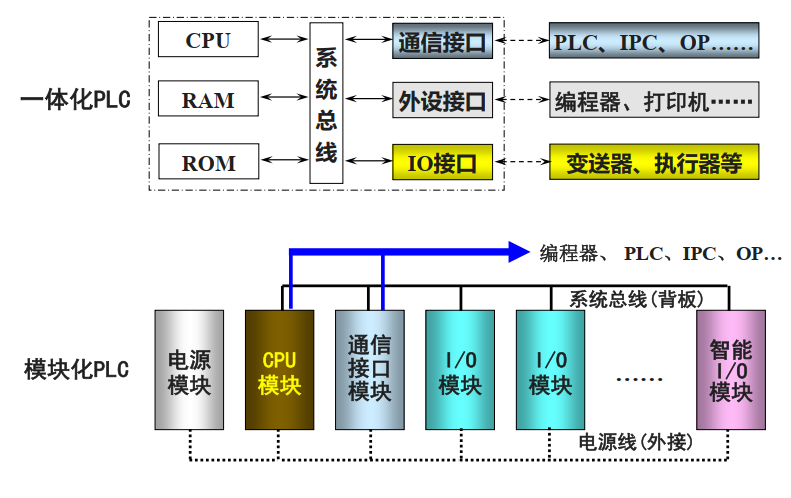

- PLC的产生：在PLC问世以前， 继电器控制在顺序控制领域中占有主导地位

  开发可编程序的控制设备取代继电器系统

- PLC特点：高可靠性，I/O接口丰富，组态编程（简单易学）

- PLC基本组成：

  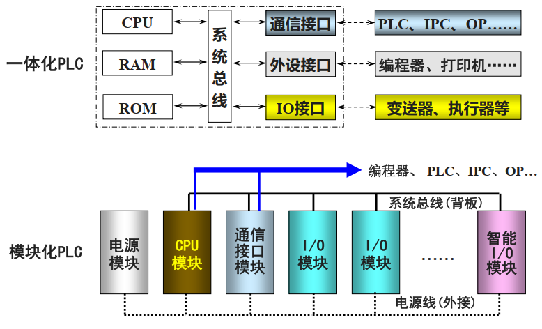

- PLC的工作流程

  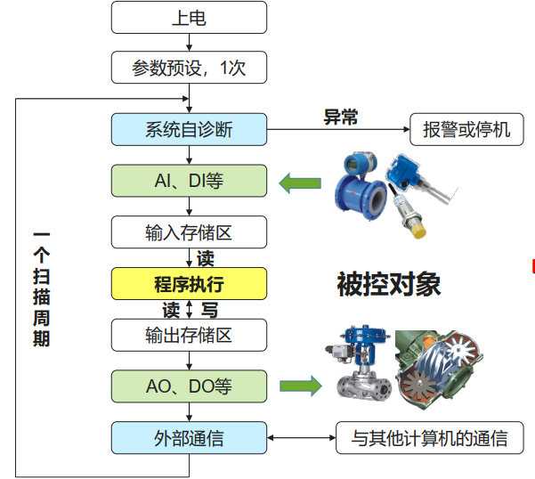

- PLC接口模块

  - 模拟量输入模块(A/D、AI)将现场仪表输出的模拟量信号转化为计算机可以处理的数字信号

    A/D的主要指标： 分辨率(转换精度)、输入信号类型、 转换速率、线性度、温漂

    - 逐次比较型A/D转换器基本原理

      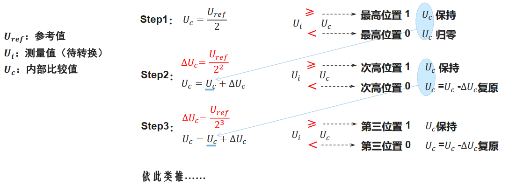

      转换速度很快，有多少位比较多少次，抗干扰能力弱

    - 双积分型A/D转换器基本原理

      - 工作原理：分为两个阶段
        1. $U_i$加入积分器，从0V积分到一个固定时间T，积分器输出$U_0(T) = KU_i T$
        2. 加入负参考电压$U_{ref}$反向积分，记录$U_0$输出$U_0$降回到0V所需要的时间$T_i$
      - 特性：转换速度更慢，抗干扰能力更强

    - $\Sigma-\Delta$型转换器基本原理

      $\Sigma-\Delta$转换， 对环境噪声的抑制能力更强（ 实际上是实现了噪声的整形）

  - 模拟量输出模块（D/A、 AO）

    将计算机内部数字信号转化为现场仪表可接收的4~20mA等标准信号

    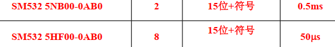

  - 开关量输入模块(DI)

    将现场过程来的（“1”/“0” ）转换成计算机内部的二进制标准电平

    数字量信号类型： 直流电压*、 交流电压*、 无源接点3种类型

  - 开关量输出模块(DO)

    将内部信号转换成所需的外部信号，驱动电磁阀、继电器、接触器、指示灯等各种负载

    输出信号类型：晶体管输出(直流，最快，长寿)、 晶闸管输出(交流，快，比较长寿)、 继电器输出(无源接点，慢，机械隔离，安全，寿命短)

    | 输出类型   | 速度 | 安全性       | 寿命     |
    | ---------- | ---- | ------------ | -------- |
    | 晶体管输出 | 最快 | —            | 长       |
    | 晶闸管输出 | 快   | —            | 比较长   |
    | 继电器输出 | 最慢 | 机械隔离，好 | 相对较短 |

    继电器输出安全和灵活，但晶体管输出加上外接继电器更常用

  I/O接口：AI，AO，DI，DO

# CH5 PLC可编程控制器（一）

综合实践，理解课件案例

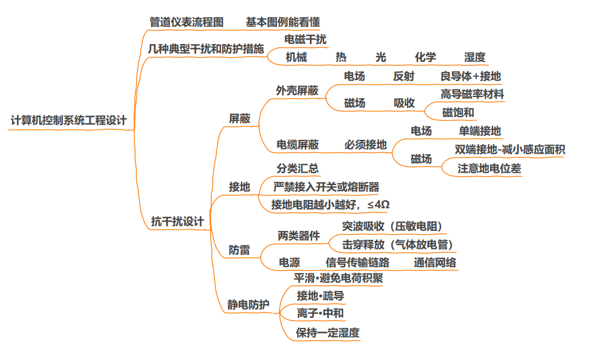

## 系统的组成与结构

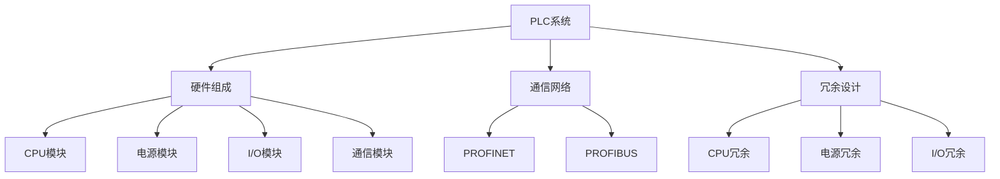
```mermaid
graph TD
    A[PLC系统] --> B[硬件组成]
    A --> C[通信网络]
    A --> D[冗余设计]
    B --> B1[CPU模块]
    B --> B2[电源模块]
    B --> B3[I/O模块]
    B --> B4[通信模块]
    C --> C1[PROFINET]
    C --> C2[PROFIBUS]
    D --> D1[CPU冗余]
    D --> D2[电源冗余]
    D --> D3[I/O冗余]
```

1. S7-1500 PLC系统硬件组成 ：

   | 模块                | 功能描述                                                     |
   | ------------------- | ------------------------------------------------------------ |
   | 导轨                | 机架，用于放置PLC的各种模块（S7-1500需要专用导轨）           |
   | 系统电源（PS）      | 连接至背板总线，提供5V直流电压，为电子元件及LED指示灯供电    |
   | 负载电源（PM）      | 将电网电压（120/230V交流）转换为24V直流，为S7-1500各模块供电 |
   | 中央处理单元（CPU） | 执行用户程序（配有外置存储卡、显示屏模块）；CPU性能应与控制系统要求相匹配，主要关注：处理速度、RAM容量、I/O容量、网络功能 |
   | 输入输出模块（I/O） | 连接现场仪表，将过程信号与S7-1500相匹配（支持通道级诊断），通常情况下是模块数量最多的。 |
   | 接口模块（IM）      | 进行分布式I/O扩展，PLC模块需要安装到多个机架上               |
   | 通讯模块（CP/CM）   | 集成有各种接口，可与不同接口类型设备进行通讯                 |
   | 工艺模块（TM）      | 完成高速计数、位置检测、时间戳检测、PTO脉冲输出等功能        |
   | 辅助部件            | 通信接头、通信电缆、总线连接器、前连接器等                   |

2. S7系列PLC及其常用模块： CPU、电源、 I/O、接口模块等

3. CPU： 基本性能（执行速率、 I/O接入能力）

   网通通信能力（以太网接口、 DP接口）

4. 电源模块：

   负载电源(PM)、系统电源(PS)； PM电源用于负载供电，通常是AC 120、 230V输入， DC24V输出，通过外部接线为各类模块、传感器和执行器供电，不占槽位，不用在软件中配置 ； PS电源用于系统供电，通过背板总线向PLC系统以及分布式I/OET200MP供电，占槽位，需在软件中配置，注意：此时，一般而言， I/O模块的负载回路还是需要另接供电电源的。

5. SM531-AI模块： 软件设置（四大类型）

   工程化转换--SCALE函数

   需注意的几个现场问题

6. SM532-AO模块： 软件设置（I、V）

   工程数据反变换—UNSCALE函数，其他没什么要特别注意的

7. SM521-DI模块： 2种输入信号（直流、交流）

   输入不同制式的0/1信号（继电器转换） PNP/NPN（考虑不到位会增加不少麻烦）

8. SM522-DO模块：晶体管输出（直流）、晶闸管（交流）、继电器输出（触点）输出不同制式的的0/1信号（继电器转换，驱动不同负载）

## 硬件配置与扩展

电源模块

| 类型   | 输入电压    | 输出功率 | 安装方式     |
| ------ | ----------- | -------- | ------------ |
| PM1907 | 120/230V AC | 60W      | 导轨安装     |
| PS2507 | 24V DC      | 150W     | 背板总线连接 |

冗余设计

# CH5 PLC可编程控制器（二）

## 数据类型和地址区

S7 CPU有7个主要寄存器

数据块：数据块是PLC最主要的数据存储区，需要用户自己定义，相当于C语言全局变量

## 指令与编程

- LAD梯形图
- STL语句表 汇编
- FBD功能块图
- SCL结构化语言

IEC 61131-3

间接寻址，寻址方式：

位逻辑运算指令

定时器：要求掌握 SS和TON的用法、时序等

## 程序结构简介

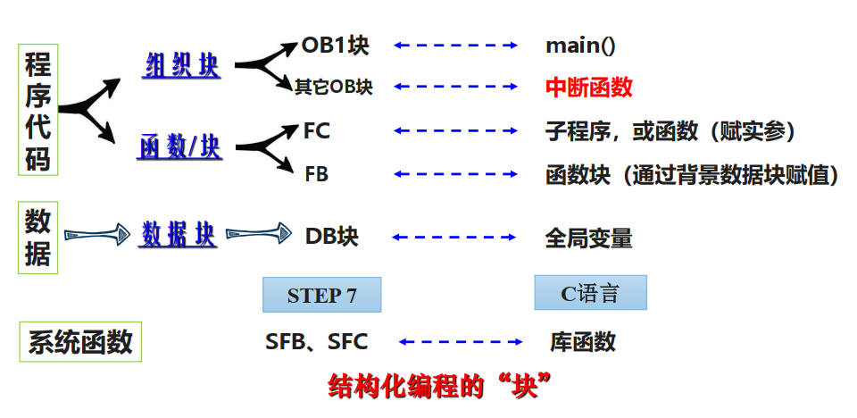

# CH5 PLC可编程控制器（三）

## 应用案例研讨

1. 电机的优先启动控制

2. 分析控制逻辑的功能

   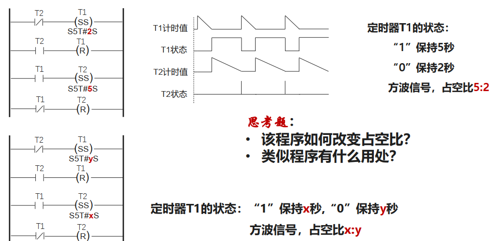

3. 通风机的监控

4. 阀泵联动控制（必要的延时）

   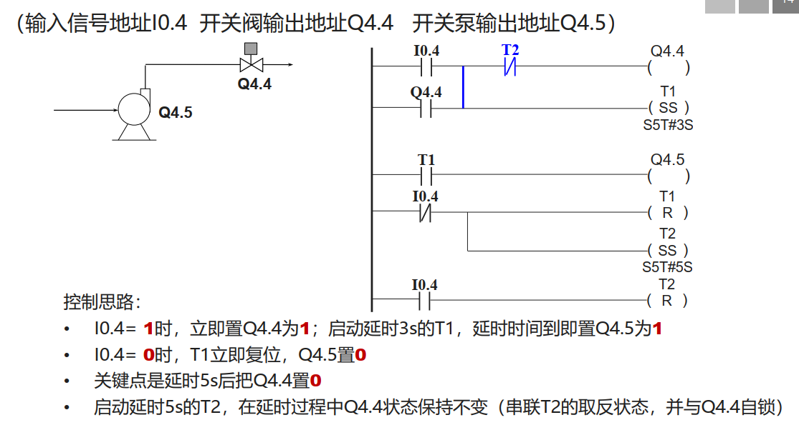

5. 原料输送系统（延时开关）

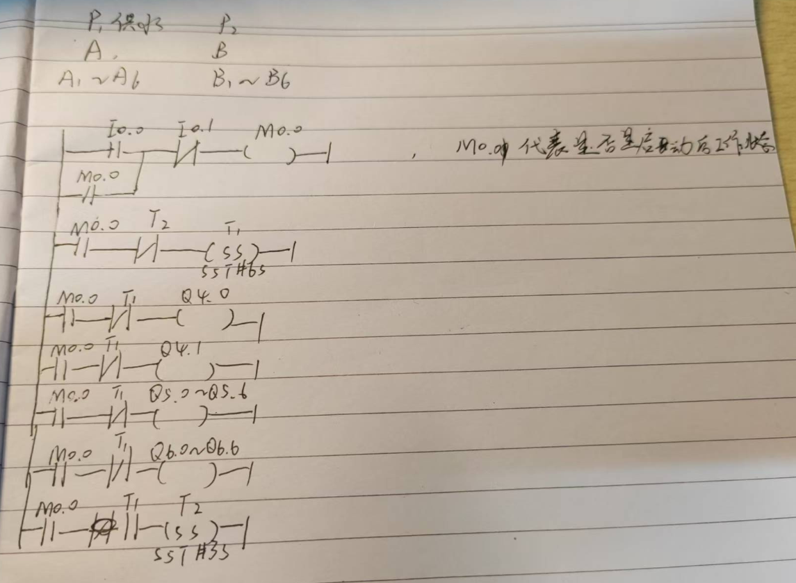

# CH 6 控制系统的工程设计

## 控制系统设计的内容和步骤

控制系统设计的基本原则

- 满足要求：充分考虑工艺要求、工艺性质、操作条件等要素，用控制理论、控制工程的知识、技术和经验，确定系统结构，制定软硬件配置方案和各控制任务的控制方案，**控制结果应满足生产工艺要求**。

- 系统可靠（safety）：在设计控制方案时，首先应确保系统安全可靠，易于维护，投运后出现的任何问题都可能带来损失，甚至是无法估量的损失，细之又细。
- 自主可控（security）：主要指软硬件及核心控制策略的供给。

- 先进有效：使生产过程处在“最佳”状态下运行，力争获取“最大”经济效益。

- 性价比高：控制方案应力求简单、实用、易用，产出/投入比高。

系统设计流程

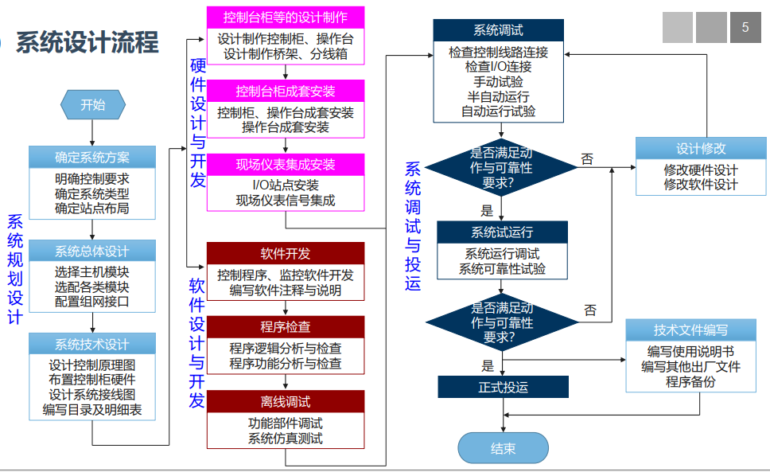

## 管道仪表流程图简介

- 管道仪表流程图（P&ID，Piping and Instrument Diagram）  ，又称工艺安装流程图，该图是自控工程设计的核心内容

  P&ID图的关键要素：

  - 设备：容器，储罐，成套设备（如换热器、锅炉、压缩机组等），阀、泵、机械臂等执行器……，注明设备位号和主要规格和设计参数

  - 配管：工艺物料管线、公用工程管线（供热、供气、供电），注明管口尺寸、位置、连接方式（如法兰面形式和法兰压力等级）等信息

  - 仪表：各种检测、控制仪表、按规定字母、数字组成仪表位号表示仪表的功能等信息

    特殊的设计及安装要求，如开/停车、联锁控制、特殊设备或管件等

- 仪表、设备位号

  位号由**字母代号组合和回路编号**两部分组成

  字母代号中的第一位字母表示被测量，后继字母表示仪表的功能

  回路编号由**工序号和顺序号**组成，一般用三位至五位阿拉伯数字表示

  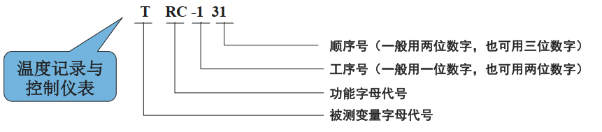

  - 字母代号

    

  - 图形代号

    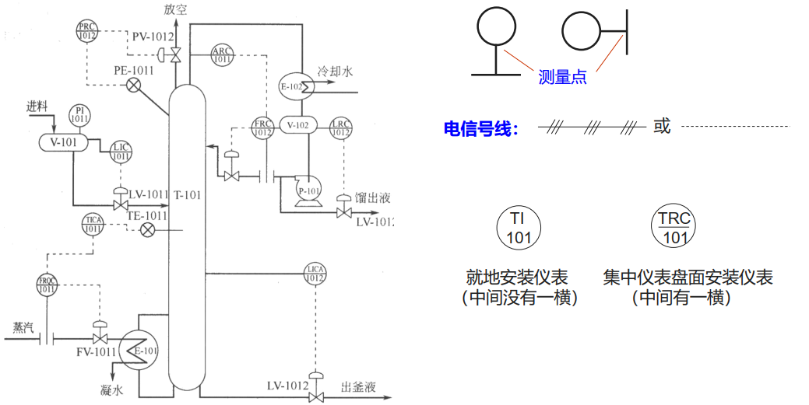

## 控制系统的抗干扰设计

1. 干扰的类型

   干扰（噪声） 是指对系统运行带来不利影响的其他因素

   | 电子噪声 | 固有存在，程度不一                                         | 优化设计           |
   | -------- | ---------------------------------------------------------- | ------------------ |
   | 电磁干扰 | 只要有电场或磁场存在，就会对电子线路产生电磁干扰，很普遍   | 电磁兼容设计       |
   | 机械干扰 | 机械振动或冲击，电气参数参数发生可逆或不可逆的改变         | 防振、避振         |
   | 热干扰   | 温度变化导致器件参数发生变化（温漂），或产生附加的热电势   | 恒温、对称、补偿   |
   | 光干扰   | （特定波长）光线作用激发出电子-空穴对改变载流子密度        | 对光敏元件作光屏蔽 |
   | 湿度干扰 | 改变绝缘体绝缘强度、电介质介电常数等，间接引起电气特性变化 | 浸漆、树脂封灌等   |
   | 化学干扰 | 化学腐蚀；电化学反应形成化学电势                           | 密封、清洁         |
   | 雷电干扰 | 概率不大，后果很严重                                       | 防雷               |

2. 干扰的主要耦合方式

   - 电源线耦合

     电源容易夹带纹波，电源是仪表系统中最主要的干扰源

     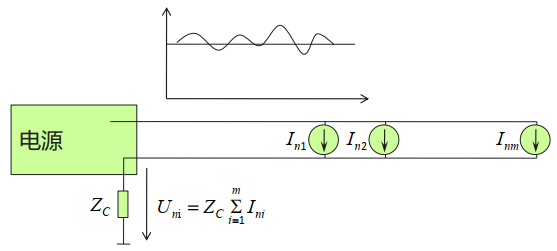

     解决方法：

     - 选用高品质电源
     - 选用更小内阻的电源
     - 在敏感负载前加装电源滤波器
     - 不同负载尽可能分开供电

   - 公共阻抗耦合

     就是多个电路通过共有阻抗造成的干扰耦合，最容易产生公共阻抗耦合的地方有：公共接地电阻/电感，公共电源内阻

     核心思想：减小公共阻抗，减小电源内阻

     模数混合系统更需要注意公共阻抗问题！  数字系统中的0，1变换在回流地端上会产生高频噪声，因此模数混合系统的数字地与模拟地应作分类布局，最后将数字地与模拟地汇接到电源的地端上

   - 串扰耦合（感性/容性耦合）

     互感，分布电容，减小线-线串扰耦合主要措施：

     - 增加导线间距、减小平行走线长度；

     - 分类走线：强电vs弱点；高频vs低频；模拟vs数字

     - 靠近地面或大型导体构件

   - 电磁场耦合

3. 几种常用的抗干扰技术

   - 外壳（柜体）屏蔽逻辑

     屏蔽的目的
     - 衰减对目标对象的干扰能量

     抑制电场干扰和抑制磁场干扰是有不同的

     - 电场干扰：反射为主，屏蔽体需要接地，电场屏蔽适宜材料为良导体，与屏蔽体厚度关系不大，高电压、小电流干扰源，以电场干扰为主

     - 磁场干扰：吸收为主，理论上可不接地，磁场屏蔽适宜材料为高导磁率材料，与厚度关系很大。低电压、 大电流干扰源， 以磁场干扰为主

   - 电缆屏蔽与接地

     - 屏蔽电缆：用金属丝网、 金属箔层作为屏蔽层包裹芯线， 主要用于信号线传输
     - 铠装电缆：用钢带、 钢丝、 铝带、 铝管等将芯线包起来， 多用于电力线；抗拉、 抗压性好

     绝大多数干扰通过导线传播和辐射的； 低电平信号对外部干扰一般都是很敏感的

     电缆屏蔽的一般性结论：

     - 屏蔽电缆的屏蔽层**不能不接地**；不接地，还不如选用非屏蔽电缆（屏蔽层引入干扰）

- 屏蔽层有三种接地方式：

  - 单端接地：适用于电场、远场干扰的屏蔽；

  - 两端接地：适用于磁场干扰，通过减小感应面积减小磁场耦合电压；两端接地应注意等电位要求

  - 混合接地：可抑制低频和高频电场干扰

 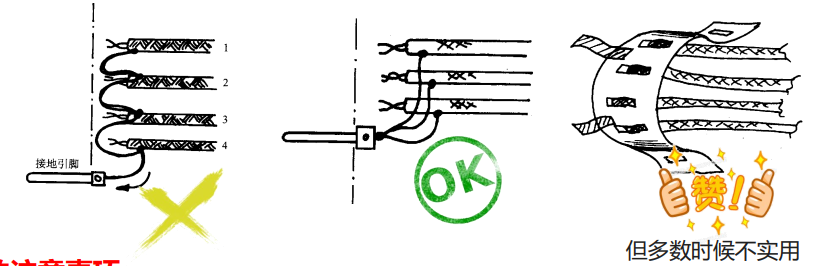

 布线小知识

- 布线要尽量短，但要留有裕量（维修改造用，不需要留太多）
- 分类走线：弱电线路和强电线路必须分开；直流和交流、模拟和数字最好分开，至少留点距离

  - 静电防护

     静电来自两种材料的摩擦、 碰撞、 剥离（接触后分离） 的电荷积聚

     随着芯片集成度增高， 其抗静电能力越来越低， 有些芯片被手触摸就可能烧毁，静电感应对**高输入阻抗电路**的影响尤为显著

     静电防护的主要措施

    - 【避免】 系统表面尽可能平滑， 防止静电积聚；避免摩擦起经典， 如化纤类服装；
    - 【疏导】 完全避免不可能， 可在工作台、 地面铺设防静电材料， 穿到防静电服和鞋袜，带防静电腕带；
    - 【中和】 如果疏导还不够， 还可以加装离子风机、 离子风枪来中和静电荷
    - 【其他】 环境保持一定湿度， 可降低静电影响

  - 接地

     接地：将一个点与某个电位基准面（通常是指大地） 用导体连接起来建立低阻导电通道尽管大地为非良导体， 但容量很大， 可把土壤地层理解为等电位面， 作为系统的基准电位。两种类型的接地：

    - 保护地：防雷接地（瞬时高电位、 大电流的快速泄放）保护接地（大功率设备防止电荷大量积累、 绝缘下降等引起的风险）
    - 工作地：信号基准地、 干扰抑制接地

     接地方式：单独接地、 等电位系统、 混合接地系统

     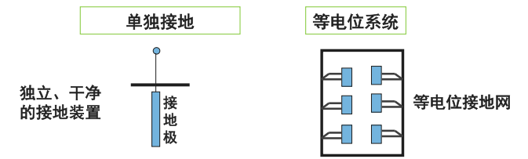

     内部连接注意事项

    - 控制系统的工作地和保护地不能在“柜内”混用

    - 应强调“分类汇总”，汇总点离地的接入点愈近与好，且R4越小越好

    - 控制系统的接地电阻通常要求≤4Ω

    - 在各类接地联结中严禁接入开关或熔断器

    - 一个回路中有多个接地点的，应防止直接相连（加隔离装置），避免地电位差的影响

  - 防雷技术

     防雷的本质就是浪涌抑制，在大干扰进入设备前将能量泄放至大地

     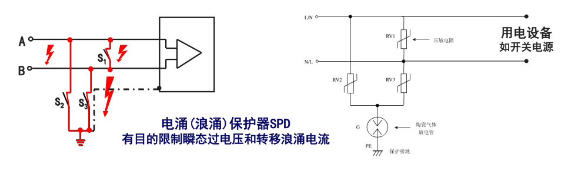

     电涌(浪涌)保护器SPD有目的限制瞬态过电压和转移浪涌电流，一个浪涌抑制器件内至少需要一个非线性器件

     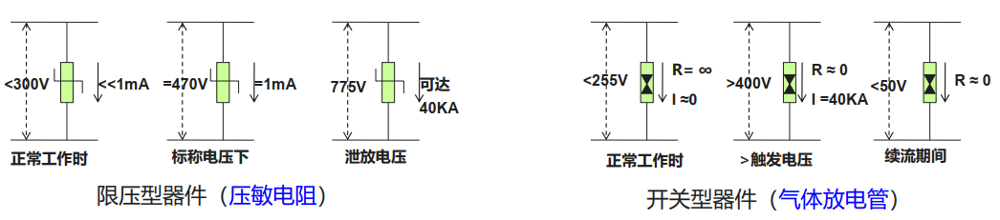

     开关型器件不能安装在火线与零线、火线与地线之间!

# 自动化若干前沿问题

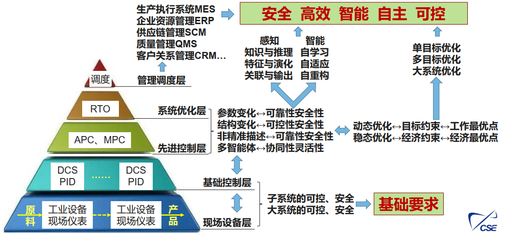

# 期末

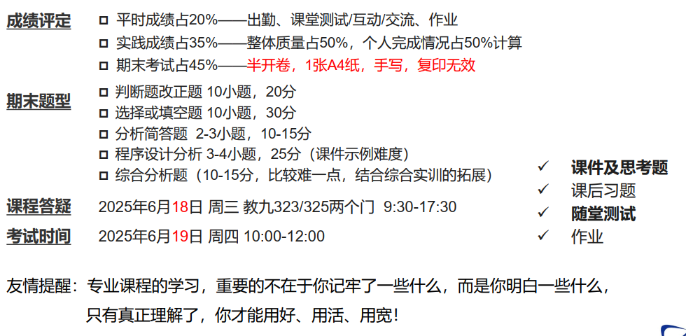

看ppt，考好多概念细节，两年前是这样的

- 复习笔记：[计算机控制系统设计与实践(计控)复习笔记(A4原型） - CC98论坛](https://www.cc98.org/topic/5645283)
- [计算机控制系统设计与实践 2023-2024春夏 回忆卷 - CC98论坛](https://www.cc98.org/topic/5925877)

# References

- [云高天遥 - A4原型](https://www.cc98.org/topic/5645283)
- [Healor - A4](https://www.cc98.org/topic/5925911)

- [Rainbow0 - A4](https://www.cc98.org/topic/5658322)

- 历年卷
- [计算机控制系统设计与实践 2023-2024春夏 回忆卷 - CC98论坛](https://www.cc98.org/topic/5925877)

- [计算机控制系统设计与实践（计控）22-23春夏回忆卷 - CC98论坛](https://www.cc98.org/topic/5644108)

- [计算机控制系统设计与实践（计控）21-22春夏回忆卷 - CC98论坛](https://www.cc98.org/topic/5353159)
