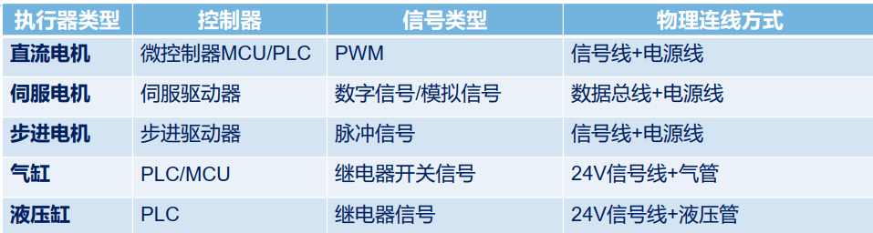
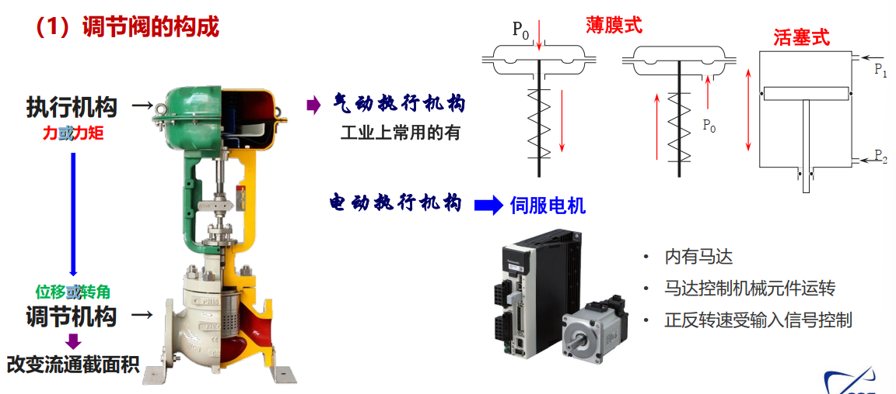
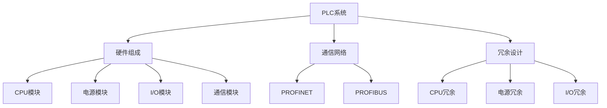
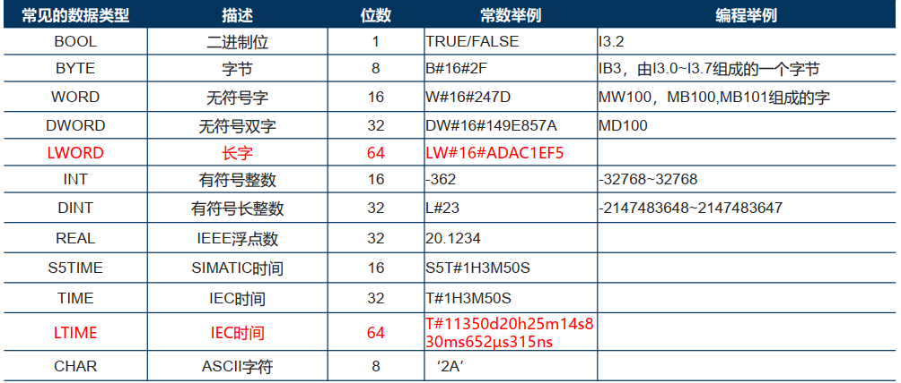
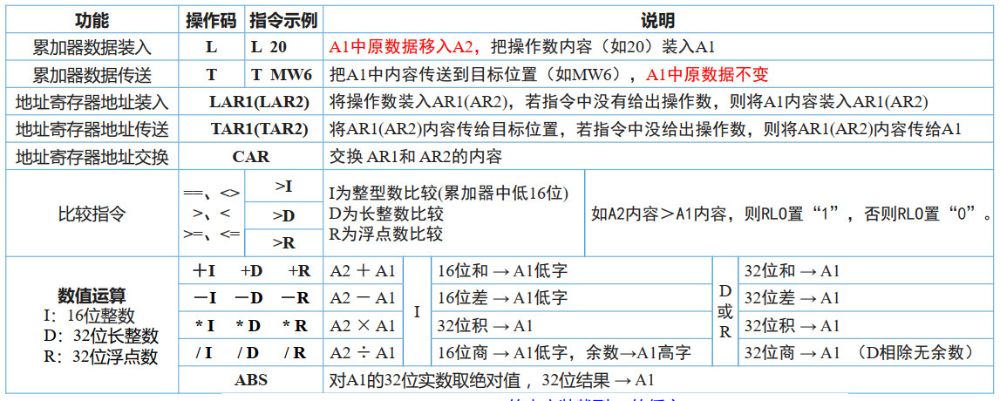
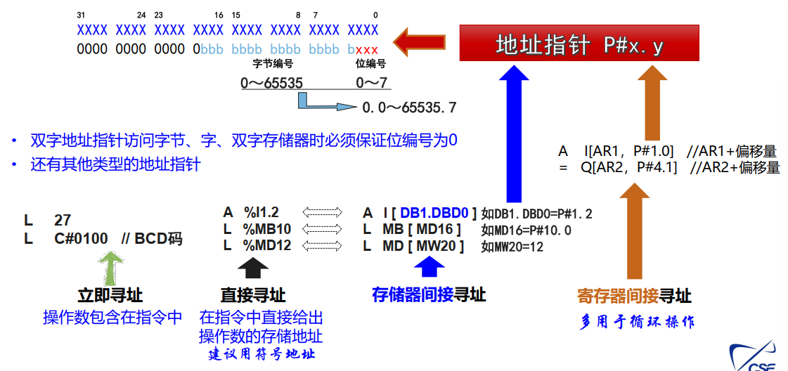
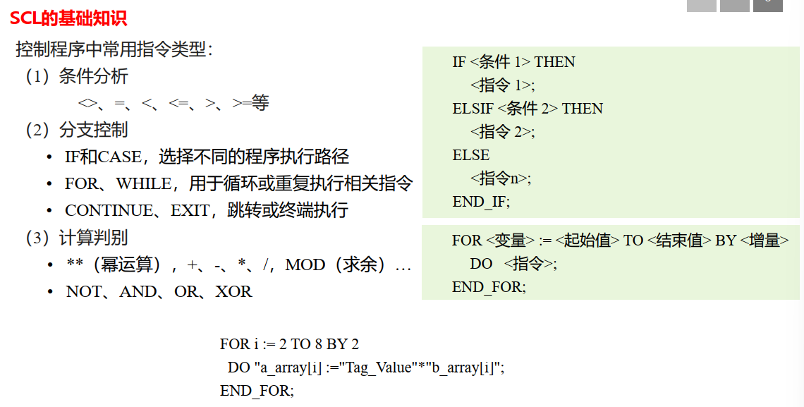

# Main Takeaway

嵌入式+传感+一点计网

<!--more-->

将所学相关课程内容串起来，能设计出满足需求的计算机控制系统  

# CH1 计算机控制系统概述

# CH2 检测仪表原理与选型

## 检测仪表概述

### 仪表分类与信号制

### 表防爆与防护

### 变送器基本工作原理

变送器是将各种工艺参数转换成统一的**标准电信号**

### 信号类型及仪表调校

信号连接方式：四线制与二线制

模拟式仪表、HART仪表和数字式仪表

- **模拟式仪表** ：基本的测量和显示功能，通常没有远程监控或诊断能力。
- **HART仪表** ：除了基本的测量功能，还支持远程配置、诊断和通信。
- **数字式仪表** ：提供丰富的功能，包括远程监控、数据分析、自诊断和通信能力。

## 变送器概述

## 检测仪表选型

- 选型若干要点

  量程（合适的工作点）、准确度（够用就好）  

- 仪表材料选择及处理

  酸碱腐蚀、氢腐蚀；特殊介质；高温、真空等特殊要求  

- 仪表环境条件

- 输出信号类型选择

# CH3 执行器

## 概述

- 作用：接收控制信号， 将能量转换为物理机械运动

  通常是控制系统**最薄弱**的环节  

- 分类

  

- 调节阀正反作用：负反馈

## 阀门

### **调节阀**

- 机构特性

  

- 流量特性

  流量方程和流量系数$K_V$

- 选型与安装

### 开关阀

### 数字阀与智能控制阀

数字阀主要由流孔、阀体和执行机构三部分组成。每个流孔都有自己的阀芯和阀座。执行机构可以用电磁线圈，也可以用装有弹簧的活塞执行机构  

## 电机

- 开关控制
- 变频控制

## 其他辅助部件

- **安全栅**
- 显示仪表
- 电气转换元件
- 线缆与接线部件

# CH4 控制器

## 概述

- 控制器作用：得到偏差x，形成控制信号y，改变控制变量q
- 类型：
  - 按有无处理器分类：模拟式、数字式
  - 按系统结构分类：基地式、单元仪表式、系统式

- 功能

  

## 调节规律

- 正反作用

- PID离散化

  增量式PID算法：计算量少，存储空间少，输出平稳

  离散化方法：

  - 前向差分$s=\frac{z-1}{T}$
  - 后向差分$s=\frac{1-z^{-1}}{T}$

> $U_T$为正向端口，$U_F$为反向端口
>
> 通过设计$\Delta R$来实现不同值的映射，约$20\to 40Ω$，相比其他的kΩ，所以可以有上述**约等于**
>
> 为什么还要用两只三极管复合连接？提高电流的放大功能

## 单元式控制器

- 模拟式调节器：模电
- 数字式调节器

## 可编程控制器PLC

- I/O接口魔窟啊哎：AI，AO，DI，DO

# CH5 PLC可编程控制器（一）

## 系统的组成与结构

1. S7系列PLC及其常用模块： CPU、电源、 I/O、接口模块等

2.  CPU： 基本性能（执行速率、 I/O接入能力）

   网通通信能力（以太网接口、 DP接口）

3.  SM531-AI模块： 软件设置（四大类型）

   工程化转换--SCALE函数

   需注意的几个现场问题

4. SM532-AO模块： 软件设置（I、 V）

   工程数据反变换—UNSCALE函数，其他没什么要特别注意的

5. SM521-DI模块： 2种输入信号（直流、交流）

   输入不同制式的0/1信号（继电器转换） PNP/NPN（考虑不到位会增加不少麻烦）

6. SM522-DO模块：晶体管输出（直流）、晶闸管（交流）、继电器输出（触点）输出不同制式的的0/1信号（继电器转换，驱动不同负载）

## 硬件配置与扩展

电源模块

| 类型   | 输入电压    | 输出功率 | 安装方式     |
| ------ | ----------- | -------- | ------------ |
| PM1907 | 120/230V AC | 60W      | 导轨安装     |
| PS2507 | 24V DC      | 150W     | 背板总线连接 |

冗余设计

# CH6 PLC可编程控制器（二）

## 数据类型和地址区

S7 CPU有7个主要寄存器

数据块：数据块是PLC最主要的数据存储区，需要用户自己定义，相当于C语言全局变量

## 指令与编程

IEC 61131-3  

间接寻址，寻址方式：

位逻辑运算指令

定时器：要求掌握 SS和TON的用法、时序等

## 程序结构简介

# CH7 PLC可编程控制器（三）

## 应用案例研讨

1. 电机的优先启动控制

2. 分析控制逻辑的功能  

   

3. 通风机的监控

4. 阀泵联动控制（必要的延时）

   

5. 原料输送系统（延时开关）

# 期末

看ppt，考好多概念细节，两年前是这样的

- 复习笔记：[计算机控制系统设计与实践(计控)复习笔记(A4原型） - CC98论坛](https://www.cc98.org/topic/5645283)

- [计算机控制系统设计与实践 2023-2024春夏 回忆卷 - CC98论坛](https://www.cc98.org/topic/5925877)

- [2022-2023学年春夏学期 控制学院《数字图像处理与机器视觉》期末考试 回忆卷 - CC98论坛](https://www.cc98.org/topic/5644557)

# References

- 

