# Main Takeaway

计算机网络原理


<!--more-->

20作业（5，纸质）+10小测（6+）+20实验（3）+50考试（可带A4的）


# Roadmap

introduction to networking

hosts——communication links——Internet core——communication links——hosts

- 应用层
- 传输层：进程到进程P2P
- 网络层：端到端E2E
  - 数据平面
  - 控制平面
- 数据链路层：点到点
- 局域网

> 带宽 bps bits per second


## Internet

A Nuts-and-Bolts Description

- 网络
  - 节点
    - 主机节点（方，端系统end system/host）
    - 中转节点（圆，分组交换设备packets（路由器和交换机））

  - 边：通信链路（接入网链路，主干链路）——传输速率=带宽（bps）
  - 协议protocols：控制发送、接收消息

- Internet："network of networks"
  - Internet standards
    - RFC:request for comments,包含 Internet 的技术规范和组织说明
    - IETF:Internet Engineering Task Force互联网工程任务组（一个组织,发布RFC）

- 互联网是分布式的互联网进程 + 为分布式应用提供服务的基础设施

> ISP全称：Internet Service Provider，中文名叫互联网服务提供商
>
> P2P 全称是 Peer to Peer ,”点对点“。区别于现在诸多 ”C/S“（客户端/服务器）模式


## Network Edge

主机+应用程序（客户端+服务器）

应用之间的交互P2P,C/S

面向连接的交互方式：交互前分配资源（通信前握手——连接建立状态）

- 端系统（主机end system/host）
- C/S（clients/servers mode）
- P2P（peer to peer）分布式

- TCP(transmission control protocol)传输控制协议，有连接
  - 可靠、按顺序——确认和重传
  - 流量控制——发送方不会淹没接收方
  - 拥塞控制——网络拥塞时，发送方降低发送速率
- UDP(user datagram protocol)用户数据报协议，无连接，不握手

## Network Core

互连着的路由器，网络的网络

关键功能：

- 路由：决定分组采用的源到目标的路径
- 转发forwarding：将分组从路由器的输入链路转移到输出链路

> packer-switching:store-forward


- 线路交换

  > 端到端的资源被分配给从源端到目标端的呼叫 “call”  (建立时间长)

  - call后信令分配线路片pieces（独享资源（如带宽））——保证性能

  - 为呼叫预留端——端资源

    > 如果某个呼叫没有数据，则其资源片处于空闲状态（不共享），浪费
    >
    > 将带宽分成片
    >
    > - 频分FDM(Frequency-division multiplexing)
    >
    > - 时分TDM(Time-divisionmultiplexing)时隙 slot
    >
    > - 波分WDM(Wave-divisionmultiplexing)光纤通讯
    > - 码分CDMA

- 分组交换：资源共享，按需使用（允许更多用户使用网络）；延迟比线路交换大，排队时间（需要拥塞控制）；TDM

  - 传输时使用全部带宽

  - 数据被分组

  - 每个节点存储——转发（hop）

  - 排队延迟和丢失：路由器缓存用完了，分组就会被抛弃

  - 分类

    - 数据报网络datagram——无连接

      不需要握手，每次跳跃都携带目标完整地址决定下一跳

    - 虚电路网络

      每个分组带标签，标签决定下一跳

      在呼叫建立时决定路径，在整个呼叫中路径保持不变

      路由器维持每个呼叫的状态信息（徐维护）

## Access Networks and Physical Media

接入网络和物理媒体

- modem调制解调器

- DSL(digital subscriber line)接入网——采用现存的线

  - 线缆网络FDM：

- WLANs:wireless local area networks

  - 802.11b/g/n(WiFi):11,54,450 Mbps transmission rate

  - WAN(Wide Area Network)

    LAN(Local Area Network)

    MAN(Metropolitan Area Network)

    PAN(Personal Area Network)

- 物理媒体

  - 导引型媒体guided media：同轴电缆、光纤（玻璃光纤）、 双绞线（TP：抗扰动）

    > 导线的天线效应；光纤无电磁干扰，不能

  - 非导引型媒体unguided media：开放的空间传输电磁波或者光信号
  
    

> 在数学计算中有这样一个结论，即以相同半径的圆形覆盖平面，当圆心处于周围各六边形的正中心时，所用圆的数量最少。 所以基站覆盖范围是呈六边形分布的，每个六边形的中心设有一个基站，这样最节约资源。 IT之家获悉，**由于形成的网络覆盖在一起，形状酷似蜂窝**，因此被称作蜂窝网络

- data center networks

## Internet structure and ISP

- ISP：Internet Service Provider  ——端系统通过接入ISPs (Internet Service Providers)连接到互联网

  global ISP

- ICP：Internet content provider——google

- IXP：Internet exchange point，多个对等ISP互联互通之处，通常不涉及费用结算

- ICP自己部署专用网络，同时和各级ISP连接

- POP:高层ISP面向客户网络的接入点，涉及费用结算，eg:一个低层ISP接入多个高层ISP，多宿（multi home）


> tier:（多层中的）一层

## Delay, Loss, and Throughput in Packet-Switched Networks

reason:分组到达链路的速率超过了链路输出的能力


### Delay

- 节点处理延时**Processing Delay**

- 排队延时**Queuing Delay**

- 传输延时**Transmission Delay**:：time=R/L,R=链路带宽,L=分组长度

  流量强度：La/R,a=分组到达队列的平均速率（强度must<1）

- 传播延时**Propagation Delay**


- Traceroute诊断程序：提供从源端，经过路由器，到目的的延时测量

  3个packets，间隔计时

  ```
  on Linux:
  traceroute -help
  * * * 			//means no response
  
  on Windows:
  tracert ...
  ```

  [traceroute命令详解 - 马昌伟 - 博客园 (cnblogs.com)](https://www.cnblogs.com/machangwei-8/p/10353279.html)

- throughput吞吐量：在源端和目标端之间传输的速率（数据量/单位时间）

  平均吞吐=min{R1,R2...}——瞬间和长时间
  
  > The bottleneck link is the one with the lowest transmission rate.
  >
  > $throughput=\frac{file\  size}{transmission\ time}$​
  >
  > 

## Protocol and Service

层次化方式实现复杂网络功能:

- 将网络复杂的功能分层功能明确的层次，每一层实现了其中一个或一组功能，功能中有其上层可以使用的功能：服务

- 本层协议实体相互交互执行本层的协议动作，目的是实现本层功能，通过接口为上层提供更好的服务

- 在实现本层协议的时候，直接利用了下层所提供的服务

- 本层的服务：借助下层服务实现的本层协议实体之间交互带来的新功能（上层可以利用的）+更下层所提供的服务


服务访问点 SAP (Services Access Point)：上层使用下层提供的服务通过层间的接口—地点

协议(protocol)：对等层实体(peer entity)之间在相互通信的过程中，需要遵循的规则的集合，水平

服务(service)：底层向上层提供的通信能力，是通过原语(primitive)来操作的，垂直

- 面向连接的服务( Connection-oriented Service)：两个通信实体为进行通信而建立的一种结合

  适用范围：对于大的数据块要传输;不适合小的零星报文；保序

- 无连接的服务(Connectionless Service)

  适用范围：适合传送零星数据；不可靠、可能重复、可能失序

`DU: data unit` 数据单元


## Service Models

TCP/IP 5层模型


ISO/OSI：表示层，会话层


- **会话层：**

虽然已经可以实现给正确的计算机，发送正确的封装过后的信息了。但我们总不可能每次都要调用传输层协议去打包，然后再调用IP协议去找路由，所以我们要建立一个自动收发包，自动寻址的功能。于是会话层出现了：它的作用就是建立和管理应用程序之间的通信。

- **表示层：**

表示层负责数据格式的转换，将应用处理的信息转换为适合网络传输的格式，或者将来自下一层的数据转换为上层能处理的格式。

封装和解封装：


- 应用层：报文message
- 传输层：报文段segment：TCP段，UDP数据报
- 网络层：分组packet（无连接方式F：数据报datagram）
- 数据链路层：帧frame
- 物理层：位bit

## Security

malware恶意软件：指那些被设计用来对计算机系统、网络或用户造成伤害、破坏或盗取信息的软件。常见的恶意软件包括病毒、蠕虫、木马、间谍软件等恶意软件：指那些被设计用来对计算机系统、网络或用户造成伤害、破坏或盗取信息的软件。常见的恶意软件包括病毒、蠕虫、木马、间谍软件等

the difference between virus, worm, Trojan house

|                             病毒                             |                  蠕虫                  |                          特洛伊木马                          |
| :----------------------------------------------------------: | :------------------------------------: | :----------------------------------------------------------: |
| 病毒是一种软件或计算机程序，它自身连接到另一个软件或计算机程序以损害计算机系统。 |  蠕虫会自我复制，导致计算机系统变慢。  | 特洛伊木马而不是复制捕获有关计算机系统或计算机网络的一些重要信息。 |
|                       病毒会自我复制。                       |           蠕虫也会自我复制。           |                 但是特洛伊木马不会自我复制。                 |
|                    病毒无法通过远程控制。                    |         蠕虫可以通过远程控制。         |          像蠕虫一样，特洛伊木马也可以通过远程控制。          |
|                     病毒的传播速度适中。                     | 而蠕虫的传播速度比病毒和特洛伊木马快。 |         与病毒和蠕虫相比，特洛伊木马的传播速度较慢。         |
|                  病毒的主要目的是修改信息。                  |     蠕虫的主要目的是吃掉系统资源。     |               特洛伊木马的主要目的是窃取信息。               |
|                 病毒是通过可执行文件执行的。                 |     蠕虫是通过系统中的弱点执行的。     |           特洛伊木马通过程序执行并解释为实用软件。           |

## History


# Application layer


## Principles

协议最多——学习协议的知识（more important）

- HTTP
- SMTP

C/S and P2P or hybrid paradigm（典范，范例；）

- C/S
  - server:permanent IP address  
  - clients
- P2P

- Processes communication

  > process: program running within a host  
  >
  > client process and server process

- socket（套接字，像门一样）：用来编程的，控制消息发送（应用层和传输层之间）——需要IP(32-bit)+port number（寻址过程）

  进程从socket中收发信息

- Internet transport protocols services  :[TCP/UDP](#mark1)


## Web and HTTP,FTP

- objects

- web page consists of **base HTML-file** which includes several **referenced objects**, each addressable by a URL

  > 一个超链接不算

### HTTP

- HTTP: hypertext transfer protocol

  - C/S model

  - uses TCP——以下是过程request and response（一问一答）
    - client initiates TCP connection (creates socket) to server, port 80
    - server accepts TCP connection from client
    - HTTP messages (application-layer protocol messages) exchanged between browser (HTTP client) and Web server (HTTP server)
    - TCP connection closed
    
  - stateless：server maintains no information about past client requests

    > 接受cookies会记录,web cache
    >
    > [state](#mark2)

  - two types

    > RTT：循环时间（Round-Trip Time）to and back
    >
    > RTT计算方法：[各种RTT的计算_rtt计算-CSDN博客](https://blog.csdn.net/weixin_44677382/article/details/105999368)
    
    |                   **Persistent HTTP** 1.1                    |                   **Non-Persistent HTTP**                    |
    | :----------------------------------------------------------: | :----------------------------------------------------------: |
    | The server leaves the connection open after sending a response. |               **Requires 2 RTTs per object.**                |
    | Subsequent HTTP messages between the same client/server are sent over an open connection. |             OS overhead for each TCP connection              |
    | The client sends requests as soon as it encounters a referenced object. | Browsers often open p**arallel TCP connections** to fetch referenced objects. |
    |   **As little as one RTT for all the referenced objects.**   | Here, at most one object can be sent over one TCP Connection. |

> FCFS(first-come-first-served scheduling),小对象等待在大对象后面


reponse status codes


[Windows nc命令用法介绍 - 知乎 (zhihu.com)](https://zhuanlan.zhihu.com/p/653076851#:~:text=nc,(netcat)是一种网络工具，可用于在网络上读、写数据，支持TCP、UDP、Unix域协议套接字等，并且具有端口扫描功能。)

- Web caches——proxy

  

  Goal: satisfy client requests without involving origin server  

  有就直接用cache，没有就从origin pull

  - reduce response time for client request
  - reduce traffic on an institution’s access link
  - Internet is dense with caches

  cache更新数据

  

  

- HTTP1.1：持久连接：在一个TCP连接上可以发送多个请求/响应对

  [HTTP协议：持久连接、非持久连接_http协议中的持久连接和非持久连接有什么区别](https://blog.csdn.net/neninee/article/details/79634187)
  
- HTTP/2——Key goal: decreased delay in multi-object HTTP requests  

  objects divided into frames, frame transmission interleaved；mitigating HOL blocking  
  
  用户可指定优先级

> HOL blocking(**Head-of-Line blocking**):当单个（慢）对象阻止其他/后续的对象前进时

- HTTP/3——UDP：adds security, per object error- and congestioncontrol (more pipelining) over UDP  

`Date`头字段表示的是服务器生成响应的日期和时间，而不是响应中对象的最后修改时间。`Last-Modified`头字段才是用于指示响应中对象的最后修改时间。

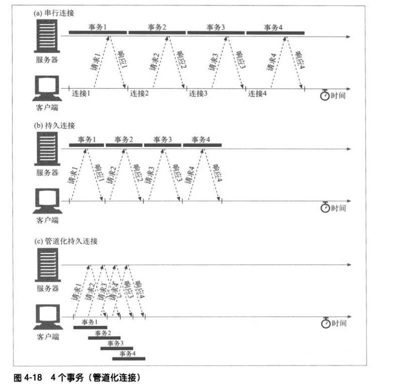

> 问HTTP的persistent连接：分两种情况
>
> (1)无pipelining：2+1
>
> (2)有pipelining：2+n
>
> **带流水线，所有引用到的对象一共只经历1个RTT的延时，而不带流水线，每个引用到的对象各有1个RTT的延迟**


### FTP

FTP：允许TCP/IP网络上的两台计算机之间进行文件传输。而FTP服务是基于FTP协议的文件传输服务。工作时，一台计算机上运行FTP客户端应用程序，另一台计算机上需要运行FTP服务器端程序。只有拥有了FTP服务，客户端才能进行文件传输

FTP使用了两个并行的TCP来传输文件：一个是控制连接（port:21，out of band），一个是数据连接(port:20)。

**FTP支持两种方式的传输：文本（ASCII）方式和二进制（Binary）方式。**

**FTP有两种传输模式——主动（FTP Port）模式和被动（FTP Passive）模式**


## E-mail,SMTP,IMAP

- Email

  - user agents 

  - mail servers
    - mailbox存接收的mail
    - message queue发mail
    - SMTP protocol between mail servers to send email messages  
  - simple mail transfer protocol: SMTP


- SMTP：simple mail transfer protocol  
  - TCP
  
  - three phases of transfer 
    - SMTP handshaking (greeting) 
    - SMTP transfer of messages 
    - SMTP closure  
    
  - command/response interaction (like HTTP)  
    - commands: ASCII text
    
      HELO,MAIL FROM,RCPT to,QUIT
    
    - response: status code and phrase  
    
  - 


- IMAP:Internet Mail Access Protocol [RFC 3501]: messages stored on server, IMAP provides retrieval, deletion, folders of stored messages on server

- POP3 protocol


## DNS

[转载：从理论到实践，全方位认识 DNS （理论篇） | Ephen‘s Blog](https://ephen.me/2015/dns-theory/)

the domain name system——humongous distributed database  


- root

- top level domain(TLD) servers

- Authoritative  DNS servers

  organization’s own DNS server(s), providing authoritative hostname to IP mappings for organization’s named hosts

  can be maintained by organization or service provider  

两条：知alias找真名，真名的IP address 

> 如果就是真名，直接找IP address
>
> include load balance——负载均衡；DNS负载均衡是一种通过DNS服务器将用户的请求分发到多个服务器上，以实现服务器负载均衡的技术。它可以根据服务器的负载情况、地理位置、网络状况等因素，将用户的请求智能地路由到最合适的服务器上，从而提高系统的可用性和性能。

- iterated query:


- recursive query(递归询问)


> Time To Live——TLL:指一个数据包在经过一个路由器时，可传递的最长距离（跃点数）。每当数据包经过一个路由器时，其存活次数就会被减一。当其存活次数为0时，路由器便会取消该数据包转发，IP网络的话，会向原数据包的发出者发送一个ICMP TTL数据包以告知跃点数超限。其设计目的是防止数据包因不正确的路由表等原因造成的无限循环而无法送达及耗尽网络资源。

- caching DNS information

  once (any) name server learns mapping, it caches mapping,and immediately returns a cached mapping in response to a query（TLD typically）

  可能没及时更新

- DNS records

  DNS: distributed database storing resource records (RR)  

  RR format: (name, value, type, ttl)  

  

- DNS protocol messages  

  


- DNS security

  - DDoS attacks  

    > 分布式拒绝服务攻击：一种网络攻击手段，通过大量的恶意流量或请求来使目标服务器瘫痪，从而无法正常提供服务。

  - Spoofing attacks  

    > 欺骗攻击：一种网络攻击手段，攻击者伪装成可信任的实体，以获取敏感信息或破坏网络安全。

    拦截请求，返回错误信息

| 记录类型 | 含义                             |
| :------- | :------------------------------- |
| A        | 主机的IPv4地址                   |
| AAAA     | 主机的IPv6地址                   |
| NS       | 该域名所在域的权威域名服务器     |
| MX       | 接受特定域名电子邮件的服务器域名 |
| CNAME    | 当前域名的一个别名               |

## P2P applications

file distribution time

CS:


P2P


- 先把file分成chunks
- tracker:tracks peers participating in torrent  
- torrent: group of peers exchanging chunks of a file  

一些算法：


> optimistically unchoke新手保护机制
>
> tit-for-tat  争锋相对——higher upload rate: find better trading partners, get file faster !  


## video streaming and content distribution networks

开源——扩大

节流——压缩

- coding（编码实现）: use redundancy within and between images to decrease # bits used to encode image  ——spatial(within image),temporal(from one image to next  )
  - CBR（constant bit rate）：video encoding rate fixed  
  - VBR（variable bit rate  ）：video encoding rate changes as amount of spatial, temporal coding changes  

- main challenge

  server-to-client bandwidth will vary over time, with changing network congestion levels


Streaming multimedia: DASH  

intelligence” at client  : when/what encoding rate/where

Streaming video = encoding + DASH + playout buffering  

CDN:store/serve multiple copies of videos at multiple geographically distributed sites (CDN)  

subscriber requests content, service provider returns manifest  

- enter deep
- bring home


## socket programming with UDP and TCP

goal: learn how to build client/server applications that communicate using sockets 

socket: door between application process and end-end-transport protocol  

- UDP: unreliable datagram 

  one socket

- TCP: reliable, byte stream-oriented  ——streaming，不是包

  多个socket，开始是一个welcome socket提供另一个socket窗口 然后client与新的socket建立联系


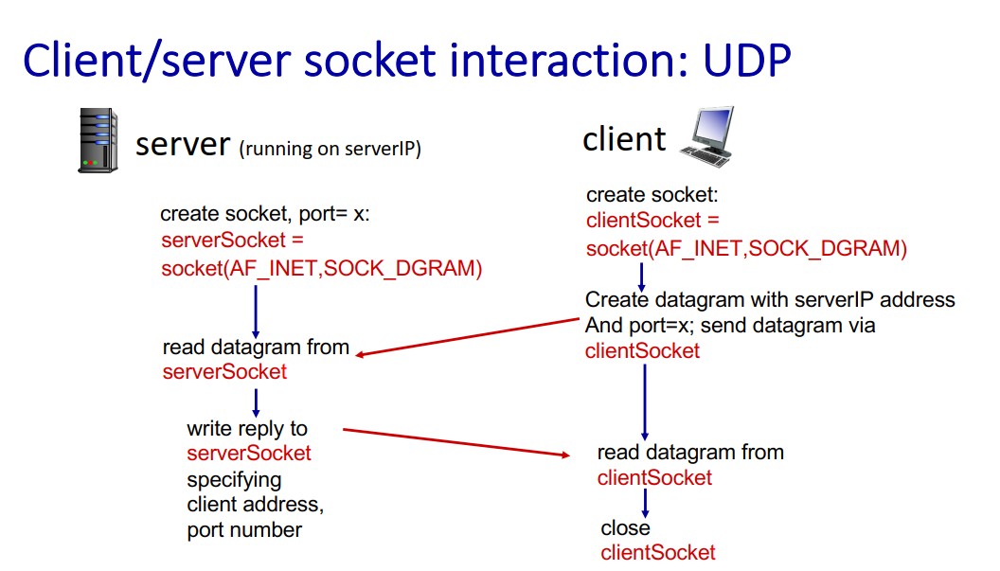


# Transport layer

本质：提供进程通信

运输层则负责接收不同进程的数据交给网络层，同时把网络层的数据拆分交给不同的进程。从上往下汇聚到网络层，称为**多路复用**，从下往上拆分，称为**多路拆分** 。

## Multiplexing and demultiplexing  

- **connectionless**：based on segment,datagram,header field values

- host uses **IP addresses** & **port numbers** to direct segment to appropriate socket

  

- UDP: demultiplexing using destination port number (only)  

- TCP: demultiplexing using 4-tuple: source and destination IP addresses, and port numbers

  demux: use all four values to direat segment to appropriate socket  

- Multiplexing/demultiplexing happen at all layers  

> 一个进程能创建很多socket，一个socket也可以对应很多进程
>
> each socket associated with a different connecting client

## Principles of reliable data transfer

[rdt1.0,rdt2.0,rdt2.1,rdt2.2,rdt3.0-CSDN博客](https://blog.csdn.net/qq_33936481/article/details/53152903)


 Principles of reliable data transfer (rdt):

- no bit errors/no loss of packets/no repeat：

- use finite state machines (FSM,有限状态机) to specify sender, receiver

- rdt1.0：最简单，reliable transfer over a reliable channel  

- rdt2.0：channel with bit errors——checksum

  cover：ACKs/NAKs，显示告诉sender 接收OK or not——retransmit

  fatal flaw：应答被毁坏了（stop and wait）,重复duplicates(add sequence number)

- rdt2.1：属于等停协议，就是说要按顺序传送分组，上一个分组确认传达后才会开始下一个分组。sequence number

- rdt2.2：一次使用两种确认讯息处理起来比较费力，因此2.2中移除NAK的讯息，在ACK中加入编号 就可以达到确认与否认的效果

- rdt3.0：3.0同时考虑到封包遗失与资料错误的情形，除了使用ACK机制，另外在传送端多了**倒数计时器**，封包送出去如果超过时间仍未收到ACK或是收到不正确编号的ACK，则再送出封包一次。——效能低

- Stop-and-Wait 与 Pipelined Protocol，可以让传送端同时传送多个封包不需等待确认相对的，传输端与接收端都必须增加封包的暂存空间与序列号码。当其中的封包出现错误时有不同的回覆方法，主要有Go-Back-N(GBN)与Selective Repeat(SR)两种方法

  - Go-Back-N(GBN)：传输多个封包必须有个暂存的区域，暂存的区域中存在着窗格大小(Window Size) N，存放着各种封包(已确认、已送出但未收到ACK、未送出的封包等等)。
  - Selective Repeat(SR)：GBN的传送方法往往会造成不必要的重复，因此SR的传送方法就是只针对未收到的封包做重新传输的动作。首先规划出大小为N的窗格来限制大小，窗格的基底会停留在最近一个尚未收到ACK的封包区域，当封包时间逾时会重新送出封包，直到收到该封包的ACK 窗格基底才会往前移动。

- flow control：

- 虽然TCP接收端有缓冲区，但有时候应用程序读取讯息的速度小于传输端传送讯息的速度，假如缓冲区满了还继续传资料过来，会造成缓冲区溢位的情况，为避免此状况，设了一个”receive window(接收窗格简写成rcvWindow)”变量，用来记录缓冲区剩余的空间有多少。

  当接收端收到讯息后，会回传给传送端rcvWindow的数值，如果rcvWindow=0，传送端会停止传输资料但这个方法会造成问题，假设停止后 接收端一直没讯息通知传送端，此时传送端不会运作，而接收缓冲区也是空的，资料传输停止。
  因此当接收端rcvWindow=0时，传送端会持续传送一个1byte的区段给接收端 以确认缓冲区可否继续接收资料。

GBN and SR

[【动图讲解】计算机网络之回退N步与选择重传-CSDN博客](https://blog.csdn.net/qq_44807642/article/details/103054914)

> 可以看到如果在接收过程中有丢失发生，选择重传SR的效率是不如回退N步GBN的
>
> 单个分组的差错就能够引起GBN重传大量分组，许多分组根本没必要重传
>
> SR是对单个分组的确认

vmultiplexing/demultiplexing


## <a name="mark1">TCP/UDP</a>


> TLS加密


- UDP(User Datagram Protocol  )

  - unreliable,unordered delivery

  - 有了就发；connnectionless


  

  UDP has its plusses: 

  - no setup/handshaking needed (no RTT incurred) 

  - can function when network service is compromised
  - helps with reliability (checksum)

- use DNS/ SNMP/ HTTP/3——useUDO(add needed reliability in application layer /congestion control)


[图解计网|这篇TCP神总结，请务必收下！ - 知乎 (zhihu.com)](https://zhuanlan.zhihu.com/p/368661050)

可靠传输原理的重点总结一下有：**滑动窗口、超时重传、累积确认（接收方不需要逐个进行回复，而是累积到一定量的数据包之后，告诉发送方，在此数据包之前的数据全都收到）、选择确认、连续ARQ** 。

- TCP(Transmission Control Protocol  )

  - reliable,in-order delivery

  - congestion control：自己先数数到了自己再发

  - flow control:发送方发送数据的范围，需要考虑到接收方缓冲区的情况——滑动窗口（rcvbuffer）

    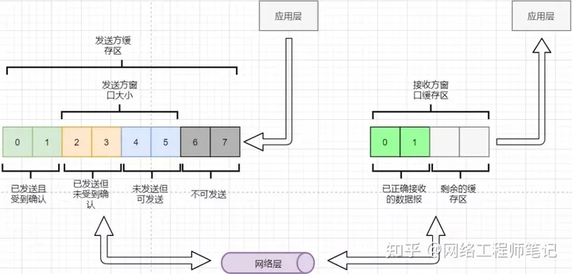

    - 发送方需要根据接收方的缓冲区大小，设置自己的可发送窗口大小，处于窗口内的数据表示可发送，之外的数据不可发送。
    - 当窗口内的数据接收到确认回复时，整个窗口会往前移动，直到发送完成所有的数据

  - connection-oriented  ：三次握手与四次挥手

    三次握手：

    

    1. 机器A发送syn包向机器B请求建立TCP连接，并附加上自身的接收缓冲区信息等，机器A进入SYN_SEND状态，表示请求已经发送正在等待回复；
    2. 机器B收到请求之后，根据机器A的信息记录下来，并创建自身的接收缓存区，向机器A发送syn+ack的合成包，同时自身进入SYN_RECV状态，表示已经准备好了，等待机器A 的回复就可以向A发送数据；
    3. 机器A收到回复之后记录机器B 的信息，发送ack信息，自身进入ESTABLISHED状态，表示已经完全准备好了，可以进行发送和接收；
    4. 机器B收到ACK数据之后，进入ESTABLISHED状态。

    四次挥手：

    

    1. 机器A发送完数据之后，向机器B请求断开连接，自身进入FIN_WAIT_1状态，表示数据发送完成且已经发送FIN包（FIN标志位为1）；
    2. 机器B收到FIN包之后，回复ack包表示已经收到，但此时机器B可能还有数据没发送完成，自身进入CLOSE_WAIT状态，表示对方已发送完成且请求关闭连接，自身发送完成之后可以关闭连接；
    3. 机器B数据发送完成之后，发送FIN包给机器A ，自身进入LAST_ACK状态，表示等待一个ACK包即可关闭连接；
    4. 机器A收到FIN包之后，知道机器B也发送完成了，回复一个ACK包，并进入TIME_WAIT状态

    *TIME_WAIT状态比较特殊。当机器A收到机器B的FIN包时，理想状态下，确实是可以直接关闭连接了；但是：*

    1. *我们知道网络是不稳定的，可能机器B 发送了一些数据还没到达（比FIN包慢）；*
    2. *同时回复的ACK包可能丢失了，机器B会重传FIN包；*

    *如果此时机器A马上关闭连接，会导致数据不完整、机器B无法释放连接等问题。所以此时机器A需要等待2个报文生存最大时长，确保网络中没有任何遗留报文了，再关闭连接*

    5. 最后，机器A等待两个报文存活最大时长之后，机器B 接收到ACK报文之后，均关闭连接，进入CLASED状态

  - full duplex data  

  - cumulative ACKs  ：TCP的ACK是累加的，receiver会发送期望的ACK number（前面已经收到的总的ACK+1）

    sender不管中间的ACK是否丢失，只是按照receiver反馈的expected ACK number来发送

  - pipelining  ：TCP congestion and flow control set window size

  - 面向字节流：把数据看成一个字节流，给他们标上序号之后分部分发送

    > 面向字节流的好处是无需一次存储过大的数据占用太多内存，坏处是无法知道这些字节代表的意义，例如应用层发送一个音频文件和一个文本文件，对于TCP来说就是一串字节流，没有意义可言，这会导致粘包以及拆包问题

  - TCP congestion control: AIMD  ——approach: senders can increase sending rate until packet loss(congestion) occurs, then decrease sending rate on loss event

    拥塞控制的重点有4个：**慢开始、快恢复、快重传、拥塞避免**

    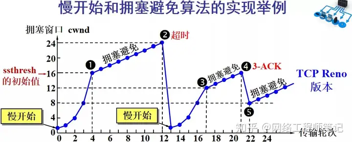
  
    - 最开始的时候，会把窗口设置一个较小的值，然后每轮变为原来的两倍。这是慢开始。
    - 当窗口值到达ssthreshold值，这个值是需要通过实时网络情况设置的一个窗口限制值，开始进入拥塞避免，每轮把窗口值提升1，慢慢试探网络的底线。
    - 如果发生了数据超时，表示极可能发生了拥塞，然后回到慢开始，重复上面的步骤。
    - 如果收到三个相同的确认回复，表示现在网络的情况不太好，把ssthresh的值设置为原来的一半，继续拥塞避免。这部分称为快恢复。
    - 如果收到丢包信息，应该尽快把丢失的包重传一次，这是快重传。
    - 当然，窗口的最终上限是不能无限上涨的，他不能超过接收方的缓存区大小。

    Explicit congestion notification (ECN)  

  - TCP fairness：Fairness goal: if K TCP sessions share same bottleneck link of bandwidth R, each should have average rate of R/K
  
    Fairness, parallel TCP connections  


> TCP首部固定长度是20字节，下面还有4字节是可选的
>
> socket不是还需要IP进行定位吗？IP地址在网络层被附加了


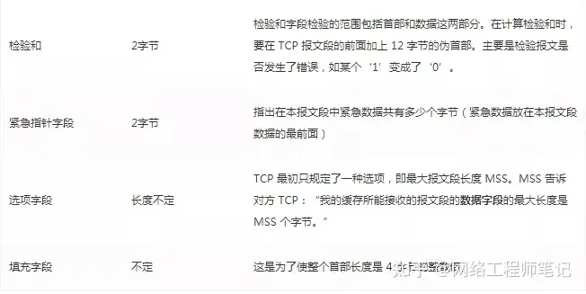

选项字段中包含以下其他选项：


**选择确认SACK** 。在TCP报文的选项字段，可以设置已经收到的报文段，每一个报文段需要两个边界来进行确定。这样发送方，就可以根据这个选项字段只重传丢失的数据了。


## Bonus


### 路由转换：

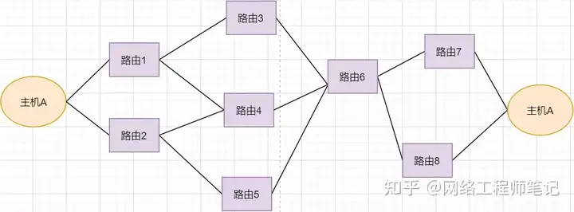

路由转发的好处是：提高网络的容错率，本质原因依旧是网络是不稳定的 。即使坏掉几个路由器，网络依旧畅通。但是如果坏掉路由器6那就直接导致主机A和主机B无法通信，所以要避免这种核心路由器的存在。

使用路由的好处还有：分流。如果一条线路太拥堵，可以从别的路线进行传输，提高效率

### 粘包与拆包

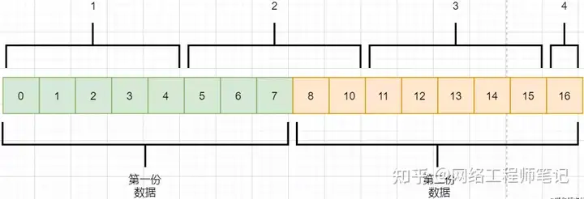

- 应用层需要向目标进程发送两份数据，一份音频，一份文本
- TCP只知道接收到一个流，并把流拆分成4段进行发送
- 中间第二个报文的数据就出现两个文件的数据混在一起，这就是**粘包**
- 目标进程应用层在接收到数据之后，需要把这些数据拆分成正确的两个文件，就是**拆包**

> 粘包与拆包都是应用层需要解决的问题，可以在每个文件的最后附加上一些特殊的字节，如换行符；或者控制每个报文只包含一个文件的数据，不足的用0补充等等。

### 恶意攻击

TCP的面向连接特点可能会被恶意的人利用，对服务器进行攻击。

前面我们知道，当我们向一个主机发送syn包请求创建连接时，服务器会为我们创建缓冲区等，然后向我们返回syn+ack报文；如果我们伪造IP和端口，向一个服务器进行海量的请求，会使得服务器创建了大量的创建一半的TCP连接，使得其无法正常响应用户的请求，导致服务器瘫痪。

解决的方法可以有限制IP的创建连接数、让创建一半的tcp连接在更短的时间内自行关闭、延缓接收缓冲区内存的分配等等。


### 长连接


我们向服务器的每一次请求都需要创建一个TCP连接，服务器返回数据之后就会关闭连接；如果在短时间内有大量的请求，那么频繁创建TCP连接关闭TCP连接是一个很浪费资源的行为。所以我们可以让TCP连接不要关闭，在这个期间进行请求，提高效率。需要注意长连接维持时间、创建条件等，避免被恶意利用创建大量的长连接，消耗殆尽服务器的资源。


### wait and stop效率

效率怎么算：
$$
\eta=\frac{发送数据的时间}{整个周期}
$$

> 周期所花费的总时间(其中包括发送数据、数据的传播延迟、确认的传播延迟和发送确认的时间
> $$
> Time_{data}=\frac{frame\space size}{bandwidth}
> $$


### QUIC

Quick UDP Internet Connections  

QUIC: streams: parallelism, no HOL(head of line) blocking  

- error and congestion control: “Readers familiar with TCP’s loss detection and congestion control will find algorithms here that parallel well-known TCP ones.

- connection establishment:  reliability, congestion control, authentication, encryption, state established **in one RTT**

multiple application-level “streams” multiplexed over single QUIC connection

- separate reliable data transfer, security

- common congestion control


# Network layer——data plane


[网络层（The Network Layer)](https://blog.csdn.net/Rong_Toa/article/details/80639635)

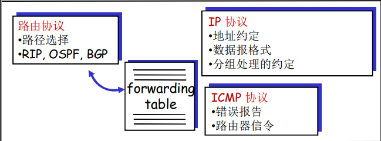


## Intro

- **转发forwarding**: move packets from a router’s input link to appropriate router output link

  > according to forwarding table(会更新)

- **路由routing**: determine toute taken by packets from source to destination


**Data Plane+control plane**

- router 3
- switch 2


## Router


- input port functions（decentralized switching  ）
  - 根据报头字段查forwarding table来找输出端口
    - longest prefix(前缀) matching
  - input port queuing: if datagrams arrive faster than forwarding rate into switch fabric  
  - **destination-based forwarding**: forward based only on destination IP address (traditional)  
  - **generalized forwarding**: forward based on any set of header field values

> ternary content addressable memories (TCAMs)三元内容可寻址存储器
>
> 内容可寻址：一种计算机存储技术，通过存储内容本身（而非地址）来检索数据

- switching fabrics

  - function: transfer packet from input link to appropriate output link  

  - switching rate: rate at which packets can be transfer from inputs to outputs——often measured as multiple of input/output line rate  

  - 

    - memory：direct control of CPU;copied to memory

      

    - bus：bus contention—switching speed limited by bus bandwidth  

    - interconnection network: n*n交换机；并行计算——同时并发转发多个分组，克服总线带宽限制

- 输出端口
  - **需要buffer**：当数据报从交换机构的到达速度比传输速率快时
    - RFC 3439 拇指规则（经验性规则）  ：buffer=RTT*C(链路容量C)
    - 有N（非常大）个流：$buffer=\frac{RTT*C}{\sqrt{N}}$
  - **调度规则**选择数据报进行传输
    - FIFO
    - 优先权调度：同优先级FIFO
    - Round Robin (RR) scheduling  ：多类，循环扫描，发完一个类的一个分组再发下一个类的分组
    - Weighted Fair Queuing (WFQ)  ：一般化的RR，不同类有权重


## IP

[计算机网络note_IP协议](https://blog.csdn.net/E2242/article/details/124797598)

IP：Internet Protocol 主要负责将数据包发送给最终的目标计算机（复杂的网络环境中）。因此，IP能够让世界上任何两台计算机之间进行通信。

- IP是属于面向无连接型：简单化/高速化——best effortx

- 主机与节点

   在互联网世界中，将配有IP地址的设备叫做“主机”，主机可以是大型计算机，也可以是个人计算机等，细化的话，**主机**的定义应该是“配有IP地址，但是不进行路由控制的设备”。

   既配有IP地址又具有路由控制能力的设备叫做“**路由器**”，跟主机有所区别，而**节点**则是主机和路由器的统称。在IPv4中的规范RFC791中，将具有路由控制功能的设备叫做“**网关**”


### IP数据报


### IP作用模块

 IP大致分为三大作用模块：IP寻址、路由（最终节点为止的转发）以及IP分包与组包

- IP寻址：IP地址属于网络层地址

  在链路层标识同一个链路中不同计算机的一种识别码是MAC地址，网络层标识的地址信息叫做IP地址，IP地址用于在“连接到网络中的所有主机中识别出进行通信的目标地址”。

- 路由控制（Routing）

  路由控制（Routing）是将分组数据发送到最终目标地址的功能

  在下一跳选择时会使用到**ARP**（Address Resolution Protocol)地址解析协议：是根据IP地址获取物理地址的一个TCP/IP协议，主要作用：解决下一跳跳哪的问题

- IP分包与组包(Fragmentation & Reassembly)  

  IP是实现多个数据链路之间通信的协议。不同数据链路有个最大的区别，就是它们各自的最大的传输单位（MTU:Maxi-mum Transmission Unit）不同。

  **分片**（IP Fragmentation）：分片处理就是把较大的IP包分成多个较小的IP包（相同ID，不同偏移量，最后一个分片标记为0）

  **重组**：只在最终的目标主机进行

  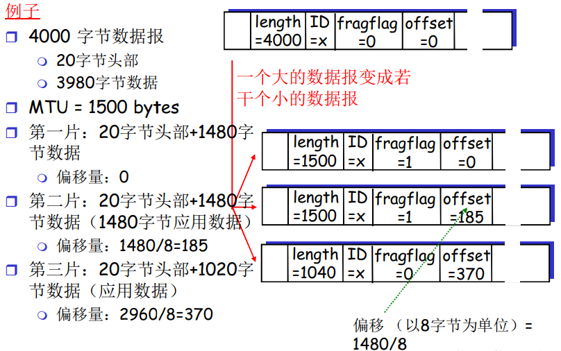

### IPv4

不可靠性 （ unreliable ） ： 尽力传递 （ best-effortdelivery），尽力传递指IPv4不提供差错控制和流量控制（除头部差错检测外）；不确保数据报能成功到达目的地（中间发生问题可能被丢弃）；

无连接性（connectionless）：不维护任何关于后续数据报的状态信息；每一分组独立进行处理，而每一分组使用不同的路由传送到目的端；如果一个源端向同一目的端发送许多数据报，那么这些数据报有可能不按顺序到达（有一些数据报也可能遗失或损坏）。

- IP地址: **32位**标识，对主机或者路由器的接口编址
- 接口：主机/路由器和物理链路的连接处（常有多个接口）
- P地址和每一个接口关联


- 子网subnets

  - 子网内的节点IP地址高位部分相同构成的网络一部分叫子网（断开连接构成孤岛（网络）都可以称为subnet）

    无需路由器介入——子网内各主机可以在物理上相互直接到达

  - IP地址

    - 子网部分（高位bits）
    - 主机部分（低位bits）

  - 子网掩码subnet mask：[子网掩码是什么？有什么作用？](https://zhuanlan.zhihu.com/p/371400090)

    - **区分网络和主机**：子网掩码通过将IP地址的一部分标记为网络位，另一部分标记为主机位

      1bit位置表示子网部分；0bit位置表示主机部分

      另一种表示方法：/#：/22表示前面22bit为子网部分

    - **子网划分**：子网掩码还用于将一个大的IP网络划分为若干个小的子网络

> topology  拓扑


- 特殊IP地址
  - 子网部分：全为0——本网络
  - 主机部分：全为0——本主机
  - 电机部分：全为1——广播地址，这个网络的所有主机

- 内网（专用）IP地址：

  **只在局部网络中有意义**，以区分不同的设备；

  专用地址不会被当做公用地址，因此**路由器不会对目标地址是专用地址的分组进行转发**；

#### 如何获得一个IP地址

上网要配置4个信息，**IP地址、子网掩码、默认网关、DNS服务器**；

- 由系统管理员分配；
- 使用DHCP，从DHCP服务器中动态获取IP地址；
- 获得网络的子网部分：从ISP获得地址块中分配一个小地址块  
- 一个ISP如何获得一个地址块：ICANN: Internet Corporation for Assigned Names and Numbers  
  - 分配地址/管理DNS/分配域名，解决冲突


> 可以看到启动了DHCP，DHCP的服务器地址和默认网关的地址是一样的，也就是说我连接的路由设备兼具了默认网关和DHCP的功能；
>
> DHCP给我分配了IP地址，时限是24小时

#### DHCP

DHCP（Dynamic Host Configuration Protocol）


DHCP提供的服务：

- 让加入网络的主机拥有一个IP地址；
- 动态IP是有限时的，可以更新限时；
- 重启时，允许重新使用以前的IP；
- 支持移动用户加入到网络（短期在网）


DHCP是如何工作的？

- 主机：广播 “DHCP discover” 报文；
- DHCP服务器：“DHCP offer” 响应报文；
- 主机：请求IP地址，发送“DHCP request”报文；
- DHCP服务器：回复“DHCP ack”报文；


DHCP返回:

- IP地址
- 第一跳路由器的IP地址（默认网关）
- DNS服务器的域名和IP地址
- 子网掩码 (指示地址部分的网络号和主机号)


### IPv6

IPv6（128bit IP地址）

#### 为什么有IPv6？

- IPv4的32bit地址空间用完了；
- 提升QoS服务质量：不分片、去掉checksum


#### 数据报格式

固定的40字节头部

传输过程中不允许分片，如果数据报过大返回ICMP信息给源主机；


- ver：版本号，0110；

- pri：优先级；
- flow label：没有严格定义，标识哪些数据报在一个flow；（比如同一个IP发的数据报）
- payload len：载荷数据长度，除了头部40字节之后的部分，图中就后面data的字节数；
- next header：标识上层协议，或扩展头部；
- hop limit：相当于原来的TTL；


#### IPv4到IPv6的过渡

使用**隧道**（Tunneling），在IPv4路由器之间传输携带IPv6数据报的IPv4


## 路由转发

### IP编址

[CIDR的IP地址的表示与划分方法](https://blog.csdn.net/han156/article/details/77817031)

IP编址：CIDR（Classless InterDomain Routing（无类域间路由））


> 早期的互联网使用的是所谓的「分类」 IP 地址。这个「分类」并不是说 IP 地址本身有什么区别，而是根据 IP 地址的前几位，把它们分成 A、B、C、D、E 5 类。这5类 IP 地址，每类符合特定的前缀，分配给特定的网络。但是这种方案在 IP 地址分配上非常不均匀，导致出现一些 IP 地址过剩，一些 IP 地址严重不足的情况。
>
> CIDR 就是为了解决这个问题而出现的。它摈弃了「分类」的概念，取而代之的，是任意长度的子网掩码。
>
> 例1：192.168.23.35/21计算子网的网络ID、子网掩码、起止IP地址？
>
> - 子网掩码：21是子网掩码的长度，11111111 11111111 11111-000 00000000（子网掩码）=255.255.248.0（子网掩码的第二种表示方法。）
>
> - 网络ID：192.168.16.0（192.168.00010111.0和子网掩码进行“与”运算。）
>
> - 起始IP地址：192.168.16.1（192.168.16.0是本网端中的第一个IP，可是他已经表示网络ID了，所以，为了避免与该IP地址与网络ID混淆，所以，起始IP为192.168.16.1。）
>
> - 结束IP地址：192.168.23.254（192.168.00010（网络位）-111.11111110（主机位）主机ID不能全为1，全为1表示本地广播。）
>- 地址数量：$2^{32-网络前缀长度}，这题中网络前缀长度=21$

[计算机网络最长前缀匹配举例](https://blog.csdn.net/weixin_43275631/article/details/109960686)


### 转发表和转发算法

首先，获取IP数据报中目标IP地址；

然后，**将目标IP地址&子网掩码，与第一列网络号匹配**，从最后一列Interface转发出去；

> 第一行：目标IP地址为**202.38.73.00xx xxxx** 与&子网掩码255.255.255.192，得到202.38.73.0；
>
> 第二行：目标IP地址为**202.38.64.00xx xxxx** 与&子网掩码255.255.255.192，得到202.38.64.0；


### 层次编址：路由聚集（route aggregation）

由聚集利用了这种层次结构，通过将具有相同网络前缀的多条路由合并为一条聚合路由，从而减少了路由器需要维护的路由表条目数量

支持不完全的聚集，匹配最长子网掩码；


## NAT

NAT（Network Address Translation）

本地网络**只有一个IP地址**，通过NAT技术可以**让一个IP为局域网多设备使用**；

NAT只有一个IP地址，但是端口号是16位（65536）的，**用端口号来区分局**域网内不同的主机；

### 好处

- 不需要从ISP分配一块地址，可用一个IP地址用于所有的（局域网）设备--省钱  
- 可以在局域网改变设备的地址情况下而无须通知外界  
- 可以改变ISP（地址变化）而不需要改变内部的设备地址
- 局域网内部的设备没有明确的地址，对外是不可见的--安全  


### 实现

实现：（**NAT转换表**，记录对应关系）

- 发送数据报：源地址→NAT的IP地址、源端口号→新端口号；
- 接收接收报：NAT的IP地址→源地址、新端口号→源端口号；


### NAT穿越问题

客户端如何主动访问NAT局域网内的服务器？

- 方案1：静态配置NAT

  138.76.29.7，port 2500就对应着服务器10.0.0.1 port 2500；

- 方案2：Universal Plug and Play（UPnP）Internet Gateway Device（IGD）协议

  在服务器部署之前，**查询**NAT路由器存在的**端口映射**，加一个新的端口来租用；

- 方案3：使用中继，客户端和服务器使用中继交换信息；


## 通用转发和SDN

[通用转发和SDN](https://blog.csdn.net/zheshiyangyang/article/details/134272781)

数量众多、功能各异的中间盒  


1. 首部字段值的集合，在进入流表后会进行匹配。匹配不上的分组会被丢弃

2. 匹配上后会更新计数器

3. 采取动作

   > **值得注意的是，流表本质上是一个API**，通过这种抽象每台分组交换机的行为能够被编程，类似的，网络范围的行为也能够被编程。

### SDN

SDN:逻辑上集中的控制平面 ——将数据平面和控制平面分离 

> 一个不同的（通常是远程）控制器和CA交互，控制器决定分组转发的逻辑（可编程），CA所在设备执行逻辑  

SDN(Software Defined Network)它是一种网络创新架构，旨在通过将**网络设备控制面与数据面分离，实现网络流量的灵活控制，使网络变得更加智能和可编程**。

SDN的核心技术是**OpenFlow**，它允许网络管理员通过一个集中式的控制器来定义和应用网络策略，从而简化网络管理，提高网络的灵活性和可扩展性。


### OpenFlow

OpenFlow 数据平面抽象

match+action: 统一化各种网络设备提供的功能  

OpenFlow是一种网络通信协议，它是软件定义网络（SDN）架构中**控制器和转发器（如交换机）之间的通信接口标准**。OpenFlow协议的主要目的是**实现转发和控制的分离**，使得网络流量的控制和管理能够通过一个集中式的控制器来实现。

在OpenFlow协议中，转发器维护着一个**流表（Flow Table）**，其中包含了一系列数据包转发的规则。控制器通过OpenFlow协议与转发器进行通信，向转发器下发流表规则，从而控制数据包的转发路径和行为。这样，网络管理员可以通过控制器方便地定义和修改网络策略，而无需手动配置每个网络设备。


流表中的每一项都包含以下几个关键字段：

1. **匹配字段（Match Fields）**：用于定义流的属性，包括但不限于：
   - 入端口（Ingress Port）：数据包进入交换机的端口号。
   - 源IP地址（Source IP Address）：数据包的源IP地址。
   - 目的IP地址（Destination IP Address）：数据包的目的IP地址。
   - 源端口号（Source Port）：数据包的源端口号。
   - 目的端口号（Destination Port）：数据包的目的端口号。
   - VLAN ID：数据包所属的VLAN。
   - 协议类型（Protocol Type）：数据包的协议类型，如TCP、UDP等。

2. **动作（Actions）**：定义了匹配到流表项后对数据包的操作，包括但不限于：
   - 转发（Forward）：将数据包从指定的端口转发出去。
   - 丢弃（Drop）：丢弃数据包，不做任何处理。
   - 修改字段（Modify Field）：修改数据包的某些字段，如源/目的IP地址、源/目的端口号等。
   - 重定向（Redirect）：将数据包重定向到其他设备或组件进行处理。
   - 计数（Count）：对匹配到该流表项的数据包进行计数统计。

3. **优先级（Priority）**：用于定义流表项的优先级，优先级高的流表项会先被匹配和执行。

4. **统计信息（Statistics）**：用于记录匹配到该流表项的数据包数量和字节数等统计信息。

5. **超时（Timeout）**：用于定义流表项的生存时间，超过生存时间的流表项会被自动删除。

通过在流表中定义不同的流表项，SDN控制器可以灵活地控制网络流量的转发路径和行为，实现网络的可编程性和自动化管理。

# Network layer——control plane


## routing protocols

- path
- good:cost/fastest...


### link state

LS 路由——知道全局拓扑


#### workflow

- 顺序号seq(避免重复)
- age
  - 生成一个分组时,年龄字段不为0
  - 每个一个时间段,AGE字段减1
  - AGE字段为0的分组将被抛弃


#### Dijkstra 算法

[[最短路径问题\]—Dijkstra 算法详解](https://zhuanlan.zhihu.com/p/129373740)

戴克斯特拉算法使用类似广度优先搜索的方法解决**赋权图的单源最短路径问题**。本算法每次取出未访问结点中距离最小的，用该结点更新其他结点的距离。需要注意的是绝大多数的Dijkstra 算法不能有效处理带有**负权边**的图。
$$
O(n^2)
$$


#### 使用情况

OSPF协议是一种LS协议,被用于Internet上

IS-IS(intermediate system- intermediate system):

被用于Internet主干中, Netware


### distance vector

DV算法——只知道neighbours，互相交换信息（路由表），根据获得的信息更新自己的路由表

> 距离矢量路由选择的基本思想

- 距离矢量：每条链路cost=1


#### workflow

1. 每个节点将自己的距离矢量估计值传给邻居
2. 从邻居收到DV，使用BF更新自己的距离矢量估计值

#### Bellman-Ford (BF)  

$$
D_x(y)=min_v\{c_{x,v}+D_v(y)\}
$$


- 好消息传得快
- 坏消息传得慢——无穷计算（水平分裂split horizon算法）

### Compare


## intra-ISP routing

因特网中自治系统内部的路由选择  

AS:路由器区域——autonomous systems

### RIP

Routing Information Protocol  


- 使用DV算法
- DV每隔30s和邻居交换DV——**通告**
- 通告：至多AS内部的25个目标网络——目标网络+跳数


- 链路失效和恢复：

  

- 进程处理

  

### OSPF

Open Shortest Path First  


- 使用LS算法
- OSPF通告消息中携带每一个邻居路由器一个表项  
- 通告消息传遍AS——在IP数据报上直接传送OSPF报文
- IS-IS路由协议：几乎和OSPF一样  


- 层次化的OSPF路由

  

  

## routing among ISPs：BGP


### 层次路由

- 将互联网分成一个个AS(Autonomous system)
- 一个AS用ASN（AS number）唯一标示
- 一个ISP可能包含多个
- 2个层次路由
  - intra-AS routing protocol：内部网关协议——关注性能
  - inter-AS routing protocol：外部网关协议——策略+性能


### BGP

BGP (Border Gateway Protocol):自治区域间路由协议

“事实上的”标准——将互联网各个AS粘在一起的胶水

- 分类
  - eBGP:从相邻的ASes那里获得子网可达信息  
  - iBGP:将获得的子网可达信息传遍到AS内部的所有路由器
- 根据子网可达信息和策略来决定到达子网的“好”路径  
- 基于距离矢量算法（**路径矢量**协议）  


#### Basic

- BGP会话: 2个BGP路由器(“peers”)在一个半永久的**TCP连接**上交换BGP报文

- 重要属性

  - AS-path
  - next-hop

- 基于策略的路由

  - 输入策略（收 or not）/输出策略（发 or not）

- 路径通告

  

- BGP报文

  使用TCP交换报文

  

- 路径选择
  - 热土豆路由——只关心内部区域的最小代价，不操心域间的代价
  - 


## SDN control plane

SDN方式：逻辑上集中的控制平面 ：一个不同的（通常是远程的）控制器与本地控制代理（CAs）交互  

- flow based，基于流的匹配+行动
- 可编程控制

SDN架构

- 数据平面交换机
- SDN控制器
- 网络控制应用


### OpenFlow

- openflow协议

  


## ICMP

因特网控制报文协议  Internet Control Message Protocol

- 在IP协议上面——由IP数据报承载


## 网络管理和SNMP  


# Link layer and LANs

[计网复习笔记【附思维导图】——【5】链路层](https://blog.csdn.net/yongheng1123/article/details/110239883)

## Intro

链路层的**点到点**传输层功能  ——数据链路层负责从一个节点通过链路将（帧中的）数据报发送到相邻的物理节点（一个子网内部的2节点）

- nodes
- links
- frame——第二层协议数据单元帧frame，封装数据报


理解数据链路层服务的**原理**：

- 检错和纠错
- 共享广播信道：多点接入（多路访问） 
- 链路层寻址
- LAN:以太网、WLAN、VLANs
- 可靠数据传输，流控制:解决! 

实例和各种链路层技术的实现


连接方式

- 点到点
- 多点连接
  - 共享型介质
  - 通过网络交换机


### 链路层：上下文

- 数据报在不同链路上以不同的链路协议传送
  - 第一跳链路：以太网
  - 中间链路：帧中继链路
  - 最后一跳：802.11


### 链路层服务

- 成帧
  - 将数据报封装在帧中，加上帧头、帧尾部
  - 如果采用的是共享性介质，信道接入获得信道访问权
  - 在帧头部使用“MAC”（物理）地址来标示源和目的——不同于IP地址

- 链路接入：媒体访问控制协议MAC规定了帧在链路上传输的规则。
- 可靠交付：通常用于易产生高差错率的链路，如无线链路，通过确认和重传实现。

- 流量控制：使得相邻的发送和接收方节点的速度匹配，链路层每个节点都具有有限容量的帧缓存能力
- 错误检测：
  - 差错由信号衰减和噪声引起
  - 接收方检测出的错误，通知重传或丢弃帧

- 差错纠正：接收端检查和纠正bit错误，不通过重传来纠正
- 半双工/全双工
  - 链路是半双工


### 实现位置

- 在每个主机上实现：每个路由器/交换机的每个port
- 适配器/芯片组上实现

- 链路层主体部分在网络适配器中实现，网络适配器也称网卡（aka network interface card NIC），网络适配器内核为链路层控制器。

## 差错检测和纠正

- EDC=差错检测和纠正位（冗余位）  
- D=数据由差错检测保护，可以包含头部字段  


**校验方法**：

- 奇偶校验
  - 单bit
  - 2维
  
- Internet校验和
  - TCP和UCP中对所有字段都计算校验和，而IP只对头部计算校验和。
  - 校验方式：把d比特数据看作一个k比特整数序列。**取数据的两个字节作为16比特的整数对待并求和**，这个和的**反码**构成了携带在报文段首部的互联网校验和。
  - 互联网校验和**只能进行差错检测，不能进行差错恢复**
  - 在运输层，校验和差错检测用软件简单实现。
  - 在链路层，差错检测在适配器中用专用硬件实现，能快速执行更复杂的CRC操作

- **循环冗余检测CRC**[2.1.5 校验码（一文带你分析搞懂：奇偶校验码、海明码、CRC码）_校验码比较](https://blog.csdn.net/weixin_43914604/article/details/104183321)

  - **循环冗余检测CRC**也称**多项式编码**，使用最广泛，**本质是多项式除法取余**

    > 不是除法相减，而是进行**异或计算**

  - **发送方**：发送D+R位数据，D为给定数据段，R为CRC比特；使得D+R用模2运算恰能被G整除。**R长度=G长度-1**，即R比G少1位

    > D+R指将数据向左移R位

  - **接收方**：用G去除接收到的D+R位比特；如果余数非零，说明出错

  - 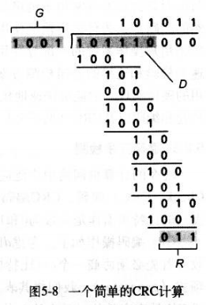
  
    - 求循环冗余校验码R，已知G=1001，可以推断R长度为4bits-1=3bits。
    - 将发送数据D后补上3个0作为被除数，将G作为除数，开始进行多项式取余运算。
    - 运算过程中由于加法不进位，减法不借位，实际上进行**按位异或运算**。
    - 最终的余数高位补零，得到3bits的循环冗余校验码R=011


## 多路访问链路和协议

多路访问协议可划分为3种类型：**信道划分协议、随机接入协议、轮流协议**


两种类型的链路

- 点对点链路
  - 点对点协议PPP(Point-to-Point Protocol)
  - 高级数据链路控制协议HDLC(Hign-level Data Link Control)
- 广播链路
  - 广播：能够让多个发送和接收节点都连接到相同的、单一的、共享的广播信道上。当任何一个节点传输一个帧时，帧在信道中广播，每个其他节点都能收到这个帧。
  - 广播信道问题：所有节点共享同一个传输信道，都能进行数据帧传输，当两个以上的节点同时传输时，传输的帧在所有的接收方处碰撞；造成帧的丢失，以及广播信道的浪费。


### 多路访问协议

多路访问协议（介质访问控制协议：MAC）  

- **多路访问的含义**
  - 规范节点在共享的广播信道上的传输行为，从而协调多个发送和接收节点对一个共享广播信道的访问，避免碰撞。
  - 共享信道的使用不能通过带外方式进行协商

#### 信道划分MAC协议

- **特征**：将信道划分为小的“片段”，然后分配给每个节点
- **信道划分协议的三种方式**：时分多路复用TDMA、频分多路复用FDMA、码分多址CDMA
- **时分多路复用TDMA**：把时间划分成**时间帧**，并进一步划分每个时间帧为N个时隙
  - **TDM优点：**(1)消除了碰撞并且公平；(2)每个节点在每个帧时间内得到了专用的传输速率R/N bps。
  - **TDM缺点**：(1)节点被限制在R/N bps的平均速率；(2)节点必须等待自己的时间帧轮次，即使它是唯一有数据要发送的节点。

- **频分多路复用FDMA**：把吞吐量为R bps的信道划分成**不同的频段**，每个频段具有R/N bps带宽，并把每个频率分配给N个节点中的一个
  - **FDM优点**：(1)消除了碰撞并且公平;(2)每个节点在每个频段内得到了专用的传输速率R/N bps。
  - **FDM缺点**：限制一个节点只能使用R/N bps的带宽，即使它是唯一有数据要发送的节点

- **码分多址CDMA**：对每个节点分配一种不同的编码，然后每个节点用不同的编码方式对要发送的数据进行编码；接收方根据不同编码进行辨别解码；保证不同的节点可以同时传输
  - **实质**：对**编码空间**进行划分。
  - 应用：蜂窝电话


#### 随机接入协议

- 随机接入特征：一个传输节点总是以信道的全部速率进行发送。当有碰撞时，涉及碰撞的每个节点在**等待一个随机时延**后重复发送碰撞帧。

- 面临问题：(1)如何检测冲突；(2)如何从冲突中恢复。

- 随机接入协议的五种方式：

  - 时隙ALOHA

  - ALOHA

  - CSMA：载波侦听多路访问

  - CSMA/CD：具有碰撞检测的载波侦听多路访问

  - CSMA/CA

##### 时隙ALOHA

- **时隙ALOHA协议假设**

  - （1）所有帧由L比特组成。


  - （2） 时间被划分为长度为L/R 秒的时隙(即一个时隙等于传输一帧的时间) 。

  - （3）节点只在时隙起点开始传输帧 。

  - （4） 节点是同步的，每个节点都知道时隙何时开始。

  - （5）如果在一个时隙中有两个或者更多个帧碰撞，则所有节点在该时隙结束之前可以检测到该碰撞事件。

- **时隙ALOHA协议实现**

  - (1)当节点有一个新帧要发送时，它等到下一个时隙开始并在该时隙传输整个帧。


  - (2)如果没有碰撞，节点成功地传输它的帧。

  - (3)如果有碰撞，节点在该时隙结束之前检测到这次碰撞。节点以概率p在后续的每个时隙中重传它的帧，直到该帧被正确地传输出去。

- 时隙ALOHA优点：当某节点是唯一活跃节点时，可以以全速R进行传输；且协议是高度分散，每个节点单独检测碰撞并决定何时重传；实现简单。

- 时隙ALOHA缺点：会发生碰撞，造成时隙浪费；存在空闲时隙；需要进行碰撞检测；需要进行时隙同步。

- 时隙ALOHA效率

  时隙ALOHA效率定义：当有大量的活跃节点且每个节点总有大量的帧要发送时，长期运行中成功时隙的份额。
  效率分析：当N 趋近于无穷时，取Np(1-p)N-1的极限，从而得到这个协议的最大效率为1 /e=0.37。

##### ALOHA

- ALOHA协议实现：当一帧首次到达时，节点立刻将该帧传输进广播信道。如果传输的帧与另外的帧发生碰撞，则它立刻以概率p重传该帧，或者以概率1-p等待另一个帧时间后进行重传。

- ALOHA优点：简单，没有时隙的概念，同步传输。
- ALOHA缺点：**冲突概率增加**，假设节点i 在t0时刻开始传输，则为了使该帧能够成功地传输，在时间间隔[t0-1,t0+1]中不能有其他节点开始传输。
- ALOHA效率：**效率为1/2e=0.18**，为时隙ALOHA的一半

##### CSMA：载波侦听多路访问

- **CSMA实现**
  - 载波侦听（说前先听）：节点在传输前先侦听信道，如果来自另一个节点的帧正向信道上发送，节点则等待直到检测到一小段时间没有传输，然后开始传输。
- **CSMA缺点**
  - 即使侦听仍然存在碰撞。
  - 碰撞原因：存在传播时延；传播时延越大，碰撞概率越高。
  - 碰撞结果：整个帧传输时间被浪费


##### CSMA/CD

具有碰撞检测的载波侦听多路访问

- CSMA/CD协议实现

  - 载波侦听（说前先听）：节点在传输前先侦听信道，如果来自另一个节点的帧正向信道上发送，节点则等待直到检测到一小段时间没有传输，然后开始传输。

  - 碰撞检测（边说边听）：节点在传输时一直侦听信道；如果它检测到另一个节点正在传输干扰帧，它就停止传输，用指数回退算法来确定它应该在什么时候进行下一次传输。

- 冲突检测CD技术，有线局域网中容易实现：
  - 检测信号强度，比较传输与接收到的信号是否相同
  - 通过周期的过零点检测

- **指数回退**：第1次冲突，在{0,1}里选K；第2次冲突，在{0,1,2,3}里选K…第10次冲突，在{0,1,2,3,4,…,1023}中选K；延时K\*512比特传输时间。

- CSMA/CD效率

  - 效率定义：当有大量的活跃节点且每个节点总有大量的帧要发送时，帧在信道中无碰撞地传输的那部分时间在长期运行时间中所占的份额。

  - 效率分析

    - dprop：信号在任意两个节点之间传播所需要的最大时间。

    - dtrans：传输一个最大长度的以太网帧所需要的时间。

    - 效率efficiency=1/(1+5dprop/dtrans)。

    - 当dprop趋向0或dtrans趋向无穷大时，效率趋近1。

    - 优势：效率高于ALOHA，分散，简单

##### CSMA/CA 

- CSMA/CA使用**碰撞避免**


**CSMA/CD与CSMA/CA**

- CSMA/CA在主要用于802.11(WiFi)，用于**碰撞避免**。
- CSMA/CD使用链路层确认/重传(ARQ)机制，主要用于共享式以太网，用于**碰撞检测**


#### 轮流协议

- **轮流特征**：具备了多路访问协议的两个理想特性，即当只有一个节点活跃时，其具有R bps的吞吐量；当有M个活跃节点时，每个活跃节点的吞吐量接近R/M bps。
- 轮流协议包括**轮询协议、令牌传递协议**


##### 轮询协议

- 轮询协议实现：节点之一要被指定为主节点，主节点以循环的方式轮询每个节点：主节点首先向节点1发送一个报文，告诉节点1能够发送的最大帧数；在节点1传输了某些帧后，主节点告诉节点2能够传输的最大帧数。

- 轮询协议优点：消除了CSMA/CD的碰撞和空时隙问题。
- 轮询协议缺点：(1) 引入了轮询时延；(2)如果主节点有故障，整个信道会出现问题


##### 令牌传递协议

- **令牌传递协议操作**： 没有主节点，而是由一个称为**令牌(token)**的帧在节点之间以某种固定的次序进行交换，当一个节点收到令牌时，若它有一些帧要发送时，它才持有这个令牌，并发送最大数据的帧数；否则，它立即向下一个节点转发该令牌。
- **令牌传递协议缺点**：一个节点的故障可能会使整个信道崩溃


## LANs


### MAC addressing ,ARP

#### 链路层编址MAC

- 概念

  - MAC 地址长度为6 字节，共有2^48 个可能的LAN 地址。
  - MAC地址有各种不同的称呼:LAN 地址、物理地址、MAC 地址、以太网地址。
  - MAC 广播地址：对于使用6 字节地址的LAN(例如以太网和令牌传递LAN)来说，广播地址是48 个连续的1 组成的字符串(即十六进制表示的FF-FF-FF-FF-FF-FF)。
  - IEEE 在管理着MAC 地址空间，MAC地址具有唯一性，不会随着移动而改变。
  - 并不是节点(即主机或路由器)具有MAC 地址，而是节点的网络适配器（网卡NIC）具有链路层地址MAC。
  
- IP地址依赖于所在子网
  - 在同一子网内，利用MAC地址进行寻址，不涉及网络层IP。
    链路层交换机的接口没有MAC地址；
  - 路由器的接口有IP地址。
  
- LAN（MAC/物理/以太网）地址作用：用于**链路层寻址**（在同一个物理网络中）
  - 当适配器收到一个帧时，会检查目的MAC地址是否与自己的MAC地址匹配，若匹配则从中提取数据报，否则丢弃
  
  - IP是分层的：一个子网所有站点网络号一致，路由聚集，减少路由表  
  - MAC是平面的：给网卡一个唯一的标示，用于区分一个网络内部不同的网卡即可


#### 地址解析协议ARP

- **ARP协议功能**

  - 在网络层地址(如因特网的IP 地址)和链路层地址(即MAC 地址)之间进行转换。
  - 发送节点使用ARP确定目的IP 地址的MAC 地址。

- **ARP表**

  - 在cmd窗口通过命令：arp -a 查看本机的ARP表。
  - ARP 表结构：**<目标 IP address;目标 MAC address;TTL>**
  - ARP 协议模块将使用一个ARP 表，取IP 地址作为输入，查表得到相应的MAC 地址,TTL的值通常设置为20min。
  - ARP即插即用，ARP表自动完成更新。
  - ARP仅在同一个局域网LAN内部起作用。
  - DNS将域名、主机名转换为IP地址。
  - 如果ARP 表中没有IP 地址对应的MAC 地址，发送节点用ARP 协议查询来解析这个地址。

- ARP协议工作原理

  - ARP在同一个局域网内部起作用，因为在同一个子网中，数据报是直接交付的。
  - 假设主机A希望给主机B发送数据，但B的MAC地址不在A的ARP表中
    - 1.A广播ARP查询数据报，包括源主机、目的主机IP地址。其中目标MAC地址为FF-FF-FF-FF-FF-FF，代表广播地址，同一LAN中所有主机都能收到。
    - 2.B接收ARP查询数据报，使用自己的MAC地址构造数据报响应A。
    - 3.A收到B的响应数据包，在A的ARP表中缓存B的<IP,MAC>地址对。

- 当需要发送数据报到子网以外的节点时

  - 一般过程
    - 首先数据报必须发送给路由器端口(网关)。
    - 路由器在确定该数据报要被转发的正确端口后，通过查询路由器中的转发表来找到输出端口。
    - 输出端口把这个数据报封装到一个新的帧中，并将帧发送进入下一个子网。
    - 总结：也就是说数据报是被重新封装(具有不同目的/源MAC 地址的帧)后发送出去的。
  - 实例：假设主机A经路由器R发送数据报给B

  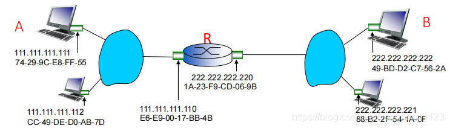

  - 1.A生成IP数据报：<源IP为A，目的IP为B>，通过DNS可查询B的IP地址。
  - 2.A将数据报封装成链路层帧，<源MAC为A，目的MAC为R左边接口>；帧包含A-to-B Ip数据报。A使用ARP找到R的MAC地址。
  - 3.R收到数据帧后取出IP数据报，找到目的IP。
  - 4.R生成链路层帧，<源MAC地址为R右边接口，目的MAC为B>；帧包含转发的A-to-B IP数据报，<源IP为A，目的IP为B>。R使用ARP找到B的MAC地址。
  - 5.B收到数据帧后，从中取出IP数据报。


# Physical layer

原文链接：https://blog.csdn.net/weixin_43914604/article/details/104722679


码元：chip


奈氏准则：$理想低通道下的极限数据传输率=2W\log_2 V(b/s),W是信道带宽$


香农定理


### 四种编码与调制方式


# Wireless

Wireless links, characteristics


# Final Exam

v2024 April. 27 10:30-12:30

v4 pages A4 handwriting cheat sheets

[《王道计算机网络》学习笔记总目录+思维导图_wangdaojisuanjiwangluosiweidaotu-CSDN博客](https://blog.csdn.net/weixin_43914604/article/details/104722679)

## Questions

- Calculation
- Protocol explanation and concepts
- Analyze snapshot of packets captured by Wireshark


## review

- Homework
- Quizzes
- Projects
- Slides
- Related book chapter


# Bonus

## <a name="mark2">state</a>

- [深入理解无状态协议、HTTP 与 web 会话_会话和无状态-CSDN博客](https://blog.csdn.net/antony1776/article/details/83474496#:~:text=通信协议分为有状态（stateful）协议和无状态（stateless）协议，无状态协议不存储交互信息，通信中的一方不关心另一方的状态，也无需对结果进行确认。 比如 UDP,协议就是无状态，TCP 协议就是有状态；HTTP 是无状态的，FTP，SSH 是有状态的。)

状态与“变化”相关，那么无状态就是不关心事物是否发生变化！

> 设计的本质就是取舍，在**时间**与**空间**之间取舍，在 **CPU** 与 **IO** 之间取舍，在**繁**与**快**、**简**与**慢**之间取舍，在**效率**与**成本**之间取舍…

- stateful:FTP,Telnet,SSH,TCP,SMTP,IMAP,POP

- stateless:HTTP,UDP,DNS

  无状态协议不存储交互信息，通信中的一方不关心另一方的状态，也无需对结果进行确认。

  > 但这并不意味着 HTTP Server 只能提供无状态的服务！IP 协议是无状态的，但基于 IP 的 TCP 就是有状态的。协议栈，或者服务栈，都是层次化的，在无状态协议上添加新的**会话机制**，便可以提供有状态的服务。
  >
  > 有无session的概念

## 1s and 2s complement

反码（One's Complement）和补码（Two's Complement）

back to back——相继的

# References

- 【中科大郑烇、杨坚全套《计算机网络（自顶向下方法 第7版，James F.Kurose，Keith W.Ross）》课程】https://www.bilibili.com/video/BV1JV411t7ow?p=4&vd_source=93bb338120537438ee9180881deab9c1

- [深入理解无状态协议、HTTP 与 web 会话_会话和无状态-CSDN博客](https://blog.csdn.net/antony1776/article/details/83474496#:~:text=通信协议分为有状态（stateful）协议和无状态（stateless）协议，无状态协议不存储交互信息，通信中的一方不关心另一方的状态，也无需对结果进行确认。 比如 UDP,协议就是无状态，TCP 协议就是有状态；HTTP 是无状态的，FTP，SSH 是有状态的。)

- [图解计网|这篇TCP神总结，请务必收下！ - 知乎 (zhihu.com)](https://zhuanlan.zhihu.com/p/368661050)


match	action
ingress port = 1 IP Src = 10.3.. IP Dst = 10.1..	forward(2)
ingress port = 2 IP Src = 10.1.. IP Dst = 10.3..	forward(1)
ingress port = 4 IP Src = 10.2.0.4 IP Dst = 10.2.0.3	forward(3)
ingress port = 3 IP Src = 10.2.0.3 IP Dst = 10.2.0.4	forward(4)
ingress port = 1 IP Dst = 10.2.0.3	forward(3)
ingress port = 2 IP Dst = 10.2.0.3	forward(3)
ingress port = 1 IP Dst = 10.2.0.4	forward(4)
ingress port = 2 IP Dst = 10.2.0.4	forward(4)
