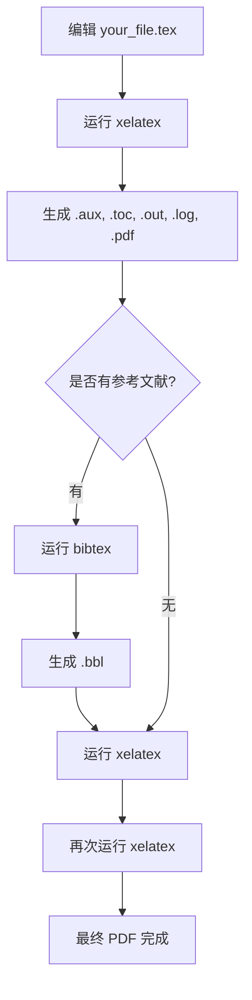

# Main Takeaway

LaTeX 是一种基于排版系统的文档编写工具，广泛应用于学术论文、书籍、报告等高质量文档的排版。

<!--more-->

---

# LaTeX是什么

LaTeX是一种基于TeX的排版系统，适合需要复杂数学公式、结构化文档的场景。它通过代码描述文档结构和内容，生成高质量的PDF等格式。

# Quick Start

1. 安装 Tex Live
    * [TeX Live 下载及安装说明 | 始终](https://liam.page/texlive/)

2. Tex编辑器
    * **离线**：VS Code (推荐插件: `LaTeX Workshop`)、TeXstudio、TeXworks
    * **在线**：[Overleaf, 在线LaTeX编辑器](https://cn.overleaf.com/project) (无需本地安装，支持协作)

3. Hello World 示例
    创建一个名为 `hello.tex` 的文件，输入以下内容并编译：

    ```latex
    \documentclass{article} % 定义文档类型为文章
    \usepackage{ctex} % 引入中文支持宏包

    \title{你好, LaTeX}
    \author{你的名字}
    \date{\today}

    \begin{document}

    \maketitle % 生成标题

    Hello, world! 你好，世界！

    这是第一个LaTeX文档。

    \end{document}
    ```

# LaTeX编译Pipeline

LaTeX 的编译过程以 `xelatex` 为例，通常用于支持中文和现代字体。整个流程如下：

1. 首次编译
    * 命令：`xelatex your_file.tex`
    * 作用：生成初步的 PDF 文件，并产生辅助文件（如 `.aux`, `.toc`, `.out` 等）。此时目录、交叉引用、参考文献等信息尚未完全收集。

2. 处理参考文献（如有）
    * 命令：`bibtex your_file`（不带 `.tex` 后缀）
    * 作用：读取 `.aux` 文件中的引用信息，结合 `.bib` 数据库，生成 `.bbl` 文件，供后续编译插入参考文献。

3. 再次编译
    * 命令：`xelatex your_file.tex`
    * 作用：读取 `.bbl`、`.toc` 等文件，更新目录、交叉引用和参考文献内容。

4. 最终编译
    * 命令：`xelatex your_file.tex`
    * 作用：确保所有目录、引用、页码等信息完全正确。

典型完整流程：`xelatex` → `bibtex` → `xelatex` → `xelatex`



---

常见辅助文件及其作用：

* `.aux`：存储交叉引用、引用标签、参考文献等信息，供后续编译和 bibtex 使用。
* `.toc`：存储目录信息，生成目录页。
* `.out`：存储章节等结构化信息，供宏包使用。
* `.log`：编译日志，记录警告和错误，便于排查问题。
* `.bbl`：由 bibtex 生成，包含排版好的参考文献条目。
* `.blg`：bibtex 的日志文件。
* `.pdf`：最终输出的文档。

> Tips:
>
> * 多次编译是为了让目录、交叉引用、参考文献等信息在文档中正确显示。
>* 现代编辑器（如 VS Code + LaTeX Workshop、TeXstudio）通常会自动完成多次编译。

# References

* [【LaTeX】新手教程：从入门到日常使用](https://zhuanlan.zhihu.com/p/456055339)
* [TeX Live 下载及安装说明 | 始终](https://liam.page/texlive/)
* [CTeX 中文社区](https://ctex.org/)
* [Overleaf 官方文档](https://www.overleaf.com/learn/latex/Main_Page)
