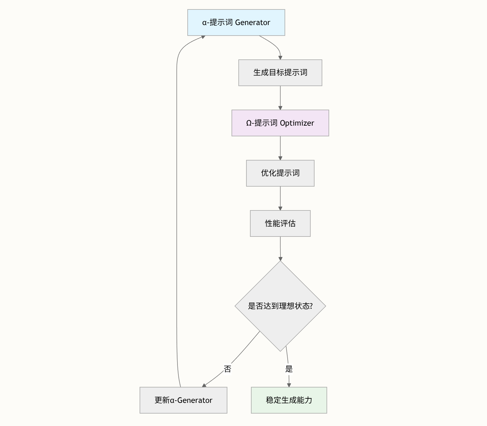

# Vibe Coding


## Main Takeaway

Vibe Coding 的本质是 **"规划就是一切"**，特别强调**规划驱动**和**模块化开发**的核心原则。

> [!NOTE]
>
> 胶水编程：解决传统 AI 辅助编程中的三大痛点：AI 幻觉、复杂性爆炸和技术门槛过高

- Vibe Coding 采用分层架构设计，将整个开发流程结构化为可管理的模块


- 三个基础支柱：胶水编程范式**、**语言层要素框架和递归自我优化

```
vibe-coding-cn/
├── i18n/                          │   ├── zh/                        # 中文资源
│   │   ├── documents/             # 文档系统
│   │   ├── prompts/               # 提示词库
│   │   └── skills/                # 技能库
│   └── [其他语言目录]/
├── libs/                          # 通用库
│   ├── common/                    # 通用功能
│   ├── database/                  # 数据库模块
│   └── external/                  # 外部集成
├── AGENTS.md                      # AI 代理配置
├── GEMINI.md                      # AI 上下文文档
└── README.md                      # 项目主文档
```


## CLI Config

- 启动命令

  ```bash
  # codex
  codex --sandbox danger-full-access -m gpt-5.2-codex -c 'model_reasoning_summary_format=experimental' -c 'model_reasoning_effort=medium' --search
  
  # Claude Code - 跳过所有确认
  claude --dangerously-skip-permissions
   
  # Gemini CLI - YOLO 模式
  gemini --yolo
  ```

- 网络配置

  | 问题                   | 解决方案                                                     |
  | :--------------------- | :----------------------------------------------------------- |
  | **节点连接失败**       | 尝试切换不同节点或检查订阅是否过期                           |
  | **某些应用未使用代理** | 确保已启用 TUN 模式（虚拟网卡）                              |
  | **终端未使用代理**     | TUN 模式自动路由终端流量；也可手动设置： `export https_proxy=http://127.0.0.1:7890` `export http_proxy=http://127.0.0.1:7890` |

## Codex Intro

可以看见所有Codex CLI的相关配置都在`~/.codex/` folder下面

- codex config: `config.toml`
- 其中的`prompts`可以在启动Codex CLI中进行`/`来调用


## 项目开发

### 项目结构

- **i18n/**: 多语言文档支持，中文版本在 `zh/` 目录
- **libs/**: 可复用组件和外部工具集成
- **documents/**: 核心技术文档和教程
- **prompts/**: AI 提示词库
- **skills/**: 技能模块集合

### 如何成为一个架构师

- https://zread.ai/tukuaiai/vibe-coding-cn/10-language-layer-elements-framework

| 层级 | 名称       | 决定你的能力         |
| ---- | ---------- | -------------------- |
| L1   | 控制语法   | 编写可运行代码       |
| L2   | 内存模型   | 避免隐式错误         |
| L3   | 类型系统   | 无注释理解代码       |
| L4   | 执行模型   | 正确处理异步/并发    |
| L5   | 错误模型   | 防止资源泄漏/崩溃    |
| L6   | 元语法     | 理解"非代码形态代码" |
| L7   | 范式       | 理解不同风格         |
| L8   | 领域与生态 | 理解真实项目         |
| L9   | 时间模型   | 控制性能和时序       |
| L10  | 资源模型   | 编写高性能系统       |
| L11  | 隐式契约   | 编写生产就绪代码     |
| L12  | 设计意图   | 成为架构师           |

### 提示词构建

- https://zread.ai/tukuaiai/vibe-coding-cn/13-system-prompt-construction
- 编写规则：https://zread.ai/tukuaiai/vibe-coding-cn/16-skills-development-framework

直接让AI生成提示词：生成器设计与优化器机制



## References

- [Vibe Coding指南github_link](https://github.com/2025Emma/vibe-coding-cn?tab=readme-ov-file)
- [Vibe Coding指南文档](https://zread.ai/tukuaiai/vibe-coding-cn/i18n/zh/documents/01-%E5%85%A5%E9%97%A8%E6%8C%87%E5%8D%97/00-Vibe%20Coding%20%E5%93%B2%E5%AD%A6%E5%8E%9F%E7%90%86.md)