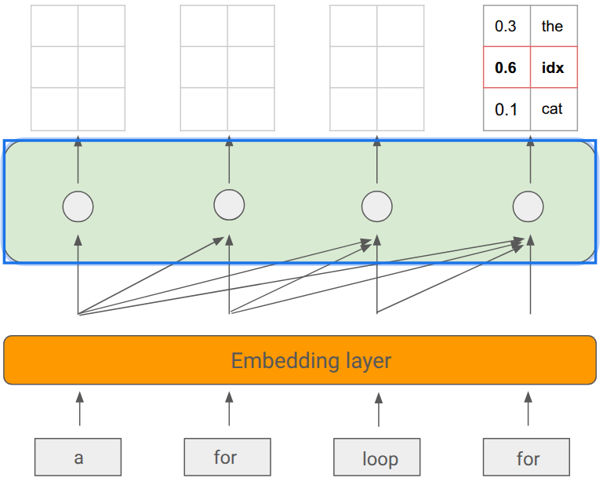

# Introductinon and How LLMs are Made

LLMs are only as good as you are.

- Good context leads to good code
- If you can’t understand your codebase, neither will an LLM

## How LLMs Work in 5 Slides

> Just for engineer

- LLMs (large language models) are autoregressive models for next-token prediction

- still transformer

  

- Training Process

  - Stage 1
    - Self-supervised pretraining
    - Teach the model notion of language on a variety of often public data sources
    - 100s of billions to trillion+ tokens (language and code)
    - Common Crawl, Wikipedia, StackExchange, Public Github repos
    - *Write a for loop* → **that could be used in a piece of code**
  - Stage 2
    - Supervised finetuning
    - Teach model to follow instructions
    - High-quality, curated prompt-response pairs (“*what is the capital of Croatia*” -> “*Zagreb is the capital*”)
    - Tens of thousands to 100s of thousands of pairs 
    - *Write a for loop* → **ok here’s a for loop…**
  - Stage 3
    - Preferencing tuning
    - Align model outputs with human preferences (helpfulness, correctness, readability)
    - Collect pairs of outputs for same prompt and train reward model to predict preferred output
    - Tens of thousands to 100s of thousands of human-labeled comparisons
    - *Write a for loop* → **for idx in range(10):**

### In practice

- Cons
  - Hallucinations
  - Context window limits
  - Latency
  - expensive

## LLM Power Prompting

> just check [here](https://www.promptingguide.ai/techniques)

- k-shot prompting: k-shot means giving the model k examples before the real task.
- chain-of-thought: means asking the model to reason step by step before giving the final answer.
  This is useful for math, logic, and multi-step problems.
- Tool calling: The model sees available tool behavior.
- Self-consistency prompting： the idea is to sample multiple reasoning paths, then choose the majority answer.
- RAG: Retrieval-Augmented Generation means the model is given relevant documents at prompt time and must answer using that retrieved context.
- Reflexion: means the model first tries a solution, then sees failure feedback, reflects on what went wrong, and tries again.

What you should do:

- Be explicit about what you want (languages, tech stacks, libraries, constraints)
- Decompose tasks

## References

- https://www.youtube.com/watch?v=T9aRN5JkmL8

- [how-openai-uses-codex](https://cdn.openai.com/pdf/6a2631dc-783e-479b-b1a4-af0cfbd38630/how-openai-uses-codex.pdf)