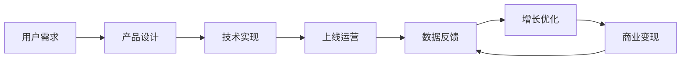
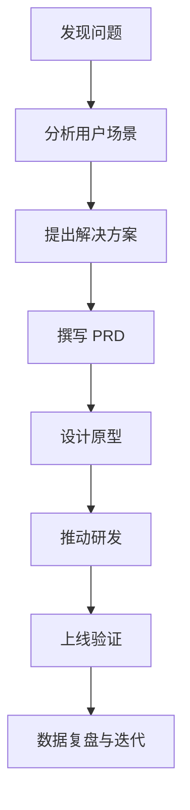
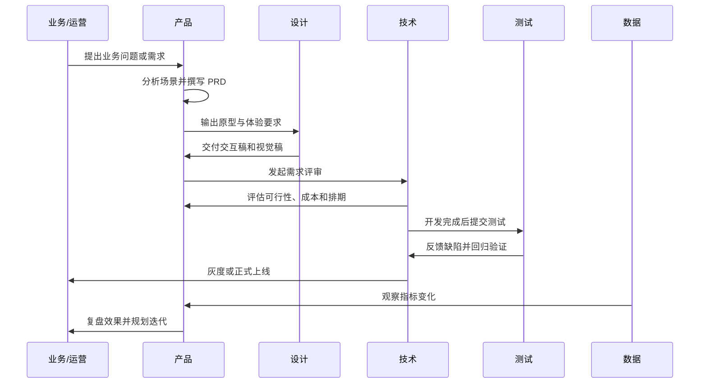
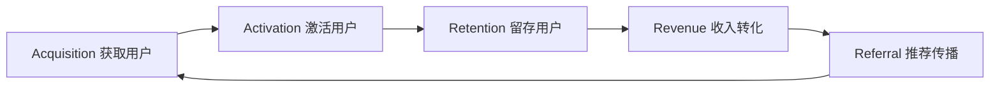

# 互联网公司全貌：从用户价值到商业闭环

## 一、核心框架：互联网公司到底如何运转

互联网公司的本质不是“写代码”，也不是单纯“做产品”，而是围绕用户需求搭建一套可以持续运转的商业系统。这个系统以用户价值为起点，通过产品和技术把需求变成可使用的服务，再依靠运营、增长和数据不断提升用户规模、活跃度、留存率与商业收入，最终形成可持续的业务闭环。

可以用一句话概括：**互联网公司以用户需求为起点，以产品和技术为载体，以运营和增长为驱动，以数据为反馈机制，以商业化完成闭环。**

理解互联网公司时，不能只盯着某一个岗位或部门，而要把它看成一个完整链路：用户为什么来、产品如何满足需求、技术如何支撑规模化服务、运营如何促进活跃与留存、数据如何指导决策、增长如何扩大规模、商业化如何产生收入。

### 1.1 三层运转逻辑

一家互联网公司的运转通常可以拆成三层：用户价值层、组织协作层和商业闭环层。

| 层级 | 核心问题 | 主要参与方 | 典型产出 |
|---|---|---|---|
| 用户价值层 | 用户是谁？有什么痛点？为什么使用和留下？ | 产品、设计、运营、数据 | 用户画像、需求分析、产品方案、体验优化 |
| 组织协作层 | 需求如何从想法变成稳定可用的功能？ | 产品、技术、设计、测试、运营 | PRD、原型、开发排期、测试报告、上线计划 |
| 商业闭环层 | 产品如何持续增长并产生收入？ | 增长、运营、商业化、数据、管理层 | 指标体系、增长实验、商业模式、复盘结论 |

互联网公司的核心特点是变化快、依赖数据、强调迭代和跨部门协作。一个功能上线并不意味着结束，而是进入了新的验证周期：用户是否真的使用，指标是否改善，商业目标是否达成，体验是否受到影响，都需要继续观察和迭代。

---

## 二、业务主线：从用户需求到产品落地

互联网业务的主线可以理解为：先理解用户，再设计产品方案，随后由技术团队实现系统，最后通过运营让产品被持续使用。这个过程不是一次性的，而是不断根据数据和反馈进行迭代。

### 2.1 用户侧：理解需求与行为

用户侧关注的核心问题是：用户是谁，用户有什么痛点，为什么会使用这个产品，为什么会留下来，以及用户是否愿意付费或贡献其他价值。互联网产品通常要先明确目标用户和核心场景，再判断这个场景是否高频、刚需、可规模化，以及是否具备商业化空间。

常见用户指标包括 DAU、MAU、留存率、使用时长和转化率。DAU 表示日活跃用户数，MAU 表示月活跃用户数，留存率衡量用户使用后是否持续回来，使用时长体现用户沉浸程度，转化率则衡量用户从访问到注册、下单、付费等关键行为的比例。

### 2.2 产品侧：把需求转化为功能

产品团队负责把模糊的用户问题转化为可落地的产品方案。典型流程是发现问题、分析用户场景、提出解决方案、撰写需求文档、设计原型、推动研发、上线验证，并根据数据持续迭代。

产品经理的核心能力不是“画原型”，而是理解用户、抽象需求、判断优先级、协调跨部门资源，并最终对产品结果负责。优秀的产品判断通常来自用户洞察、业务理解和数据验证的结合。

### 2.3 技术侧：把方案变成稳定系统

技术团队负责把产品方案实现为稳定、可用、可扩展的系统。常见技术角色包括前端工程师、后端工程师、客户端工程师、测试工程师、运维 / SRE、算法工程师等。不同角色分工不同，但共同目标是让产品功能可靠运行，并在用户规模增长时仍能保持性能、稳定性和安全性。

技术侧通常关注五类问题：功能能不能实现，系统是否稳定，性能是否足够，数据是否安全，成本是否可控。对技术新人来说，除了写代码，也需要理解需求背景、业务目标、用户体验、系统成本和长期维护成本。

### 2.4 运营侧：让产品真正“活起来”

运营负责通过策略和动作影响用户行为，让产品不只是“能用”，而是被更多人持续使用。运营可以分为用户运营、内容运营、活动运营和供给运营等方向。

| 运营类型 | 关注对象 | 典型动作 | 目标 |
|---|---|---|---|
| 用户运营 | 新老用户、不同层级用户 | 新用户引导、老用户召回、等级体系、社群运营 | 提升激活、活跃和留存 |
| 内容运营 | 内容生产者与消费者 | 内容审核、专题策划、推荐策略、创作者扶持 | 提升内容供给质量和消费效率 |
| 活动运营 | 用户在特定场景下的行为 | 节日活动、拉新活动、促销活动、签到任务 | 刺激转化、活跃或传播 |
| 供给运营 | 商家、创作者、司机、骑手、主播等 | 招募、培训、激励、规则治理 | 提升供给数量、质量和稳定性 |

运营的本质不是“发文章”或“做活动”，而是通过可设计、可执行、可衡量的动作，改变用户行为并推动业务指标改善。

---

## 三、组织分工与项目协作

互联网公司内部的部门并不是孤立存在的。产品负责定义方向，技术负责实现和稳定性，运营负责让产品真正被用户使用，增长负责扩大用户规模，数据负责帮助团队做判断，商业化负责把流量和用户价值转化为收入，职能部门则保障公司整体运行。

### 3.1 核心部门与职责

| 部门 | 主要职责 | 关键产出 | 关注重点 |
|---|---|---|---|
| 产品 | 定义用户需求、设计功能、规划版本 | PRD、原型、产品路线图 | 做什么、为什么做、优先级如何排 |
| 技术 | 实现产品功能并保障系统稳定 | 前端、后端、客户端、架构、基础设施 | 能否实现、是否稳定、性能与成本是否可控 |
| 设计 | 提升用户体验和视觉表现 | UI 稿、交互稿、设计规范 | 用户是否易懂、易用、愿意继续使用 |
| 运营 | 促进用户活跃、内容供给和行为转化 | 活动方案、内容策略、用户运营方案 | 用户是否活跃、是否留存、是否转化 |
| 市场 / 增长 | 拉新、传播、品牌建设和增长实验 | 投放策略、渠道方案、增长实验 | 用户从哪里来、获客成本是否合理 |
| 数据 | 分析业务表现并辅助决策 | 数据报表、指标体系、分析结论 | 现状如何、问题在哪、策略是否有效 |
| 商业化 | 设计收入模式并推动变现 | 广告、电商、会员、增值服务、抽佣 | 如何赚钱、收入与体验如何平衡 |
| 职能部门 | 支撑公司日常运转 | HR、财务、法务、行政、战略支持 | 组织效率、合规、资源配置 |

其中，产品、技术、运营、数据和商业化是最常见的核心协作组合。互联网业务并不是某个部门单独完成的，而是多个角色围绕同一个业务目标协同推进。

### 3.2 一个功能从想法到上线的流程

一个功能从想法到上线，通常要经历需求提出、产品设计、技术评审、开发测试、灰度上线、数据观察和复盘迭代。每个环节都可能涉及跨部门沟通，因此互联网公司特别强调目标对齐、优先级管理和项目推进能力。

### 3.3 常见协作关系

产品和技术的关系可以理解为：产品定义“做什么”和“为什么做”，技术判断“怎么做”和“多久做完”。两者需要在用户价值、实现成本和系统质量之间取得平衡。

产品和运营的关系可以理解为：产品负责设计工具和机制，运营负责使用这些工具达成业务目标。例如，产品设计签到功能，运营设计签到活动，数据分析签到是否提升留存。

运营和数据的关系可以理解为：运营提出业务问题，数据帮助验证判断。例如，哪类用户更容易流失，哪个活动带来的用户质量更好，哪种内容更容易带来转化，都需要数据分析支持。

商业化和用户体验之间经常需要平衡。商业化追求收入，产品和体验团队需要控制商业化对用户体验的影响。典型问题包括广告收入与用户反感、付费墙与免费体验、推荐效率与内容多样性之间的取舍。

在协作中，常见矛盾包括：产品希望更快上线，技术担心质量和成本，业务希望尽快看到效果，团队资源却有限。解决这些矛盾的关键是统一目标、明确优先级，并用数据判断方案是否真正有效。

---

## 四、商业闭环：变现、数据、指标与增长

互联网公司最终要形成商业闭环。所谓闭环，不只是“有收入”，还包括产品是否能持续获取用户、用户是否持续使用、商业化是否可持续、数据是否能反哺产品和运营。

### 4.1 常见商业模式

互联网公司的变现方式有很多，但常见模式包括广告、电商、会员 / 订阅、增值服务和平台抽佣。不同业务类型适合不同商业模式，也对应不同的核心指标。

| 商业模式 | 基本逻辑 | 适合产品 | 核心指标 |
|---|---|---|---|
| 广告 | 通过用户流量和注意力变现 | 内容平台、搜索引擎、社交产品、信息流产品 | 展示量、点击率、转化率、eCPM、广告填充率 |
| 电商 | 通过商品交易变现 | 综合电商、内容电商、直播电商、本地生活平台 | GMV、客单价、复购率、转化率、退款率 |
| 会员 / 订阅 | 通过持续付费获得收入 | 视频平台、音乐平台、工具软件、SaaS | 付费率、续费率、ARPU、LTV |
| 增值服务 | 基础功能免费，高级功能收费 | 云盘、游戏、模板工具、企业服务 | 付费转化率、ARPU、功能使用率 |
| 平台抽佣 | 平台撮合交易并从中抽取佣金 | 外卖、网约车、酒旅、招聘、房产平台 | 交易规模、抽佣率、履约率、供给质量 |

商业模式不是孤立存在的，它会反过来影响产品设计、运营策略和用户体验。例如，广告模式通常重视流量规模和用户时长，会员模式更重视用户感知价值和续费率，平台抽佣模式则需要同时管理需求侧和供给侧。

### 4.2 数据如何辅助决策

互联网公司高度依赖数据进行决策，因为数据可以帮助团队判断业务现状、定位问题、验证策略并指导迭代。常见问题包括：用户为什么来了，用户为什么走了，哪个功能使用最多，哪个页面转化率低，哪个渠道带来的用户质量更高，新功能上线后是否提升了核心指标。

| 分析方法 | 解决的问题 | 示例 |
|---|---|---|
| 漏斗分析 | 用户在哪一步流失 | 从访问到注册、下单、支付的转化链路 |
| 留存分析 | 用户是否持续回来 | 次日留存、7 日留存、30 日留存 |
| Cohort 分析 | 不同批次用户表现是否不同 | 对比不同渠道、不同注册日期用户的留存 |
| A/B 测试 | 新方案是否优于旧方案 | 对比两个按钮文案对转化率的影响 |
| 用户分层 | 不同用户群体有什么差异 | 新用户、活跃用户、沉默用户、高价值用户 |
| 路径分析 | 用户实际行为路径是什么 | 用户从首页进入后最终如何完成购买 |

需要注意的是，数据好看不一定代表业务健康。短期指标提升可能来自补贴、强刺激或一次性活动，但长期价值要看留存、复购、收入质量和用户体验是否真正改善。

### 4.3 核心指标体系

互联网公司的指标体系通常可以分为用户增长、活跃、留存、商业和产品体验五类。不同岗位会关注不同指标，但最终都要回到业务目标。

| 指标类别 | 常见指标 | 说明 |
|---|---|---|
| 用户增长指标 | 新增用户数、注册转化率、激活率、渠道获客成本 | 衡量用户是否持续进入产品，以及获客是否划算 |
| 活跃指标 | DAU、MAU、使用频次、使用时长 | 衡量用户是否经常使用产品 |
| 留存指标 | 次日留存、7 日留存、30 日留存 | 衡量产品是否有持续价值 |
| 商业指标 | GMV、收入、毛利、ARPU、LTV、CAC | 衡量产品是否能产生可持续商业回报 |
| 产品体验指标 | 崩溃率、加载时间、投诉率、NPS、功能使用率 | 衡量产品是否稳定、好用、被用户认可 |

这些指标之间不是彼此独立的。例如，拉新提高了新增用户数，但如果留存很差，说明产品核心价值可能没有被验证；商业收入上升了，但如果投诉率和流失率也上升，说明商业化可能伤害了用户体验。

### 4.4 增长逻辑：AARRR 模型

增长不是单纯拉新，而是一个完整闭环。一个产品需要先获取用户，再让用户体验到核心价值，接着提升留存和转化，最后通过口碑或机制带来更多新用户。

| 阶段 | 含义 | 关注点 |
|---|---|---|
| Acquisition | 获取用户 | 用户从哪里来，渠道成本是否可控 |
| Activation | 激活用户 | 用户是否体验到产品核心价值 |
| Retention | 留存用户 | 用户是否持续使用 |
| Revenue | 收入转化 | 用户是否付费或产生商业价值 |
| Referral | 推荐传播 | 用户是否愿意分享并带来新用户 |

AARRR 模型适合帮助新人理解增长的全链路，但实际业务中不能机械套用。不同产品的关键环节不同，例如工具产品可能更重视留存和付费率，内容平台更重视内容消费和用户时长，电商平台更重视交易转化和复购。

---

## 五、公司类型、常见误区与判断方法

互联网公司并不是同一种业务。内容平台、电商平台、社交产品、工具产品、SaaS、本地生活和游戏的核心逻辑都有明显差异，因此它们的组织重点和指标重点也不同。

### 5.1 不同类型互联网公司的差异

| 类型 | 核心逻辑 | 代表关注点 |
|---|---|---|
| 内容平台 | 内容供给与消费匹配 | 推荐、创作者生态、用户时长 |
| 电商平台 | 商品、流量和交易效率 | GMV、转化率、供应链、履约体验 |
| 社交产品 | 关系链和互动 | 网络效应、活跃、留存 |
| 工具产品 | 解决明确效率问题 | 使用频率、付费率、留存 |
| SaaS | 服务企业客户 | 续费率、客单价、客户成功 |
| 本地生活 | 线上流量连接线下服务 | 履约、供给、区域密度 |
| 游戏 | 内容体验和付费设计 | 留存、付费率、生命周期 |

判断一家互联网公司的关键，不只是看它属于什么行业，还要看它的核心价值来自哪里：是内容供给、交易效率、关系网络、工具效率、企业服务，还是线下履约能力。

### 5.2 常见误区

**误区一：互联网公司就是技术公司。** 技术是互联网公司的基础能力，但不是全部。产品、运营、商业化、数据和组织协作同样决定业务能否成功。

**误区二：产品经理就是画原型。** 原型只是表达方案的一种形式，产品经理更重要的是判断需求、设计机制、协调资源，并对结果负责。

**误区三：运营就是发文章、做活动。** 运营的本质是通过策略影响用户行为，活动和内容只是手段，最终要看是否提升激活、留存、转化或供给质量。

**误区四：数据好看就代表业务健康。** 数据需要结合业务背景理解，短期提升不等于长期价值。真正健康的业务应该在增长、留存、收入和体验之间保持平衡。

---

## 六、学习建议与复习问题

对求职者来说，理解互联网公司时要重点关注四个问题：公司靠什么赚钱，产品服务谁，核心指标是什么，自己的岗位如何影响业务结果。能把岗位工作放到完整业务链路中理解，会比只背岗位职责更有价值。

对产品和运营新人来说，建议重点学习用户视角、指标体系、业务流程、数据分析和跨部门沟通。产品要知道需求为什么重要，运营要知道动作如何影响指标，两者都要学会用数据验证结果。

对技术新人来说，除了提升代码能力，也要理解需求背景、业务目标、系统稳定性、成本效率和用户体验。互联网公司的技术工作通常不是单纯实现功能，而是在业务快速变化中持续支持系统迭代和规模化增长。

### 6.1 复习问题

1. 互联网公司的核心价值链是什么？
2. 产品、技术、运营分别解决什么问题？
3. 为什么互联网公司重视数据？
4. 常见商业模式有哪些？
5. 一个功能从想法到上线通常经历哪些环节？
6. DAU、留存率、转化率分别说明什么？
7. 不同类型互联网公司的核心指标有什么差异？
8. 为什么说商业化需要和用户体验保持平衡？
9. AARRR 模型的每个阶段分别解决什么问题？
10. 自己所在或想去的岗位，如何影响公司的核心业务指标？

### 6.2 个人理解

互联网公司的“全貌”不是一张静态的组织架构图，而是一套围绕用户价值和商业价值持续运转的系统。看懂这套系统后，再看具体岗位，会更容易理解为什么产品要排优先级，为什么技术要考虑架构和成本，为什么运营要做活动和用户分层，为什么数据分析会影响决策，以及为什么管理层最关心增长、留存和收入。

真正重要的不是记住每个部门的名称，而是理解每个环节如何协同，以及自己的岗位在整个业务系统中的位置。

