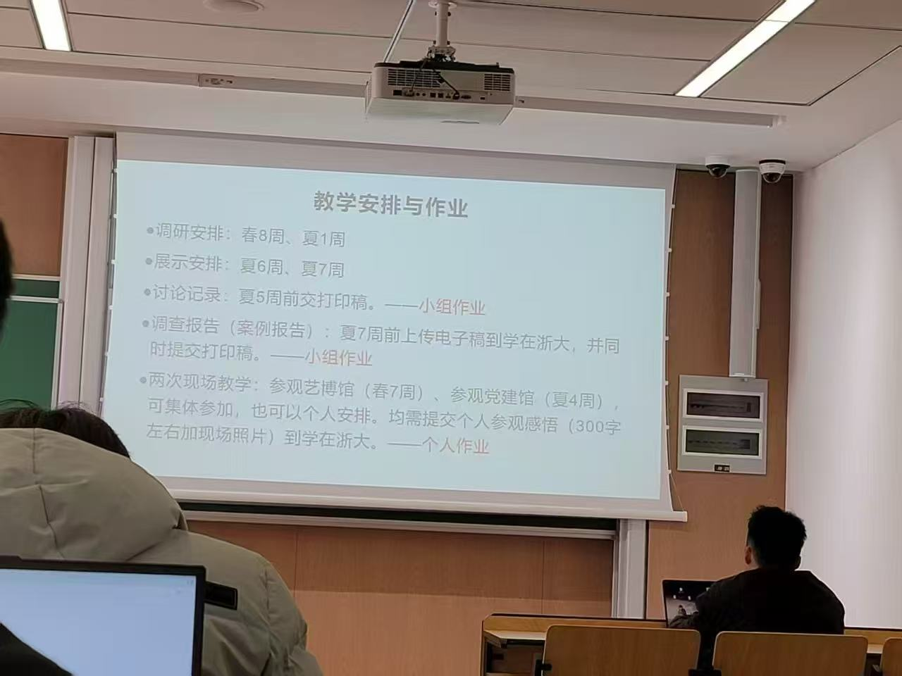

# Main Takeaway

我去上过课吗？？？

<!--more-->

我回答的讨论题，春二周。举一例说明”各国现代化的共同特征“

# References

- [2024-2025秋冬习概回忆卷(完整) - CC98论坛](https://www.cc98.org/topic/6084454)

- [【3学分习概】复习资料和一点感受（习近平新时代中国特色社会主义思想概论） - CC98论坛](https://www.cc98.org/topic/5807496/1#1)
- https://www.cc98.org/topic/5798627

- [2023春夏3学分习概/习思想回忆卷 - CC98论坛](https://www.cc98.org/topic/5635275)

- [【回忆卷】2023夏习概(2学分)a卷回忆卷 - CC98论坛](https://www.cc98.org/topic/5635264)

- [习概回忆卷 22-23 b卷 - CC98论坛](https://www.cc98.org/topic/5537147)
