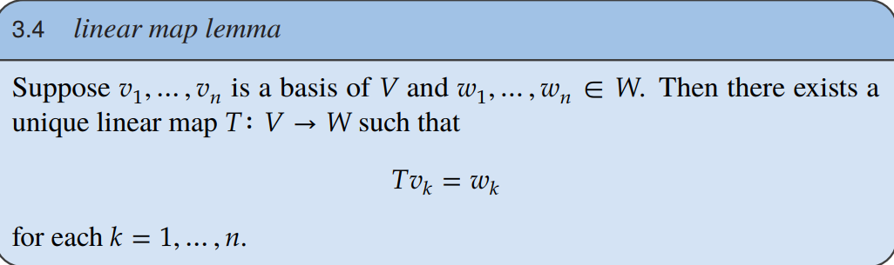
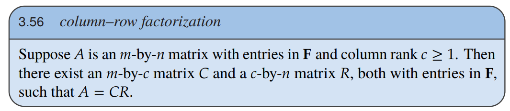
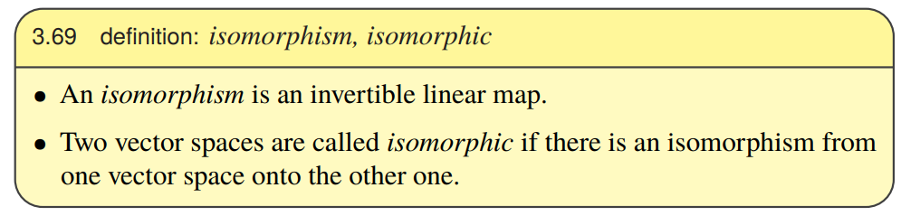

# Main Takeaway

- 书本官方网站[Linear Algebra Done Right (axler.net)](https://linear.axler.net/)

- 大佬的notes and exercises [celiopassos/linear-algebra-done-right-solutions: Solutions to Linear Algebra Done Right, Third Edition (github.com)](https://github.com/celiopassos/linear-algebra-done-right-solutions)
- 大佬的notes and exercises[Wayne Small's Blog (waynemystir.github.io)](https://waynemystir.github.io/)

- MIT的线代笔记：[MIT18.06 跟男神教授学线性代数 - 知乎 (zhihu.com)](https://www.zhihu.com/column/gs-linear-algebra)

This encounter will focus on abstract vector spaces and linear maps.

<!--more-->

# CH1 Vector Spaces

- direct sum：$u_1+...+u_m,each\space vector\space in\space U_1+...+U_m$ can be presented in only one way.

  Suppose U and W are subspaces of V. Then U+W is a direct sum if and only if U∩W={0};

# CH2 Finite-Dimensional Vector Spaces

learning objectives：span, linear independence, bases, dimension

- span：就是向量线性组合张成的空间 $span(v_1,...,v_m)=\{a_1v_1+...+a_mv_m:a_1,...a_m∈F\}$

- $p(F)$ is the set of all polynomials with coefficients in 𝐅  
  $$
  p(z) = a_0+a_1z+a_2z^2+...+a_mz^m
  $$

  > a polynomial (thought of as a function from 𝐅 to 𝐅)  

# CH3 Linear Maps

“由局部决定整体”的典型体现，揭示了基向量在定义线性映射中的核心地位

- V->W线性映射的集合就是vector space

$$
injectivity(单射)\Leftrightarrow null~ space~equals~\{0\}
$$

- 零空间：$null~ T = \{v\in V: Tv = 0\}$，核与零空间等价
- range就是L经线性映射后张成的空间
- injective单射，surjectivity满射；

$$
dimV=dim\space null\space T+dim\space range\space T
$$

矩阵乘法的含义[【2.3】正式谈谈矩阵的乘法和矩阵的逆 - 知乎 (zhihu.com)](https://zhuanlan.zhihu.com/p/126548944)

matrix product
$$
(AB)_{j,k} = A_{j,\cdot}B_{\cdot,k}
$$

$$
(AB)_{\cdot,k} = AB_{\cdot,k}
$$

linear combination of columns

matrix multiplication as linear combinations of columns or rows  

- column rank=row rank=rank

column–row factorization(分解)

$C$是A中线性无关的列，R

How to find CR for every A ? Elimination !

Invertibility and Isomorphisms(同构)

# References

- [Linear Algebra Done Right (axler.net)](https://linear.axler.net/)
