# Main Takeaway

运筹学（operational research,O.R.），运筹就是运算、筹划

运筹学的目的是帮助管理人员在决策时提供科学依据，实现有效管理、正确决策和现代化管理。的主要特点是以整体最优为目标，从系统的观点出发，寻求最佳的行动方案。——From gpt

<!--more-->

【【运筹学】应试向基础教程（已完结）{适用范围：本科期末、考研、考博}】https://www.bilibili.com/video/BV1Uw411f7WM?p=4&vd_source=93bb338120537438ee9180881deab9c1


# 概述

运筹学特点：


运筹学解题过程：


## 主要内容

- 规划论(programming theory)：用已有资源完成最大目标/用最小资源完成既定目标
  - 各种规划
  - 本质：数学中的最优化技术（optimization technique）

- 图论(graph theory)：以抽象图为工具，进行规划研究  

- 决策论(decision theory)：借助一定的理论、方法和工具，科学地选择最优方案的过程  

- 对策论(game theory)：指有竞争性的决策称为对策（博弈型决策）  

- 排队论(queueing theory)：排队论主要研究各种系统的排队队长，排队的等待时间及所提供的服务等各种参数，以便求得更好的服务。

  它是研究系统随机聚散现象的理论  

- 存储论(invertory theory)：研究不同的需求、供货、及到达方式下的订货策略，使订购、存储和缺货的费用最小  

- 可靠性理论(reliability theory)：研究系统故障、以提高系统可靠性问题的理论  


# 线性规划及单纯形法


## 线性规划问题及数学模型


> 看x是有符号约束还是free——无符号约束

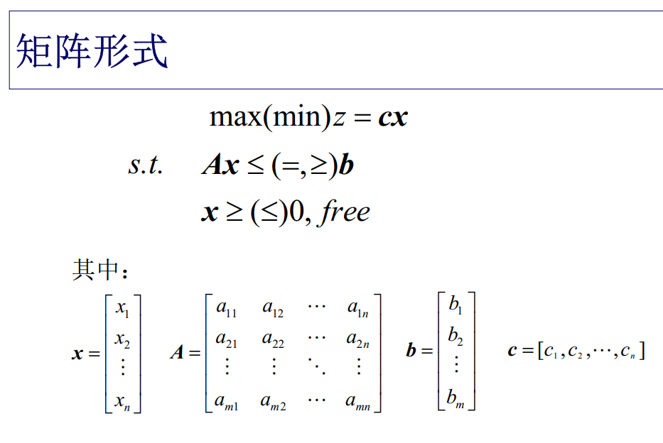


## 图解法

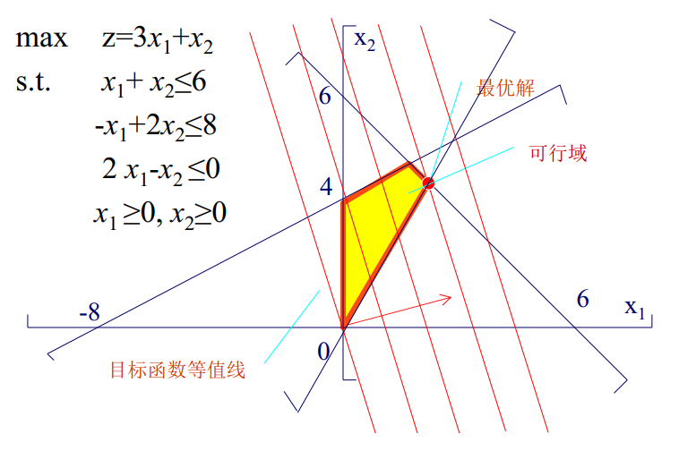

> 可行域常为凸集——[最优化理论入门（一） 凸集与凸函数](https://zhuanlan.zhihu.com/p/336704622)
>
> 凸集是指在欧几里得空间中，对于集合内的每一对点，连接该对点的直线段上的每个点也在该集合内。

- 唯一最优解：常在可行域的顶点上
- 无穷多个最优解：目标函数等值线与可行域的一条边重合

- 无界解：遗漏了约束条件
- 无可行解：约束矛盾


## 单纯形法原理

### nuts and bolts

单纯形法（Simplex Method）是一种用于解决线性规划问题的数值求解方法。该方法的名称来源于其数学基础，即单纯形的概念。

在数学中，单纯形是指由多个顶点组成的凸包，例如，在一维空间中是一个线段，在二维空间中是一个三角形，在三维空间中是一个四面体等。单纯形法利用了线性规划问题的可行域是凸集这一特性，通过在可行域的顶点之间进行迭代搜索，以找到最优解。


### 线性规划问题的标准形式


> 两个约束条件

转化为标准形式：

- 变量条件的转化

  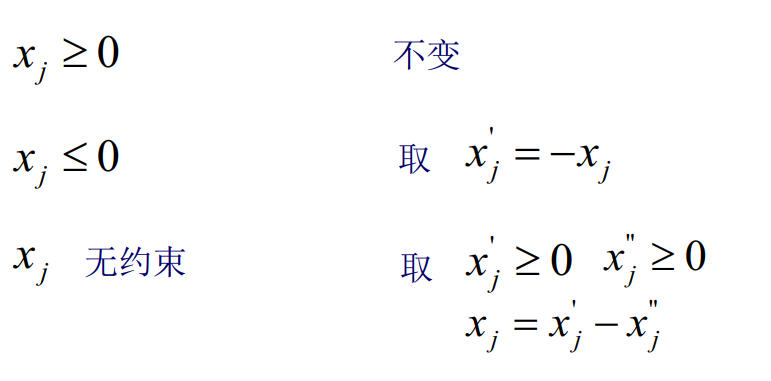

  > $x_j=x_j`-x_j``$很重要的思想，最终$x_j$的取值根据优化结果决定

- 约束条件的转化

  

  > slack：松弛的

- 目标函数的转化

  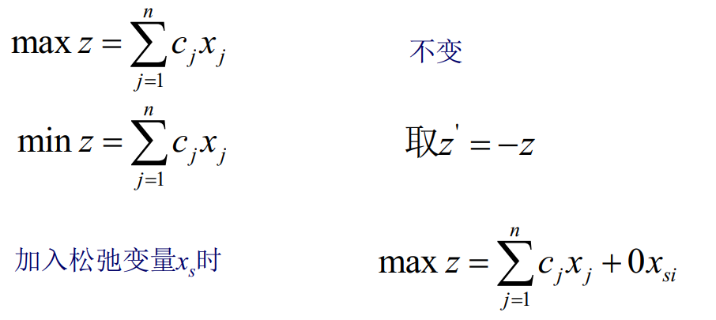

非齐次线性方程组解  ：

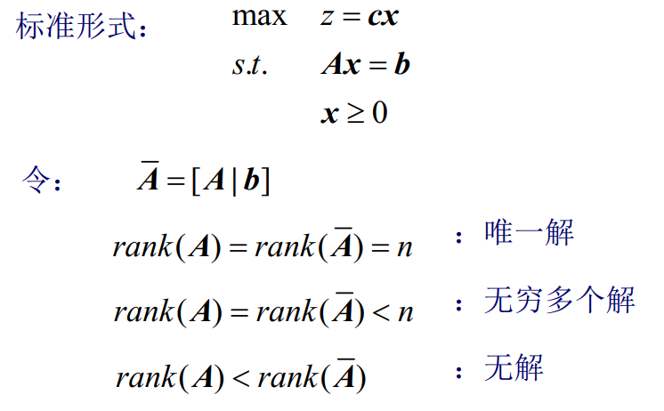

一般情况：
$$
rank(A)=rank(\bar A)=m<n
$$

> 要求行满秩——如果不是则变换一下去掉冗余约束

- 没有冗余约束
- 解有无穷多个


### 解的性质

[线性规划的单纯形算法理论——含证明 - 知乎 (zhihu.com)](https://zhuanlan.zhihu.com/p/364011259)

- 可行域——满足两类约束条件的解的集合

  可行域都是凸集：$\Omega=\{x|Ax=b,x\ge0\}$

- 凸集——两点的凸组合仍在集合中

  凸组合：$ax_1+(1-a)x_2\in C,0<a<1$

- 顶点——不能表示为集合内两点的凸组合

  可行域顶点的几何解释：

  

  超平面$\sum {a_jx_j}=b$——线性方程表达一个$n-m$维超平面

  > 例如图中一个资源约束：三个变量一个约束，则在三维空间中可行域是3-1=2维


- 约束方程中找出线性无关的列向量当作基变量：将非基变量设为0，然后求出基变量——即为基本解（$C_n^m$）

- 基可行解：满足可行域条件的基解——找可行域顶点

  

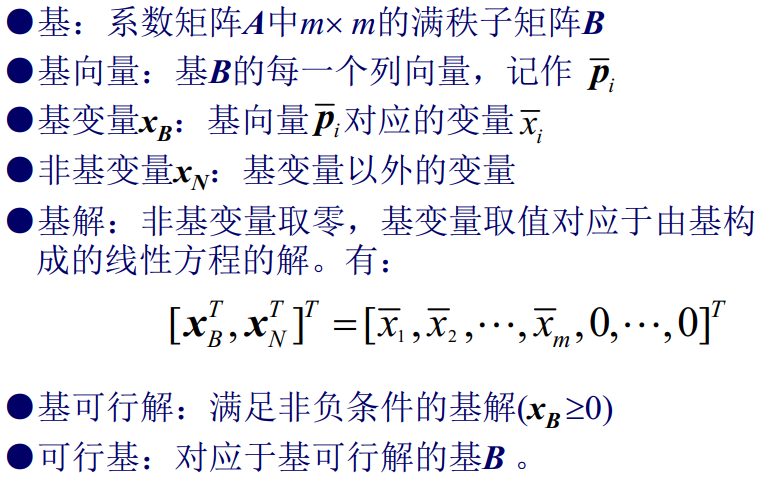

总结：


线性规划最优解性质：


### 单纯形法思路

【基本单纯形法解线性规划问题示例】https://www.bilibili.com/video/BV11f4y1x7sK?vd_source=93bb338120537438ee9180881deab9c1

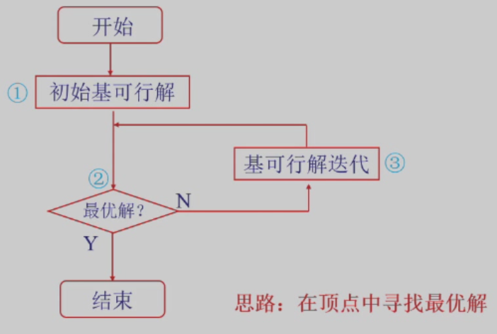

- 步骤：

  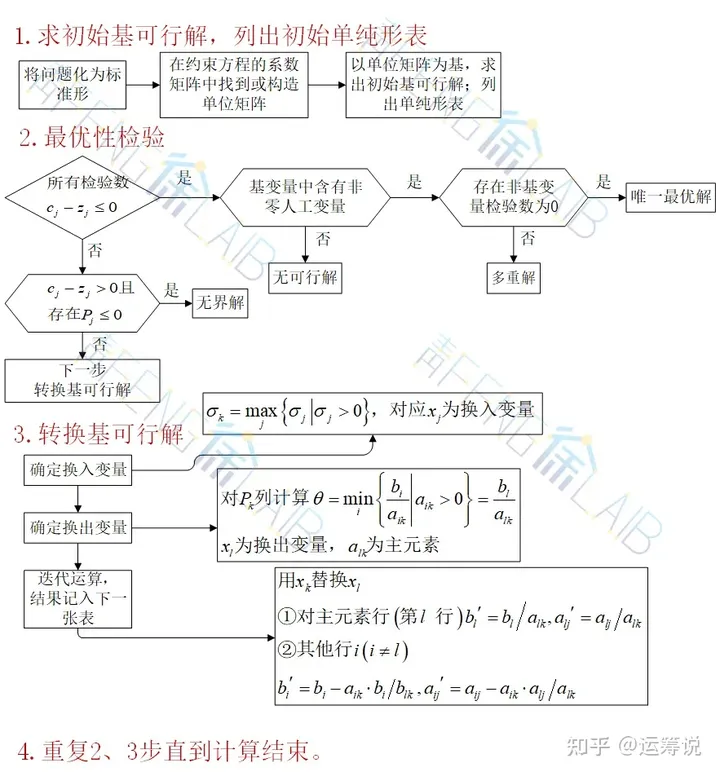

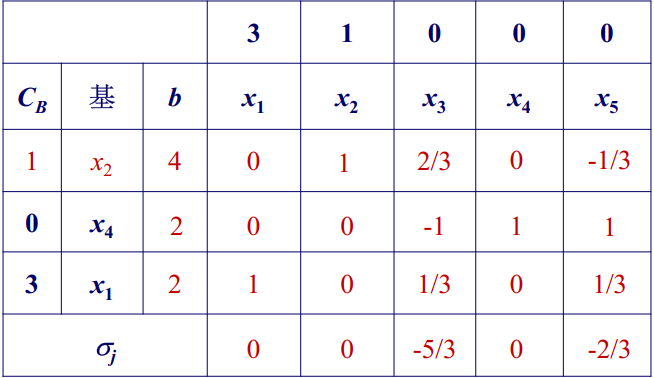

- $C_B$列：基变量对应的价值系数

- 最优数检验

  检验数的计算：
  
  $c_j$即价值函数的系数，$z_j=\sum{C_{Bi}a_{ji}}$——对应数相乘再相加
  $$
  检验数:\sigma_j=c_j-z_j,\sigma_j>0,z增大,\sigma_j<0,z减小
  $$
  
  > Tips：初始单纯形表的检验数行即为目标函数中的系数$c_j$
  
- 入基变量、出基变量
  $$
  入基变量x_k:\sigma_k=max_j\{\sigma_j|\sigma_j>0\}
  $$

  $$
  出基变量x_l:\theta=min_i\{\frac{\bar x_i^{(0)}}{a_{ik}} |a_{ik}>0 \}
  =\frac{b_l}{a_{lk}}
  $$

  > 先根据$\sigma_j$找到入基变量，再根据入基变量选择出基变量

- 换基+更新单纯形表

  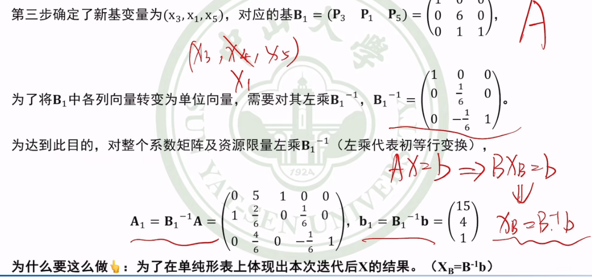
  
  > 算$B^{-1}$
  
- 解的说明：

  


### 退化与循环

退化：基变量出现零的现象

影响：可能出现循环迭代


### 进阶

#### 人工变量法（大M法）


#### 两阶段法

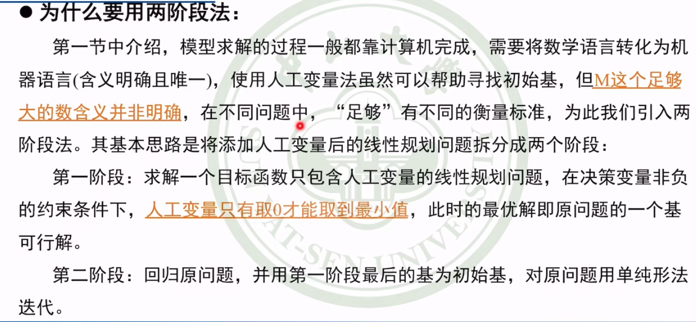


- 第一阶段

  

  > 满足$(x_6,x_7)=(0,0)$，和原问题有相同约束，人工变量不影响

- 第二阶段

  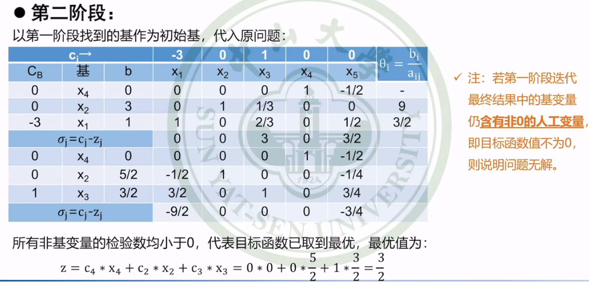


# 线性规划的对偶理论


## 什么是对偶

> 当一个线性规划问题的变量都具有非负约束时，且其约束条件当目标函数求极大值时均取"$\le$"号，目标函数求极小值时均取"$\ge$"号


> 化为标准型：
>
> 


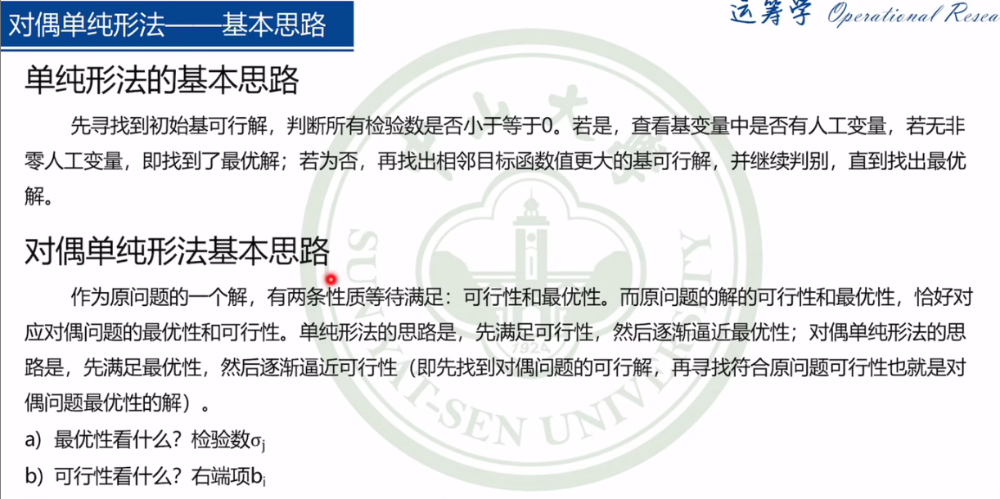

## 对偶问题的性质


> 与传统单纯形法对比不要求资源限量$b_i$为正


- 强对偶性：若原问题和对偶问题均有可行解，则两者均有最优解，且最优解目标函数值相同$cx=b^Ty$

- 互补松弛性！

  

  > 两者中必有一个为0


## 化为对偶问题


1. 确定对偶问题中的变量的个数m

   原大括号中约束条件的个数m等于对偶问题中的变量个数

2. 确定对偶问题的目标函数

   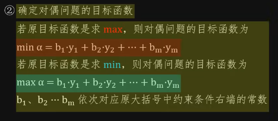

3. 确定对偶问题中约束条件的个数n
   $$
   n=原线性规划问题中变量的个数
   $$

4. 确定对偶问题中约束条件左边系数

   

5. 确定对偶问题中约束条件右边常数

   

6. 确定对偶问题中约束条件中的符号

   

7. 确定对偶问题中变量的范围

   


## 求对偶问题的最优解

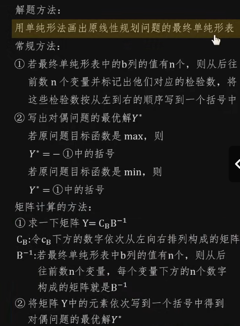


## 求原问题的最优解


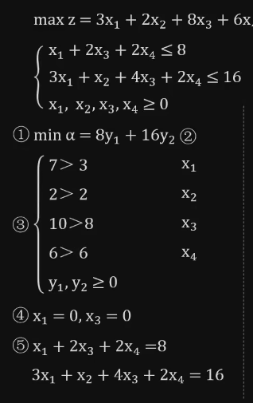

## 影子价格


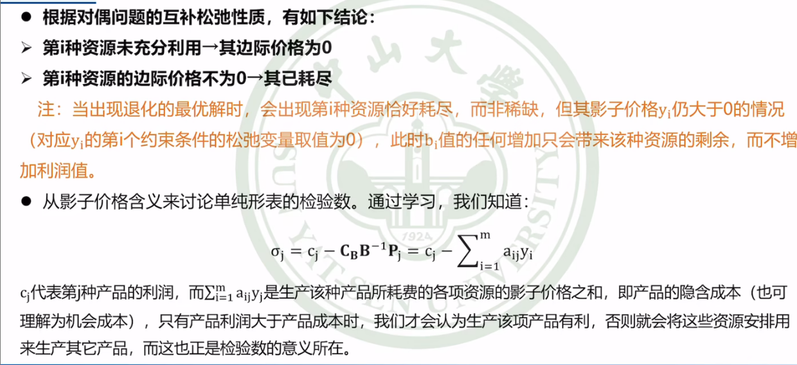

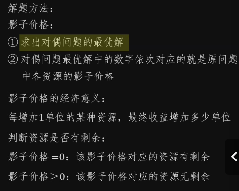


# 运输问题


## 问题提出

- 目标：成本最小化
- 条件：产销平衡

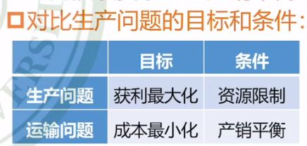


- 产销不平衡

  > 产量>销量，需设销地；产量<销量，需设产地

- 有转运的运输问题

  > 不管销地/产地，都叫中转站

- 产销不确定


## 数学模型


模型特点：

- 解有上下界

- 约束条件的系数矩阵

  

运输问题约束方程的 系数矩阵都是由 0 00 或 1 11 组成 的 , 这种矩阵称为 稀疏矩阵 , 稀疏矩阵的计算要远远比正常的矩阵更简单 ;


## 运输问题求解

### 基本思想


单位运价表：


### 寻找初始基可行解

#### 西北角法

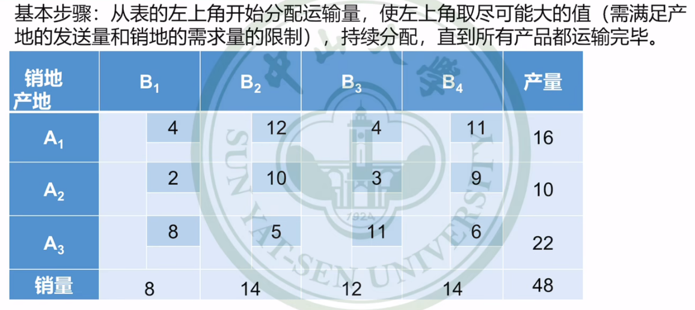

> 不一定最优
>
> 从左上角开始找一组基可行解


#### 最小元素法

基本步骤：每次有限考虑单位运价最小的运输业务，最大限度满足其运输量

> 在西北角法上进了一步


#### 沃格尔法

计算罚数，每次填罚数最大的那一个

> 以罚数作为一个参考
>
> 利用过的罚数就不再用了

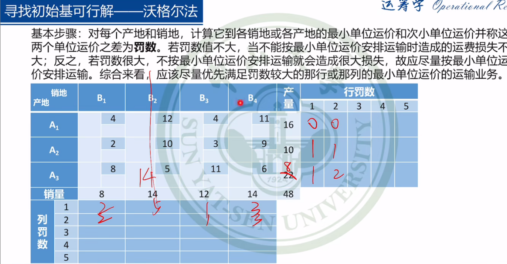


### 最优性判别及迭代


#### 闭回路法


检验数：


> 要找到所有的检验数，


- 在偶数顶点中，找出运输量最小的顶点作为出基变量


#### 位势法


# 整数规划


## 问题建模

相比于原有的线性规划模型，新的数学模型多了**决策变量取整数的约束条件**

原问题就叫松弛问题


问题类型：

- 全部决策变量均必须取整数：纯整数问题

- 混合整数问题

- 0-1型整数规划

  0-1变量作为二进制变量（或逻辑变量）

  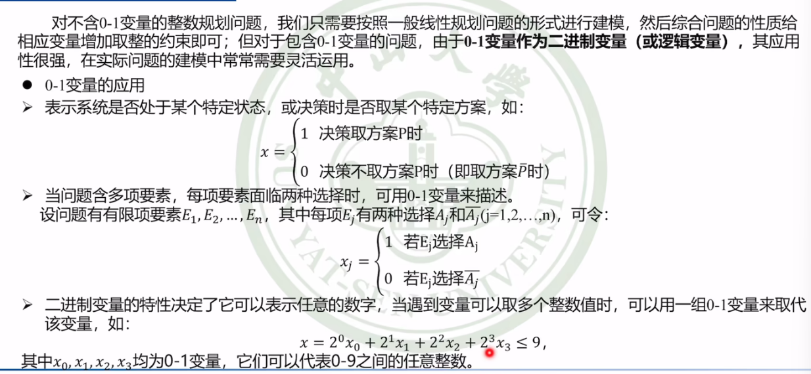

- 非0-1型整数规划

  不含0-1变量，正常建模即可


## 数学建模


### 含0-1变量

0-1型整数规划

0-1变量作为二进制变量（或逻辑变量）


> 大M法处理不需要的约束
>
> 固定费用也用0-1建模

> example: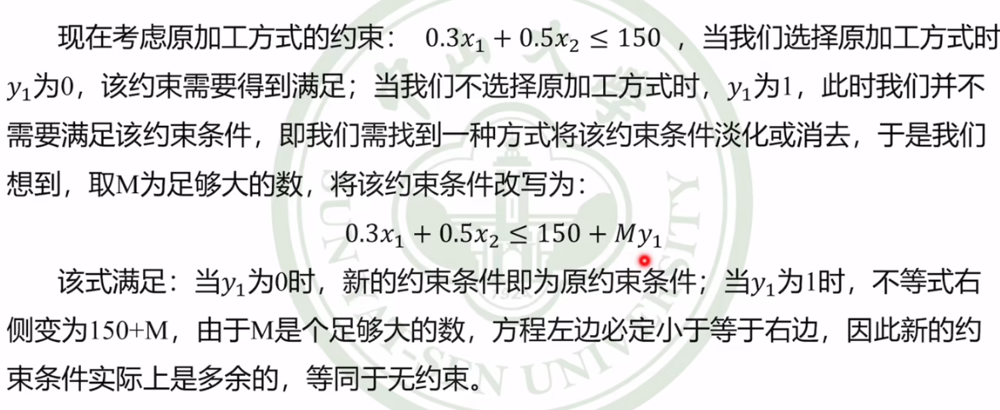


## 割平面法

### 基本思路

逐步增加约束条件


### 求解过程

先算对应的松弛问题的最优解（单纯形法）


然后如果$b_i$不为整数，拆成整数和分数


直接写最后一个式子即可


引入新的松弛变量将符号变为=，得到割平面方程


### 例题


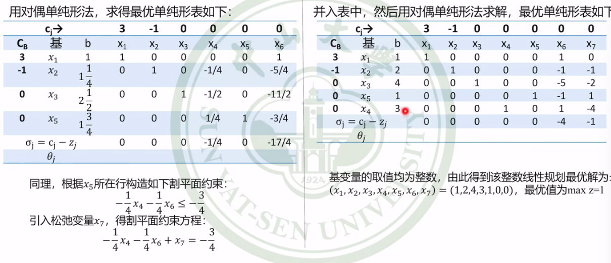


## 分支定界法

【【运筹学】-整数线性规划(一)(分支定界法)】https://www.bilibili.com/video/BV1o3411a7Rk?vd_source=93bb338120537438ee9180881deab9c1

### 基本思路

先分支再确定解


> 下届是求得的最大整数解——过程中变量全为整数得到的解


### 求解过程


### 例题


# 非线性规划

NLP全称为Nonlinear programming，即非线性规划，指**目标函数和约束条件至少有一个为非线性的数学规划问题**。

## 数学模型


> 以求最小值为标准问题


- 非线性规划解的类型

  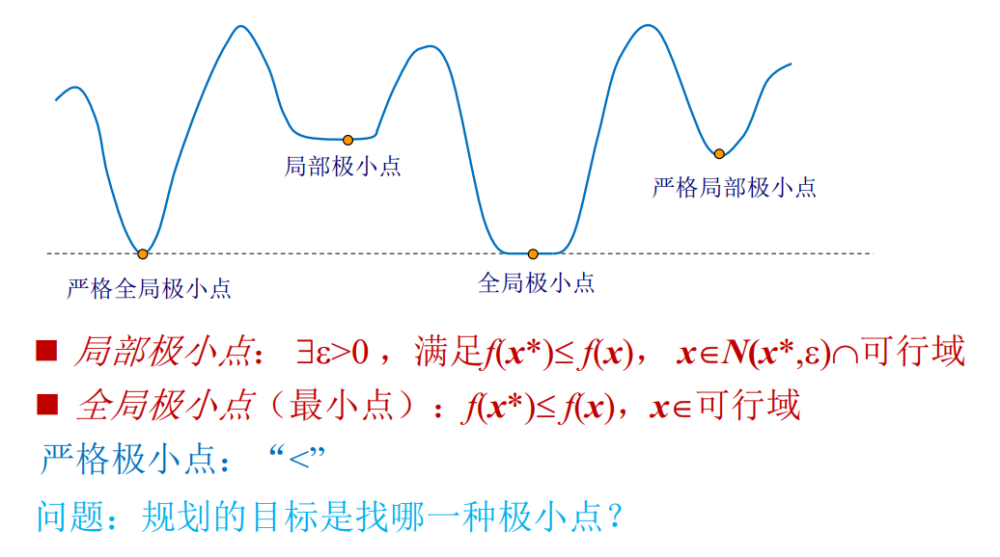


## 解析解法


### 无约束极值问题

就是vjf学的

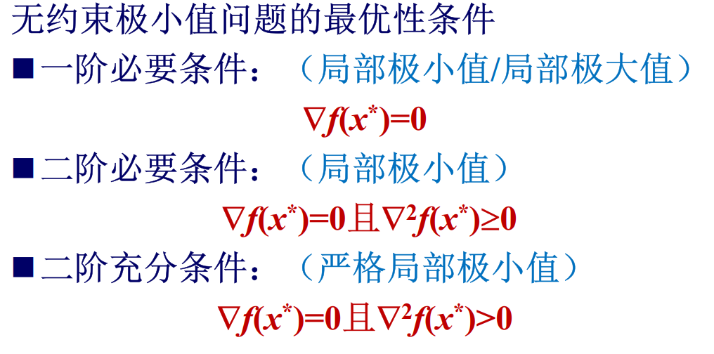


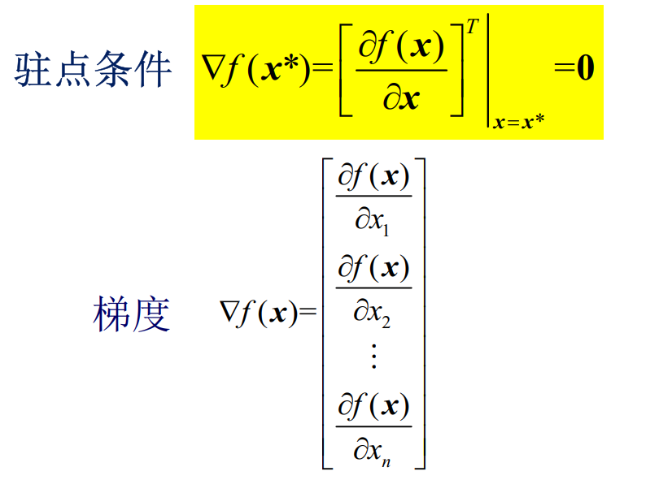


### 有约束极值问题


#### 等式约束


使用Lagrange函数法将有约束极值问题转化为无约束极值问题

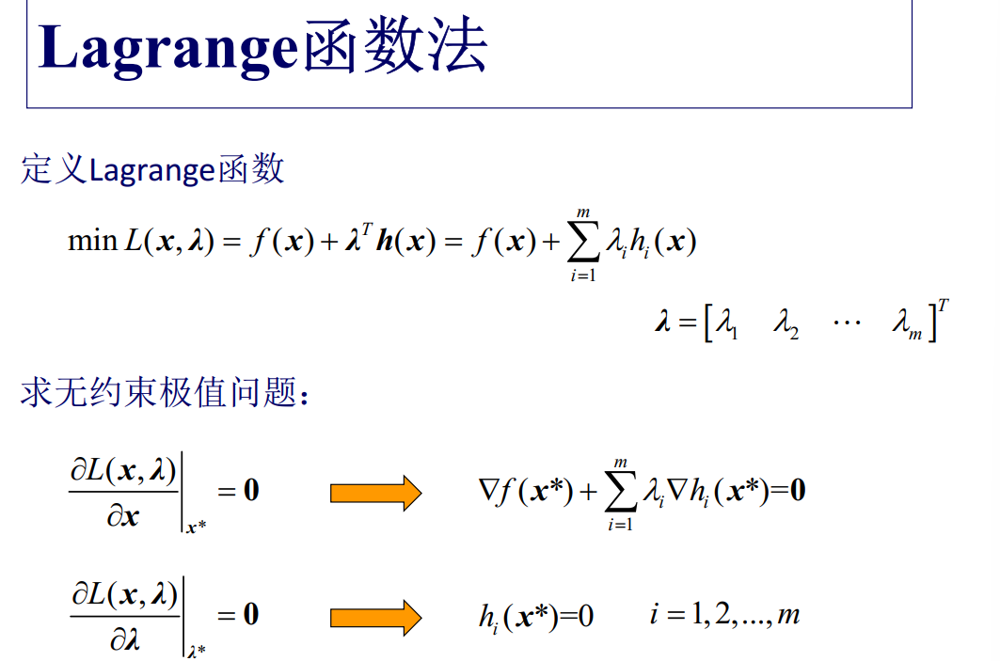


#### 不等式约束

[【非线性优化】非线性约束问题的KKT条件 - 知乎 (zhihu.com)](https://zhuanlan.zhihu.com/p/556811802)

[运筹说 第99期 | 非线性规划—最优性条件](https://zhuanlan.zhihu.com/p/677937880)

例题：[约束优化问题的最优性条件-CSDN博客](https://blog.csdn.net/m0_61209712/article/details/134712152)

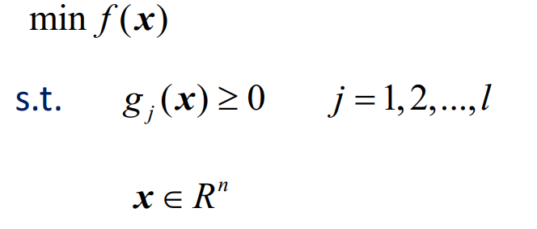

求解思路：

直观思想：邻域内不存在可行的更优解  


##### **Fritz John条件**

设X是非线性规划的局部最优点，函数$f(x)$和$gj(x)(j=1,2,...,l)$在点X有连续一阶偏导，则必然存在不全为零的数$μ1,μ2,...,μl$，使


该定理给出了非线性规划的局部最优点应满足的必要条件，上式称为**Fritz John条件**，满足这个条件的点称为**Fritz John点**。

- Fritz John条件是由Gordan引理矩阵展开得到。Gordan引理只对起作用约束做了说明，Fritz Join定理采用互补松弛条件将非作用约束引入，取对应参数为0改良得到。
- 判断一个点是不是Fritz John点的步骤就是找到对应点的函数梯度，带入公式看是否能找到不全为零的数使得方程成立。

 

##### K-T条件

K-T条件是确定某点为非线性规划最优解的一个必要条件，但一般来说不是充分条件，因此满足该条件的点**不一定**是最优点。但是对于凸规划，它既是最优点存在的必要条件，也是充分条件。

设*X**是上述问题的局部极小点，函数*f(x)*和*gj(x)*(*j*=1,2,...,l)在*X**点有连续一阶偏导，且*X**处的所有起作用约束的梯度线性无关，则存在*μ1\*,μ2\*,...,μl\*,*使


##### KKT条件

[非线性规划——库恩塔克KTT条件（五） - 郝hai - 博客园 (cnblogs.com)](https://www.cnblogs.com/haohai9309/p/17465181.html)

KKT条件是在Fritz John条件的基础上，增加了一些正则性条件，以确保解的稳定性和唯一性

设 $\mathbf{x}^{*}$ 是如下问题
$$
\quad \begin{aligned} \min & \quad f(\mathbf{x})\\ {\rm s.t.} &\quad g_i(\mathbf{x}) \leq 0,\quad i=1,2,...,m\\ &\quad h_j(\mathbf{x})=0,\quad j=1,2,...,p \end{aligned} \quad(4)\\
$$
的局部最小值点，其中 $f,g_1,...,g_m,h_1,h_2,...,h_p$ 是 $\mathbb{R}^{n}$ 上的连续可微函数。设 $I(\mathbf{x}^*)=\{i:g_i(\mathbf{x}^*)=0\}\\$是有效约束集，假设有效约束的梯度和等式约束的梯度是线性无关的，即 $\{\nabla g_i(\mathbf{x}^*):i \in I(\mathbf{x}^*)\}\cup\{\nabla h_j(\mathbf{x}^*):j=1,1,...,p\}\\$是线性无关的，其中$ I(\mathbf{x}^*)=\{i:g_i(\mathbf{x}^*)=0\} $，则存在 $\lambda_1,\lambda_2,...,\lambda_m \geq 0 和 \mu_1,\mu_2,...,\mu_p \in \mathbb{R}$ 使得 
$$
\begin{aligned} \nabla f(\mathbf{x}^*)+\sum_{i=1}^{m}{\lambda_i \nabla g_i(\mathbf{x}^*)}+\sum_{j=1}^{p}{\mu_j\nabla h_j(\mathbf{x}^*)} &=0\\ \lambda_i g_i(\mathbf{x}^*) &=0,\quad i=1,2,...,m \end{aligned}\\
$$
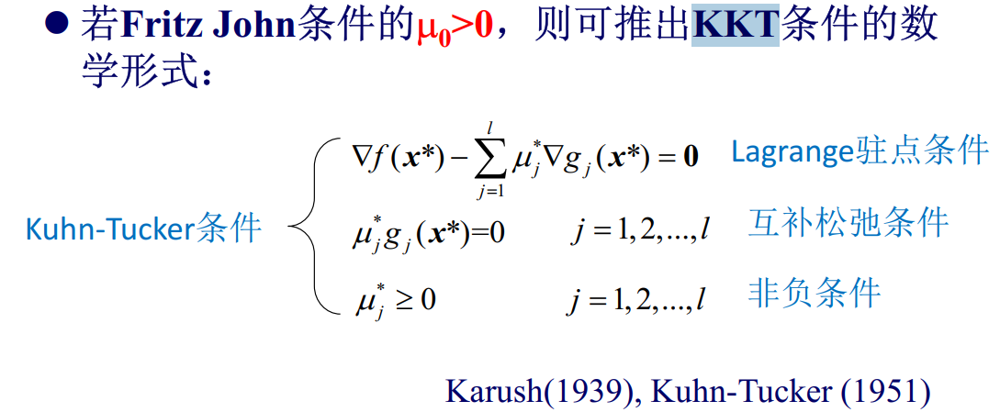


## 数值解法

下降迭代法

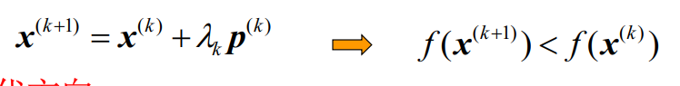

- 最速下降法——沿负梯度下降

  

- 牛顿法

  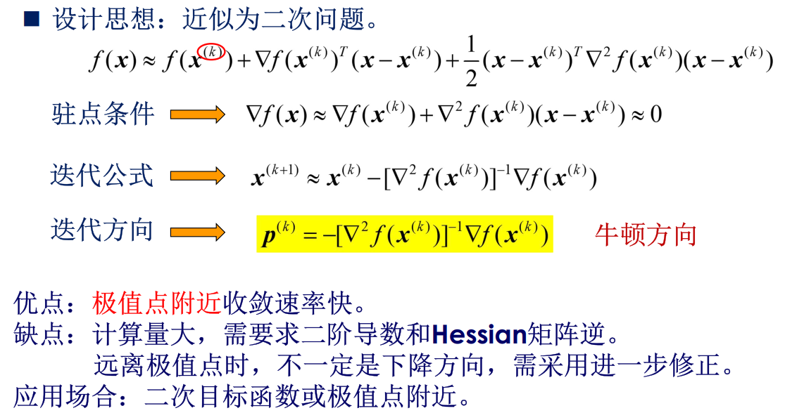

[共轭梯度（CG）算法_共轭梯度法-CSDN博客](https://blog.csdn.net/lusongno1/article/details/78550803)


## 智能算法


### BP算法


### 遗传算法


# 动态规划

动态规划是线性规划的一种

特点：递推关系；多阶段决策优化

## 数学模型

- 问题提出：

  

- 阶段

- 状态：k阶段开始（或结束）时的客观条件，记为$s_k\in S_k,S_k$为k阶段状态集合

  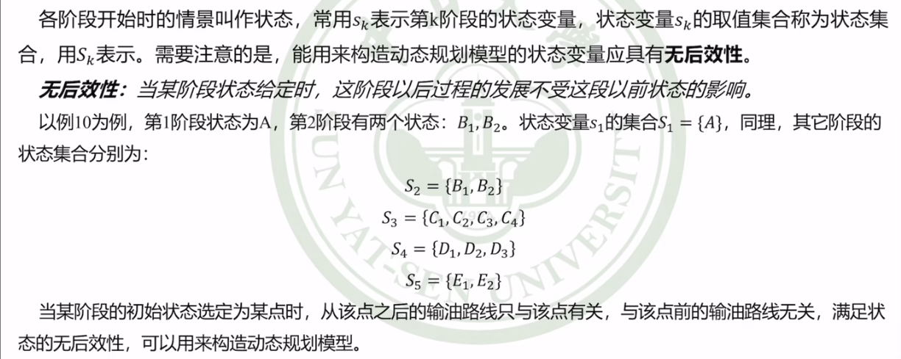

  > 无后效性——很重要！

- 决策和策略

  - 决策：$u_k(s_k)\in D_k(s_k),D_k(s_k)$为状态$s_k$的允许决策集合

  - 策略：$P_{1,n}=\{ u_1(s_1),u_s(s_2),\dots,u_n(s_n) \}\in P,P$为允许策略集合，策略各阶段决策依次构成的决策序列  

- 状态转移方程：给出一种递推关系

  
  $$
  s_{k+1}=T_k(s_k,u_k(s_k))
  $$

  > 状态无后效性！

- 子过程与子策略

- 指标函数：评价沿子策略$p_{k,n}$过程性能优劣的函数
  $$
  V_{k,n}(s_k,p_{k,n})
  $$
  可分离性：

  

  $\varphi(k)$的常见形式：求和型，乘积型


## 求解模型

基本思想：最优化原理——最优策略的子策略是对应子问题的最优策略  

> 是策略最优的**必要条件**

充要条件：（各个阶段的子策略都是最优策略）


多阶段决策，从边界开始，逐段递推寻优，各阶段孤立，综合考虑效益（无后效性）


### 顺序解法

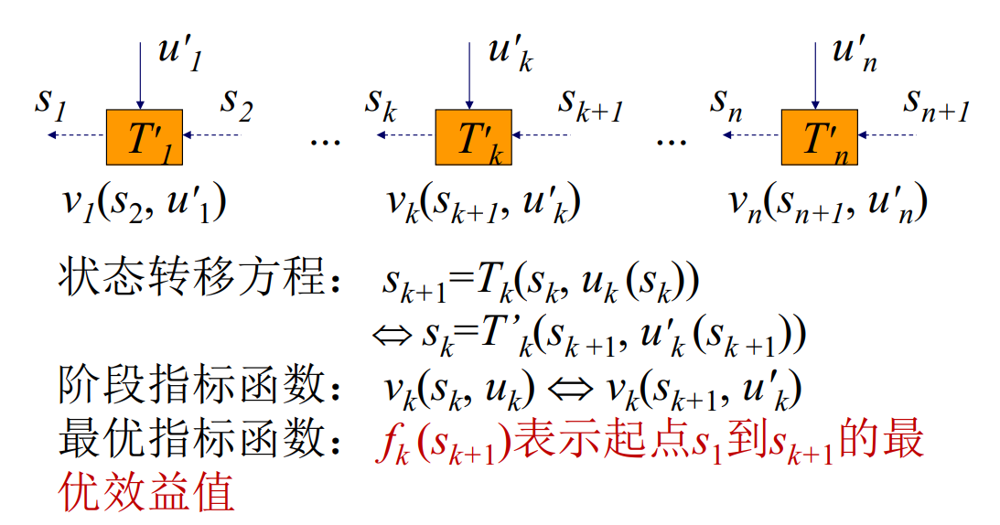


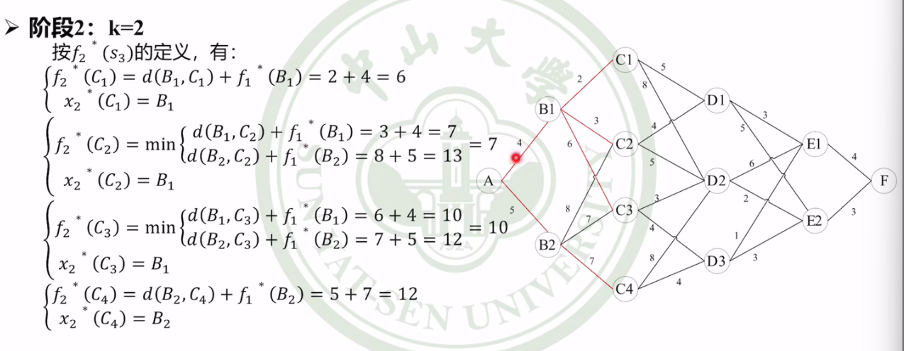

### 逆序解法


> 若初始状态给定时，用逆序解法比较简单。反之，用顺序解法简单  


### 连续变量解法


## 习题


把阶段，状态变量、决策变量，状态转移方程，阶段指标函数，最优指标函数值的递推方程都列写出来即可


6种题型，建模

### 背包问题


### 生产与储存问题


### 采购与销售


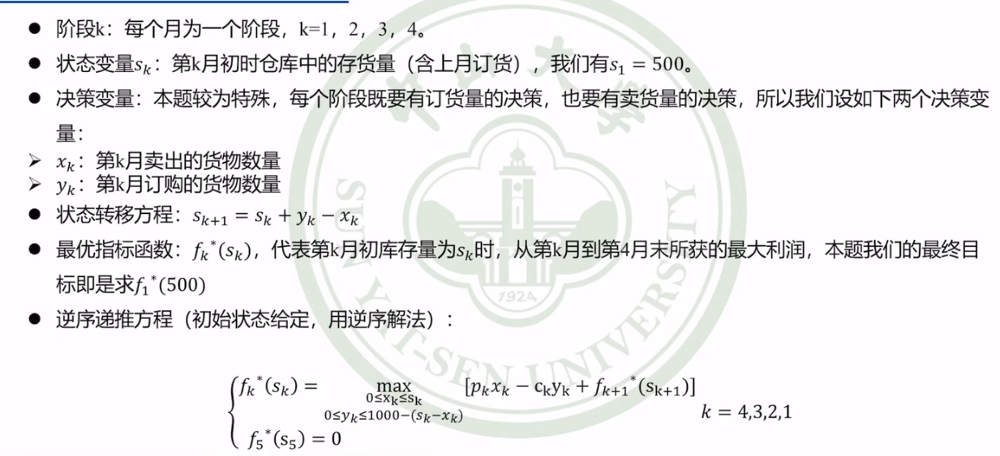


# 图与网络分析

## 图论基本概念

图=端点+边

> 有向图的边也成为弧

- 邻接矩阵

  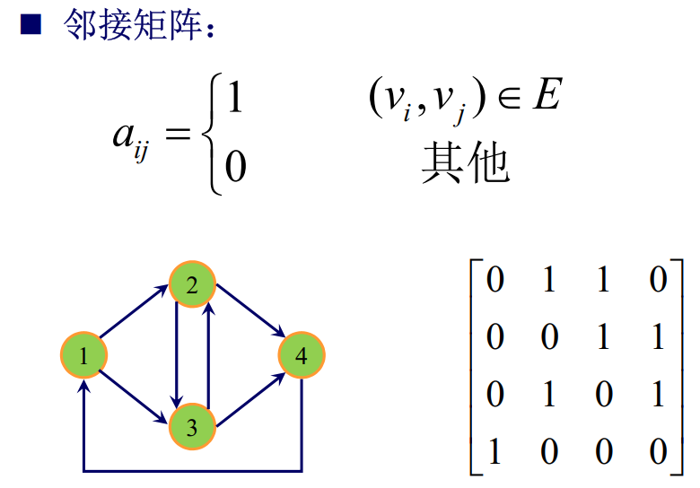

  

- 网络：点或边带权的图（赋权图）

- 链与道路

  

- 连通图：任意两点之间至少又=有1条链相连

- 分图：不连通图中的连通子图

- 数：不含圈的连通无向图

  

  

生成子图

生成树


## 最短路径问题

- Dijkstra算法

  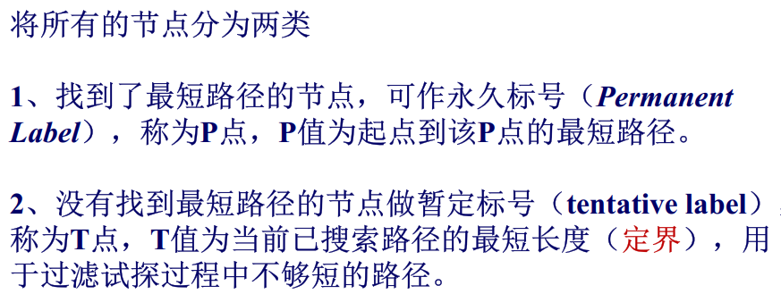

  

  成立条件：所有边的权值**非负**

- 逐次逼近法

  含负权值的最短路径

  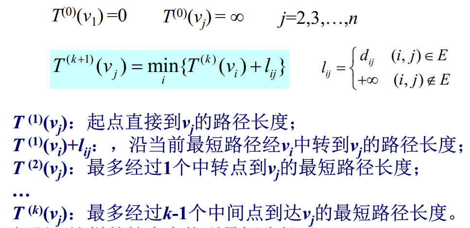

  

  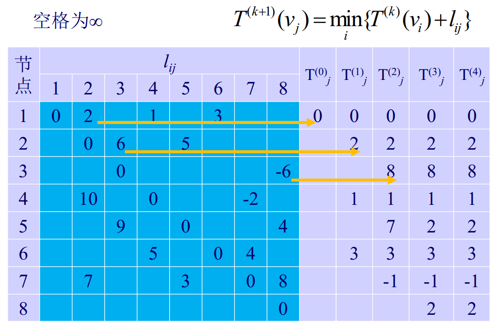

  > 要求所有环的权值和$>0$

- Floyd算法

  求任意两点最短距离

  

## 最大流问题


### Ford-Fulkerson算法

- 思想：不断的增加流量，直至网络饱和  
- 算法：从当前可行流开始，沿可增加流量的路径增大流量


- 不饱和边：流量没有达到容量限制的边  
- 可增广链：从起点到终点方向一致的不饱和边构成的链


最大流性质


**割集**


最大流-最小割定理


## 最小费用流问题


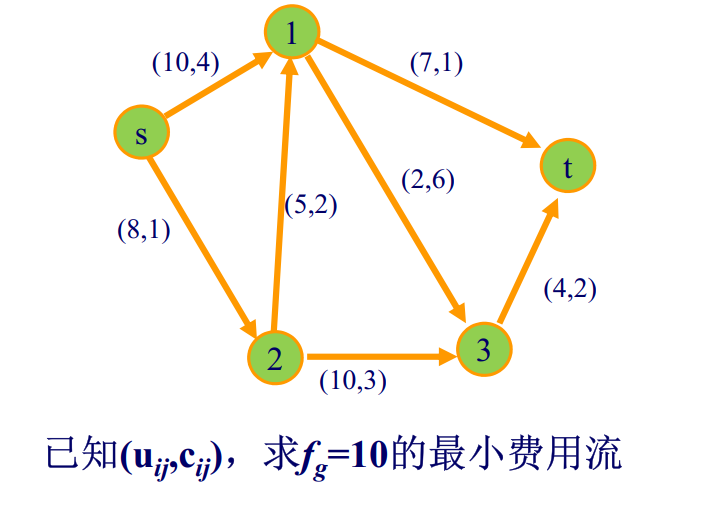

> $u_{ij}$是边的容量，$c_{ij}$是边的费用

对偶算法

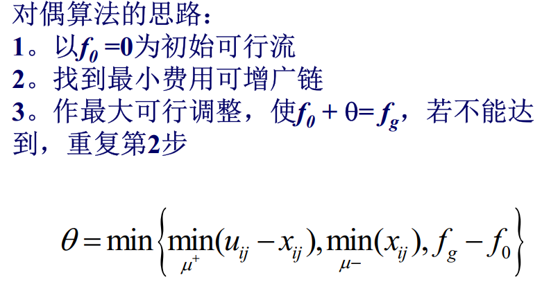


## 习题

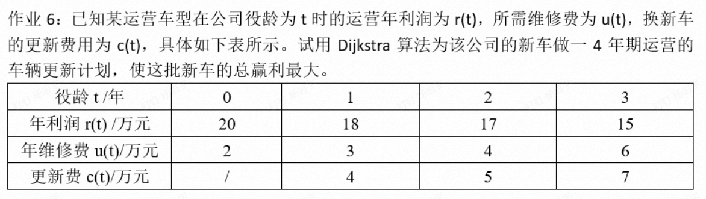

车辆每年都需要维修，在年末决定是否更新车辆，如果更新，则需支付更新费用。


# 目标规划

线性规划的目标是一个刚性的目标但实际应用中，目标常常是模糊的

解决方法：将目标化作一种**软目标/软约束**


求满意解

## 目标规划问题及数学模型

软约束

单目标

多目标：


目标规划思想：将定量技术和定性技术结合，承认矛盾、冲突的合理性，强调通过协调，达到总体和谐

方法：软约束＋优先级  

example:


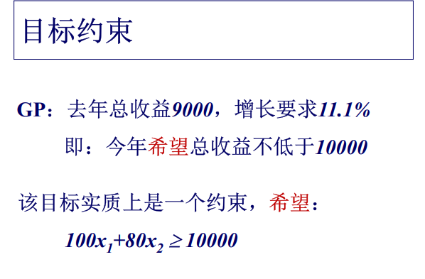

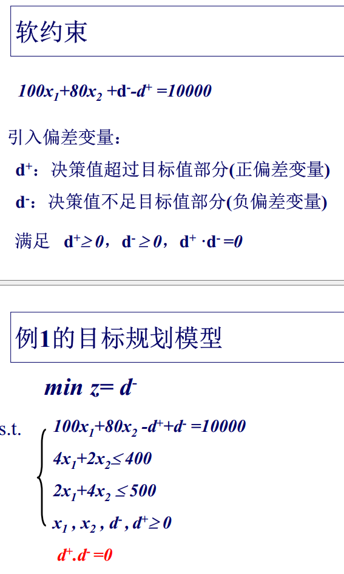

约束条件的表示


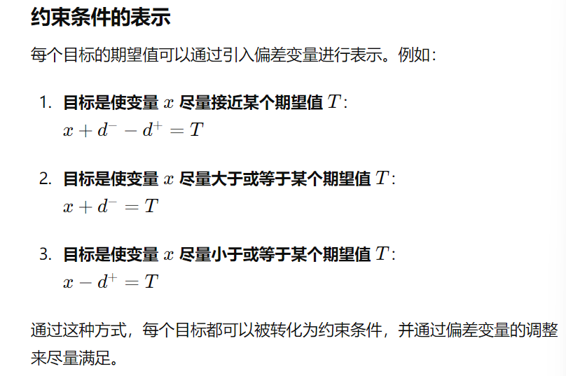


含有绝对优先级：


同等优先级：权系数


目标函数全由偏差系数决定

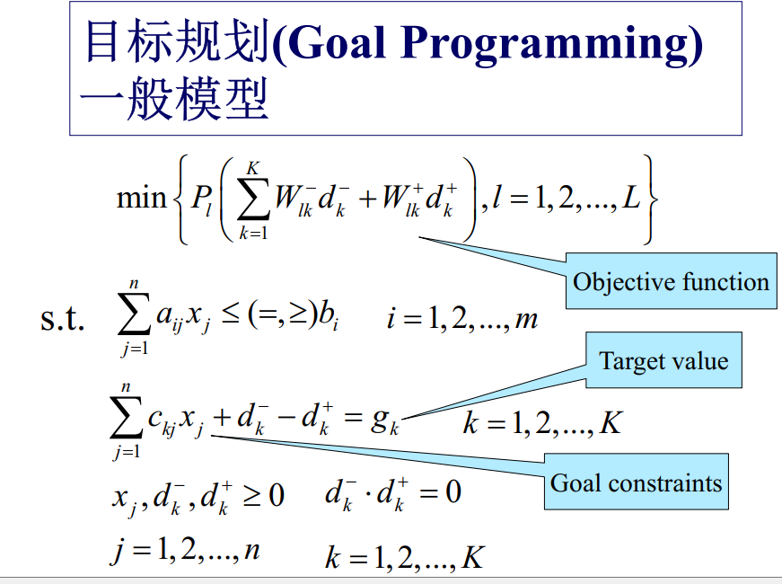


## 集中求解算法

使用单纯形法$d_i^+,d_i^-$不能同时>0


## 序贯求解算法

集合的目标求解：

把优先级最高的目标先满足，

基本思路：按优先级的顺序，从最高级开始，逐个满足目标  

将上一个满足的目标作为下一个目标的约束


# 对策论

## 概述

博弈论三要素

- 局中人（Players）

- 策略集（Strategies）

- 赢得函数/支付函数（Payoff function）


## 二人有限策略博弈


### 矩阵博弈

#### 纯策略博弈及其均衡解

 理性博弈原则：

 

 自身利益最大化原则：

 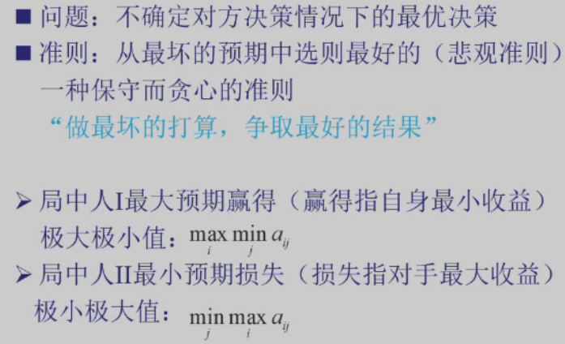

 极大极小值与极小极大值：
$$
 \max_i \min_j a_{ij}\le \min_j \max_i a_{ij}
$$
 

 

 共许原则

 

 最优策略对存在的充要条件：鞍点（驻点+拐点）

 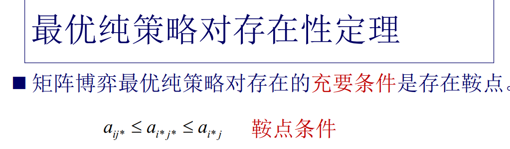

Nash均衡解：


##### 解的类型

- 唯一解

- 多个解（多个鞍点）

  - 无差别性

    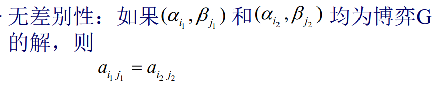

  - 可交换性

    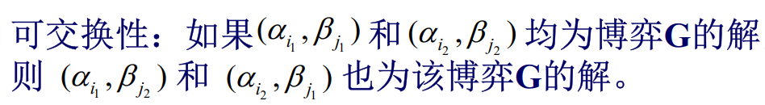

  

- 无纯策略解

  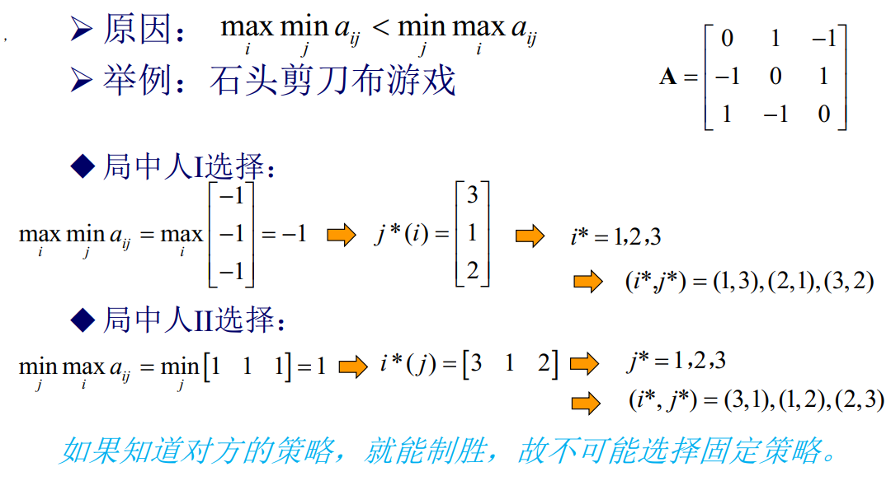


最优纯策略对不一定是鞍点解——但赢得值相同的策略对均等价


#### 混合策略博弈及其均衡解


混合策略的取值在多次博弈中可看作概率，一次博弈中可看作偏好


一定存在均衡解

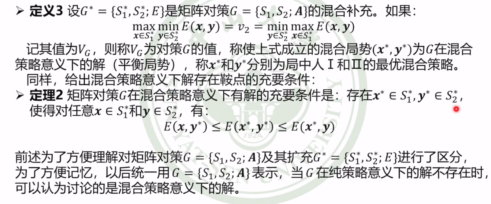

example:

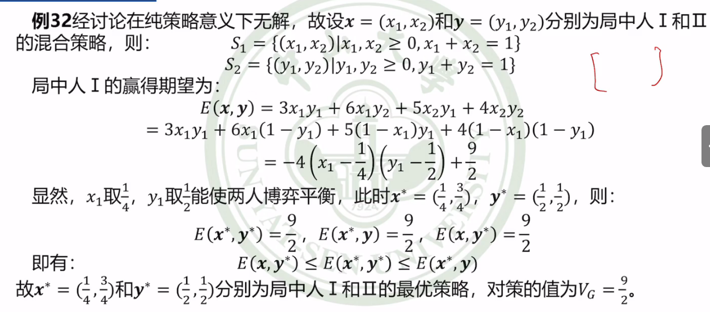

- 主要是列写$E(x,y)$的公式，然后求偏导即可


#### 均衡解的求解

- 一定存在混合策略意义下的矩阵博弈均衡解  

  强对偶性

  

- 定理9

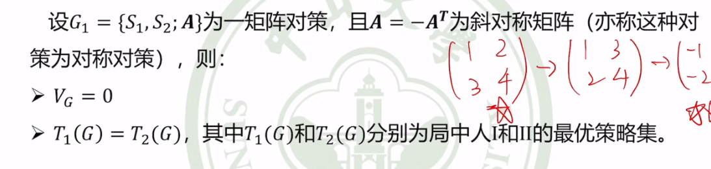


- 图解法

  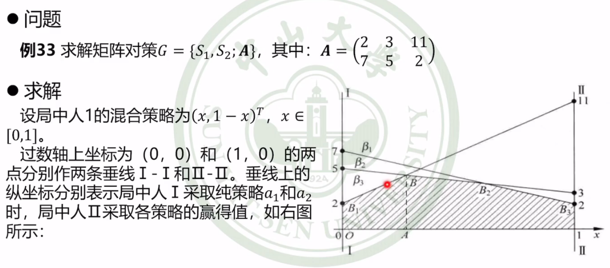

  使三条直线的最小值尽可能大

  > 图解法智能计算矩阵为$2*n ~or ~m*2$的问题

- 方程组法

  

  对偶变量$x^*,y^*$​不为0，则不等式可以转化为等式

  > 先对最优策略对进行化简

  

  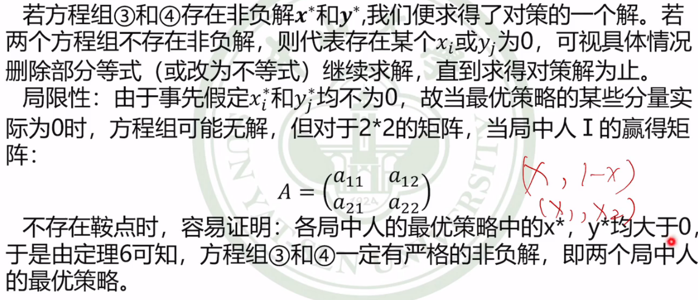


- 线性规划法

  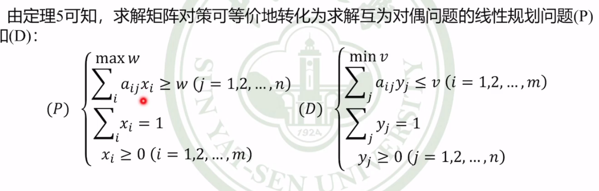

  > 想换掉w

  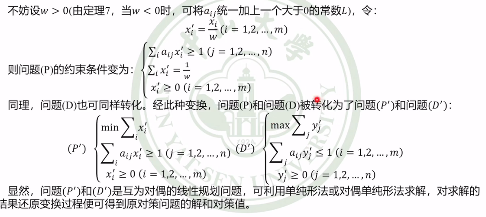


### 双矩阵博弈


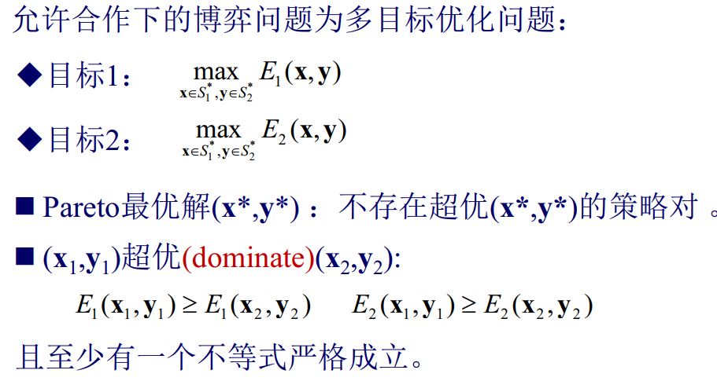

严格意义下的解：满足可交换性和无差别性的Pareto最优均衡解

完全弱意义下的解：反复删除非占优策略所得的简化博弈的严格意义下的解，可以证明同时也是原博弈问题的Nash均衡解


**囚徒困境**

```
MODEL:

sets:
str_I/1..2/:x;
str_II/1..2/:y;

rew(str_I,str_II):R_I,R_II;
endsets

data:

R_I=2 5,0 4;
R_II=2 0,5 4;

enddata
V_I=@sum(rew(i,j):R_I(i,j)*x(i)* y(j));
V_II=@sum(rew(i,j):R_II(i,j)*x(i)*y(j));
@free(V_I);
@free(V_II);
@for(str_I(i):@sum(str_II(j):R_I(i,j)*y(j))<=V_I);
@for(str_II(j):@sum(str_I(i):R_II(i,j)*x(i))<=V_II);
@sum(str_I:x)=1;
@sum(str_II:y)=1;
END
```


## example

敌对的两个国家都面临两种选择：扩充军备或裁剪军备。如果双方进行军备竞赛（扩军），都将为此付出3000亿美元的代价；如果双方都裁军，则可以剩下这笔钱，但事实倘若有一方裁军，另一方扩军，则扩军乙方发动侵略战争，占领对方领土，从而可获益1万亿美元，裁军乙方优于军事失败而又丧失国土则可以认为损失无限，试建立该问题的对策模型，并求解该问题的纳什均衡解

**双矩阵博弈（二人有限非零和博弈）**  

这个问题可以用博弈论中的“囚徒困境”模型来分析。在这个模型中，两个国家（我们称之为国家A和国家B）面临扩军或裁军的选择。根据题目中的描述，我们可以设定以下的支付矩阵（单位为亿美元）：

|       | B扩军            | B裁军       |
| ----- | ---------------- | ----------- |
| A扩军 | -3000, -3000     | $10000, -∞$ |
| A裁军 | $-\infty, 10000$ | 0, 0        |

在这个支付矩阵中：
- 如果两国都选择扩军，那么都将支付3000亿美元的代价，因此支付为-3000亿美元。
- 如果一方扩军而另一方裁军，扩军的一方将获得10000亿美元的利益，而裁军的一方因为军事失败丧失国土，代价是极大的，可以视为无限大损失（-∞）。
- 如果两国都选择裁军，那么都不需要支付军备费用，双方的支付都是0。

接下来我们来分析纳什均衡：
1. **国家A扩军，国家B扩军**：这种情况下，两国都会支付3000亿，所以支付是(-3000, -3000)。
2. **国家A扩军，国家B裁军**：A将获得巨大利益（10000亿），B将面临无限大损失，支付是(10000, -∞)。
3. **国家A裁军，国家B扩军**：A将面临无限大损失，而B将获得巨大利益（10000亿），支付是(-∞, 10000)。
4. **国家A裁军，国家B裁军**：两国都不扩军，因此没有任何军备支出，支付是(0, 0)。

在这种情况下，每个国家都试图避免裁军的同时对方扩军的情况（即支付是-∞的情况）。因此，每个国家都倾向于选择扩军，以防万一对方扩军。因此，纳什均衡是**两国都扩军**，即使这会导致双方都支付3000亿的代价，但这样可以避免面临被对方侵略的风险。

所以，这个博弈的纳什均衡解是（扩军，扩军）。

```
MODEL:

sets:
country1/1..2/:x;
country2/1..2/:y;
rew(country1,country2):A,B;
endsets

data:
A=-3000 10000,-10000000000 0;		
B=-3000 -10000000000 ,10000 0;			
enddata

V_A=@sum(rew(i,j):A(i,j)*x(i)*y(j));
V_B=@sum(rew(i,j):B(i,j)*x(i)*y(j));

@free(V_A);
@free(V_B);
@for(country1(i):@sum(country2(j):A(i,j)*y(j)) <= V_A);
@for(country2(j):@sum(country1(i):B(i,j)*x(i)) <= V_B);
@sum(country1:x)=1;
@sum(country2:y)=1;
END
```


# 排队论


# 回忆卷

[hy运筹学23夏回忆 - CC98论坛](https://www.cc98.org/topic/5630278)——开卷十道简答题30分钟

[2022夏学期 控院运筹学 hy老师回忆卷 - CC98论坛](https://www.cc98.org/topic/5344993)


## 卷一

1.线性规划最优解类型。单纯形法可求出哪种？ 

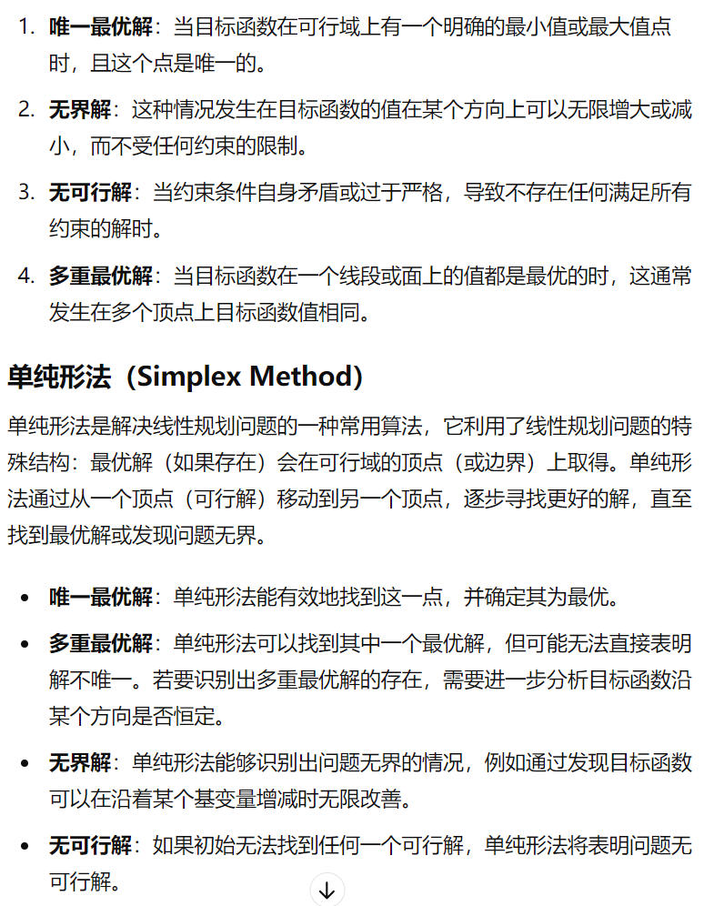


2.对偶问题对原问题有何帮助。举3例。 


3.动态规划的最优性原理是什么。贝尔曼是如何用数学语言表达最优性原理的。

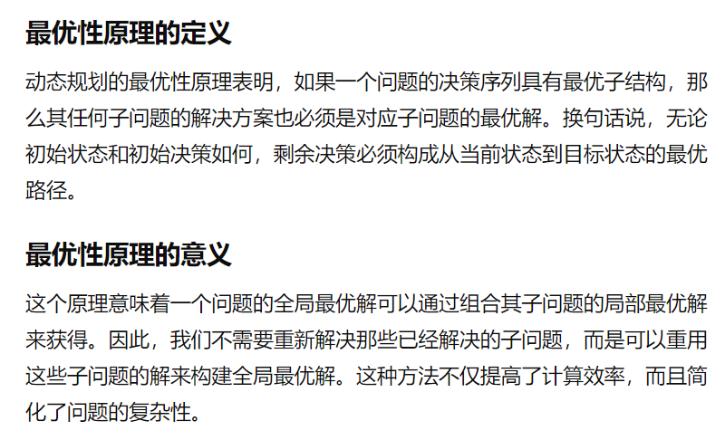


4.等式约束化为无约束问题有哪两种方法，各有什么特点？ 数值解的时候哪个更好。


在实际数值解中，**拉格朗日乘子法通常被认为是更优的选择**


5.运输问题建模的两种方法。


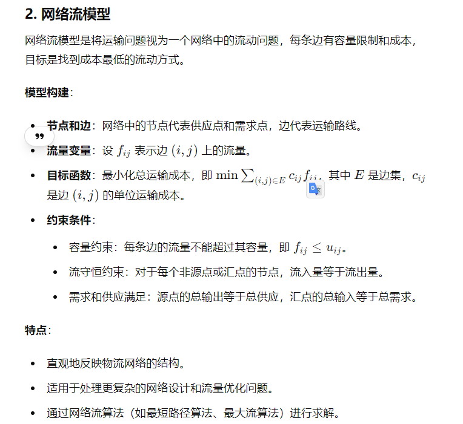


 6.Floyd算法对于网络边权有什么限定条件，为什么？


 7.目标规划$d^+*d^-=0$什么时候可以省略。 


8.最速下降法，牛顿法，共轭梯度法。 这三种方法适合在寻优的哪个时期使用，为什么？

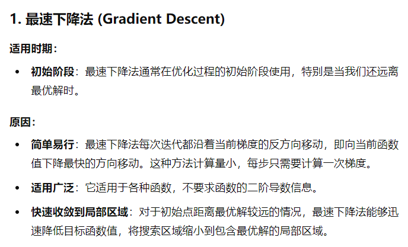

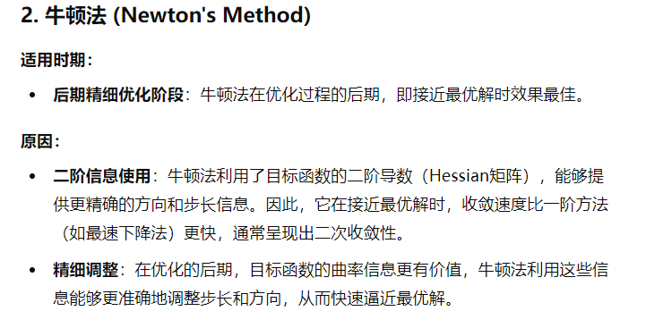

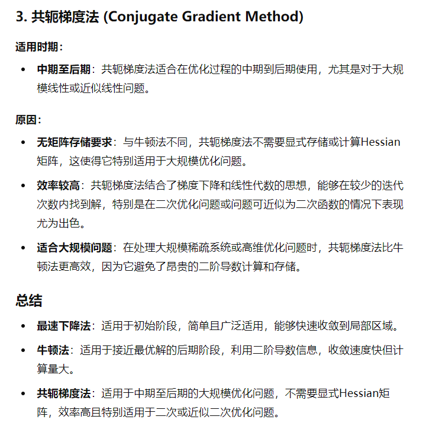


9.分支、定界概念，意义。 

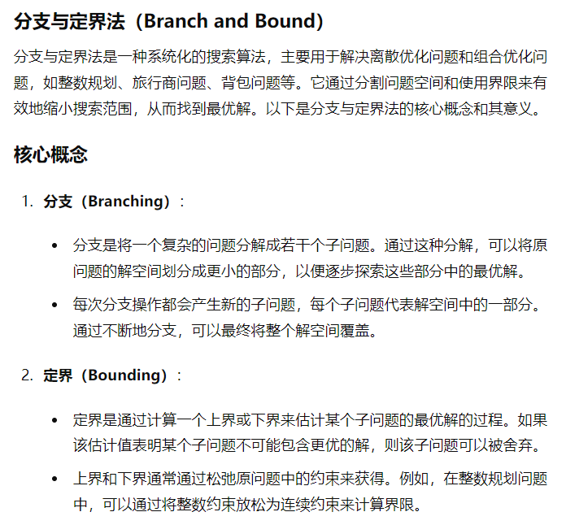


10.Nash均衡概念，此时是否为合作关系。 


附加题， 给出题目问题的KT条件。 判断是否为充要条件。原因。


制约函数法核心是什么？罚函数和障碍函数相似于不同？内点法外点法是什么意思（内涵）

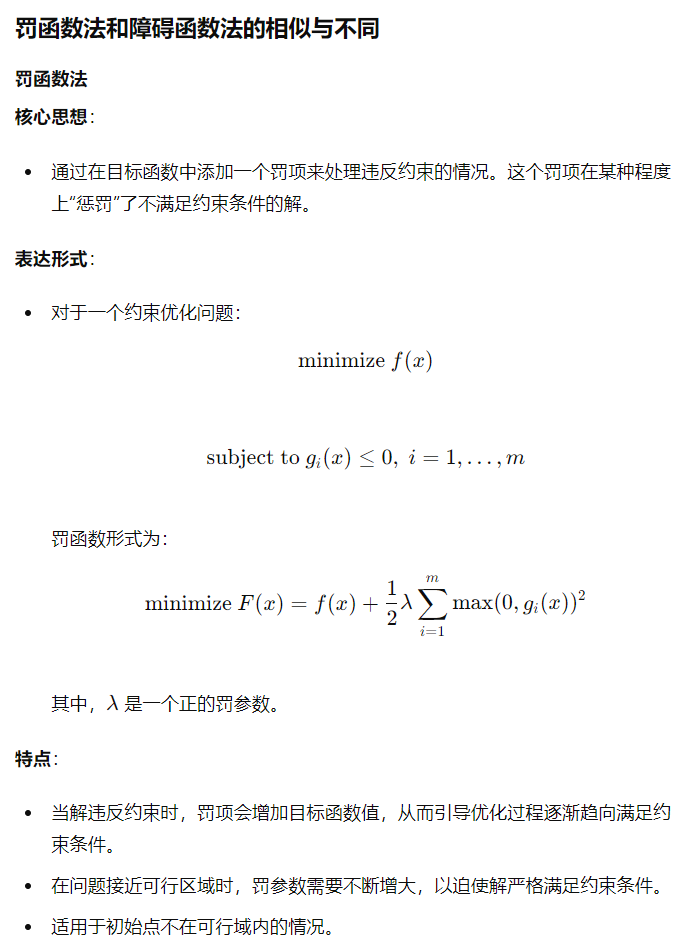

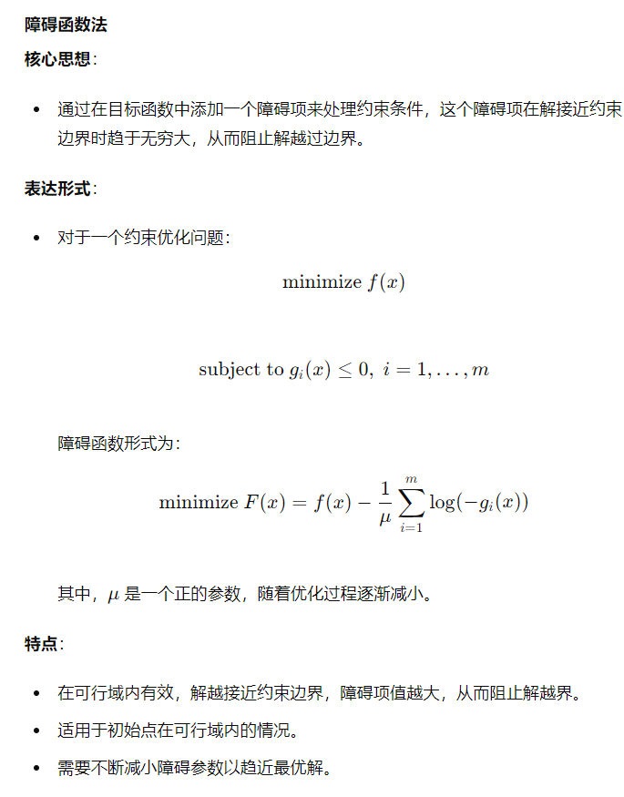


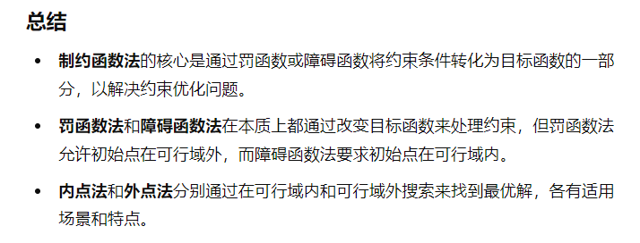


## 卷二


1.（1）三台发电机，分别有最大发电功率，最小发电功率，单位功率电价；三个目标，P1：机组最大功率大于等于一个数，P2：两台发电机工作，P3：机组发电功率等于Lq时，发电成本最小，建立数学模型 

（1）目标规划能否用于非线性规划，为什么 


2.给了一个最终单纯性表，最终基变量是x1，x2 

（1）求最优解不变的c1，c2比值范围 

（2）给x1增加一个必须是整数的条件，求最优解


3.给了一个有向图

（1）用Dijkstra法求**最长路径**

（2）用动态规划建模

 4.用内点法解析分析一个函数的最优解，并验证满足KKT条件

 5.M/M/1/∞（1）证明单位时间内平均所有顾客逗留时间等于平均排队长

（2）闲期花费c1，每个顾客单位逗留时间花费c2，求ρ使得总花费最小 

6.赢得矩阵A=[(a11,4),(8,2)],求a11的范围，使得局中人可以公布自己策略，为什么；若a11处于不能公布策略范围内，应该怎么办


