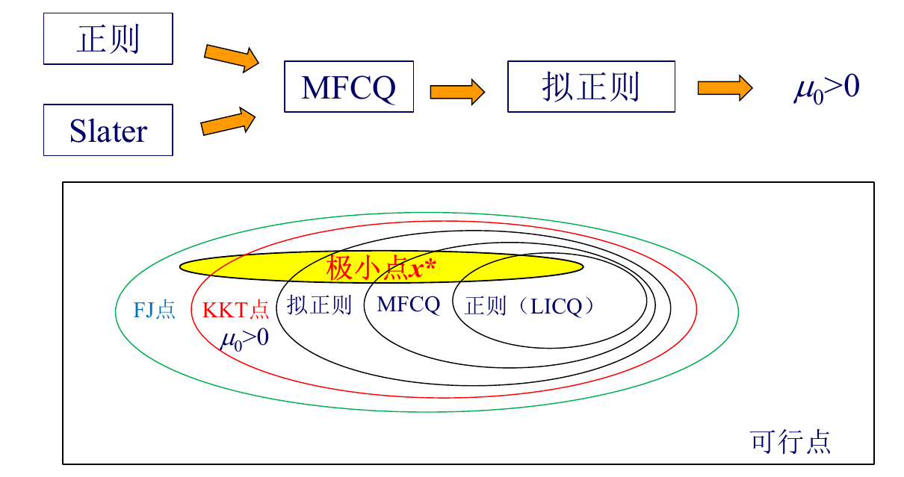

# 非线性规划

[TOC]

## 非线性规划问题

### Concepts

- 强制函数：当$||x||\to \infty,f(x)\to \infty$
- 下水平集合：对$\forall ~constant ~\alpha ,L_{\alpha} = \{x\in R^n, f(x\le \alpha ）\}$
- 集合紧等价于闭且有界
- 强制函数等价于所有下水平集紧

### Model

- 标准模型
  $$
  \min\ f(x)\ \ \text{s.t.}\ \ g_j(x)\le 0,\ \ h_i(x)=0
  $$
  其中 $$x\in\mathbb{R}^n,\ f,g_j,h_i$$ 连续可微
- 最优解存在性的直觉
  连续目标在“**非空且有界闭**”的可行域上常能取得极小（Weierstrass 思路）；无约束时若 $$f(x)\to +\infty\ ( \|x\|\to\infty )$$（强制/coercive），也常存在极小。

## 最优性条件

### 无约束极值问题

- 一阶必要条件（驻点）：局部极小 $$x^*$$ 必满足 $$\nabla f(x^*)=0$$。

- 二阶必要/充分条件：设 Hessian $$\nabla^2 f(x^*)$$：

  - 必要：$\nabla f(x^*)=0,\ \nabla^2 f(x^*)\succeq 0$；

  - 充分：$\nabla f(x^*)=0,\ \nabla^2 f(x^*)\succ 0\Rightarrow x^*$ 为严格局部极小。

  矩阵正定性可用特征值、主子式或 Cholesky 判定。

- 几何直觉：沿任意方向 $$p$$ 的二次近似 $$f(x^*+p)\approx f(x^*)+\tfrac12 p^\top \nabla^2 f(x^*) p$$；正定意味着所有方向上“碗口向上”。

### 有约束极值问题

#### 等式约束：拉格朗日乘子法

- 拉格朗日函数
  $$
  L(x,\nu)=f(x)+\nu^\top h(x)
  $$

- 一阶条件：可行点 $$x^*$$ 若为局部极小，常伴随乘子 $$\nu^*$$ 使$\nabla_x L(x^*,\nu^*)=0,\ \ h(x^*)=0$。

#### 不等式约束与可行方向

- 活跃约束与可行方向
  在边界点，活跃集 $\mathcal{A}(x)=\{j\mid g_j(x)=0\}$。
  向量 $d$ 为线性化可行方向需满足
  $\nabla h_i(x)^\top d=0,\ \ \nabla g_j(x)^\top d\le 0\ (j\in\mathcal{A}(x))$。
  若不存在“可行的下降方向”（使 $$\nabla f(x)^\top d<0$$），则是局部极小的直观必要性。

---

#### 一阶最优性条件

- Gordan引理

  设 $A_1, A_2, \dots, A_l$ 是 $l$ 个 $n$ 维向量，下面两个命题**不可能同时成立**，而且必有其一成立：

  - 存在向量 $p$ 使
    $$
    A_j^T p < 0 \qquad (j = 1, 2, \dots, l)
    $$

  - 存在不全为零的非负实数 $\mu_1, \mu_2, \dots, \mu_l$，使得
    $$
    \sum_{j=1}^l \mu_j A_j = 0.
    $$

  几何含义:$A_j$不可能分布在任何超平面的同一侧

- Fritz John（FJ）必要条件
  对局部极小 $$x^*$$，存在不全为零的乘子$\mu_0\ge 0,\ \mu_j\ge 0,\ \nu_i\in\mathbb{R}$，使
  $$
  \begin{cases}
  \mu_0\nabla f(x^*)+\sum_j \mu_j \nabla g_j(x^*)+\sum_i \nu_i \nabla h_i(x^*)=0,\text{Lagrange驻点条件} \\
  g_j(x^*)\le 0,\ h_i(x^*)=0,\text{原约束条件}\\ 
  \mu_j g_j(x^*)=0, \text{互补松弛条件} \\
  \mu_j\ge0,\sum_{j=0}^{j=m} \mu_j+\sum |\nu_i|\ne 0, \text{强非负条件}\\
  \nu_i h_i(x^*)=0,\text{等式互补松弛条件，等式约束自然满足}
  \end{cases}
  $$

  这里分为两类求解情况
  
  1. $\mu_0 > 0$，即形式上可以变为KKT条件。这需要满足一些约束规格
  
  2. $$\mu_0=0$$ 的“退化”情形提示约束奇异或资格条件不足。
  
     - Intuition: μ0=0 出现，是因为 约束“太奇异/太紧”，导致最优点的“一阶最优性”完全由约束的梯度来平衡，目标函数的梯度在条件里可以被“忽略”。也就是说，不是目标函数在主导最优性，而是约束几何在主导
  
     在只考虑不等式约束的情况下$\mu_j不全为0\rightarrow 其作用约束梯度正线性相关\rightarrow不存在使所有\nabla g(x) p<0的可行方向 $，但是仍可能存在边界可行方向，即某些$\nabla g(x)p=0$。此时可能对应三种典型极小点
  
     - 孤立点：不存在可行方向
     - 特殊边界极小点：存在$\nabla g(x)=0$
     - 非正则极小点：起作用约束梯度$\nabla g(x)$线性相关
  
- Karush–Kuhn–Tucker（KKT）条件
  若再满足合适的**约束资格（CQ）**，可令 $$\mu_0=1$$ 归一化，得到：
  
  对局部极小 $$x^*$$，要求存在乘子$\mu_j\ge 0,\ \nu_i\in\mathbb{R}$，使
  
  > $\mu_j$可全为0
  
  $$
  \nabla f(x^*)+\sum_j \lambda_j^* \nabla g_j(x^*)+\sum_i \nu_i^* \nabla h_i(x^*)=0, \\
  g_j(x^*)\le 0,\ \ \lambda_j^*\ge 0,\ \ \lambda_j^* g_j(x^*)=0,\ \ h_i(x^*)=0
  $$
  > 这是最常用的一阶**必要条件**。

#### 约束资格（CQ）：KKT 必要性的保障

> 约束资格条件（Constraint Qualification, CQ）

- 常见 CQ
  - LICQ（线性无关，正则条件）：活跃约束的梯度向量线性无关。
  
  - MFCQ：存在方向 $$d$$ 使 $$\nabla h_i^\top d=0$$ 且活跃不等式满足 $$\nabla g_j^\top d<0$$。
  
  - Slater条件（凸问题）：存在严格可行点 $$g_j(x)<0,\ h_i(x)=0$$。
  
    本质是：可行域不是“贴着”约束边界，而是有内部（nonempty interior）。允许我们在约束面附近做一阶分析（梯度空间是完整的），只有当可行域有足够的内部空间时，拉格朗日乘子才可能存在。
  
  - 拟正则条件：线性化可行方向锥$F(x^*) = T_\chi(x^*)$。下面我们来详细探究一下拟正则条件，首先这两个锥分别是什么：
  
    - 切锥$T_\chi (x)$：可行域$\chi$在$x$点所有（可行）切向量集合（从真正的可行域出发）。
      $$
      T_\chi = \{p|\exist t_k\rightarrow0,\exist x_k\in \chi ,x_k\rightarrow x^*,\frac{x_k - x^*}{t_k}\rightarrow p   \}
      $$
  
    - 线性化可行方向锥$F(x)$：$F(x)=\{p|\nabla h_i(x)^T p =0,i\in E;\nabla g_j(x)^T p\le0,j\in J(x)\}$
  
      把约束在$x^*$附近作一阶线性近似，来描述哪些方向p可能保持可行。线性化预测的方向 **至少** 包含所有真实能走的方向，但可能“多估”了一些假方向。
  
    - 一般的关系：$T_\chi(x)\subseteq F(x)$：如果你真能沿某个方向$p$走在可行域里，那把约束线性化之后，沿这个方向肯定也不会立即违反一阶近似
  
    - 拟正则条件的定义$F(x^*) = T_\chi(x^*)$，也就是：用一阶线性化得到的可行方向锥，**恰好等于** 真正的切锥。
  
      - 局部几何匹配
      - 没有奇怪的“尖”或“孤立点”
      - 可以完全用梯度描述可行方向：所有可行方向都由$\nabla g,\nabla h$的线性不等式/等式描述出来
  
    - 下面来证明为什么有了这个条件就有KKT条件：
  
      因为**没有既是可行方向又是下降方向的向量**，使用拟正则条件得到**线性化可行方向也没有下降方向**，再利用Farkas 引理即可推导得到KKT条件
  
- CQ 的作用是：
  - 排除“奇异点”
  - 保证拉格朗日乘子存在且有意义
  - 保证可行方向锥的结构良好
  - 保证 KKT 为最优性的必要条件

#### 二阶最优性条件

- **临界锥 $$C(x^*,\lambda^*,\nu^*)$$**
  由线性化可行方向且满足驻点互补关系的“可疑方向”构成，是二阶分析的舞台。

- **二阶必要条件**
  对任意 $$p\in C(x^*,\lambda^*,\nu^*)$$，有
  $$
  p^\top \nabla_{xx}^2 L(x^*,\lambda^*,\nu^*)\, p\ \ge\ 0
  $$

- **二阶充分条件**
  若对所有非零 $p\in C(x^*,\lambda^*,\nu^*)$ 有
  $$
  p^\top \nabla_{xx}^2 L(x^*,\lambda^*,\nu^*)\, p\ >\ 0
  $$
  则 $x^*$ 为严格局部极小。
  直觉：在一阶“平衡”后，拉氏 Hessian 在可行“自由度”方向上要“向上弯”。

### 凸规划

- 凸集：$\forall x_1.x_2 \in C, ax_1+(1-a)x_2\in C, 0\le a\le 1$

- 凸函数

  - what: 凸函数为满足下列条件的函数
    $$
    f[\theta x_1+(1-\theta)x_2]\le \theta f(x_1)+(1-\theta)f(x_2)，\quad 0\le \theta \le 1, \forall x_1,x_2 \in R^n \tag{Jensen inequality}
    $$

    > $<$: 严格凸函数，$\ge$: 凹函数，$>$: 严格凹函数，$=$: 线性函数
    
    > [!TIP]
    >
    > 线性函数既是凸函数，又是凹函数，所以线性规划是凸规划
    
  - 凸函数判定条件（充要条件）

    - 一阶条件

      对所有 $x_1, x_2 \in \mathbb{R}^n$ 恒有：

      $$
      f(x_2) \ge f(x_1) + \nabla f(x_1)^T (x_2 - x_1)
      $$

      几何意义：**任意一点的切线在凸函数曲线的下方**

    - 二阶条件

      对所有 $x \in \mathbb{R}^n$ 恒有：

      $$
      \nabla^2 f(x) \ge 0
      $$

      几何意义：**函数曲线向上弯曲**

- 凸规划

  - 极值点判定条件

    对于凸函数 $f(x)$，

    $$
    \nabla f(x^*)^T (x - x^*) \ge 0 \quad \forall x \in \mathbb{R}^n
    $$

    > [!NOTE]
    >
    > 无约束时，$\nabla f(x^*) =0$，有约束时，才可能有$\nabla f(x^*) \ne0$

    并且有：
  
    $$
    f(x) \ge f(x^*) + \nabla f(x^*)^T (x - x^*)
    $$

    这是 $x^*$ 为 $f(x)$ 的 **全局极小点的充要条件**。
  
    - 推论 1：对于凸目标函数，若 $\nabla f(x^*) = 0$，则这是 $x^*$ 为全局极小值的充要条件。
    - 推论 2：对于凸目标函数，局部极小点也是全局最小点。

  - 极值点性质
  
    - 如果最优解存在，最优解集合也为凸集,，最优解的连线段均为最优解
    - 若目标函数为严格凸函数,且如果全局最优解存在，则必为唯一全局最优解

  - 凸规划的性质
  
    - 凸规划的可行域为凸集
    - 凸规划的局部极小点即全局极小点
    - 凸规划下的KKT条件为全局极小点的充要条件

## 对偶理论

### Lagrange 对偶问题

原问题标准形式：

$$
\begin{aligned}
\min_x\quad & f(x)\\
\text{s.t.}\quad & g_j(x)\le 0,\quad j=1,\ldots,m,j\in I\\
& h_i(x)=0,\quad i=1,\ldots,p,i\in E
\end{aligned}
$$

可行域定义：
$$
\chi = \{x\in D \mid g_j(x)\le 0,\; h_i(x)=0\}
$$

Lagrangian
$$
L(x,\lambda,\nu)
= f(x)
+ \sum_{j=1}^m \lambda_j g_j(x)
+ \sum_{i=1}^p \nu_i h_i(x)
$$

其中：

- $x$ 为原问题变量  
- $\lambda_j\ge 0$ 为不等式约束的Lagrange乘子  
- $\nu_i$ 为等式约束的Lagrange乘子  

#### 对偶函数（Dual function）

$$
g(\lambda,\nu)=\inf_{x\in D} L(x,\lambda,\nu)
$$

性质：

- 对偶函数一定是凹函数

    - 对固定 (x)，
      $$
      L(x,\lambda,\nu)=f(x)+\sum_j\lambda_j g_j(x)+\sum_i \nu_i h_i(x)
      $$
      这是 ($\lambda,\nu$) 的仿射函数（直线/平面）。
    - 对偶函数定义为
      $$
      g(\lambda,\nu)=\inf_x L(x,\lambda,\nu)
      $$
      相当于对无穷多条直线取最小值。
    - 多条直线的“下包络”一定是凹的。

- 对于任意的$\lambda\ge 0$和$\nu$，有$g(\lambda,\nu)\le p ^* = \inf\{f(x)| x\in \chi \}$

当$g(\lambda,\nu) = -\infty$该下界为平凡下界，无有效信息，因此我们规定$\text{dom}~ g=\{(\lambda,\nu)|g(\lambda,\nu)> -\infty\}$

#### Lagrange 对偶问题（Dual Problem）

$$
\begin{aligned}
\max_{\lambda,\nu}\quad & g(\lambda,\nu)\\
\text{s.t.}\quad & \lambda\ge 0
\end{aligned}
$$

- Intuition: 对一个非凸问题（因为 $x_i(1-x_i)=0$ 非凸）做 Lagrangian 松弛时，得到的对偶问题，求的其实是：原始非凸可行域的凸包上的最优值。In short: 取“凸闭包 / 双对偶”后的最优值

- Property：

  - 对偶问题一定是凸优化问题，即便原问题非凸。

  - 线性规划定义的对偶是Lagrange对偶

  - 等价问题的Lagrange对偶问题未必等价，比如将约束用隐含或显式方式表达的等价优化问题

  - 满足强对偶性的凸规划问题的等价问题的Lagrange对偶问题必等价

> [!TIP]
>
> check【Boyd】题5.13（P276），会对Lagrange dual有个更加深刻的认识

---

### 对偶性质

对偶性质(原问题和对偶问题的关系)

#### 弱对偶性（Weak Duality）

弱对偶性 (最优值之间的关系)

- 定义

  对于任意可行 $x\in\chi$ 和 $\lambda\ge 0$：

  $$
  g(\lambda,\nu)\le f(x)
  $$

  最优值关系：

  $$
  d^*=g(\lambda^*,\nu^*)\le f(x^*)=p^*
  $$

- 推论：

  - 原问题和对偶问题的最优值互为对方的上下界。
  - 如果$f(x^*) = -\infty$，则对偶问题无解；如果$g(x^*) = +\infty$，则原问题无解。
  - 原问题和对偶问题解的关系
    - 两个问题都有可行解, 则都有最优解
    - 一个问题有无界解, 另一个问题必无可行解
    - 两个问题都无可行解

- 对偶间隙（duality gap）: $f(x)-g(\lambda,\nu)\ge0$

#### 强对偶性（Strong Duality）

强对偶性(最优解之间的对应关系)

- 定义
  $$
  p^* = d^*
  $$

- 强对偶性成立通常需要一定条件，例如：

  - 凸问题+Slater 条件
  - 线性规划（LP）
  - 凸锥规划（Conic Programs）

##### Slater 条件

若原问题是凸优化，且存在严格可行点：

$$
g_j(x)<0,\quad h_i(x)=0
$$

即不等式围成的区域有可行内点。则：

- 强对偶成立  
- 对偶解存在  
- KKT 条件成为必要且充分条件

> [!NOTE]
>
> Slater条件只是诸多保证强对偶性条件中的一种(约束规格) 。

### 对偶博弈诠释

#### 二人零和博弈视角

定义损失函数 $K(x,y)$，其中：

- 玩家 I 选择 $x$（原问题）
- 玩家 II 选择 $y$（对偶变量）

玩家 I 的最大损失：

$$
\eta(x)=\sup_{y} K(x,y)
$$

玩家 II 的最小赢得：

$$
\zeta(y)=\inf_{x} K(x,y)
$$

弱对偶性对应博弈弱对偶：

$$
\sup_y \zeta(y) \le \inf_x \eta(x)
$$

---

#### 极大极小定理（Minimax）

- 鞍点定理：博弈存在均衡解$(x^*,y^*)$的充要条件为$K(x,y)$存在鞍点$(x^*,y^*)$满足鞍点条件：
  $$
  K(x^*,y)\le K(x^*,y^*)\le K(x,y^*)
  $$
  等价于强对偶性：
  
  $$
  \sup_y \zeta(y)=\inf_x \eta(x)
  $$
  
- 极大极小定理（Minimax）
  
  若$K(x,y),X\times Y \rightarrow R$满足下列条件，则$K(x,y)$存在鞍点（充分条件）
  
  - Intuition: 在凸—凹结构下，“先选后选”的顺序不影响最优值，原问题与对偶达到同一值
  
  -  $X,Y$为非空紧集
  - 对于$\forall y\in Y,K(,y):X\rightarrow R$为连续的凸函数
  - 对于$\forall x\in Y,K(x,):Y\rightarrow R$为连续的凸函数

#### Lagrange 对偶的博弈解释

- 原问题：最小化最大损失  
- 对偶问题：最大化最小赢得  
- Lagrangian 为博弈中的 payoff  

在鞍点处，原问题与对偶问题达到一致的最优值。

## Review

1. 强制函数与下水平集紧性的等价关系

  - 等价关系：
    函数 (f) 强制（(|x|\to\infty \Rightarrow f(x)\to\infty)）
    当且仅当对任意常数 (\alpha)，下水平集
    $$
    L_\alpha={x\mid f(x)\le \alpha}
    $$
    紧（闭且有界）。

2. FJ 条件与 (\mu_0=0) 的含义

  - FJ 必要条件：存在不全为零的乘子$$\mu_0\ge 0,\ \mu_j\ge 0,\ \nu_i\in\mathbb{R}$$使
    $$
    \mu_0\nabla f(x^)+\sum_j \mu_j \nabla g_j(x^)+\sum_i \nu_i \nabla h_i(x^*)=0
    $$
    $$
    g_j(x^)\le 0,\quad h_i(x^*)=0
    $$
    $$
    \mu_j g_j(x^)=0
    $$
  - (\mu_0=0) 表示：
    退化情形，通常意味着 约束资格条件不满足（可行域几何退化），最优性主要由约束梯度平
    衡，无法归一化为 KKT。

  ———

3. 一个 CQ 例子 + 直觉

  - MFCQ（Mangasarian–Fromovitz CQ）：存在方向 $$d$$ 使 $$\nabla h_i^\top d=0$$ 且活跃不等式满足 $$\nabla g_j^\top d<0$$。
  - 直觉：边界点仍有“往内的可行方向”，可行域几何不退化，保证乘子存在、KKT 成立。

  ———

4. 凸函数一阶判定条件 + 几何意义

  - 一阶判定：
    $$
    f(x_2)\ge f(x_1)+\nabla f(x_1)^T(x_2-x_1),\quad \forall x_1,x_2
    $$
  - 几何意义：任意点的切线（切平面）都在函数图像下方，函数“向上弯”。

  ———

5. 对偶函数 (g(\lambda,\nu)) 为何是凹函数

  - 定义：
    $$
    g(\lambda,\nu)=\inf_x L(x,\lambda,\nu)
    $$
  - 对固定 (x)，(L(x,\lambda,\nu)) 对 ((\lambda,\nu)) 是仿射函数。
  - 仿射函数族的下确界必为凹函数，因此 (g(\lambda,\nu)) 必凹。

1. 数学规划没有最优解的三种情况是什么？

     - 可行域为空（问题不可行）。

     - 目标函数在可行域上无下界（最优值为 $$-\infty$$）。

     - 有下确界但不可达（最优值存在但不可取到，常见于可行域不紧或目标不“闭”）。

2. 凸规划的拉格朗日函数为什么是凸函数？

     - 对凸规划：$$f(x)$$ 与 $$g_j(x)$$ 为凸函数，$$h_i(x)$$ 为仿射函数，且 $$\lambda_j\ge 0$$。

     - 拉格朗日函数
       $$
       L(x,\lambda,\nu)=f(x)+\sum_j \lambda_j g_j(x)+\sum_i \nu_i h_i(x)
       $$
       是“凸函数的非负线性组合 + 仿射函数”，因此对 $$x$$ 凸。

3. 原问题和对偶问题从博弈角度分别是什么问题？强对偶性有什么意义？

     - 原问题：
       $$
       \min_x \max_{\lambda\ge 0,\nu} L(x,\lambda,\nu)
       $$
       对应“最小化最大损失”。

     - 对偶问题：
       $$
       \max_{\lambda\ge 0,\nu} \min_x L(x,\lambda,\nu)
       $$
       对应“最大化最小赢得”。

     - 强对偶性：两者最优值相等，等价于存在鞍点
    $$
    \min_x \max_{\lambda,\nu} L \;=\; \max_{\lambda,\nu} \min_x L
    $$

4. 原问题和对偶问题从博弈角度分别是什么问题？强对偶性在博弈中的意义是什么？（回忆卷）

  - 原问题：最小化最大损失
    $$
    \min_x \max_{\lambda\ge 0,\nu} L(x,\lambda,\nu)
    $$
  - 对偶问题：最大化最小赢得
    $$
    \max_{\lambda\ge 0,\nu} \min_x L(x,\lambda,\nu)
    $$
  - 强对偶性：双方最优值相等，等价于存在鞍点
    $$
    \min_x \max_{\lambda,\nu} L \;=\; \max_{\lambda,\nu} \min_x L
    $$

4. 写出无约束问题的二阶充分条件，并给出几何含义。

     - 条件：
       $$
       \nabla f(x^*)=0,\quad \nabla^2 f(x^*)\succ 0
       $$

     - 几何含义：二次近似在所有方向“向上弯”，局部是“碗口向上”。

5. 写出等式约束的拉格朗日一阶必要条件。

     - 设约束 $$h(x)=0$$，拉格朗日函数
       $$
       L(x,\nu)=f(x)+\nu^T h(x)
       $$

     - 一阶必要条件：
       $$
       \nabla_x L(x^*,\nu^*)=0,\quad h(x^*)=0
       $$

6. 写出不等式约束下的 KKT 条件（含互补松弛）。

     - 存在乘子 $$\lambda_j\ge 0,\ \nu_i$$ 使
       $$
       \nabla f(x^*)+\sum_j \lambda_j\nabla g_j(x^*)+\sum_i \nu_i\nabla h_i(x^*)=0
       $$
       $$
       g_j(x^*)\le 0,\quad h_i(x^*)=0
       $$
       $$
       \lambda_j g_j(x^*)=0
       $$

7. 写出一个常见 CQ（如 LICQ）并说明作用。

     - LICQ：活跃约束梯度线性无关。

       作用：保证乘子存在，使 KKT 成为必要条件。

8. 说明“凸优化中 KKT 是充要条件”的条件与原因。

     - 条件：凸目标 + 凸不等式约束 + 仿射等式约束，且满足 Slater 条件。

     - 原因：凸问题满足强对偶，KKT 与最优性等价。

9. 给出凸函数的一阶与二阶判定条件。

     - 一阶条件：
       $$
       f(x_2)\ge f(x_1)+\nabla f(x_1)^T(x_2-x_1),\quad \forall x_1,x_2
       $$

     - 二阶条件：
       $$
       \nabla^2 f(x)\succeq 0,\quad \forall x
       $$

10. 对偶函数给出下界的理由（弱对偶性）。

      - 对任意可行 $$x$$ 和 $$\lambda\ge 0$$：
        $$
        g(\lambda,\nu)=\inf_x L(x,\lambda,\nu)\le L(x,\lambda,\nu)\le f(x)
        $$

      - 因此
        $$
        d^*\le p^*
        $$

11. 写出强对偶成立的一个充分条件，并说明结果。

      - 条件：凸优化 + Slater 条件。

      - 结果：
        $$
        p^*=d^*
        $$
        且对偶解存在，KKT 成为充要条件。

12. 写出二阶必要/充分条件（含临界锥表述）。

      - 临界锥 $$C(x^*,\lambda^*,\nu^*)$$：线性化可行方向中同时满足互补关系的方向。

      - 必要条件：
        $$
        p^T\nabla_{xx}^2 L(x^*,\lambda^*,\nu^*)p\ge 0,\quad \forall p\in C
        $$

      - 充分条件：
        $$
        p^T\nabla_{xx}^2 L(x^*,\lambda^*,\nu^*)p> 0,\quad \forall p\in C\setminus\{0\}
        $$
