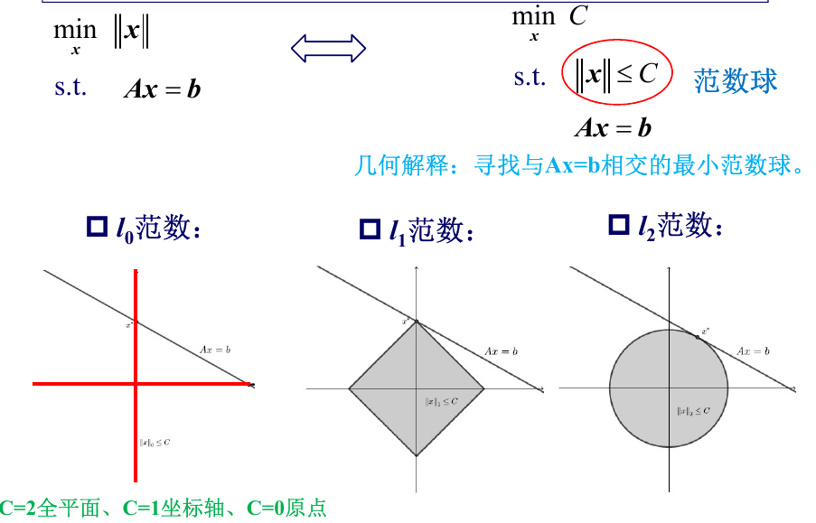

# Application

优化应用

## 逼近与拟合

**用优化（min…）来做“逼近/拟合”**：当方程 **Ax=b** 不好解（不可能精确满足、或解太多、或有噪声），我们就把“差多少”和“解本身要好看（小、平滑、稀疏）”写成目标函数，通过最小化得到一个“最好”的解。

### 范数逼近

- Takeaway: 用不同范数衡量误差

- $l_2$ 范数：最小二乘（最常见）
  $$
  \min_x \|Ax-b\|_2^2
  $$
  它等价于最小化“残差平方和”。优点：好算、理论成熟。
  推导会得到**正则方程**：
  $$
  A^TAx=A^Tb
  $$
  若 $A^TA$ 可逆，就有闭式解(这里假设列满秩，否则需要使用伪逆进行处理)：
  $$
  x^*=(A^TA)^{-1}A^Tb
  $$

  - Intuition：把每个误差都**平方**，所以**大误差会被放大惩罚**，因此最小二乘对“野值/离群点”很敏感（后面罚函数会解决）

- $l_\infty$ 范数：极小极大（Chebyshev）
  $$
  \min_x \|Ax-b\|_\infty = \min_x \max_i |a_i^Tx-b_i|
  $$
  **让“最坏的那一个误差”尽可能小**。
  它还能改写成线性规划：
  $$
  \min t \quad s.t.\ -t \le r_i \le t \quad \forall i
  $$

  > [!TIP]
  >
  > 只有一个公共的i,因此由最坏的那个决定

  - Intuition：我不在乎平均表现，我只关心“最大翻车”。

  - Example: “极小极大跟踪控制”：控制里常常要保证最坏情况下误差也别太大

    - 系统输出：$y(k)$
    - 希望它跟随的参考信号：$r(k)$

    目标：
    $$
    y(k) \approx r(k)
    $$
    误差定义为：
    $$
    e(k) = y(k) - r(k)
    $$
    控制器要做的是：
    $$
    \min_{u(\cdot)} \ \max_k |e(k)|
    $$
    即我设计控制输入 $u$，让“无论什么时候出现的最大误差”尽量小。

- $l_1$ 范数：绝对值和（更鲁棒）
  $$
  \min_x \|Ax-b\|_1=\sum_i |r_i|
  $$
  它也可写成线性规划：
  $$
  \min \mathbf{1}^Tt \quad s.t.\ -t_i \le r_i \le t_i\quad \forall i
  $$

  - Intuition：误差按**绝对值线性惩罚**，大误差不会像平方那样爆炸，所以比最小二乘更抗离群点。

    > [!NOTE]
    >
    > 比最小二乘更抗离群点？
    >
    > 因为最小二乘有离群点，优化器会 **拼命照顾这个点**，结果整体解被“拽歪”

- 带约束的范数逼近：现实里还会加约束，比如：

  - 变量范围：$l\le x\le u$
  - 概率/非负/和为1：$x\ge 0,\ \mathbf{1}^Tx=1$
  - 范数球约束，信赖域：$\|x-x_0\|\le d$（算法“别走太远”）

### 罚函数逼近

- Takeaway: 用更一般的“惩罚曲线”衡量误差，做鲁棒

  一般形式：
  $$
  \min_x \sum_{i=1}^m \phi_i(r_i),\quad r=Ax-b
  $$
  这里 $\phi(\cdot)$ 就是**罚函数**：告诉你“误差为 u 时，我有多不爽”

- 常见罚函数

  - $p$ 次罚：$\phi(u)=|u|^p$，对应 $l_p$ 范数（$p=2$ 就是最小二乘）。
  - **带死区线性**：小误差不罚（当 $|u|\le a$ 罚0），超过阈值才线性罚
  - **log barrier（对数障碍）**：靠近边界罚得很厉害，用来“强制不超过某范围”

- Goal: 离群点会让最小二乘严重偏。解决思路是：**别让大误差权重太大**

- Huber 罚函数（鲁棒最小二乘）
  $$
  \phi_{\text{hub}}(u)=
  \begin{cases}
  u^2,& |u|\le M\\
  M(2|u|-M),& |u|>M
  \end{cases}
  $$

  - Prior：处理最小二乘的野值问题

    Sol:减小估计器对大误差的灵敏度

  - Intuition

    - 小误差用平方（精细、平滑、好优化）

    - 大误差改成线性（不让离群点一票否决）

### 最小范数问题

- Prior: 最小范数问题：当解太多时，选哪个“最好”?

- Takeaway: 欠定方程里选“最小/最稀疏”的解

  当 $m$（未知数比方程多）时，$Ax=b$ 往往有**无穷多解**
  $$
  \min \|x\| \quad s.t.\ Ax=b
  $$
  含义：在所有可行解里，挑一个“**量值最小**”（能量最小、误差最小、最不敏感等）

- 稀疏优化：想要“零越多越好”

  理想目标是：
  $$
  \min \text{card}(x)\quad s.t.\ Ax=b
  $$
  card(x) 是非零元素个数（也常写“$l_0$范数”，但它不是真范数）。

  但 $l_0$ 太难解，所以用 $l_1$ 近似：
  $$
  \min \|x\|_1\quad s.t.\ Ax=b
  $$
  它能改写成 LP，便于求解

- $l_2$ 最小范数解：欠定时的“最小能量”
  $$
  \min \|x\|_2^2\quad s.t.\ Ax=b
  $$
  推导后得到类似伪逆的形式

- 几何直觉

  把 $\|x\|\le C$ 想成“范数球”：

  - $l_2$：圆/椭圆（更“圆滑”）

  - $l_1$：菱形（有尖角，容易卡在坐标轴→产生稀疏）

    > [!NOTE]
    >
    > 为什么 $l_1$ 更稀疏？因为菱形有尖角，和直线/平面相交时更容易在“轴上”碰到（某些分量正好变0）

  - $l_0$：非常“轴对齐”的离散结构（最稀疏）

  

### 正则化逼近

- Takeaway: 误差+解的性质：小、平滑、稀疏

  “双准则优化”：

  - 想让 $\|Ax-b\|$ 小（拟合好）
  - 也想让 $\|x\|$ 小/平滑/稀疏（模型别太复杂、别乱抖）

- Tikhonov / 岭回归（$l_2$ 正则最小二乘）
  $$
  \min_x \|Ax-b\|_2^2 + \gamma \|x\|_2^2
  $$
  求解：

  1. 化为范数逼近问题
     $$
     \begin{bmatrix}
     A \\
     \sqrt{\gamma}\, I
     \end{bmatrix}
     x
     =
     \begin{bmatrix}
     b \\
     0
     \end{bmatrix}
     $$

  2. 直接求解，得到封闭解
     $$
     x^*=(A^TA+\gamma I)^{-1}A^Tb
     $$

  - Intuition：

    - 加 $\gamma \|x\|_2^2$ 相当于“把 x 往 0 拉一拉”，避免参数过大

    - 还能解决 $A^TA$ 病态、共线（多重共线性）等问题

  - Property：

    - $∥x∥_2≤c$​边界是圆 / 椭圆，是光滑的
    - Tikhonov正则化是处理病态最小二乘问题的典型方法
    - 从最小二乘估计角度,Tikhonov正则化放弃了估计的无偏性,用较小的估计偏差来获得方差更小的估计性能

- 光滑正则化：让解别抖
  $$
  \min_x \|Ax-b\|_2^2 + \gamma\|x\|_2^2 + \delta\|Dx\|_2^2
  $$
  $D$ 是差分矩阵：

  - 一阶差分：让相邻点差小（更平滑）
  - 二阶差分：让“弯曲”小（更像光滑曲线）

- LASSO：用 $l_1$ 正则得到稀疏模型
  $$
  \min_x \|Ax-b\|_2^2 + \gamma\|x\|_1
  $$
  等价的约束形式（非常重要）：
  $$
  \min_x \ \|Ax - b\|_2^2
  \quad \text{s.t.} \quad \|x\|_1 \le c
  $$

  - Intuition：$\|x\|_1$ 会把一堆小系数直接压成 0 → 自动“选特征”。

  第38页提到常用算法：ISTA / FISTA（都是迭代收缩阈值思想）。还给了等价形式（约束式、QP/QCQP/SOCP等）

  - Example: 把多项式 $y\approx \sum_{k=0}^K w_k x^k$ 写成矩阵：
    $$
    y=\Phi w + e
    $$
    用最小二乘就是 $\min\|\Phi w-y\|_2^2$。
    如果加 $l_1$ 正则（让 $w$ 稀疏），高阶多项式里很多系数会变 0，模型更简洁

- Square-root LASSO与回归向量筛选
  $$
  \min_x \|Ax-b\|_2 + \gamma\|x\|_1
  $$
  把它改写成 SOCP 形式（便于凸优化求解），并用它做启发式“选 k 个回归向量”

  两步法：先用 SR-LASSO 得到稀疏 $x^*$，再保留非零对应向量做最小二乘。

### 有导师学习

- Takeaway: 神经网络训练也是一个优化问题

## 几何问题

## 统计估计

