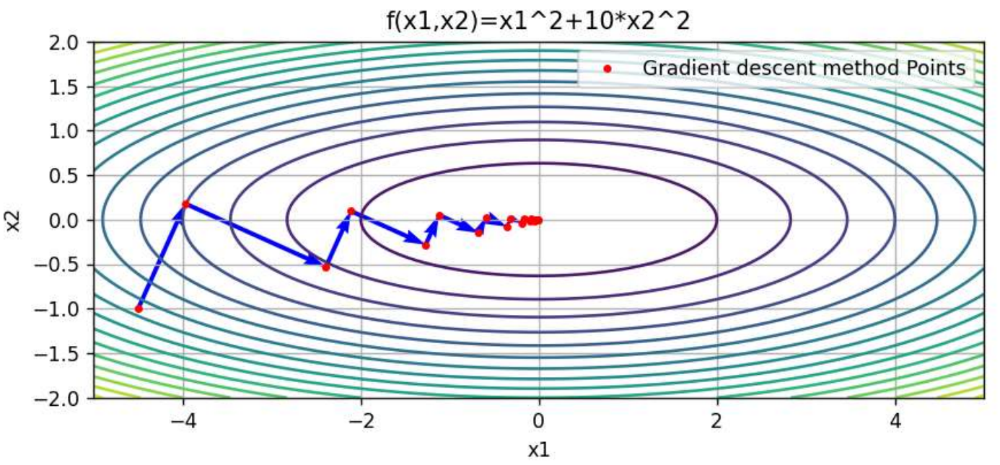

# Optimal Algorithm

优化算法

## 常用数值算法

### 算法的一般思路

- 求解策略：迭代法

  1. 优化问题通常采用**迭代法**求解

  2. 从初始点 $x^{(0)}$ 出发，不断更新变量

  3. 标准迭代形式为
     $$
     x^{(k+1)} = x^{(k)} + t_k p^{(k)}
     $$
     Notation

     1. $p^{(k)}$ 为迭代方向
     2. $t_k$ 为步长

- 迭代思想
  - 下降迭代法：descent method
  - 近似逼近法：approximation method

算法的关键组成要素

- 迭代方向的选择
- 步长确定策略
- 终止准则

------

### 无约束问题

#### 迭代方向

##### 梯度下降法

1. 设计思想：使目标函数值在每一步迭代中下降

2. 迭代方向
   $$
   p^{(k)} = - \nabla f(x^{(k)})
   $$

- Cons
  - "之"字迭代
  
    Sol: 变量尺度变换 / 使用牛顿法或拟牛顿法 / Levenberg–Marquardt 修正

##### 最速下降法(下降迭代法)

1. 基本思想：在给定范数约束下，寻找函数下降最快的方向

2. 规范化最速下降方向 (normalized steepest descent)
   $$
   p_{nsd} = \arg\min_{\|v\| \le 1} \nabla f(x)^T v
   $$

3. 非规范化最速下降方向
   不要求$||p|| = 1$
   $$
   p_{sd} = - \nabla f(x)
   $$
   

特殊情形
- 在 $l_2$ 范数下，最速下降法等价于梯度下降法(欧式空间)
- 在 $P$-二次范数下，可通过变量变换加速收敛

------

##### 牛顿法(近似逼近法)

1. 设计思想： 近似为二阶目标函数,求直接指向极值点方向

2. 二阶近似
   $$
   f(x) \approx f(x^{(k)}) + \nabla f(x^{(k)})^T (x - x^{(k)}) + \frac{1}{2}(x-x^{(k)})^T \nabla^2 f(x^{(k)})(x-x^{(k)})
   $$
   等价变P-二次范数非规范化最速下降法

3. 迭代方向
   $$
   p_N^{(k)} = - \left[\nabla^2 f(x^{(k)})\right]^{-1} \nabla f(x^{(k)})
   $$

4. Pros
   - 在严格凸二次函数下具有二次终止性：二次严格凸目标函数下可有限步(1步)找到极小点
   - 极值点附近收敛速率快(二阶近似更准确)
   
5. Cons
   - 计算代价高
   
     Sol: 变尺度法/DFP法可避免
   
   - 需要 Hessian 矩阵及其逆
   
   - 方向不一定是下降方向
   
     当 Hessian 不正定时，牛顿方向可能满足：
     $$
     \nabla f(x^{(k)})^T p_N^{(k)} \ge 0
     $$
     这意味着沿该方向走，函数值可能不降反升，迭代可能发散或震荡。
     
     Sol: LM修正

------

##### Levenberg–Marquardt 修正

1. 设计目的：使$\nabla^2 f(x^{(k)})$变为正定矩阵，保证牛顿方向为下降方向

2. 修正方向
   $$
   p_{LM}^{(k)} = - \left[\nabla^2 f(x^{(k)}) + \mu_k I \right]^{-1} \nabla f(x^{(k)})
   $$

3. Property
   - $\mu_k \to 0$：接近牛顿法
   - $\mu_k \to \infty$：接近梯度下降法

------

#### 迭代步长(一维搜索)

##### 最优步长法

分为两种解析法/直接法（分数法（0.618法））

- 解析法

  1. 问题：
  
     给定当前迭代点 $x^{(k)}$ 和搜索方向 $p^{(k)}$，一维线搜索的最优步长定义为
     $$
     t_k^*=\arg\min_{t} \; \phi(t),\quad \phi(t)=f\!\left(x^{(k)}+t\,p^{(k)}\right)
     $$
     目标是在直线 $x^{(k)}+t p^{(k)}$ 上找到使 $f$ 最小的 $t$。
  
  2. 解析解形式
     $$
     t_k^* = -\frac{\nabla f(x^{(k)})^T p^{(k)}}{p^{(k)T} \nabla^2 f(x^{(k)}) p^{(k)}}
     $$
  
  3. Property
     - 解析解，无需迭代
     
     - 依赖 Hessian
     
     - 更新点未必为极小值
     
     - 最优步长时，新梯度与旧方向正交
       $$
       \nabla f(x^{(k+1)})^T p^{(k)}=0
       $$

------

- 分数法
  1. 基本假设：一维函数为单峰函数
  2. Idea: 将搜索区分为3个子区,极小点位于2个中间点中函数值较小点所在的2子个分区
  3. 典型方法：0.618 黄金分割法
  4. Pros
     - 不需要导数信息
     - 实现简单

------

##### 自适应步长法

1. 直线回溯法
   
   - Idea: 回溯搜索找到目标函数值下降足够的步长
   
   - 满足 Armijo 条件：直线回溯法通常采用 Armijo 条件作为“充分下降”判据：
     $$
     f(x^{(k)} + t_k p^{(k)}) \le f(x^{(k)}) + \alpha t_k \nabla f(x^{(k)})^T p^{(k)}
     $$
     Armijo 条件要求实际下降不少于线性预测下降的一定比例
   
   - 回溯策略
   
     直线回溯法不直接求最优 $t$，而是从一个初始步长开始，不满足就缩小，直到满足。
   
     常用设定：
   
     - 初始步长 $t_0=1$
     - 回溯因子 $\beta \in (0,1)$
   
     更新规则：
     $$
     t \leftarrow \beta t
     $$
     反复回溯，直到满足 Armijo 条件。
   
1. 机器学习中的自适应学习率
   - AdaGrad
   - RMSProp
   - Adam

#### 迭代终止准则

常见停止条件包括：

1. 变量变化量
   $$
   \|x^{(k+1)} - x^{(k)}\| \le \varepsilon
   $$

2. 函数值变化
   $$
   |f(x^{(k+1)}) - f(x^{(k)})| \le \varepsilon
   $$

3. 梯度范数
   $$
   \|\nabla f(x^{(k)})\| \le \varepsilon
   $$

------

### 有约束问题

#### 可行方向法

- Idea: 
  1. 始终保持迭代点在可行域内
  2. 在当前可行点寻找一个**既可行又下降**的方向
  3. 沿该方向进行一步更新

- Zoutendijk可行方向法

  通过求解如下线性规划问题得到方向 $p$：
  $$
  \min_{\eta,p}\; \eta
  $$
  约束为：
  $$
  \nabla f(x^{(k)})^T p \le \eta \\
  \nabla g_j(x^{(k)})^T p \le \eta,\quad j\in J(x^{(k)}) \\
  -1 \le p_i \le 1
  $$
  结论：

  - 若最优值 $\eta<0$，存在可行下降方向
  - 若 $\eta=0$，算法终止

  Property

  - 始终保持可行

  - 不保证一定收敛到极小点

  - 终止点满足一阶必要条件
  - 实际中多作为理论方法

#### 制约函数法(化为无约束问题)

##### 外点法

罚函数法

- Idea
  1. 允许迭代点位于可行域外
  2. 对违反约束的程度进行惩罚
  3. 随罚参数增大，解逐渐逼近可行最优解

- 数值求解流程

  1. 取初始罚因子 $M_1>0$，误差阈值 $\varepsilon$

  2. 求解无约束问题
     $$
     \min_x P(x,M_k)
     $$
     若
     $$
     M_k \sum \max\{0,g_j(x^{(k)})\}^2 > \varepsilon
     $$
     则更新
     $$
     M_{k+1}=cM_k,\quad c>1
     $$
     否则停止，$x^{(k)}$ 为近似解

##### 内点法

- Idea

  1. 通过构造障碍函数
  2. 将约束问题转化为一系列无约束问题
  3. 从可行域内部逐步逼近最优解

- 障碍函数构造

  对不等式约束 $g_j(x)<0$，常用对数障碍：
  $$
  B(x,r)=f(x)-r\sum_{j=1}^m \log(-g_j(x))
  $$
  其中

  - $r>0$ 为障碍参数

- 数值求解流程

  1. 选取初始障碍参数 $r_1$

  2. 求解无约束问题 $\min B(x, r_k)$

  3. 更新参数
     $$
     r_{k+1} = \frac{r_k}{c}, \quad c > 1
     $$

  4. 重复迭代直至收敛

收敛性结论

1. 当 $r_k \to 0$
2. 迭代解满足 KKT 条件
3. 若每一步为全局极小值
4. 内点法收敛到全局最优解

##### 外点法与内点法对比

- 外点法
  - 从可行域外逼近
  - 依赖罚参数趋于无穷
  - 易导致数值病态
- 内点法
  - 始终保持可行
  - 无法直接处理等式约束

#### 逐次逼近法(近似逼近法)

- SLP (Sequential Linear Programming)
  1. 在 $x^{(k)}$ 处对目标函数与约束做一阶近似
  2. 得到线性规划子问题
  3. 解子问题并更新 $x^{(k+1)}$
  4. 逐步收敛到最优解

- SQP (Sequential Quadratic Programming)

  ### 

  1. 在 $x^{(k)}$ 处构造二次目标函数近似
     $$
     \min_{\Delta x}\; \frac12 \Delta x^T H_k \Delta x + \nabla f(x^{(k)})^T \Delta x
     $$

  2. 线性化约束

  3. 求解二次规划子问题

  4. 更新
     $$
     x^{(k+1)}=x^{(k)}+\Delta x
     $$

  Property

  - 局部收敛速度快
  - 工程与数值优化中应用广泛

## 收敛性分析

### 预备知识

#### 收敛性与收敛速度

- 线性收敛
  $$
  f(x^{(k)}) - f(x^*) \le c^k (f(x^{(0)}) - f(x^*)),\quad 0<c<1
  $$
  迭代复杂度
  $$
  O(\log(1/\varepsilon))
  $$

- 二次收敛
  $$
  \|x^{(k+1)}-x^*\| \le C \|x^{(k)}-x^*\|^2
  $$
  迭代复杂度
  $$
  O(\log\log(1/\varepsilon))
  $$

- 多项式收敛
  $$
  f(x^{(k)}) - f(x^*) \le \frac{K}{k^\alpha}
  $$

- 常见于一阶方法的弱条件下分析

> [!TIP]
>
> oracle 模型是一种**理论抽象计算模型**，用于分析优化算法在信息受限条件下的复杂度。

#### 强凸性

一、定义

若存在常数 $m>0$，使得对任意 $x\in S$：
$$
\nabla^2 f(x) \succeq m I
$$
则称 $f(x)$ 在区域 $S$ 上强凸。

------

二、基本性质

1. 强凸性推出严格凸性
2. 强凸性依赖于定义区域
3. 严格凸函数不一定强凸

------

三、二次下界

若 $f$ 强凸，则对任意 $x,y\in S$：
$$
f(y) \ge f(x) + \nabla f(x)^T (y-x) + \frac{m}{2}\|y-x\|^2
$$
含义

- 目标函数至少具有一个二次增长下界

#### 梯度 Lipschitz 连续

一、定义

函数 $f$ 的梯度 Lipschitz 连续，若存在 $L>0$，使得：
$$
\|\nabla f(y) - \nabla f(x)\| \le L \|y-x\|,\quad \forall x,y\in S
$$

------

二、等价充分条件

若 $f$ 二次可微，且：
$$
\|\nabla^2 f(x)\| \le L,\quad \forall x\in S
$$
则 $\nabla f$ Lipschitz 连续。

------

三、二次上界

若 $\nabla f$ Lipschitz 连续，则：
$$
f(y) \le f(x) + \nabla f(x)^T (y-x) + \frac{L}{2}\|y-x\|^2
$$
意义

- 可用二次函数从上方逼近目标函数
- 是步长与收敛性分析的关键工具

------

#### 寻优间隙的上下界

在强凸且梯度 Lipschitz 连续条件下：

一、解误差与梯度关系
$$
\frac{1}{M}\|\nabla f(x)\| \le \|x-x^*\| \le \frac{1}{m}\|\nabla f(x)\|
$$

------

二、目标值间隙界
$$
\frac{1}{2M}\|\nabla f(x)\|^2 \le f(x)-f(x^*) \le \frac{1}{2m}\|\nabla f(x)\|^2
$$
含义

- 梯度范数可以作为误差度量
- 是停止准则的重要理论依据

### 下降法

一、在强凸条件下

1. 精确线搜索与回溯线搜索
   - 均具有线性收敛性
2. 收敛速度与条件数有关

$$
\kappa = \frac{M}{m}
$$

1. 条件数越大
   - 收敛越慢
   - Zig-zag 越明显

------

二、弱条件下的结论

1. 非凸 + Lipschitz 连续
   - 收敛到驻点
   - 收敛速率

$$
O(1/\varepsilon)
$$

1. 凸 + Lipschitz 连续
   - 次优值收敛

$$
O(1/\varepsilon)
$$

1. 加速方法可提升为

$$
O(1/\sqrt{\varepsilon})
$$

### 牛顿法

- 经典牛顿法

  - 纯牛顿法全局收敛性差

  - Hessian 不可靠时易发散

- 阻尼牛顿法

  - Pipeline

    初期

    - 阻尼阶段
    - 线性收敛

    后期

    - 步长趋近 1
    - 恢复经典牛顿法
    - 二次收敛

  - 牛顿减量

    一、定义
    $$
    \lambda(x) = \sqrt{\nabla f(x)^T \nabla^2 f(x)^{-1} \nabla f(x)}
    $$

    ------

    二、作用

    1. 衡量当前点距最优解的“牛顿距离”
    2. 用作停止准则
    3. 判断是否进入二次收敛区

  - Property

    - 工程上最常用
    - 兼顾全局与局部性能

  ### 

