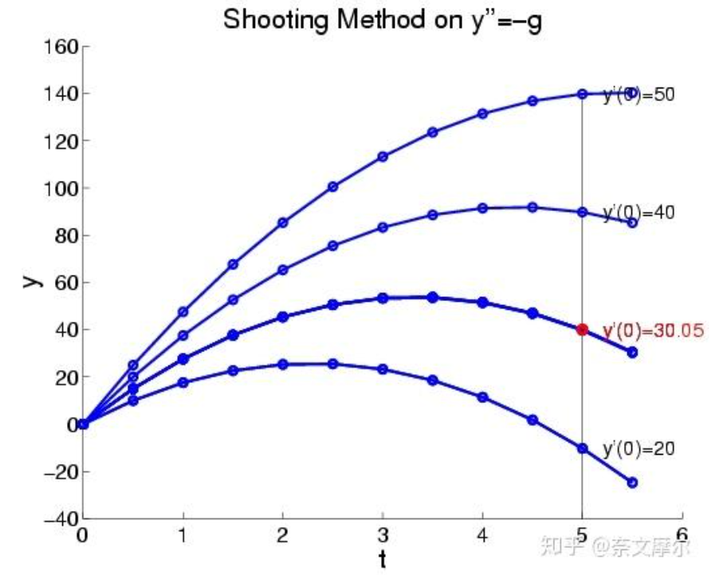

# Main Takeaway

连续最优控制

本章要点

- [ ] 掌握变分法基本思想
- [ ] 理解Hamilton函数构造
- [ ] 会应用PMP求解实际问题
- [ ] 熟练使用Riccati方程

<!--more-->

# 理论基础

## 控制简史

- 1696年，数学家约翰-伯努利提出了著名最速降线问题，要设计一个怎样的斜坡才能使小球最快的掉下来。

  在众多解法中，牛顿使用了**变分法**，即优化的变量本身是一个函数（坡的曲线表达）。变分法的想法是经典最优控制问题的解法，也在许多其他领域有应用。

- 1769年，瓦特发明了飞轮调速器，采用了**反馈控制**的思想，当转轴转速增加时，则在机械装置的作用下，自动调小蒸汽输入，开启了反馈控制系统的研究序幕。

- 从二十世纪初到二十世纪六十年代是经典控制理论的年代，许多著名的想法，如拉普拉斯变换、奈奎斯特稳定性判据都在那个年代被提出。

- 二十世纪六十年代到现在，随着计算机的发展，现代控制理论逐渐走向历史舞台，状态空间的概念被广泛应用。前苏联科学家Pontryagin提出了著名的极小值原理，李雅普诺夫提出了著名的李雅普诺夫稳定性判据

- 1950年到现在，出现自适应控制（adaptive control）和强化学习的概念。因为对于一个复杂的系统，很有可能系统模型参数是时变的，因此，这是一种在线做梯度下降（上升）来在线更新系统参数的思想。

- 1980年代，**鲁棒控制**开始被研究，在那之前人们自然想着，像LQR这种最优控制器是自然稳定的，但是有人证明了，在LQR参数矩阵中施加一些很小的噪声，也会使整个控制系统发散，因此带来了许多相关研究。

- 1970年代，**模型预测控制**开始被研究，最开始由于算力的受限，主要是被用于如化工行业，这类系统的时间常数大，对实时性要求不高，因此我可以花几分钟的时间来算出一个可行解。

- 二十世纪七八十年达，机械臂开始兴起，八十年代，有了足式机器人如著名本田机器人ASIIMO的前身EO，只有下半身的行走，在当年，人们是把机械臂相关的控制算法换到足式机器人中。而近代，许多足式机器人如Atals和minicheetah都做了有关刚体动力学的针对性分析。

## 当前研究的困难点

- 如何找到通用的处理接触的理论
- 如何将model-base控制和model-free的强化学习结合
- 如何在强化学习中加入先验知识让RL更加数据高效
- 如何保证不确定非线性系统的控制安全裕度
- 在一个非协作的环境中，如何处理其他adversarial 课题

## 最优控制三种形式

现在我们来考虑无约束最优化问题，那么我们需要定义一个目标函数，包含process cost and terminal cost

$J(x,u)$有三种表达形式$Lagrange,Mayer,Bolza$，是可以相互转换的

- Lagrange：关注过程
  - 性能指标：$J = \int_{t_0}^{t_f} L(t,x(t),u(t))dt$
  - 约束条件：状态方程$\dot{x(t)} = f(t,x(t),u(t))$+初始条件+终端条件（可能无）
  - 应用：路径规划等
- Mayer：关注终端
  - 性能指标：$J = \Phi(x(t_f))$
  - 约束条件：状态方程+初始条件
  - 应用场景：在一些目标明确为到达特定终端状态的问题中常用：导弹制导

- Bolza：混合，终端+过程
  - 性能指标：$J = \Phi(x(t_f))+\int_{t_0}^{t_f} L(t,x(t),u(t))dt$
  - 约束条件：条件不变
  - 应用场景：航天器轨道转移，既要考虑目标轨道状态，又要关注转移过程中燃料消耗

上述三种形式是可以互相转换的，Let`s take a look

- Lagrange to Mayer

  引入新状态变量：
  $$
     \dot{x}_{n+1}(t) = L(t, x(t), u(t)), \quad x_{n+1}(t_0) = 0

  $$

  那么性能指标就转换为Mayer形式：
  $$
     J = \int_{t_0}^{t_f} L(t, x(t), u(t)) dt \quad \Rightarrow \quad J = x_{n+1}(t_f)

  $$

  同时条件变为扩展状态方程组：
  $$
     \begin{cases}
     \dot{x}(t) = f(t, x(t), u(t)) \\
     \dot{x}_{n+1}(t) = L(t, x(t), u(t))
     \end{cases}

  $$

- Mayer to Lagrange

  定义$L(t, x(t), u(t)) = 0$，则 Mayer 问题的性能指标$J = \Phi(x(t_f))$可以看作是 Lagrange 问题性能指标$J = \int_{t_0}^{t_f} L(t, x(t), u(t)) dt + \Phi(x(t_f))$在$L(t, x(t), u(t)) = 0$时的特殊情况。此时，Lagrange 问题的性能指标就只取决于终端状态$\Phi(x(t_f))$，与 Mayer 问题的性能指标一致。

  示例：在一个车辆路径规划问题中，若 Mayer 问题是要求车辆在终端时刻到达指定位置，性能指标为终端位置与目标位置的距离$\Phi(x(t_f))$。按照上述转化方法，将其转化为 Lagrange 问题后，由于 $L(t, x(t), u(t)) = 0$，意味着在路径规划过程中不考虑过程中的其他因素，只关注终端状态，即车辆是否到达目标位置。

- Bolza to Mayer

  类似于 Lagrange 问题转化为 Mayer 问题，引入新的状态变量$x_{n+1}(t)$，令
  $\dot{x}_{n+1}(t) = L(t, x(t), u(t))$，$x_{n+1}(t_0) = 0$。则 Bolza 问题的性能指标
  $J = \Phi(x(t_f)) + \int_{t_0}^{t_f} L(t, x(t), u(t)) dt$可转化为$J = \Phi(x(t_f)) + x_{n+1}(t_f)$，这是一个关于终端状态
  $(x(t_f), x_{n+1}(t_f))$的函数，从而将 Bolza 问题转化为了 Mayer 问题。

- Bolza to Lagrange

  将 Bolza 问题的性能指标$J = \Phi(x(t_f)) + \int_{t_0}^{t_f} L(t, x(t), u(t)) dt$改写为
  $J = \int_{t_0}^{t_f} [L(t, x(t), u(t)) + \delta(t - t_f)\Phi(x(t_f))] dt$，其中$\delta(t)$是狄拉克 δ 函数。这样就将 Bolza 问题转化为了一个特殊的 Lagrange 问题，其拉格朗日函数为
  $L'(t, x(t), u(t)) = L(t, x(t), u(t)) + \delta(t - t_f)\Phi(x(t_f))$。

# 连续最优问题(无控制)

在介绍连续最优控制问题之前我们先来再看看无控制的连续最优问题，也算是对Lagrangian Formulation的提前介绍

今节的主要任务：

- 复习无约束变分问题
- 测地线方程－力学观点
- 测地线方程－几何观点
- 拉格朗日力学基础
- 几个算例

## Review

泛函极值问题分为两种：unconstrained/constranied ~

在介绍连续最优问题之前，我们先来复习一下经典的无约束变分问题

> 直接看Lec 1部分的变分法及拉格朗日推导吧

这里仅明确一下概念：

泛函（functional）通常是指定义域为函数集，而值域为实数或者复数的映射，输入为函数，而输出为标量。

> 算子是一个函数到另一个函数的映射，它是从**向量空间到向量空间的映射**，泛函是从**向量空间到数域的映射**，函数是从**数域到数域的映射**

### example

简单介绍一个泛函运用的具体例子：两点之间直线最短

在二维平面中，寻找从点 $ (0,0) $ 到 $ (a,b) $ 的曲线 $  y = y(x)  $，使得曲线的弧长 $  s  $ 最小。

弧长的微分形式为：

$$
ds = \sqrt{1 + \left( \frac{dy}{dx} \right)^2} \, dx
$$

总弧长为：

$$
s = \int_{0}^{a} \sqrt{1 + y'(x)^2} \, dx
$$

变分法求解，目标是最小化泛函 $  s = \int_{0}^{a} \sqrt{1 + y'(x)^2} \, dx  $，应用 **欧拉-拉格朗日方程**：

$$
\frac{d}{dx} \left( \frac{\partial F}{\partial y'} \right) - \frac{\partial F}{\partial y} = 0 \quad \text{其中} \quad F = \sqrt{1 + y'^2}
$$

- $ \frac{\partial F}{\partial y} = 0 $（因 $  F  $ 不显含 $  y  $）
- $ \frac{\partial F}{\partial y'} = \frac{y'}{\sqrt{1 + y'^2}} $

代入方程得：

$$
\frac{d}{dx} \left( \frac{y'}{\sqrt{1 + y'^2}} \right) = 0 \quad \Rightarrow \quad \frac{y'}{\sqrt{1 + y'^2}} = C \quad (\text{常数})
$$

化简方程：

$$
y'^2 = \frac{C^2}{1 - C^2} \quad \Rightarrow \quad y' = m \quad (\text{常数})
$$

积分得直线方程：

$$
y(x) = m x + c
$$

代入边界条件 $  y(0) = 0  $ 和 $  y(a) = b  $，得：

$$
c = 0, \quad m = \frac{b}{a}
$$

因此最短路径曲线为直线：
$$
y(x) = \frac{b}{a} x
$$

## Geodesic

测地线（Geodesic）是微分几何中的核心概念，表示流形上两点之间的“最短路径”

在介绍测地线之前，我们先介绍一下哈密顿原理（Hamilton's principle）

哈密顿原理（Hamilton's principle）是经典力学中的核心变分原理，揭示了力学系统的真实运动轨迹遵循作用量取极值的规律

- 定义：在完整保守系统中，系统从初始时刻 t1 到终了时刻 t2 的真实运动轨迹，使得作用量（Action）取驻值（极值或鞍点）——作用量极值决定真实轨迹
  $$
  \delta S = \delta \int_{t_1}^{t_2} L(q,\dot q,t)dt = 0
  $$

- 平面上的测地线：表现为直线

  - 几何观点
    $$
    F = \sqrt{1 + \dot{f}^2(x)}
    $$

    代入欧拉-拉格朗日方程
    $$
    \frac{\partial F}{\partial f} = 0
    $$

$$
\frac{\partial F}{\partial \dot{f}(x)} = \frac{\dot{f}(x)}{\sqrt{1 + \dot{f}^2(x)}}
$$

得到
$$
0 - \frac{d}{dx} \left( \frac{\dot{f}(x)}{\sqrt{1 + \dot{f}^2(x)}} \right) = 0
$$

因此
$$
- \frac{\dot{f}(x)}{\sqrt{1 + \dot{f}^2(x)}} = c
$$

$$
\dot{f}(x) = \frac{c}{\sqrt{1 - c^2}} = c_1
$$

$$
f(x) = c_1 x + c_2
$$

证明为直线

- 力学观点

    > 力学与微分几何的内在联系

    定义拉格朗日量为动能形式$L = \frac{1}{2}g_{ij}\dot{x}^i\dot{x}^j  = \frac{1}{2}(\frac{ds}{dt})^2$， 其中 $ g_{ij} $ 是流形的度规张量，$ \dot{x}^i = dx^i/dt $ 为坐标对参数 $ t $ 的导数。

    > 上述L是in metric terms (Euclidean 3D non-relativistic fat space)
    >
    > 单位质量时$T = \frac{1}{2}v^2$，然后在任意坐标系中弧长微分$ds$由度规张量$g_{ij}$定义：
    >
    > $ds^2 = g_{ij}dx^i dx^j$
    >
    > **用一句最土最直白的话来说，度量张量就是用来把斜角坐标的读数转换成直角坐标读数的，度量张量的本质就是坐标变换**——当然这里是粗浅的理解，不管是什么坐标系，是弯曲时空还是平直时空，有了度规和任意一个向量在这组基下的分量可以计算长度和角度
    >
    > 有了度规张量就可以推广到任何空间，例如笛卡尔坐标系：per unit mass so $T = \frac{1}{2}[(dx/dt)^2+(dy/dt)^2+(dz/dt)^2]$

    代入拉格朗日方程，展开后可得
    $$
    \frac{d}{dt} \left( g_{ik} \dot{x}^k \right) - \frac{1}{2} \partial_i g_{jk} \dot{x}^j \dot{x}^k = 0
    $$

    通过整理导数项，定义克氏符：

    $$
    \Gamma^i_{jk} = \frac{1}{2} g^{il} \left(
    \partial_j g_{lk} + \partial_k g_{jl} - \partial_l g_{jk}
    \right)
    $$

    最终得到测地线方程：

    $$
    \ddot{x}^i + \Gamma^i_{jk} \dot{x}^j \dot{x}^k = 0
    $$

- 球面上的测地线：球的表示$r,\theta,\phi$，这里令$r=1$

  - 几何观点

    球面路径长度积分：
    $$
      L = \int_A^B |d\mathbf{r}| = \int_{\theta_A}^{\theta_B} \sqrt{1 + \sin^2 \theta \, (\phi')^2} \, d\theta
    $$

    代入E-L方程
    $$
    \frac{d}{d\theta} \left( \frac{\partial}{\partial \phi'} \sqrt{1 + \sin^2 \theta \, (\phi')^2} \right) =  \frac{\partial}{\partial \phi} \sqrt{1 + \sin^2 \theta \, (\phi')^2}
    = 0
    $$

      展开后得到：

    $$
    \frac{d}{d\theta} \left( \frac{\sin^2 \theta \, \phi'}{\sqrt{1 + \sin^2 \theta \, (\phi')^2}} \right) = 0
    $$
    守恒量恒等式：
    $$
      \frac{\sin^2 \theta \, \phi'}{\sqrt{1 + \sin^2 \theta \, (\phi')^2}} = c
    $$

    导数关系推导：
    $$
    \phi' = \frac{c}{\sin \theta \sqrt{\sin^2 \theta - c^2}}
    $$

    问题转化为对$\phi \prime$进行积分

    变量替换：
    $$
    u = \cot \theta \quad \Rightarrow \quad du = -\csc^2 \theta \, d\theta
    $$

    $$
      \phi = \int \frac{-c \, du}{\sqrt{1 - c^2 \csc^2 \theta}} = \cos^{-1}\left(\frac{u}{a}\right) + \phi_0
    $$

      其中 $ a = \frac{\sqrt{1 - c^2}}{c} $，$ \phi_0 $ 为积分常数。

    得到测地线方程：
    $$
      \cot \theta = a \cos(\phi - \phi_0)
    $$

    a great circle path

  - 力学观点

    同样的，在球面上就是$ds^2 = a^2\dot\theta^2+a^2\sin^2\theta \dot\phi^2$，则
    $$
    L=\frac{1}{2}(a^2\dot\theta^2+a^2\sin^2\theta \dot\phi^2)
    $$
    然后对$\theta,\phi$分别应用拉格朗日函数

    先对$\theta$应用E-L
    $$
    \frac{d(a^2 \dot{\theta})}{ds} = a^2 \dot{\phi}^2 \sin \theta \cos \theta \quad \Rightarrow \quad \ddot{\theta} = \sin \theta \cos \theta \dot{\phi}^2
    $$
    然后对$\phi$应用E-L
    $$
    \frac{d}{ds} (a^2 \sin^2 \theta \dot{\phi}) = 0 \quad \Rightarrow \quad \ddot{\phi} + 2 \cot \theta \dot{\theta} \dot{\phi} = 0
    $$

## some example

A sliding point mass on a sliding wedge


质点系总动能包含三个部分：

$$
T = \frac{1}{2} M \dot{X}^2 + \frac{1}{2} m (\dot{X} + \dot{x})^2 + \frac{1}{2} m \dot{y}^2
$$

通过几何约束关系 $  y = x \tan\alpha  $ 化简为：

$$
T = \frac{1}{2} (M + m) \dot{X}^2 + m \dot{X} \dot{x} + \frac{1}{2} m (1 + \tan^2 \alpha) \dot{x}^2
$$

仅考虑重力势能：

$$
U = mgy = mgx \tan\alpha
$$

$$
L = T - U = \frac{1}{2} (M + m) \dot{X}^2 + m \dot{X} \dot{x} + \frac{1}{2} m (1 + \tan^2 \alpha) \dot{x}^2 - mgx \tan\alpha
$$

应用欧拉-拉格朗日方程：

广义坐标 X 方程：

$$
\frac{d}{dt} \left( \frac{\partial L}{\partial \dot{X}} \right) - \frac{\partial L}{\partial X} = 0 \quad \Rightarrow \quad (M + m) \ddot{X} + m \ddot{x} = 0
$$

广义坐标 x 方程：

$$
\frac{d}{dt} \left( \frac{\partial L}{\partial \dot{x}} \right) - \frac{\partial L}{\partial x} = 0 \quad \Rightarrow \quad m \ddot{x} + m (1 + \tan^2 \alpha) \ddot{x} = -mg \tan\alpha
$$

联立求解：
$$
\ddot{x} = -\frac{(M + m)g \sin\alpha \cos\alpha}{M + m \sin^2\alpha}
$$

$$
\ddot{X} = \frac{mg \sin\alpha \cos\alpha}{M + m \sin^2\alpha}
$$

## HW

1. 推导Snell`s law in optics，费马原理

   > Snell`s law：$\frac{\sin \theta_1}{\sin \theta_2} = \frac{n_2}{n_1} = \frac{v_1}{v_2}$
   >
   > 费马原理：光传播的路径是光程取极值的路径

2. 球面上的测地线推导与求解

3. 三角块与小球系统建模及matlab/simscope仿真


# 最优控制求解方法的发展

三种方法代表了最优控制理论的发展历程，从古典变分法到现代控制理论

## 方法对比总览

```
古典变分法 → Lagrangian方法 → Hamilton方法 → Pontryagin极小值原理
     ↓            ↓             ↓              ↓
  无约束问题    等式约束问题   对称化处理    不等式约束问题
```

| 方法               | 发展时期     | 适用场景     | 核心思想          |
| ------------------ | ------------ | ------------ | ----------------- |
| **Lagrangian方法** | 17-18世纪    | 古典变分问题 | 直接变分，E-L方程 |
| **Hamilton方法**   | 19世纪       | 理论分析     | 引入协态，对称化  |
| **PMP方法**        | 20世纪60年代 | 实际工程     | 处理控制约束      |

## 确定性最优控制

前面我们一直在打基础，学习了如何离散化模型，如何做一些优化，从这一节开始，我们正式进入最优控制的学习。

确定性最优控制是指系统的模型是确定的，在当前状态x给一个特定的u，根据系统方程我就一定可以知道下一步状态会怎么转移。这与**随机最优控制**或者**RL**那些不同，因为后者往往是一种概率时间，状态转义也是用一个概率函数表示的。

- 状态方程：$\dot{x}(t) = f(x(t), u(t), t)$，$x(t_0) = x_0$
- 性能指标：$J = h(x(t_f), t_f) + \int_{t_0}^{t_f} g(x(t), u(t), t) dt$
- 目标：寻找最优控制 $u^*(t)$ 使 $J$ 最小

> 以下求解均按照这个形式进行求解

其中，我们最小化的目标$J$是关于函数$x(t) \ u(t)$的泛函，$l(x(t),u(t))$叫做state cost，而$l_F(x_{t_f})$是terminal cost。

- 解得到**开环轨迹**，例如MPC（vs 随机最优控制的闭环解）与此相反，在**随机最优控制问题**中，由于问题的定义是充满噪声的，因此解随机最优控制问题必须要得到一个闭环的轨迹。
- 大多数情况无解析解（LQR是特例）
- 同时优化$x(t)$和$u(t)$避免条件数问题

> Tips：为什么优化的变量是x(t)和u(t)，而不能把x(t)通过状态方程消掉，最终只优化u(t)呢？
>
> 确实可以这么做，这么做有个专门的名字，叫做shooting/indirect method，但是这样做有几个坏处：一，只用u(t)的话代表要对整条轨迹进行前向仿真forward rollout/simulation，这样做因为A^N次方会导致优化问题的条件数变得很差，使优化问题变得病态，会出现类似于神经网络优化中的梯度消失或梯度爆炸问题。二，有些时候，无法找到一种稳定的初始控制率给我rollout，如，假如是一个人形机器人，找不到一个初始好的u(t)，那么整个优化问题会变得很难。但是，假如我是x(t)和u(t)一起优化的方式，我可以通过动捕数据提前采好人类行走时候的x(t)给到优化器作为初始值，这样子即使我没有一个好的初始的u(t)，我也能让整个优化问题至少一开始不在一个很奇怪的状态。这种方法就是目前常用的方法

# Lagrangian Formulation

- 处理对象：带等式约束的最优控制问题
- 拉格朗日乘子法，直接从变分原理推导，物理意义清晰
- 缺点：形式不够对称，计算复杂
- 适用条件：控制变量 $u(t)$ 无约束

## 一些古典变分问题

下面两个问题是起始和终端状态完全固定，因此可以直接变分，代入E-L方程即可

- 等周问题(Isoperimetric problem): 给定周长求最大面积
- 悬链线问题(Catenary problem): 重力作用下绳索形状——看hw8.md有详细推导
- 最速降线问题(Brachistochrone problem): 最快下降路径

其实在求解E-L方程时，常遇到二阶微分方程然后降维为一阶微分方程，实际上我们可以推导得
$$
f-y\prime \cdot \frac{\partial f}{\partial y\prime} =J(第一积分，运动常数)
$$

下面我们使用Lagrangian求解最优控制

## 变分求解

我们先来考虑一个带约束的问题，其中约束状态空间方程已经使用拉格朗日乘子法写进去因此转换为了无约束的目标函数
$$
J = h(t_f, \mathbf{x}_{t_f}) + \int_{t_0}^{t_f} \left[ g(t, \mathbf{x}(t), \mathbf{u}(t)) + \lambda^T \left( \mathbf{f}(t, \mathbf{x}(t), \mathbf{u}(t)) - \dot{\mathbf{x}} \right) \right] dt
$$

其中terminal cost积分可表示为
$$
h(t_f, \mathbf{x}_{t_f}) = \int_{t_0}^{t_f} \frac{d}{dt} h(t, \mathbf{x}(t)) \, dt + h(t_0, \mathbf{x}_{t_0})(为常数，可扔掉)
$$

因此消去terminal cost，将目标函数重写
$$
J = h(t_0, \mathbf{x}_{t_0}) + \int_{t_0}^{t_f} \left[ \frac{d}{dt} h(t, \mathbf{x}(t)) + g(t, \mathbf{x}(t), \mathbf{u}(t)) + \lambda^T \left( \mathbf{f}(t, \mathbf{x}(t), \mathbf{u}(t)) - \dot{\mathbf{x}} \right) \right] dt \\
= \int_{t_0}^{t_f} L^a(t,x(t),\dot x(t),u(t),\lambda(t))dt
$$
得到增广拉格朗日函数Augmented Lagrangian：
$$
L^a = \frac{\partial}{\partial x} h(t, \mathbf{x}(t))\dot x+ \frac{\partial}{\partial t} h(t, \mathbf{x}(t)) + g(t, \mathbf{x}(t), \mathbf{u}(t)) + \lambda^T \left( \mathbf{f}(t, \mathbf{x}(t), \mathbf{u}(t)) - \dot{\mathbf{x}} \right)
$$
然后通过一系列推导，

求泛函变分并分部积分化简

对 $\bar{J}$ 求变分 $\delta \bar{J}$，最优路径的必要条件是$\delta J(x^*) = 0$，根据泛函变分的求导规则，分别对积分项求变分可以得到$\delta J$的表达，其由四个部分组成

> Tips：对积分项求变分时需要进行分部积分

- 第一部分 $[\frac{\partial {h}}{\partial t}(x(t_f), t_f) + g(x(t_f), \dot{x}(t_f), t_f) - \frac{\partial g}{\partial \dot{x}}(x(t_f), \dot{x}(t_f), t_f) \cdot \dot{x}(t_f)] \delta t_f$，体现了终端时刻变化 $\delta t_f$ 对性能指标变化的影响

- 第二部分 $[\frac{\partial {h}}{\partial x}(x(t_f), t_f) + \frac{\partial g}{\partial x}(x(t_f), \dot{x}(t_f), t_f)] \delta x_f$，反映终端状态变化 $\delta x_f$ 对性能指标变化的作用

- 第三部分与终端约束相关，体现拉格朗日乘子变化 $\delta \lambda$ 对性能指标变化的影响。

- 第四部分 $\int_{t_0}^{t_f} \left\{ \frac{\partial g}{\partial x}(x(t), \dot{x}(t), t) - \frac{d}{dt} [\frac{\partial g}{\partial \dot{x}}(x(t), \dot{x}(t), t)] \right\} \cdot \delta x(t) dt$，是运行过程中状态变量变化 $\delta x(t)$ 对性能指标变化的贡献，其中被积函数正是 Euler-Lagrange 方程的表达式。

当代价达到最优时，增量 $\delta J = 0$ 。因此，实现最优控制所必需的约束条件如下：* 表示最优值。

最优控制问题的必要条件，各种E-L方程组合
$$
\begin{aligned}
\left( \frac{\partial L^a}{\partial \mathbf{x}} \right)_* - \frac{d}{dt} \left( \frac{\partial L^a}{\partial \dot{\mathbf{x}}} \right)_* &= 0 \quad \text{co-states}\\
\left( \frac{\partial L^a}{\partial \lambda} \right)_* - \frac{d}{dt} \left( \frac{\partial L^a}{\partial \dot{\lambda}} \right)_* &= 0 \quad \Rightarrow \quad \frac{\partial L^a}{\partial \lambda} = 0
\quad \text{the state dynamics}
\\
\left( \frac{\partial L^a}{\partial \mathbf{u}} \right)_* &= 0
\quad \text{optimal control}
\\
\left( \frac{\partial L^a}{\partial \mathbf{x}} \right)_*^T \delta \mathbf{x}(t_f) + L^a |_{t_f} \delta t_f &= 0
\quad \text{boundary conditions(依据终端条件确定)}
\end{aligned}
$$

> 注意这里边界条件需要依据终端条件进行确定

因为终止条件is free所以我们来探究一下boundary conditions


boundary conditions
$$
\left( \frac{\partial L^a}{\partial \dot{\mathbf{x}}} \right)_*^T \delta \mathbf{x}(t_f) + L^a |_{t_f} \delta t_f = 0
$$

代入$\delta x_f = \delta x(t_f)+ \dot{x}(t_f)\delta_{t_f}$，可得
$$
\left( \frac{\partial L^a}{\partial \mathbf{x}} \right)_*^T\Bigg|_{t_f} \{\delta \mathbf{x}_f - \dot{\mathbf{x}}(t_f) \delta t_f\} + L^a |_{t_f} \delta t_f = 0
$$

$$
\left[ L^a - \left( \frac{\partial L^a}{\partial \dot{\mathbf{x}}} \right)^T \dot{\mathbf{x}} \right]_{t_f} \delta t_f + \left( \frac{\partial L^a}{\partial \dot{\mathbf{x}}} \right)_{*t_f}^T \delta \mathbf{x}_f = 0
$$

实际上终端条件不同，得到的方程也不同，就是不同的E-L方程的组合

## Example

下面举一个具体的栗子：

自由最终时间最优控制，这里是一个两端状态均固定但是终端时间不固定的栗子

对下列方程设计最优控制：
$$
\dot{x}(t) = \begin{bmatrix} 0 & 1 \\ 0 & -2 \end{bmatrix} x(t) + \begin{bmatrix} 0 \\ 1 \end{bmatrix} u(t)
$$

$$
= \begin{bmatrix} x_2(t) \\ -2x_2(t) + u(t) \end{bmatrix}
$$

从初始状态$(0,1)^T$达到最终状态$(3,5)^T$，同时最小化代价
$$
J = \left[ x_1(t_f) - 3 \right]^2 + \frac{1}{2} \left[ x_2(t_f) - 5 \right]^2 + \frac{1}{2} \int_0^{t_f} \left[ x_1^2(t) + 3x_2^2(t) + 2u^2(t) \right] dt
$$
for the given information :
$$
L = \frac{1}{2} \left[ x_1^2(t) + 3x_2^2(t) + 2u^2(t) \right]
$$

终端成本 $  S  $
$$
S = \left[ x_1(t) - 3 \right]^2 + \frac{1}{2} \left[ x_2(t) - 5 \right]^2
$$

外力向量 $  \mathbf{f}  $
$$
\mathbf{f} = \begin{bmatrix}
x_2(t) \\
-2x_2(t) + u(t)
\end{bmatrix}
$$

拉格朗日乘子向量 $  \lambda  $
$$
\lambda = \begin{bmatrix}
\lambda_1(t) \\
\lambda_2(t)
\end{bmatrix}
$$
将上述公式代入重写目标函数的形式得到

Augmented Lagrangian:
$$
L^a = \frac{1}{2} \left[ x_1^2(t) + 3x_2^2(t) + 2u^2(t) \right] + 2(x_1(t) - 3)\dot{x}_1(t) + (x_2(t) - 5)\dot{x}_2(t) \\
+ \lambda_1[t](x_2(t) - \dot{x}_1(t)) + \lambda_2[t](-2x_2(t) + u(t) - \dot{x}_2(t))
$$
Necessary Conditions:

1. For $  x_1(t)  $:

$$
   x_1(t) + 2\dot{x}_1(t) - \frac{d}{dt}[2(x_1(t) - 3) - \lambda_1(t)] = 0 \\
   \quad \Rightarrow \quad \dot{\lambda}_1^*(t) = -x_1^*(t)
$$

1. For $  x_2(t)  $:

$$
3x_2(t) + \dot{x}_2(t) + \lambda_1(t) - 2\lambda_2(t) - \frac{d}{dt}(x_2(t) - 5 - \lambda_2(t)) = 0 \\
   \quad \Rightarrow \quad \dot{\lambda}_2^*(t) = -3x_2^*(t) - \lambda_1^*(t) + 2\lambda_2^*(t)
$$

Applying the necessary condition for optimal control:
$$
2u^*(t) + \lambda_2(t) = 0 \quad \Rightarrow \quad u^*(t) = -0.5\lambda_2^*(t)
$$
Necessary condition at final time:
$$
\left[ L^a - \left( \frac{\partial L^a}{\partial \dot{x}} \right)^T \dot{x} \right]_{t_f}^* = 0
$$
Expanded form:
$$
\frac{1}{2} \left[ x_1^2(t) + 3x_2^2(t) + 2u^2(t) \right] + 2[x_1(t) - 3]\dot{x}_1(t) + [x_2(t) - 5]\dot{x}_2(t) \\
+ \lambda_1[t](x_2(t) - \dot{x}_1(t)) + \lambda_2[t](-2x_2(t) + u(t) - \dot{x}_2(t)) \\
- 2[x_1(t) - 3 - \lambda_1(t)]\dot{x}_1(t) - [x_2(t) - 5 - \lambda_2(t)]\dot{x}_2(t) = 0
$$
Simplified result:
$$
\frac{1}{2} \left[ x_1^2(t) + 3x_2^2(t) + 2u^2(t) \right] + \lambda_1(t)x_2(t) + \lambda_2[t](-2x_2(t) + u(t)) = 0
$$
然后写代码求解

# Hamilton Formulation

从古典变分问题到最优控制问题

在古典变分中$u$是无约束的，但实际中的最优控制中$u$是有约束的，这里我们先考虑$u$无约束的情况，在下一节PMP中我们再来看有约束的$u$

- 目标：将Lagrangian方法对称化，简化计算。两种方法得到相同的最优解

  Hamilton方程组更对称，$x$ 和 $p$ 地位平等

- 关键概念：引入Hamilton函数（哈密顿量）

- 数学基础：Hamilton正则方程

## 数学推导

考虑连续时间最优控制问题，状态变量$x(t): [t_0, t_f] \rightarrow \mathbb{R}^n$和控制变量$u(t): [t_0, t_f] \rightarrow \mathbb{R}^m$都是连续可微函数。

- 被控对象：状态方程为$\dot{x}(t) = f(x(t), u(t), t), t \in [t_0, t_f]$，描述系统状态随时间动态变化；初值条件$x(t_0) = x_0$给定系统初始状态。

- 性能指标：要最小化 Lagrange 形式的性能指标$J(u) = h(x(t_f), t_f) + \int_{t_0}^{t_f} g(x(t), u(t), t) dt$，其中$h$刻画终端代价，$\int_{t_0}^{t_f} g(x(t), u(t), t) dt$表示运行过程累积代价，$f, g, h$二阶连续可微。

下面引入 Lagrange 乘子与 Hamiltonian 函数

引入 Lagrange 乘子函数$p(t): [t_0, t_f] \rightarrow \mathbb{R}^n$（连续可微）。

定义 Hamiltonian 函数
$$
\mathcal{H}(x(t), u(t), p(t), t) = g(x(t), u(t), t) + p(t) \cdot f(x(t), u(t), t)
$$

> 这里$p(t)$为协态变量对应之前的$\lambda$

于是得到增广性能指标
$$
\bar{J} = h(x(t_f), t_f) + \int_{t_0}^{t_f} \{\mathcal{H}(x(t), u(t), p(t), t) - p(t) \cdot \dot{x}(t)\} dt
$$
然后我们来进行求解

1. 计算泛函变分

   对$\bar{J}$求变分：

   - 对$h(x(t_f), t_f)$求变分：根据多元函数变分规则，
     $$
     \delta h(x(t_f), t_f) = \frac{\partial h}{\partial x}(x(t_f), t_f) \cdot \delta x_f + \frac{\partial h}{\partial t}(x(t_f), t_f) \delta t_f
     $$

   - 对积分项$\int_{t_0}^{t_f} \{\mathcal{H}(x(t), u(t), p(t), t) - p(t) \cdot \dot{x}(t)\} dt$求变分：
     根据积分变分规则$\delta \int_{t_0}^{t_f} F dt = \int_{t_0}^{t_f} \delta F dt$，其中$F = \mathcal{H}(x(t), u(t), p(t), t) - p(t) \cdot \dot{x}(t)$。
     分别对$\mathcal{H}$和$-p(t) \cdot \dot{x}(t)$求变分：

     对 $\mathcal{H}$ 和 $-p(t) \cdot \dot{x}(t)$ 求变分：

     1. 对 $\mathcal{H}$ 求变分：$$\delta \mathcal{H} = \frac{\partial \mathcal{H}}{\partial x} \delta x + \frac{\partial \mathcal{H}}{\partial u} \delta u + \frac{\partial \mathcal{H}}{\partial p} \delta p$$

     2. 对 $-p(t) \cdot \dot{x}(t)$ 求变分：$$\delta (-p \cdot \dot{x}) = -\delta p \cdot \dot{x} - p \cdot \delta \dot{x}$$

       再结合分部积分可化简

   因此，得到整体的泛函变分为：

$$
   \delta \int_{t_0}^{t_f} \{\mathcal{H}(x(t), u(t), p(t), t) - p(t) \cdot \dot{x}(t)\} dt = \int_{t_0}^{t_f} \left[ \frac{\partial \mathcal{H}}{\partial x} \delta x + \frac{\partial \mathcal{H}}{\partial u} \delta u + \frac{\partial \mathcal{H}}{\partial p} \delta p - \delta p \cdot \dot{x} - p \cdot \delta \dot{x} \right] dt
$$

1. 然后我们推导最优控制的必要条件

   令 $\delta \bar{J} = 0$：

   - 极值条件：
   由于 $\delta u$ 的任意性，要使 $\delta \bar{J} = 0$，则 $\frac{\partial \mathcal{H}}{\partial u}(x(t), u(t), p(t), t) = 0$，这是确定最优控制 $u(t)$ 的关键方程。

   - 状态方程：
   考虑 $\delta x$ 相关项，结合 $\dot{x}(t) = f(x(t), u(t), t)$ 以及 $\delta \bar{J} = 0$，可得 $\dot{x}(t) = \frac{\partial \mathcal{H}}{\partial p}(x(t), u(t), p(t), t)$，描述系统状态的动态变化。

   - 协态方程：
     由 $\delta p$ 相关项和 $\delta \bar{J} = 0$，得到 $\dot{p}(t) = -\frac{\partial \mathcal{H}}{\partial x}(x(t), u(t), p(t), t)$，刻画协态变量的变化。

   - 边界条件：

     对于终端时刻相关，根据 $\delta x_f$ 和 $\delta t_f$ 的系数为 0，得到：
     $$
     0 = \left[ \frac{\partial h}{\partial x}(x(t_f), t_f) - p(t_f) \right] \cdot \delta x_f
     $$

     $$
     0 = \left[ \frac{\partial h}{\partial t}(x(t_f), t_f) + \mathcal{H}(x(t_f), u(t_f), t_f) \right] \cdot \delta t_f
     $$

     在不同终端条件（终端时刻和状态固定或自由等）下，这些边界条件会有不同表现形式。例如终端时刻固定时，$\delta t_f = 0$，第二个边界条件自然满足；终端状态部分固定时，固定状态分量的变分 $\delta x_{if} = 0$，相应边界条件等式有特定形式。

于是我们就得到了最后的最优化条件：

- 极值条件：$$0 = \frac{\partial \mathcal{H}(x(t), u(t), t)}{\partial u}$$

- 状态方程：$$\dot{x}(t) = \frac{\partial \mathcal{H}(x(t), u(t), t)}{\partial p}$$

- 协态方程：$$\dot{p}(t) = -\frac{\partial \mathcal{H}(x(t), u(t), t)}{\partial x}$$

- 边界条件：
  $$
  0 = \left[ \frac{\partial h}{\partial x}(x(t_f), t_f) - p(t_f) \right] \cdot \delta x_f
  $$

  $$
  0 = \left[ \frac{\partial h}{\partial t}(x(t_f), t_f) + \mathcal{H}(x(t_f), u(t_f), t_f) \right] \cdot \delta t_f
  $$

然后我们结合不同的终端情况完善解的形式

| 情况                       | 边界条件/处理方法                                                                                     |
| -------------------------- | ----------------------------------------------------------------------------------------------------- |
| 终端时刻固定，终端状态固定 | - 已知 $x(t_0) = x_0, x(t_f) = x_f$                                                                   |
|                            | - 边界条件由固定值直接确定，无需额外方程                                                              |
| 终端时刻固定，终端状态自由 | - $\frac{\partial h}{\partial x}(x(t_f), t_f) - p(t_f) = 0$（协态终端条件）                           |
|                            | - $\delta t_f = 0$（固定时刻无需处理时间边界）                                                        |
| 终端时刻自由，终端状态固定 | - $\frac{\partial h}{\partial t}(x(t_f), t_f) + \mathcal{H}(x(t_f), u(t_f), t_f) = 0$（时间边界条件） |
|                            | - $\delta x_f = 0$（固定状态无需处理状态边界）                                                        |
| 终端时刻和状态自由且无关   | - 同时满足：                                                                                          |
|                            | - $\frac{\partial h}{\partial x}(x(t_f), t_f) - p(t_f) = 0$（协态条件）                               |
|                            | - $\frac{\partial h}{\partial t}(x(t_f), t_f) + \mathcal{H}(x(t_f), u(t_f), t_f) = 0$（时间条件）     |

# Pontryagin极小值原理

庞特里亚金极小值原理（Pontryagin's Minimum Principle, PMP）

核心思想：Pontryagin极小值原理的表述是在【有一般目标集的最优控制问题】的基础上加了一个容许控制的条件，也就是**控制量是有限制**的（例如火箭的推力是有范围的）

优化原理：极小值原理替代导数为零条件

## 数学推导

我们先来定义PMP针对的问题：

- 状态变量 $x(t): [t_0, t_f] \rightarrow \mathbb{R}^n$ 是无约束的连续可微函数。

- 被控对象符合状态方程和初值条件：
  $$
  \dot{x}(t) = f(x(t), u(t), t), t \in [t_0, t_f],\quad  x(t_0) = x_0
  $$

- 符合容许控制：对任意时刻 $t \in [t_0, t_f]$，$u(t) \in U \subseteq \mathbb{R}^m$，其中 $U$ 的每一维是 $\mathbb{R}$ 中的区间。
- 终端时刻固定，终端状态自由或固定。
- 最小化性能指标：
  $$
  J(u) = h(x(t_f), t_f) + \int_{t_0}^{t_f} g(x(t), u(t), t) dt
  $$

则性能指标取得全局极小值的必要条件是最优控制 $u(t)$ 和最优控制下的状态变量 $x(t)$ 满足如下条件：

- 极值条件：最优控制 $u(t) \in U$，对任意容许的控制变量 $u'(t) \in U$，在几乎任意时刻 $t \in [t_0, t_f]$，有
  $$
  \mathcal{H}(x(t), u(t), p(t), t) \leq \mathcal{H}(x(t), u'(t), p(t), t)
  $$
  即将之前的$\frac{\partial \mathcal{H}}{\partial u}(x(t), u(t), p(t), t) = 0$条件换成了上述极小值条件

- 状态方程：
  $$
  \dot{x}(t) = +\frac{\partial \mathcal{H}}{\partial p}(x(t), u(t), p(t), t) \delta x(t)
  $$

- 协态方程：
  $$
  \dot{p}(t) = -\frac{\partial \mathcal{H}}{\partial x}(x(t), u(t), p(t), t)
  $$

- 边界条件：
  $$
  0 = \left[ \frac{\partial h}{\partial x}(x(t_f), t_f) + \mathcal{H}(x(t_f), u(t_f), t_f) \right] \delta t_f \\
  + [ \frac{\partial h}{\partial x}(x(t_f), t_f) - p(t_f)]\delta x_f
  $$

> 注：当系统为线性且二次型性能指标时，PMP解与LQR等价

## 实际应用

- Bang-Bang控制
- 饱和控制系统

# 线性二次最优控制(LQR)

现在我们来考虑一个简单的最优控制问题——线性二次最优控制。这里使用哈密顿函数法进行推导，使用PMP原理进行条件求解最后能够得到著名的 Riccati 方程

## LQR问题建模

考虑线性时变系统：
$$
\dot{x}(t) = A(t)x(t) + B(t)u(t), \quad x(t_0) = x_0
$$
其中：

- $x(t) \in \mathbb{R}^n$ 为状态向量
- $u(t) \in \mathbb{R}^m$ 为控制输入
- $A(t)$ 和 $B(t)$ 为适当维数的时变矩阵

定义性能指标（二次型代价函数）：
$$
J = \frac{1}{2} x^T(t_f) Q_f x(t_f) + \frac{1}{2} \int_{t_0}^{t_f} \left( x^T(t) Q(t) x(t) + u^T(t) R(t) u(t) \right) dt
$$
其中：

- $Q_f \geq 0$ 终端状态偏差的惩罚

- $Q(t) \geq 0$ 为状态权重矩阵

  对角元素越大，对应状态的调节越快

- $R(t) > 0$ 为控制输入权重矩阵（保证控制量有界）

  对角元素越大，控制量越小，节约能量但调节较慢

- $t_f$ 为终端时刻（假设固定）

目标：寻找最优控制 $u^*(t)$ 使 $J$ 最小化。

然后我们使用前面推导的方法进行推导求解

## Hamilton函数法求解

1. 构建哈密顿函数

   引入协态向量 $\lambda(t) \in \mathbb{R}^n$，定义哈密顿函数：
   $$
   \mathcal{H} = \frac{1}{2} x^T Q x + \frac{1}{2} u^T R u + \lambda^T (A x + B u)
   $$

2. 必要条件（庞特里亚金极小值原理）

   根据极小值原理，最优解需满足以下条件：

   1. 状态方程（导数等于哈密顿对协态的偏导）
      $$
      \dot{x} = \frac{\partial \mathcal{H}}{\partial \lambda} = A x + B u（与原系统方程一致）
      $$

   2. 协态方程（导数等于负哈密顿对状态的偏导）
      $$
      \dot{\lambda} = -\frac{\partial \mathcal{H}}{\partial x} = -Q x - A^T \lambda
      $$

   3. 控制量极值条件（哈密顿对控制的偏导为零）
      $$
      \frac{\partial \mathcal{H}}{\partial u} = R u + B^T \lambda = 0 \quad \Rightarrow \quad u = -R^{-1} B^T \lambda
      $$
      此式给出控制量与协态的关系，需进一步消去 $\lambda$ 得到状态反馈形式。

   4. 边界条件：终端协态 $\lambda(t_f) = \frac{\partial J}{\partial x(t_f)} = Q_f x(t_f)$

### Riccati方程

Riccati 方程求解（状态反馈控制律）

**假设协态与状态成线性关系**，即 $\lambda(t) = P(t)x(t)$，其中 $P(t)$ 为对称正定矩阵（待求）。

1. 代入协态方程

   将 $\lambda = Px$ 代入协态方程：
   $$
   \dot{\lambda} = P \dot{x} + \dot{P} x = -Qx - A^T \lambda = -Qx - A^T P x
   $$
   利用状态方程 $\dot{x} = Ax + Bu$，并代入最优控制 $u = -R^{-1} B^T P x$，得：
   $$
   \dot{x} = Ax - BR^{-1} B^T P x = (A - BR^{-1} B^T P) x
   $$
   将 $\dot{x}$ 代入协态方程推导式：
   $$
   \dot{P} x + P (A - BR^{-1} B^T P) x = -Qx - A^T P x
   $$
   两边除以 $x$（非零），整理得著名的 Riccati 方程：
   $$
   \dot{P}(t) + P(t)A(t) + A^T(t)P(t) - P(t)B(t)R^{-1}(t)B^T(t)P(t) + Q(t) = 0
   $$
   终端条件：$P(t_f) = Q_f$

2. 最优控制律

   将 $\lambda = Px$ 代入控制量表达式，得线性状态反馈控制律：
   $$
   u^*(t) = -R^{-1}(t)B^T(t)P(t)x(t) = -K(t)x(t)
   $$
   其中 $K(t) = R^{-1}(t)B^T(t)P(t)$ 为反馈增益矩阵。

## 动态规划求解

### HJB方程介绍

Hamilton-Jacobi-Bellman (HJB) 方程这是一个用于描述**最优控制问题的偏微分方程**

$$
-\frac{\partial V}{\partial t}(x(t), t) = \min_{u(t) \in U} \left\{ g(x(t), u(t), t) + \frac{\partial V}{\partial x}(x(t), t) \cdot f(x(t), u(t), t) \right\}
$$

其中是值函数，$g$是过程成本，$f$是状态方程
$$
V(x, t) = \min_{u(\cdot)} J(t, x, u(\cdot))
$$
HJB方程提供了求解动态规划问题的一个有效工具，尤其是在连续时间、连续状态空间的环境中。

- 基本思想：是将原问题转化为**寻找一个价值函数**（也称作代价函数或泛函），该函数表示从当前状态出发到某个终止条件下的最优成本或收益。HJB方程确保了这个价值函数满足一定的动态一致性条件。

> Note: 在HJB方程中，$  \frac{\partial V}{\partial t} + f(x, u, t) \cdot \nabla V + L(x, u, t) = 0  $ 强调的是价值函数对状态变化的敏感性，而不是对时间或状态变化速度的敏感性。状态变化速度的敏感性已经包含在动力学模型中，通过求解HJB方程，我们可以得到最优控制策略，即在每个时间点和每个状态下，使得成本函数最小化的控制输入。

### DP求解

定义值函数 $V(x,t)$ 为从时刻 $t$、状态 $x$ 开始到终端时刻的最小代价：
$$
V(x,t) = \min_{u(\cdot)} \left\{ \frac{1}{2} x^T(t_f) Q_f x(t_f) + \frac{1}{2} \int_{t}^{t_f} \left( x^T(\tau) Q(\tau) x(\tau) + u^T(\tau) R(\tau) u(\tau) \right) d\tau \right\}
$$
贝尔曼方程HJB方程 Hamilton-Jacobi-Bellman方程：
$$
-\frac{\partial V}{\partial t} = \min_u \left\{ \frac{1}{2} x^T Q x + \frac{1}{2} u^T R u + \frac{\partial V}{\partial x} (Ax + Bu) \right\}
$$
对控制量 $u$ 求偏导并令其为零：
$$
\frac{\partial}{\partial u} \left\{ \frac{1}{2} u^T R u + \frac{\partial V}{\partial x} Bu \right\} = Ru + B^T \frac{\partial V}{\partial x} = 0
$$
得到最优控制： $$ u^* = -R^{-1} B^T \frac{\partial V}{\partial x} $$

假设值函数具有二次形式：$V(x,t) = \frac{1}{2} x^T P(t) x$ 则：
$$
\frac{\partial V}{\partial x} = P(t) x,\frac{\partial V}{\partial t} = \frac{1}{2} x^T \dot{P}(t) x
$$
代入HJB方程，得到同样的Riccati方程。

## 离散LQR

见[OP-离散最优控制](OP-离散最优控制.md)

## 结论

1. 时不变系统的简化（LQR 经典情形）

   若系统矩阵 $A$、$B$ 和权重矩阵 $Q$、$R$ 均为常数矩阵（时不变系统），则 Riccati 方程退化为代数 Riccati 方程（ARE）：
   $$
   PA + A^T P - PBR^{-1}B^T P + Q = 0
   $$
   此时 $P$ 为常数矩阵，最优控制律为静态反馈：
   $$
   u^* = -R^{-1}B^T P x = -Kx
   $$
   构造哈密顿矩阵：
   $$
   H = \begin{bmatrix}A & -BR^{-1}B^T \\-Q & -A^T\end{bmatrix}
   $$
   ARE求解可通过哈密顿矩阵的特征值分解获得（Schur方法）

2. 关键结论总结

   1. 最优控制结构：线性状态反馈 $u^* = -K(t)x(t)$，增益矩阵由 Riccati 方程求解。

   2. 稳定性：若系统可控且 $(A, B)$ 可控，则最优控制可使闭环系统渐近稳定。

   3. 应用场景：广泛用于机器人控制、航空航天、电力系统等需要兼顾性能与控制能量的场景。

通过上述推导，线性二次最优控制问题转化为求解 Riccati 方程的代数或微分方程，从而获得显式的最优反馈控制律

# 特殊最优控制问题

逐渐将上述的最优控制的结论应用到实践中

## 最小能量控制

minimum energy control是optimal transport的一个特例，我们通过一个具体的栗子来看看最小能量控制问题：
$$
J = \frac{1}{2} \int_{t_0}^{t_f} \|u(t)\|^2 dt
$$

$$
x(t_0) = x_0 \quad x(t_f) = x_f
$$

$$
G(t, z(t), \dot{z}(t)) = Ax(t) + Bu(t) - \dot{x}(t) \\
= \begin{bmatrix} A & B \end{bmatrix} \begin{bmatrix} x(t) \\ u(t) \end{bmatrix} - \begin{bmatrix} I & 0 \end{bmatrix} \begin{bmatrix} \dot{x}(t) \\ \dot{u}(t) \end{bmatrix} =0
$$

下面针对这个问题进行求解：
$$
\lambda(t) = \begin{bmatrix}
\lambda_1(t) \\
\lambda_2(t) \\
\vdots \\
\lambda_n(t)
\end{bmatrix}
$$

$$
\tilde{J}(z) = \int_{t_0}^{t_f} \left\{ \frac{1}{2} \|u(t)\|^2 + \lambda^T(t) [Ax(t) + Bu(t) - \dot{x}(t)] \right\} dt
$$

$$
\tilde{f}(t, z, \dot{z}) = \frac{1}{2} \|u\|^2 + \lambda^T(t) (Ax + Bu - \dot{x})
$$

代入E-L方程求解
$$
\frac{d}{dt} \begin{bmatrix} -\lambda^T(t) & 0 \end{bmatrix} = \begin{bmatrix} \lambda^T(t) A & u^T(t) + \lambda^T(t) B \end{bmatrix}
$$

$$
\dot{\lambda}(t) = -A^T \lambda(t),u(t) = -B^T \lambda(t)
$$

$$
\lambda(t) = e^{-A^T (t-t_0)} \lambda_0 = e^{A^T (t_0 - t)} \lambda_0 \quad \text{and} \quad u(t) = -B^T e^{A^T (t_0 - t)} \lambda_0
$$

下面我们来验证一下在$t_f$时是否到达$x_f$：
$$
x(t_f) = e^{A (t_f - t_0)} x_0 + \int_{t_0}^{t_f} e^{A (t_f - \tau)} B u(\tau) d\tau \\
= x_0 - \int_{t_0}^{t_f} e^{A (t_f - \tau)} B B^T e^{A^T (t_0 - \tau)} d\tau \lambda_0 \\
= e^{A (t_f - t_0)} \left[ x_0 - \int_{t_0}^{t_f} e^{A (t_0 - \tau)} B B^T e^{A^T (t_0 - \tau)} d\tau \lambda_0 \right] \\ = x_f
$$

求解成功

下面我们介绍一个**可控制性格拉姆矩阵**（Controllability Gramian）用来判断线性动态系统是否可控制：

可控制性格拉姆矩阵为：

$$
W_c(t_0, t_1) = \int_{t_0}^{t_1} \Phi(\tau, t_0) B(\tau) B^T(\tau) \Phi^T(\tau, t_0) d\tau
$$
其中$\Phi$为状态转换矩阵，系统在$t\in[t_0,t_1]$具有可控制性，当且仅当$W_c(t_0,t_1)$为**非奇异阵**

> 先来证明一下上述结论：
>
> 在连续时间的线性非时变系统中，也可以定义可控制性格拉姆矩阵（不过也有其他判断可观测性的方法）。
>
> 若考虑以下的系统：
>
> $$
> \dot{x}(t) = Ax(t) + Bu(t)
> $$
>
> $$
> y(t) = Cx(t) + Du(t)
> $$
>
> 其可控制性格拉姆矩阵是以下 $n \times n$ 的方阵：
>
> $$
> W_c(t) = \int_{0}^{t} e^{A\tau} B B^T e^{A^T \tau} d\tau
> $$
>
> $A$ 若稳定（所有的特征值实部均为负），可控制性格拉姆矩阵也是以下李亚普诺夫方程的唯一解：
>
> $$
> A W_c + W_c A^T = -B B^T
> $$
>
> $W_c$ 若正定（所有的特征值实部均为正），而且 $W_c$ 也是正定矩阵，则此系统具有可控制性，也就是 $(A, B)$ 矩阵对具有可控制性。
>
> 此一定义也和以下其他可控制性的定义等效：
>
> 1. $n \times np$ 的可控制性矩阵：
>
> $$
> C = \begin{bmatrix} B & AB & A^2B & \cdots & A^{n-1}B \end{bmatrix}
> $$
>
> 的秩为 $n$。
>
> 1. $n \times (n + p)$ 矩阵：
>
> $$
> \begin{bmatrix} A - \lambda I & B \end{bmatrix}
> $$
>
> 对于每个 $A$ 的特征值 $\lambda$，都有满秩。

然后我们来看看最小能量控制的controllability Gramian矩阵
$$
W(t_0, t_f) = \int_{t_0}^{t_f} e^{A(t_0 - \tau)} B B^T e^{A^T (t_0 - \tau)} d\tau
$$

$$
\lambda_0 = W^{-1}(t_0, t_f) \left( x_0 - e^{A(t_0 - t_f)} x_f \right)
$$

将$\lambda_0$代入最优控制$u(t)$的表达式

$$
u^*(t) = -B^T e^{A^T (t_0 - t)} W^{-1}(t_0, t_f) \left( x_0 - e^{A(t_0 - t_f)} x_f \right)
$$

同样$W$也有另外一种形式$W_R$为反向时间Gramian矩阵，令

$$
W_R(t_0, t_f) = \int_{t_0}^{t_f} e^{A(t_f - \tau)} B B^T e^{A^T (t_f - \tau)} d\tau
$$

$$
u^*(t) = B^T e^{A^T (t_f - t)} W_R^{-1}(t_0, t_f) \left( x_f - e^{A(t_f - t_0)} x_0 \right)
$$

$$
J^* = \frac{1}{2} \int_{t_0}^{t_f} \| u^*(t) \|^2 dt
$$

$$
= \frac{1}{2} \int_{t_0}^{t_f} \left[ -B^T e^{A^T (t_0 - t)} W^{-1}(t_0, t_f) \left( x_0 - e^{A(t_0 - t_f)} x_f \right) \right]^T
$$

$$
\times \left[ -B^T e^{A^T (t_0 - t)} W^{-1}(t_0, t_f) \left( x_0 - e^{A(t_0 - t_f)} x_f \right) \right] dt
$$

$$
= \frac{1}{2} \left( x_0 - e^{A(t_0 - t_f)} x_f \right)^T W^{-1}(t_0, t_f) \left( \int_{t_0}^{t_f} e^{A(t_0 - t)} B B^T e^{A^T (t_0 - t)} dt \right)\\ \times W^{-1}(t_0, t_f) \left( x_0 - e^{A(t_0 - t_f)} x_f \right)
$$

$$
= \frac{1}{2} \left( x_0 - e^{A(t_0 - t_f)} x_f \right)^T W^{-1}(t_0, t_f) W(t_0, t_f)\\ \times W^{-1}(t_0, t_f) \left( x_0 - e^{A(t_0 - t_f)} x_f \right)
$$

$$
= \frac{1}{2} \left( x_0 - e^{A(t_0 - t_f)} x_f \right)^T W^{-1}(t_0, t_f) \left( x_0 - e^{A(t_0 - t_f)} x_f \right)
$$

$$
J^* = \frac{1}{2} \left( x_f - e^{A(t_f - t_0)} x_0 \right)^T W_R^{-1}(t_0, t_f) \left( x_f - e^{A(t_f - t_0)} x_0 \right)
$$

该指标衡量了实现从$x_0$到$x_f$所需的最小能量

Show that the controllability Gramian satisfies the matrix differential equation:
$$
\frac{d}{dt} W(t, t_f) - A W(t, t_f) - W(t, t_f) A^T + B B^T = 0
$$

$$
初始条件:\quad W(t_f, t_f) = 0
$$

这个微分方程描述了Controllability Gramian矩阵随时间的变化规律，是其重要性质之一。通过求解该微分方程，可以得到Controllability Gramian矩阵的具体表达式。

## 参数最优化问题

### Intro

考虑以下非线性动态系统：

$$
\dot{x}(t) = f(t, x(t), \zeta), \quad t \in [0, T]
$$

$$
x(0) = x^0(\zeta)
$$

where

- $  x(t) = [x_1(t), \ldots, x_n(t)]^T \in \mathbb{R}^n  $ is the state vector at time $  t  $
- $  \zeta = [\zeta_1, \ldots, \zeta_r]^T \in \mathbb{R}^r  $ is the system parameter vector
- $  T > 0  $ is a given terminal time
- $  f: \mathbb{R} \times \mathbb{R}^n \times \mathbb{R}^r \to \mathbb{R}^n  $ and $  x^0: \mathbb{R}^r \to \mathbb{R}^n  $ are given functions

The solution of (A)-(B) is called the **state trajectory**

It is clear that the state trajectory depends on $  \zeta  $. Let $  x(\cdot | \zeta)  $ denote the state trajectory corresponding to $  \zeta \in \mathbb{R}^r  $.

Assumptions:

1. The given functions $  f  $ and $  x^0  $ are continuously differentiable.

2. For each $  \zeta \in \mathbb{R}^r  $, there exists a corresponding $  K > 0  $ such that:
   $$
   \| f(t, x, \zeta) \| \leq K (1 + \| x \|) \quad \text{for all } (t, x) \in [0, T] \times \mathbb{R}^n
   $$

于是我们可以将上述的state trajectory改写为
$$
\dot{x}(t|\zeta) = f(t, x(t|\zeta), \zeta), \quad t \in [0, T] \\
x(0) = x^0(\zeta)
$$
等同于:
$$
x(t|\zeta) =x^0(\zeta)+\int_0^tf(s, x(s|\zeta), \zeta) ds
$$

> 在Assumption(1)(2)下，我们能证明$x(\cdot | \zeta)$存在且对每个$\zeta$唯一

### Problem Statement

Choose the system parameter vector $  \zeta \in \mathbb{R}^r  $ to minimize the cost function

$$
\underbrace{\phi_0(x(T), \zeta)}_{\text{Final Cost}} + \int_{0}^{T} \underbrace{L_0(t, x(t), \zeta) dt}_{\text{Running Cost}}
$$

subject to the dynamic system

$$
\dot{x}(t) = f(t, x(t), \zeta), \quad t \in [0, T]
$$

$$
x(0) = x^0(\zeta)
$$

the bound constraints

$$
a_i \leq \zeta_i \leq b_i, \quad i = 1, \ldots, r
$$

the canonical(规范的) equality constraints

$$
\phi_j(x(\tau_j), \zeta) + \int_{0}^{\tau_j} L_j(t, x(t), \zeta) dt = 0, \quad j \in \mathcal{E}
$$

and the canonical inequality constraints

$$
\phi_j(x(\tau_j), \zeta) + \int_{0}^{\tau_j} L_j(t, x(t), \zeta) dt \geq 0, \quad j \in \mathcal{I}
$$

### Application

1. Parameter Identification

   考虑这样一个由以下动态模型描述的过程：

   $$
   \dot{x}(t) = f(t, x(t), \zeta), \quad x(0) = x^0
   $$

   where $  \zeta \in \mathbb{R}^r  $ is a vector of unknown model parameters and $  x^0 \in \mathbb{R}^n  $ is a given initial condition.

   Suppose that we are given a set of experimental data $ \{(\tau_k, \bar{x}^k)\}_{k=1}^p $, where $  \bar{x}^k  $ is the state measured at time $  \tau_k  $.

   然后，通过解决以下最优参数选择问题，就能得到未知模型参数的最优估计值：

   Minimize

   $$
   \sum_{k=1}^{p} \| x(\tau_k) - \bar{x}^k \|^2
   $$

   subject to

   $$
   \dot{x}(t) = f(t, x(t), \zeta), \quad t \in [0, T]
   $$

   $$
   x(0) = x^0
   $$

   Note that the cost function here measures the discrepancy between predicted and observed system output

2. Control Parameterization

   Consider the following control system:

   $$
   \dot{x}(t) = f(t, x(t), u(t)), \quad t \in [0, T]
   $$

   where $  u: [0, T] \to \mathbb{R}^r  $ is a control function to be determined optimally.

   The main idea of the control parameterization method is to approximate the control by a linear combination of basis functions:

   $$
   u(t) \approx \sum_{k=1}^{p} \sigma^k \phi_k(t)
   $$

   where $  \sigma^k \in \mathbb{R}^r  $ are given weights and $  \phi_k: [0, T] \to \mathbb{R}  $ are given basis functions.

   Substituting (B) into (A) gives:

   $$
   \dot{x}(t) = \bar{f}(t, x(t), \sigma^1, \ldots, \sigma^p), \quad t \in [0, T]
   $$

   where

   $$
   \bar{f}(t, x(t), \sigma^1, \ldots, \sigma^p) = f(t, x(t), \sigma^1 \phi_1(t) + \cdots + \sigma^p \phi_p(t))
   $$

   Determining an optimal control is thus reduced to an optimal parameter selection problem in which the components of $  \sigma^1, \ldots, \sigma^p  $ are the system parameters.

3. Optimal Feedback Control

   Consider the following control system:

   $$
   \dot{x}(t) = f(t, x(t), u(t)), \quad t \in [0, T]
   $$

   where $  u: [0, T] \to \mathbb{R}^r  $ is the control function.

   Suppose that we want to design an optimal feedback controller in the following form:

   $$
   u(t) = \varphi(x(t), \zeta)
   $$

   where $  \zeta \in \mathbb{R}^r  $ is a vector of adjustable parameters.

   Substituting (B) into (A) yields:

   $$
   \dot{x}(t) = \bar{f}(t, x(t), \zeta), \quad t \in [0, T]
   $$

   where

   $$
   \bar{f}(t, x(t), \zeta) = f(t, x(t), \varphi(x(t), \zeta))
   $$

   因此，确定最优的反馈控制就转化为一个最优参数选择问题，其中需要对可调节参数进行最优选择。

   通过这种方法，可以轻松地将状态限制因素纳入考虑范围。

### Solving

两种求解方法

- 变分法variational method：将状态系统和变分系统同时向前时间方向进行积分
- costate method：先将状态系统向前时间方向进行整合，然后再将导数系统向后时间方向进行整合

Optimal parameter selection problem:

Minimize

$$
g_0(\zeta) = \Phi_0(x(T | \zeta), \zeta) + \int_{0}^{T} \mathcal{L}_0(t, x(t | \zeta), \zeta) dt
$$

subject to

$$
g_j(\zeta) = \Phi_j(x(\tau_j | \zeta), \zeta) + \int_{0}^{\tau_j} \mathcal{L}_j(t, x(t | \zeta), \zeta) dt = 0, \quad j \in \mathcal{E}
$$

$$
g_j(\zeta) = \Phi_j(x(\tau_j | \zeta), \zeta) + \int_{0}^{\tau_j} \mathcal{L}_j(t, x(t | \zeta), \zeta) dt \geq 0, \quad j \in \mathcal{I}
$$

$$
a_i \leq \zeta_i \leq b_i, \quad i = 1, \ldots, r
$$

This problem can be solved using SQP methods. At each iteration:

- 目标值和约束值是通过求解状态系统来计算得出的
- 目标函数和约束条件的梯度是通过 either the variational method or the costate method 求解得到

## BVP Problem

Boundary Value Problem (BVP) 两点边界最优控制问题

### Problem Statement

考虑一个两点边值问题，其控制方程为形如下式的二阶常微分方程：

$$
y'' = f(x, y, y')
\\
a < x < b
$$
边界条件如下：

$$
y(a) = \alpha, \quad y(b) = \beta
$$
对于上述方程，如果有唯一的解需要满足以下条件：

$$f, f_y, f_{y'} \text{ 需要在区间 }$$

$$D = \{ (x, y, y') \mid a \leq x \leq b, -\infty < y < \infty, -\infty < y' < \infty \} \text{ 上连续。}$$

$$\text{在区间 } D \text{ 上 } f_{y'} > 0$$,$$f_{y'} \text{ 在区间 } D \text{ 上有界。}$$

### 打靶法(shooting method)

打靶法的本质是将边值问题(boundaryvalueproblem)转化为初值问题(initialvalue problem)来进行求解，其中x可以看作是时间，而a和b分别看作开始和结束的时间。
$$
y'' = f(x, y, y')，a < x < b \\
y(a) = \alpha, \quad y'(a) = t
$$
此时在初始点$a$上的斜率$t$未知，选取不同的$t$进行计算，在$b$点上得到的$ y(b) $也不同，问题中提到$ y(b) $的值确定为$\beta$ ，因此仅当t取某特定值时，b点处关系才能满足。

求解的过程即为尝试不同t作为初值条件使得 $y(b) $逼近$ \beta $的过程。如下图所示，不同的蓝线是对应不同的初值$t$的求解轨迹，仅当蓝线的轨迹在b点为$\beta$时，求得的轨迹即为问题的精确解。



上述只是对问题求解的一个定性描述，对于具体的求解，还需具体讨论。上述问题虽然从BVP转化为了IVP问题，但仍为二阶常微分方程，若需要用Euler方法或者Runge-Kutta方法来求解需要将其转化为一阶的方程组。

1. 如果方程为线性方程，斜率选择相对简单：

   可以令

   $$y'' = f(x, y, y'), \quad a < x < b, \quad y(a) = \alpha, \quad y'(a) = 0 \text{ 解为 } y_1(x)$$

   $$y'' = f(x, y, y'), \quad a < x < b, \quad y(a) = 0, \quad y'(a) = 1 \text{ 解为 } y_2(x)$$

   根据线性微分方程解的叠加性原理，则原始方程的解为

   $$
   y(x) = y_1(x) + t y_2(x)
   $$
   其中 $  t  $ 为精确解对应的初始点 $  a  $ 的斜率。该解在 $  b  $ 点应该满足

   $$
   y(b) = y_1(b) + t y_2(b) = \beta
   $$
   可以得到 $  t  $ 的表达式

   $$
   t = (\beta - y_1(b)) / y_2(b)
   $$

2. 如果方程为非线性方程，将 $  b  $ 点满足的关系写成非线性方程的形式：
   $$
   y(b, t) = 0
   $$
   此非线性方程可以用牛顿法、弦截法、二分法等迭代方法进行求解。

# References

- PMP[module3.pdf (nd.edu)](https://www3.nd.edu/~lemmon/courses/ee565/lectures/module3.pdf)
- 里面有非常详细的变分法对变动端点的变分问题的推导和应用：[数字人生](https://www.zhihu.com/column/c_1703789122005610496)
- [最优运输（Optimal Transfort）](https://www.cnblogs.com/liuzhen1995/p/14524932.html)

- [怎么理解SQP算法？](https://www.zhihu.com/question/279186014)

- [HJB方程的一些简单理解和过程推导](https://blog.csdn.net/w_w_y/article/details/123300931)
