# Main Takeaway

本篇文章主要介绍：信号与系统中的三大变换

 <!--more-->

信号与系统课程概括起来就是：

1. 一个中心——以LTI系统为中心；
2. 两条主线——连续时间和离散时间信号与系统；
3. 三个层次——时域、频域和复频域。

# Tips

作业的重要性：作业较少，写起来也不难，按时交就可以；前八周的作业和考试关联性不大，理解即可，后八周有一定关联，认真做。 考试前十分建议做前两份自测题，听张健老师最后一节习题课和自测题讲解，自测题考试的形式，巨有用。

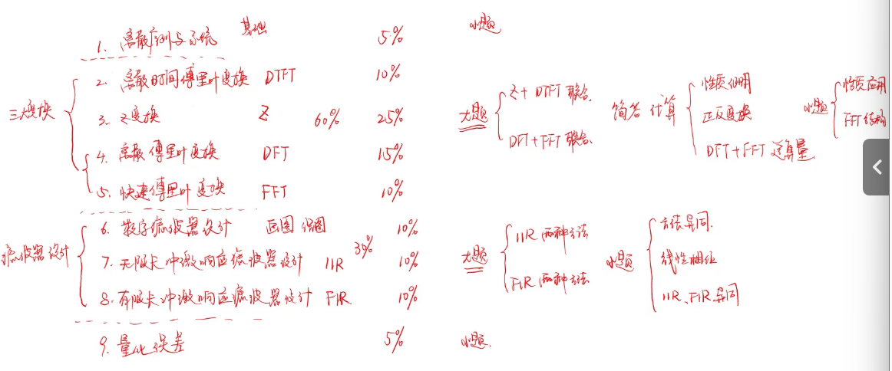

考试可以带计算器，提供了常用的公式

# 绪论

> $$
> e^{i\theta}=\cos\theta+i\sin\theta
> $$

- 连续信号：$x(t)$
- 离散信号：$x(k)$

- 系统：$y(t)=S[x(t)]$​

## 信号分类

- 能量W，功率P

$$
W=\lim_{T\rightarrow \infty}\int_{-T}^T|x(t)|^2dt
$$

$$
P=\lim_{T\rightarrow \infty}\frac{1}{2T}\int_{-T}^T|x(t)|^2dt
$$

> ||指大小

- 能量信号：W为有限值，P=0。如,单个矩形脉冲信号
- 功率信号：P为不等于零的有限值，如,幅度有限的周期信号
- 混沌(chaos)信号

## 常见序列

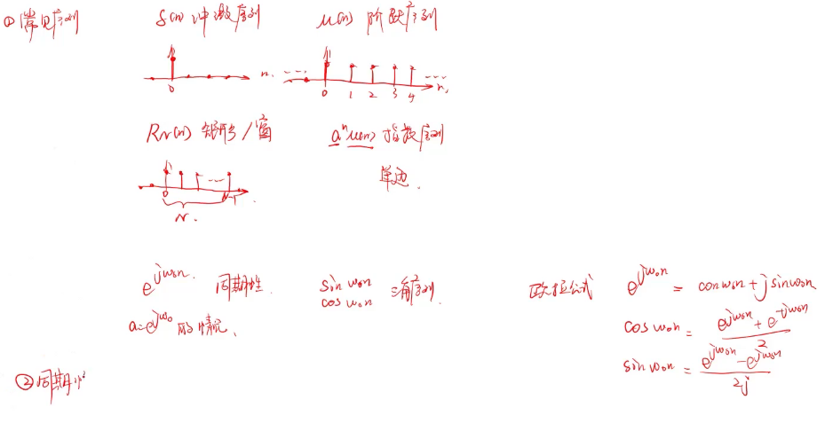

R为rectangle（矩形），R5（N）就是为长度是5的矩形序列，当N=0，1，2，3，4时，R5（N）=1，N为其他情况是R5（N）=0

Sa函数

[Sa函数 与 sinc函数](https://blog.csdn.net/qq_44431690/article/details/130252685)


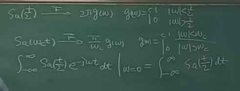

门函数必须加上定义

## 序列运算

- 尺度变换
  - 上采样：补零
  - 下采样：间隔取值

## 卷积

卷积性质——卷积就是一个函数翻转过来与另一个函数相乘

- 在频域是相加的

> 任意线性时不变系统都可表示为一个卷积

$$
卷积定理：\mathscr{L}[f(t)*g(t)]=\mathscr{L}[f(t)]\cdot\mathscr{L}[g(t)] \\
\mathscr{L}[f(t)\cdot g(t)]=\frac{1}{2\pi}\mathscr{L}[f(t)]*\mathscr{L}[g(t)]  \\
卷积的定义式：J=f(t)*g(t)=\int_{-\infty} ^{\infty}f(\tau)g(t-\tau)d\tau,\\
因为t<0,f(t)=0,所以J=\int_{0} ^{t}f(\tau)g(t-\tau)d\tau
$$

直接算卷积就是分部积分搞定

$t*sint=t-sint$

$t*e^t=e^t-t-1$

> 对于卷积的理解：
>
> 卷积可以理解为系统对当时时刻之前的所有输入的响应的叠加，举个例子，就好比往水中扔一颗石头，水面会产生涟漪，过了一段时间，又扔了一颗石头下去，又会产生水波，这时候两个水波相碰，互相叠加产生了一个新的效果就是卷积

$$
x(t-t_1)*\delta(t-t_2)=x(t-t_1-t_2)
$$

卷积的计算：

- 冲激法：有限长序列

  

- 定义法：无限长序列

  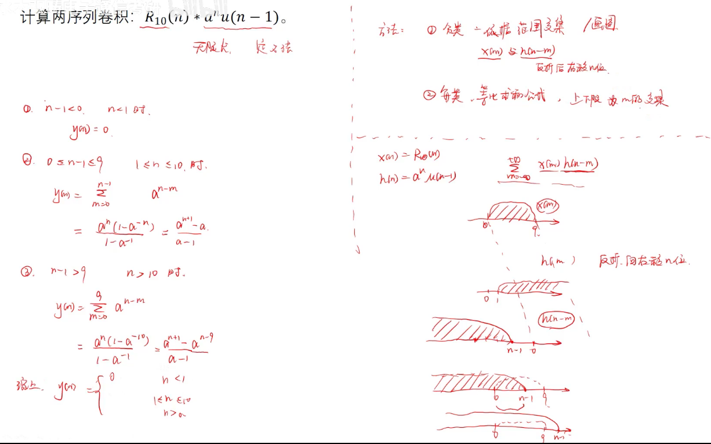

## 系统性质

- 线性
- 时不变
- 因果
- 稳定

## 数字与模拟


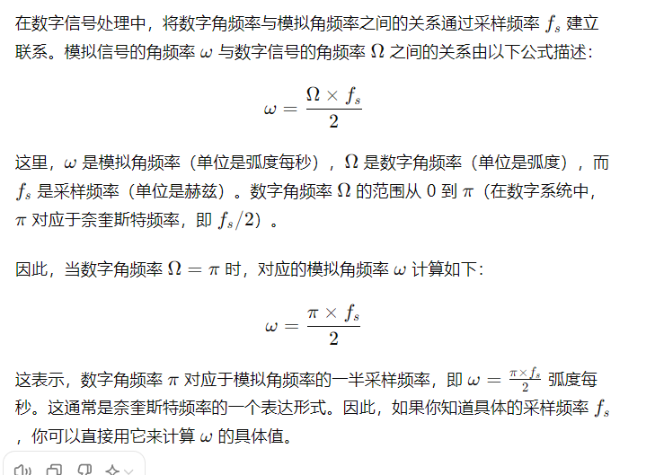

# 连续信号的分析

不论是拉普拉斯变换还是傅里叶变换，它们都是把微分方程转化为代数方程求解的，十分方便。

[Microsoft PowerPoint - L2-1-时域分析 - L2-1-时域分析-2in1.pdf (zju.edu.cn)](https://courses.zju.edu.cn/note-bene/pdf-viewer?file=https%3A%2F%2Ftcmedia.zju.edu.cn%2Fdownload%2Ffile%2F6b867073dcb3a9dda8f7b180d2102bd7cff3011b%3Ftimestamp%3D1709604000%26token%3Dce645748ca3ecff14679e018cd61f0a5%26name%3DL2-1-%E6%97%B6%E5%9F%9F%E5%88%86%E6%9E%90-2in1.pdf&upload_id=11598614&is_attachment_view=false)

希尔伯特空间：如果**一个空间**是**线性的**，**完备的**，并且**规定了范数**，**内积**和**距离**的，就叫做希尔伯特空间——完备的内积空间

[希尔伯特空间 - 知乎 (zhihu.com)](https://zhuanlan.zhihu.com/p/113197869)

范数：[范数（简单的理解）、范数的用途、什么是范数-CSDN博客](https://blog.csdn.net/a6333230/article/details/87860875)

$l^2(Z) and L^2(R)$​

## 频域分析

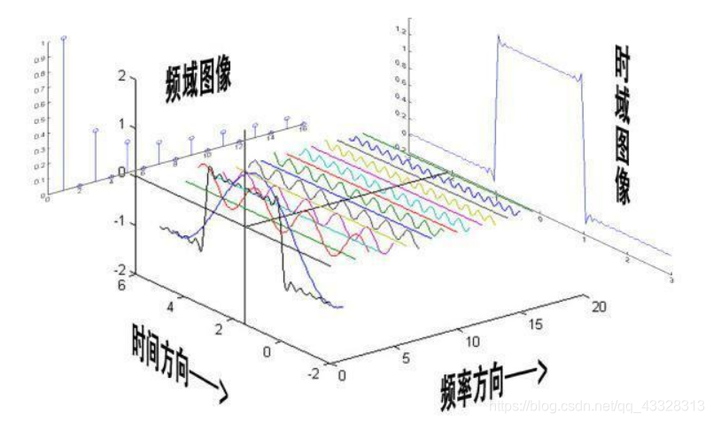

傅里叶变换的本质，就是用各种频率不同的周期函数（频域）线性表示原始函数（时域），必然具有线性性。这与积分的线性性是一致的。

[【信号与系统】笔记（3-2）信号的频谱与傅里叶变换（一图看懂傅里叶变换）_频谱函数](https://blog.csdn.net/qq_43328313/article/details/104997764)

### 傅里叶变换与反变换

傅里叶变换：
$$
F(j\omega)=\int_{-\infty}^{\infty}f(t)e^{-j\omega t}dt
$$
傅里叶反变换：
$$
F(t)=\frac{1}{2\pi}\int_{-\infty}^{\infty}f(j\omega)e^{j\omega t}d\omega
$$

$$
周期信号\rightarrow傅里叶级数\rightarrow频谱
$$

$$
非周期信号\rightarrow傅里叶变换\rightarrow频谱
$$

### 周期信号

周期信号频谱的特点：

- 离散型：以基频$\Omega$的若干离散谱线组成
- 谐波性：谱线仅含有基频$\Omega$的整数倍分量
- 收敛性：整体趋势减小

周期信号的傅立叶级数表示：$x(t+T)=x(t)$
$$
x(t)=\sum a_ke^{jk\omega_0t}=\sum a_ke^{jk(2\pi/T)t}
$$

$$
a_k=\frac{1}{T}\int_Tx(t)e^{-jk\omega_0t}dt=\frac{1}{T}\int_Tx(t)e^{-jk(2\pi/T))t}dt
$$

$$
\phi_k(t)=e^{jk\omega_0t},正交性，完备性
$$

**傅里叶变换**——迪利克雷条件
$$
X(j\omega)=\int_{-\infty}^{\infty}x(t)e^{-j\omega t}dt
$$

$$
x(t)=\frac{1}{2\pi}\int_{-\infty}^{\infty}X(j\omega)e^{j\omega t}dt——inverse
$$

把傅里叶级数从求和变为求积分

- **三角函数形式**：

$$
x(t)=\frac{a_0}{2}+\sum_{n=1}^{\infty}(a_n\cos n\omega_0t+b_n\sin n\omega_0t)
$$

$$
f(x)=\frac{a_0}{2}+\sum_{n=1}^{\infty}({a_n\cos\frac{n\pi x}{l}}+{b_n\sin\frac{n\pi x}{l}}),T=2l
$$

$$
a_n=\frac{1}{l}\int_{-l}^{l}f(x)\cos\frac{n\pi x}{l}dx(n=0,1,2 ...)
$$

$$
b_n=\frac{1}{l}\int_{-l}^{l}f(x)\sin\frac{n\pi x}{l}dx(n=0,1,2 ...)
$$

> 直流分量，基波分量n=1，谐波分量n>1

$$
x(t)=\frac{A_0}{2}+\sum A_n\cos (n\omega_0t+\phi_n)
$$

$$
A_0=a_0,振幅A_n=\sqrt{a_n^2+b_n^2},相位\phi_n=-\arctan \frac{b_n}{a_n}
$$

- **复指数形式**

$$
x(t)=\frac{1}{2}\sum A_ne^{j\varphi_n}e^{jn\omega_0t}=\sum X(n\omega_0) e^{jn\omega_0t}
$$

$$
X(n\omega_0)=\frac{1}{T_0}\int_{-\frac{T_0}{2}}^{{\frac{T_0}{2}}}x(t)e^{-jn\omega_0t}dt=\frac{1}{2}A_ne^{j\varphi_n}
$$

频谱函数：$X(n\omega_0)=\frac{1}{2}A_ne^{j\varphi_n}$频谱

幅频：$|X(n\omega_0)|$

相频：$\varphi_n$​随频率的分布


> $\frac{\sin x}{x}$取样函数，记为$Sa(x)$,$Sa(\frac{\omega t}{2})=t\frac{e^{\frac{j\omega t}{2}}-e^{-\frac{j\omega t}{2}}}{j\omega}$


- 周期矩形脉冲信号的频谱


- 收敛性：按包络线$Sa(\frac{n\omega_0\tau}{2})$等间隔经过零点，幅值较高的谱线都在第一个零点（$\omega=\frac{2\pi}{\tau}$）内（表明信号的能量大部分由该频率范围的各谐波分量决定）——常把这个频率范围称为周期举行脉冲信号的带宽$\omega_b,f_b$

当$T_o\rightarrow\infty$将变为单脉冲信号，成为连续频谱

- 周期信号的功率分配——帕斯瓦尔公式

  

### 非周期信号

频谱函数：
$$
F_n=\frac{1}{T}\int_{-\frac{2}{T}}^{\frac{2}{T}}f(t)e^{-jn\Omega t}dt
$$

### 傅里叶变换基本性质

非常好！！！：[积分变换（3）——傅里叶变换的性质 - 知乎 (zhihu.com)](https://zhuanlan.zhihu.com/p/108803395)——对称性那里看法很好——卷积与卷积定理

> 要熟悉各种性质
>
> 【【信号与系统每日一题】郑君里3.29：利用傅里叶变换的性质求傅里叶变换】<https://www.bilibili.com/video/BV11M4y1i7TY?vd_source=93bb338120537438ee9180881deab9c1>


- 

- 对偶性：

  [(7 封私信 / 41 条消息) 怎么更好的理解傅立叶变换的对偶性（互易性）？ - 知乎 (zhihu.com)](https://www.zhihu.com/question/406474434)

  [实函数傅里叶变换的奇偶虚实特性_实信号的傅里叶变换的特点-CSDN博客](https://blog.csdn.net/qiuchangyong/article/details/51245293)

$$
F[x(t)]=X(\omega)
$$

$$
X(0)\ne0
$$

$$
则F(\int_{-\infty}^t x(\tau) d\tau )=\frac{X(\omega)}{j\omega}+\pi X(0)\delta(\omega)
$$

> 打个比方，一个门信号（人） 照哈哈镜 （傅里叶变换），镜子中的像是Sa函数，让Sa照镜子，像是个门。然后你得记住这个性质，然后会用。


DTFT：离散时间傅里叶变换

DFT：离散傅里叶变换

### 基本信号的傅里叶变换


### 非奇异信号

## 拉普拉斯变换

- 从傅里叶变换到拉普拉斯变换——有些情况不满足迪利克雷条件（eg:指数增长函数）

  于是我们乘上一个衰减因子$e^{-\sigma t},\sigma为任意实数$使其收敛以满足迪利克雷条件

收敛域：ROC

### 连续信号

[信号处理--傅里叶变换的性质及常用信号的傅里叶变换_门函数的傅里叶变换-CSDN博客](https://blog.csdn.net/qq_45732223/article/details/109104813)

- 正弦信号
  $$
  x(t)=A\sin(\omega_0t+\phi)
  $$

- 指数信号
  $$
  x(t)=Ae^{st},s=\sigma+j\omega
  $$

1/t的傅里叶变换:$-i*\pi *sgn(w)$

傅立叶变换中x(t) = 1 的傅立叶变换为 2πδ(ω)

### 奇异信号

- 单位阶跃信号：$u(t)=\begin{cases}1\quad t\ge0\\0\quad t<0\end{cases}$​

  > 单边特性

  $$
  F(u(t))=\pi \delta(\omega)+\frac{1}{j\omega}
  $$

- 单位斜坡信号：$r(t)=\begin{cases}t\quad t\ge0\\0\quad t<0\end{cases}$

- 单位冲激信号：$\delta(t)=0,t\neq 0,\int_{-\infty}^{+\infty} \delta (t)dt=1$​
  $$
  \delta(t)\leftrightarrow 1,1\leftrightarrow 2\pi\delta(t)
  $$
  $$
  F(w)=\int_{-\infty}^{+\infty}\delta(t)e^{-jwt}dt=\int_{-\infty}^{+\infty}\delta(t)e^{-jw0}dt=1
  $$

  可见，单位冲激函数的频谱等于常数，也就是说，在整个频率范围内频谱是均匀分布的，单位冲激函数包含幅度相等的所有频率分量

  冲激偶信号$\delta\prime(t)=\frac{d}{dt}\delta(t)$

  - $\int_{-\infty}^{+\infty} \delta\prime (t)dt=0,\int_{-\infty}^{+\infty} \delta\prime (t)x(t)dt=-x\prime(0)$

冲激序列对连续信号采样

- 矩形脉冲信号——门函数

  $X(\omega)=E\tau Sa(\frac{\omega\tau}{2})$
  $$
  g(t)=\tau Sa(\frac{\omega\tau}{2})
  $$

- 单边指数信号

- 双边指数信号

- 双边奇指数信号

## Tips

1. 性质、常用信号——一般简单点

   - 先利用变化转化为常见函数（例如积分、求导之类的）

   - 然后傅里叶变换

   - 再利用性质找出原函数的傅里叶变换

2. 直接用公式

- 注意幅频相频图的还原

- 常用函数的傅里叶变换[【信号与系统】笔记（3-2）信号的频谱与傅里叶变换（一图看懂傅里叶变换](https://blog.csdn.net/qq_43328313/article/details/104997764)（里面有常用函数的傅里叶变换）

  

  

  

# 离散信号的分析

## 离散信号的时域描述和分析

### 信号的抽样和恢复

- 连续信号的离散化——实际抽样，理想抽样($\tau\rightarrow0$)

  采样周期$T_s$，采样时间$\tau$​
  $$
  x_s(t)=x(t)\delta_\tau(t)=\sum x(nT_s)\delta(t-n T_s)
  $$

- 连续信号的抽样模型

  

#### 时域采样


$$
X_s(\omega)=\frac{1}{T_s}\sum X(\omega-n\omega_s)
$$

$$
X_s(w)=\frac{1}{2\pi}X(w)*P(w)
$$

连续信号经理想抽样后频谱发生了**两个变化**：

- 频谱发生了周期延拓：将原连续信号的频谱$X(\omega)$分别延拓到以$\pm\omega_s,\pm2\omega_s...$为中心的频谱
- 频谱的幅度乘上了因子$\frac{1}{T_s}$

#### 频域采样

$$
X_p(w)=X(w)P(w)
$$

$$
x_p(t)=\frac{1}{w_0}\sum x(t-kT_0)
$$

- 对于天涯必须不该x(t)进行了周期延拓
- 信号的幅度乘上$\frac{1}{w_0}$

#### 采样过程

1. 先得到$x(n)=x(t)|_{t=an}$代入公式，算出来

   > $a是周期T_0与采样间隔$T的关系

2. 然后计算$x(n)$的周期$N$，基本频率$\Omega$，并将$x(n)$写成基频的三角形式

3. 得到三角形式后变为负数形式，写成$x(n)=\sum X(k\Omega)e^{jk\Omega n}$，就可以得到幅度频谱

> 原函数的频谱也是这样求，但不用求n直接当成$\Omega=T_0$

### 时域采样定理

对于频谱受限的信号$x(t)$，如果其最高频率为$\omega_m$

奈奎斯特（Nyquist）频率  ：$\omega_s=2\omega_m$

> 如果小于，则会发生频率混叠现象

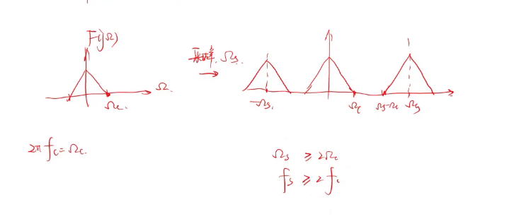

> 对于非带限信号，或频谱在高频段衰减较慢的信号，可根据实际情况采用抗混叠滤波器**将不需要或不重要的高频成分去除**，再进行抽样和数据处理


example:


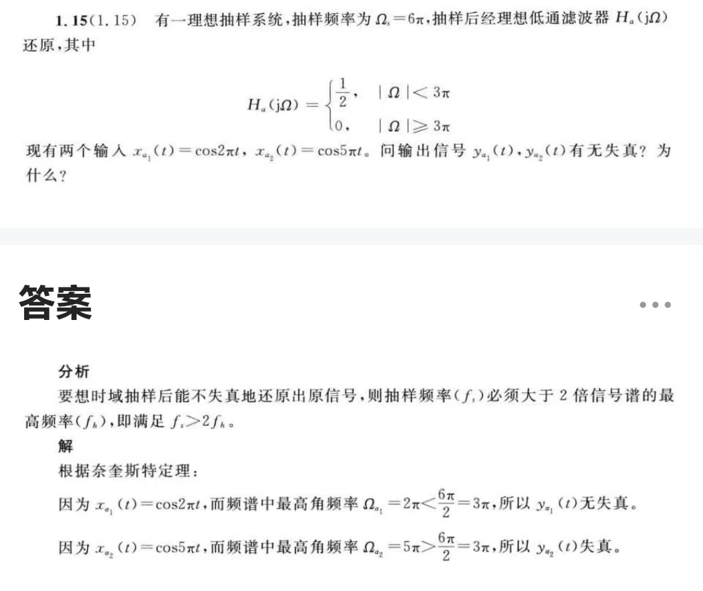

### 频域采样定理

对于一个长度为2$t_m$的时限信号x(t)，为了能够从频域样本集合完全恢复原信号的频谱，其频域的采样间隔必须满足：$\omega_0\le\frac{\pi}{t_m}$


$$
X(w)=X_s(w)G(w)
$$
[【数字信号处理】周期序列 ( 周期序列示例 3 | 判断序列是否是周期序列 )_如何判断序列是否是周期的](https://blog.csdn.net/shulianghan/article/details/123024645)

### 离散信号的描述

用序列$x(n)$来表示

常见的离散信号[离散信号描述 + 典型离散信号（典型序列）](https://blog.csdn.net/SanyHo/article/details/107101505)

数字频率$\Omega$和连续频率$\omega$

- 对于连续时间信号而言，其频率值$-\infty<\omega<\infty$

- 离散信号的数字频率的有效取值范围映射到$2\pi$之间，$0<\Omega\le2\pi,-\pi<\Omega\le\pi$

  离散周期信号只含有有限个谐波分量，其谐波数$k=\frac{2\pi}{\Omega_0}=N$

### 离散信号的时域运算

- 平移：左加右减；翻转：$x(-n)$

- 和积：同序号值逐项对应相加/相乘
- 累加：$y(n)=\sum_{k\rightarrow -\infty}^{n}x(k)$

- 差分运算

  - 向前差分：$\Delta x(n)=x(n+1)-x(n)$
  - 向后差分：$\nabla x(n)=x(n)-x(n-1)$
  - $\nabla x(x)=\Delta x(n-1)$​

- 序列的时间尺度（比例）变换：抽取

  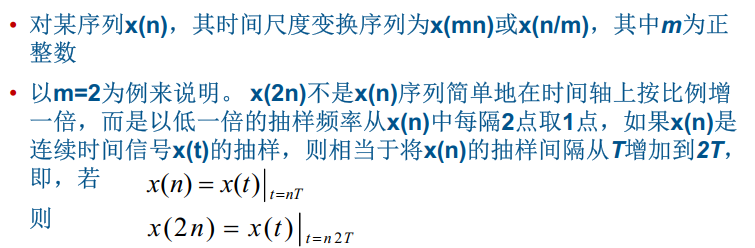

- 卷积和：$y(n)=\sum_{m= -\infty}^{\infty} x(m)h(n-m)=x(n)*h(n)$​

- 两序列相关运算：$\R_{xy}(x)=\sum_{m= -\infty}^{\infty} x(m)y(n+m)=x(n)*y(-n)$

### 例题

时域运算对频域的影响


高频×低频，相当于通过低通滤波器

从满足抽样定理的抽样信号中可以不失真的恢复出原模拟信号。采用的方法

- 从时域角度看是：取样函数（内插函数）加权求和构成的无穷级数

- 从频域角度看是：将抽样信号通过一个**理想低通滤波器**


## 离散信号的频域分析


### 离散周期信号的傅里叶级数表示（DFS）

- Discrete Fourier Series——DFS

离散傅里叶级数（DFS）是针对周期序列的，即无限长序列；
而将DFS取出一个周期就是DFT，即DFT是有限长序列；
实际上，DFT就是DFS在一个周期内的取值，一个序列的DFT实际上就是这个序列的频谱在一个周期内等间隔采样的样点值。

$x(n)=x(n+N)$，N：信号的周期，$\omega_0=\frac{2\pi}{N}$：信号的基波角频率


- Discrete Fourier Transform——DFT

[一窥数字傅里叶变换矩阵_dft矩阵](https://blog.csdn.net/golfbears/article/details/121014273)


### DFS的性质

在时域以N为周期的序列，在频域也是以N为周期的序列

- 线性性质
- 周期卷积定理
- 复共轭
- 位移性质
- 帕斯瓦尔定理


### 离散时间傅立叶变换（DTFT）

$$
x(n)=(\frac{1}{2})^nu(n+3)
$$

离散时间傅立叶变换（Discrete time Fourier transform——DTFT）

$$ X(\omega) = \sum_{n=-\infty}^{\infty} x[n]e^{-j\omega n} $$


inverse DTFT：


### 常见DTFT对

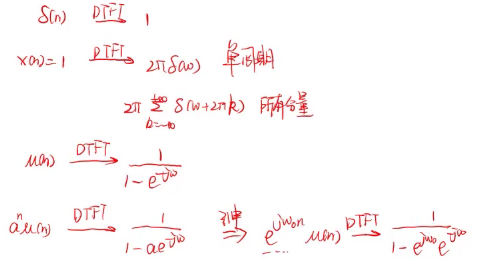

### DTFT的性质


> 注意一下微分形式

帕塞瓦尔定理：

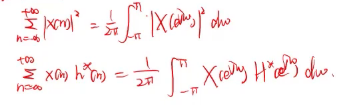


### DTFT与DFS的关系


连续信号离散化后分析频谱时：

- 采样信号的截断长度：必须取信号的一个基本周期或基本周期的整数倍长度，否则容易引起频谱泄露

  > 由于截取信号长度不当，从原来比较集中的谱线，出现了分散的扩展谱线

- 我们可以看到 $X(F),X_s(F)$​ 的关系是
  $$
  X_s(F) = \sum_k X(F-kF_s)
  $$
  即 $X_s(F)$ 是以 $F_s$ 为周期的周期函数。因此如果我们想用 $X_s(F)$ 去近似拟合 $X(F)$ ，其有效区间为 $F\in [-F_s/2,F_s/2]$ 。因为周期影响，我们可以发现，如果 $F_s$ 太小，不但有效区间小，而且有限区间内的值也不准确（因为会受相邻周期的影响）。

## 例题

- 定义：

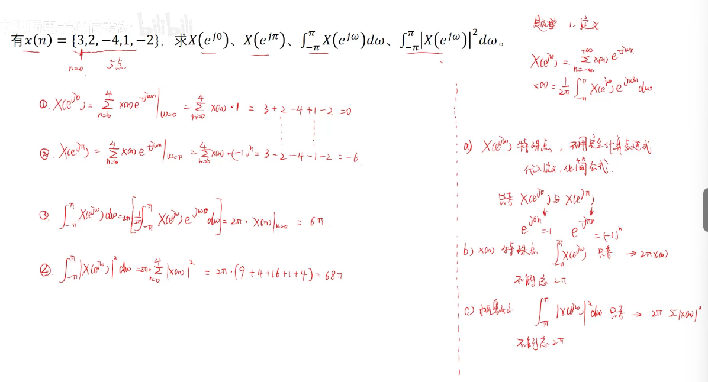

- 性质证明


- 正反变换


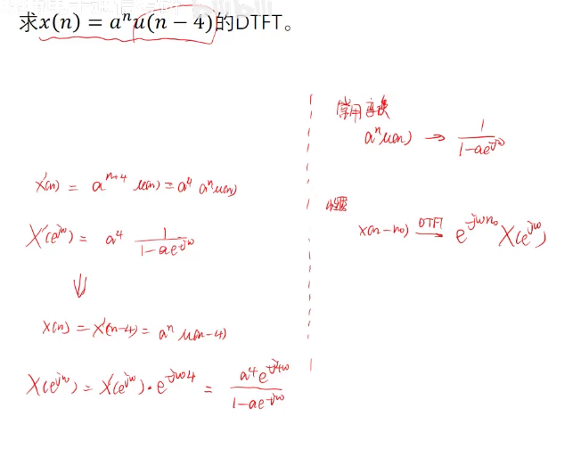

## DFT与FFT

DFT（Discrete Fourier Transform，离散傅里叶变换）和FFT（Fast Fourier Transform，快速傅里叶变换）是信号处理中常用的两种算法。

[信号处理——离散傅里叶变换(DFT,FFT)](https://zhuanlan.zhihu.com/p/635646102)

### 时域和频域的离散化

1. 不管你是不是周期函数，我就限死一个范围，只在这个范围按照一定间隔采样——时域被离散化了
2. 对于范围外的函数图像，我们可以假设其为采样范围内图像的延拓（覆盖掉原先的图像），在这种假设下，原函数就会成为一个周期函数，周期函数频谱密度函数是离散化的——频域被离散化了


### DFT（离散傅里叶变换）

通常来说，我们并不需要一个连续的频域函数，因此我们想要对其离散，即 $X(F)→X[k] $。理论上我们可以仿照对时间离散，对频率离散$F=F_0+\frac{k}{N_{dft}}F_s$

离散傅里叶变换（DFT），**既对时间离散又对频率离散的傅里叶**。（对DTFT继续对频域进行采样）它将一个离散的时间序列表示为不同频率的正弦和余弦函数的线性组合。DFT的计算公式如下：
$$
X(k) = \sum_{n=0}^{N-1} x(n) \cdot e^{-j\frac{2\pi}{N}kn},k=0,1,2,...N-1
$$

$$
X(k) = \sum_{n=0}^{N-1} x(n) \cdot W_N^{nk},k=0,1,2,...N-1
$$

$$
x(n)=\frac{1}{N}\sum_{k=0}^{N-1} X(k) \cdot e^{j\frac{2\pi}{N}kn},n=0,1,2,...N-1
$$

$$
x(n)=\frac{1}{N}\sum_{k=0}^{N-1} X(k) \cdot W_N^{-kn},k=0,1,2,...N-1
$$

其中，$X(k)$是频域信号的第$k$个系数，$x(n)$是时域信号的第$n$个样本，$N$是信号的长度，$j$​是虚数单位。

> W的下标N是频域截取的点的个数，$\sum$​上标中的N是时域截取的点的个数
>
> 可约性；

$$
f=\frac{k}{N}R
$$

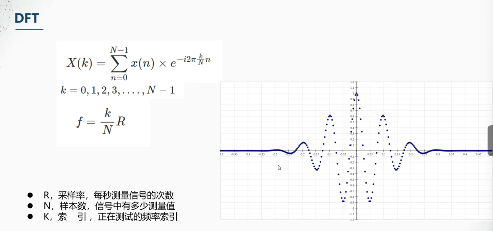

频域采样N点，时域的周期延拓也是N点，每个点的间隔是$T_s$，因此周期是$NT_s$

#### 常见变换对


#### 圆周运算

$$
((n))_N=n\%N
$$

用上面的写法写就会发生截断延拓，如果不这样写就算是标准延拓（可能会发生混叠）

取主值：
$$
x(n)\cdot R_N(n)
$$


#### 性质

> 底数从0开始数

DFT的循环移位：
$$
x((n-n_0))_NR_N(n)\stackrel{DFT}{\longrightarrow}X(k)W_N^{n_0k}
$$

$$
x(n)W_N^{-n_0k}\stackrel{DFT}{\longrightarrow}X(k-k_0))_NR_N(n)
$$


共轭对称性质：

- 复序列共轭DFT

  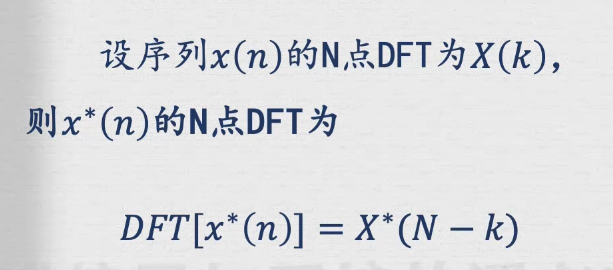

- 实序列

  

#### 做题

- 用定义

- 利用IDFT定义公式对比求解——只适合求有限个频率的序列

- 利用DFT和DTFT的关系求解

- matlab可以直接用DFT矩阵来算

- 性质的应用

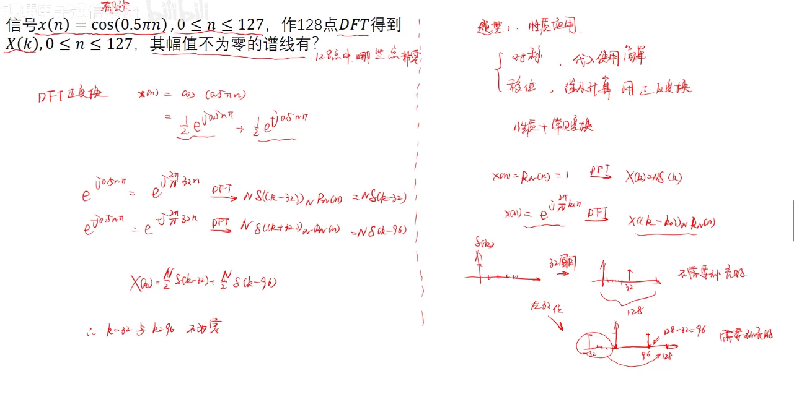

- 性质证明：帕塞瓦尔定理


- 圆周卷积——计算循环卷积

  先算线性卷积，再简短，补充相加

  

  > 上面结果写错了一点

- 频域采样定理

  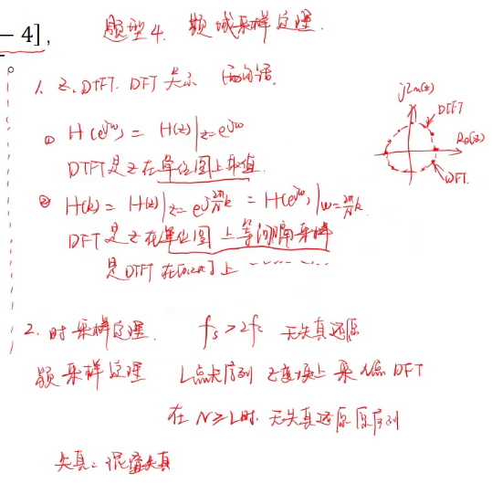

  如果N<L，会发生混叠失真

  

- 误差分析

  - 频谱泄露：

    - 频谱泄露（主辨展宽影响领巾谱线）
    - 谱间干扰（旁辨影响弱谱线）

    - 增加N值，窗长度；改变窗类型

  - 频谱混叠:$f_s<2f_c$

    - 增大采样频率
    - 减小$f_c$，预滤波

  - 栅栏效应：DFT频域采样，两点中间值无法观测

    - 增大采样数N
    - 截断后补零，增大时域点数：对DTFT不影响，但是DFT点数会增加

- 参数计算

  最小记录时间$t_p=\frac{1}{F}$,F为频率分辨率，即频域采样种两相邻点的频率间隔

  

### FFT（快速傅里叶变换）

[离散傅里叶变换(DFT)及快速傅里叶变换(FFT)](https://zhuanlan.zhihu.com/p/620462217)FFT（Fast Fourier Transform，快速傅里叶变换）

FFT是一种快速计算DFT的算法。它利用信号的对称性和周期性，将DFT的计算复杂度从$O(N^2)$降低到$O(N\log N)$。

令$W_N=e^{-j2\pi /N}$

基本思想：利用$W_N^{nk}$具有周期性和对称性和复杂度与$N^2$成正比

- 周期性：$W_N^{k}=W_N^{k+mN}$
- 对称性：$W_N^{N/2}=-1，当N是偶数时$
- 与2的幂次的关系：$W_N^{2}=W_{\frac{N}{2}}^1，当N是偶数时$

- 把长序列分解成一系列短序列

对13个点，补成16个点，需要的存储单元$\frac{3}{2}*16=24$​：

> $\frac{3}{2}N:其中N个数据\frac{N}{2}个权系数$

一个复数乘包含2次实数加法和4次实数乘法

[基2FFT and 基4FFT](https://www.cnblogs.com/lanlancky/p/17102834.html#_label8)

#### 基2FFT算法（蝶形算法）

分为时域抽取法和频域抽取法

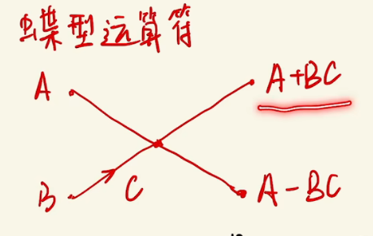

为了能够用上前面的性质，我们可以**假设 N 一定是二次幂**，如果真实的 N 不是二次幂，那就强行补齐，并将后面要补的值 x[n] 全部当成0（可行性已被证明）

然后把 DFT 根据 n 的**奇偶**分成两部分相加：其中 2r = n 表示偶数，2r + 1 = n + 1 表示奇数：

$X[k]=\sum_{r=0}^{\frac{N}{ 2}-1} x(2 r) W_N^{2 r k}+\sum_{r=0}^{\frac{N}{ 2}-1} x(2 r+1) W_N^{(2 r+1) k} \\ =\sum_{r=0}^{\frac{N}{ 2}-1} x(2 r) W_N^{2 r k}+W_N^{ k}\sum_{r=0}^{\frac{N}{ 2}-1} x(2 r+1) W_N^{2 r k}$

再根据前面的结论：$ \left[1, W^2, W^4, \ldots, W^{2(\frac{n}{2}-1)}\right] 等价于 \left[1, W_\frac{N}{2}^1, W_\frac{N}{2}^2, \ldots, W_\frac{N}{2}^{n-1}\right] $，有
$W_n^2 = W_\frac{N}{2}^1 $，上式可变为：

$X(k)=\sum_{r=0}^{\frac{N}{ 2}-1} x(2 r) W_{\frac{N}{ 2}}^{r k}+W_N^k \sum_{r=0}^{\frac{N}{ 2}-1} x(2 r+1) W_{\frac{N}{ 2}}^{r k}$

再令$ G(k)=\sum_{r=0}^{\frac{N}{ 2}-1} x(2 r) W_{\frac{N}{ 2}}^{r k} ， H(k)=\sum_{r=0}^{\frac{N}{ 2}-1} x(2 r+1) W_{\frac{N}{ 2}}^{r k}$

**到此为止，一个采样 N 次的 DFT，就可以拆成两个采样 N/2 次的 DFT，分别为偶数点采样 G(k)，和奇数点采样 H(k)**

显然

$G(k+\frac{N}{2})=\sum_{r=0}^{\frac{N}{ 2}-1} x(2 r) W_{\frac{N}{ 2}}^{r (k+\frac{N}{2})}=\sum_{r=0}^{\frac{N}{ 2}-1} x(2 r) W_{\frac{N}{ 2}}^{r k}W_{\frac{N}{ 2}}^{\frac{N}{ 2}}=G(k)$

同理： $H(k+\frac{N}{2})=H(k) $也成立

这样最终结论就出来了：

对于$ X(k)=G(k)+W_N^k H(k)$ ，有

- $X(k)=G(k)+W_N^k H(k) ， 0{\leq}k{<}\frac{N}{2}$
- $X(k)=G(k-\frac{N}{2})-W_N^{k-\frac{N}{2}} H(k-\frac{N}{2}) ， \frac{N}{2}{\leq}k{<}N$

也就是说，我们只需要求出**前一半的** $G(k) 和 H(k)$，就能得出全部的$ X(k)$，而对于$ G(k)$ 和 $H(k)$，它们本质上也是 DFT，但是规模都只有$ X(k) $的一半，因此可以继续递归，直到 N = 1 结束

> 见文章连接中的例子[离散傅里叶变换(DFT)及快速傅里叶变换(FFT)](https://zhuanlan.zhihu.com/p/620462217)


> 在FFT算法中，复数乘法和复数加法的次数与蝶形图中的节点数量相关，因为每个节点代表两次复数乘法和一次复数加法操作

#### FFT应用

- 时限连续信号：一般时限信号具有无限带宽，根据时域采样定理，无论怎样减小采样间隔Ts，都不可避免产生频谱混叠。且过度减小采样间隔，会极大地增加DFT计算工作量和计算机存储单元，实际应用中不可取

  - 利用抗混叠滤波器去除连续信号中次要的高频成分，再进行采样

  - 选取合适的Ts ，使混叠产生的误差限制在允许范围之内

- 频率有限信号：带限信号的采样频率选取比较容易，但一般带限信号时宽无限，不符合DFT在时域对信号的要求，要进行**加窗截断**
  - 离散周期信号当长度截断不当时会产生频谱泄漏现象  ‘
  - 加大窗宽
  - 选取形状合适的窗函数：矩形窗在时域的突变导致了频域中高频成分衰减慢，造成的频谱泄漏最严重，而三角形窗、升余弦窗（Haning窗）、改进的升余弦窗（Hamming窗）等在频域有较低的旁瓣，使频谱泄漏现象减弱

**谱分析**


有限长序列：截断，截断时间$T_p=\frac{1}{F_0}$​最小记录时间

样值间隔：$T=\frac{1}{f_s}$

序列长度$M=\frac{T_p}{T}=\frac{f_s}{F_0}$


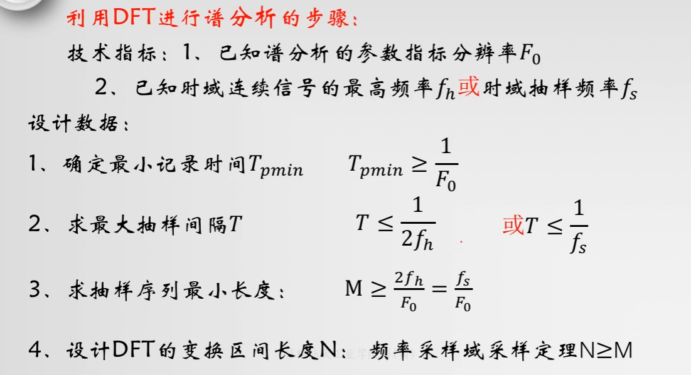

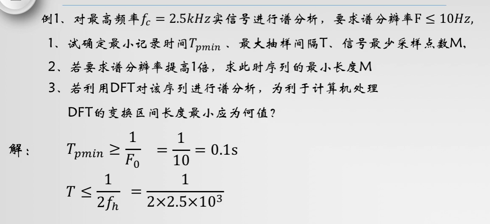


> 这里正弦采到的数据是全0，没意义，需要多1Hz，如果是余弦则没这个问题


> $t=nT$直接代入即可

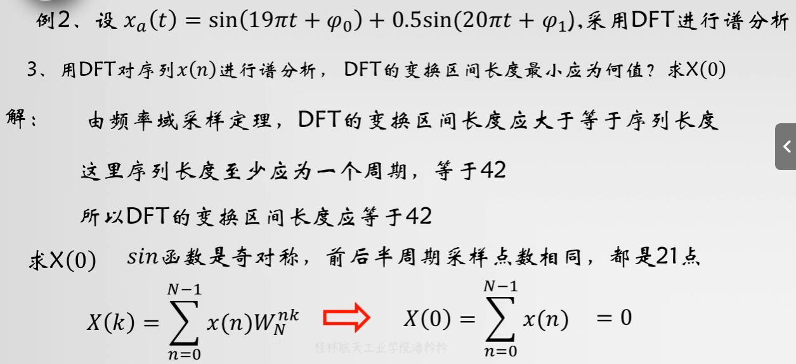

> 进行谱分析至少要一个完整的频率


#### IFFT


#### 做题


- 推导：奇偶+前后


- 做基2FFT的流程图

  时间抽取则时间为乱序，频域为顺序

  共有m级，$2^m=FFT的点$​

  标点，标箭头，标左下角（时域）/右下角（频域）的系数

  蝶形数量决定运算量：一个蝶形=两次复数加法+一次复数乘法

  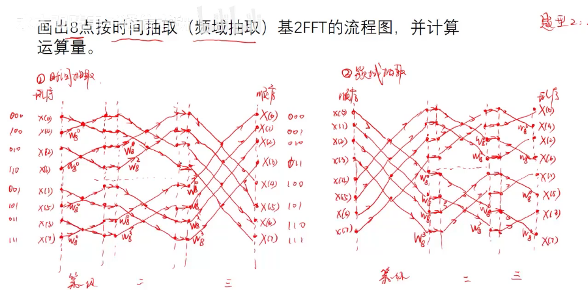

  

- FFT的应用：IFFT与卷积
  $$
  x(n)=\frac{1}{N}DFT^*[x^*(k)]
  $$
  

  所以IFFT运算量等同于FFT的运算量

  线性卷积：先补零到N；分别FFT；相乘，IFFT得到y(n)

  $N>N_1+N_2-1,and~~N=2^m$，当$N>N_1+N_2-1$时，圆周卷积=线性卷积（DFT的卷积性质）

  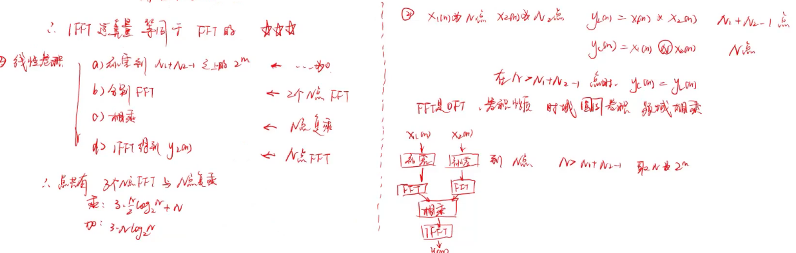

- 快速算法

  [利用N点复数序列求2个N点实数序列的快速傅里叶变换_n 点傅里叶变换](https://blog.csdn.net/qq_38967414/article/details/133833483)

  共轭对称：

  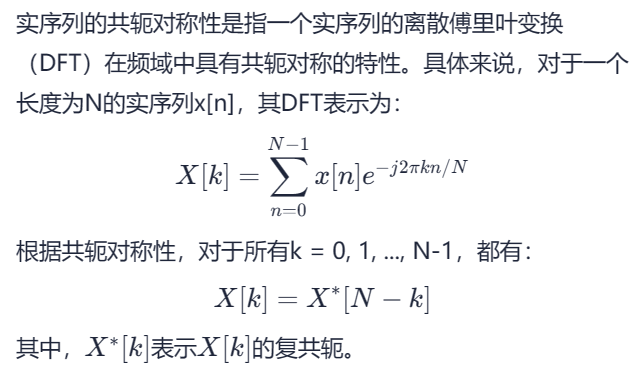

  

## 离散信号的z域分析

[离散时间系统的z域分析](https://zhuanlan.zhihu.com/p/425628963)

离散系统——z变换；连续系统——拉普拉斯变换


### z变换思想

增长型的离散信号x(n)的傅里叶变换是不收敛的，为了满足收敛条件，类似拉普拉斯变换，将x(n)乘以一衰减的实指数信号$r^{–n} (r>1)$，使信号$x(n)r^{-n}$满足收敛条件

离散信号的Z域分析的思想是**将离散时间域中的信号转换到Z域**，利用Z域的代数特性来分析和处理信号。通过Z变换，**可以将离散时间域中的差分方程转换为Z域中的代数方程**，从而简化了系统的分析和求解过程。
$$
z=re^{j\Omega}
$$

$$
s=\sigma+j\omega,z = e^{sT}
$$

Z域中的变量z是一个复数，其中s是复频率变量，T是采样周期。通过选择适当的T值，可以调整Z平面上频率轴的刻度，从而更方便地研究不同频率范围的特性

### z变换定义

Z变换是将离散时间域中的信号转换到Z域的一种数学工具，定义如下：(双边取下限为负无穷，单边取下限为0)
$$
X(z)=\sum_{-\infty}^{\infty} x(n)z^{-n}
$$

$$
Z[f(k)] = F(Z) = \sum_{k=-\infty}^{\infty} f(k)Z^{-k}
$$

其中，$f(k)$是离散时间域中的信号，$F(Z)$是Z域中的信号，$Z$​​是一个复变量。

### 常见变换对

典型序列z变换[典型序列的z变换](https://zhuanlan.zhihu.com/p/657145934)

- 单位样值函数：$\mathscr{Z}[δ(n)]=1,|z|为整个平面$

- 单位阶跃序列：$\mathscr{Z}[u(n)]=\frac{1}{1-z^{-1}},|z|>1$

- 斜变序列：$\mathscr{Z}[nu(n)]=\frac{1}{(1-z^{-1})^2}=\frac{z}{(z-1)^2},|z|>1$

- 指数序列：$\mathscr{Z}[a^nu(n)]=\frac{1}{1-(az^{-1})}=\frac{z}{z-a},|z|>|a|$

  $\mathscr{Z}[-a^nu(-n-1)]=\frac{1}{1-(az^{-1})}=\frac{z}{z-a},|z|<|a|$

- 正弦域余弦序列：$\mathscr{Z}[cos(ω_0n)u(n)]=\frac1{2}(\frac{z}{z-e^{jω_0}}+\frac{z}{z-e^{-jω_0}})=\frac{z(z-cosω_0)}{z^2-2zcosω_0+1}，\\\mathscr{Z}[sin(ω_0n)u(n)]=\frac1{2j}(\frac{z}{z-e^{jω_0}}-\frac{z}{z-e^{-jω_0}})=\frac{zsinω_0}{z^2-2zcosω_0+1},|z|>1$（借由指数序列z变换代入欧拉公式得到）

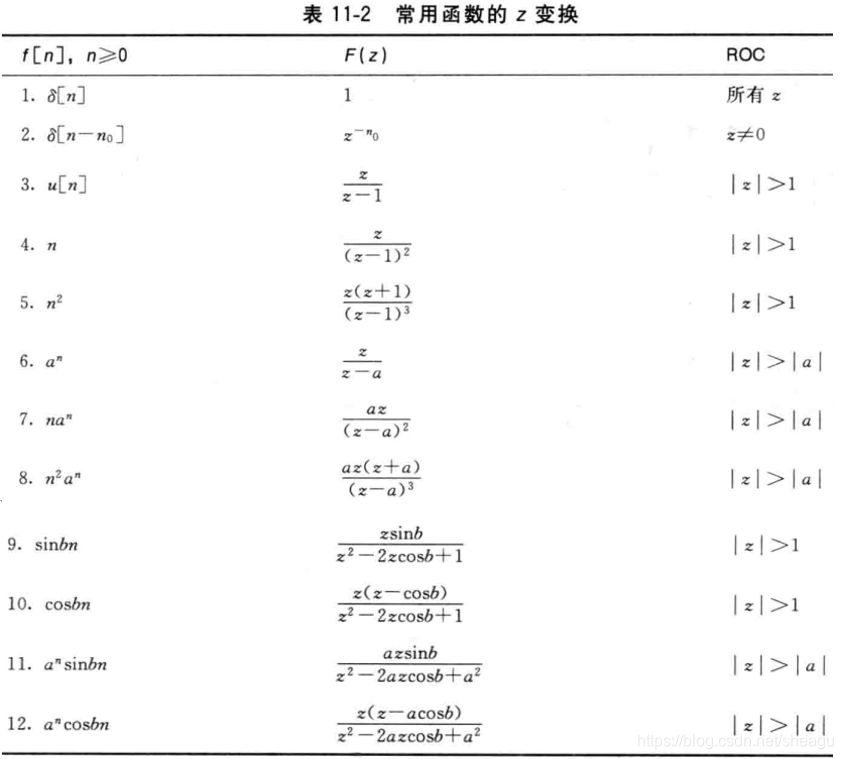

### 序列

向右即为右边序列，向左即为左边序列

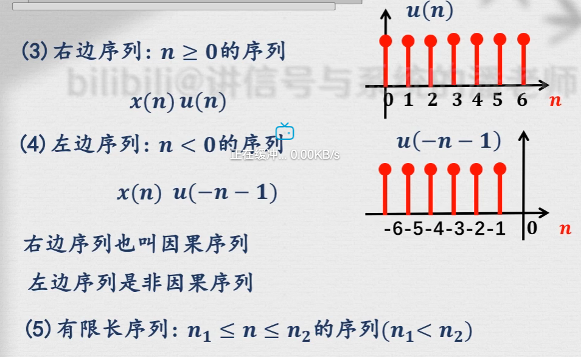

### z变换的存在条件（收敛域）

Z变换的存在条件是指使得Z变换级数收敛的Z值范围——级数收敛z变换才有意义
$$
\sum_{-\infty}^{\infty}|x(n)z^{-n}|收敛
$$
收敛域不同，可能对应相同的z变换——**单值**确定序列z变换需要给出序列的**变换式**与**收敛域**
$$
x(n)=\frac{1}{n!},n\ge 0
$$
级数收敛判定方法

- **比值判定法**：$lim_{n→∞}|\frac{a_{n+1}}{a_n}|=ρ，ρ<1收敛，>1发散$
- **根值判定法**：$lim_{n→∞}\sqrt[n]{|a_n|}=ρ，ρ<1收敛，>1发散$

几类序列z变换收敛域问题

1. **有限长序列**：$X(z)= \sum_{n=n_1}^{n_2}x(n)z^{-n}$，收敛域$0<|z|<∞，n_2≤0$时包含0，$n_1≥0$时包含$∞$

2. **右边序列**：有始无终，$X(z)= \sum_{n=n_1}^{∞}x(n)z^{-n}$，若满足根值判定法，即$|z|>\lim_{n→∞}\sqrt[n]{|x(n)|}=R_{x1}$，收敛域为**圆外部分**（是否包含$∞$判断方法同上）

3. **左边序列**：无始有终，$X(z)= \sum_{n=-∞}^{n_2}x(n)z^{-n}，|z|<\frac1{\lim_{n→∞}\sqrt[n]{|x(-n)|}}=R_{x2}$​，收敛域为**圆内部分**（是否包含0判断方法同上）

4. **双边序列**：$X(z)= \sum_{n=-∞}^{∞}x(n)z^{-n}= \sum_{n=0}^{∞}x(n)z^{-n}+ \sum_{n=-∞}^{-1}x(n)z^{-n}$，收敛域为两个级数**收敛域的叠加**，$R_{x1} < |z| < R_{x2}，$​​为一**圆环**（不存在公共收敛域则级数不收敛）

5. $H(z)$​极点有m个，是收敛于有m+1种可能

   > 零点与极点和无穷远处围成的圆环之一
   >
   > 每个极点p对应单边序列
   >
   > - p在收敛域内，对应右边序列
   > - p在收敛域外，对应左边序列

6. 收敛于必不包含极点，m+1种收敛域不相交

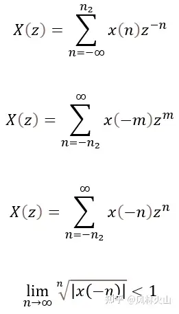


### z反变换

Z反变换是将Z域中的信号转换回离散时间域中的信号的过程。

逆z变换：$x(n)=\frac1{2\pi j}\oint_CX(z)z^{n-1}dz$，C是包围$X(z)z^{n-1}$**所有极点**的**逆时针闭合路线**

留数法求z反变换

### z变换基本性质

[离散时间系统的z域分析](https://zhuanlan.zhihu.com/p/425628963)——直接看性质


- 注意移位、复位移、导数性质，初值、终值定理，卷积

### z变换与其他变换的关系


#### z变换与拉式变换的关系

- z平面与s平面的映射关系

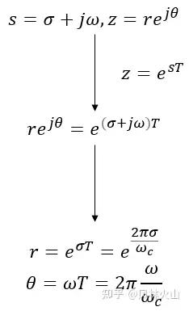

​ **几何映射关系**：s平面**虚轴**映射z平面**单位圆**，**右平面**映射**圆外**，**左平面**映射**圆内**；s平面**实轴**映射z平面**正实轴**，**平行于实轴的直线**（ω常数）映射**始于原点的辐射线**；$e^{j\theta}$为以$\omega_s$为周期的**周期函数**，故在s平面**沿虚轴移动**对应于z平面上**沿单位圆周期旋转**，平移$\omega_s$则旋转一周（**映射非单值**）

- z变换与拉氏变换表达式之对应：

$\mathscr{Z}[x(nT)]=X(z)=\sum_{i=1}^{N}\frac{A_i}{1-e^{p_iT}z^{-1}}$，其中$p_i$为连续信号拆成指数信号的特征根

#### Z变换与DTFT的关系

离散信号x(n)的Z变换是x(n)乘以实指数信号$r^{-n}$后的DTFT

如果将Z变换中的复变量$z$取值为$e^{j\omega}$，则Z变换将变成DTFT。换句话说，DTFT可以看作是Z变换在单位圆（$|z|=1$）上的特例。具体来说，DTFT是在复平面上以$\omega$为间隔对Z变换进行采样的结果。因此，可以说DTFT是Z变换的一种离散形式。

此外，由于Z变换可以表示为DTFT的拉普拉斯变换，因此Z变换也可以用于具有周期特点的离散时间信号的分析。通过在复平面上进行解析，Z变换提供了一种更灵活的工具来处理和分析离散时间信号。

### 利用z变换解差分方程

线性时不变离散系统差分方程一般形式：$\sum_{k=0}^Na_ky(n-k)=\sum_{r=0}^Mb_rx(n-r)$


### 单边Z变换

$$
X(z)=\sum_{n=0}^{\infty} x(n)z^{-n}
$$

单边Z变换和双边Z变换的差别在于，单边Z变换求和仅在n的非负值上进行，而不管n<0时x(n)是否为零

绝大部分性质一样，时移定理、初值定理、终值定理  不一样

- 时移定理

  

- 初值定理

  

- 终值定理

### 做题

- 定义

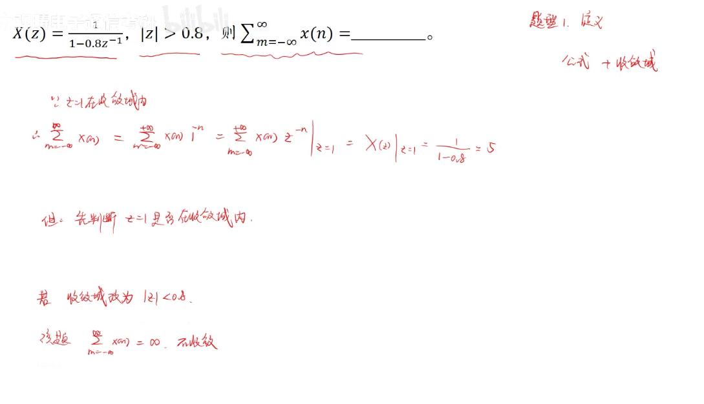

- 性质应用

  使用Z域的传递函数判断稳定性：所有极点都在单位圆内则稳定

- 综合应用


H(z)变换为框图，差分方程，冲激响应

1. 框图

   右边为分子，左边为分母，分母为反馈自带一个负号

   分母常数部分一定为1！！！

   

2. 差分方程

   写差分：分子变x(n)，分母变y(n)，$z^{-1}$延时

   认差分：两边同时Z变换，得到$H(z)=\frac{Y(z)}{X(z)}$，注意不要反了

   

3. 冲激响应

   $h(n)\longrightarrow H(z)$正变换

   $H(z)\longrightarrow h(n)$​反变换：先判断收敛域，除z（为了凑出指数形式）后再因式分解，最后通过收敛域判断是哪种序列

   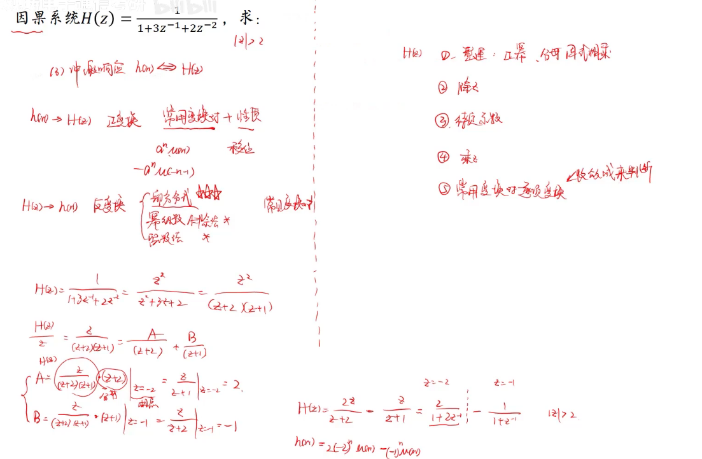

4. 零极图

   找出零点、极点即可，二阶要注明

5. 幅频响应

   DTFT：$H(e^{j\omega})=H(z)|_{z=e^{j\omega}}$​

   几何法：求大概曲线

   代入：$|H(e^{j\omega})|=\sqrt{H(e^{j\omega})H^*(e^{j\omega})}$，用欧拉公式进行合并

   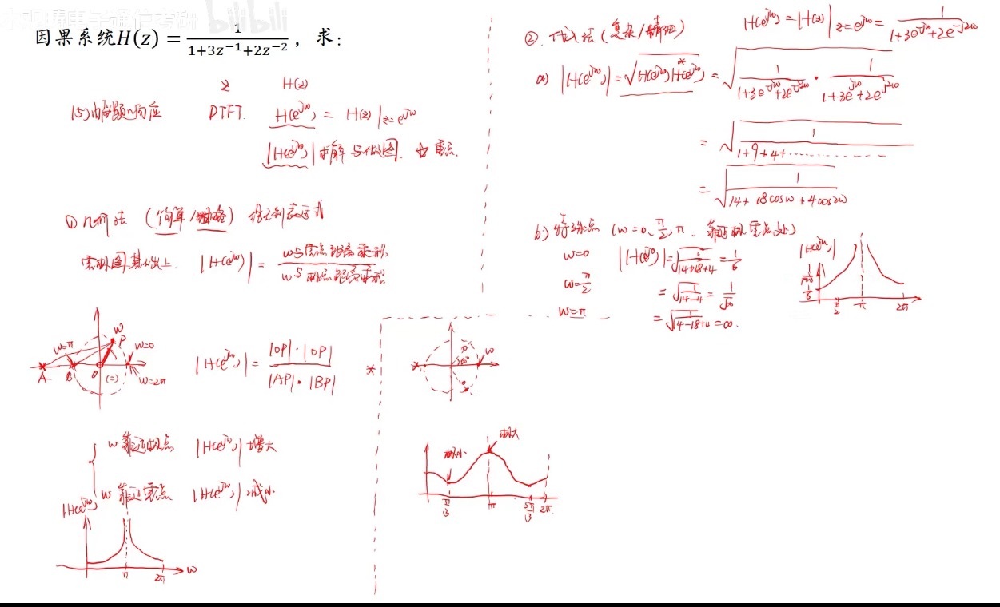

6. 求输入输出

   给出H(z)，给定x(n)求y(n)

   - x(n)带$u(n)$：求X(z)，求Y(z)=H(z)X(z)，反变换求y(n)
   - x(n)不带$u(n)$​，是周期信号：

   

7. 因果稳定

   因果：H(z)收敛于，为模值最大极点向外

   稳定：H(z)收敛域含单位圆（只需要含那一个圈即可，内部无所谓）

   

#### z变换

- 级数求和

- 部分分式展开法（!）

  

- 留数法[Z变换中常用的留数法分解因式](https://zhuanlan.zhihu.com/p/190175382)

#### z反变换

- 留数法求z反变换[留数法求Z反变换](https://blog.csdn.net/weixin_50932441/article/details/128716306)

  > 当$F(z)$无公因子时，用留数法求得的只适合k>0，不适合k=0

  - 
  - 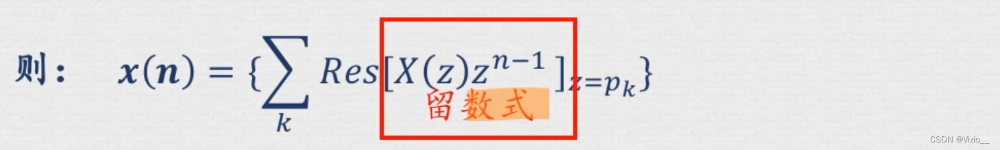

- 长除法
- 部分分式展开法
  - 将F(z)除以z
  - 将分式展开
  - 

## Tips

- [【数字信号处理】周期序列 ( 周期序列示例 3 | 判断序列是否是周期序列 )_如何判断序列是否是周期的-CSDN博客](https://blog.csdn.net/shulianghan/article/details/123024645)

# 几大变换的关系

- 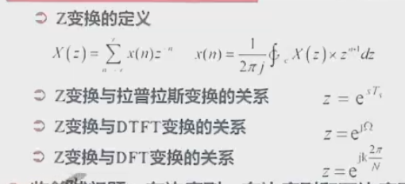

- 序 列 的 Z 变 换 和 理 想 抽 样 信 号 拉 普 拉 斯 变 换 的 关 系为

  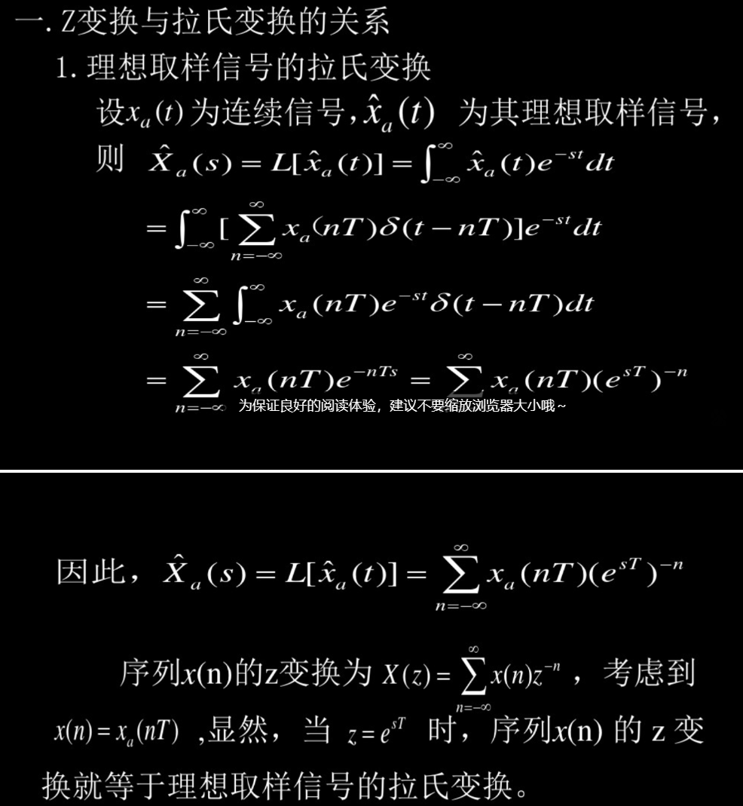

# Matlab

## 连续信号

- 冲激函数：*dirac（t)表示冲激函数，inf表示积分限无穷大*

- 积分：

  - `int` 是符号计算函数，它可以计算符号表达式的定积分。`int` 函数返回的结果是一个符号表达式，它可以是一个精确的解，也可以是一个无法进一步简化的符号表达式

  - `integral` 是数值计算函数，它使用数值方法（例如高斯-库特法）来近似计算定积分。`integral` 函数返回的结果是一个浮点数。

    总的来说，如果你的函数是一个符号表达式，你可能需要使用 `int` 函数。如果你的函数是一个函数句柄，你可能需要使用 `integral` 函数。

## 离散信号

- ```
  stem(X,Y) %做离散图
  ```

- ```
  conv(x,y) %做线性卷积
  ```

- ```
  ztrans(Y) %求z变换
  ```

- ```
  iztrans(Y) %求z反变换
  ```

## FFT

matlab中只有FFT的函数包，其他的需要自己编写

## 计时

`tic` 和 `toc` 是用来测量时间的。`tic` 开始计时，而 `toc` 停止计时并返回经过的时间（以秒为单位

```
tic
% 一些需要计时的代码
toc
```

## 噪声

`randn` 函数用于生成标准正态分布的随机数。`randn(n)` 会生成一个 n×n 的矩阵，其中的每个元素都是从标准正态分布（均值为 0，标准差为 1）中随机抽取的。

`xn=sin(0.2*pi*n)+randn(n);` 中，`randn(n)` 生成了一个噪声矩阵，然后将这个噪声添加到 `sin(0.2*pi*n)` 生成的信号上，从而得到了一个**带有噪声**的信号 `xn`。

栅栏效应

采样间隔多，信号的采样长度大，频率分辨率高——一般应用窗函数的方法，改善栅栏效应，如矩形窗，汉明窗等
