# Main Takeaway

[信号与系统漫谈](https://www.zhihu.com/column/c_1301456161237876736)

# 线性动态系统分析

## 线性动态描述与性质

### 系统性质

- 系统：一类信号到另一类信号的映射
  $$
  y(t)=G[u(t)]
  $$

- 线性系统：
  $$
  G[au_1(t)+bu_2(t)]=aG[u_1(t)]+bG[u_2(t)]
  $$

- 移位算子S：$S^{\tau}[u(k)=u(k-1)]$
- 截断算子：$\Pi_N[u(k)]=\left\{
  \begin{aligned}
  u(k), && k\le N \\
  0, && k>N
  \end{aligned}
  \right.
  $

- 线性时不变系统LTI：$G\cdot S=S\cdot G$

- 因果系统：$\Pi_N\cdot G\cdot (I-\Pi_N)=0$​

  > 因果系统的响应不会出现在输入信号激励系统的以前时刻。这意味着系统的输出仅与当前和过去的输入有关，而与将来的输入无关
  >
  > LTI独有：
  >
  > 

- > Notes:
  >
  > 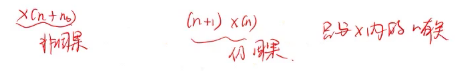

- 稳定：有限输入对应有限输出

  > 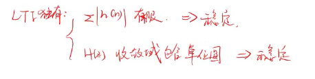

example:

### LTI系统描述

[信号与系统漫谈第12讲：线性时不变（LTI）系统的性质](https://zhuanlan.zhihu.com/p/548740075)

#### 卷积模型

LTI(linear time invariant)线性时不变系统，任何LTI都可以写成卷积的形式（其中G(n)是系统的单位冲激响应）
$$
\begin{aligned} y[n]&=\sum_{k=-\infty}^{+\infty} x[k] h[n-k]=x[n] * h[n] \\ y(t)&=\int_{-\infty}^{+\infty} x(\tau) h(t-\tau) d \tau=x(t) * h(t) \end{aligned} \\
$$
**LTI系统的输出是单位脉冲响应$h[n]/h(t)$的移位、加权、求和/积分**

事实上，一个**线性时不变系统**的特性可以**完全由它的单位脉冲响应决定**

#### 传递函数模型

传递函数：

任意离散LTI系统，零初始条件下，其输出信号的Z变换与输入信号的Z变换之比是系统**单位冲激响应**的Z变换
$$
G(z)=Z(g(n))=\frac{Y(z)}{X(z)}
$$
任意连续LTI系统，零初始条件下，其输出信号的Laplace变换与输入信号的Laplace变换之比是系统**单位冲激响应**的Laplace变换
$$
G(s)=L(g(t))=\frac{Y(s)}{X(s)}
$$

#### 定常系数常微分方程

对于一个连续时间的LTI系统，其定常系数常微分方程可以表示为：

$$\sum_{k=0}^{n}a_ky^{(k)}(t) = \sum_{k=0}^{m}b_kx^{k}(t)$$

其中，$y(t)$是系统的输出，$x(t)$是系统的输入，$a_i$和$b_i$是常数系数，$n$和$m$分别是方程中输出和输入的最高导数阶数。

对于一个离散时间的LTI系统，其定常系数差分方程可以表示为：

$$\sum_{k=0}^{N}a_ky(n-k) = \sum_{k=0}^{M}b_kx(n-k)$$

其中，$y[n]$是系统的输出，$x[n]$是系统的输入，$a_i$和$b_i$是常数系数，$n$和$m$分别是方程中输出和输入的延迟阶数。

#### 状态空间模型

对于连续时间的LTI系统，其状态空间模型可以表示为以下形式：

$$
\begin{aligned}
\dot{x}(t) &= Ax(t) + Bu(t) \\
y(t) &= Cx(t) + Du(t)
\end{aligned}
$$

其中，$x(t)$是系统的状态向量，$u(t)$是系统的输入向量，$y(t)$是系统的输出向量，$A$、$B$、$C$和$D$是系统的状态空间矩阵。

对于离散时间的LTI系统，其状态空间模型可以表示为以下形式：

$$
\begin{aligned}
x(n+1) &= Ax(n) + Bu(n) \\
y(n) &= Cx(n) + Du(n)
\end{aligned}
$$

其中，$x(n)$是系统在第$n$个时间步的状态向量，其他符号的含义与连续时间系统相同。

> 能控性，能观性

#### 模型之间的转化

- 状态空间与传递函数的转化：
  $$
  G(z)=C(zI-A)^{-1}B+D
  $$
  状态空间模型的ABCD非奇异变换不影响G(z)的表达（传递函数唯一，状态空间模型不唯一）

  > 因此可以将系数对角化后再来求（不是所有的都能对角化，最多[Jordan](https://zhuanlan.zhihu.com/p/470026382)）
  >
  > 很难求！

  $$
  g(n)=CA^{n-1}B \\ g(0)=D
  $$

- 状态空间和定常系数常微分方程的转化:

### LTI性质

- 记忆性：输出仅与当前时刻输入有关则无记忆性，否则有记忆性

  无记忆性：通常由代数方程描述

  有记忆性：通常可用微分方程或差分方程描述

- 因果性：与未来值无关

- 时变性：输出会和输入产生相同的平移则为时不变，$G\cdot S=S\cdot G$

- 可逆性：系统输入输出信号成一一对应的关系则为可逆（可逆系统）

- 稳定性：BIBO:bounded-input bounded-output有界输入有界输出稳定
  $$
  \exist{M},s.t. |x(t)|\le M \space for\space all\space t\in[0,\infty)
  $$
  定理1：若LTI系统的单位冲激响应为$g(t)$，则系统是BIBO稳定的充分必要条件
  $$
  \int_0^{\infty}|g(t)|dt<\infty
  $$
  定理2：若LTI系统的传递函数为$G(s)$​，则系统是BIBO稳定的充分必要条件
  $$
  G(s)是真有理分式且所有极点在左半平面
  $$
  

  状态空间模型判断稳定性：$G(z)$的特征方程即$|zI-A|=0$

  > 

  > 

  > 只用4次即可判断

## 线性系统的稳态响应

特定频率下求系统的稳态响应：

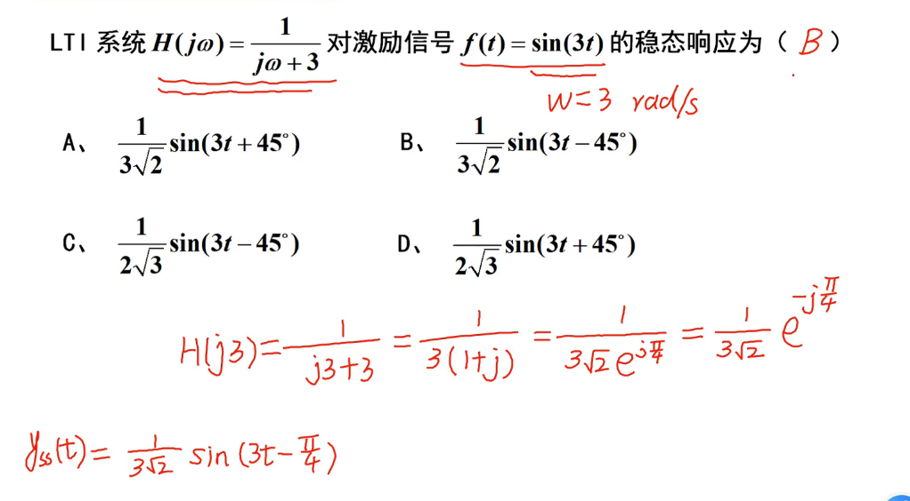

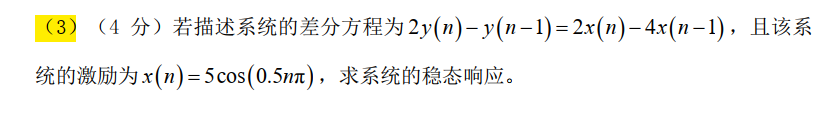

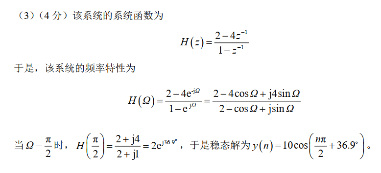

## 线性系统的时域分析

LTI系统响应＝零输入响应＋零状态响应

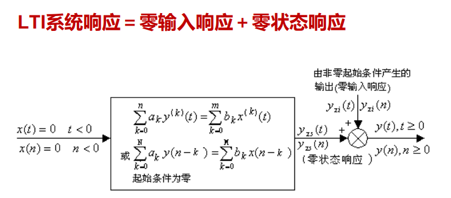

### LTI单位冲激响应

单位冲激响应$h(t)$形式与定常系数常微分方程n,m值密切相关

- $$
  n>m,h(t)=\sum_{i=1}^{n} A_ie^{\lambda_i t}u(t)
  $$

- $$
  n=m,h(t)=c\delta(t)+\sum_{i=1}^{n} A_ie^{\lambda_i t}u(t)
  $$

- $$
  n<m,h(t)=\sum_{j=1}^{m-n} c_j\delta^{(j)}(t)+\sum_{i=1}^{n} A_ie^{\lambda_i t}u(t)
  $$

## 线性系统的频域分析

零状态响应：零状态响应是系统的单位冲激响应和输入信号的卷积

### 频域响应

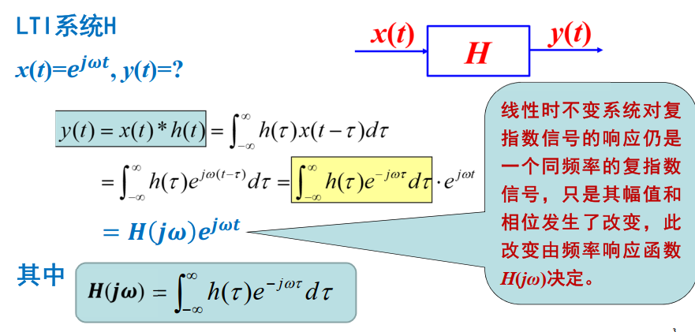
$$
H(j\omega)=\int_{-\infty}^{\infty}h(\tau)e^{-j\omega\tau}d\tau
,称为系统的频域响应
$$

> 和传递函数$H(s)$的关系就是将$j\omega换成s$​
>
> 离散的是$H(e^{j\omega})$

具有**滤波**的特性

> 仍然建议用laplace变换，傅里叶要求有收敛域

#### Bode图

$$
H(j\omega)=|H(j\omega)|e^{j\ang H(j\omega)}
$$

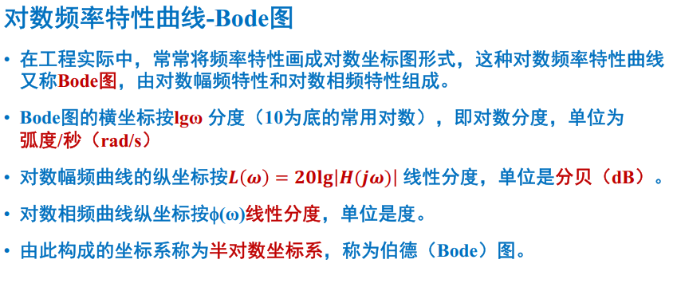

### 无失真传输

- **信号无失真传输**是实现信息可靠传送与交换的基本条件，它要求信号通过系统后，在时域上保持原来信号随时间变化的规律，即**信号的波形不变，而只能是幅度上对原信号按比例地放大或缩小，或者在时间上有一固定的延迟**

  频率响应函数：幅频是常数，相频是线性

### 理想低通滤波器

- 通带$\omega_c$
- 阻带

三种情况

#### FIR

[如何通俗易懂地理解FIR/IIR滤波器？](https://www.zhihu.com/question/323353814)

finite impulse response

### 系统辨识与逆滤波

- 系统辨识：对一未知系统，设计实验，由输入信号x(t)和输出信号y(t)得到系统模型

- 系统辨识频域方法：扫频得到$H(j\omega_i)$，求传递函数$H(j\omega)$

- 系统辨识时域方法：阶跃输入
- 最小二乘辨识：已知输入x(k) 和输出y(k), k=0,1,......。已知系统的差分方程结构，求差分方程系数,使得误差最小

- 逆滤波

  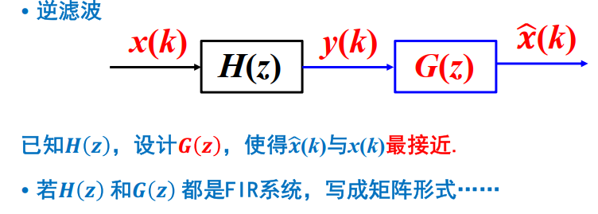

  最常见：
  $$
  \sum(\hat x(k)-x(k))^2
  $$
  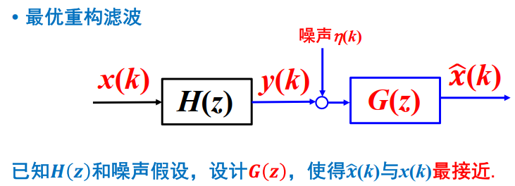

# 滤波器

DSP数字信号处理器(Digital Signal Processor)；数字信号处理(Digital Signal Processing)；数字信号处理技术

## 滤波器概述

消除或减弱噪声

模拟滤波器+数字滤波器

- 滤波原理：

  

- 滤波器分类

  - 经典滤波器：（假设）输入信号$x(n)$​中有用信号和希望去掉的信号有不同频带，滤波器滤掉无用信号

    

  - 现代滤波器：从含有噪声的数据（时间序列）中估计出信号的某些特征或信号本身。当信号被估计出后，被估计出的信号将比原信号有更高的信噪比。

### 技术指标

- 允许滤波器的幅频特性在通带和阻带有一定的衰减范围，且幅频特性在这一范围内允许有起伏。

  在通带和阻带之间有一定的过渡带

- 通带/阻带/过渡带

  

- 中心频率：$\omega_0=\frac{\omega_{c1}+\omega_{c2}}{2}$上下两个截止频率的集合平均值

- 通带波动$\Delta_{\alpha}$：在滤波器的通带内，频率特性曲线的最大峰值与谷值之差

- 相移$\phi$：输入和输出端的相位之差

- 群延迟$\tau$：又称为“包络延迟”，它是用相移$\phi$对于频率的变化律来衡量的
  $$
  \tau=-\frac{d\varphi(\omega)}{d\omega}
  $$

> $|H(0)|$假定已被归一化为1

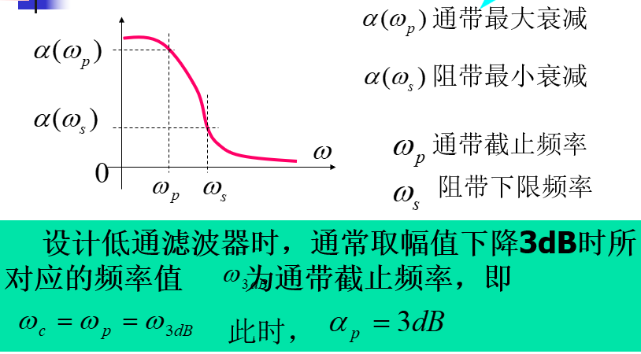

## 数字滤波器结构

结构图

- 直接型

  无限长

  

  有限长

  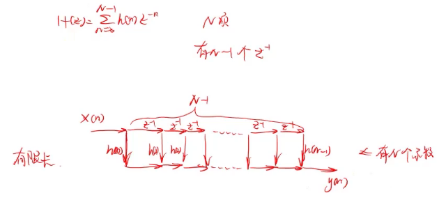

- 级联/并联型

  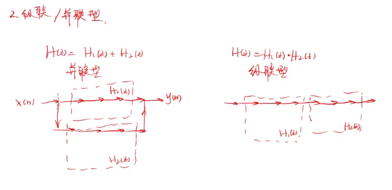

- 线性相位直接型

  [数字信号处理翻转课堂笔记20——FIR滤波器各种结构（直接型、级联型、线性相位结构、频率采样结构）_带通fir算术单元结构](https://blog.csdn.net/WM2101/article/details/128926527)

  

  > 线性相位响应意味着滤波器对输入信号的所有频率分量引入的相位延迟是相同的，并且与频率呈线性关系

- 频率采样型

  

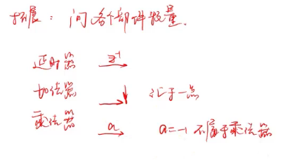

## 模拟滤波器设计

通带（Passband）和阻带（Stopband）

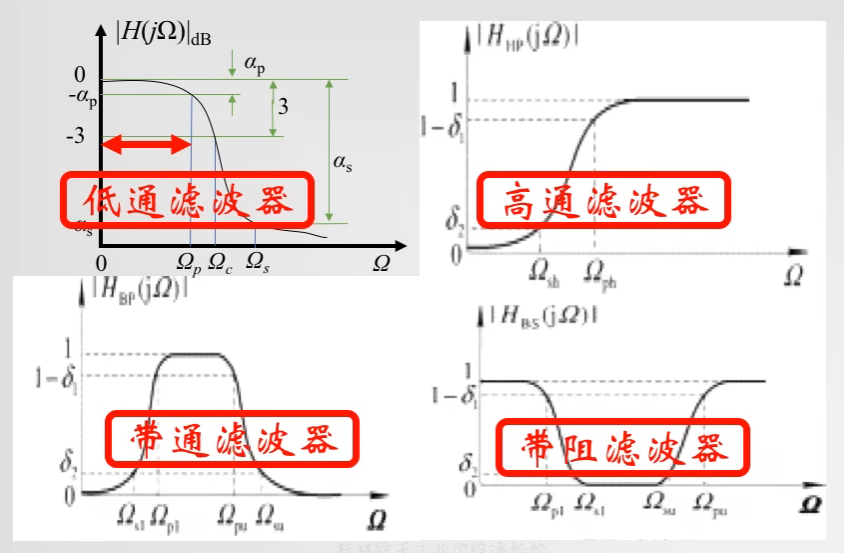

$$
\omega=2\pi f
$$

### 如何设计

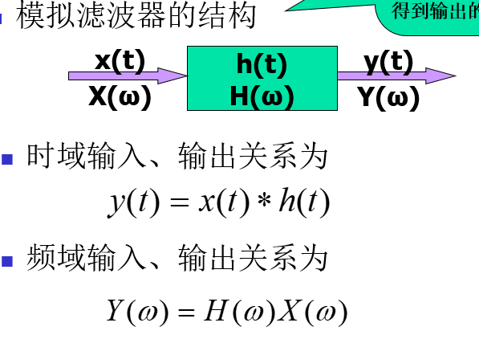

> 实际应用中，使模拟信号经带限滤波后再通过A/D变换完成采样与量化，此数字信号经数字滤波器实现信号处理的要求，将处理后的数字信号经D/A变换和平滑滤波得到输出的模拟信号。

设计模拟滤波器的中心问题：求出一个物理上可实现的传递函数H(s)

> 根据给定的性能指标，由幅度平方函数$|H(\omega)|^2$求出系统函数$H(s)$

必须满足的条件

- n是一个具有实系数的s有理函数；
- n极点分布在s的左半平面；
- 分子多项式的阶次必须不大于分母多项式的阶次

- > 除以上条件外，一般希望所设计滤波器的冲激响应h(t)为实函数

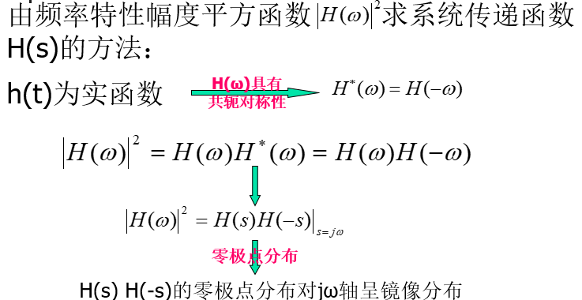

> 这些零极点中，有一般属于$H(s)$，另一半属于$H(-s)$

**根据H(s)的可实现条件和H(s) H(-s)的零、极点分布，可将给定的幅度平方函数以$-s^2$代替$ω^2$，确定H(s)与H(-s)的零、极点**

- nH(s)的极点必须位于s的左半平面， H(-s)的极点必须位于s的右半平面

- 

  > 要满足正实性要求，即系数不能有复数项，因此jw轴上的零点必须为偶阶重零点

> eg:
>
> 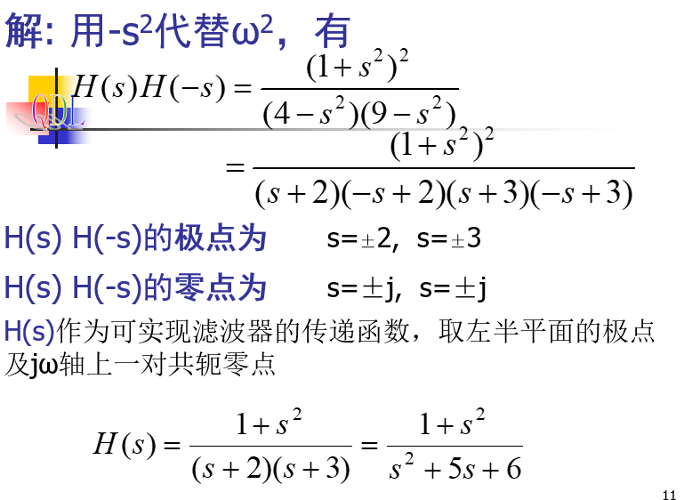
>
>

### 巴特沃思（Butterwoth）低通滤波器

#### Main Takeaway

巴特沃思低通滤波器是以**巴特沃思函数**作为滤波器的传递函数，该函数以最高阶泰勒级数的形式来逼近理想矩形特性——最大平坦幅值滤波器

巴特沃斯滤波器通带最平坦，阻带下降慢

> 坏处：在通带内误差分布不均匀，靠近频带边缘误差最大，当滤波器阶数*n* 较小时，阻带幅频特性下降较慢，与理想滤波器的特性相差较远。若要求阻带特性下降迅速，则需增加滤波器的阶数，设计该滤波器时所用元器件数量增多，线路也趋于复杂。

#### 幅频特性

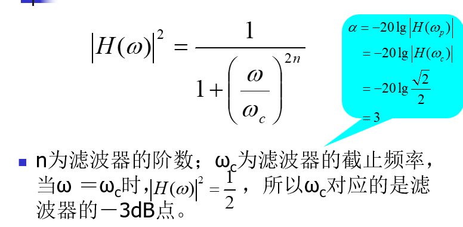

N是滤波器的阶数，从幅度平方函数可以看出，N阶滤波器有2N个极点，而且这2N个极点均布在一个圆上，圆的半径为，称之为Butterworth圆

分布间隔为$\frac{\pi}{n}$

在工程设计中常用**衰减函数**来描述滤波器的幅频特性

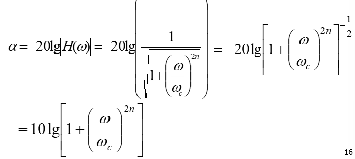

#### 设计

[什么是巴特沃斯滤波器](https://zhuanlan.zhihu.com/p/580306412)

[巴特沃斯数字低通滤波器的设计步骤_数字低通滤波器设计](https://blog.csdn.net/handsome_for_kill/article/details/119851844)

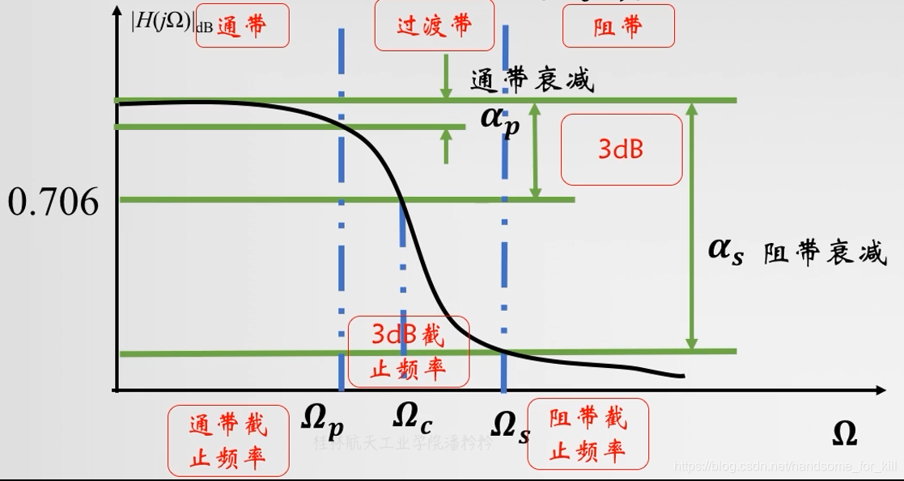

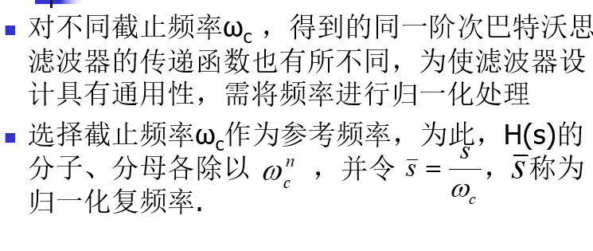

> 滤波器中通带截止频率、阻带截止频率和3dB截止频率之间有什么联系和区别
>
> 联系和区别
>
> - **联系**：在许多情况下，通带截止频率和3dB截止频率是相同的。特别是对于理想化的低通和高通滤波器，通带截止频率通常被定义为增益降低3dB的频率。因此，这两个概念在实际应用中经常被交替使用。
> - **区别**：通带截止频率和阻带截止频率描述了滤波器在通带和阻带中的不同性能。通带截止频率关注的是滤波器在传递范围内的性能，而阻带截止频率关注的是滤波器对特定频率范围的抑制程度。3dB截止频率则是一个具体的技术指标，用于衡量滤波器在通带截止频率处的增益降低程度。

设计步骤：

1. 确定阶数N：

   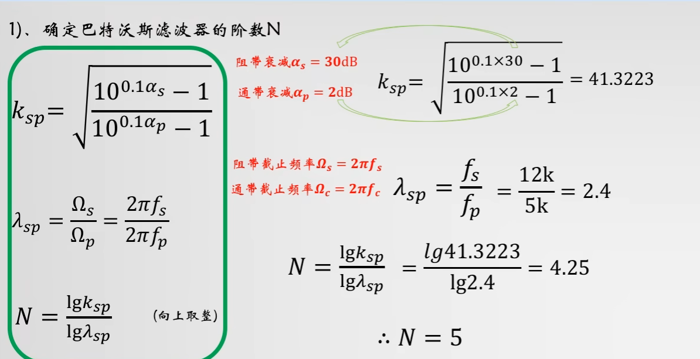

   > 以下面这个求n的公式为主

   

2. 根据N查表得到模板系统函数

3. 求3dB截止频率$\Omega_c$​

4. 令$P=\frac{s}{\Omega_C}$代入$G_a(p)$得到$H_a(s)$即为所求滤波器的传递函数——反归一化处理$s=\bar s \omega_c$

查表——设计出来的都是模板

#### 零极点分布

**巴特沃思低通滤波器的零极点分布**——全极点型

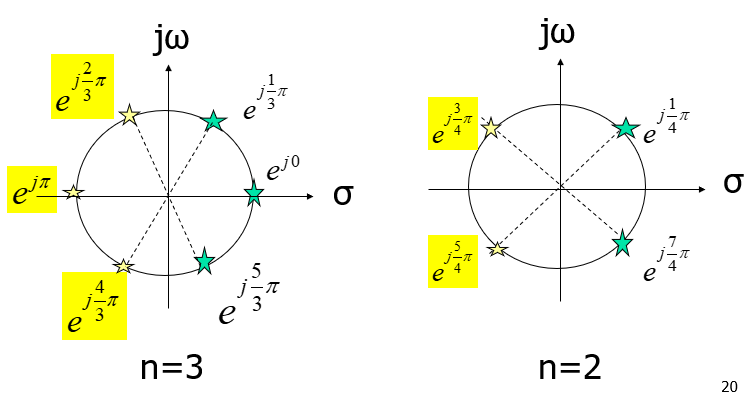

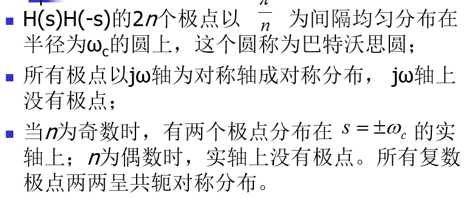

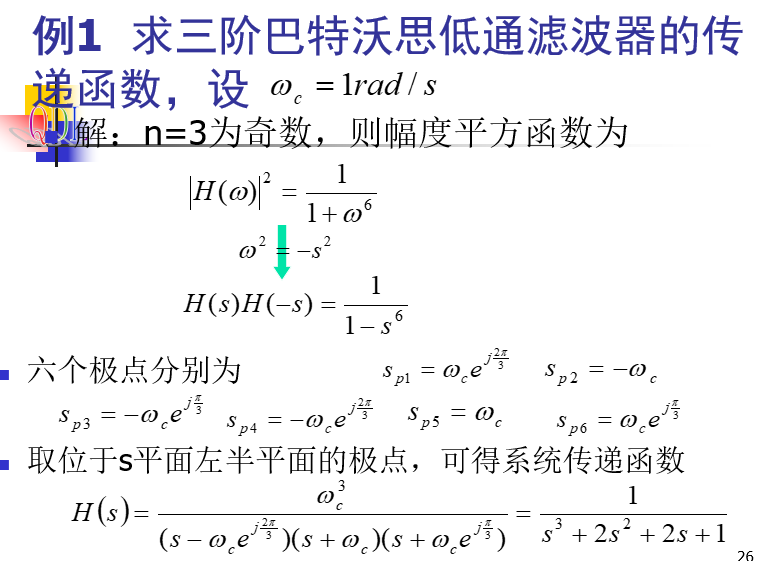

### 切比雪夫滤波器

#### Main Takeaway

切比雪夫滤波器是由切比雪夫多项式的正交函数推导出来的，采用了在通带内等波动，在通带外衰耗单调递增的准则去逼近理想滤波器特性

- 在通带内是等波纹的，在阻带内则是单调下降的，称为切比雪夫Ⅰ型。

- 在通带内是单调的，在阻带内是等波纹的，称为切比雪夫Ⅱ型。

  > 仅一个带会出现波纹

切比雪夫滤波器通带等纹波，阻带下降较快。

> 若将误差均匀地分布在通带内，就可以设计出阶数较低的滤波器。这种误差均匀分布的办法可通过选择具有等波纹特性的逼近函数来完成

#### 幅频特性

> 滤波器阶数*n*为通带内等幅波动的次数，即等于通带内最大值和最小值的总数

- 确定技术指标

  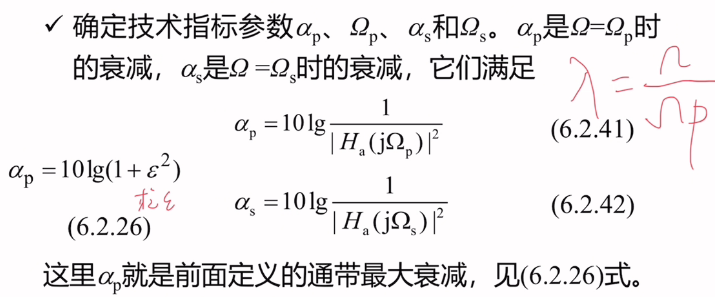

  Ⅰ型切比雪夫滤波器有三个参数需要确定：波动系数ε，通带截止频率$ω_c$和阶数*n*。通带截止频率一般按照实际要求给定； ε表示通带内最大损耗，由容许的通带最大衰减$\alpha_{max}$​确定。

  

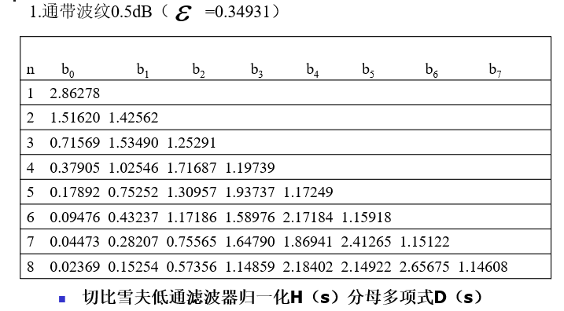

#### 设计

[数字滤波器的设计方法及步骤详解_三通道示波表及信号源滤波怎么弄](https://blog.csdn.net/zhouxinlin2009/article/details/81214823)

1. 确定技术指标

   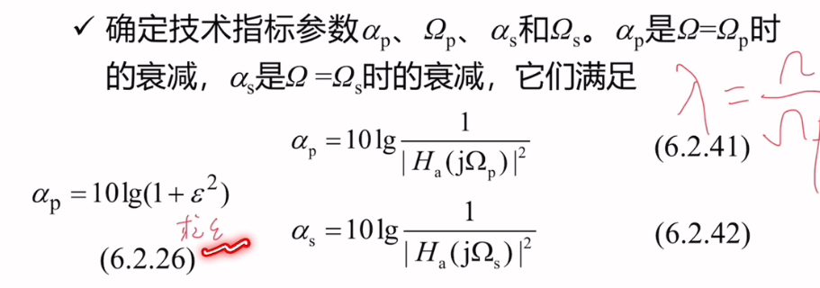

2. 求滤波器的阶数N和参数$\epsilon$​

   

   

   

3. 归一化系统函数$G_a(p)$——一般查表得

   

4. 将$G_a(p)$去归一化，得到实际的$H_a(s)$​

   > $p=s/\Omega_c$

   

5. $\Omega_c$范围

   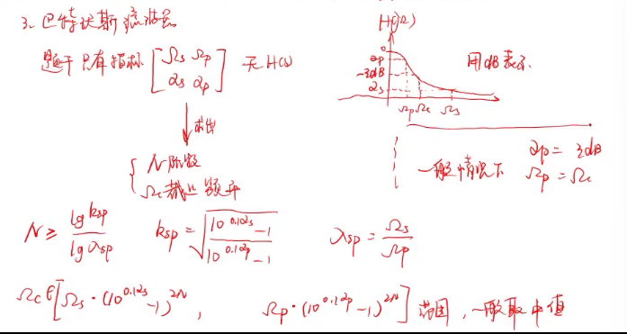

> example:
>
> 
>
> 先转化为技术指标
>
> 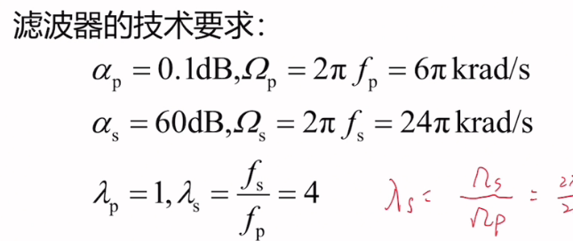
>
> 求N和$\epsilon$
>
> 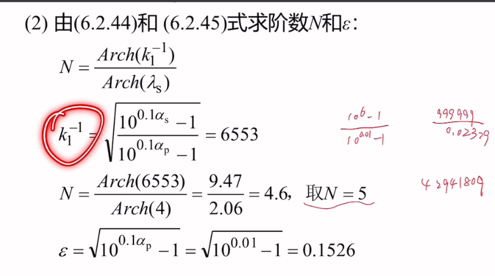
>
> 得到$G_a(p)$
>
> 
>
> 将$G_a(p)$去归一化
>
> 

### 贝赛尔(Bessel)滤波器

贝赛尔(Bessel)滤波器是具有最大平坦的群延迟(线性相位响应)的线性过滤器。贝赛尔滤波器常用在音频天桥系统中。模拟贝赛尔滤波器描绘为几乎横跨整个通频带的恒定的群延迟，因而在通频带上保持了被过滤的信号波形。贝塞尔(Bessel)滤波器具有最平坦的幅度和相位响应。带通(通常为用户关注区域)的相位响应近乎呈线性。Bessel滤波器可用于减少所有IIR滤波器固有的非线性相位失真。

贝塞尔滤波器通带等纹波，阻带下降慢。也就是说幅频特性的选频特性最差。但是，贝塞尔滤波器具有最佳的线性相位特性。

### 椭圆滤波器

### 模拟滤波器的频率变换

#### Main Takeaway

在实际工程中，需要设计高通、带通和带阻滤波器时，通常是将设计好的低通滤波器，如巴特沃思低通滤波器或切比雪夫低通滤波器等，在传递函数H(s)中通过频率变换，转换成为其他类型的滤波器。

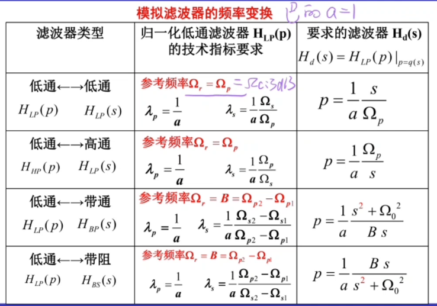

#### 低通到高通

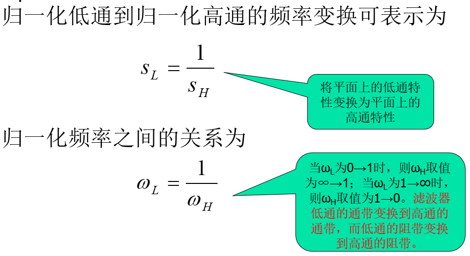

> 当低通特性变换为其它特性时，其衰减幅度与波动值均保持不变，仅仅是相应的频率位置产生了变换

> example:
>
> 
>
> 
>
> 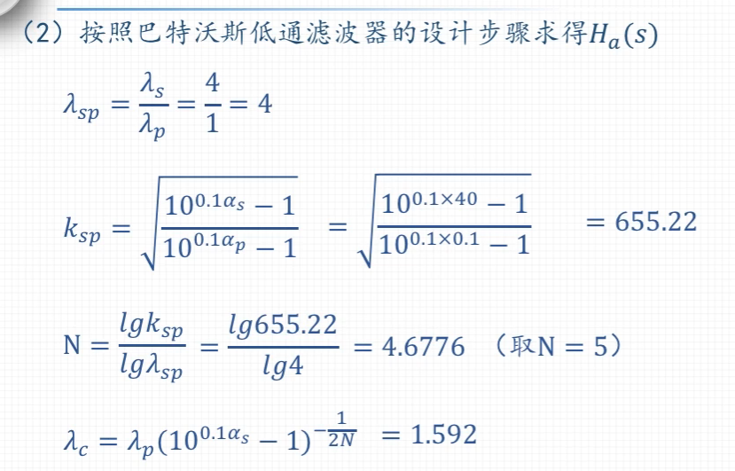
>
> 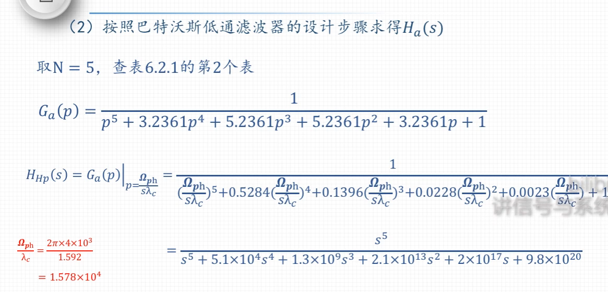

#### 低通到带通

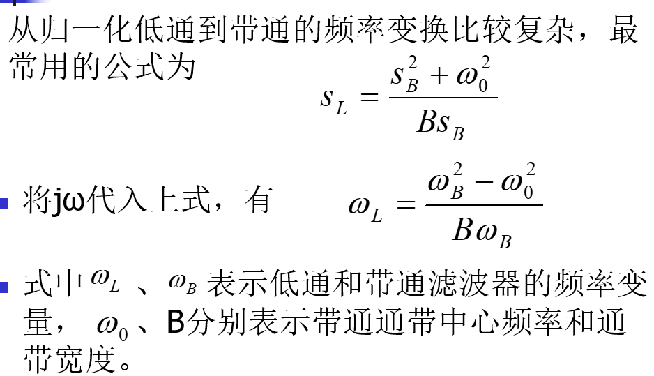

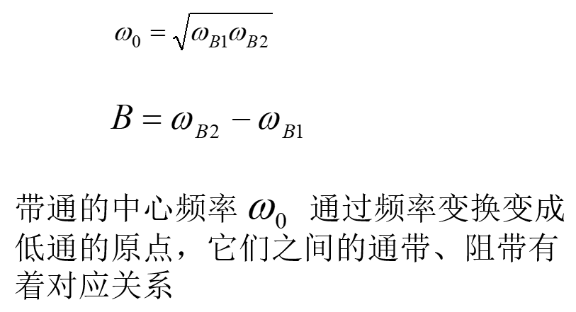

> example:
>
> 
>
> 
>
> 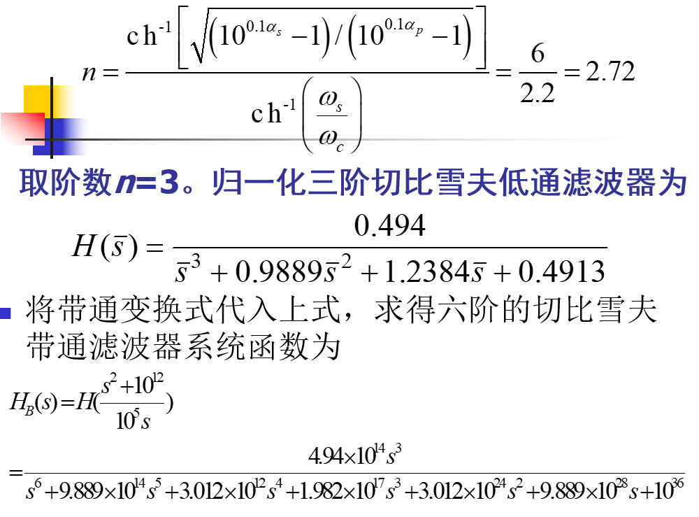

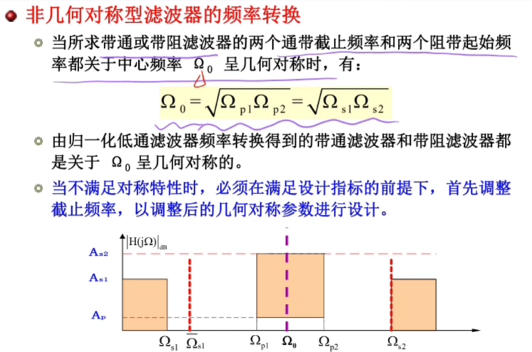

不对称需要调整一下：

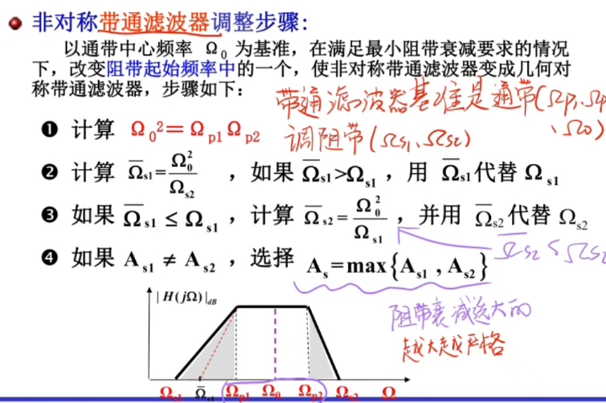

> 腰越陡越好，用陡的来替换

#### 低通到带阻

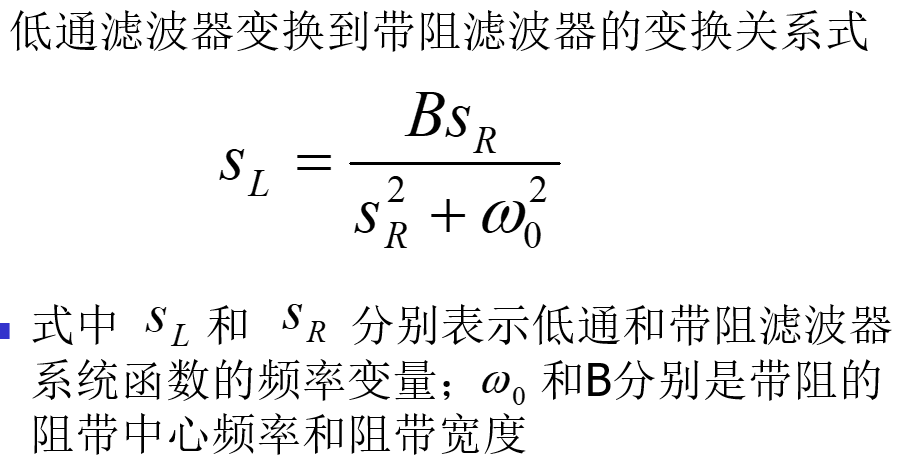

## 吉布斯现象

吉布斯(Gibbs)现象：将具有不连续点的周期函数（如矩形脉冲)进行傅立叶级数展开后，选取有限项进行合成。当选取的项数越多，在所合成的波形中出现的峰起越靠近原信号的不连续点。当选取的项数很大时，该峰起值趋于一个常数，大约等于总跳变值的9%

> 实际中的信号采样系统只能采样一定的频率范围，对不连续信号（或有无穷频率成分的信号）采样将会存在**频率截断**。
>
> - Gibbs 现象的产生有两个条件：(1) 对信号频谱的锐截止；(2) 原信号存在跳变点

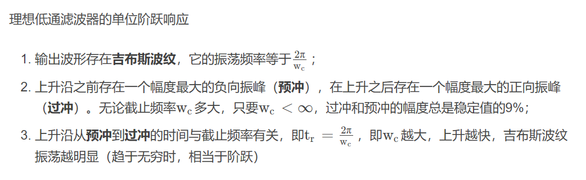

增加窗函数的宽度不能减少过冲值（8.95%不变），但能减小过渡带宽度

## 数字滤波器设计

### Main Takeaway

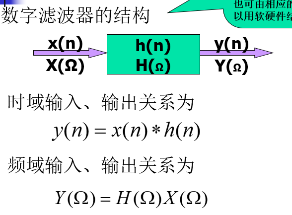

> 数字滤波器：滤波器的输入、输出都是离散时间信号时，该滤波器的冲激响应也必然是离散的——输入输出都是数字信号
>
> 数字滤波器既可由硬件（延迟器、乘法器和加法器）实现，也可由相应的软件实现，还可以用软硬件结合来实现。

### 模拟滤波器到数字滤波器的转换

#### 模拟高通滤波器到数字高通滤波器的转换

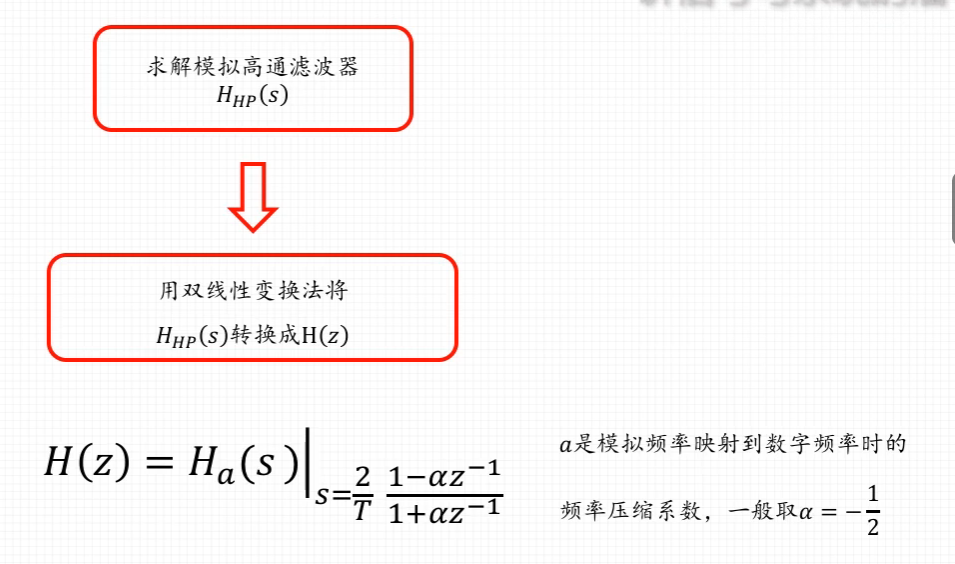

### IIR

无限冲激响应（IIR）数字滤波器

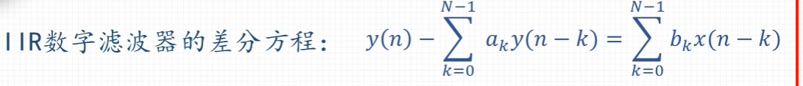

> 有反馈，无限

> 按其冲激响应的时间特性分类

- 设计任务：用具有无限多个单位冲激响应的有理函数逼近给定的滤波器幅频特性

- 设计方法

  - 直接法

  - 间接设计法

    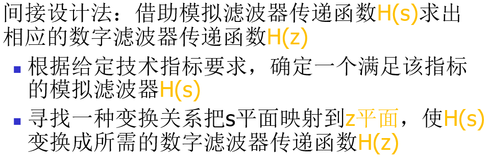

    

    > 为什么要使数字滤波器保持模拟滤波器的特性，保持什么特性？
    >
    > 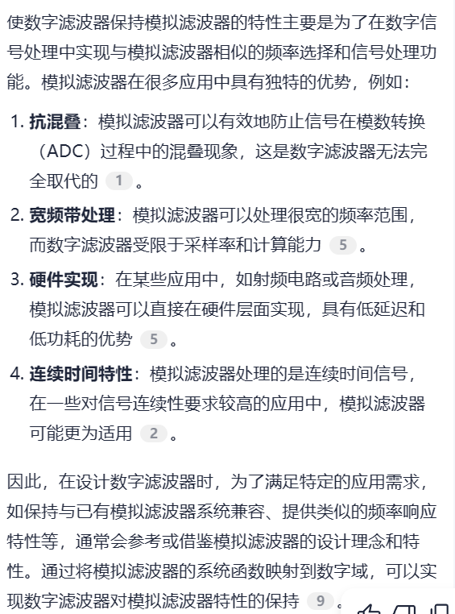

#### 冲激响应不变法

需要遵循的准则：**使数字滤波器的单位脉冲响应等于所参照的模拟滤波器的单位冲激响应的采样值**
$$
h(n)=h(t)\space |_{t=nT}
$$

1. 根据滤波器技术指标确定模拟滤波器$H(s)$

2. 经过拉式反变化求出单位冲激响应$h(t)$​

   > 先写成部分分式的形式

3. 再由单位冲激响应不变的原则，经采样得到$h(n)$

4. 做$h(n)$的Z变换，最后得出数字滤波器$H(z)$​

> 后面两步可用下面方法直接跳过

冲激响应不变法的原理就是把$H(s)$部分分式展开式中的$\frac{1}{s-p_i}$代之以$\frac{1}{1-e^{p_i T}z^{-1}}$​，即可**直接**得出数字滤波器的传递函数$H(z)$

其中T为采样周期=$\frac{1}{f_s}$

> example:
>
> 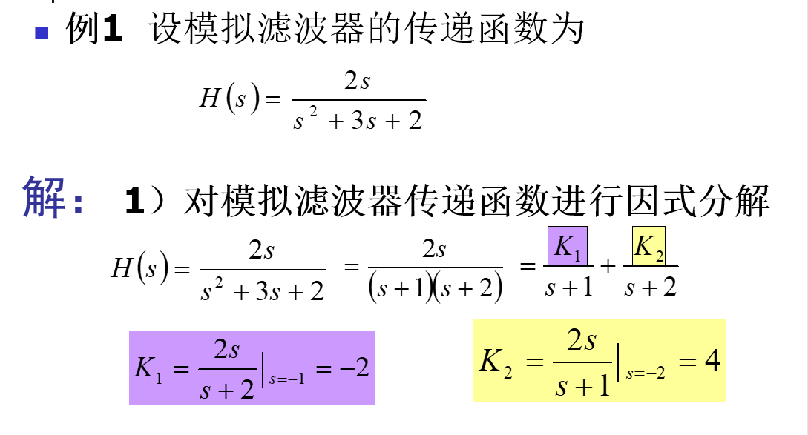
>
> 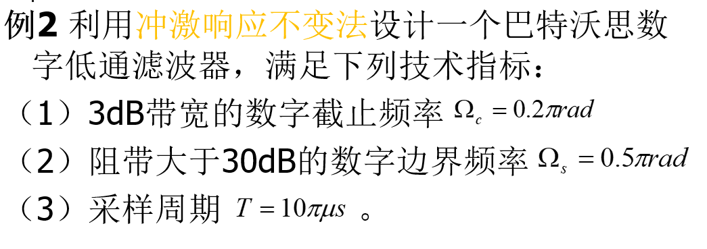
>
> 
>
> 
>
> 

坏处：具有混叠现象

##### 频域对应关系

具有混叠现象，在一定范围内当成线性


#### 双线性变换法

具有混叠现象——双线性变换法是消除混叠现象的一种方法

> 最普遍，最有效

$$
z=\frac{1+\frac{T}{2}s}{1-\frac{T}{2}s}
$$

$$
H(z)=H(s)|_{s=\frac{2}{T}\frac{1-z^{-1}}{1+z^{-1}}}
$$


##### 基本设计思想

- 按给定技术指标设计模拟滤波器
- n将这个模拟滤波器的系统传递函数H(s)，通过适当的变换，把无限宽的频带变换成有限宽频带的系统函数$H(\hat s)$​
- 将$H(\hat s)$进行常规Z变换，求得数字滤波器的传递函数H(z)


> 直接一步到位

$$
z=\frac{1+\frac{T}{2}s}{1-\frac{T}{2}s}
$$

坏处：不再保持线性相位特性

> example:
>
> 
>
> 
>
> 
>
> 

##### 频域对应关系

将无穷远映射到$\pi$处，变为周期

#### IIR数字滤波器的网络结构


- 直接型

  

  

  

  > 先实现极点部分，后实现零点部分

- 级联型

  

  > 有利于调节需要控制的零极点

- 并联型

  

> example:
>
> 
>
> 

#### 做题

- 先设计模拟滤波器，两种方法代入公式

  先将数字指标转换为模拟指标（双线性变换法：预畸变）

  预畸变：$\Omega=\frac{2}{T}\tan{\frac{\omega}{2}}$

  

  

- 两种方法的区别

  冲激响应不变法：会混叠，无法设计高通和带阻

  

- 巴特沃斯<切比雪夫<椭圆

  相同指标下，设计阶数递减，后面的设计方法更优

### FIR

最少阶数=零点个数+1

FIR滤波器得阶数的确实：根据系统中延迟器的个数决定

#### Main Takeaway

有限冲激响应（FIR）数字滤波器

> 无反馈，输入停止则输出停止

IIR数字滤波器的传递函数是一个具有零点和极点的有理函数，IIR系统存在稳定性问题，而且其相频特性一般情况下**都是非线性的**。而许多信号处理系统，为了使信号传输时在通带内不产生失真，滤波器必须具有线性的相频特性，FIR数字滤波器就能够很容易获得严格的线性相频特性。

- 设计目标

  

- FIR原理

  

#### 线性相位性质


滤波器分类：


$$
H(e^{j\omega})=H_g(\omega)e^{j\theta \omega}
$$

线性相位FIR滤波器是一类滤波器，其特点是在通过滤波器后，信号的相位响应保持线性不变。


> M=点数N-1

偶对称对应严格线性相位


零点性质：


#### 窗函数法


$$
h(n)=h_d(n)w(n)
$$

> 滤波器的频率响应表示滤波器对不同频率的输入信号的处理能力。它描述了滤波器在频域中对输入信号的幅度和相位的影响。具体来说，频率响应可以告诉我们滤波器对不同频率的信号会进行多少的放大或衰减，以及是否会引入相移。

窗函数设计线性相位FIR步骤


$$
h_d(n)=\left\{
\begin{array}{**lr**}
\frac{\sin[\omega_c(n-\tau)]}{\pi(n-\tau) }&& n\ne\tau \\
\frac{\omega_c}{\pi} && n=\tau

\end{array}
\right.
$$

> example:
>
> 
>
> 
>
> 
>

见书上例题——查表选择窗函数

#### 模块法

#### 频率采样法

#### 等波纹优化设计法

#### FIR滤波器的网络结构


> example:
>
> 
>
> 

#### 做题

- 线性相位性质

  

- 窗函数法
  $$
  h_d(n)=\left\{
  \begin{array}{**lr**}
  \frac{\sin[\omega_c(n-\tau)]}{\pi(n-\tau) }&& n\ne\tau \\
  \frac{\omega_c}{\pi} && n=\tau

  \end{array}
  \right.
  $$
  

  

  根据过渡带计算N：

  

  

  

  增加窗函数的宽度：

  

- 频率采样法

  

### FIR和IIR的比较

- IIR数字滤波器的设计利用了模拟滤波器设计的成果，计算工作量小，设计方便，采用双线性变换法时没有频谱混叠现象。

- IIR数字滤波器的传递函数是一个具有零点和极点的有理函数，IIR系统存在稳定性问题，而且其相频特性一般情况下都是非线性的。而许多信号处理系统，为了使信号传输时在通带内不产生失真，滤波器必须具有线性的相频特性，FIR数字滤波器就能够很容易获得严格的线性相频特性。

- FIR滤波器的冲激响应是有限长的，其系统函数是一个多项式，它所包含的极点都位于原点，因而该滤波器一定是稳定的。

- FIR数字滤波器可用FFT实现，大大提高滤波器的运算效率。

- FIR滤波器的主要缺点是：要充分逼近锐截止滤波器，则要求FIR滤波器有较长的冲激响应序列*h*（*n*），也就是*N*值要大，运算量也大大增加


> FIR一般非递归/非反馈；IIR一定有反馈
>
> FIR可以用计算机辅助计算；IIR只能用模拟滤波器去实现

# Bonus

- 栅栏效应：离散谱的谱线旨在$f=1/t_p$的整数倍位置上才出现，实际信号可能被挡住而损失

  

- 高分辨率谱和高密度谱

  - 高分辨率谱是增加信号采样的记录时间tp（即增加采样点）

    - DFT频谱分辨率**改变采样点数N**即可改变——减小栅栏效应

  - 高密度谱是通过在时域补零得到

    - 当频谱分辨率一定时，在**时域信号的尾部补零**，可以得到高密度DFT频谱，这样可以更加细化当前分辨率下频谱密度，但是不能改变频谱的分辨率

      > 频谱密度：频谱密度是指信号在频域中的能量分布情况
      >
      > 如同概率密度函数，你只有求那一点附近一小段频率内与频谱密度函数形成的**面积**值才有意义，才表示了信号在那一频率点的幅度

  - 

    > 补零后高密度谱幅值将因为其他部分能量的占用产生衰减

- 最小相位系统：[当我们谈“最小相位系统”时究竟在谈什么?](https://zhuanlan.zhihu.com/p/108053853)

  > 最小相位系统是指对于一定的幅频特性，其相移为最小的系统。换句话说，在保持相同幅频响应特性的前提下，最小相位系统的相位绝对值较非最小相位系统为小。从数学角度来看，一个稳定的线性时不变系统，**如果其在复平面右半平面没有零点，则该系统为最小相位系统**。最小相位系统通常具有更快的响应速度和更好的稳定性。
  >
  > 最小相位系统具有最短的响应时间

- 几种频率

  

$$
T=\frac{1}{f_s}
$$
