# Main Takeaway

MIT 18.085 Computational Science and Engineering I

这是一门关于**如何计算解的课程**

三大主题

1. 一些工程和物理上涉及的矩阵
2. 微分方程（偏微分+常微分），方程组
3. 傅里叶变换

<!--more-->

# 1. Applied Linear Algebra

> 18.085仅有1.1和4.1的pdf

## 1.1 Four special matrices

FOUR SPECIAL MATRICES：$K_n,C_n,T_n,B_n$

- $K_n$ Toeplitz matrix   invertible  fixed-fixed

  

  - symmetric  对称的

  - sparse  

  - tridiagonal  三对角

  - constant diagonals  

  - $K^{-1}$ is symmetric but not sparse

    一般不是算行列式来判断是否可逆，What we actually do is to go ahead with the elimination steps that solve Ku = f.   ——消元然后看对角线

  - positive definite  正定

- $C_n$ Circulant matrix  not invertible  ——循环，periodic problem

  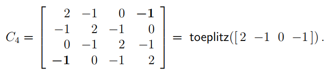

- $T_n$ changing $K_n$ to $T_n$  free-fixed

  The (1, 1) entry in Tn is changed from 2 to 1:  

  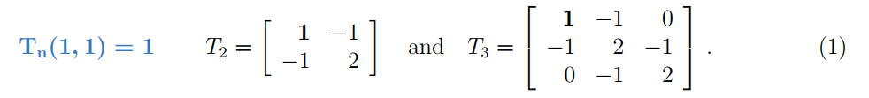

  Two elimination steps reduce T to the upper triangular U.  

- $B_n$ Changing $T_n$ to $B_n$  not invertible  free-free

  The fourth family Bn has the last entry also changed from 2 to 1  

  

- $K,T$ are positive definite

- $C,B$ are positive semidefinite

> pivots主元全为正数即为PD

## 1.2 Differences, derivatives, and boundary conditions

> 这节介绍如何从一个微分方程得到一个可以解决的离散问题
>
> - Differences 差分

$$
-\frac{d^2 u}{dx^2}=f(x),for~~ u(0)=0,u(1)=0
$$

which solution is :
$$
u(x) = -\frac{1}{2}x^2+\frac{1}{2}x
$$
key：用差分方程代替微分方程

> 一阶有不同的差分方法：通常是antisymmetric
>
> 
>
> 前向(upwind)/后向(downwind)/中心(centered)
>
> local error / truncation error 局部误差/截断误差——泰勒展开来求

then we get 
$$
\frac{-u_{i+1}+2u_{i}-u_{i-1}}{(\Delta{x})^2}=f(x_i)
$$
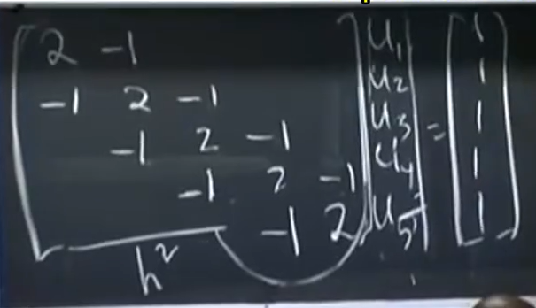

左右被边界限制
$$
Ku=f
$$
如果我们修改边界条件$u(0)=0\to \frac{du}{dx}(0)=0$

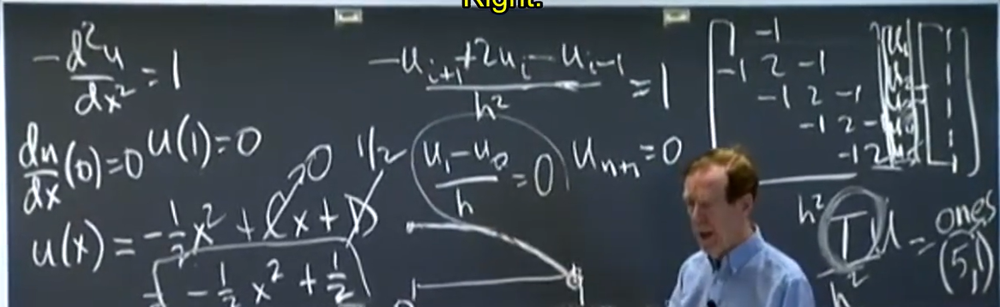

we get ——这里用$\frac{u_1-u_0}{h}=0$来描述这个条件
$$
Tu=f
$$

> ifnite element method

## 1.3 Elimination leads to K = LDL^T

> how to solve $Au=b$   for big linear system

- backslash : $u=A\backslash b$
- sparse: reorder rows
- big: conjugate gradients共轭梯度
- multi grid 
- Incomplete LU

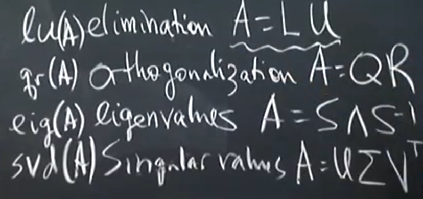

- $A=LU=LDL^T$,D is symmetric

  
  $$
  U=DL^T
  $$

## 1.4 Inverses and delta functions

> Delta Function Day

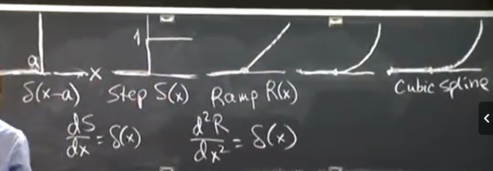

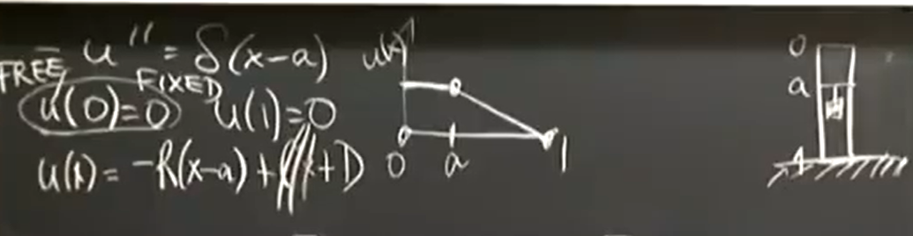

考虑离散情况

Green function

## 1.5 Eigenvalues and eigenvectors

$Ay=\lambda y$,$\lambda$ maybe be a complex number
$$
\sum \lambda_i = trace(A),\prod \lambda_i=det(A)
$$
三个步骤来使用这些特征值

1. 先将初值条件分解成特征值的和，得到每个系数
2. 然后分别计算每个部分，即跟踪每个eigenvectors
3. 将每个部分相加

> 可能没有足够多的特征值
>
> 多重特征值：$te^{\lambda t}$来代替

一些特征值和特征向量的性质

对称的矩阵的特征向量是orthogonal正交：$y_i^T y_j =0$，$Q^TQ=I$

inner product内积
$$
K=Q\Lambda Q^T
$$
$\sin x$与$\sin{2x}$正交
$$
-\frac{d^2 y}{dx^2}=\lambda y(x)
$$

## 1.6 Positive definite matrices

PD 与寻找最小值密切相关

PD的性质：

saddle point鞍点

$$
cond(k)=\frac{\lambda_{max}}{\lambda_{min}}
$$

## 1.7 Numerical linear algebra: LU, QR, SVD

- $A=LU$

- $A=QR$

- $A=U\Sigma V^T,U~ and ~ V$正交矩阵，Σ 是对角线上为奇异值的对角矩

  **奇异值**（Singular Value）是矩阵在奇异值分解（SVD）中的一个重要概念，它代表了矩阵在不同正交方向上拉伸或压缩的幅度

  - **应用**：SVD 在数据降维、图像压缩和推荐系统等领域有重要应用。通过保留较大的奇异值，可以实现对数据的近似表示。
  - **性质**：介绍了 SVD 的唯一性和稳定性等性质，以及如何利用 SVD 求解线性方程组和最小二乘问题。

## 1.8 Best basis from the SVD

2. 最佳基的概念

- **数据表示**：在许多应用中，我们希望用一组基向量来表示数据，使得数据的表示尽可能简洁和准确。
- **最佳基**：最佳基是指能够最大程度地捕捉数据中重要信息的基向量集合。通过选择合适的基向量，可以实现数据的降维和压缩。

3. SVD 与最佳基

- **左奇异向量**：SVD 中的左奇异向量（即矩阵 U 的列向量）可以被视为数据的最佳基。这些向量是正交的，并且按照对应奇异值的大小排序，奇异值越大的向量越重要。
- **数据投影**：通过将数据投影到左奇异向量上，可以得到数据的低维表示。这种表示能够最大程度地保留数据中的重要信息，同时去除噪声和冗余信息。

4. 应用示例

- **图像压缩**：以图像压缩为例，介绍了如何利用 SVD 找到图像的最佳基，并实现图像的压缩。通过保留较大的奇异值和对应的左奇异向量，可以实现对图像的近似表示，同时大大减少数据的存储空间。
- **数据降维**：以主成分分析（PCA）为例，介绍了如何利用 SVD 实现数据的降维。通过选择前 k 个最大的奇异值和对应的左奇异向量，可以将原始数据投影到一个 k 维的子空间中，从而实现数据的降维。

# 2. A Framework for Applied Mathematics

2.1 Equilibrium and the stiffness matrix

## 2.2 Oscillation by Newton's law

oscillation振荡

我们要考虑accuracy, stability,speed(of calculation)

- solve by eigenvectors
  $$
  Mu\prime\prime+Ku=0
  $$
  look for $u(t)=(\cos{\omega t})x$

  generalized eigenvalue problem

- solve by finite differences

  对于上述方程我们要采用差分的方法来求解，将$u\prime\prime$换为二阶差分，接下来我们要考虑$u$使用哪个时刻的$u$——涉及stability

  

  - Forward Euler

  - Backward Euler

    

    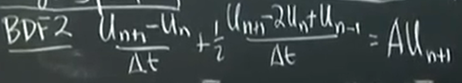

  - trapezoidal method梯形法

    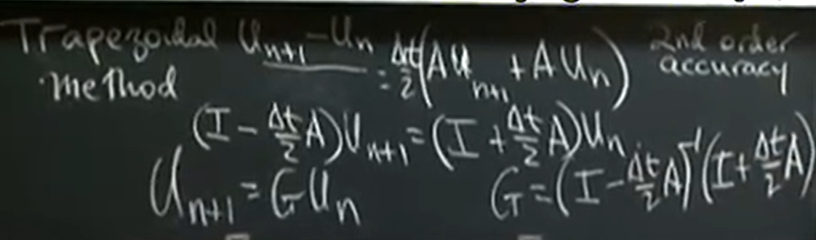

## 2.3 Least squares for rectangular matrices

Least squares——too many equation
$$
Au=b,A=m\times n~ where ~ m>>n
$$
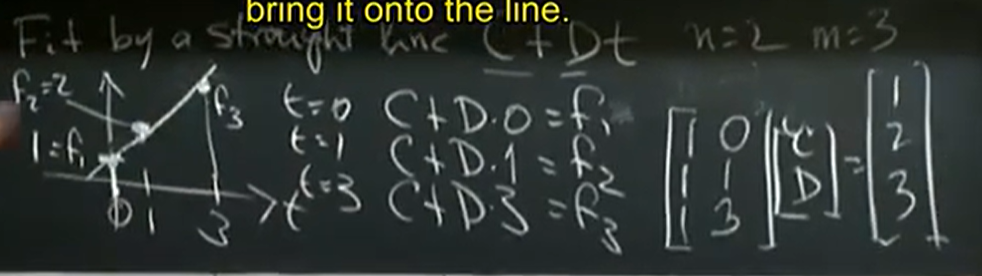
$$
\min_u ||Au-b||_2^2
$$

$$
A^TAu=A^Tb
$$

projection投影，$A^TA$是一个$n\times n$的方阵

A的列形成了列空间，如果b在列空间上则可以直接计算，如果不行则投影得到$\hat p =A\hat{u}$，两者之间的差就是e垂直于列空间——$A^Te=0$

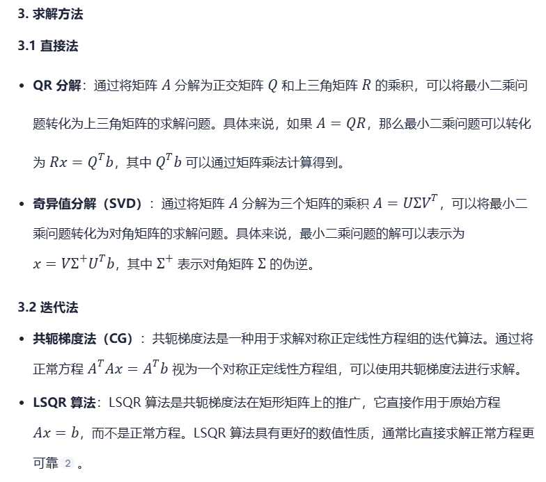

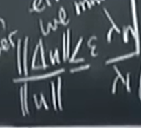

## 2.4 Graph models and Kirchhoff's laws

trusses

$A_{5\times 4}= incidence~matrix$

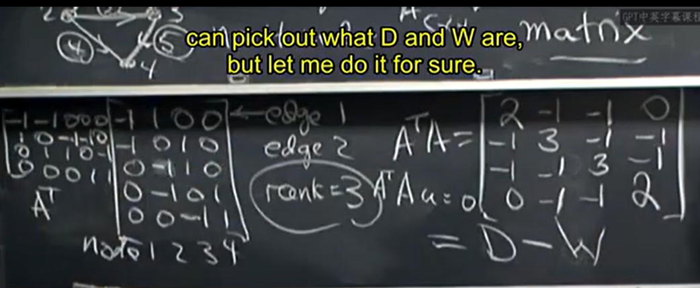

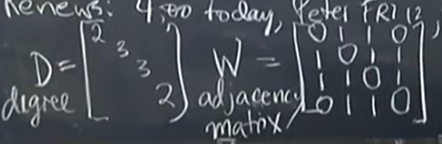

2.5 Networks and transfer functions

2.6 Nonlinear problems

2.7 Structures in equilibrium

2.8 Covariances and recursive least squares

2.9 Graph cuts and gene clustering

# 3. Boundary Value Problems

3.1 Differential equations of equilibrium

## 3.2 Cubic splines and fourth order equations

fourth order equations：beam（受到负荷会弯曲）
$$
u\prime\prime\prime\prime=\delta(x-a)
$$
cubic spline三次曲线：because上述式子，仅在$x=a$发生突变

iterpolation

3.3 Gradient and divergence
3.4 Laplace's equation

## 3.5 Finite differences and fast Poisson solvers

## 3.6 The finite element method

$$
(\frac{d}{dx})^T=-\frac{d}{dx}
$$

**finite element**

weak form of the diff equation

=$U^T KU$

对于两边相等的函数，左右同时乘上一个测试函数积分仍然相等；反过来就得for any v(x)左右相等才能得到两个函数相等

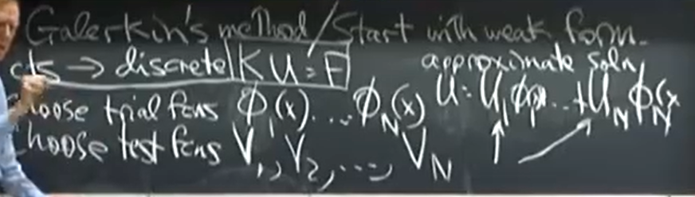

 [有限元法（Finite Element Method，FEM）原理详解](https://blog.csdn.net/weixin_44333889/article/details/127024369)

利用weak form fcn来近似计算，使用很多简单的局部函数作为$trail/test~ fcn$常常让两者相等

> u写成trail fcn的线性组合，test fcn是上述的$v(x)$用来作为weak form fcn的测试

对于课上介绍的例子，我们得到其有限元系统$Ku=f$

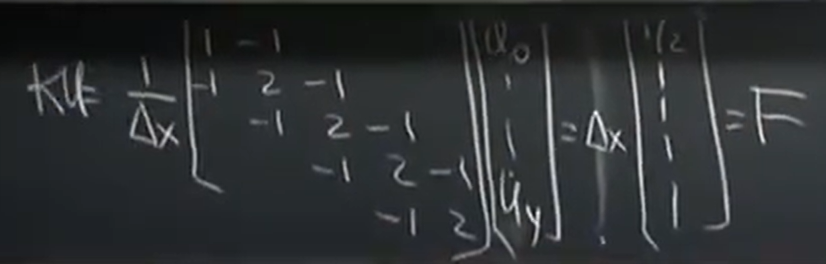

> 很像有限差分，但是有所不同 

**element matrices**

整个大区间可以划分为小的部分然后拼接起来

3.7 Elasticity and solid mechanics

# 4. Fourier Series and Integrals

4.1 Fourier series for periodic functions
4.2 Chebyshev, Legendre, and Bessel
4.3 The discrete Fourier transform and the FFT
4.4 Convolution and signal processing
4.5 Fourier integrals
4.6 Deconvolution and integral equations
4.7 Wavelets and signal processing

5. Analytic Functions:

5.1 Taylor series and complex integration
5.2 Famous functions and great theorems
5.3 The Laplace transform and z-transform
5.4 Spectral methods of exponential accuracy

6. Initial Value Problems:

6.1 Introduction
6.2 Finite difference methods for ODEs
6.3 Accuracy and stability for u_t = c u_x
6.4 The wave equation and staggered leapfrog
6.5 Diffusion, convection, and finance
6.6 Nonlinear flow and conservation laws
6.7 Fluid mechanics and Navier-Stokes
6.8 Level sets and fast marching

7. Solving Large Systems:

7.1 Elimination with reordering
7.2 Iterative methods
7.3 Multigrid methods
7.4 Conjugate gradients and Krylov subspaces

8. Optimization and Minimum Principles:

8.1 Two fundamental examples
8.2 Regularized least squares
8.3 Calculus of variations
8.4 Errors in projections and eigenvalues
8.5 The Saddle Point Stokes problem
8.6 Linear programming and duality
8.7 Adjoint methods in design.

# References

- book : Computational Science and Engineering
  - Author: [Gilbert Strang](https://www.cambridge.org/md/universitypress/subjects/mathematics/computational-science/computational-science-and-engineering?format=HB&isbn=9780961408817#bookPeople), Massachusetts Institute of Technology
