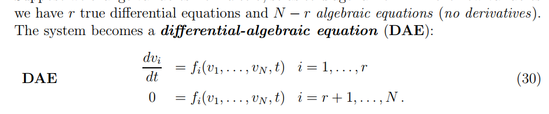
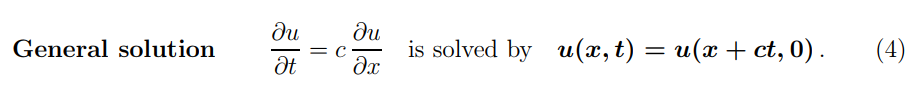
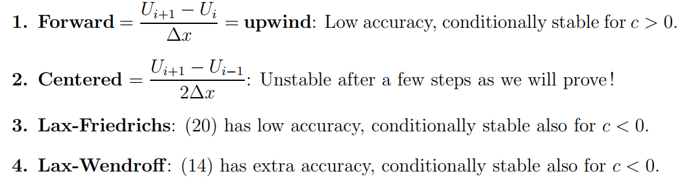
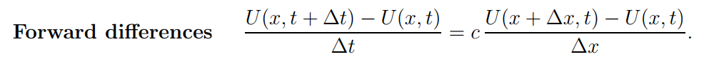

# Main Takeaway

MIT 18.086 Mathematical Methods for Engineers II

<!--more-->

三大主题

- differential equations. That start from initial values.
- how do you solve a large linear system ax equal b?
- optimization, minimization

> stability and convergence success——Lax Equivalence Theorem, stability and convergence

# Initial-value problems

## Finite Difference Methods

**ODE的差分方法及其精确性、稳定性、收敛性**

Difference Methods for Ordinary Differential Equations

$$
u_i\prime = f_i(u,t),u\prime=Au
$$

> A是Jacobian matrix，$A_{ij}=\frac{\partial f_i}{\partial u_j}$

So we know of course the solution, it's an exponential e to the at times u0 the initial bunch——我们清楚它的解，下面用来测试不同的方法：(先介绍一些先验知识)

> - explicit method：T(n+1)时刻的值由T(n)时刻决定，也就是说当前时刻的值由上一时刻的值决定。(可能和$y_{n-i}$均有关)
>   $$
>   y_{n+1}=y_n+hf(t_{n},y_{n})
>   $$
>
> - implicit method：T(n+1)时刻的值不光由T(n)时刻决定，还由当前时刻T(n+1)决定。也就是说当前时刻的值由上一时刻和当前时刻的值共同决定
>   $$
>   y_{n+1}=y_n+hf(t_{n+1},y_{n+1})
>   $$
>

> - nonstiff(explicit) differential equation
>   $$
>   u\prime = -4u
>   $$
>   nonstiff方程对于大多数数值方法在常规步长下是稳定的，且显式方法通常足够高效。且解是accurate
>
> - stiff(implicit) differential equation
>
>   常出现在速率有较大动态变化范围或者ill conditioned matrix
>
>   it estimate,not compute隐式方法慢，步长要非常小
>
>   **慢速变化的解与快速变化的邻近解**：所求解缓慢变化，但附近有快速变化的解，因此数值方法必须采取小步长以获得满意的结果
>
>   > 没有标准来区分stiff and nonstiff
>
>   So it's this constant trade-off of speed versus stability
>
> - 根据不同性质选择不同求解器[Stiff Diferential Equations - Moose W. Oler的Github博客 (moosewoler.github.io)](https://moosewoler.github.io/自己个的学报/2014/04/17/Stiff_Differential_Equations.html)

左右两列分别代表这些方法属于explicit method or implicit method

| non-stiff         | stiff                        |
| ----------------- | ---------------------------- |
| Euler             | Backward Euler               |
| Adams-Bashforth   | Adams-Moulton                |
| Runge-Kutta ODE45 | backwards differences ODE15S |

针对这些方法So this is what's coming: a construction of methods, what **stability** is about and what's **convergence**.

- Euler(Forward Euler): first order method

  first **stability**
  $$
  \frac{u_{n+1}-u_{n}}{\Delta t}=f(u_n,t_n)=au_n
  $$

  $$
  u_{n+1}=(1+a\Delta t)u_n=(1+a\Delta t)^nu_0
  $$

  so the critical value(临界值) assign a is negative, to be stable we want $|1+a\Delta t|\le 1$

  then we consider the **convergence**(推导过程没写了)

  assume DE as discretization error
  $$
  E_N< \frac{T}{2}\Delta t ||u\prime\prime||_{max}
  $$
  that`s why we call it the first order method

- Backward Euler
  $$
  \frac{u_{n+1}-u_{n}}{\Delta t}=f(u_{n+1},t_{n+1})=au_{n+1}
  $$

  $$
  (1-a\Delta t)u_{n+1}=u_n
  $$

  $$
  u_n=(\frac{1}{1-a\Delta t})^n u_0
  $$

  没有critical value，就是stable

  > 但是代价是解$\frac{u_{n+1}-u_{n}}{\Delta t}=f(u_{n+1},t_{n+1})$这个方程，难解

  > u for true solution and U for approximation

- trapezoidal梯形(Crank-Nickolson):second-order method implicit

  梯形积分：
  $$
  \frac{u_{n+1}-u_n}{\Delta t}=\frac{1}{2}(f_{n+1}+f_{n})
  $$

  $$
  \int_a^bf(x) = \frac{b-a}{2n}(f(x_0)+2\sum_{i=1}^{n-1} f(x_i)+f(x_n))
  $$

  still use $u\prime = au$，we get $\frac{|1+\frac{a}{2}\Delta t|}{|1-\frac{a}{2}\Delta t|}\le 1$ always **stable** for all a<0

  then the convergence:泰勒展开求差得到DE，

  

- Adams-Bashforth: second-order method explicit
  $$
  \frac{u_{n+1}-u_n}{\Delta t}=\frac{3}{2}f_{n}-\frac{1}{2}f_{n-1}
  $$

  $$
  y_{n+1} = y_n + \frac{h}{24} \left( 55f_n - 59f_{n-1} + 37f_{n-2} - 9f_{n-3} \right)
  $$

  其中，$( y_n )$是当前点的值，$( f_n )$是当前点的函数值，$( h )$是时间步长

  > 1. **数值稳定性**：Adams-Bashforth算法对初始条件的选择和时间步长的大小非常敏感。
  > 2. **精度限制**：对于某些类型的非线性方程，算法可能无法达到所需的精度。
  > 3. **计算复杂度**：随着问题的规模增加，计算复杂度也会增加，可能导致计算效率降低。

- Adams-Moulton

- **Runge-Kutta**: It gets to Un plus 1. But it's explicit.

  So that's a sort of one compound step ——每阶都是一组方法

  思想[常微分方程算法之龙格-库塔法（Runge-Kutta法](https://blog.csdn.net/L_peanut/article/details/137336203)

  - for p=2
    $$
    \frac{u_{n+1}-u_n}{\Delta t}=\frac{1}{2}(f_{n}+f(u_n+\Delta f_n,t_{n+1}))
    $$

  - p=4 is famous

  ODE45：4阶Runge-Kutta——好用：It slows down or speeds up. It speeds up when it can, it slows down when it has to

- **backwards differences** ODE15S:second-order method

  it will vary delta t. It was will vary the order. So if has to slow down, it may slow. And if things are happening too quickly, it may change to a low order, safe, secure method
  $$
  \frac{3u_{n+1}-4u_n+u_{n-1}}{2\Delta t}=f(u_{n+1},t_{n+1})
  $$

  

- DAE(differential algebraic equation)

  

## Accuracy and Stability for $u_t=cu_x$

Initial-value problems for partial differential equations.  PDE

按照以下步骤逐步推导

- solution for $u(x,0)=e^{ikx}$

- solution for every $u(x,0)=e^{ikx}$

  

- Finite Difference Methods for  $u_t=cu_x$

  

  - Accuracy of the Upwind Difference Equation

    
    $$
    r=\frac{c\Delta t}{\Delta x}\le1, courant~~ number
    $$

  - centered

  - Lax-Wendroff

    

  - Lax-Friedrichs

- Equivalence of Stability and Convergence

  

  

  

- The Rate of Convergence

## 波动方程和冯·诺依曼稳定性

## lec3:单向波动方程和CFL/冯·诺依曼稳定性

## lec4:波动方程解法的对比

## lec5:二阶波动方程（包括蛙跳法）###热传导方程和对流扩散

## lec6:波形图、热传导方程/点源

## lec7：热传导方程的有限差分

## lec 8:对流扩散/守恒定律

## lec9：保护法/分析/冲击

## 守恒法//震荡

## lec 10:来自点源的冲击

## lec 11:水平集方法

# 大型线性系统求解

## 重排消元法

### lec 12:微分方程中的矩阵

### lec13:稀疏矩阵：重排消元法

### lec14:金融数学/布莱克-舒尔斯方程

## 迭代法

### lec15:选代方法和预条件

### lec16:稀疏系统的通用方法

### lec17:多重网格法

### lec 18:克雷洛夫法／多重网格法续

### lec19:共轭梯度法

### lec 20:快速泊松求解器

## 最优化

### lec21:带约束的最优化

### lec22:加权最小二乘

### lec23：变化微积分/弱形式

### lec24:误差估计/投影(Projections)

### lec 25: 鞍点 / Inf-sup 条件

### lec26:两个平方／等式约束Bu=d

### lec 27:惩罚项正则化 lec 28:线性规划和对偶

### lec29：对偶难题/反问题/积分方程

# References

- [Lecture 1: Difference Methods for Ordinary Differential Equations | Mathematical Methods for Engineers II | Mathematics | MIT OpenCourseWare](https://ocw.mit.edu/courses/18-086-mathematical-methods-for-engineers-ii-spring-2006/resources/lecture-1-difference-methods-for-ordinary-differential-equations/)
- HW [Course 18.086: Mathematical Methods for Engineers II (mit.edu)](https://math.mit.edu/classes/18.086/2006/)
