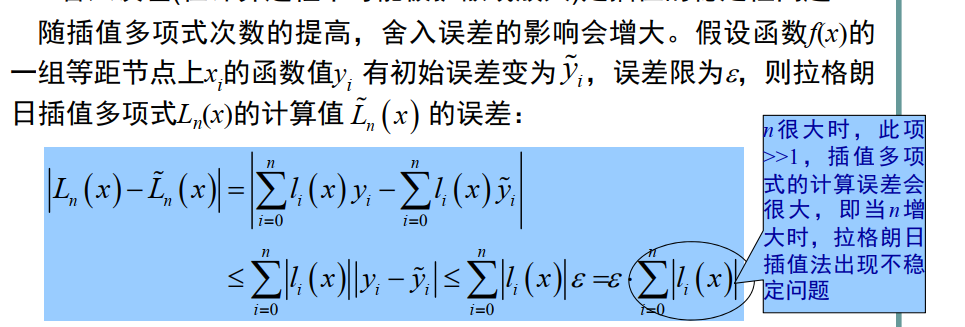
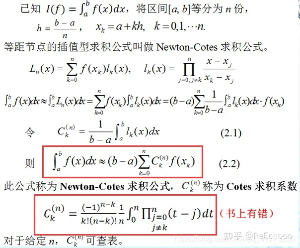
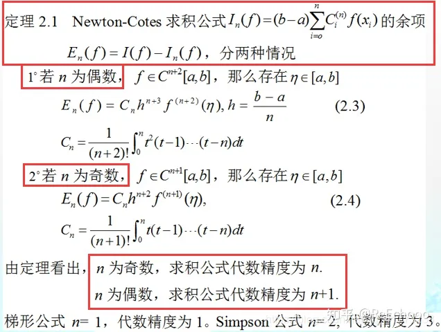
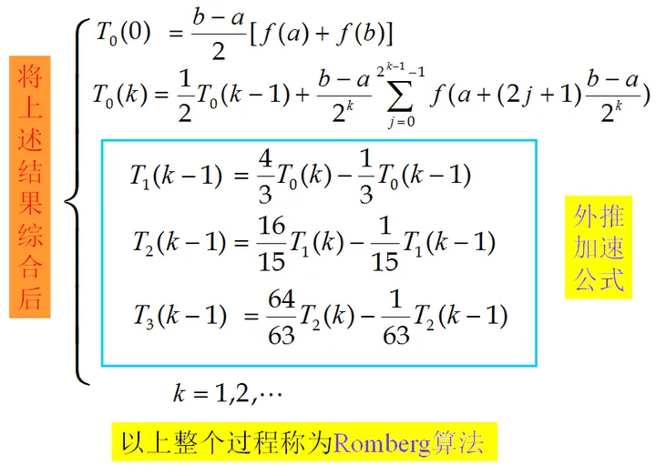
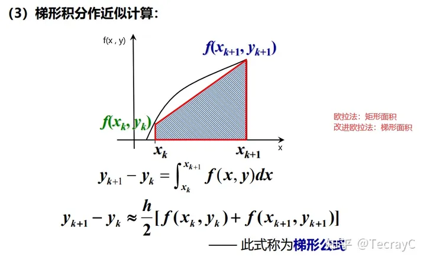
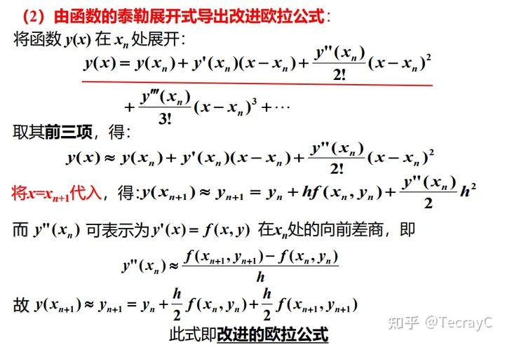

# Main Takeaway

数值计算方法——Numerical Method

只包括一部分经典的方法

<!--more-->

# Tips

当今科学研究的三种基本手段  ：理论研究+实验+科学计算

找助教

- 李骋鹏： 19357574236， 505613673@qq.com

- 邱宇超： 13506173138， 22260150@zju.edu.cn

- 刘镇铤： 15336505755， liuzhenting@zju.edu.cn


上机作业简单分析即可

# 绪论

得到满足精度要求的近似解（不是解析解）

误差是人们用来描述数值计算中近似解的精确程度

## 误差种类

- 舍入误差（round-off error）：由于计算机受机器字长的限制，只能表示有限位数的值而引起的

  > 浮点表示法$r=m\cdot b^e，尾数m要进行归一化处理(保存更多有效数字)$$\frac{1}{b}\leq|m|<1,(2进制则b=2)$​
  >
  > 因为归一化，在0与第一个正数之间存在一个“洞”  

- 截断误差（truncation error）：在数值运算中运用近似方法表示准确数值运算或数量而引起的

  > eg：微分（向前差商），积分，无穷级数等，无限项表示，但计算时只取前面有限项

- 不与数值方法本身直接相关的误差：模型/观测/过失误差

- 量化误差：无理数以及不与该集合中的有理数都不可能准确地表示  

## 误差评判方式

- 绝对误差：
  $$
  |E|=|x-x`|\leq\delta,\delta称为(绝对)误差限
  $$
  
- 相对误差：
  $$
  \epsilon=\frac{x-x`}{x}*100\%,|\epsilon|\leq\delta_r相对误差限
  $$

- 有效数字：按四舍五入（近似数末位的半个单位）

  

- 迭代方法的误差估计：基于前一近似值基础
  $$
  \epsilon_a=\frac{当前近似值-前一近似值}{当前近似值}*100\%
  $$
  采用绝对值，判断是否小于虚线设定好的容限$\epsilon_s$
  $$
  |\epsilon_a|<\epsilon_s
  $$

  > 如果$\epsilon_s=(0.5*10^{2-n})*100\%$则可以保证至少n位有效数字是正确的

> 避免大数和小数相加/减性抵消（两个几乎相等的浮点数相减时所引起的舍入误差）
>
> 拖尾效应——正负交替级数

## 误差的传播与估计

$\Delta f(\tilde x)=|f(x)-f(\tilde x)|$

- 单变量函数：一阶误差传播：$\Delta f(\tilde x)\cong|f\prime(\tilde x)||x-\tilde x|$​

- 多变量函数；

  

- 一般传播关系

  

## 泰勒定理

泰勒定理表明：任何光滑的函数都可以用多项式来逼近

泰勒级数的多项式逼近


逼近误差：
$$
R_n=\frac{f^{n+1}(\xi)}{(n+1)!}h^{n+1}\rightarrow R_n=O(h^{n+1})
$$

> 截断误差与步长的n+1次方成正比


## 算法的数值稳定性

- 稳定性：一个算法如果原始数据有误差，而在计算过程中误差不增长，则称此算法是数值稳定的；否则，若误差增长，则称算法是不稳定的(numerically unstable)，即输入值的不确定性通过数值方法在总体上是放大的

- 条件数：f(x)与x的相对误差之比$|\frac{\tilde xf\prime(\tilde x)}{f(\tilde x)}|$​

  > 大于1，则被放大了


# 非线性方程求根

图解法

增量搜索：从端点x=a出发，按预定步长h一步步地向右跨，每跨一步进行一次根的“扫描”，检查函数f(x)和f(x+h)的值是否同号

> 计算端点的一阶导数值

多项式求根——矩阵特征值求解，很高效

## 收敛阶


## 二分法

首先确定有根区间，将区间二等分，通过判断f(x)的符号，逐步将有根区间缩小，直至有根区间足够地小，便可求出满足精度要求的近似根  
$$
|x_k-x*|\leq\frac{b-a}{2^k}<\epsilon
$$

> 精确倒小数点后3位，即要求$|x_k-x*|<\frac{1}{2}\cdot10^{-3}$

迭代次数：$k>(ln(b-a)-ln\epsilon)/ln2$

优缺点：总是收敛；收敛速度慢

## 试位法

二分法进阶，false position

基本思想：零点与离0进的那个端点近——取两端点连线与x轴相交的点作下一次迭代的点

一个划界点保持不动可能导致很差的收敛性，特别当函数有很大曲率情况下

改进：检测一个边界是否固定不变（计数器记录一下）；如果出现这种情况，将停滞的边界点处的函数值变为原来的一半

> 利用先验知识

## 不动点迭代

不动点迭代，简单定点迭代， Fixed-point Iteration  

$$
f(x)=0\rightarrow x=g(x)
$$

$$
x_k=g(x_{k-1})
$$

> $x_n$是构造的一个迭代序列


- 存在性和唯一性：


> 选择不同的迭代函数g(x) ，就会产生不同的序列，且这些序列的收敛情况也不会相同  (如何选择？)


- 不动点定理：

吸引不动点和排斥不动点


> 求近似相对误差：relerr=err/(abs(P(k))+eps);%加一个eps防止/0  

- 收敛性

线性收敛，迭代速度不快

[一般迭代法（二）| 迭代法的收敛速度（收敛阶）+收敛过程的加速（Aitken加速法）_埃特金加速公式-CSDN博客](https://blog.csdn.net/SanyHo/article/details/106365225)


## Newton-Raphson方法

基本思想：将非线性方程线性化——也是一种迭代法，切线近似代替曲线

优点：在单根附近具有较高的收敛速度(二次收敛)，重根还是线性收敛

缺点：要求导；重根线性收敛；初值选取很敏感需要接近真解（！先用其他算法获取一个近似解再用该方法）


$$
x_{i+1}=x_i-\frac{f(x_i)}{f\prime(x_i)}
$$

- 终止条件：$\epsilon_a=|\frac{x_{i+1}-x_i}{x_{i+1}}|*100\%$

- 误差分析

  

  

> 要注意检查；确定迭代上限；判断f(x)=0的概率

- 针对重根的改进

变换为$u(x)$，根相同，重根变单根，再用NR；单根直接用NR


## 割线法

正割法， Secant Method


按照迭代顺序取代

改进：

两个初始值不易获取时？通过独立变量的微小增量来估计  


# 求解线性方程组的数值方法

$$
AX=b
$$

方程类型：

- 恰定方程： m=n，且A非奇异（$detA\neq 0$），方程组有唯一解
- 欠定方程： m<n
- 超定方程： m>n

系数矩阵A有三类：

- 低阶稠密矩阵——直接法

- 大型稀疏矩阵（矩阵中0元素较多）——迭代法

- 三对角矩阵（非0元素集中于主对角线及相邻两对角线上）——直接法

数值解法：

- 直接法：直接算，精确解，可预先估算使用机器时间

  高斯消元法、 LU分解法、解三对角方程组的追赶法

- 迭代法：用某种极限过程去逐步逼近线性方程组精确解的方法——要处理收敛性的问题

  雅可比迭代法、高斯-赛德尔迭代法 、超松弛迭代法

## 高斯消元法

原始高斯消去法总的浮点操作个数：
$$
\frac{2n^3}{3}+O(n^2)+n^2+O(n)\rightarrow \frac{2n^3}{3}+O(n^2)
$$


L高斯消去法的实质是将是单位下三角阵， U是上三角阵 A分解为两个三角矩阵的乘积

缺陷：

- 被0除

- 舍入误差

- 病态方程组——行列式接近0  

  > 对方程组进行缩放使得任何一行中的最大系数等于1，然后计算行列式的值


- 选主元

  - 列主元消去法（ Partial pivoting） ——实用方法

    选出绝对值最大的元素

  - 全主元消去法（ Complete pivoting）

## LU分解、特殊矩阵和矩阵求逆

$$
A=LU
$$

L是单位下三角矩阵，U是上三角矩阵——Doolittle分解

L是下三角矩阵，U是单位上三角矩阵——Crout分解
$$
AX=B,L(UX)=B\rightarrow LY=B,UX=Y
$$


> 当A为一般非奇异矩阵时,有可能出现uii=0或绝对值很小的情况，需要进行部分选主元（行交换） ，同时对右端向量b进行相应的交换


矩阵求逆：


对称正定矩阵方程组的平方根法（ Cholesky分解）
$$
A=LL^T
$$


改进：（避免根号下出现负号）
$$
A=LDL^T
$$


带状方程组——追赶法（Thomas算法）


## 误差分析、条件数

为研究线性方程组近似解的误差估计和迭代法的收敛性，需要对向量和矩阵的“大小”引入某种度量——向量和矩阵的范数

- 向量的范数

一个函数满足正定性、齐次性、三角不等式这三个条件就可以称为范数


几种常见范数


- 矩阵的范数

一个函数对方阵A满足正定性、齐次性、三角不等式、**矩阵乘法不等式**（相容性条件）这四个条件就可以称为矩阵的范数


- A的特征值$\lambda_1,\lambda_2...$，所有特征值的集合为A的谱
- 称$\rho(A)=max|\lambda_i|$为谱半径，有$\rho(A)\le ||A||$


分析：有舍入误差，初始数据有问题（观测误差+舍入误差）

求扰动方程


解的相对误差


引入条件数：$Cond(A)=||A||\space ||A^{-1}||$——相对误差直接与A的条件数相关

若$Cond(A)>>1$则A是病态的

$K(A)$是谱条件数


相对误差的事后估计


迭代求精技术


## 迭代法

直接法：运算量大；无法充分利用稀疏性


> 迭代法是目前求解大规模线性方程组的主要方法  


- 雅可比(Jacobi)迭代法（同步迭代法）


- 高斯-赛德尔(Gauss-Seidel)迭代法（异步迭代法）


- 逐次超松驰迭代法(SOR， Successive Over-Relaxation）


SOR法收敛的充要条件：$\rho(G_\omega)<1$

如果A为对称正定阵，且$0<\omega<2$，则解Ax=b的SOR法收敛


迭代终止准则


收敛性

谱半径$\rho(G)<1$


> matlab中计算特征值： eig()  


> 可通过换行变为严格对角占优阵

## 其它迭代法

[Bundle Adjustment---即最小化重投影误差](https://www.cnblogs.com/Jessica-jie/p/7739775.html)——包含最速下降法/Newton法/Gauss-Newton法/LM法（本质都是通过参数λ在最速下降法和Gauss-Newton法之间切换，由此保证了每次迭代都是下降的，并且可以快速收敛）

介绍和使用这些数值迭代方法：[非线性优化（高翔slam---第六讲 ）](https://www.cnblogs.com/Jessica-jie/p/7153014.html)


# 插值和曲线拟合

[常见的插值和拟合方法 - 知乎 (zhihu.com)](https://zhuanlan.zhihu.com/p/98431641)

用某个简单函数在满足一定条件下在某个范围内近似代替另一个较为复杂或者解析表达式未给出的函数，以便于简化对后者的各种计算或揭示后者的某些性质。在数学上称为逼近  

- 数学函数的逼近问题——插值
  - 高精度逼近
  - 快速计算（计算量越小越好）
- 建立实验数据的数学模型——拟合
  - 只要求适度的精度  
  - 尽可能表现数据的趋势  


## 插值

[插值法专栏](https://blog.csdn.net/cugautozp/category_10128266.html)


插值函数类：

- 代数多项式
- 有理函数：有理插值可使区间内插值**误差分布较为均匀**，特别适用于某些被插函数具有**无穷大间断点**的附近，这种情况下若用多项式逼近效果很差  
- 三角函数：选取正弦和余弦等三角函数作为插值函数  

存在唯一定理：行列式不等于0——不同方法构造出来的多项式是相同的

- 代数多项式：插值节点互异，则存在唯一多项式满足条件


插值多项式余项：$R_n(x)=f(x)-P_n(x)$,表示用插值多项式Pn(x)近似代替f(x)时，在点x处产生的**截断误差**。


- 尽量做内插，不要做外推
- 对多项式插值，增加阶数不一定能提高精度——一般3、4（5、6）


插值误差的事后估计  


### Lagrange插值多项式


- 先构造了一个插值基函数  $l_k(x_i)$

- 高次插值通常优于低次插值

- 无承袭性：为了提高精度需增加结点时，所有的基函数都要重新计算
  $$
  N_{n+1}(x)=N_n(x)+q_{n+1}(x)
  $$
  


### Newton插值多项式

承袭性


有限差商：


- 先构造差商表
- 再利用差商表的最外一行，构造插值多项式


误差估计


最底下那个公式——n+1阶差商变化不激烈,且有额外的数据点$f(x_{n+1})  $


### 等距节点的插值公式

等距节点，h为步长
$$
x_i=x_0+ih
$$
有限差分：


有限差商与有限差分的关系


由定义可知，对同一函数来说，向后差分表与向前差分表在数据上完全相同  

Newton前插(后插)公式  

### 误差分析

- Runge 现象  ——当次数增高时
  - 计算量大
  - 插值函数曲线在部分区间上（两端）发生激烈振荡，插值多项式截断误差/计算余项偏大

为避免龙格现象和不稳定，常限定n<7。当n较大时不采用高次多项式插值，而采用分段低次插值（不光滑）、样条插值或用次数较低的最小二乘逼近  

- 截断误差：插值的收敛性问题Runge现象
- 舍入误差

- 常限定n<7，

### 分段低次插值

- 把整个插值区间分成若干个小区间，在每个小区间上，进行低次插值
- **分段线性插值**和**分段二次插值**是两种最常用的分段低次插值方法


优点：简单，局部性质好

缺点：不能保证节点出插值函数的导数连续

### 样条插值

实际上是一段段多项式曲线拼接而成的曲线

> 既保留了分段低次插值的各种优点，又提高了插值函数的光滑性


#### 三次样条

- 直接待确定未知数求解


##### 三弯矩法

[三弯矩方法](https://blog.csdn.net/superSmart_Dong/article/details/128588734)

$M_i=S\prime \prime(x_i),称为S(x)的矩$，用$S\prime(x)$在内部节点$x_i$的连续性和边界条件来确定$M_i$


样条插值与其它插值

- 简单插值的次数与节点个数有关， n+1个节点上要用n次多项式来插值，而样条插值多项式的次数与节点个数无关，便于在多个节点上用低次插值
- 一般的分段低次插值，每段上插值多项式不同，各段表达式之间没有内在联系，而样条插值多项式各段之间有联系
- 样条多项式往往只需已知m-1个边界节点上的导数值就够了，其余节点上的导数值是自然形成的

### 逆插值

逆插值（反插值，inverse interpolation）——确定对应某个f(x)的x值  

> 横坐标在空间分布的不均匀性会导致插值多项式产生振荡（即使是低阶多项式）


### Hermite插值多项式


## 拟合

插值法的缺陷：

- 实验的误差，插值函数会全部保留
- 实验数据又往往很多，用插值法得到的近似表达式缺乏实用价值
- 当插值函数的阶数较高时，曲线摆动很大，使求得的插值函数与实验规律可能偏离甚远


### 最小二乘法


1. 确定$\varphi(x)$的形式，描绘出数据点根据分布情况来选择合适的拟合数学公式
2. 求最小二乘解


> 法方程组，当多项式阶次n较高时（ n≥7)，法方程组往往是病态的  


$$
A=C^TC,b=C^TY
$$

### 扩展

- 加权最小二乘

  

- 利用正交函数作最小二乘拟合——解决法方程病态问题

  

- 拟合结果的置信区间

  对拟合结果的可靠性作一个概率上的评判

| 函数     | 描述                             |
| -------- | -------------------------------- |
| polyfit  | 根据数据用多项式进行最小二乘拟合 |
| interp1  | 一维插值（查表）                 |
| interp1q | 快速一维线性插值                 |
| interp2  | 二维插值                         |
| interpn  | n维插值                          |
| spline   | 三次样条插值                     |
| ppval    | 分段多项式估计函数               |


# 数值微分和数值积分

[数值积分和数值微分 ](https://zhuanlan.zhihu.com/p/142583935)

这章的主要目标是建立定积分的近似计算方法。它是用被积函数f(x)在 [a,b] 区间上的一些节点$x_k$处的函数值$f(x_k)$的线性组合。右端公式称为左端定积分的某个数值积分公式．其中$x_k$称为积分节点, $A_k$为求积系数, 也称之为伴随节点$x_k$​的权。

非计算机方法：

- 等面积微分
- 网格逼近积分
- 子带逼近积分

> 积分过程对数据点进行求和，正的和负的随机误差倾向于相互抵消；相反，微分过程是相减的，正的和负的随机误差倾向于相加  
>
> 因此积分过程是稳定的，微分过程是不稳定的


## 数值微分

### 差商近似

有限差商近似，由泰勒公式得到它们的余项公式

- 导数：
  $$
  f`(x)=\lim_{h\rightarrow 0}\frac{f(x+h)-f(x-h)}{2h}
  $$

- 向前差商：
  $$
  f`(x_0)=\lim_{h\rightarrow 0}\frac{f(x_0+h)-f(x_0)}{h}
  $$


$$
余项:f`(x)=O(h)
$$


- 向后差商
  $$
  f`(x_0)=\lim_{h\rightarrow 0}\frac{f(x_0)-f(x_0-h)}{h}
  $$


$$
余项:f`(x)=O(h)
$$


- 中心差商：
  $$
  f`(x_0)=\lim_{h\rightarrow 0}\frac{f(x_0+h)-f(x_0-h)}{2h}
  $$

$$
余项:f`(x)=O(h^2)
$$

其精确度与步长h有关，h越小，误差越小，但同时舍入误差增大；事后估计法确定最佳步长  

> 一般估计端点处导数用端点形式，其他时候使用中点形式


### 插值型数值微分

用插值多项式近似函数，用插值函数的导数近似为原函数的导数$(x_j,f(x_j))$


插值型求导公式通常用于求节点处导数的近似值

- 两点公式($n = 1$​)

  过节点$ x_{0}, x_{1}=x_{0}+h $的拉格朗日差值多项式为$ L_{1}(x)=\frac{x-x_{1}}{-h} f\left(x_{0}\right)+\frac{x-x_{0}}{h} f\left(x_{1}\right)$

  所以 $\left\{\begin{array}{l} f^{\prime}\left(x_{0}\right) \approx L_{1}^{\prime}\left(x_{0}\right)=\frac{f\left(x_{1}\right)-f\left(x_{0}\right)}{h} \\ f^{\prime}\left(x_{1}\right) \approx L_{1}^{\prime}\left(x_{1}\right)=\frac{f\left(x_{1}\right)-f\left(x_{0}\right)}{h} \end{array}\right.$

  截断误差为$ \begin{array}{l} R_{1}^{\prime}\left(x_{0}\right)=-\frac{h}{2} f^{\prime \prime}\left(\xi_{0}\right) \\ R_{1}^{\prime}\left(x_{1}\right)=\frac{h}{2} f^{\prime \prime}\left(\xi_{1}\right) \end{array} \quad \xi_{0}, \xi_{1} \in\left(x_{0}, x_{1}\right)$

- 三点公式

  过节点$x_{0}, x_{1}=x_{0}+h,x_2=x_0+2h $的拉格朗日差值多项式为

  $L_{2}(x)=\frac{\left(x-x_{1}\right)\left(x-x_{2}\right)}{2 h^{2}} f\left(x_{0}\right)+\frac{\left(x-x_{0}\right)\left(x-x_{2}\right)}{-h^{2}} f\left(x_{1}\right)+\frac{\left(x-x_{0}\right)\left(x-x_{1}\right)}{2 h^{2}} f\left(x_{2}\right)$

  $L_{2}^{\prime}(x)=\frac{2 x-x_{1}-x_{2}}{2 h^{2}} f\left(x_{0}\right)-\frac{2 x-x_{0}-x_{2}}{h^{2}} f\left(x_{1}\right)+\frac{2 x-x_{0}-x_{1}}{2 h^{2}} f\left(x_{2}\right)$

  所以$ \left\{\begin{array}{l} f^{\prime}\left(x_{0}\right) \approx \frac{1}{2 h}\left[-3 f\left(x_{0}\right)+4 f\left(x_{1}\right)-f\left(x_{2}\right)\right] \\ f^{\prime}\left(x_{1}\right) \approx \frac{1}{2 h}\left[-f\left(x_{0}\right)+f\left(x_{2}\right)\right] \\ f^{\prime}\left(x_{2}\right) \approx \frac{1}{2 h}\left[f\left(x_{0}\right)-4 f\left(x_{1}\right)+3 f\left(x_{2}\right)\right] \end{array}\right.$


> 一般情况下，三点公式比两点公式准确，步长越小结果越准确。但当余项中的高阶导数无界或计算过程中的舍入误差超过截断误差时，这个结论不成立


## 数值积分

### Newton-Cotes 积分

[数值积分之Newton-Cotes求积公式和复合求积公式](https://zhuanlan.zhihu.com/p/374569089#:~:text=被积函数用n次lagrange插值多项式替代就涉及到如何选取n%2B1个插值节点的问题，如果将 被积区间等间隔 地分为n份，从而得到n%2B1个插值节点，那么这样得到的求积公式称为 Newton-Cotes求积公式 。 N-C求积公式的推导如下： 可以看到使用N-C求积公式时，最难求的是,C^ { (n)}_k ，而 f (x_k) 是很容易求出来的。)

Newton-Cotes 积分（牛顿-科特斯公式），N-C公式

#### 公式内容

构造数值积分方法的基本思想就是，用被积函数在积分区间 [a ,b] 上的某些节点处的函数值的线性组合作为定积分的近似值，即$ I(f)=\int_{a}^{b} f(x) d x \approx \sum_{k=0}^{n} A_{k} f\left(x_{k}\right)$

其中 $\{A_k\}$ 被称为求积系数，只与节点有关而与被积函数的具体形式无关（只有节点处的函数值参与计算）。由节点和求积系数的不同取法，可以得到不同的求积公式。

我们称$ R_{n}[f]=\int_{a}^{b} f(x) d x-\sum_{k=0}^{n} A_{k} f\left(x_{k}\right) $为求积公式的截断误差。

最直接自然的想法是用差值多项式代替$ f(x) ，即 I(f)=\int_{a}^{b} f(x) d x \approx \int_{a}^{b} \varphi_{n}(x) d x$

这样得到的求积公式称为插值型求积公式。通常用拉格朗日插值。

$I(f)=\int_{a}^{b} f(x) d x \approx \int_{a}^{b} L_{n}(x) d x=\sum_{k=0}^{n}\left(\int_{a}^{b} l_{k}(x) d x\right) f\left(x_{k}\right)$



$$
C_K^{(n)}=\frac{1}{b-a}\int_a^bl_k(x)dx
$$

> $C_K^{(n)}$​与 被积函数 f(x)和 求积区间无关的，它 只与节点个数 n 与 求和项 k 有关
>
> 可列表得出：


- n=1时，梯形公式：$I(f)=\frac{b-a}{2}[f(a)+f(b)]$​

  1阶代数精度

  > 代数精度是指一个数值积分公式对多项式函数的逼近能力。如果一个数值积分公式对不高于m次的多项式函数都能准确计算（即求积余项为零），而对m+1次的多项式函数不能准确计算（即求积余项不为零），那么我们就说这个数值积分公式具有m次代数精度。
  >
  > 求积余项是n+1阶导数，则代数精度为n

- n=2时，simpson 1/3法则：
  $$
  I(f)=(b-a)[1/6f(a)+4/6f(\frac{a+b}{2})+1/6f(b)]
  $$
  
  $$
  误差:O(h^4)
  $$
  3阶代数精度
  
  > Simpson公式，也称为辛普森积分公式，是一种数值积分方法。它是牛顿-科特斯公式的一种特殊情况，当n=2时，也被称为**三点公式**。在每个小区间上使用二次插值多项式来近似被积函数。它的科特斯系数分别为1/6, 4/6, 1/6。
  
- n=3时，simpson 3/8法则：
  $$
  I(f)=(b-a)\frac{f(x_0)+3f(x_1)+3f(x_2)+f(x_3)}{8}
  $$

  $$
  误差:O(h^5)
  $$

  3阶代数精度

  > 四点公式，在每个小区间上使用三次插值多项式来近似被积函数
  >
  > 具有与Simpson1/3法则相同阶次的代数精度，比Simpson1/3法则精确一点。一般情况下，优先使用Simpson1/3法则  


#### N-C求积公式的余项

求积余项，或者说代数精度




#### 数值稳定性


#### 复合求积

当区间较大时，N-C所得到的积分精度难以保证，因此采**用复合求积**的方法：先将积分区间分成几个小区间，并在每个小区间上用低阶Newton-Cotes公式计算积分的近似值，然后对这些近似值求和，从而得到所求积分的近似值

- 复合梯形公式
  $$
  T_n(f)=(b-a)\frac{(f(a)+2\sum f(x_i)+f(b))}{2n}
  $$

  $$
  误差:E_n(f)=-\frac{(b-a)^3}{12n^2}f``(\xi)
  $$

  

- 复合Simpson公式

  
  $$
  S_n(f)=\frac{h}{3}(f(a)+4\sum_{i=0}^{m-1}f(x_{2i+1})+2\sum_{i=1}^{m-1}f(x_{2i})+f(b))
  $$
  


#### 收敛阶

积分公式的收敛阶
$$
lim_{h\rightarrow 0}\frac{\int_a^bf(x)dx-I_n}{h^p}=C<\infty
$$
称$I_n$是p阶收敛的


**非等距积分**

- 非等距梯形法则：在每个子区间上应用梯形法则，再对所有子区间的结果求和


#### 误差的事后估计与步长自适应

**变步长复化求积法**

复化求积法是提高精度的有效方法，但是由于表达式往往未知或者高阶导数难以计算，在给定精确条件下，步长h往往难以确定。h太大会导致较大的截断误差。h太小，计算量增加会增加舍入误差积累。

变步长的思想就是逐次分半，先选择一个较大的步长，对结果进行精度估计，若不满足精度则步长减半，直到满足精度要求。

- 精度判断：前后两次近似值的误差小于已知精度（事后估计）

  

- 如何节省计算量：

  每次只要多算中点部分

  


### 龙贝格（ Romberg） 积分  

[龙贝格算法](https://zhuanlan.zhihu.com/p/31705278#:~:text=龙贝格公式计算步骤： (1)计算积分区间两端点函数值f (a)%2Cf (b)%2C 计算T1%3B (2)将区间 [a%2Cb]分半，计算f,((a%2Bb)%2F2)——**占用内存少**，**精度高**

龙贝格求积法（逐次分半加速收敛算法）——从梯形法开始对其进行加速

提出思路就是，能否通过求积公式的截断误差构造一个新的序列，它逼近的阶更高。
$$
M(j,k)=M(j,k-1)+\frac{M(j,k-1)-M(j-1,k-1)}{4^k-1}
$$
、

>  当然，还可以继续对Rn做下去，但由于在新的求积分公式中，当m>=4时，其线性组合系数约为1and 0 , 对积分修正效果不大，因此，一般不继续下去。

上述公式推导说明，T1公式是梯形公式，对于次数不高于1的多项式准确；S1是辛普森公式，对于次数不高于3的多项式准确；C1是柯特斯公式，它对于次数不高于5的多项式准确，每一个公式均由前一公式的适当线性组合得到，精确度都提高2次。因此可以验证，由柯特斯公式C1构造得到的龙贝格公式R1，对次数不高于7次的多项式准确


#### **龙贝格公式计算步骤**

(1)计算积分区间两端点函数值f(a),f(b), 计算T1;

(2)将区间[a,b]分半，计算f((a+b)/2), T2,S1;

(3)再将区间分半，算出f(a+(b-a)/2)和f(a+3(b-a)/4), 由此计算T4，S2，C1;

(4)再将区间分半，计算T8，S4，C2，进而计算R1;

(5)再将区间分半，重复第四步工作，计算T16，S8，C4，R2，反复进行这一过程，可以计算R1，R2，R4，,,,, ,直到最终两个R之差不超过给定精度即可。

其计算过程是将区间逐次分半，加速得到积分近似值，因此称为**逐次分半加速法**

### 高斯（ Gauss）求积公式  

> 有点懵[Guass-Legendre（高斯-勒让德）求积方法](https://blog.csdn.net/SanyHo/article/details/107016875#:~:text=Guass型求积公式 定义1 ：在区间 [a%2Cb] 内，如果由节点 x0%2Cx1%2C⋯%2Cxn 构造的插值型求积公式 ∫,k%3D0∑n Akf (xk) 具有2n%2B1次代数精度，则称该求积公式为Guass求积公式，求积节点 xk(k %3D 0%2C1%2C⋯%2Cn) 为Guass点。)

构造牛顿科特斯公式时，我们用等分点作为求积节点。这样做在简化问题处理过程的同时，限制了精度。

所以我们想，能否通过适当选取求积节点的位置来使求积公式的精度尽可能的高？

通过前面的介绍我们知道，正交基具有较好的性质。我们考虑使用带权1下的正交多项式--legendre多项式。运用格莱姆施密特方法，我们可以求一下legendre多项式


- 两点Gauss-Legendre公式:$\int_{-1}^{1}fdx=f(-\frac{\sqrt{3}}{3})+f(\frac{\sqrt{3}}{3})$​
  $$
  [a,b]\rightarrow [-1,1],x=\frac{(b+a)+(b-a)x_d}{2}
  $$
  

定理：n+1个求积结点的数值积分公式，其代数精度至多为2n+1  


#### 定义

若形如$\int f(x)=\sum A_kf(x_k)$求积公式代数精度达到2n+1，则称它为高斯求积公式，并称相应的求积节点为高斯点


#### 构造

- 待定系数法

  

- 

- 几个常用的正交多项式：Legendre多项式；Hermite多项式；切比雪夫多项式


# 常微分方程数值解

欧拉法（直线代替曲线）


## 概述

- 微分方程：含未知数及其导数
- ODE：单个自变量
- PDE：多个自变量

- 定解条件：
  - 给出积分曲线在初始点的状态(初始条件)，相应的定解问题称为**初值问题**；
  - 给出积分曲线首尾两端的状态(边界条件)，称为**边值问题**  

- 单步法：计算$y_{i+1}$时，只用了前面一个近似值$y_i$
- 多步法：用了前面多个近似值


- **隐式法：**方程两端均含有 $y_{i+1}$,（很难将其合并入公式的一端），即需要求解 **隐函数方程** 才能计算出 $y_{i+1}$
- **显示法：**方程可以直接计算出 $y_{i+1}$


- 初值问题：所有的条件都在自变量的同一取值处指定
- 边值问题：已知条件在自变量的不同点处给出


收敛性，误差估计，稳定性

## 初值问题的数值解法

[常(偏)微分方程的数值求解](https://zhuanlan.zhihu.com/p/435769998)

### 欧拉（Euler）法

**欧拉折线法**：**也是一阶龙格-库塔法**，以矩阵面积代替曲面梯形面积


$$
\left\{ \begin{array}{ll} y'(x) = f(x,y) \\ y|_{x=0} =y_0\end{array} \right. , (a=x_0\leqslant x_1\leqslant ...\leqslant x_n = b )
$$

$$
h=x_{k+1}-x_k,等距步长
$$

$$
欧拉公式: y_{k+1}=y_k+h*f(x_k,y_k)
$$


#### 误差

- 局部阶段误差：$O(h^2)$
- 阶：1阶 


### 改进欧拉法（预估——校正法）

**改进欧拉法 (预估——校正法)，也是二阶龙格-库塔法：**以梯形面积代替曲面梯形面积


- 先用 欧拉公式 计算出 $\widetilde{y}_{k+1}$ ——预估
- 再用 $\widetilde{y}_{k+1}$ 求出真正的近似值$ y_{k+1} $——校正

$$
\left\{ \begin{array}{ll} \widetilde{y}_{k+1} = y_k + h*f(x_k , y_k) \\y_{k+1} = y_k +\frac{h}{2}[f(x_k,y_k)+f(x_{k+1} , \widetilde{y}_{k+1})] \end{array} \right.
$$



#### 误差

- 局部阶段误差：$O(h^3)$
- 阶：2阶 


### 龙格-库塔（ Runge-Kutta）法  

**龙格-库塔法（重点）：**$y_{n+1}$ 的值用 $f(x,y)$ 在某些点上函数值的线性组合成来计算，计算 $f(x,y)$的次数是龙格库塔的阶。从几何意义看：用多个斜率加平均计算叠加，从而逼近准确值——一般常用 **四阶龙格-库塔法**。
阶数越高、步长越小，则计算精度越高，但是计算量越大


**n阶龙格-库塔法：**取泰勒展开的前n阶导数项

将 $x=x_{n+1}$ 带入 $y(x)$ 计算出近似值 $y_{n+1}$



1. **改写欧拉法**：$ y_{n+1} = y_n + h*f(x_n , y_n)$
   改写成$ \left\{ \begin{array}{ll} y_{n+1} = y_n + hK_1 \\K_1 =f(x_n,y_n) \end{array} \right.$
2. **改写改进欧拉法：**$y_{n+1} = y_n +\frac{h}{2}f(x_n,y_n)+\frac{h}{2}f(x_{n+1},y_{n+1})$
   改写成$ \left\{ \begin{array}{ll} y_{n+1} = y_n + \frac{h}{2}({K_1} +{K_2})\\K_1 =f(x_n,y_n) \\ K_2=f(x_n+h,y_n+hK_1) \end{array} \right.$

**龙格-库塔法计算顺序：** $K_1,K_2,... ,K_n$ 最后计算 $y_{n+1}$


#### 步长的自动选择


### 误差分析

局部阶段误差和阶


### 微分方程组和高阶微分方程  


### 多步法  

Adams**亚当姆斯法（重点）：**是线性**多步法**，利用已求出的多个值进行计算

用**高阶的亚当姆斯法（一般四阶）计算**，得到的计算结果一般更精确，且计算量比龙格-库塔法少，唯一缺点是最前面几个值需要用其他方法求出

Adams预测-校正方法  :思想和改进欧拉法差不多，先用显示方法算出近似值，作为隐式方法的预测值，然后作校正


刚性系统指的是同时存在快变成分和慢变成分的系统。多数情况下，快变成分发生在短暂的瞬间，然后迅速衰减，此后，解由慢变成分控制


## 边值问题


### 打靶法  

打靶法的本质是将边值问题(boundary value problem)转化为初值问题(initial value problem)来进行求解，其中x可以看作是时间，而a和b分别看作开始和结束的时间


### 差分法  

有限差商代替导数，转化为联立的代数方程组


# matlab

```
clc;
clear;	%子程序不要用clear
clear all;
%打分号是为了不显示中间运行结果
plot
```

```
Ans:最新表达式的值
Eps:精度
Realmax
Realmin
Pi
Inf：1/0
NaN
```

```
sparse:稀疏矩阵
global
```

| 函数     | 描述                       |
| -------- | -------------------------- |
| fzero    | 单函数求根                 |
| roots    | 求多项式的根               |
| poly     | 用已知的根构建多项式       |
| polyval  | 求多项式的值               |
| polyvalm | 求带有矩阵变量的多项式的值 |

matlab中计算特征值： eig()  


| 函数   | 描述                                                         |
| ------ | ------------------------------------------------------------ |
| ode23  | 二阶、三阶R-K方法，求解非刚性微分方程的低阶方法，较低精度O(h3)场合 |
| ode45  | 四阶、五阶R-K方法，求解非刚性微分方程的中阶方法，大多数场合的首选算法，中等精度O(h6) |
| ode113 | 非刚性微分方程，可变阶                                       |
| ode23S | 解刚性微分方程的低阶方法                                     |
| ode15s | 刚性微分方程，可变阶                                         |
| dsolve | 符号解                                                       |

