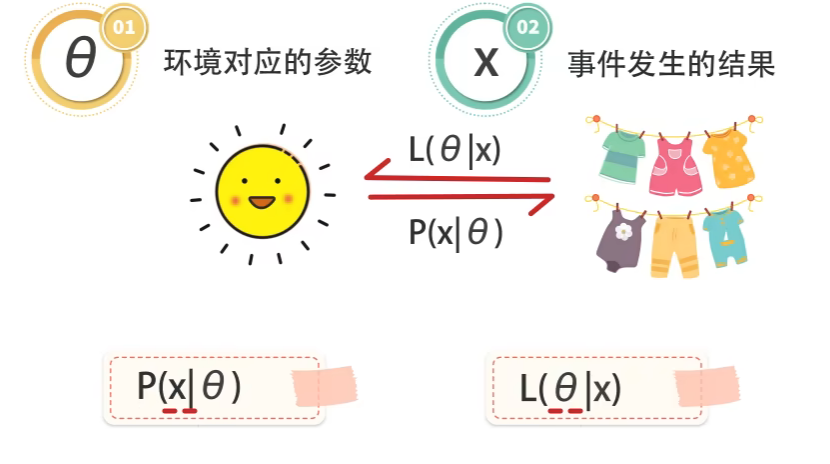

# Main Takeaway

主要介绍概率论与数理统计，后面添加一些概率论的部分

<!--more-->

[概率论与数理统计公式大总结（最全） - 知乎 (zhihu.com)](https://zhuanlan.zhihu.com/p/513646655)

概率论与数理统计

【2023考研数学-余炳森（概率论与数理统计）-哔哩哔哩】 https://b23.tv/3MvbZax

[概率论与数理统计复习整理 - 知乎 (zhihu.com)](https://zhuanlan.zhihu.com/p/243215469)

不考：第二章2.4(四)，第四章条件数学期望/协方差矩阵，第五章马尔可夫不等式，

第六章附录，第七、八章检验，方差不等且未知

# 基本概念

## 样本空间、随机事件

- 随机试验（random experiment）对随机现象进行观察、记录或试验
  - 可在相同条件下重复进行
  - 每次试验结果出现前不确定，但事先知道试验的所有可能结果
  - 每次试验完成前不能预知哪一个结果会发生
- 样本空间(sample space)：随机试验的所有可能结果构成的**集合**（$S\space or\space \Omega$）

- 样本点(sample point)：样本空间S中的每一个元素

- 随机事件(sample event)简称事件(event)：样本空间的任一子集

  > Tips:常用A，B，C来表示，或者文字描述+{ }

- 基本事件(elementary event)：只含一个样本点的事件

## 事件的相互关系与运算

- 包含：$A\subset B$

- 相等：$A\sub B$ and $B\sub A,A=B$

- 互斥

- 和事件(union of events)：$A\cup B$

- 积事件(intersection of events)：$A \cap B,AB,A\cdot B$

- 互不相容(互斥)(mutually exclusive(disjoint))：$A \cap B=\varnothing$

- 互逆：$A\cup B=S,AB=\varnothing$逆事件/对立事件

  A的逆事件：$\bar A,or\space A^c$

- 差事件：$A-B=A\cap \bar B$

## 试验

- 独立试验
- 重复试验

# 随即事件及其概率

- 频率：$f_n(A)$随着n的增大渐趋稳定，记稳定值为p，有限可加性
- 概率：非负性，规范性P(S)=1，可列可加性——集合的元素可列的

样本点有限，每一点概率相等
$$
P(A)=\frac{A样本点}{S样本点}
$$
泰勒展开！！！[泰勒公式（简洁、清晰） - 知乎 (zhihu.com)](https://zhuanlan.zhihu.com/p/647356601)

条件概率：$P(B|A)=\frac{P(AB)}{P(A)},P(A)!=0$,非负性，规范性，可列可加性(具有概率的所有性质)

[概率论与数理统计之条件概率&乘法公式-CSDN博客](https://blog.csdn.net/qq_38689352/article/details/119394951#:~:text=P(AB) %3D P(B)P(A|B) P (A B) %3D P,| A) P (C | A B) )

## 概率推事件的关系 

否！什么都推不出

> P(AB)=0不能推出A,B互斥（可以交于一个点）

## 六大公式

- 求逆公式：$P(A)=1-P(\bar A)，P(B|A)=1-P(\bar B|A)$

  $P(\bar A \bar B)=P(\overline{ A \cup B})=1-P({ A \cup B})$

  $P(\bar A \cup \bar B)=P(\overline{AB})=1-P(AB)$

  > 见到条件概率先写公式，伞一起戴则交变并/并变交

- 加法公式：$P(A\bigcup B)=P(A)+P(B)-P(AB)$

  $P(A\bigcup B\bigcup C)=P(A)+P(B)+P(C)-P(AB)-P(AC)-P(BC)+P(ABC)$

- 减法公式：$P(A-B)=P(A\bar B)=P(A-AB)=P(A)-P(AB),ifB\subset A,则=P(A)-P(B)$

- 乘法公式：$P(AB)=P(A)\cdot P(B|A)=P(B)\cdot P(A|B)，if A,B独立，则=P(A)P(B)$

  $P(ABC)=P(A)P(B|A)P(C|AB)——复合函数求导有点像$

  

- 全概率公式：不漏不重,$B_i$是样本空间S的一个划分，则

  $P(A)=\sum P(B_i)P(A|B_i)=\sum P(AB_i)$

  何时用：若一组随机事件分为两个阶段，第一阶段多个可能，第二阶段B发生；（离、连）型随机变量求概率，视离散型取值情况为完备事件组用全概率公式求解

- Bayes公式：$P(A_i|B)=\frac{P(A_IB)}{P(B)},P(B)由全概率公式而来$（没啥新的东西）

> 相互独立和两两独立——相互独立必然两两独立，反之不一定成立。（相互独立更强）
>
> 两两独立代表任意两个事件之间是独立的；相互独立的概念，就是无论那些事件同时发生，都不影响到剩下随机事件发生的概率
>
> 相互独立有$P(ABC)=P(A)P(B)P(C)$；两两独立无
>
> 互不相容：互不相容又叫互斥，即**两个事件不能同时发生**

这个叫做Borromean rings，这图中间任意两个环事实上是不相交的，也就是说互相不影响。然而三个环在一起，却让这个整体结构解不开。

# 一维随机变量及其分布

[10分钟掌握概率论一维随机变量及其分布问题（考研、期末复习均可以用） - 知乎 (zhihu.com)](https://zhuanlan.zhihu.com/p/268870366)

维度：$a+b,a\cdot b,min\{a,b\}二元函数，数为一阶方阵，是一维向量$

## 基本概念

- 随机变量：样本空间S上的单值实值函数，$X=X(e),e\in S ,e为样本点$

  > $e$未必为数，X必为数（有随机性，且以一定的概率取值），映射——随机变量表示事件

- 分布函数：$F(x)=P\{X\leq x\}$为随机变量X的分布函数

  几何意义：X落在区间$(-\infty,x]$上的概率

  （1） $0\leq F(x)\leq 1$

  （2）$F(x)$ 单调不减

  （3）$F(x)$ 右连续，$F(x_0+0)=lim_{x\rightarrow x_0^+}F(x)=F(x_0)$——每个区间写为左闭右开则一定为处处右连续

  （4）$F(-\infty)=0，F(+\infty)=1$

  $P\{a<X\leq b\}=F(b)-F(a)$

  $P\{X=x_0\}=F(x_0)-F(x_0-0),F(x_0-0)=lim_{x\rightarrow x_0^-}F(x_0)$

  > 若F(X)在$x=x_0$处连续，则$P\{X=x_0\}=0,F(x_0^+)=F(x_0)=F(x_0^-)$

## 各种分布

**离散型随机变量**：X取值为有限或可列无穷多个，概率分布律：非负性，规范性

- 0-1分布：$X\sim B(1,p):P\{X=k\}=p^k(1-p)^{1-k},k=0,1$

- 二项分布(n重贝努里试验)：$X\sim B(n,p):P\{X=k\}=C_n^k p^k(1-p)^{n-k}$_——同分布，不是相等

- 泊松分布：$X\sim P(\lambda):P\{X=k\}=\frac{\lambda^k}{k!}e^{-\lambda},k=0,1,2...$

  [统计基础篇之十一：怎么理解泊松分布 - 知乎 (zhihu.com)](https://zhuanlan.zhihu.com/p/24711669)

  $λ>0$是常数，是区间事件发生率的均值。$e^{\lambda}$是单位时间发生平均概率。

  > 根据两个变量之间的关系，$\lambda$也可能改变

  [(5 封私信 / 59 条消息) 如何证明泊松分布的间隔时间符合指数分布？ - 知乎 (zhihu.com)](https://www.zhihu.com/question/33311259)

- 几何分布：$P\{X=k\}=p(1-p)^{k-1},k=1,2...$——事件A发生时所进行的试验次数X——有截止的贝努利

- 超几何分布：$P\{X=k\}=\frac{C_{N-M}^{n-k}C_M^k}{C_N^n}$

- 泊松定理:

$\lim_{n\rightarrow \infty}C_n^k p^k(1-p)^{n-k}=\frac{\lambda^k}{k!}e^{-\lambda},\\即n大(n>10)，p小(p<0.1)，np适中，则二项分布近似等于泊松分布，\lambda=np$

**连续性随机变量**：

- 概率密度函数：$F(x)=\int_{-\infty}^xf(t)dt$,非负性，规范性
- X为连续型随机变量，则$F(x)$必为连续函数
- $F\prime(x)=f(x),x为f(x)的连续点$

- $P\{a<X\leq b\}=F(b)-F(a)=\int_a^bf(x)dx$

常见的连续型随机变量

- 均匀分布：$X\sim U[a,b]$

  

- 正态分布：$X\sim N(\mu,\sigma^2)$

  

  特别地，若μ = 0,σ =1，称随机变量服从标准正态分布，概率密度函数表达式为：

​	分布函数为：

**注：正态分布具有以下性质**

（1）$\Phi(0)=\frac{1}{2}，\Phi(-a)=1-\Phi(a)$

（2）正态分布密度函数关于 $x=\mu$ 对称，即 $P(X<\mu)=P(X>\mu)=\frac{1}{2}$ ，特别的，标准正态分布密度函数关于 $x=0$ 对称

（3）若 $X \sim N(\mu,\sigma^{2})，则\frac{X-\mu}{\sigma} \sim N(0,1)$，该点非常非常重要

（4）若 $X \sim N(\mu,\sigma^{2})，则 P(a<X\leq b)=P(\frac{a-\mu}{\sigma}<\frac{X-\mu}{\sigma}\leq \frac{b-\mu}{\sigma})=\Phi(\frac{b-\mu}{\sigma})-\Phi(\frac{a-\mu}{\sigma})$

（5）$P\{|X-\mu|<k\sigma\}=\Phi(k)-\Phi(-k)=2\Phi(k)-1$

> 需要**对正态分布进行变换**，**变成标准正态分布后再带入进行计算**

- 指数分布：

密度函数：$f(x)=\lambda e^{-\lambda x},x>0,\lambda>0,记为X\sim E(\lambda)$

分布函数：$F(x)=1-e^{-\lambda x},x>0$

$P\{X>t_0+t\}=P\{X>t_0\}+P\{X>t\}$

> 无记忆性

## 随机变量函数的分布

设 X 是连续型随机变量，其密度函数为 $f_X(x)$ ，则 $Y=g(X)$ 也是连续型随机变量，它的分布函数为$ F_Y(y)=P\{Y\le y\}=P\{g(X)\le y\}=\int_{\{x|g(x)\le y\}}f(x)dx$

> 例：设随机变量 X 的概率密度为 $f_X(x) $，求
> $Y=aX+b,a>0$
> 解： $F_Y(y)=P\{aX+b\le y\}=P\{X\le \frac{y-b}{a}\}=F_X(\frac{y-b}{a})
> 所以 f_Y(y)=\frac{d}{dy}F_X(\frac{y-b}{a})=\frac{1}{a}f_X(\frac{y-b}{a})$

### 定理

设随机变量 X 具有密度概率$ f_X(x)，-\infty<x<+\infty$ ，函数 $g(x)$ 处处可导，且恒有 $g'(x)>0 （或恒有 g'(x)<0 ）$，则 $Y=g(X)$ 是来连续型随机变量，其概率密度为$ f_Y(y)=\left\{ \begin{aligned} & f_X(h(y))\cdot |h'(y)| &\alpha<x<\beta\\ &0&其他 \end{aligned} \right.$

其中$ \alpha=min\{g(-\infty),g(+\infty)\} ， \beta=max\{g(-\infty),g(+\infty)\} ， h(y) 是 g(x) $的反函数

- 设连续型随机变量X的分布函数F（x），记$Y=F(X)$,则$Y\sim U(0,1)$

# 小测

小测只有80.——主要原因就是这个概率式子的变化不熟悉，想想怎么去掉\bar，怎么变乘怎么变加

# 多维随机变量及其分布

[10分钟掌握概率论多维随机变量及其分布问题（考研、期末复习均可以用） - 知乎 (zhihu.com)](https://zhuanlan.zhihu.com/p/269261634)

## 基本概念

- 二元随机变量

- 离散型随机变量：若二元随机变量$(X,Y)$全部可能取到的不同值是有限对或无限对，则称$(X,Y)$是离散型随机变量

- 联合概率分布律：$P(X=x_i,Y=y_j)=p_{ij}$,画表格即可
  - $P_{ij}\geq 0,\sum\sum p_{ij}=1$ 

- 边际（边缘）分布律：每行/列求和而得

  

- 条件分布：$P(X=x_i|Y=y_j)=\frac{p_{ij}}{p_{*j}}$,为在$\{Y=y_j\}$条件下，随机变量X的条件分布律

  不仅只有这个条件，任何条件都行

- 联合分布函数：$F(x,y)=P(X\leq x,Y\leq y)$
  - 单调不减
  - 右连续
  - 一个为负无穷则为0，同时为正无穷才为1

- 边际分布函数：$F_X(x)=F(x,\infty),F_Y(y)=F(\infty,y)$

- 条件分布函数：若$P(Y=y)>0$则在$\{Y=y\}条件下，X$的条件分布函数为$F_{X|Y}(x|y)=P(X\le x|Y=y)$

  若$P(Y=y)=0$，但对任给$\epsilon>0,P(y<Y\le y+\epsilon)>0$则在$\{Y=y\}$条件下，仍记为：$F_{X|Y}(x|y)=P(X\le x|Y=y)$

  

- 联合概率密度函数：如果存在非负函数$f(x,y),s.t.F(x,y)=\int_{-\infty}^y\int_{-\infty}^x f(u,v)dudv$

  称$(X,Y)$为二元连续型随机变量，$f(x,y)$为概率密度函数

  

- 边际概率密度函数：$f_X(x)=\int_{-\infty}^{+\infty}f(x,y)dy,F_X(x)=\int_{-\infty}^{u}f_X(u)du$

- 条件概率密度函数：$f_{X|Y}(x|y)=\frac{f(x,y)}{f_Y(y)}$

> 只要是函数，就是分段形式

## 各种分布

- 均匀分布：二元均匀分布的条件分布仍为均匀分布

- 二元正态分布：$(X,Y)\sim N(\mu_1,\mu_2,\sigma_1^2,\sigma_2^2,\rho)$，二元正态分布的边际分布和条件分布是正态分布，并且都不依赖于$\rho$

  边际分布：$X\sim N(\mu_1,\sigma_1^2)$

  条件分布：$在\{Y=y\}条件下，X\sim N(\mu_1+\rho\frac{\sigma_1}{\sigma_2}(y-\mu_2),(1-\rho^2)\sigma_1^2)$

## 性质

- 随机变量的独立性：若$F(x,y)=F_X(x)F_Y(y)$，则X，Y相互独立

  - 离散型：$P(X=x_i,Y=y_i)=P(X=x_i)P(Y=y_i)$

  - 连续型：$f(x,y)=f_X(x)_Yf(y)$

    连续型随机变量X，Y相互独立的充分必要条件是$f(x,y)=m(x)\cdot n(y)$
  
  - 二维正态随机变量(X,Y)，X与Y相互独立的充要条件是参数$\rho =0$

## 二元随机变量的函数的分布

- Z=X+Y的密度函数为：$f_Z(z)=\int_{-\infty}^{+\infty}f(x,z-x)dx$

  当X与Y相互独立时，卷积公式：$f_Z(z)=\int_{-\infty}^{+\infty}f_X(x)f_Y(z-x)dx=\int_{-\infty}^{+\infty}f_X(z-y)f_Y(y)dx$

- 正态分布：一般地，设X与Y相互独立$X\sim N(\mu_1,\sigma_1^2),Y\sim N(\mu_2,\sigma_2^2)$则

  $Z=X+Y\sim N(\mu_1+\mu_2,\sigma_1^2+\sigma_2^2)$

  

> 计算概率密度函数时有两种方法：1、利用公式，2、先求分布函数然后求导得概率密度函数

- $M=max\{X,Y\},N=min\{X,Y\}$的分布：（以下均为相互独立的情况）

  $F_{max}(z)=F_X(z)F_Y(z)$

  $F_{min}(z)=1-(1-F_X(z))(1-F_Y(z))$

- 

## 做题

看看PPT里面124页串并联的问题

- 函数都要分段，写范围！
- 计算边际分布函数时，如果一个变量的范围是另一个变量的函数，在计算其边际分布时，要把另一个变量的范围表示为这个变量的函数——一般会分段讨论

- 既非连续又非离散型的随机变量：（记住一个）

  

  

# 随机变量的数字特征

## 数学期望

- 数学期望(期望，均值)：

  - 离散：$E(X)=\sum x_kp_k$

  - 连续：$E(X)=\int_{-\infty}^{+\infty}xf(x)dx$

    > E(X)必须收敛，无穷级数发散则不存在数学期望

  - $X\sim P(\lambda):E(X)=\lambda;X\sim \lambda e^{-\lambda x},E(X)=\frac{1}{\lambda},\\X\sim B(n,p):E(X)=np,Var(X)=np(1-p)$

  - $X\sim N(\mu,\sigma^2),标准正态变量Z=\frac{X-\mu}{\sigma},E(Z)=0,Var(Z)=1,\\E(X)=\mu,Var(X)=\sigma^2$

- 随机变量函数的数学期望：

  $Y=g(X)$（连续函数）——可推广到多元

  - 离散：$E(Y)=\sum g(x_k)p_k$
  - 连续：$E(Y)=\int_{-\infty}^{+\infty}g(x)f(x)dx$

  $Z=h(X,Y)$（连续函数）

  - 离散：$E(Z)=\sum\sum h(x_i,y_i)p_{ij}$
  - 连续：$E(Z)=\int_{-\infty}^{+\infty}\int_{-\infty}^{+\infty}h(x,y)f(x,y)dxdy$

  > 不必管Y怎样，只用X即可算出	

- 特性：
  - 数学期望有线性性质
  - 若X，Y相互独立，则$E(XY)=E(X)E(Y)$

- 将X分解成数个随机变量之和，然后利用随机变量和的数学期望等于随机变量数学期望之和来求数学期望

- 泊松分布的均值和方差都是$\lambda$

## 方差

- 方差：$Var(X)=E\{[X-E(X)]^2\}$，刻画分散程度
  - 离散：$Var(X)=\sum [x_k-E(X)]^2p_k$
  - 连续：$Var(X)=\int_{-\infty}^{+\infty}[x_k-E(X)]^2f(x)dx$
  - $Var(X)=E(X^2)-[E(X)]^2$
- 标准差（均方差）：$\sigma(X)=\sqrt{Var(X)}$

- 性质：

  - $Var(C)=0,Var(CX)=C^2Var(X)$

  - $Var(X+Y)=Var(X)+Var(Y)+2E\{[X-E(X)][Y-E(Y)]\}$

    若X，Y相互独立，则$Var(X+Y)=Var(X)+Var(Y)$

  - 若X，Y相互独立：则$Var(aX+bY+c)=a^2Var(X)+b^2Var(Y)$

- 独立的n个正态变量的线性组合仍服从正态分布

  $C_0+C_1X_1+...\sim N(C_0+C_1\mu_1+...,C_1^2\sigma_1^2+C_2^2\sigma_2^2+...)$

## 协方差

- 协方差：$Cov(X,Y)=E\{[X-E(X)][Y-E(Y)]\}$
  - $Cov(X,Y)=E(XY)-E(X)E(Y)$
  - 有线性性质（把Cov想象成内积）
  - 

> 正态分布协方差：$\rho \sigma_1\sigma_2$r

## 相关系数

**线性关系**紧密程度

- 相关系数：$\rho_{XY}=\frac{Cov(X,Y)}{\sqrt{Var(X)Var(Y)}}=Cov(\frac{X-E(X)}{\sqrt{Var(X)}},\frac{Y-E(Y)}{\sqrt{Var(Y)}})=\rho$

  - $|\rho_{XY}|\le 1$

  - 

  - 当$\rho_{XY}>0$时，称X与Y为正相关

  - 当$\rho_{XY}<0$时，称X与Y为负相关

  - 当$\rho_{XY}=0$时，称X与Y为不相关或零相关

    

> 对于二元正态变量（X，Y）来说，X和Y不相关等价于X与Y相互独立
>
> 注意变换，避免硬算

## 其他数字特征

- 矩

  

- 分位数

  $P\{X>x_\alpha\}=\alpha的实数x_\alpha$为X的上$\alpha$分位数

- n元随机变量X的数学期望（向量）——每个分量都是自己的数学期望

- 协方差矩阵：

  对称的非负定矩阵

- n元正态变量的性质：
  - 
  - 正态变量的线性变换不变性
  - 服从n元正态分布，协方差矩阵为对角矩阵——变量相互独立——变量两两不相关

- n元正态分布$\sim N(a,B),B$就是协方差矩阵
- 

## 做题

- n元正态分布见题B.33

# 大数定律和中心极限定理

## 大数定律

**大数定律告诉我们能用频率近似代替概率；能用样本均值近似代替总体均值**

- 依概率收敛

  

  > 这种收敛性是在概率意义下的一种收敛，而不是数学意义上的一般收敛

一致收敛

- 马尔可夫不等式：设随机变量Y的k阶矩存在（$k\geq 1$）

  则对于任一$\epsilon>0$都有：$P\{|Y|\geq \epsilon\}\leq \frac{E\{|Y|^k\}}{\epsilon^k}$

  

- 切比雪夫不等式（嘴嘴不等式。）

  

### 几个大数定理

- 弱大数定理：

- 

  > 怎么找C？求数学期望，再求极限

- 切比雪夫大数定理：

  > 期望和方差均存在且相同

  

  > 要求每个方差都要存在

- 辛钦大数定律：独立同分布（比切比雪夫的条件要求更强but）

  > 方差存在不要求
  >
  > 独立同分布，期望存在

  

- 贝努里大数定律

  

## 中心极限定理

中心极限定理（central limit theorem/CLT）是概率论（probability theory）一个非常重要的结论，它指出在一定条件下，独立（independent）随机变量的标准化的（normalized）和随样本量（sample size）变大会趋向正态分布（normal distribution），即它的累积分布函数（cumulative distribution function/CDF）会收敛于标准正态分布（standard normal distribution）

中心极限定理不要求随机变量本身是正态分布的，所以它带来一个非常重要的结果：在一定条件下，我们可以使用对正态分布成立的方法去应对非正态分布

- 独立同分布的中心极限定理

  

  > 前N项标准变量服从正态分布的分布函数
  >
  > $\sum X_i\sim N(n\mu,n\sigma^2)$

- 二项分布的正态近似：$B(n,p)\sim N(np,np(1-p))$当n充分大时

  化为标准正态分布查表

## 做题

都是由已知概率推未知概率

- 用切比雪夫不等式，就是代入就行。（算出均值和方差）

- 

- 正态分布的均值$E(X^2)=D(X)+E(X)^2$

# 统计量与抽样分布

【6.2 常用统计量的分布 习题讲解】https://www.bilibili.com/video/BV1Br4y1Q7xv?vd_source=93bb338120537438ee9180881deab9c1

## 一些概念

- 总体：研究对象的全体； 
- 个体：总体中的成员；
- 总体的容量：总体中包含的个体数；
- 有限总体：容量有限的总体；
- 无限总体：容量无限的总体，通常将容量非常大的总体也按无限总体处理

简单随机样本：

- 代表性：每个Xi与X同分布

- 独立性：相互独立

  > 后面提到的样本均指简单随机样本

常见统计量：

> 区分总体均值和样本均值；
>
> 样本方差：方差除以n-1
>
> 我们总体除以n的原因是什么？实际上是每个出现的概率为n分之一，因为每一项都是自由变换的。那为啥样本是除以（n—1）呢？实际上也是乘的概率，样本的n项其实如果确定了（n—1）项第n项就百分百确定，所以每一项出现的概率只有（n—1）分之一

##   三种分布

- $\chi^2$分布

  

  性质：

  - $E(\chi^2)=n,Var(\chi^2)=2n$

  - 分布可加性：

    

  - 上$\alpha$分位数

    

- t分布

  

  $T=\frac{X}{\sqrt{Y/n}}\sim t(n)$,n越大，越趋近于正态分布$N(0,1)$

  

  > $t_{1-\alpha}(n)=-t_\alpha(n)$

- F分布

  

  $F=\frac{X/n_1}{Y/n_2}\sim F(n_1,n_2);F^{-1}\sim F(n_2,n_1)$
  
  F(1-a)(n1，n2)=1/(Fa(n2，n1))

## 其他

- $\frac{(n-1)S^2}{\sigma^2}\sim \chi^2(n-1)$
- $\bar X与S^2$相互独立

## 做题

[通过卷积公式推导二元正态分布的衍生结论 - 知乎 (zhihu.com)](https://zhuanlan.zhihu.com/p/666635928)

二元正态分布$Z=X+Y\sim (\mu_1+\mu_2,\sigma_1^2+\sigma_1^2+2\rho\sigma_1\sigma_2)$

# 参数估计

[10分钟掌握数理统计参数估计问题求解（考研、期末复习均可以用） - 知乎 (zhihu.com)](https://zhuanlan.zhihu.com/p/299600620)

参数：反映总体某方面特征的量

当总体的参数未知时，需要利用样本资料对其给出估计——参数估计

## 点估计

常用的点估计方法：矩估计法和极大似然估计法——两者计算就是套路性问题

- 矩估计——就是微积分

  计算期望，令期望=样本均值，求出$\theta$的函数

  一个参数用期望，两个参数用期望+方差

  

  > 在实际应用时，也可以**用中心矩代替原点矩**，相应地，以样本中心矩估计总体中心矩
  >
  > 公式关系是矩估计量；代入特定值是矩估计值
  >
  > $B_2$就是二阶中心矩

  

  矩估计就是求期望和方差

- 极大似然估计法：MLE

  

  - 写似然函数（直接写or写对数都一样），求导=0（maybe不行）——多个参数分别求导
  - 其他（即求导=0无解）用关于某个$\theta$单调增（减）来求——小于最小的，大于最大的
  
  
  
  连续函数就是密度函数，离散函数就是求概率分布

## 估计量的评选准则

本质还是计算期望和方差

- 无偏准则：$E(\hat \theta)=\theta$

  

  $B_2=\frac{n-1}{n}S^2$

  $\bar X和方差S^2$分别是$\mu和\sigma^2$的无偏估计

  纠偏方法（仅线性）：if $E(\hat \theta)=a\theta +b$，则$(\hat \theta-b)/a是\theta$的无偏估计

  无偏性的统计意义：在大量重复试验下，估计值的平均恰是系统平均，从而无偏性保证了$\hat \theta$没有系统误差

  

- 可估函数：实函数$g(\theta)$，若$g(\theta)$无偏估计量存在且$E_\theta(T)=g(\theta)$，则$g(\theta)$可估

- 有效性准则——无偏的也有很多，选有效的

  

  在两者都是无偏的情况下，比较方差（小的更有效）

  $Var(\bar x)=\frac{Var(x)}{n}$

- 均方误差准则

  

  $E(\hat\theta-\theta)^2=Mse(\hat\theta)=Var(\hat\theta)+[E(\hat \theta)-\theta]^2$

  若$\hat\theta$为无偏估计则$Mse(\hat\theta)=Var(\hat\theta)$

  **优于**：有效一定优于，由于不一定有效

- 相合性准则

  

  上一章的几个大数定理的应用P——$A_k\rightarrow \mu_k$

>  不能用几个大数定律，就试试从概念出发，用用两个不等式

## 区间估计

### 置信区间

$$
P\{\hat\theta_L<\theta<\hat\theta_U\}\geq 1-\alpha
$$

$$
(\hat\theta_L,\hat\theta_U)是\alpha的双侧置信区间，1-\alpha为置信水平/置信度
$$

单侧：

双侧和单侧的关系：$P\{\hat\theta_L<\theta<\hat\theta_U\}=1-P\{\hat\theta_L<\theta\}-P\{\theta<\hat\theta_U\}\geq 1-\alpha_1-\alpha_2$

- 精确度：置信区间的平均长度$E(\hat\theta_U-\hat\theta_L)$为区间的精确度
- 误差限：$\frac{E}{2}$

> 在给定的样本容量下，置信水平和精确度是相互制约的

Neman原则：置信度达到一定的前提下，选取精确度尽可能低（E 小）的区间

区间怎么求——枢轴量法

### 枢轴量法

G不依赖于$\theta$，且完全已知

枢轴量和统计量的区别：

- 枢轴量是样本和**待估参数**的函数，其分布不依赖于任何未知参数——分布已知
- 统计量只是样本的函数（函数含有未知参数就不是统计量），其**分布**常常依赖于未知参数

构造置信区间具体步骤：

> 枢轴量从$\theta$点估计进行改造，然后选最优解（一般上下取$\alpha/2$即可）

### 正态总体下常见枢轴量

：（一般就分为$\sigma^2$已知和未知两种情况）

## 做题

- 

$$
B_2=\frac{n-1}{n}S^2
$$

- 样本方差的方差

  [怎样推导 Var(S^2)= (2*σ^4)/(n-1)_百度知道 (baidu.com)](https://zhidao.baidu.com/question/2203283260489678468.html)

  如果$x\sim N(\mu.\sigma^2)$则：
  $$
  Var(S^2)=\frac{2*\sigma^4}{n-1}
  $$
  

# 假设检验

## 基本思想

假设检验包括

- 已知总体分布的形式，需对其中的未知参数给出假设检验. —参数检验
- 总体的分布形式完全未知的情况下，对总体的分布或数字特征进行假设检验.—非参数检验

假设：

- 原假设（零假设）$H_0$
- 备择假设（对立假设）$H_1$

检验统计量和拒绝域

- 拒绝域：判断原假设不成立

两类错误

- 拒绝真实的原假设（去真）——显著性水平$\alpha=1-置信度水平$
  $$
  \alpha=P\{第一类错误\}=P\{拒绝H_0|H_0是真实的\}
  $$
  
- 接收错误的原假设（存伪）
  $$
  \beta=P\{第二类错误\}=P\{接受H_0|H_0是错误的\}
  $$

- P-值与统计显著性

  P-越小，拒绝$H_0$的理由越充分
  $$
  P-值=P_{H_0}\{|Z|\ge |z_0|\}
  $$
  

## 单正态分布总体的均值和方差

和参数估计那四个一样

- 双边检验$U_{\frac{\alpha}{2}}$
- 单边检验$U_{\alpha}$

## 双正态分布总体的均值和方差

- $\mu$

我们假设检验$\sigma$时还有一种情况：

当$\sigma_1^2=\sigma_2^2=\sigma^2$但未知时：如上述公式

当$\sigma_1^2\neq\sigma_2^2$且未知时：检验统计量$T=\frac{\overline X-\overline Y}{\sqrt{\frac{S_1^2}{n_1}+\frac{S_2^2}{n_2}}}$

此时若两样本容量都充分大，则$T\sim N(0,1)$

若样本较小，则$T\sim t(k),k=min(n_1-1,n_2-1)$

- $\sigma^2$

## 假设检验与区间估计

显著性水平$\alpha=1-置信度水平$

## 拟合优度检验

看频数

又叫卡方拟合优度检验
$$
H_0:F(X)=F_0(x)
$$

若n充分大，则当$H_0$为真时，统计量$\chi^2\sim \chi^2(k-r-1)$，k为分类数,r为$F_0(x)$中含有的未知参数个数

> n要足够大，$np_i$不能太小，$n\ge 50,np_i\ge5$(否则要适当合并相邻的类，以满足要求)

# 方差分析与回归分析

之前我们都是一个总体或两个总体的统计分析问题。现在我们研究多个总体

方差分析主要用来比较不同组之间的均值是否存在显著差异

## 单因素方差分析

方差分析的目的就是要比较因素A 的r 个水平下试验指标理论均值的差异**,** 问题可归结为比较这r个总体的均值差异

前提条件：

$$
y_{ij}=\mu_i+\epsilon_{ij}(随机误差),\epsilon_{ij}相互独立，都服从N(0,\sigma^2)
$$

$$
总均值:\mu=\frac{1}{r}\sum\mu_i,水平效应:\alpha_i=\mu_i-\mu
$$

变异数分析——组间，组内

> $\delta$就是上面的$\alpha$

统计量：
$$
F=\frac{MS_A}{MS_e}=\frac{S_A/f_A}{S_e/f_e}
$$

未知参数的估计：

## 一元线性回归

## 回归诊断

# 期末

- 四个枢轴量很重要！！！、

- 各种分布的方差、期望！！！、

- 如何判断两个变量是否独立
  - $P(A,B)=P(A)P(B)$
  
- 判断两个变量是否相关：$Cov(A,B)=0$
  
- 一些重要公式
  
  - $Cov(X,Y)=E(XY)-E(X)E(Y)$——协方差的计算$Cov(X,Y)=E\{[X-E(X)][Y-E(Y)]\}$
  
  - 条件概率密度函数：$f_{X|Y}(x|y)=\frac{f(x,y)}{f_Y(y)}$
  
  - $E(\chi^2)=n,Var(\chi^2)=2n$
  
  - $\frac{(n-1)S^2}{\sigma^2}\sim \chi^2(n-1)$
  
  - $\bar X与S^2$相互独立
  
  - $Var(X+Y)=Var(X)+Var(Y)+2E\{[X-E(X)][Y-E(Y)]\}$
  
    若X，Y相互独立，则$Var(X+Y)=Var(X)+Var(Y)$
  
  - 若X，Y相互独立：则$Var(aX+bY+c)=a^2Var(X)+b^2Var(Y)$
  
  - 二元正态分布$Z=X+Y\sim (\mu_1+\mu_2,\sigma_1^2+\sigma_1^2+2\rho\sigma_1\sigma_2)$
  
  - 均方误差：
  
    $E(\hat\theta-\theta)^2=Mse(\hat\theta)=Var(\hat\theta)+[E(\hat \theta)-\theta]^2$
  
    若$\hat\theta$为无偏估计则$Mse(\hat\theta)=Var(\hat\theta)$

- 设随机变量 X 具有密度概率$ f_X(x)，-\infty<x<+\infty$ ，函数 $g(x)$ 处处可导，且恒有 $g'(x)>0 （或恒有 g'(x)<0 ）$，则 $Y=g(X)$ 是来连续型随机变量，其概率密度为$ f_Y(y)=\left\{ \begin{aligned} & f_X(h(y))\cdot |h'(y)| &\alpha<x<\beta\\ &0&其他 \end{aligned} \right.$

- 正态分布极大似然估计和据估计得$\sigma^2$的估计是不一样的

- 指数函数的分布函数

- 

- 马尔可夫不等式：设随机变量Y的k阶矩存在（$k\geq 1$）

  则对于任一$\epsilon>0$都有：$P\{|Y|\geq \epsilon\}\leq \frac{E\{|Y|^k\}}{\epsilon^k}$

- [5个常见分布的最大似然估计 - 知乎 (zhihu.com)](https://zhuanlan.zhihu.com/p/55468998)
  
  - 可能不是无偏估计（如$\sigma^2$）——如果不是判断是不是相合估计
  
- 无偏估计是**均值**与估计量相等

  $\bar X和方差S^2$分别是$\mu和\sigma^2$的无偏估计：$E(S^2)=\sigma^2$

- 拟合优度——先用极大似然拟合那个服从的概率，再代入公式计算

  - 若n充分大，则当$H_0$为真时，统计量$\chi^2\sim \chi^2(k-r-1)$，k为分类数,r为$F_0(x)$中含有的未知参数个数

    > n要足够大，$np_i$不能太小，$n\ge 50,np_i\ge5$(否则要适当合并相邻的类，以满足要求)

- 既非连续又非离散型的随机变量：（记住一个）

  

  

- 独立同分布的中心极限定理

  

- 用切比雪夫不等式，就是代入就行。（算出均值和方差）

- 

- 矩估计后由辛勤大叔定理得是相合估计量

- 当用极大似然估计得单调取min or max时——判断是不是无偏估计

  先算F分布函数(用下方这个公式计算)，然后求导得f，进而计算E($\theta$)

+

------

下面介绍概率论其它的相关知识

# 贝叶斯

[贝叶斯---最大似然估计（高翔slam---第六讲 ） - Jessica&jie - 博客园 (cnblogs.com)](https://www.cnblogs.com/Jessica-jie/p/8846493.html)

贝叶斯——最大似然估计
$$
P(x|z)=\frac{P(z|x)P(x)}{P(z)}
$$
其中$P(x|z)$为后验，$P(z|x)$为似然，$P(x)$为先验

概率：用来描述已知分布参数得到的观测结果

似然：已知观测结果，对分布参数进行估计或者猜测

极大似然估计：已知观测结果，反推最大概率导致这些样本结果出现的模型参数

最小二乘估计经过数学推导其实就是极大似然估计在高斯分布下的一种特殊形式

测试结果为人像朝上7次，数字朝上3次

